A comprehensive multi-level analysis of the Bucharest Early Intervention
Project: Causal effects on recovery from severe deprivation
================
2022

- <a href="#set-up-environment" id="toc-set-up-environment">Set up
  environment</a>
- <a href="#read-in-data" id="toc-read-in-data">Read in data</a>
- <a href="#descriptives" id="toc-descriptives">Descriptives</a>
  - <a href="#supplemental-tables" id="toc-supplemental-tables">Supplemental
    Tables</a>
  - <a href="#supplemental-analyses-missingness"
    id="toc-supplemental-analyses-missingness">Supplemental Analyses:
    Missingness</a>
  - <a href="#consort-diagram" id="toc-consort-diagram">CONSORT diagram</a>
- <a href="#remove-cases-with-missing-data-for-value-from-dataset"
  id="toc-remove-cases-with-missing-data-for-value-from-dataset">Remove
  cases with missing data for “value” from dataset</a>
- <a href="#create-subsetted-data-frames"
  id="toc-create-subsetted-data-frames">Create subsetted data frames</a>
  - <a href="#subset-iq-eeg-and-physical-growth-data"
    id="toc-subset-iq-eeg-and-physical-growth-data">Subset IQ, EEG, and
    physical growth data</a>
  - <a href="#subset-psychopathology-data"
    id="toc-subset-psychopathology-data">Subset psychopathology data</a>
  - <a href="#subset-fcg-data" id="toc-subset-fcg-data">Subset FCG data</a>
- <a href="#distributions" id="toc-distributions">Distributions</a>
  - <a href="#age" id="toc-age">Age</a>
  - <a href="#iq" id="toc-iq">IQ</a>
  - <a href="#eeg" id="toc-eeg">EEG</a>
  - <a href="#physical-size" id="toc-physical-size">Physical size</a>
  - <a href="#adhd" id="toc-adhd">ADHD</a>
  - <a href="#internalizing" id="toc-internalizing">Internalizing</a>
  - <a href="#externalizing" id="toc-externalizing">Externalizing</a>
  - <a href="#dsed" id="toc-dsed">DSED</a>
  - <a href="#rad" id="toc-rad">RAD</a>
  - <a href="#age-of-placement-in-foster-care"
    id="toc-age-of-placement-in-foster-care">Age of placement in foster
    care</a>
  - <a href="#stability-of-foster-care-placement"
    id="toc-stability-of-foster-care-placement">Stability of foster care
    placement</a>
- <a href="#descriptives-raw-measurement-values"
  id="toc-descriptives-raw-measurement-values">Descriptives: Raw
  measurement values</a>
  - <a href="#means-sds" id="toc-means-sds">Means, SDs</a>
- <a href="#correlations" id="toc-correlations">Correlations</a>
- <a href="#results" id="toc-results">Results</a>
  - <a href="#aim-1" id="toc-aim-1">Aim 1</a>
  - <a href="#aim-2" id="toc-aim-2">Aim 2</a>
  - <a href="#aim-3" id="toc-aim-3">Aim 3</a>
- <a href="#visualizations-of-effects"
  id="toc-visualizations-of-effects">Visualizations of effects</a>
  - <a href="#aim-1-main-effects" id="toc-aim-1-main-effects">Aim 1 main
    effects</a>
  - <a href="#aim-2-moderating-effects"
    id="toc-aim-2-moderating-effects">Aim 2 moderating effects</a>
  - <a href="#aim-3-1" id="toc-aim-3-1">Aim 3</a>
- <a href="#supplemental-analyses"
  id="toc-supplemental-analyses">Supplemental Analyses</a>
  - <a
    href="#associations-of-baseline-characteristics-with-stability-at-each-wave"
    id="toc-associations-of-baseline-characteristics-with-stability-at-each-wave">Associations
    of baseline characteristics with stability at each wave</a>
  - <a href="#aim-2-age-as-categorical"
    id="toc-aim-2-age-as-categorical">Aim 2: Age as categorical</a>
  - <a href="#aim-3-age-as-categorical"
    id="toc-aim-3-age-as-categorical">Aim 3: Age as categorical</a>
  - <a href="#visualize-effect-of-placement-stability-by-assessment-wave"
    id="toc-visualize-effect-of-placement-stability-by-assessment-wave">Visualize
    effect of placement stability by assessment wave</a>

``` r
knitr::opts_chunk$set(echo = TRUE, warning = FALSE, message = FALSE)
```

# Set up environment

``` r
#Libraries
library(lme4)
library(lmerTest)
library(tidyverse)
library(sjstats)
library(labelled)
library(ggResidpanel)
library(effectsize)
library(ggsci)
library(gt)
library(ggpubr)
library(parameters)
library(cowplot)
library(dplyr)
library(readr)
library(corrr)
library(glue)

source("R_rainclouds.R")

#Files__________________________________________________________________________
home <- "~/Desktop/Tulane/BEIP/comprehensive_analysis/"

cleaned_data_file <- paste0(home, "data/BEIP_big_analysis_tidied_data_20221013.csv")

#Aesthetics_____________________________________________________________________
theme_beip <-
  theme_pubr() +
  theme(
    panel.grid = element_blank(),
    plot.title = element_text(size = 18, hjust = .5),
    axis.title = element_text(size = 20),
    axis.text = element_text(size = 18),
    legend.title = element_text(size = 20), 
    legend.text = element_text(size = 20),
    strip.text = element_text(size = 16),
    legend.position = "bottom"
  )

#Other__________________________________________________________________________
options(scipen = 999) # turn off scientific notation 
set.seed(123456)
cbbPalette <- c(
  "#000000", 
  "#E69F00", 
  "#56B4E9", 
  "#009E73", 
  "#F0E442", 
  "#0072B2", 
  "#D55E00", 
  "#CC79A7"
)
```

# Read in data

``` r
d  <-
  read_csv(cleaned_data_file) %>% 
  filter(group != "NIG") %>% 
  mutate(
    male = as.factor(male),
    informant = as.factor(informant),
    ethnic = factor(
      ethnic,
      levels = c(0, 1, 2, 3),
      labels = c("Romanian", "Rroma", "Unknown", "Other")
    ),
    wave_ordered = fct_relevel(
      wave,
      "30m", "42m", "54m", "8y", "12y", "16-18y"
    ),
    stable = as.factor(stable)
  ) %>% 
  group_by(ID) %>% 
  mutate(
    stability_group = as.factor(
      case_when(
        group == "FCG" & min(stable_num) == 0 ~ "FCG, Disrupted",
        group == "FCG" & min(stable_num) == 1 ~ "FCG, Stable",
        group == "CAUG" ~ "CAUG"
      )
    )
  ) %>% 
  ungroup()
```

# Descriptives

## Supplemental Tables

### Baseline characteristics

``` r
d_baseline_physical <-
  d %>%
  filter(wave == "BL", construct == "physical") %>% 
  distinct(ID, value, .keep_all = TRUE) %>% 
  pivot_wider(
    id_cols = c(ID, group),
    names_from = domain,
    values_from = value
  )

d_baseline_physical %>% 
  group_by(group) %>% 
  summarise(
    mean_height = mean(height, na.rm = TRUE),
    sd_height =  sd(height, na.rm = TRUE),
    mean_weight = mean(weight, na.rm = TRUE),
    sd_weight =  sd(weight, na.rm = TRUE)
  )
```

    ## # A tibble: 2 × 5
    ##   group mean_height sd_height mean_weight sd_weight
    ##   <chr>       <dbl>     <dbl>       <dbl>     <dbl>
    ## 1 CAUG         80.1      7.99        10.3      2.21
    ## 2 FCG          80.6      6.81        10.3      1.91

``` r
t.test(d_baseline_physical$height ~ d_baseline_physical$group)
```

    ## 
    ##  Welch Two Sample t-test
    ## 
    ## data:  d_baseline_physical$height by d_baseline_physical$group
    ## t = -0.38602, df = 112.35, p-value = 0.7002
    ## alternative hypothesis: true difference in means between group CAUG and group FCG is not equal to 0
    ## 95 percent confidence interval:
    ##  -3.219820  2.169764
    ## sample estimates:
    ## mean in group CAUG  mean in group FCG 
    ##           80.06207           80.58710

``` r
t.test(d_baseline_physical$weight ~ d_baseline_physical$group)
```

    ## 
    ##  Welch Two Sample t-test
    ## 
    ## data:  d_baseline_physical$weight by d_baseline_physical$group
    ## t = 0.16835, df = 112.95, p-value = 0.8666
    ## alternative hypothesis: true difference in means between group CAUG and group FCG is not equal to 0
    ## 95 percent confidence interval:
    ##  -0.6870395  0.8146458
    ## sample estimates:
    ## mean in group CAUG  mean in group FCG 
    ##           10.32945           10.26565

``` r
d_baseline <-
  d %>%  
  filter(wave == "BL") %>% 
  distinct(ID, group, .keep_all = TRUE) %>% 
  mutate(
    romanian = ethnic == "Romanian"
  )

d_baseline %>% 
  group_by(group) %>% 
  summarise(
    mean_BW = mean(birth_weight, na.rm = TRUE),
    sd_BQ = sd(birth_weight,  na.rm = TRUE),
    mean_gest_age = mean(gestation_weeks, na.rm = TRUE),
    sd_gest_age = sd(gestation_weeks, na.rm = TRUE),
    mean_pct_inst = mean(pctinst, na.rm = TRUE),
    sd_pct_inst = sd(pctinst, na.rm = TRUE),
    min_pct_inst = min(pctinst, na.rm = TRUE),
    max_pct_inst = max(pctinst, na.rm = TRUE),
    mean_inst_age = mean(inst_entry_age, na.rm = TRUE),
    sd_ints_age = sd(inst_entry_age, na.rm = TRUE),
    mean_bl_age = mean(age_months, na.rm = TRUE),
    sd_bl_age = sd(age_months, na.rm = TRUE),
    min_bl_age = min(age_months, na.rm = TRUE),
    max_bl_age = max(age_months, na.rm = TRUE)
  )
```

    ## # A tibble: 2 × 15
    ##   group mean_BW sd_BQ mean_ges…¹ sd_ge…² mean_…³ sd_pc…⁴ min_p…⁵ max_p…⁶ mean_…⁷
    ##   <chr>   <dbl> <dbl>      <dbl>   <dbl>   <dbl>   <dbl>   <dbl>   <dbl>   <dbl>
    ## 1 CAUG    2830.  568.       37.6    1.50    86.0    21.6     0       100    2.46
    ## 2 FCG     2719.  629.       37.0    2.62    86.1    21.7    16.1     100    2.68
    ## # … with 5 more variables: sd_ints_age <dbl>, mean_bl_age <dbl>,
    ## #   sd_bl_age <dbl>, min_bl_age <dbl>, max_bl_age <dbl>, and abbreviated
    ## #   variable names ¹​mean_gest_age, ²​sd_gest_age, ³​mean_pct_inst, ⁴​sd_pct_inst,
    ## #   ⁵​min_pct_inst, ⁶​max_pct_inst, ⁷​mean_inst_age

``` r
t.test(d_baseline$age_months ~ d_baseline$group)
```

    ## 
    ##  Welch Two Sample t-test
    ## 
    ## data:  d_baseline$age_months by d_baseline$group
    ## t = 0.41446, df = 134, p-value = 0.6792
    ## alternative hypothesis: true difference in means between group CAUG and group FCG is not equal to 0
    ## 95 percent confidence interval:
    ##  -1.989960  3.045076
    ## sample estimates:
    ## mean in group CAUG  mean in group FCG 
    ##           21.01182           20.48426

``` r
t.test(d_baseline$birth_weight ~ d_baseline$group)
```

    ## 
    ##  Welch Two Sample t-test
    ## 
    ## data:  d_baseline$birth_weight by d_baseline$group
    ## t = 1.0317, df = 119.44, p-value = 0.3043
    ## alternative hypothesis: true difference in means between group CAUG and group FCG is not equal to 0
    ## 95 percent confidence interval:
    ##  -102.7583  326.3282
    ## sample estimates:
    ## mean in group CAUG  mean in group FCG 
    ##           2830.333           2718.548

``` r
t.test(d_baseline$gestation_weeks ~ d_baseline$group)
```

    ## 
    ##  Welch Two Sample t-test
    ## 
    ## data:  d_baseline$gestation_weeks by d_baseline$group
    ## t = 1.4888, df = 93.319, p-value = 0.1399
    ## alternative hypothesis: true difference in means between group CAUG and group FCG is not equal to 0
    ## 95 percent confidence interval:
    ##  -0.1963582  1.3731136
    ## sample estimates:
    ## mean in group CAUG  mean in group FCG 
    ##           37.57143           36.98305

``` r
t.test(d_baseline$pctinst ~ d_baseline$group)
```

    ## 
    ##  Welch Two Sample t-test
    ## 
    ## data:  d_baseline$pctinst by d_baseline$group
    ## t = -0.030545, df = 134, p-value = 0.9757
    ## alternative hypothesis: true difference in means between group CAUG and group FCG is not equal to 0
    ## 95 percent confidence interval:
    ##  -7.455721  7.228932
    ## sample estimates:
    ## mean in group CAUG  mean in group FCG 
    ##           85.96542           86.07882

``` r
d_baseline %>% 
  count(group, male) %>% 
  group_by(group) %>% 
  mutate(per = n / sum(n))
```

    ## # A tibble: 4 × 4
    ## # Groups:   group [2]
    ##   group male      n   per
    ##   <chr> <fct> <int> <dbl>
    ## 1 CAUG  0        35 0.515
    ## 2 CAUG  1        33 0.485
    ## 3 FCG   0        34 0.5  
    ## 4 FCG   1        34 0.5

``` r
d_baseline %>% 
  count(group, ethnic) %>% 
  group_by(group) %>% 
  mutate(per = n / sum(n))
```

    ## # A tibble: 8 × 4
    ## # Groups:   group [2]
    ##   group ethnic       n    per
    ##   <chr> <fct>    <int>  <dbl>
    ## 1 CAUG  Romanian    34 0.5   
    ## 2 CAUG  Rroma       21 0.309 
    ## 3 CAUG  Unknown     12 0.176 
    ## 4 CAUG  Other        1 0.0147
    ## 5 FCG   Romanian    42 0.618 
    ## 6 FCG   Rroma       18 0.265 
    ## 7 FCG   Unknown      7 0.103 
    ## 8 FCG   Other        1 0.0147

``` r
table_sex <- table(d_baseline$male, d_baseline$group)
prop.test(table_sex)
```

    ## 
    ##  2-sample test for equality of proportions with continuity correction
    ## 
    ## data:  table_sex
    ## X-squared = 0, df = 1, p-value = 1
    ## alternative hypothesis: two.sided
    ## 95 percent confidence interval:
    ##  -0.1680655  0.1974836
    ## sample estimates:
    ##    prop 1    prop 2 
    ## 0.5072464 0.4925373

``` r
table_ethnic <- table(d_baseline$romanian, d_baseline$group)
prop.test(table_ethnic)
```

    ## 
    ##  2-sample test for equality of proportions with continuity correction
    ## 
    ## data:  table_ethnic
    ## X-squared = 1.4614, df = 1, p-value = 0.2267
    ## alternative hypothesis: two.sided
    ## 95 percent confidence interval:
    ##  -0.06359584  0.30219234
    ## sample estimates:
    ##    prop 1    prop 2 
    ## 0.5666667 0.4473684

``` r
d_baseline %>% 
  summarise(
    mean_age_bl = mean(age_months),
    max_age_bl = max(age_months),
    min_age_bl = min(age_months)
  )
```

    ## # A tibble: 1 × 3
    ##   mean_age_bl max_age_bl min_age_bl
    ##         <dbl>      <dbl>      <dbl>
    ## 1        20.7       31.8       5.39

``` r
# baseline: length of stay in institutional care (in months)
d_baseline <-
  d_baseline %>% 
  mutate(
    length_inst = age_months - inst_entry_age
  ) 

d_baseline %>% 
  group_by(group) %>% 
  summarise(
    mean_length_inst = mean(length_inst),
    min_length_inst = min(length_inst),
    max_length_inst = max(length_inst)
  )
```

    ## # A tibble: 2 × 4
    ##   group mean_length_inst min_length_inst max_length_inst
    ##   <chr>            <dbl>           <dbl>           <dbl>
    ## 1 CAUG              18.6           0.592            31.8
    ## 2 FCG               17.8           2.24             30.4

### Remove baseline data

``` r
#keep copy with it
d_withBL <-
  d
```

``` r
#overwrite "d" without it
d <-
  d %>% 
  filter(wave != "BL") %>% 
  ungroup()
```

### Export included ID list

``` r
IDs <-
  d %>% 
  filter(!is.na(value)) %>% 
  distinct(ID, group)

IDs_vector <-
  IDs %>% 
  pull(ID)

#write_csv(IDs, paste0(home, "data/included_IDs_20220215.csv"))
```

## Supplemental Analyses: Missingness

### Descriptives: Missingness out of all possible observations

``` r
d %>% 
  select(
    ID,
    n_obs,
    per_missing
  ) %>% 
  distinct(ID, n_obs, per_missing)  %>% 
  summarise_at(
    vars(n_obs, per_missing),
    funs(mean, median, min, max)
  )
```

    ## # A tibble: 1 × 8
    ##   n_obs_mean per_missing_mean n_obs_me…¹ per_m…² n_obs…³ per_m…⁴ n_obs…⁵ per_m…⁶
    ##        <dbl>            <dbl>      <dbl>   <dbl>   <dbl>   <dbl>   <dbl>   <dbl>
    ## 1       54.7            0.196         62  0.0882       9       0      68   0.868
    ## # … with abbreviated variable names ¹​n_obs_median, ²​per_missing_median,
    ## #   ³​n_obs_min, ⁴​per_missing_min, ⁵​n_obs_max, ⁶​per_missing_max

### Associations of baseline characteristics with missigness

``` r
d_BL_wide <-
  d_withBL %>%  
  filter(ID %in% IDs_vector) %>% 
  filter(wave == "BL") %>% 
  select(
    ID, 
    group, 
    per_missing,
    domain, 
    value
  ) %>% 
  pivot_wider(
    names_from = domain,
    values_from = value
  ) %>% 
  mutate(
    group = as.factor(group)
  )
```

``` r
t.test( d_BL_wide$per_missing ~ d_BL_wide$group)
```

    ## 
    ##  Welch Two Sample t-test
    ## 
    ## data:  d_BL_wide$per_missing by d_BL_wide$group
    ## t = 1.0279, df = 126.18, p-value = 0.306
    ## alternative hypothesis: true difference in means between group CAUG and group FCG is not equal to 0
    ## 95 percent confidence interval:
    ##  -0.03956109  0.12508146
    ## sample estimates:
    ## mean in group CAUG  mean in group FCG 
    ##          0.2169683          0.1742081

``` r
# regressions with simple effects for CAUG
contrasts(d_BL_wide$group) = c(0, 1)

# DSED
dsed_miss_lm <-
  lm(
    per_missing ~
      group * dsed,
    data = d_BL_wide
  )
summary(dsed_miss_lm)
```

    ## 
    ## Call:
    ## lm(formula = per_missing ~ group * dsed, data = d_BL_wide)
    ## 
    ## Residuals:
    ##      Min       1Q   Median       3Q      Max 
    ## -0.21990 -0.13809 -0.09377  0.03696  0.71147 
    ## 
    ## Coefficients:
    ##              Estimate Std. Error t value   Pr(>|t|)    
    ## (Intercept)  0.219897   0.047353   4.644 0.00000953 ***
    ## group1      -0.039159   0.068811  -0.569      0.570    
    ## dsed        -0.012744   0.015328  -0.831      0.408    
    ## group1:dsed -0.001427   0.021812  -0.065      0.948    
    ## ---
    ## Signif. codes:  0 '***' 0.001 '**' 0.01 '*' 0.05 '.' 0.1 ' ' 1
    ## 
    ## Residual standard error: 0.2168 on 110 degrees of freedom
    ##   (16 observations deleted due to missingness)
    ## Multiple R-squared:  0.02448,    Adjusted R-squared:  -0.002122 
    ## F-statistic: 0.9202 on 3 and 110 DF,  p-value: 0.4337

``` r
# RAD
rad_miss_lm <-
  lm(
    per_missing ~
      group * rad,
    data = d_BL_wide
  )
summary(rad_miss_lm)
```

    ## 
    ## Call:
    ## lm(formula = per_missing ~ group * rad, data = d_BL_wide)
    ## 
    ## Residuals:
    ##      Min       1Q   Median       3Q      Max 
    ## -0.19374 -0.14318 -0.09201  0.06245  0.66977 
    ## 
    ## Coefficients:
    ##              Estimate Std. Error t value  Pr(>|t|)    
    ## (Intercept)  0.180247   0.039379   4.577 0.0000124 ***
    ## group1       0.002985   0.056416   0.053     0.958    
    ## rad          0.003525   0.011460   0.308     0.759    
    ## group1:rad  -0.020434   0.016683  -1.225     0.223    
    ## ---
    ## Signif. codes:  0 '***' 0.001 '**' 0.01 '*' 0.05 '.' 0.1 ' ' 1
    ## 
    ## Residual standard error: 0.2154 on 111 degrees of freedom
    ##   (15 observations deleted due to missingness)
    ## Multiple R-squared:  0.02911,    Adjusted R-squared:  0.002866 
    ## F-statistic: 1.109 on 3 and 111 DF,  p-value: 0.3486

``` r
# ADHD
adhd_miss_lm <-
  lm(
    per_missing ~
      group * adhd,
    data = d_BL_wide
  )
summary(adhd_miss_lm)
```

    ## 
    ## Call:
    ## lm(formula = per_missing ~ group * adhd, data = d_BL_wide)
    ## 
    ## Residuals:
    ##      Min       1Q   Median       3Q      Max 
    ## -0.22360 -0.14260 -0.08492  0.04567  0.69510 
    ## 
    ## Coefficients:
    ##             Estimate Std. Error t value   Pr(>|t|)    
    ## (Intercept)  0.22360    0.04643   4.816 0.00000455 ***
    ## group1      -0.11161    0.06533  -1.708     0.0903 .  
    ## adhd        -0.05105    0.05227  -0.977     0.3308    
    ## group1:adhd  0.10692    0.07678   1.392     0.1665    
    ## ---
    ## Signif. codes:  0 '***' 0.001 '**' 0.01 '*' 0.05 '.' 0.1 ' ' 1
    ## 
    ## Residual standard error: 0.2179 on 114 degrees of freedom
    ##   (12 observations deleted due to missingness)
    ## Multiple R-squared:  0.02501,    Adjusted R-squared:  -0.0006502 
    ## F-statistic: 0.9747 on 3 and 114 DF,  p-value: 0.4074

``` r
# externalizing
extern_miss_lm <-
  lm(
    per_missing ~
      group * extern,
    data = d_BL_wide
  )
summary(extern_miss_lm)
```

    ## 
    ## Call:
    ## lm(formula = per_missing ~ group * extern, data = d_BL_wide)
    ## 
    ## Residuals:
    ##      Min       1Q   Median       3Q      Max 
    ## -0.23280 -0.14353 -0.09078  0.06189  0.66450 
    ## 
    ## Coefficients:
    ##               Estimate Std. Error t value   Pr(>|t|)    
    ## (Intercept)    0.23280    0.04766   4.884 0.00000342 ***
    ## group1        -0.06956    0.06595  -1.055      0.294    
    ## extern        -0.08236    0.06979  -1.180      0.240    
    ## group1:extern  0.05165    0.10162   0.508      0.612    
    ## ---
    ## Signif. codes:  0 '***' 0.001 '**' 0.01 '*' 0.05 '.' 0.1 ' ' 1
    ## 
    ## Residual standard error: 0.2183 on 114 degrees of freedom
    ##   (12 observations deleted due to missingness)
    ## Multiple R-squared:  0.02184,    Adjusted R-squared:  -0.003897 
    ## F-statistic: 0.8486 on 3 and 114 DF,  p-value: 0.4701

``` r
# internalizing 
intern_miss_lm <-
  lm(
    per_missing ~
      group * intern,
    data = d_BL_wide
  )
summary(intern_miss_lm)
```

    ## 
    ## Call:
    ## lm(formula = per_missing ~ group * intern, data = d_BL_wide)
    ## 
    ## Residuals:
    ##      Min       1Q   Median       3Q      Max 
    ## -0.24382 -0.14085 -0.07670  0.04574  0.68219 
    ## 
    ## Coefficients:
    ##               Estimate Std. Error t value Pr(>|t|)
    ## (Intercept)    0.10005    0.07481   1.337    0.184
    ## group1        -0.08905    0.09613  -0.926    0.356
    ## intern         0.13345    0.10509   1.270    0.207
    ## group1:intern  0.09936    0.13928   0.713    0.477
    ## 
    ## Residual standard error: 0.2124 on 114 degrees of freedom
    ##   (12 observations deleted due to missingness)
    ## Multiple R-squared:  0.07419,    Adjusted R-squared:  0.04983 
    ## F-statistic: 3.045 on 3 and 114 DF,  p-value: 0.03169

``` r
# head circumference
head_miss_lm <-
  lm(
    per_missing ~
      group * head,
    data = d_BL_wide
  )
summary(head_miss_lm)
```

    ## 
    ## Call:
    ## lm(formula = per_missing ~ group * head, data = d_BL_wide)
    ## 
    ## Residuals:
    ##      Min       1Q   Median       3Q      Max 
    ## -0.20767 -0.13976 -0.08935  0.02829  0.68460 
    ## 
    ## Coefficients:
    ##               Estimate Std. Error t value Pr(>|t|)
    ## (Intercept)  0.1601793  0.5688255   0.282    0.779
    ## group1       0.5706172  0.8139399   0.701    0.485
    ## head         0.0004993  0.0123451   0.040    0.968
    ## group1:head -0.0130219  0.0175952  -0.740    0.461
    ## 
    ## Residual standard error: 0.2195 on 111 degrees of freedom
    ##   (15 observations deleted due to missingness)
    ## Multiple R-squared:  0.01468,    Adjusted R-squared:  -0.01195 
    ## F-statistic: 0.5513 on 3 and 111 DF,  p-value: 0.6483

``` r
# height
height_miss_lm <-
  lm(
    per_missing ~
      group * height,
    data = d_BL_wide
  )
summary(height_miss_lm)
```

    ## 
    ## Call:
    ## lm(formula = per_missing ~ group * height, data = d_BL_wide)
    ## 
    ## Residuals:
    ##      Min       1Q   Median       3Q      Max 
    ## -0.20077 -0.13944 -0.08632  0.02832  0.69129 
    ## 
    ## Coefficients:
    ##                 Estimate Std. Error t value Pr(>|t|)
    ## (Intercept)    0.1349336  0.3073759   0.439    0.662
    ## group1         0.3961235  0.4596944   0.862    0.391
    ## height         0.0006003  0.0038087   0.158    0.875
    ## group1:height -0.0053458  0.0057011  -0.938    0.350
    ## 
    ## Residual standard error: 0.2193 on 111 degrees of freedom
    ##   (15 observations deleted due to missingness)
    ## Multiple R-squared:  0.01711,    Adjusted R-squared:  -0.009454 
    ## F-statistic: 0.6441 on 3 and 111 DF,  p-value: 0.5883

``` r
# weight
weight_miss_lm <-
  lm(
    per_missing ~
      group * weight,
    data = d_BL_wide
  )
summary(weight_miss_lm)
```

    ## 
    ## Call:
    ## lm(formula = per_missing ~ group * weight, data = d_BL_wide)
    ## 
    ## Residuals:
    ##      Min       1Q   Median       3Q      Max 
    ## -0.26668 -0.13922 -0.07530  0.02852  0.67454 
    ## 
    ## Coefficients:
    ##                Estimate Std. Error t value Pr(>|t|)
    ## (Intercept)    0.228738   0.143762   1.591    0.114
    ## group1         0.263008   0.212181   1.240    0.218
    ## weight        -0.004395   0.013574  -0.324    0.747
    ## group1:weight -0.029209   0.020303  -1.439    0.153
    ## 
    ## Residual standard error: 0.2157 on 111 degrees of freedom
    ##   (15 observations deleted due to missingness)
    ## Multiple R-squared:  0.04914,    Adjusted R-squared:  0.02344 
    ## F-statistic: 1.912 on 3 and 111 DF,  p-value: 0.1317

``` r
# IQ

iq_miss_lm <-
  lm(
    per_missing ~
      group * iq,
    data = d_BL_wide
  )
summary(iq_miss_lm)
```

    ## 
    ## Call:
    ## lm(formula = per_missing ~ group * iq, data = d_BL_wide)
    ## 
    ## Residuals:
    ##      Min       1Q   Median       3Q      Max 
    ## -0.18704 -0.14110 -0.08639  0.03800  0.68280 
    ## 
    ## Coefficients:
    ##               Estimate Std. Error t value Pr(>|t|)
    ## (Intercept)  0.1730555  0.1328078   1.303    0.195
    ## group1      -0.1038316  0.1774168  -0.585    0.560
    ## iq           0.0001685  0.0020061   0.084    0.933
    ## group1:iq    0.0010333  0.0026289   0.393    0.695
    ## 
    ## Residual standard error: 0.2187 on 115 degrees of freedom
    ##   (11 observations deleted due to missingness)
    ## Multiple R-squared:  0.01053,    Adjusted R-squared:  -0.01528 
    ## F-statistic: 0.408 on 3 and 115 DF,  p-value: 0.7475

``` r
# regressions with simple effects for FCG
contrasts(d_BL_wide$group) = c(1, 0)

# DSED
dsed_miss_lm.1 <-
  lm(
    per_missing ~
      group * dsed,
    data = d_BL_wide
  )
summary(dsed_miss_lm.1)
```

    ## 
    ## Call:
    ## lm(formula = per_missing ~ group * dsed, data = d_BL_wide)
    ## 
    ## Residuals:
    ##      Min       1Q   Median       3Q      Max 
    ## -0.21990 -0.13809 -0.09377  0.03696  0.71147 
    ## 
    ## Coefficients:
    ##              Estimate Std. Error t value Pr(>|t|)    
    ## (Intercept)  0.180738   0.049926   3.620 0.000447 ***
    ## group1       0.039159   0.068811   0.569 0.570460    
    ## dsed        -0.014171   0.015518  -0.913 0.363148    
    ## group1:dsed  0.001427   0.021812   0.065 0.947961    
    ## ---
    ## Signif. codes:  0 '***' 0.001 '**' 0.01 '*' 0.05 '.' 0.1 ' ' 1
    ## 
    ## Residual standard error: 0.2168 on 110 degrees of freedom
    ##   (16 observations deleted due to missingness)
    ## Multiple R-squared:  0.02448,    Adjusted R-squared:  -0.002122 
    ## F-statistic: 0.9202 on 3 and 110 DF,  p-value: 0.4337

``` r
# RAD
rad_miss_lm.1 <-
  lm(
    per_missing ~
      group * rad,
    data = d_BL_wide
  )
summary(rad_miss_lm.1)
```

    ## 
    ## Call:
    ## lm(formula = per_missing ~ group * rad, data = d_BL_wide)
    ## 
    ## Residuals:
    ##      Min       1Q   Median       3Q      Max 
    ## -0.19374 -0.14318 -0.09201  0.06245  0.66977 
    ## 
    ## Coefficients:
    ##              Estimate Std. Error t value  Pr(>|t|)    
    ## (Intercept)  0.183232   0.040399   4.536 0.0000146 ***
    ## group1      -0.002985   0.056416  -0.053     0.958    
    ## rad         -0.016908   0.012124  -1.395     0.166    
    ## group1:rad   0.020434   0.016683   1.225     0.223    
    ## ---
    ## Signif. codes:  0 '***' 0.001 '**' 0.01 '*' 0.05 '.' 0.1 ' ' 1
    ## 
    ## Residual standard error: 0.2154 on 111 degrees of freedom
    ##   (15 observations deleted due to missingness)
    ## Multiple R-squared:  0.02911,    Adjusted R-squared:  0.002866 
    ## F-statistic: 1.109 on 3 and 111 DF,  p-value: 0.3486

``` r
# ADHD
adhd_miss_lm.1 <-
  lm(
    per_missing ~
      group * adhd,
    data = d_BL_wide
  )
summary(adhd_miss_lm.1)
```

    ## 
    ## Call:
    ## lm(formula = per_missing ~ group * adhd, data = d_BL_wide)
    ## 
    ## Residuals:
    ##      Min       1Q   Median       3Q      Max 
    ## -0.22360 -0.14260 -0.08492  0.04567  0.69510 
    ## 
    ## Coefficients:
    ##             Estimate Std. Error t value Pr(>|t|)  
    ## (Intercept)  0.11199    0.04596   2.437   0.0164 *
    ## group1       0.11161    0.06533   1.708   0.0903 .
    ## adhd         0.05586    0.05624   0.993   0.3227  
    ## group1:adhd -0.10692    0.07678  -1.392   0.1665  
    ## ---
    ## Signif. codes:  0 '***' 0.001 '**' 0.01 '*' 0.05 '.' 0.1 ' ' 1
    ## 
    ## Residual standard error: 0.2179 on 114 degrees of freedom
    ##   (12 observations deleted due to missingness)
    ## Multiple R-squared:  0.02501,    Adjusted R-squared:  -0.0006502 
    ## F-statistic: 0.9747 on 3 and 114 DF,  p-value: 0.4074

``` r
# externalizing
extern_miss_lm.1 <-
  lm(
    per_missing ~
      group * extern,
    data = d_BL_wide
  )
summary(extern_miss_lm.1)
```

    ## 
    ## Call:
    ## lm(formula = per_missing ~ group * extern, data = d_BL_wide)
    ## 
    ## Residuals:
    ##      Min       1Q   Median       3Q      Max 
    ## -0.23280 -0.14353 -0.09078  0.06189  0.66450 
    ## 
    ## Coefficients:
    ##               Estimate Std. Error t value Pr(>|t|)    
    ## (Intercept)    0.16323    0.04558   3.581 0.000504 ***
    ## group1         0.06956    0.06595   1.055 0.293737    
    ## extern        -0.03071    0.07386  -0.416 0.678334    
    ## group1:extern -0.05165    0.10162  -0.508 0.612225    
    ## ---
    ## Signif. codes:  0 '***' 0.001 '**' 0.01 '*' 0.05 '.' 0.1 ' ' 1
    ## 
    ## Residual standard error: 0.2183 on 114 degrees of freedom
    ##   (12 observations deleted due to missingness)
    ## Multiple R-squared:  0.02184,    Adjusted R-squared:  -0.003897 
    ## F-statistic: 0.8486 on 3 and 114 DF,  p-value: 0.4701

``` r
# internalizing 
intern_miss_lm.1 <-
  lm(
    per_missing ~
      group * intern,
    data = d_BL_wide
  )
summary(intern_miss_lm.1)
```

    ## 
    ## Call:
    ## lm(formula = per_missing ~ group * intern, data = d_BL_wide)
    ## 
    ## Residuals:
    ##      Min       1Q   Median       3Q      Max 
    ## -0.24382 -0.14085 -0.07670  0.04574  0.68219 
    ## 
    ## Coefficients:
    ##               Estimate Std. Error t value Pr(>|t|)  
    ## (Intercept)    0.01100    0.06036   0.182   0.8557  
    ## group1         0.08905    0.09613   0.926   0.3562  
    ## intern         0.23282    0.09141   2.547   0.0122 *
    ## group1:intern -0.09936    0.13928  -0.713   0.4771  
    ## ---
    ## Signif. codes:  0 '***' 0.001 '**' 0.01 '*' 0.05 '.' 0.1 ' ' 1
    ## 
    ## Residual standard error: 0.2124 on 114 degrees of freedom
    ##   (12 observations deleted due to missingness)
    ## Multiple R-squared:  0.07419,    Adjusted R-squared:  0.04983 
    ## F-statistic: 3.045 on 3 and 114 DF,  p-value: 0.03169

``` r
# head circumference
head_miss_lm.1 <-
  lm(
    per_missing ~
      group * head,
    data = d_BL_wide
  )
summary(head_miss_lm.1)
```

    ## 
    ## Call:
    ## lm(formula = per_missing ~ group * head, data = d_BL_wide)
    ## 
    ## Residuals:
    ##      Min       1Q   Median       3Q      Max 
    ## -0.20767 -0.13976 -0.08935  0.02829  0.68460 
    ## 
    ## Coefficients:
    ##             Estimate Std. Error t value Pr(>|t|)
    ## (Intercept)  0.73080    0.58218   1.255    0.212
    ## group1      -0.57062    0.81394  -0.701    0.485
    ## head        -0.01252    0.01254  -0.999    0.320
    ## group1:head  0.01302    0.01760   0.740    0.461
    ## 
    ## Residual standard error: 0.2195 on 111 degrees of freedom
    ##   (15 observations deleted due to missingness)
    ## Multiple R-squared:  0.01468,    Adjusted R-squared:  -0.01195 
    ## F-statistic: 0.5513 on 3 and 111 DF,  p-value: 0.6483

``` r
# height
height_miss_lm.1 <-
  lm(
    per_missing ~
      group * height,
    data = d_BL_wide
  )
summary(height_miss_lm.1)
```

    ## 
    ## Call:
    ## lm(formula = per_missing ~ group * height, data = d_BL_wide)
    ## 
    ## Residuals:
    ##      Min       1Q   Median       3Q      Max 
    ## -0.20077 -0.13944 -0.08632  0.02832  0.69129 
    ## 
    ## Coefficients:
    ##                Estimate Std. Error t value Pr(>|t|)
    ## (Intercept)    0.531057   0.341817   1.554    0.123
    ## group1        -0.396124   0.459694  -0.862    0.391
    ## height        -0.004746   0.004242  -1.119    0.266
    ## group1:height  0.005346   0.005701   0.938    0.350
    ## 
    ## Residual standard error: 0.2193 on 111 degrees of freedom
    ##   (15 observations deleted due to missingness)
    ## Multiple R-squared:  0.01711,    Adjusted R-squared:  -0.009454 
    ## F-statistic: 0.6441 on 3 and 111 DF,  p-value: 0.5883

``` r
# weight
weight_miss_lm.1 <-
  lm(
    per_missing ~
      group * weight,
    data = d_BL_wide
  )
summary(weight_miss_lm.1)
```

    ## 
    ## Call:
    ## lm(formula = per_missing ~ group * weight, data = d_BL_wide)
    ## 
    ## Residuals:
    ##      Min       1Q   Median       3Q      Max 
    ## -0.26668 -0.13922 -0.07530  0.02852  0.67454 
    ## 
    ## Coefficients:
    ##               Estimate Std. Error t value Pr(>|t|)   
    ## (Intercept)    0.49175    0.15606   3.151  0.00209 **
    ## group1        -0.26301    0.21218  -1.240  0.21776   
    ## weight        -0.03360    0.01510  -2.226  0.02806 * 
    ## group1:weight  0.02921    0.02030   1.439  0.15307   
    ## ---
    ## Signif. codes:  0 '***' 0.001 '**' 0.01 '*' 0.05 '.' 0.1 ' ' 1
    ## 
    ## Residual standard error: 0.2157 on 111 degrees of freedom
    ##   (15 observations deleted due to missingness)
    ## Multiple R-squared:  0.04914,    Adjusted R-squared:  0.02344 
    ## F-statistic: 1.912 on 3 and 111 DF,  p-value: 0.1317

``` r
# IQ
iq_miss_lm.1 <-
  lm(
    per_missing ~
      group * iq,
    data = d_BL_wide
  )
summary(iq_miss_lm.1)
```

    ## 
    ## Call:
    ## lm(formula = per_missing ~ group * iq, data = d_BL_wide)
    ## 
    ## Residuals:
    ##      Min       1Q   Median       3Q      Max 
    ## -0.18704 -0.14110 -0.08639  0.03800  0.68280 
    ## 
    ## Coefficients:
    ##              Estimate Std. Error t value Pr(>|t|)
    ## (Intercept)  0.069224   0.117638   0.588    0.557
    ## group1       0.103832   0.177417   0.585    0.560
    ## iq           0.001202   0.001699   0.707    0.481
    ## group1:iq   -0.001033   0.002629  -0.393    0.695
    ## 
    ## Residual standard error: 0.2187 on 115 degrees of freedom
    ##   (11 observations deleted due to missingness)
    ## Multiple R-squared:  0.01053,    Adjusted R-squared:  -0.01528 
    ## F-statistic: 0.408 on 3 and 115 DF,  p-value: 0.7475

## CONSORT diagram

``` r
ids_by_wave <-
  d_baseline %>% 
  select(ID, group) %>% 
  mutate(wBL = 1) %>% 
  left_join(
    d %>% 
      filter(!is.na(value), wave_ordered == "30m") %>% 
      distinct(ID) %>% 
      mutate(w30 = 1),
    by = "ID"
  ) %>% 
  left_join(
    d %>% 
      filter(!is.na(value), wave_ordered == "42m") %>% 
      distinct(ID) %>% 
      mutate(w42 = 1),
    by = "ID"
  ) %>% 
  left_join(
    d %>% 
      filter(!is.na(value), wave_ordered == "54m") %>% 
      distinct(ID) %>% 
      mutate(w54 = 1),
    by = "ID"
  ) %>% 
  left_join(
    d %>% 
      filter(!is.na(value), wave_ordered == "8y") %>% 
      distinct(ID) %>% 
      mutate(w8y = 1),
    by = "ID"
  ) %>% 
  left_join(
    d %>% 
      filter(!is.na(value), wave_ordered == "12y") %>% 
      distinct(ID) %>% 
      mutate(w12y = 1),
    by = "ID"
  ) %>% 
  left_join(
    d %>% 
      filter(!is.na(value), wave_ordered == "16-18y") %>% 
      distinct(ID) %>% 
      mutate(w16_18 = 1),
    by = "ID"
  )

write_csv(ids_by_wave, paste0(home, "data/ids_by_wave_20220217.csv"))
```

### Number of individuals who completed at least one follow-up assessment

``` r
IDs %>% 
  count(group)
```

    ## # A tibble: 2 × 2
    ##   group     n
    ##   <chr> <int>
    ## 1 CAUG     65
    ## 2 FCG      65

### Total number of observations

``` r
d %>% 
  filter(!is.na(value)) %>% 
  count() 
```

    ## # A tibble: 1 × 1
    ##       n
    ##   <int>
    ## 1  7088

### Total number of observations per group

``` r
d %>% 
  filter(!is.na(value)) %>% 
  count(group) 
```

    ## # A tibble: 2 × 2
    ##   group     n
    ##   <chr> <int>
    ## 1 CAUG   3460
    ## 2 FCG    3628

### Total number of observations per wave

``` r
d %>% 
  filter(!is.na(value)) %>% 
  count(wave_ordered) 
```

    ## # A tibble: 6 × 2
    ##   wave_ordered     n
    ##   <fct>        <int>
    ## 1 30m           1162
    ## 2 42m           1122
    ## 3 54m            668
    ## 4 8y            1059
    ## 5 12y           1621
    ## 6 16-18y        1456

### Number of individuals per group per wave

``` r
d %>% 
  filter(!is.na(value)) %>% 
  distinct(ID, group, wave_ordered) %>% 
  count(group, wave_ordered)
```

    ## # A tibble: 12 × 3
    ##    group wave_ordered     n
    ##    <chr> <fct>        <int>
    ##  1 CAUG  30m             65
    ##  2 CAUG  42m             62
    ##  3 CAUG  54m             53
    ##  4 CAUG  8y              56
    ##  5 CAUG  12y             58
    ##  6 CAUG  16-18y          56
    ##  7 FCG   30m             64
    ##  8 FCG   42m             64
    ##  9 FCG   54m             60
    ## 10 FCG   8y              60
    ## 11 FCG   12y             56
    ## 12 FCG   16-18y          53

### Number of observations per group per wave

``` r
d %>% 
  filter(!is.na(value)) %>% 
  count(group, wave_ordered) %>% 
  arrange(group, wave_ordered)
```

    ## # A tibble: 12 × 3
    ##    group wave_ordered     n
    ##    <chr> <fct>        <int>
    ##  1 CAUG  30m            573
    ##  2 CAUG  42m            547
    ##  3 CAUG  54m            312
    ##  4 CAUG  8y             503
    ##  5 CAUG  12y            805
    ##  6 CAUG  16-18y         720
    ##  7 FCG   30m            589
    ##  8 FCG   42m            575
    ##  9 FCG   54m            356
    ## 10 FCG   8y             556
    ## 11 FCG   12y            816
    ## 12 FCG   16-18y         736

### Number of individuals per group per construct per wave

``` r
d %>% 
  filter(!is.na(value)) %>% 
  distinct(ID, group, wave_ordered, construct) %>% 
  count(group, wave_ordered, construct) %>% 
  arrange(group, wave_ordered, construct)
```

    ## # A tibble: 44 × 4
    ##    group wave_ordered construct           n
    ##    <chr> <fct>        <chr>           <int>
    ##  1 CAUG  30m          EEG                53
    ##  2 CAUG  30m          IQ                 59
    ##  3 CAUG  30m          physical           57
    ##  4 CAUG  30m          psychopathology    59
    ##  5 CAUG  42m          EEG                48
    ##  6 CAUG  42m          IQ                 57
    ##  7 CAUG  42m          physical           55
    ##  8 CAUG  42m          psychopathology    57
    ##  9 CAUG  54m          IQ                 51
    ## 10 CAUG  54m          psychopathology    53
    ## # … with 34 more rows

### Number who completed across waves

``` r
d %>% 
  distinct(ID, wave) %>% 
  count(ID, wave) %>% 
  pivot_wider(
    names_from = wave,
    values_from = n,
    names_prefix = "w"
  ) %>% 
  count(!is.na(w30m), !is.na(w42m), !is.na(w54m), !is.na(w8y), !is.na(w12y), !is.na(`w16-18y`)) 
```

    ## # A tibble: 11 × 7
    ##    `!is.na(w30m)` `!is.na(w42m)` `!is.na(w54m)` !is.na(w…¹ !is.n…² !is.n…³     n
    ##    <lgl>          <lgl>          <lgl>          <lgl>      <lgl>   <lgl>   <int>
    ##  1 TRUE           FALSE          FALSE          FALSE      FALSE   FALSE       1
    ##  2 TRUE           FALSE          TRUE           TRUE       TRUE    TRUE        1
    ##  3 TRUE           TRUE           FALSE          FALSE      FALSE   FALSE       5
    ##  4 TRUE           TRUE           FALSE          TRUE       TRUE    TRUE        1
    ##  5 TRUE           TRUE           TRUE           FALSE      FALSE   FALSE       3
    ##  6 TRUE           TRUE           TRUE           FALSE      TRUE    FALSE       1
    ##  7 TRUE           TRUE           TRUE           FALSE      TRUE    TRUE        4
    ##  8 TRUE           TRUE           TRUE           TRUE       FALSE   FALSE       6
    ##  9 TRUE           TRUE           TRUE           TRUE       FALSE   TRUE        1
    ## 10 TRUE           TRUE           TRUE           TRUE       TRUE    FALSE       5
    ## 11 TRUE           TRUE           TRUE           TRUE       TRUE    TRUE      102
    ## # … with abbreviated variable names ¹​`!is.na(w8y)`, ²​`!is.na(w12y)`,
    ## #   ³​`!is.na(\`w16-18y\`)`

# Remove cases with missing data for “value” from dataset

``` r
d <-
  d %>% 
  filter(!is.na(value))
```

``` r
d %>% 
  count(male)
```

    ## # A tibble: 2 × 2
    ##   male      n
    ##   <fct> <int>
    ## 1 0      3427
    ## 2 1      3661

# Create subsetted data frames

## Subset IQ, EEG, and physical growth data

By standardizing within wave, within-person growth effects are no longer
detectable. In other words, we cannot say whether X tends to increase as
age increases. Instead, we can say that X is relatively higher or lower
when age is higher or lower. Because the same measure is being used for
multiple types of psychopathology (e.g., ITSEA measures internalizing
and externalizing), for psychopathology, must standardize within wave,
measure, and domain (i.e., so scores for each domain are relative)

``` r
d_cog_bio <-
  d %>% 
  filter(construct != "psychopathology") %>% 
  # standardized within wave (eliminates within-person growth effects) and measure (puts all data on same scale)
  group_by(wave, measure, domain) %>% 
  mutate(
    value_z = scale(value)
  ) %>% 
  ungroup() %>% 
  filter() %>% 
  mutate_at(
    vars(domain, informant, group, wave, construct),
    as.factor
  ) %>%
  mutate(
    domain = droplevels(domain),
    informant = droplevels(informant),
    wave = droplevels(wave),
    wave_ordered = droplevels(wave_ordered),
    construct = droplevels(construct)
  )

# number of observations
d_cog_bio %>% 
  count(!is.na(value))
```

    ## # A tibble: 1 × 2
    ##   `!is.na(value)`     n
    ##   <lgl>           <int>
    ## 1 TRUE             2789

``` r
d_cog_bio %>% 
  count(group, !is.na(value))
```

    ## # A tibble: 2 × 3
    ##   group `!is.na(value)`     n
    ##   <fct> <lgl>           <int>
    ## 1 CAUG  TRUE             1364
    ## 2 FCG   TRUE             1425

## Subset psychopathology data

``` r
d_psy <-
  d %>% 
  filter(construct == "psychopathology") %>% 
  group_by(wave, measure, domain) %>%  
  mutate(
    value_z = scale(value)
  ) %>% 
  ungroup() %>% 
  dplyr::select(-construct) %>% 
  mutate_at(
    vars(domain, informant, group, wave),
    as.factor
  ) %>%
  mutate(
    domain = droplevels(domain),
    informant = droplevels(informant),
    wave = droplevels(wave),
    wave_ordered = droplevels(wave_ordered)
  )

# number of observations
d_psy %>% 
  count(!is.na(value))
```

    ## # A tibble: 1 × 2
    ##   `!is.na(value)`     n
    ##   <lgl>           <int>
    ## 1 TRUE             4299

``` r
d_psy %>% 
  count(group, !is.na(value))
```

    ## # A tibble: 2 × 3
    ##   group `!is.na(value)`     n
    ##   <fct> <lgl>           <int>
    ## 1 CAUG  TRUE             2096
    ## 2 FCG   TRUE             2203

## Subset FCG data

``` r
d_fcg_cog_bio <-
  d_cog_bio %>% 
  filter(group == "FCG") 

d_fcg_psy <-
  d_psy %>% 
  filter(group == "FCG")
```

### Stability of FC placement

IDs 82 and 98 reintegrated in bio families prior to FC placement;
therefore, not included in stability analyses.

``` r
d %>% 
  filter(group == "FCG") %>% 
  distinct(ID, stability_group) %>% 
  count(stability_group)
```

    ## # A tibble: 3 × 2
    ##   stability_group     n
    ##   <fct>           <int>
    ## 1 FCG, Stable        26
    ## 2 FCG, Disrupted     37
    ## 3 <NA>                2

``` r
d %>% 
  filter(group == "FCG") %>% 
  distinct(ID, wave_ordered, stable) %>% 
  count(wave_ordered, stable)
```

    ## # A tibble: 18 × 3
    ##    wave_ordered stable        n
    ##    <fct>        <fct>     <int>
    ##  1 30m          disrupted     4
    ##  2 30m          stable       58
    ##  3 30m          <NA>          2
    ##  4 42m          disrupted     9
    ##  5 42m          stable       54
    ##  6 42m          <NA>          2
    ##  7 54m          disrupted    16
    ##  8 54m          stable       43
    ##  9 54m          <NA>          2
    ## 10 8y           disrupted    27
    ## 11 8y           stable       32
    ## 12 8y           <NA>          1
    ## 13 12y          disrupted    26
    ## 14 12y          stable       29
    ## 15 12y          <NA>          2
    ## 16 16-18y       disrupted    32
    ## 17 16-18y       stable       24
    ## 18 16-18y       <NA>          1

# Distributions

## Age

``` r
d %>% 
  distinct(ID, mean_age_years_wave, wave_ordered) %>% 
  ggplot(aes(mean_age_years_wave, fill = wave_ordered)) +
  geom_histogram(alpha = 1/2) +
  scale_x_continuous(breaks = seq.int(0, 18, 2)) +
  scale_y_continuous(breaks = seq.int(0, 150, 20)) +
  scale_fill_manual(values = cbbPalette) +
  theme_beip +
  theme(
    legend.position = "right"
  ) +
  labs(x = "Age (years)", fill = "Wave")
```

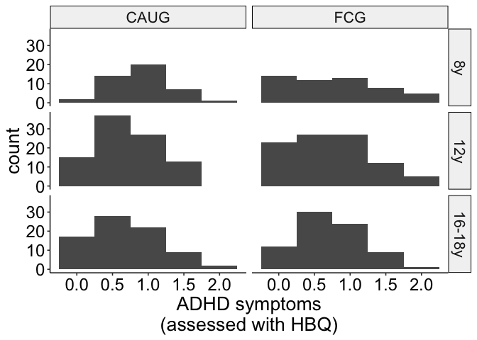<!-- -->

``` r
ggsave(
  paste0(home, "figures/age_years_wave_histogram.png"),
  width = 8, 
  height = 6
)
```

## IQ

``` r
d_cog_bio %>% 
  filter(construct == "IQ") %>% 
  ggplot(aes(value)) +
  geom_histogram(binwidth = 20) +
  #scale_y_continuous(breaks = seq.int(0, 25), 10) +
  theme_beip +
  scale_fill_manual(values = cbbPalette) +
  labs(
    fill = NULL,
    x = "Raw IQ score"
  ) +
  facet_grid(wave_ordered~group)
```

<!-- -->

``` r
ggsave(
  paste0(home, "figures/IQ_histograms.png"),
  dpi = 600,
  width = 7,
  height = 10
)
```

## EEG

``` r
d_cog_bio %>% 
  filter(construct == "EEG", str_detect(measure, "relalpha") == TRUE) %>% 
  ggplot(aes(value)) +
  geom_histogram(binwidth = .05) +
  theme_beip +
  scale_fill_manual(values = cbbPalette) +
  labs(
    fill = NULL,
    x = "EEG relative alpha power"
  ) +
  facet_grid(wave_ordered~group)
```

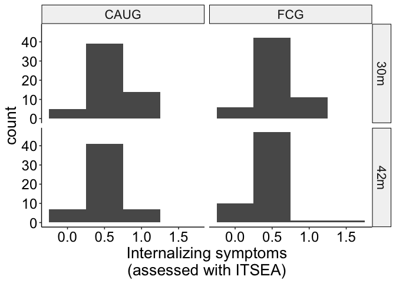<!-- -->

``` r
ggsave(
  paste0(home, "figures/EEG_rel_alpha_histograms.png"),
  dpi = 600,
  width = 7,
  height = 10
)
```

## Physical size

``` r
d_cog_bio %>% 
  filter(construct == "physical", domain == "height") %>% 
  ggplot(aes(value)) +
  geom_histogram(binwidth = 10) +
  theme_beip +
  scale_fill_manual(values = cbbPalette) +
  labs(
    fill = NULL,
    x = "Height"
  ) +
  facet_grid(wave_ordered~group, scales = "free")
```

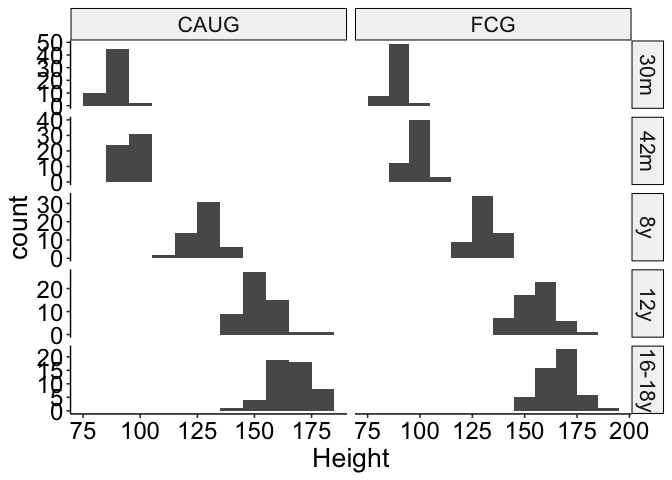<!-- -->

``` r
ggsave(
  paste0(home, "figures/height_histograms.png"),
  dpi = 600,
  width = 7,
  height = 10
)
```

``` r
d_cog_bio %>% 
  filter(construct == "physical", domain == "weight") %>% 
  ggplot(aes(value)) +
  geom_histogram(binwidth = 10) +
  scale_x_continuous(breaks = seq.int(0, 110, 20)) +
  theme_beip +
  scale_fill_manual(values = cbbPalette) +
  labs(
    fill = NULL,
    x = "Weight"
  ) +
  facet_grid(wave_ordered~group, scales = "free")
```

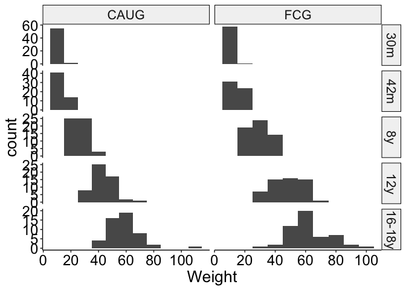<!-- -->

``` r
ggsave(
  paste0(home, "figures/weight_histograms.png"),
  dpi = 600,
  width = 7,
  height = 10
)
```

``` r
d_cog_bio %>% 
  filter(construct == "physical", domain == "head") %>% 
  ggplot(aes(value)) +
  geom_histogram(binwidth = 2) +
  theme_beip +
  scale_fill_manual(values = cbbPalette) +
  labs(
    fill = NULL,
    x = "Head circumference"
  ) +
  facet_grid(wave_ordered~group, scales = "free")
```

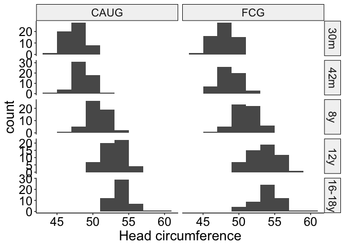<!-- -->

``` r
ggsave(
  paste0(home, "figures/headcir_histograms.png"),
  dpi = 600,
  width = 7,
  height = 10
)
```

## ADHD

``` r
d_psy %>% 
  filter(domain == "adhd", measure == "itsea") %>% 
  ggplot(aes(value)) +
  geom_histogram(binwidth = .5) +
  theme_beip +
  scale_fill_manual(values = cbbPalette) +
  labs(
    fill = NULL,
    x = "ADHD symptoms\n(assessed with ITSEA)"
  ) +
  facet_grid(wave_ordered~group)
```

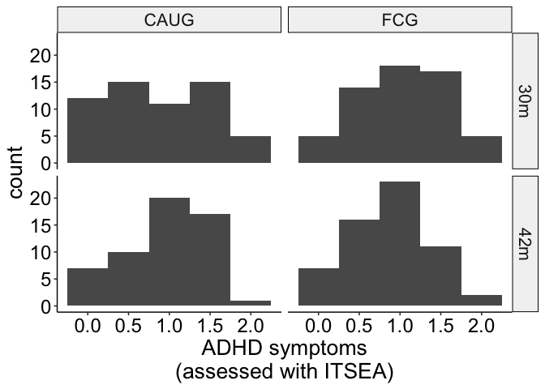<!-- -->

``` r
ggsave(
  paste0(home, "figures/adhd_histograms_itsea.png"),
  dpi = 600,
  width = 7,
  height = 4.3
)
```

``` r
d_psy %>% 
  filter(domain == "adhd", measure == "papa") %>% 
  ggplot(aes(value)) +
  geom_histogram(binwidth = 5) +
  theme_beip +
  scale_fill_manual(values = cbbPalette) +
  labs(
    fill = NULL,
    x = "ADHD symptoms\n(assessed with PAPA)"
  ) +
  facet_grid(wave_ordered~group)
```

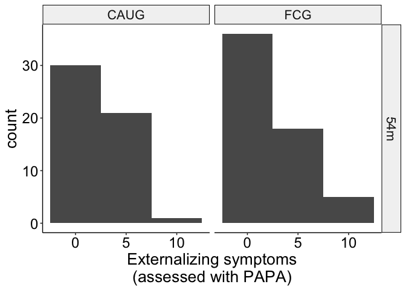<!-- -->

``` r
ggsave(
  paste0(home, "figures/adhd_histograms_papa.png"),
  dpi = 600,
  width = 7,
  height = 3
)
```

``` r
d_psy %>% 
  filter(domain == "adhd", measure == "hbq") %>% 
  ggplot(aes(value)) +
  geom_histogram(binwidth = .5) +
  theme_beip +
  scale_fill_manual(values = cbbPalette) +
  labs(
    fill = NULL,
    x = "ADHD symptoms\n(assessed with HBQ)"
  ) +
  facet_grid(wave_ordered~group)
```

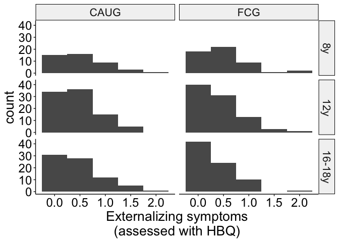<!-- -->

``` r
ggsave(
  paste0(home, "figures/adhd_histograms_hbq.png"),
  dpi = 600,
  width = 7,
  height = 6.3
)
```

``` r
d_psy %>% 
  filter(domain == "adhd", measure == "disc") %>% 
  ggplot(aes(value)) +
  geom_histogram(binwidth = 2) +
  theme_beip +
  scale_fill_manual(values = cbbPalette) +
  labs(
    fill = NULL,
    x = "ADHD symptoms\n(assessed with DISC)"
  ) +
  facet_grid(wave_ordered~group)
```

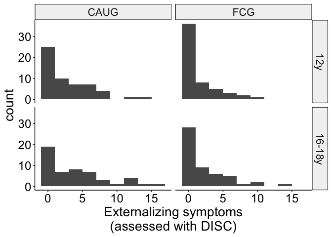<!-- -->

``` r
ggsave(
  paste0(home, "figures/adhd_histograms_disc.png"),
  dpi = 600,
  width = 7,
  height = 4.3
)
```

## Internalizing

``` r
d_psy %>% 
  filter(domain == "intern", measure == "itsea") %>% 
  ggplot(aes(value)) +
  geom_histogram(binwidth = .5) +
  theme_beip +
  scale_fill_manual(values = cbbPalette) +
  labs(
    fill = NULL,
    x = "Internalizing symptoms\n(assessed with ITSEA)"
  ) +
  facet_grid(wave_ordered~group)
```

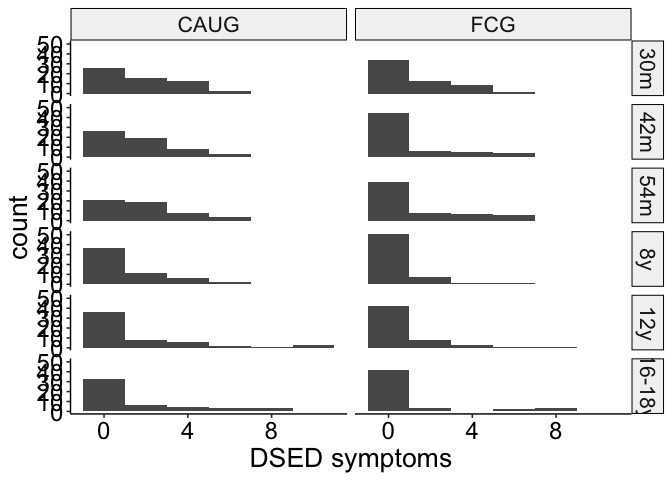<!-- -->

``` r
ggsave(
  paste0(home, "figures/intern_histograms_itsea.png"),
  dpi = 600,
  width = 7,
  height = 4.3
)
```

``` r
d_psy %>% 
  filter(domain == "intern", measure == "papa") %>% 
  ggplot(aes(value)) +
  geom_histogram(binwidth = 5) +
  theme_beip +
  scale_fill_manual(values = cbbPalette) +
  labs(
    fill = NULL,
    x = "Internalizing symptoms\n(assessed with PAPA)"
  ) +
  facet_grid(wave_ordered~group)
```

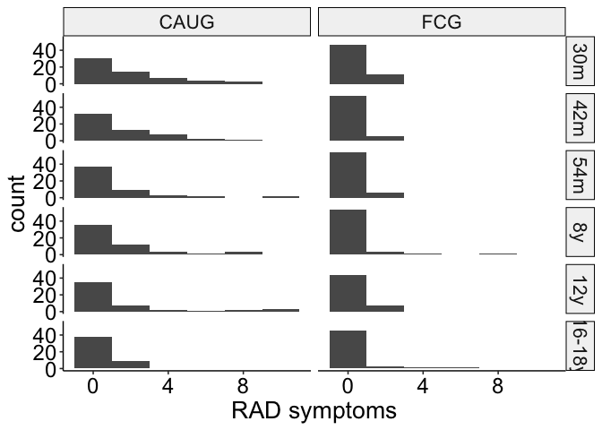<!-- -->

``` r
ggsave(
  paste0(home, "figures/intern_histograms_papa.png"),
  dpi = 600,
  width = 7,
  height = 3
)
```

``` r
d_psy %>% 
  filter(domain == "intern", measure == "hbq") %>% 
  ggplot(aes(value)) +
  geom_histogram(binwidth = .5) +
  theme_beip +
  scale_fill_manual(values = cbbPalette) +
  labs(
    fill = NULL,
    x = "Internalizing symptoms\n(assessed with HBQ)"
  ) +
  facet_grid(wave_ordered~group)
```

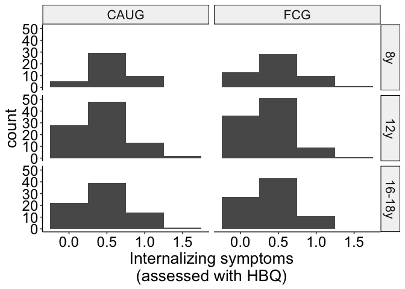<!-- -->

``` r
ggsave(
  paste0(home, "figures/intern_histograms_hbq.png"),
  dpi = 600,
  width = 7,
  height = 6.3
)
```

``` r
d_psy %>% 
  filter(domain == "intern", measure == "disc") %>% 
  ggplot(aes(value)) +
  geom_histogram(binwidth = 2) +
  theme_beip +
  scale_fill_manual(values = cbbPalette) +
  labs(
    fill = NULL,
    x = "Internalizing symptoms\n(assessed with DISC)"
  ) +
  facet_grid(wave_ordered~group)
```

<!-- -->

``` r
ggsave(
  paste0(home, "figures/intern_histograms_disc.png"),
  dpi = 600,
  width = 7,
  height = 4.3
)
```

## Externalizing

``` r
d_psy %>% 
  filter(domain == "extern", measure == "itsea") %>% 
  ggplot(aes(value)) +
  geom_histogram(binwidth = .5) +
  theme_beip +
  scale_fill_manual(values = cbbPalette) +
  labs(
    fill = NULL,
    x = "Externalizing symptoms\n(assessed with ITSEA)"
  ) +
  facet_grid(wave_ordered~group)
```

<!-- -->

``` r
ggsave(
  paste0(home, "figures/extern_histograms_itsea.png"),
  dpi = 600,
  width = 7,
  height = 4.3
)
```

``` r
d_psy %>% 
  filter(domain == "extern", measure == "papa") %>% 
  ggplot(aes(value)) +
  geom_histogram(binwidth = 5) +
  theme_beip +
  scale_fill_manual(values = cbbPalette) +
  labs(
    fill = NULL,
    x = "Externalizing symptoms\n(assessed with PAPA)"
  ) +
  facet_grid(wave_ordered~group)
```

<!-- -->

``` r
ggsave(
  paste0(home, "figures/extern_histograms_papa.png"),
  dpi = 600,
  width = 7,
  height = 3
)
```

``` r
d_psy %>% 
  filter(domain == "extern", measure == "hbq") %>% 
  ggplot(aes(value)) +
  geom_histogram(binwidth = .5) +
  theme_beip +
  scale_fill_manual(values = cbbPalette) +
  labs(
    fill = NULL,
    x = "Externalizing symptoms\n(assessed with HBQ)"
  ) +
  facet_grid(wave_ordered~group)
```

<!-- -->

``` r
ggsave(
  paste0(home, "figures/extern_histograms_hbq.png"),
  dpi = 600,
  width = 7,
  height = 6.3
)
```

``` r
d_psy %>% 
  filter(domain == "extern", measure == "disc") %>% 
  ggplot(aes(value)) +
  geom_histogram(binwidth = 2) +
  theme_beip +
  scale_fill_manual(values = cbbPalette) +
  labs(
    fill = NULL,
    x = "Externalizing symptoms\n(assessed with DISC)"
  ) +
  facet_grid(wave_ordered~group)
```

<!-- -->

``` r
ggsave(
  paste0(home, "figures/extern_histograms_disc.png"),
  dpi = 600,
  width = 7,
  height = 4.3
)
```

## DSED

``` r
d_psy %>% 
  filter(domain == "dsed") %>% 
  ggplot(aes(value)) +
  geom_histogram(binwidth = 2) +
  theme_beip +
  scale_fill_manual(values = cbbPalette) +
  labs(
    fill = NULL,
    x = "Disinhibited social engagement disorder symptoms"
  ) +
  facet_grid(wave_ordered~group)
```

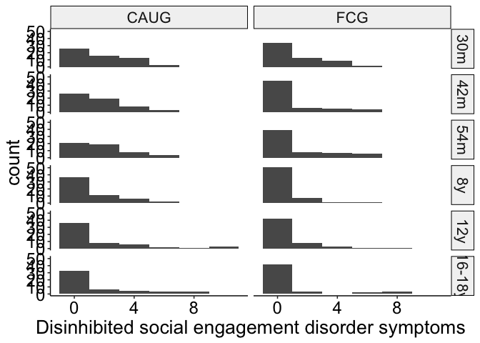<!-- -->

``` r
ggsave(
  paste0(home, "figures/DSED_histograms.png"),
  dpi = 600,
  width = 7,
  height = 10
)
```

## RAD

``` r
d_psy %>% 
  filter(domain == "rad") %>% 
  ggplot(aes(value)) +
  geom_histogram(binwidth = 2) +
  theme_beip +
  scale_fill_manual(values = cbbPalette) +
  labs(
    fill = NULL,
    x = "Reactive attachment disorder symptoms"
  ) +
  facet_grid(wave_ordered~group)
```

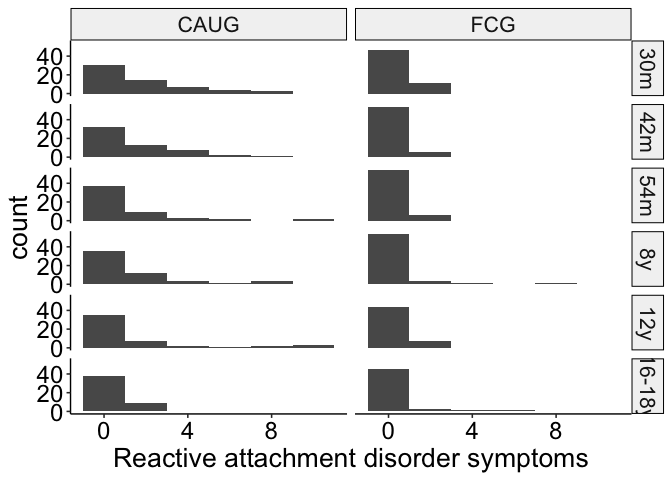<!-- -->

``` r
ggsave(
  paste0(home, "figures/rad_histograms.png"),
  dpi = 600,
  width = 7,
  height = 10
)
```

## Age of placement in foster care

``` r
d %>% 
  filter(group == "FCG") %>% 
  distinct(ID, FC_placement_age) %>% 
  ggplot(aes(FC_placement_age)) +
  geom_histogram() +
  scale_y_continuous(breaks = seq.int(0, 10, 1)) +
  theme_beip +
  labs(
    fill = NULL,
    x = "Age of placement in foster care\n(months)"
  )
```

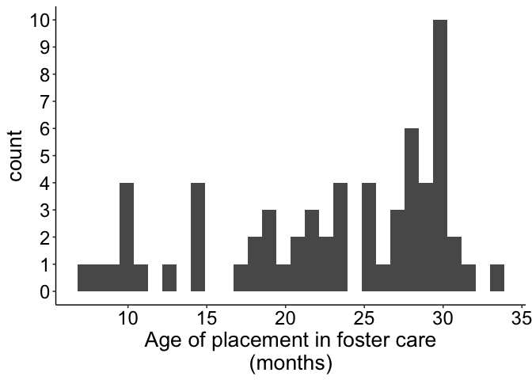<!-- -->

``` r
ggsave(
  paste0(home, "figures/age_placement_histogram.png"),
  width = 9, 
  height = 7
)
```

## Stability of foster care placement

``` r
d %>% 
  mutate(
    stable = recode_factor(
      stable,
      "disrupted" = "Disrupted",
      "stable" = "Stable"
    )
  ) %>% 
  filter(group == "FCG", !is.na(stable)) %>% 
  distinct(ID, wave_ordered, stable) %>% 
  count(wave_ordered, stable) %>% 
  ggplot(aes(wave_ordered, n, fill = stable)) +
  geom_col(position = "dodge") +
  scale_fill_viridis_d(begin = .5) +
  scale_y_continuous(breaks = seq.int(0, 70, 5)) +
  theme_beip +
  theme(
    legend.position = "right"
  ) +
  labs(
    y = "Number of children",
    x = "Assesment wave",
    fill = "Foster care placement"
  )
```

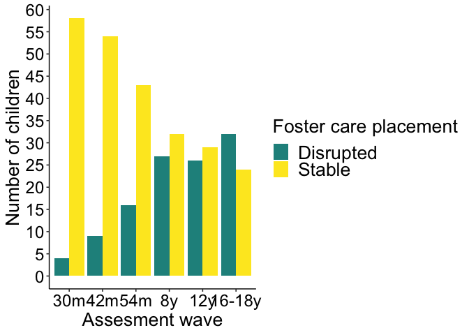<!-- -->

``` r
ggsave(
  paste0(home, "figures/wave_stability_counts.png"),
  width = 10, 
  height = 6
)
```

# Descriptives: Raw measurement values

## Means, SDs

``` r
d_baseline %>% 
  filter(group == "FCG") %>% 
  summarise_at(
    vars(FC_placement_age),
    funs(mean, sd, min, max), na.rm = TRUE
  )
```

    ## # A tibble: 1 × 4
    ##    mean    sd   min   max
    ##   <dbl> <dbl> <dbl> <dbl>
    ## 1  22.6  7.33  6.81  33.0

``` r
d_cog_bio_summary_iq_phys <- 
  d_cog_bio %>% 
  filter(domain != "eeg") %>% 
  group_by(group, domain) %>% 
  summarise(
    n = n(),
    mean = mean(value, na.rm = TRUE),
    sd = sd(value, na.rm = TRUE),
    se = sd / sqrt(n),
    min = min(value, na.rm = TRUE),
    max = max(value, na.rm = TRUE)
  ) 
d_cog_bio_summary_iq_phys
```

    ## # A tibble: 8 × 8
    ## # Groups:   group [2]
    ##   group domain     n  mean    sd    se   min   max
    ##   <fct> <fct>  <int> <dbl> <dbl> <dbl> <dbl> <dbl>
    ## 1 CAUG  head     268  50.7  2.90 0.177 44.9   59.2
    ## 2 CAUG  height   268 125.  31.1  1.90  81.4  184. 
    ## 3 CAUG  iq       313  72.0 15.2  0.860 12    118  
    ## 4 CAUG  weight   268  30.0 18.7  1.14   9.08 108. 
    ## 5 FCG   head     278  51.0  3.01 0.181 44.2   59.5
    ## 6 FCG   height   276 127.  31.2  1.88  81.5  189  
    ## 7 FCG   iq       337  78.9 18.3  0.998 11    143  
    ## 8 FCG   weight   276  32.6 20.7  1.24   8.72 102

``` r
d_cog_bio_summary_eeg <- 
  d_cog_bio %>% 
  filter(domain == "eeg") %>% 
  group_by(group, measure) %>% 
  summarise(
    n = n(),
    mean = mean(value, na.rm = TRUE),
    sd = sd(value, na.rm = TRUE),
    se = sd / sqrt(n),
    min = min(value, na.rm = TRUE),
    max = max(value, na.rm = TRUE)
  ) 
d_cog_bio_summary_eeg
```

    ## # A tibble: 2 × 8
    ## # Groups:   group [2]
    ##   group measure      n  mean     sd      se    min   max
    ##   <fct> <chr>    <int> <dbl>  <dbl>   <dbl>  <dbl> <dbl>
    ## 1 CAUG  relalpha   247 0.194 0.0501 0.00319 0.0795 0.317
    ## 2 FCG   relalpha   258 0.199 0.0473 0.00294 0.0749 0.408

``` r
d_psy_summary_overall <- 
  d_psy %>% 
  group_by(group, domain, measure) %>% 
  summarise(
    n = n(),
    mean = mean(value, na.rm = TRUE),
    sd = sd(value, na.rm = TRUE),
    se = sd / sqrt(n),
    min = min(value, na.rm = TRUE),
    max = max(value, na.rm = TRUE)
  )
d_psy_summary_overall
```

    ## # A tibble: 28 × 9
    ## # Groups:   group, domain [10]
    ##    group domain measure     n  mean    sd     se   min   max
    ##    <fct> <fct>  <chr>   <int> <dbl> <dbl>  <dbl> <dbl> <dbl>
    ##  1 CAUG  adhd   disc      106 4.27  4.61  0.448      0 17   
    ##  2 CAUG  adhd   hbq       214 0.752 0.453 0.0310     0  1.92
    ##  3 CAUG  adhd   itsea     113 0.918 0.563 0.0530     0  2   
    ##  4 CAUG  adhd   papa       52 5.79  5.49  0.761      0 18   
    ##  5 CAUG  dsed   dai       327 1.83  2.12  0.117      0 10   
    ##  6 CAUG  extern disc      106 3.74  3.92  0.381      0 17   
    ##  7 CAUG  extern hbq       211 0.486 0.429 0.0295     0  1.91
    ##  8 CAUG  extern itsea     113 0.559 0.430 0.0405     0  1.92
    ##  9 CAUG  extern papa       52 2.44  2.48  0.345      0 10   
    ## 10 CAUG  intern disc      106 1.17  2.34  0.227      0 18   
    ## # … with 18 more rows

``` r
d_cog_bio_summary <- 
  d_cog_bio %>% 
  group_by(group, wave_ordered, domain) %>% 
  summarise(
    n = n(),
    mean = mean(value, na.rm = TRUE),
    sd = sd(value, na.rm = TRUE),
    se = sd / sqrt(n),
    min = min(value, na.rm = TRUE),
    max = max(value, na.rm = TRUE)
  ) 

d_psy_summary <- 
  d_psy %>% 
  group_by(group, wave_ordered, domain) %>% 
  summarise(
    n = n(),
    mean = mean(value, na.rm = TRUE),
    sd = sd(value, na.rm = TRUE),
    se = sd / sqrt(n),
    min = min(value, na.rm = TRUE),
    max = max(value, na.rm = TRUE)
  )
```

``` r
d_cog_bio %>% 
  filter(domain == "eeg") %>% 
  group_by(wave_ordered, group) %>% 
  summarise_at(
    vars(value, value_z),
    funs(mean, sd)
  )
```

    ## # A tibble: 10 × 6
    ## # Groups:   wave_ordered [5]
    ##    wave_ordered group value_mean value_z_mean value_sd value_z_sd
    ##    <fct>        <fct>      <dbl>        <dbl>    <dbl>      <dbl>
    ##  1 30m          CAUG       0.218       0.0972   0.0318      1.02 
    ##  2 30m          FCG        0.212      -0.0888   0.0308      0.985
    ##  3 42m          CAUG       0.223       0.0928   0.0329      1.00 
    ##  4 42m          FCG        0.217      -0.0874   0.0330      1.00 
    ##  5 8y           CAUG       0.177      -0.189    0.0363      0.956
    ##  6 8y           FCG        0.191       0.175    0.0386      1.02 
    ##  7 12y          CAUG       0.170      -0.104    0.0532      1.02 
    ##  8 12y          FCG        0.181       0.102    0.0514      0.983
    ##  9 16-18y       CAUG       0.183      -0.0689   0.0646      0.975
    ## 10 16-18y       FCG        0.192       0.0719   0.0683      1.03

# Correlations

``` r
out_corr <- 
  d_cog_bio %>% 
  filter(domain != "eeg") %>% 
  dplyr::select(ID, domain, value_z) %>% 
  bind_rows(
    d_cog_bio %>% 
      filter(domain == "eeg") %>% 
      mutate(domain = measure) %>% 
      dplyr::select(ID, domain, value_z)
  ) %>% 
  bind_rows(
    d_psy %>% 
      dplyr::select(ID, domain, value_z)
  ) %>% 
  group_by(ID, domain) %>% 
  summarise(value_z = mean(value_z, na.rm = TRUE)) %>% 
  dplyr::select(
    domain,
    value_z
  ) %>% 
  spread(domain, value_z) %>% 
  ungroup() %>% 
  dplyr::select(-ID) %>% 
  corrr::correlate(method = "spearman") %>% 
  fashion() 

out_corr
```

    ##        term adhd dsed extern head height intern   iq  rad relalpha weight
    ## 1      adhd       .49    .78 -.00   -.07    .39 -.29  .50     -.01   -.08
    ## 2      dsed  .49         .34 -.07   -.06    .12 -.40  .62     -.02   -.09
    ## 3    extern  .78  .34         .04   -.14    .38 -.20  .46     -.15   -.12
    ## 4      head -.00 -.07    .04         .41   -.14  .24 -.09     -.02    .54
    ## 5    height -.07 -.06   -.14  .41          -.12  .35 -.26     -.02    .77
    ## 6    intern  .39  .12    .38 -.14   -.12        -.22  .31      .26   -.19
    ## 7        iq -.29 -.40   -.20  .24    .35   -.22      -.40     -.00    .31
    ## 8       rad  .50  .62    .46 -.09   -.26    .31 -.40           .01   -.26
    ## 9  relalpha -.01 -.02   -.15 -.02   -.02    .26 -.00  .01            -.05
    ## 10   weight -.08 -.09   -.12  .54    .77   -.19  .31 -.26     -.05

``` r
out_corr_plot <- 
  out_corr %>% 
  gather(variable, value, -term) %>% 
  mutate(
    term = as.character(term),
    value_chr = as.character(value),
    value_num = as.numeric(value_chr)
  ) %>% 
  na.omit() %>% 
  mutate(
    term = factor(
      term,
      levels = c(
        "iq", 
        "head", 
        "height", 
        "weight",
        "relalpha",
        "dsed",
        "rad",
        "adhd",
        "extern",
        "intern"
      ),
      labels = c(
        "IQ",
        "Head circumference",
        "Height",
        "Weight",
        "EEG alpha power",
        "DSED",
        "RAD",
        "ADHD",
        "Externalizing",
        "Internalizing"
      )
    ),
    variable = factor(
      variable,
      levels = c(
        "iq", 
        "head", 
        "height", 
        "weight",
        "relalpha",
        "dsed",
        "rad",
        "adhd",
        "extern",
        "intern"
      ),
      labels = c(
        "IQ",
        "Head circumference",
        "Height",
        "Weight",
        "EEG alpha power",
        "DSED",
        "RAD",
        "ADHD",
        "Externalizing",
        "Internalizing"
      )
    )
  )
```

``` r
out_corr_plot %>% 
  ggplot(aes(x = variable, y = fct_rev(term))) +
  geom_tile(aes(fill = abs(value_num))) +
  geom_text(
    aes(label = value_chr), 
    size = 4
  ) +
  scale_fill_gradient2(
    low = "blue",
    high = "red",
    mid = "white",
    na.value = "white",
    midpoint = 0,
    limit = c(-1, 1),
    space = "Lab",
    name = "Spearman correlation\ncoefficient"
  ) +
  theme_void() +
  theme(
    axis.text.x = element_text(
      angle = 45,
      hjust = 1,
      vjust = 1,
      size = 12
    ),
    axis.text.y = element_text(
      size = 12,
      hjust = .9
    )
  ) 
```

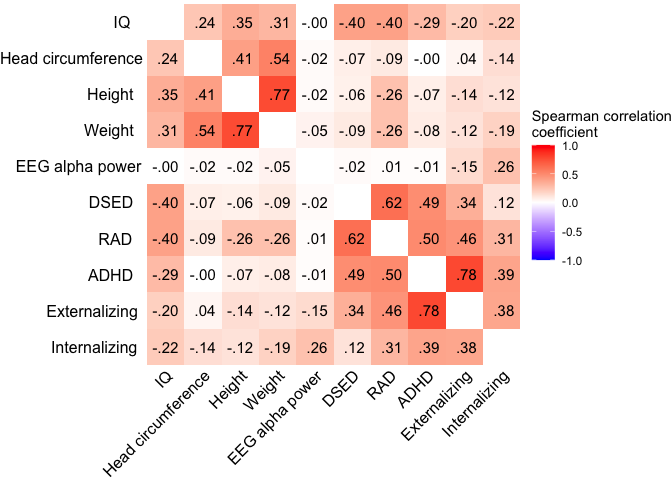<!-- -->

``` r
ggsave(
  paste0(home, "figures/correlations.png"),
  dpi = 600,
  width = 8, 
  height = 6
)
```

``` r
d_cog_bio %>% 
  distinct(ID, sibling_type) %>% 
  count(sibling_type)
```

    ## # A tibble: 3 × 2
    ##   sibling_type     n
    ##   <chr>        <int>
    ## 1 siblings         8
    ## 2 twins            4
    ## 3 <NA>           118

# Results

## Aim 1

### EEG, IQ, physical size

#### Main effect of group (with main effect covariates)

``` r
# CAUG is baseline
contrasts(d_cog_bio$group) = c(0, 1)

contrasts(d_cog_bio$male) = c(-.5, .5) 

contrasts(d_cog_bio$construct) <- cbind(
  "IQvEEG" = c(-1/3, 1 - (1/3), -1/3),
  "PHYSvEEG" = c(-1/3, -1/3, 1 - (1/3))
)
```

``` r
a1_cogbio <- lmer(
  value_z ~ 
    group +
    male +
    scale(age_years, scale = TRUE) +
    construct +
    (1|ID) +
    (1|family_id), 
  data = d_cog_bio
)

set.seed(123456)
a1_cogbio_parameters <-
  model_parameters(
  a1_cogbio,
  bootstrap = TRUE,
  ci_method = "quantile",
  iterations = 1000
)

a1_cogbio_parameters
```

    ## # Fixed Effects
    ## 
    ## Parameter         | Coefficient |        95% CI |     p
    ## -------------------------------------------------------
    ## (Intercept)       |       -0.14 | [-0.27, 0.01] | 0.056
    ## group1            |        0.26 | [ 0.07, 0.46] | 0.012
    ## male [1]          |        0.13 | [-0.06, 0.32] | 0.194
    ## age years         |   -6.74e-03 | [-0.04, 0.02] | 0.668
    ## constructIQvEEG   |       -0.02 | [-0.11, 0.07] | 0.690
    ## constructPHYSvEEG |   -3.48e-03 | [-0.09, 0.08] | 0.932

``` r
# supplementary analysis with extended random effects structure
a1_cogbio_rex <- lmer(
  value_z ~ 
    group +
    male +
    scale(age_years, scale = TRUE) +
    construct +
    (1|ID) +
    (1|ID:construct) +
    (1|family_id), 
  data = d_cog_bio
)

set.seed(123456)
a1_cogbio_parameters_rex <-
  model_parameters(
  a1_cogbio_rex,
  bootstrap = TRUE,
  ci_method = "quantile",
  iterations = 1000
)

a1_cogbio_parameters_rex
```

    ## # Fixed Effects
    ## 
    ## Parameter         | Coefficient |         95% CI |     p
    ## --------------------------------------------------------
    ## (Intercept)       |       -0.15 | [-0.29, -0.02] | 0.028
    ## group1            |        0.27 | [ 0.08,  0.46] | 0.002
    ## male [1]          |        0.03 | [-0.15,  0.19] | 0.788
    ## age years         |   -9.91e-04 | [-0.03,  0.02] | 0.928
    ## constructIQvEEG   |       -0.06 | [-0.25,  0.14] | 0.602
    ## constructPHYSvEEG |    7.01e-03 | [-0.19,  0.20] | 0.944

``` r
forest_df <-
  tibble(
    Parameter = "Overall cognitive, physical, and neural",
    Coefficient = a1_cogbio_parameters$Coefficient[[2]],
    CI_low = a1_cogbio_parameters$CI_low[[2]],
    CI_high = a1_cogbio_parameters$CI_high[[2]],
    p = a1_cogbio_parameters$p[[2]],
  )
```

### Psychopathology

#### Main effect of group (with main effect covariates)

``` r
# contrast code to center all variables except group; allows interpretation of coefficient as averages across levels of other factors
contrasts(d_psy$group) = c(0, 1) # CAUG is baseline

contrasts(d_psy$male) = c(-.5, .5) 

contrasts(d_psy$domain) = cbind(
  DSEDvADHD = c(-1/5, 1 - (1/5), -1/5, -1/5, -1/5),
  EXTvADHD = c(-1/5, -1/5, 1 - (1/5), -1/5, -1/5),
  INTvADHD = c(-1/5, -1/5, -1/5, 1 - (1/5), -1/5),
  RADvADHD = c(-1/5, -1/5, -1/5, -1/5, 1 - (1/5))
)

contrasts(d_psy$informant) = c(-.5, .5)
```

``` r
a1_psy <- lmer(
  value_z ~ 
    group +
    male +
    scale(age_years, scale = TRUE) +
    domain +
    informant +
    (1|ID) +
    (1|family_id), 
  data = d_psy
)

set.seed(123456)
a1_psy_parameters <-
  model_parameters(
    a1_psy,
    bootstrap = TRUE,
    ci_method = "quantile",
    effects = "fixed",
    iterations = 1000
  )

a1_psy_parameters
```

    ## # Fixed Effects
    ## 
    ## Parameter       | Coefficient |         95% CI |     p
    ## ------------------------------------------------------
    ## (Intercept)     |        0.15 | [ 0.02,  0.27] | 0.024
    ## group1          |       -0.25 | [-0.42, -0.08] | 0.004
    ## male [1]        |        0.21 | [ 0.05,  0.37] | 0.014
    ## age years       |       -0.02 | [-0.05,  0.01] | 0.174
    ## domainDSEDvADHD |    2.43e-03 | [-0.09,  0.09] | 0.954
    ## domainEXTvADHD  |   -3.19e-05 | [-0.07,  0.08] | 0.998
    ## domainINTvADHD  |    6.86e-03 | [-0.07,  0.09] | 0.834
    ## domainRADvADHD  |    9.86e-03 | [-0.08,  0.10] | 0.838
    ## informant1      |        0.03 | [-0.05,  0.10] | 0.502

``` r
# supplementary analysis with extended random effects structure
a1_psy_rex <- lmer(
  value_z ~ 
    group +
    male +
    scale(age_years, scale = TRUE) +
    domain +
    informant +
    (1|ID) +
    (1|ID:domain) +
    (1|family_id), 
  data = d_psy
)

set.seed(123456)
a1_psy_parameters_rex <-
  model_parameters(
    a1_psy_rex,
    bootstrap = TRUE,
    ci_method = "quantile",
    effects = "fixed",
    iterations = 1000
  )

a1_psy_parameters_rex
```

    ## # Fixed Effects
    ## 
    ## Parameter       | Coefficient |         95% CI |     p
    ## ------------------------------------------------------
    ## (Intercept)     |        0.14 | [ 0.03,  0.26] | 0.014
    ## group1          |       -0.25 | [-0.42, -0.09] | 0.002
    ## male [1]        |        0.22 | [ 0.06,  0.38] | 0.006
    ## age years       |       -0.02 | [-0.05,  0.01] | 0.126
    ## domainDSEDvADHD |        0.02 | [-0.11,  0.14] | 0.782
    ## domainEXTvADHD  |        0.02 | [-0.10,  0.13] | 0.772
    ## domainINTvADHD  |        0.02 | [-0.10,  0.14] | 0.744
    ## domainRADvADHD  |        0.04 | [-0.08,  0.16] | 0.494
    ## informant1      |        0.01 | [-0.06,  0.08] | 0.762

``` r
forest_df <-
  forest_df %>% 
  rbind( 
    c(
      "Overall psychopathology",
      a1_psy_parameters$Coefficient[[2]],
      a1_psy_parameters$CI_low[[2]],
      a1_psy_parameters$CI_hi[[2]],
      a1_psy_parameters$p[[2]]
    )
  )
```

## Aim 2

### EEG, IQ, physical size

#### Two-way moderations

``` r
a2_cogbio <- lmer(
  value_z ~ 
    group * construct +
    group * male +
    group * scale(age_years, scale = FALSE) +
    (1|ID) +
    (1|family_id), 
  REML = FALSE,
  data = d_cog_bio
)

set.seed(123456)
a2_cogbio_parameters <-
  model_parameters(
    a2_cogbio,
    bootstrap = TRUE,
    ci_method = "quantile",
    effects = "fixed",
    iterations = 1000
  )

anova(a2_cogbio)
```

    ## Type III Analysis of Variance Table with Satterthwaite's method
    ##                                       Sum Sq Mean Sq NumDF   DenDF F value
    ## group                                 4.4388  4.4388     1  131.66  6.2976
    ## construct                             0.2131  0.1066     2 2664.99  0.1512
    ## male                                  1.3733  1.3733     1  124.13  1.9484
    ## scale(age_years, scale = FALSE)       0.1345  0.1345     1 2718.16  0.1908
    ## group:construct                       7.8575  3.9288     2 2664.99  5.5739
    ## group:male                            0.0079  0.0079     1  124.13  0.0113
    ## group:scale(age_years, scale = FALSE) 0.3125  0.3125     1 2718.16  0.4433
    ##                                        Pr(>F)   
    ## group                                 0.01330 * 
    ## construct                             0.85969   
    ## male                                  0.16525   
    ## scale(age_years, scale = FALSE)       0.66226   
    ## group:construct                       0.00384 **
    ## group:male                            0.91569   
    ## group:scale(age_years, scale = FALSE) 0.50558   
    ## ---
    ## Signif. codes:  0 '***' 0.001 '**' 0.01 '*' 0.05 '.' 0.1 ' ' 1

##### Simple effects of outcome domain (IQ vs. EEG vs. physical size )

###### EEG

``` r
# EEG = baseline
contrasts(d_cog_bio$construct) <- cbind(
  "IQvEEG" = c(0, 1, 0),
  "PHYSvEEG" = c(0, 0, 1)
)

# CAUG = baseline
a2_cogbio_EEG <- lmer(
  value_z ~ 
    group * construct +
    male +
    scale(age_years, scale = TRUE) +
    (1|ID) +
    (1|family_id), 
  data = d_cog_bio
)

set.seed(123456)
a2_cogbio_EEG_parameters <-
  model_parameters(
    a2_cogbio_EEG,
    bootstrap = TRUE,
    ci_method = "quantile",
    iterations = 1000
  )
a2_cogbio_EEG_parameters
```

    ## # Fixed Effects
    ## 
    ## Parameter                  | Coefficient |         95% CI |      p
    ## ------------------------------------------------------------------
    ## (Intercept)                |       -0.03 | [-0.19,  0.14] | 0.754 
    ## group1                     |        0.06 | [-0.16,  0.29] | 0.598 
    ## constructIQvEEG            |       -0.19 | [-0.33, -0.06] | 0.006 
    ## constructPHYSvEEG          |       -0.11 | [-0.23,  0.00] | 0.048 
    ## male [1]                   |        0.13 | [-0.06,  0.33] | 0.190 
    ## age years                  |   -7.01e-03 | [-0.04,  0.02] | 0.660 
    ## group1 × constructIQvEEG   |        0.33 | [ 0.14,  0.52] | < .001
    ## group1 × constructPHYSvEEG |        0.21 | [ 0.06,  0.38] | 0.006

``` r
forest_df <-
  forest_df %>% 
  rbind( 
    c(
      "EEG alpha power",
      a2_cogbio_EEG_parameters$Coefficient[[2]],
      a2_cogbio_EEG_parameters$CI_low[[2]],
      a2_cogbio_EEG_parameters$CI_hi[[2]],
      a2_cogbio_EEG_parameters$p[[2]]
    )
  )
```

###### IQ

``` r
# IQ = baseline
contrasts(d_cog_bio$construct) <- cbind(
  "EEGvIQ" = c(1, 0, 0),
  "PHYSvIQ" = c(0, 0, 1)
)

a2_cogbio_IQ <- lmer(
  value_z ~ 
    group * construct +
    male +
    scale(age_years, scale = TRUE) +
    (1|ID) +
    (1|family_id),  
  data = d_cog_bio
)

set.seed(123456)
a2_cogbio_IQ_parameters <-
  model_parameters(
    a2_cogbio_IQ,
    bootstrap = TRUE,
    ci_method = "quantile",
    iterations = 1000
  )

a2_cogbio_IQ_parameters
```

    ## # Fixed Effects
    ## 
    ## Parameter                 | Coefficient |         95% CI |      p
    ## -----------------------------------------------------------------
    ## (Intercept)               |       -0.21 | [-0.38, -0.06] | 0.012 
    ## group1                    |        0.39 | [ 0.16,  0.63] | < .001
    ## constructEEGvIQ           |        0.19 | [ 0.06,  0.33] | 0.006 
    ## constructPHYSvIQ          |        0.08 | [-0.03,  0.19] | 0.160 
    ## male [1]                  |        0.13 | [-0.06,  0.33] | 0.190 
    ## age years                 |   -7.01e-03 | [-0.04,  0.02] | 0.660 
    ## group1 × constructEEGvIQ  |       -0.33 | [-0.52, -0.14] | < .001
    ## group1 × constructPHYSvIQ |       -0.12 | [-0.27,  0.04] | 0.158

``` r
forest_df <-
  forest_df %>% 
  rbind( 
    c(
      "IQ",
      a2_cogbio_IQ_parameters$Coefficient[[2]],
      a2_cogbio_IQ_parameters$CI_low[[2]],
      a2_cogbio_IQ_parameters$CI_hi[[2]],
      a2_cogbio_IQ_parameters$p[[2]]
    )
  )
```

###### Physical size

``` r
# PHYS = baseline
contrasts(d_cog_bio$construct) <- cbind(
  "EEGvPHYS" = c(1, 0, 0),
  "IQvPHYS" = c(0, 1, 0)
)

a2_cogbio_PHY <- lmer(
  value_z ~ 
    group * construct +
    male +
    scale(age_years, scale = TRUE) +
    (1|ID) +
    (1|family_id),  
  data = d_cog_bio
)

set.seed(123456)
a2_cogbio_PHY_parameters <- 
  model_parameters(
    a2_cogbio_PHY,
    bootstrap = TRUE,
    ci_method = "quantile",
    iterations = 1000
  )

a2_cogbio_PHY_parameters
```

    ## # Fixed Effects
    ## 
    ## Parameter                  | Coefficient |         95% CI |     p
    ## -----------------------------------------------------------------
    ## (Intercept)                |       -0.14 | [-0.28,  0.01] | 0.068
    ## group1                     |        0.28 | [ 0.07,  0.48] | 0.008
    ## constructEEGvPHYS          |        0.11 | [ 0.00,  0.23] | 0.048
    ## constructIQvPHYS           |       -0.08 | [-0.19,  0.03] | 0.160
    ## male [1]                   |        0.13 | [-0.06,  0.33] | 0.190
    ## age years                  |   -7.01e-03 | [-0.04,  0.02] | 0.660
    ## group1 × constructEEGvPHYS |       -0.21 | [-0.38, -0.06] | 0.006
    ## group1 × constructIQvPHYS  |        0.12 | [-0.04,  0.27] | 0.158

``` r
forest_df <-
  forest_df %>% 
  rbind( 
    c(
      "Physical growth",
      a2_cogbio_PHY_parameters$Coefficient[[2]],
      a2_cogbio_PHY_parameters$CI_low[[2]],
      a2_cogbio_PHY_parameters$CI_hi[[2]],
      a2_cogbio_PHY_parameters$p[[2]]
    )
  )
```

#### Three-way moderations

``` r
a2_cogbio_domainXage <- lmer(
  value_z ~ 
    group * construct * scale(age_years, scale = FALSE) +
    male +
    (1|ID) +
    (1|family_id),  
  data = d_cog_bio
)

anova(a2_cogbio_domainXage)
```

    ## Type III Analysis of Variance Table with Satterthwaite's method
    ##                                                 Sum Sq Mean Sq NumDF   DenDF
    ## group                                           4.2387  4.2387     1  123.09
    ## construct                                       0.2361  0.1181     2 2655.71
    ## scale(age_years, scale = FALSE)                 0.2124  0.2124     1 2695.65
    ## male                                            1.3766  1.3766     1  116.57
    ## group:construct                                 8.0327  4.0164     2 2655.73
    ## group:scale(age_years, scale = FALSE)           0.0000  0.0000     1 2695.59
    ## construct:scale(age_years, scale = FALSE)       0.1206  0.0603     2 2656.29
    ## group:construct:scale(age_years, scale = FALSE) 2.3755  1.1878     2 2656.28
    ##                                                 F value   Pr(>F)   
    ## group                                            5.9983 0.015728 * 
    ## construct                                        0.1671 0.846157   
    ## scale(age_years, scale = FALSE)                  0.3006 0.583566   
    ## male                                             1.9480 0.165458   
    ## group:construct                                  5.6836 0.003443 **
    ## group:scale(age_years, scale = FALSE)            0.0000 0.994659   
    ## construct:scale(age_years, scale = FALSE)        0.0853 0.918242   
    ## group:construct:scale(age_years, scale = FALSE)  1.6808 0.186418   
    ## ---
    ## Signif. codes:  0 '***' 0.001 '**' 0.01 '*' 0.05 '.' 0.1 ' ' 1

``` r
a2_cogbio_domainXsex <- lmer(
  value_z ~ 
    group * construct * male +
    scale(age_years, scale = TRUE) +
    (1|ID) +
    (1|family_id),  
  data = d_cog_bio
)

anova(a2_cogbio_domainXsex)
```

    ## Type III Analysis of Variance Table with Satterthwaite's method
    ##                                Sum Sq Mean Sq NumDF   DenDF F value
    ## group                           4.184  4.1841     1  121.35  6.1134
    ## construct                       0.283  0.1417     2 2656.43  0.2070
    ## male                            0.002  0.0019     1  121.92  0.0028
    ## scale(age_years, scale = TRUE)  0.147  0.1466     1 2706.31  0.2142
    ## group:construct                 9.043  4.5216     2 2656.54  6.6064
    ## group:male                      0.000  0.0002     1  126.93  0.0003
    ## construct:male                 44.059 22.0297     2 2656.56 32.1874
    ## group:construct:male           16.573  8.2867     2 2656.58 12.1076
    ##                                             Pr(>F)    
    ## group                                     0.014802 *  
    ## construct                                 0.813028    
    ## male                                      0.958087    
    ## scale(age_years, scale = TRUE)            0.643510    
    ## group:construct                           0.001374 ** 
    ## group:male                                0.985165    
    ## construct:male                 0.00000000000001541 ***
    ## group:construct:male           0.00000582825434555 ***
    ## ---
    ## Signif. codes:  0 '***' 0.001 '**' 0.01 '*' 0.05 '.' 0.1 ' ' 1

##### Simple effects of sex and outcome domain

###### Male, EEG

``` r
# EEG = baseline
contrasts(d_cog_bio$construct) <- cbind(
  "IQvEEG" = c(0, 1, 0),
  "PHYSvEEG" = c(0, 0, 1)
)

# Male = baseline
contrasts(d_cog_bio$male) = c(1, 0)

a2_cogbio_EEG_male <- lmer(
  value_z ~ 
    group * construct * male +
    scale(age_years, scale = TRUE) +
    (1|ID) +
    (1|family_id),  
  data = d_cog_bio
)

set.seed(123456)
a2_cogbio_EEG_male_parameters <-
  model_parameters(
    a2_cogbio_EEG_male,
    bootstrap = TRUE,
    ci_method = "quantile",
    iterations = 1000
  )

a2_cogbio_EEG_male_parameters
```

    ## # Fixed Effects
    ## 
    ## Parameter                               | Coefficient |         95% CI |      p
    ## -------------------------------------------------------------------------------
    ## (Intercept)                             |       -0.26 | [-0.46, -0.01] | 0.034 
    ## group1                                  |        0.29 | [-0.04,  0.62] | 0.084 
    ## constructIQvEEG                         |        0.11 | [-0.09,  0.30] | 0.262 
    ## constructPHYSvEEG                       |        0.27 | [ 0.10,  0.42] | < .001
    ## male [1]                                |        0.48 | [ 0.14,  0.80] | 0.004 
    ## age years                               |   -7.01e-03 | [-0.04,  0.02] | 0.652 
    ## group1 × constructIQvEEG                |       -0.13 | [-0.40,  0.14] | 0.314 
    ## group1 × constructPHYSvEEG              |    5.43e-03 | [-0.22,  0.25] | 0.956 
    ## group1 × male [1]                       |       -0.48 | [-0.92, -0.01] | 0.044 
    ## constructIQvEEG × male [1]              |       -0.63 | [-0.91, -0.35] | < .001
    ## constructPHYSvEEG × male [1]            |       -0.81 | [-1.04, -0.55] | < .001
    ## (group1 × constructIQvEEG) × male [1]   |        0.97 | [ 0.57,  1.34] | < .001
    ## (group1 × constructPHYSvEEG) × male [1] |        0.45 | [ 0.11,  0.78] | 0.014

###### Female, EEG

``` r
# EEG = baseline
contrasts(d_cog_bio$construct) <- cbind(
  "IQvEEG" = c(0, 1, 0),
  "PHYSvEEG" = c(0, 0, 1)
)

# Female = baseline
contrasts(d_cog_bio$male) = c(0, 1)

a2_cogbio_EEG_female <- lmer(
  value_z ~ 
    group * construct * male +
    scale(age_years, scale = TRUE) +
    (1|ID) +
    (1|family_id),  
  data = d_cog_bio
)

set.seed(123456)
a2_cogbio_EEG_female_parameters <-
  model_parameters(
    a2_cogbio_EEG_female,
    bootstrap = TRUE,
    ci_method = "quantile",
    iterations = 1000
  )

a2_cogbio_EEG_female_parameters
```

    ## # Fixed Effects
    ## 
    ## Parameter                               | Coefficient |         95% CI |      p
    ## -------------------------------------------------------------------------------
    ## (Intercept)                             |        0.23 | [-0.01,  0.45] | 0.066 
    ## group1                                  |       -0.19 | [-0.51,  0.14] | 0.250 
    ## constructIQvEEG                         |       -0.53 | [-0.72, -0.32] | < .001
    ## constructPHYSvEEG                       |       -0.53 | [-0.70, -0.37] | < .001
    ## male [1]                                |       -0.48 | [-0.80, -0.14] | 0.004 
    ## age years                               |   -7.01e-03 | [-0.04,  0.02] | 0.652 
    ## group1 × constructIQvEEG                |        0.83 | [ 0.57,  1.10] | < .001
    ## group1 × constructPHYSvEEG              |        0.45 | [ 0.21,  0.68] | < .001
    ## group1 × male [1]                       |        0.48 | [ 0.01,  0.92] | 0.044 
    ## constructIQvEEG × male [1]              |        0.63 | [ 0.35,  0.91] | < .001
    ## constructPHYSvEEG × male [1]            |        0.81 | [ 0.55,  1.04] | < .001
    ## (group1 × constructIQvEEG) × male [1]   |       -0.97 | [-1.34, -0.57] | < .001
    ## (group1 × constructPHYSvEEG) × male [1] |       -0.45 | [-0.78, -0.11] | 0.014

###### Male, IQ

``` r
# IQ = baseline
contrasts(d_cog_bio$construct) <- cbind(
  "EEGvIQ" = c(1, 0, 0),
  "PHYSvIQ" = c(0, 0, 1)
)

# Male = baseline
contrasts(d_cog_bio$male) = c(1, 0)

a2_cogbio_IQ_male <- lmer(
  value_z ~ 
    group * construct * male +
    scale(age_years, scale = TRUE) +
    (1|ID) +
    (1|family_id), 
  data = d_cog_bio
)

set.seed(123456)
a2_cogbio_IQ_male_parameters <-
  model_parameters(
    a2_cogbio_IQ_male,
    bootstrap = TRUE,
    ci_method = "quantile",
    iterations = 1000
  )

a2_cogbio_IQ_male_parameters
```

    ## # Fixed Effects
    ## 
    ## Parameter                              | Coefficient |         95% CI |      p
    ## ------------------------------------------------------------------------------
    ## (Intercept)                            |       -0.14 | [-0.37,  0.09] | 0.244 
    ## group1                                 |        0.16 | [-0.15,  0.48] | 0.346 
    ## constructEEGvIQ                        |       -0.11 | [-0.30,  0.09] | 0.262 
    ## constructPHYSvIQ                       |        0.16 | [ 0.02,  0.32] | 0.022 
    ## male [1]                               |       -0.15 | [-0.48,  0.15] | 0.372 
    ## age years                              |   -7.01e-03 | [-0.04,  0.02] | 0.652 
    ## group1 × constructEEGvIQ               |        0.13 | [-0.14,  0.40] | 0.314 
    ## group1 × constructPHYSvIQ              |        0.14 | [-0.06,  0.34] | 0.184 
    ## group1 × male [1]                      |        0.49 | [ 0.01,  0.94] | 0.050 
    ## constructEEGvIQ × male [1]             |        0.63 | [ 0.35,  0.91] | < .001
    ## constructPHYSvIQ × male [1]            |       -0.17 | [-0.40,  0.04] | 0.108 
    ## (group1 × constructEEGvIQ) × male [1]  |       -0.97 | [-1.34, -0.57] | < .001
    ## (group1 × constructPHYSvIQ) × male [1] |       -0.53 | [-0.80, -0.23] | < .001

###### Female, IQ

``` r
# IQ = baseline
contrasts(d_cog_bio$construct) <- cbind(
  "EEGvIQ" = c(1, 0, 0),
  "PHYSvIQ" = c(0, 0, 1)
)

# Female = baseline
contrasts(d_cog_bio$male) = c(0, 1)

a2_cogbio_IQ_female <- lmer(
  value_z ~ 
    group * construct * male +
    scale(age_years, scale = TRUE) +
    (1|ID) +
    (1|family_id),  
  data = d_cog_bio
)

set.seed(123456)
a2_cogbio_IQ_female_parameters <-
  model_parameters(
    a2_cogbio_IQ_female,
    bootstrap = TRUE,
    ci_method = "quantile",
    iterations = 1000
  )

a2_cogbio_IQ_female_parameters
```

    ## # Fixed Effects
    ## 
    ## Parameter                              | Coefficient |         95% CI |      p
    ## ------------------------------------------------------------------------------
    ## (Intercept)                            |       -0.30 | [-0.52, -0.07] | 0.016 
    ## group1                                 |        0.65 | [ 0.33,  0.99] | < .001
    ## constructEEGvIQ                        |        0.53 | [ 0.32,  0.72] | < .001
    ## constructPHYSvIQ                       |       -0.01 | [-0.16,  0.14] | 0.888 
    ## male [1]                               |        0.15 | [-0.15,  0.48] | 0.372 
    ## age years                              |   -7.01e-03 | [-0.04,  0.02] | 0.652 
    ## group1 × constructEEGvIQ               |       -0.83 | [-1.10, -0.57] | < .001
    ## group1 × constructPHYSvIQ              |       -0.38 | [-0.60, -0.17] | < .001
    ## group1 × male [1]                      |       -0.49 | [-0.94, -0.01] | 0.050 
    ## constructEEGvIQ × male [1]             |       -0.63 | [-0.91, -0.35] | < .001
    ## constructPHYSvIQ × male [1]            |        0.17 | [-0.04,  0.40] | 0.108 
    ## (group1 × constructEEGvIQ) × male [1]  |        0.97 | [ 0.57,  1.34] | < .001
    ## (group1 × constructPHYSvIQ) × male [1] |        0.53 | [ 0.23,  0.80] | < .001

###### Male, physical size

``` r
# PHYS = baseline
contrasts(d_cog_bio$construct) <- cbind(
  "EEGvPHYS" = c(1, 0, 0),
  "IQvPHYS" = c(0, 1, 0)
)

# Male = baseline
contrasts(d_cog_bio$male) = c(1, 0)

a2_cogbio_PHYS_male <- lmer(
  value_z ~ 
    group * construct * male +
    scale(age_years, scale = TRUE) +
    (1|ID) +
    (1|family_id), 
  data = d_cog_bio
)

set.seed(123456)
a2_cogbio_PHYS_male_parameters <-
  model_parameters(
    a2_cogbio_PHYS_male,
    bootstrap = TRUE,
    ci_method = "quantile",
    iterations = 1000
  )

a2_cogbio_PHYS_male_parameters
```

    ## # Fixed Effects
    ## 
    ## Parameter                               | Coefficient |         95% CI |      p
    ## -------------------------------------------------------------------------------
    ## (Intercept)                             |        0.02 | [-0.19,  0.23] | 0.814 
    ## group1                                  |        0.29 | [ 0.00,  0.57] | 0.052 
    ## constructEEGvPHYS                       |       -0.27 | [-0.42, -0.10] | < .001
    ## constructIQvPHYS                        |       -0.16 | [-0.32, -0.02] | 0.022 
    ## male [1]                                |       -0.33 | [-0.62, -0.05] | 0.020 
    ## age years                               |   -7.01e-03 | [-0.04,  0.02] | 0.652 
    ## group1 × constructEEGvPHYS              |   -5.43e-03 | [-0.25,  0.22] | 0.956 
    ## group1 × constructIQvPHYS               |       -0.14 | [-0.34,  0.06] | 0.184 
    ## group1 × male [1]                       |       -0.04 | [-0.44,  0.38] | 0.846 
    ## constructEEGvPHYS × male [1]            |        0.81 | [ 0.55,  1.04] | < .001
    ## constructIQvPHYS × male [1]             |        0.17 | [-0.04,  0.40] | 0.108 
    ## (group1 × constructEEGvPHYS) × male [1] |       -0.45 | [-0.78, -0.11] | 0.014 
    ## (group1 × constructIQvPHYS) × male [1]  |        0.53 | [ 0.23,  0.80] | < .001

###### Female, physical size

``` r
# PHYS = baseline
contrasts(d_cog_bio$construct) <- cbind(
  "EEGvPHYS" = c(1, 0, 0),
  "IQvPHYS" = c(0, 1, 0)
)

# Female = baseline
contrasts(d_cog_bio$male) = c(0, 1)

a2_cogbio_PHYS_female <- lmer(
  value_z ~ 
    group * construct * male +
    scale(age_years, scale = TRUE) +
    (1|ID) +
    (1|family_id),  
  data = d_cog_bio
)

set.seed(123456)
a2_cogbio_PHYS_female_parameters <-
  model_parameters(
    a2_cogbio_PHYS_female,
    bootstrap = TRUE,
    ci_method = "quantile",
    iterations = 1000
  )

a2_cogbio_PHYS_female_parameters
```

    ## # Fixed Effects
    ## 
    ## Parameter                               | Coefficient |         95% CI |      p
    ## -------------------------------------------------------------------------------
    ## (Intercept)                             |       -0.31 | [-0.50, -0.09] | 0.002 
    ## group1                                  |        0.27 | [-0.03,  0.55] | 0.070 
    ## constructEEGvPHYS                       |        0.53 | [ 0.37,  0.70] | < .001
    ## constructIQvPHYS                        |        0.01 | [-0.14,  0.16] | 0.888 
    ## male [1]                                |        0.33 | [ 0.05,  0.62] | 0.020 
    ## age years                               |   -7.01e-03 | [-0.04,  0.02] | 0.652 
    ## group1 × constructEEGvPHYS              |       -0.45 | [-0.68, -0.21] | < .001
    ## group1 × constructIQvPHYS               |        0.38 | [ 0.17,  0.60] | < .001
    ## group1 × male [1]                       |        0.04 | [-0.38,  0.44] | 0.846 
    ## constructEEGvPHYS × male [1]            |       -0.81 | [-1.04, -0.55] | < .001
    ## constructIQvPHYS × male [1]             |       -0.17 | [-0.40,  0.04] | 0.108 
    ## (group1 × constructEEGvPHYS) × male [1] |        0.45 | [ 0.11,  0.78] | 0.014 
    ## (group1 × constructIQvPHYS) × male [1]  |       -0.53 | [-0.80, -0.23] | < .001

### Psychopathology

#### Two-way moderations

``` r
a2_psy_type <- lmer(
  value_z ~ 
    group * domain +
    group * male +
    group * scale(age_years, scale = TRUE) +
    informant +
    (1|ID) +
    (1|family_id),  
  data = d_psy
)

anova(a2_psy_type)
```

    ## Type III Analysis of Variance Table with Satterthwaite's method
    ##                                      Sum Sq Mean Sq NumDF  DenDF F value
    ## group                                 8.578  8.5784     1  124.4 10.9563
    ## domain                                0.146  0.0364     4 4157.4  0.0465
    ## male                                  5.304  5.3039     1  122.1  6.7741
    ## scale(age_years, scale = TRUE)        1.451  1.4508     1 4257.2  1.8530
    ## informant                             0.283  0.2829     1 4190.6  0.3613
    ## group:domain                         37.111  9.2777     4 4157.6 11.8495
    ## group:male                            1.854  1.8540     1  114.5  2.3679
    ## group:scale(age_years, scale = TRUE)  1.690  1.6898     1 4261.8  2.1582
    ##                                              Pr(>F)    
    ## group                                      0.001221 ** 
    ## domain                                     0.995933    
    ## male                                       0.010394 *  
    ## scale(age_years, scale = TRUE)             0.173510    
    ## informant                                  0.547822    
    ## group:domain                         0.000000001425 ***
    ## group:male                                 0.126613    
    ## group:scale(age_years, scale = TRUE)       0.141887    
    ## ---
    ## Signif. codes:  0 '***' 0.001 '**' 0.01 '*' 0.05 '.' 0.1 ' ' 1

##### Simple effects of type of psychopathology

###### ADHD

``` r
# CAUG = baseline
contrasts(d_psy$group) = c(0, 1)

# ADHD = baseline
contrasts(d_psy$domain) = cbind(
  DSEDvADHD = c(0, 1, 0, 0, 0),
  EXTvADHD = c(0, 0, 1, 0, 0),
  INTvADHD = c(0, 0, 0, 1, 0),
  RADvADHD = c(0, 0, 0, 0, 1)
)

a2_psy_ADHD <- lmer(
  value_z ~ 
    group * domain + 
    male +
    scale(age_years, scale = TRUE) +
    informant +
    (1|ID) +
    (1|family_id), 
  data = d_psy
)

set.seed(123456)
a2_psy_ADHD_parameters <- 
  model_parameters(
    a2_psy_ADHD,
    bootstrap = TRUE,
    ci_method = "quantile",
    iterations = 1000
  )

a2_psy_ADHD_parameters
```

    ## # Fixed Effects
    ## 
    ## Parameter                | Coefficient |         95% CI |      p
    ## ----------------------------------------------------------------
    ## (Intercept)              |        0.05 | [-0.10,  0.18] | 0.504 
    ## group1                   |       -0.05 | [-0.24,  0.15] | 0.618 
    ## domainDSEDvADHD          |        0.16 | [ 0.02,  0.29] | 0.014 
    ## domainEXTvADHD           |        0.05 | [-0.06,  0.16] | 0.342 
    ## domainINTvADHD           |        0.09 | [-0.01,  0.20] | 0.088 
    ## domainRADvADHD           |        0.30 | [ 0.18,  0.42] | < .001
    ## male [1]                 |        0.21 | [ 0.05,  0.37] | 0.012 
    ## age years                |       -0.02 | [-0.05,  0.01] | 0.180 
    ## informant1               |        0.03 | [-0.05,  0.10] | 0.536 
    ## group1 × domainDSEDvADHD |       -0.31 | [-0.49, -0.13] | < .001
    ## group1 × domainEXTvADHD  |       -0.10 | [-0.25,  0.04] | 0.188 
    ## group1 × domainINTvADHD  |       -0.17 | [-0.33, -0.01] | 0.032 
    ## group1 × domainRADvADHD  |       -0.56 | [-0.72, -0.39] | < .001

``` r
forest_df <-
  forest_df %>% 
  rbind( 
    c(
      "ADHD",
      a2_psy_ADHD_parameters$Coefficient[[2]],
      a2_psy_ADHD_parameters$CI_low[[2]],
      a2_psy_ADHD_parameters$CI_hi[[2]],
      a2_psy_ADHD_parameters$p[[2]]
    )
  )
```

###### DSED

``` r
# CAUG = baseline
contrasts(d_psy$group) = c(0, 1)

# DSED = baseline
contrasts(d_psy$domain) = cbind(
  ADHDvDSED = c(1, 0, 0, 0, 0),
  EXTvDSED = c(0, 0, 1, 0, 0),
  INTvDSED = c(0, 0, 0, 1, 0),
  RADvDSED = c(0, 0, 0, 0, 1)
)

a2_psy_DSED <- lmer(
  value_z ~ 
    group * domain + 
    male +
    scale(age_years, scale = TRUE) +
    informant +
    (1|ID) +
    (1|family_id),  
  data = d_psy
)

set.seed(123456)
a2_psy_DSED_parameters <-
  model_parameters(
    a2_psy_DSED,
    bootstrap = TRUE,
    ci_method = "quantile",
    iterations = 1000
  )
a2_psy_DSED_parameters
```

    ## # Fixed Effects
    ## 
    ## Parameter                | Coefficient |         95% CI |      p
    ## ----------------------------------------------------------------
    ## (Intercept)              |        0.20 | [ 0.05,  0.36] | 0.012 
    ## group1                   |       -0.35 | [-0.56, -0.15] | < .001
    ## domainADHDvDSED          |       -0.16 | [-0.29, -0.02] | 0.014 
    ## domainEXTvDSED           |       -0.11 | [-0.24,  0.02] | 0.106 
    ## domainINTvDSED           |       -0.06 | [-0.19,  0.07] | 0.322 
    ## domainRADvDSED           |        0.14 | [ 0.00,  0.28] | 0.048 
    ## male [1]                 |        0.21 | [ 0.05,  0.37] | 0.012 
    ## age years                |       -0.02 | [-0.05,  0.01] | 0.180 
    ## informant1               |        0.03 | [-0.05,  0.10] | 0.536 
    ## group1 × domainADHDvDSED |        0.31 | [ 0.13,  0.49] | < .001
    ## group1 × domainEXTvDSED  |        0.21 | [ 0.04,  0.38] | 0.016 
    ## group1 × domainINTvDSED  |        0.14 | [-0.04,  0.30] | 0.122 
    ## group1 × domainRADvDSED  |       -0.26 | [-0.44, -0.05] | 0.008

``` r
forest_df <-
  forest_df %>% 
  rbind( 
    c(
      "Disinhibited social engagement disorder",
      a2_psy_DSED_parameters$Coefficient[[2]],
      a2_psy_DSED_parameters$CI_low[[2]],
      a2_psy_DSED_parameters$CI_hi[[2]],
      a2_psy_DSED_parameters$p[[2]]
    )
  )
```

###### Externalizing

``` r
# CAUG = baseline
contrasts(d_psy$group) = c(0, 1)

# EXT = baseline
contrasts(d_psy$domain) = cbind(
  ADHDvEXT = c(1, 0, 0, 0, 0),
  DSEDvEXT = c(0, 1, 0, 0, 0),
  INTvEXT = c(0, 0, 0, 1, 0),
  RADvEXT = c(0, 0, 0, 0, 1)
)

a2_psy_EXT <- lmer(
  value_z ~ 
    group * domain + 
    male +
    scale(age_years, scale = TRUE) +
    informant +
    (1|ID) +
    (1|family_id),  
  data = d_psy
)

set.seed(123456)
a2_psy_EXT_parameters <-
  model_parameters(
    a2_psy_EXT,
    bootstrap = TRUE,
    ci_method = "quantile",
    iterations = 1000
  )

a2_psy_EXT_parameters
```

    ## # Fixed Effects
    ## 
    ## Parameter               | Coefficient |         95% CI |      p
    ## ---------------------------------------------------------------
    ## (Intercept)             |        0.10 | [-0.04,  0.23] | 0.150 
    ## group1                  |       -0.15 | [-0.32,  0.05] | 0.106 
    ## domainADHDvEXT          |       -0.05 | [-0.16,  0.06] | 0.342 
    ## domainDSEDvEXT          |        0.11 | [-0.02,  0.24] | 0.106 
    ## domainINTvEXT           |        0.04 | [-0.07,  0.15] | 0.512 
    ## domainRADvEXT           |        0.25 | [ 0.11,  0.38] | < .001
    ## male [1]                |        0.21 | [ 0.05,  0.37] | 0.012 
    ## age years               |       -0.02 | [-0.05,  0.01] | 0.180 
    ## informant1              |        0.03 | [-0.05,  0.10] | 0.536 
    ## group1 × domainADHDvEXT |        0.10 | [-0.04,  0.25] | 0.188 
    ## group1 × domainDSEDvEXT |       -0.21 | [-0.38, -0.04] | 0.016 
    ## group1 × domainINTvEXT  |       -0.07 | [-0.23,  0.08] | 0.374 
    ## group1 × domainRADvEXT  |       -0.46 | [-0.64, -0.28] | < .001

``` r
forest_df <-
  forest_df %>% 
  rbind( 
    c(
      "Externalizing",
      a2_psy_EXT_parameters$Coefficient[[2]],
      a2_psy_EXT_parameters$CI_low[[2]],
      a2_psy_EXT_parameters$CI_hi[[2]],
      a2_psy_EXT_parameters$p[[2]]
    )
  )
```

###### Internalizing

``` r
# CAUG = baseline
contrasts(d_psy$group) = c(0, 1)

# INT = baseline
contrasts(d_psy$domain) = cbind(
  ADHDvINT = c(1, 0, 0, 0, 0),
  DSEDvINT = c(0, 1, 0, 0, 0),
  INTvEXT = c(0, 0, 1, 0, 0),
  RADvINT = c(0, 0, 0, 0, 1)
)

a2_psy_INT <- lmer(
  value_z ~ 
    group * domain + 
    male +
    scale(age_years, scale = TRUE) +
    informant +
    (1|ID) +
    (1|family_id),  
  data = d_psy
)

set.seed(123456)
a2_psy_INT_parameters <-
  model_parameters(
    a2_psy_INT,
    bootstrap = TRUE,
    ci_method = "quantile",
    iterations = 1000
  )

a2_psy_INT_parameters
```

    ## # Fixed Effects
    ## 
    ## Parameter               | Coefficient |         95% CI |      p
    ## ---------------------------------------------------------------
    ## (Intercept)             |        0.14 | [-0.01,  0.28] | 0.066 
    ## group1                  |       -0.22 | [-0.42, -0.03] | 0.030 
    ## domainADHDvINT          |       -0.09 | [-0.20,  0.01] | 0.088 
    ## domainDSEDvINT          |        0.06 | [-0.07,  0.19] | 0.322 
    ## domainINTvEXT           |       -0.04 | [-0.15,  0.07] | 0.512 
    ## domainRADvINT           |        0.20 | [ 0.09,  0.34] | 0.002 
    ## male [1]                |        0.21 | [ 0.05,  0.37] | 0.012 
    ## age years               |       -0.02 | [-0.05,  0.01] | 0.180 
    ## informant1              |        0.03 | [-0.05,  0.10] | 0.536 
    ## group1 × domainADHDvINT |        0.17 | [ 0.01,  0.33] | 0.032 
    ## group1 × domainDSEDvINT |       -0.14 | [-0.30,  0.04] | 0.122 
    ## group1 × domainINTvEXT  |        0.07 | [-0.08,  0.23] | 0.374 
    ## group1 × domainRADvINT  |       -0.39 | [-0.56, -0.22] | < .001

``` r
forest_df <-
  forest_df %>% 
  rbind( 
    c(
      "Internalizing",
      a2_psy_INT_parameters$Coefficient[[2]],
      a2_psy_INT_parameters$CI_low[[2]],
      a2_psy_INT_parameters$CI_hi[[2]],
      a2_psy_INT_parameters$p[[2]]
    )
  )
```

###### RAD

``` r
# CAUG = baseline
contrasts(d_psy$group) = c(0, 1)

# RAD = baseline
contrasts(d_psy$domain) = cbind(
  ADHDvRAD = c(1, 0, 0, 0, 0),
  DSEDvRAD = c(0, 1, 0, 0, 0),
  EXTvRAD = c(0, 0, 1, 0, 0),
  INTvRAD = c(0, 0, 0, 1, 0)
)

a2_psy_RAD <- lmer(
  value_z ~ 
    group * domain + 
    male +
    scale(age_years, scale = TRUE) +
    informant +
    (1|ID) +
    (1|family_id),   
  data = d_psy
)

set.seed(123456)
a2_psy_RAD_parameters <- 
  model_parameters(
    a2_psy_RAD,
    bootstrap = TRUE,
    ci_method = "quantile",
    iterations = 1000
  )

a2_psy_RAD_parameters
```

    ## # Fixed Effects
    ## 
    ## Parameter               | Coefficient |         95% CI |      p
    ## ---------------------------------------------------------------
    ## (Intercept)             |        0.34 | [ 0.18,  0.49] | < .001
    ## group1                  |       -0.61 | [-0.81, -0.39] | < .001
    ## domainADHDvRAD          |       -0.30 | [-0.42, -0.18] | < .001
    ## domainDSEDvRAD          |       -0.14 | [-0.28,  0.00] | 0.048 
    ## domainEXTvRAD           |       -0.25 | [-0.38, -0.11] | < .001
    ## domainINTvRAD           |       -0.20 | [-0.34, -0.09] | 0.002 
    ## male [1]                |        0.21 | [ 0.05,  0.37] | 0.012 
    ## age years               |       -0.02 | [-0.05,  0.01] | 0.180 
    ## informant1              |        0.03 | [-0.05,  0.10] | 0.536 
    ## group1 × domainADHDvRAD |        0.56 | [ 0.39,  0.72] | < .001
    ## group1 × domainDSEDvRAD |        0.26 | [ 0.05,  0.44] | 0.008 
    ## group1 × domainEXTvRAD  |        0.46 | [ 0.28,  0.64] | < .001
    ## group1 × domainINTvRAD  |        0.39 | [ 0.22,  0.56] | < .001

``` r
forest_df <-
  forest_df %>% 
  rbind( 
    c(
      "Reactive attachment disorder",
      a2_psy_RAD_parameters$Coefficient[[2]],
      a2_psy_RAD_parameters$CI_low[[2]],
      a2_psy_RAD_parameters$CI_hi[[2]],
      a2_psy_RAD_parameters$p[[2]]
    )
  )
```

#### Three-way moderations

``` r
a2_psy_type_gender <- lmer(
  value_z ~ 
    group * domain * male +
    scale(age_years, scale = TRUE) +
    informant +
    (1|ID) +
    (1|family_id),  
  data = d_psy
)

anova(a2_psy_type_gender)
```

    ## Type III Analysis of Variance Table with Satterthwaite's method
    ##                                Sum Sq Mean Sq NumDF  DenDF F value
    ## group                           8.340  8.3404     1  124.1 10.7049
    ## domain                          0.286  0.0715     4 4150.1  0.0918
    ## male                            4.801  4.8010     1  123.0  6.1621
    ## scale(age_years, scale = TRUE)  1.613  1.6135     1 4249.1  2.0709
    ## informant                       0.256  0.2564     1 4183.1  0.3291
    ## group:domain                   35.069  8.7671     4 4152.1 11.2527
    ## group:male                      1.675  1.6749     1  115.3  2.1498
    ## domain:male                    21.204  5.3010     4 4152.2  6.8039
    ## group:domain:male               1.864  0.4659     4 4152.1  0.5980
    ##                                        Pr(>F)    
    ## group                                0.001384 ** 
    ## domain                               0.985070    
    ## male                                 0.014400 *  
    ## scale(age_years, scale = TRUE)       0.150209    
    ## informant                            0.566225    
    ## group:domain                   0.000000004419 ***
    ## group:male                           0.145313    
    ## domain:male                    0.000018683161 ***
    ## group:domain:male                    0.664111    
    ## ---
    ## Signif. codes:  0 '***' 0.001 '**' 0.01 '*' 0.05 '.' 0.1 ' ' 1

``` r
a2_psy_type_age <- lmer(
  value_z ~ 
    group * domain * scale(age_years, scale = TRUE) +
    male +
    informant +
    (1|ID) +
    (1|family_id),   
  data = d_psy
)

anova(a2_psy_type_age)
```

    ## Type III Analysis of Variance Table with Satterthwaite's method
    ##                                              Sum Sq Mean Sq NumDF  DenDF
    ## group                                        7.2361  7.2361     1  126.4
    ## domain                                       0.2501  0.0625     4 4148.8
    ## scale(age_years, scale = TRUE)               1.2184  1.2184     1 4247.5
    ## male                                         5.3363  5.3363     1  123.1
    ## informant                                    0.3195  0.3195     1 4181.2
    ## group:domain                                28.4010  7.1003     4 4149.1
    ## group:scale(age_years, scale = TRUE)         0.3023  0.3023     1 4251.1
    ## domain:scale(age_years, scale = TRUE)        0.1367  0.0342     4 4148.9
    ## group:domain:scale(age_years, scale = TRUE) 18.4529  4.6132     4 4149.0
    ##                                             F value       Pr(>F)    
    ## group                                        9.2768     0.002825 ** 
    ## domain                                       0.0802     0.988441    
    ## scale(age_years, scale = TRUE)               1.5620     0.211445    
    ## male                                         6.8413     0.010022 *  
    ## informant                                    0.4097     0.522176    
    ## group:domain                                 9.1027 0.0000002558 ***
    ## group:scale(age_years, scale = TRUE)         0.3875     0.533633    
    ## domain:scale(age_years, scale = TRUE)        0.0438     0.996378    
    ## group:domain:scale(age_years, scale = TRUE)  5.9143 0.0000962567 ***
    ## ---
    ## Signif. codes:  0 '***' 0.001 '**' 0.01 '*' 0.05 '.' 0.1 ' ' 1

##### Simple effects of type of psychopathology and age of assessment

###### ADHD, 42 months (3.5 years)

``` r
# CAUG = baseline
contrasts(d_psy$group) = c(0, 1)

# ADHD = baseline
contrasts(d_psy$domain) = cbind(
  DSEDvADHD = c(0, 1, 0, 0, 0),
  EXTvADHD = c(0, 0, 1, 0, 0),
  INTvADHD = c(0, 0, 0, 1, 0),
  RADvADHD = c(0, 0, 0, 0, 1)
)

a2_ADHD_age3 <- lmer(
  value_z ~ 
    group * domain * I(age_years - 3.5) +
    male +
    informant +
    (1|ID) +
    (1|family_id),  
  data = d_psy
)

set.seed(123456)
a2_ADHD_age3_parameters <- 
  model_parameters(
    a2_ADHD_age3,
    bootstrap = TRUE,
    ci_method = "quantile",
    iterations = 1000
  )

a2_ADHD_age3_parameters
```

    ## # Fixed Effects
    ## 
    ## Parameter                                    | Coefficient |         95% CI |      p
    ## ------------------------------------------------------------------------------------
    ## (Intercept)                                  |        0.06 | [-0.11,  0.22] | 0.472 
    ## group1                                       |       -0.03 | [-0.26,  0.21] | 0.814 
    ## domainDSEDvADHD                              |        0.17 | [-0.01,  0.36] | 0.070 
    ## domainEXTvADHD                               |       -0.09 | [-0.28,  0.08] | 0.338 
    ## domainINTvADHD                               |        0.10 | [-0.09,  0.27] | 0.264 
    ## domainRADvADHD                               |        0.37 | [ 0.20,  0.55] | < .001
    ## age years - 3 5                              |   -2.24e-03 | [-0.02,  0.01] | 0.786 
    ## male [1]                                     |        0.21 | [ 0.05,  0.37] | 0.012 
    ## informant1                                   |        0.03 | [-0.05,  0.10] | 0.510 
    ## group1 × domainDSEDvADHD                     |       -0.34 | [-0.59, -0.09] | 0.006 
    ## group1 × domainEXTvADHD                      |        0.18 | [-0.05,  0.41] | 0.138 
    ## group1 × domainINTvADHD                      |       -0.17 | [-0.42,  0.07] | 0.152 
    ## group1 × domainRADvADHD                      |       -0.73 | [-0.98, -0.48] | < .001
    ## group1 × age years - 3 5                     |   -4.06e-03 | [-0.02,  0.02] | 0.682 
    ## domainDSEDvADHD × age years - 3 5            |   -1.85e-03 | [-0.03,  0.02] | 0.888 
    ## domainEXTvADHD × age years - 3 5             |        0.02 | [ 0.00,  0.04] | 0.046 
    ## domainINTvADHD × age years - 3 5             |   -9.10e-04 | [-0.02,  0.02] | 0.924 
    ## domainRADvADHD × age years - 3 5             |       -0.02 | [-0.04,  0.01] | 0.194 
    ## (group1 × domainDSEDvADHD) × age years - 3 5 |    4.64e-03 | [-0.03,  0.04] | 0.784 
    ## (group1 × domainEXTvADHD) × age years - 3 5  |       -0.04 | [-0.07, -0.01] | 0.004 
    ## (group1 × domainINTvADHD) × age years - 3 5  |    9.22e-04 | [-0.03,  0.03] | 0.954 
    ## (group1 × domainRADvADHD) × age years - 3 5  |        0.04 | [ 0.00,  0.07] | 0.026

###### ADHD, 8 years

``` r
# CAUG = baseline
contrasts(d_psy$group) = c(0, 1)

# ADHD = baseline
contrasts(d_psy$domain) = cbind(
  DSEDvADHD = c(0, 1, 0, 0, 0),
  EXTvADHD = c(0, 0, 1, 0, 0),
  INTvADHD = c(0, 0, 0, 1, 0),
  RADvADHD = c(0, 0, 0, 0, 1)
)

a2_ADHD_age8 <- lmer(
  value_z ~ 
    group * domain * I(age_years - 8) +
    male +
    informant +
    (1|ID) +
    (1|family_id),  
  data = d_psy
)

set.seed(123456)
a2_ADHD_age8_parameters <- 
  model_parameters(
    a2_ADHD_age8,
    bootstrap = TRUE,
    ci_method = "quantile",
    iterations = 1000
  )

a2_ADHD_age8_parameters
```

    ## # Fixed Effects
    ## 
    ## Parameter                                  | Coefficient |         95% CI |      p
    ## ----------------------------------------------------------------------------------
    ## (Intercept)                                |        0.05 | [-0.10,  0.19] | 0.462 
    ## group1                                     |       -0.04 | [-0.23,  0.15] | 0.688 
    ## domainDSEDvADHD                            |        0.16 | [ 0.03,  0.30] | 0.020 
    ## domainEXTvADHD                             |    4.69e-03 | [-0.12,  0.12] | 0.936 
    ## domainINTvADHD                             |        0.10 | [-0.02,  0.21] | 0.114 
    ## domainRADvADHD                             |        0.30 | [ 0.17,  0.43] | < .001
    ## age years - 8                              |   -2.24e-03 | [-0.02,  0.01] | 0.786 
    ## male [1]                                   |        0.21 | [ 0.05,  0.37] | 0.012 
    ## informant1                                 |        0.03 | [-0.05,  0.10] | 0.510 
    ## group1 × domainDSEDvADHD                   |       -0.31 | [-0.50, -0.13] | < .001
    ## group1 × domainEXTvADHD                    |   -7.93e-03 | [-0.17,  0.15] | 0.924 
    ## group1 × domainINTvADHD                    |       -0.17 | [-0.33, -0.01] | 0.038 
    ## group1 × domainRADvADHD                    |       -0.56 | [-0.73, -0.38] | < .001
    ## group1 × age years - 8                     |   -4.06e-03 | [-0.02,  0.02] | 0.682 
    ## domainDSEDvADHD × age years - 8            |   -1.85e-03 | [-0.03,  0.02] | 0.888 
    ## domainEXTvADHD × age years - 8             |        0.02 | [ 0.00,  0.04] | 0.046 
    ## domainINTvADHD × age years - 8             |   -9.10e-04 | [-0.02,  0.02] | 0.924 
    ## domainRADvADHD × age years - 8             |       -0.02 | [-0.04,  0.01] | 0.194 
    ## (group1 × domainDSEDvADHD) × age years - 8 |    4.64e-03 | [-0.03,  0.04] | 0.784 
    ## (group1 × domainEXTvADHD) × age years - 8  |       -0.04 | [-0.07, -0.01] | 0.004 
    ## (group1 × domainINTvADHD) × age years - 8  |    9.22e-04 | [-0.03,  0.03] | 0.954 
    ## (group1 × domainRADvADHD) × age years - 8  |        0.04 | [ 0.00,  0.07] | 0.026

###### ADHD, 16 years

``` r
# CAUG = baseline
contrasts(d_psy$group) = c(0, 1)

# ADHD = baseline
contrasts(d_psy$domain) = cbind(
  DSEDvADHD = c(0, 1, 0, 0, 0),
  EXTvADHD = c(0, 0, 1, 0, 0),
  INTvADHD = c(0, 0, 0, 1, 0),
  RADvADHD = c(0, 0, 0, 0, 1)
)

a2_ADHD_age16 <- lmer(
  value_z ~ 
    group * domain * I(age_years - 16) +
    male +
    informant +
    (1|ID) +
    (1|family_id), 
  data = d_psy
)

set.seed(123456)
a2_ADHD_age16_parameters <- 
  model_parameters(
    a2_ADHD_age16,
    bootstrap = TRUE,
    ci_method = "quantile",
    iterations = 1000
  )

a2_ADHD_age16_parameters
```

    ## # Fixed Effects
    ## 
    ## Parameter                                   | Coefficient |         95% CI |     p
    ## ----------------------------------------------------------------------------------
    ## (Intercept)                                 |        0.04 | [-0.14,  0.18] | 0.702
    ## group1                                      |       -0.08 | [-0.31,  0.15] | 0.546
    ## domainDSEDvADHD                             |        0.15 | [-0.06,  0.37] | 0.204
    ## domainEXTvADHD                              |        0.17 | [ 0.02,  0.33] | 0.024
    ## domainINTvADHD                              |        0.09 | [-0.07,  0.25] | 0.280
    ## domainRADvADHD                              |        0.16 | [-0.04,  0.38] | 0.116
    ## age years - 16                              |   -2.24e-03 | [-0.02,  0.01] | 0.786
    ## male [1]                                    |        0.21 | [ 0.05,  0.37] | 0.012
    ## informant1                                  |        0.03 | [-0.05,  0.10] | 0.510
    ## group1 × domainDSEDvADHD                    |       -0.27 | [-0.57,  0.03] | 0.078
    ## group1 × domainEXTvADHD                     |       -0.35 | [-0.57, -0.13] | 0.002
    ## group1 × domainINTvADHD                     |       -0.16 | [-0.40,  0.07] | 0.178
    ## group1 × domainRADvADHD                     |       -0.24 | [-0.58,  0.07] | 0.100
    ## group1 × age years - 16                     |   -4.06e-03 | [-0.02,  0.02] | 0.682
    ## domainDSEDvADHD × age years - 16            |   -1.85e-03 | [-0.03,  0.02] | 0.888
    ## domainEXTvADHD × age years - 16             |        0.02 | [ 0.00,  0.04] | 0.046
    ## domainINTvADHD × age years - 16             |   -9.10e-04 | [-0.02,  0.02] | 0.924
    ## domainRADvADHD × age years - 16             |       -0.02 | [-0.04,  0.01] | 0.194
    ## (group1 × domainDSEDvADHD) × age years - 16 |    4.64e-03 | [-0.03,  0.04] | 0.784
    ## (group1 × domainEXTvADHD) × age years - 16  |       -0.04 | [-0.07, -0.01] | 0.004
    ## (group1 × domainINTvADHD) × age years - 16  |    9.22e-04 | [-0.03,  0.03] | 0.954
    ## (group1 × domainRADvADHD) × age years - 16  |        0.04 | [ 0.00,  0.07] | 0.026

###### DSED, 42 months (3.5 years)

``` r
# CAUG = baseline
contrasts(d_psy$group) = c(0, 1)

# DSED = baseline
contrasts(d_psy$domain) = cbind(
  ADHDvDSED = c(1, 0, 0, 0, 0),
  EXTvDSED = c(0, 0, 1, 0, 0),
  INTvDSED = c(0, 0, 0, 1, 0),
  RADvDSED = c(0, 0, 0, 0, 1)
)

a2_DSED_age3 <- lmer(
  value_z ~ 
    group * domain * I(age_years - 3.5) +
    male +
    informant +
    (1|ID) +
    (1|family_id),
  data = d_psy
)

set.seed(123456)
a2_DSED_age3_parameters <-
  model_parameters(
    a2_DSED_age3,
    bootstrap = TRUE,
    ci_method = "quantile",
    iterations = 1000
  )
a2_DSED_age3_parameters
```

    ## # Fixed Effects
    ## 
    ## Parameter                                    | Coefficient |         95% CI |      p
    ## ------------------------------------------------------------------------------------
    ## (Intercept)                                  |        0.23 | [ 0.06,  0.40] | 0.008 
    ## group1                                       |       -0.36 | [-0.58, -0.13] | 0.002 
    ## domainADHDvDSED                              |       -0.17 | [-0.36,  0.01] | 0.070 
    ## domainEXTvDSED                               |       -0.26 | [-0.45, -0.08] | 0.004 
    ## domainINTvDSED                               |       -0.08 | [-0.25,  0.11] | 0.448 
    ## domainRADvDSED                               |        0.21 | [ 0.01,  0.39] | 0.034 
    ## age years - 3 5                              |   -4.22e-03 | [-0.02,  0.01] | 0.682 
    ## male [1]                                     |        0.21 | [ 0.05,  0.37] | 0.012 
    ## informant1                                   |        0.03 | [-0.05,  0.10] | 0.510 
    ## group1 × domainADHDvDSED                     |        0.34 | [ 0.09,  0.59] | 0.006 
    ## group1 × domainEXTvDSED                      |        0.52 | [ 0.28,  0.76] | < .001
    ## group1 × domainINTvDSED                      |        0.16 | [-0.07,  0.41] | 0.206 
    ## group1 × domainRADvDSED                      |       -0.39 | [-0.64, -0.15] | < .001
    ## group1 × age years - 3 5                     |    7.91e-04 | [-0.02,  0.03] | 0.958 
    ## domainADHDvDSED × age years - 3 5            |    1.85e-03 | [-0.02,  0.03] | 0.888 
    ## domainEXTvDSED × age years - 3 5             |        0.02 | [ 0.00,  0.05] | 0.058 
    ## domainINTvDSED × age years - 3 5             |    1.73e-03 | [-0.02,  0.02] | 0.894 
    ## domainRADvDSED × age years - 3 5             |       -0.01 | [-0.04,  0.01] | 0.304 
    ## (group1 × domainADHDvDSED) × age years - 3 5 |   -4.64e-03 | [-0.04,  0.03] | 0.784 
    ## (group1 × domainEXTvDSED) × age years - 3 5  |       -0.05 | [-0.08, -0.01] | 0.008 
    ## (group1 × domainINTvDSED) × age years - 3 5  |   -4.40e-03 | [-0.04,  0.03] | 0.814 
    ## (group1 × domainRADvDSED) × age years - 3 5  |        0.03 | [ 0.00,  0.07] | 0.070

###### DSED, 8 years

``` r
# CAUG = baseline
contrasts(d_psy$group) = c(0, 1)

# DSED = baseline
contrasts(d_psy$domain) = cbind(
  ADHDvDSED = c(1, 0, 0, 0, 0),
  EXTvDSED = c(0, 0, 1, 0, 0),
  INTvDSED = c(0, 0, 0, 1, 0),
  RADvDSED = c(0, 0, 0, 0, 1)
)

a2_DSED_age8 <- lmer(
  value_z ~ 
    group * domain * I(age_years - 8) +
    male +
    informant +
    (1|ID) +
    (1|family_id), 
  data = d_psy
)

set.seed(123456)
a2_DSED_age8_parameters <-
  model_parameters(
    a2_DSED_age8,
    bootstrap = TRUE,
    ci_method = "quantile",
    iterations = 1000
  )
a2_DSED_age8_parameters
```

    ## # Fixed Effects
    ## 
    ## Parameter                                  | Coefficient |         95% CI |      p
    ## ----------------------------------------------------------------------------------
    ## (Intercept)                                |        0.21 | [ 0.06,  0.36] | 0.010 
    ## group1                                     |       -0.36 | [-0.56, -0.15] | < .001
    ## domainADHDvDSED                            |       -0.16 | [-0.30, -0.03] | 0.020 
    ## domainEXTvDSED                             |       -0.16 | [-0.29, -0.03] | 0.020 
    ## domainINTvDSED                             |       -0.07 | [-0.20,  0.06] | 0.334 
    ## domainRADvDSED                             |        0.14 | [ 0.00,  0.27] | 0.054 
    ## age years - 8                              |   -4.22e-03 | [-0.02,  0.01] | 0.682 
    ## male [1]                                   |        0.21 | [ 0.05,  0.37] | 0.012 
    ## informant1                                 |        0.03 | [-0.05,  0.10] | 0.510 
    ## group1 × domainADHDvDSED                   |        0.31 | [ 0.13,  0.50] | < .001
    ## group1 × domainEXTvDSED                    |        0.31 | [ 0.13,  0.48] | < .001
    ## group1 × domainINTvDSED                    |        0.15 | [-0.03,  0.31] | 0.132 
    ## group1 × domainRADvDSED                    |       -0.25 | [-0.43, -0.04] | 0.014 
    ## group1 × age years - 8                     |    7.91e-04 | [-0.02,  0.03] | 0.958 
    ## domainADHDvDSED × age years - 8            |    1.85e-03 | [-0.02,  0.03] | 0.888 
    ## domainEXTvDSED × age years - 8             |        0.02 | [ 0.00,  0.05] | 0.058 
    ## domainINTvDSED × age years - 8             |    1.73e-03 | [-0.02,  0.02] | 0.894 
    ## domainRADvDSED × age years - 8             |       -0.01 | [-0.04,  0.01] | 0.304 
    ## (group1 × domainADHDvDSED) × age years - 8 |   -4.64e-03 | [-0.04,  0.03] | 0.784 
    ## (group1 × domainEXTvDSED) × age years - 8  |       -0.05 | [-0.08, -0.01] | 0.008 
    ## (group1 × domainINTvDSED) × age years - 8  |   -4.40e-03 | [-0.04,  0.03] | 0.814 
    ## (group1 × domainRADvDSED) × age years - 8  |        0.03 | [ 0.00,  0.07] | 0.070

###### DSED, 16 years

``` r
# CAUG = baseline
contrasts(d_psy$group) = c(0, 1)

# DSED = baseline
contrasts(d_psy$domain) = cbind(
  ADHDvDSED = c(1, 0, 0, 0, 0),
  EXTvDSED = c(0, 0, 1, 0, 0),
  INTvDSED = c(0, 0, 0, 1, 0),
  RADvDSED = c(0, 0, 0, 0, 1)
)

a2_DSED_age16 <- lmer(
  value_z ~ 
    group * domain * I(age_years - 16) +
    male +
    informant +
    (1|ID) +
    (1|family_id), 
  data = d_psy
)

set.seed(123456)
a2_DSED_age16_parameters <-
  model_parameters(
    a2_DSED_age16,
    bootstrap = TRUE,
    ci_method = "quantile",
    iterations = 1000
  )
a2_DSED_age16_parameters
```

    ## # Fixed Effects
    ## 
    ## Parameter                                   | Coefficient |         95% CI |     p
    ## ----------------------------------------------------------------------------------
    ## (Intercept)                                 |        0.18 | [-0.04,  0.40] | 0.106
    ## group1                                      |       -0.35 | [-0.65, -0.04] | 0.022
    ## domainADHDvDSED                             |       -0.15 | [-0.37,  0.06] | 0.204
    ## domainEXTvDSED                              |        0.03 | [-0.20,  0.23] | 0.804
    ## domainINTvDSED                              |       -0.06 | [-0.27,  0.14] | 0.646
    ## domainRADvDSED                              |        0.03 | [-0.25,  0.28] | 0.834
    ## age years - 16                              |   -4.22e-03 | [-0.02,  0.01] | 0.682
    ## male [1]                                    |        0.21 | [ 0.05,  0.37] | 0.012
    ## informant1                                  |        0.03 | [-0.05,  0.10] | 0.510
    ## group1 × domainADHDvDSED                    |        0.27 | [-0.03,  0.57] | 0.078
    ## group1 × domainEXTvDSED                     |       -0.07 | [-0.38,  0.23] | 0.664
    ## group1 × domainINTvDSED                     |        0.11 | [-0.19,  0.43] | 0.494
    ## group1 × domainRADvDSED                     |        0.03 | [-0.34,  0.39] | 0.878
    ## group1 × age years - 16                     |    7.91e-04 | [-0.02,  0.03] | 0.958
    ## domainADHDvDSED × age years - 16            |    1.85e-03 | [-0.02,  0.03] | 0.888
    ## domainEXTvDSED × age years - 16             |        0.02 | [ 0.00,  0.05] | 0.058
    ## domainINTvDSED × age years - 16             |    1.73e-03 | [-0.02,  0.02] | 0.894
    ## domainRADvDSED × age years - 16             |       -0.01 | [-0.04,  0.01] | 0.304
    ## (group1 × domainADHDvDSED) × age years - 16 |   -4.64e-03 | [-0.04,  0.03] | 0.784
    ## (group1 × domainEXTvDSED) × age years - 16  |       -0.05 | [-0.08, -0.01] | 0.008
    ## (group1 × domainINTvDSED) × age years - 16  |   -4.40e-03 | [-0.04,  0.03] | 0.814
    ## (group1 × domainRADvDSED) × age years - 16  |        0.03 | [ 0.00,  0.07] | 0.070

###### Externalizing, 42 months (3.5 years)

``` r
# CAUG = baseline
contrasts(d_psy$group) = c(0, 1)

# EXT = baseline
contrasts(d_psy$domain) = cbind(
  ADHDvEXT = c(1, 0, 0, 0, 0),
  DSEDvEXT = c(0, 1, 0, 0, 0),
  INTvEXT = c(0, 0, 0, 1, 0),
  RADvEXT = c(0, 0, 0, 0, 1)
)

a2_EXT_age3 <- lmer(
  value_z ~ 
    group * domain * I(age_years - 3.5) +
    male +
    informant +
    (1|ID) +
    (1|family_id),
  data = d_psy
)

set.seed(123456)
a2_EXT_age3_parameters <-
  model_parameters(
    a2_EXT_age3,
    bootstrap = TRUE,
    ci_method = "quantile",
    iterations = 1000
  )

a2_EXT_age3_parameters
```

    ## # Fixed Effects
    ## 
    ## Parameter                                   | Coefficient |         95% CI |      p
    ## -----------------------------------------------------------------------------------
    ## (Intercept)                                 |       -0.03 | [-0.21,  0.13] | 0.678 
    ## group1                                      |        0.16 | [-0.07,  0.39] | 0.162 
    ## domainADHDvEXT                              |        0.09 | [-0.08,  0.28] | 0.338 
    ## domainDSEDvEXT                              |        0.26 | [ 0.08,  0.45] | 0.004 
    ## domainINTvEXT                               |        0.19 | [ 0.00,  0.38] | 0.048 
    ## domainRADvEXT                               |        0.47 | [ 0.27,  0.64] | < .001
    ## age years - 3 5                             |        0.02 | [ 0.00,  0.03] | 0.012 
    ## male [1]                                    |        0.21 | [ 0.05,  0.37] | 0.012 
    ## informant1                                  |        0.03 | [-0.05,  0.10] | 0.510 
    ## group1 × domainADHDvEXT                     |       -0.18 | [-0.41,  0.05] | 0.138 
    ## group1 × domainDSEDvEXT                     |       -0.52 | [-0.76, -0.28] | < .001
    ## group1 × domainINTvEXT                      |       -0.36 | [-0.61, -0.10] | 0.002 
    ## group1 × domainRADvEXT                      |       -0.91 | [-1.16, -0.66] | < .001
    ## group1 × age years - 3 5                    |       -0.05 | [-0.07, -0.03] | < .001
    ## domainADHDvEXT × age years - 3 5            |       -0.02 | [-0.04,  0.00] | 0.046 
    ## domainDSEDvEXT × age years - 3 5            |       -0.02 | [-0.05,  0.00] | 0.058 
    ## domainINTvEXT × age years - 3 5             |       -0.02 | [-0.04,  0.00] | 0.038 
    ## domainRADvEXT × age years - 3 5             |       -0.04 | [-0.06, -0.01] | 0.002 
    ## (group1 × domainADHDvEXT) × age years - 3 5 |        0.04 | [ 0.01,  0.07] | 0.004 
    ## (group1 × domainDSEDvEXT) × age years - 3 5 |        0.05 | [ 0.01,  0.08] | 0.008 
    ## (group1 × domainINTvEXT) × age years - 3 5  |        0.04 | [ 0.01,  0.07] | 0.002 
    ## (group1 × domainRADvEXT) × age years - 3 5  |        0.08 | [ 0.05,  0.12] | < .001

###### Externalizing, 8 years

``` r
# CAUG = baseline
contrasts(d_psy$group) = c(0, 1)

# EXT = baseline
contrasts(d_psy$domain) = cbind(
  ADHDvEXT = c(1, 0, 0, 0, 0),
  DSEDvEXT = c(0, 1, 0, 0, 0),
  INTvEXT = c(0, 0, 0, 1, 0),
  RADvEXT = c(0, 0, 0, 0, 1)
)

a2_EXT_age8 <- lmer(
  value_z ~ 
    group * domain * I(age_years - 8) +
    male +
    informant +
    (1|ID) +
    (1|family_id),
  data = d_psy
)

set.seed(123456)
a2_EXT_age8_parameters <-
  model_parameters(
    a2_EXT_age8,
    bootstrap = TRUE,
    ci_method = "quantile",
    iterations = 1000
  )

a2_EXT_age8_parameters
```

    ## # Fixed Effects
    ## 
    ## Parameter                                 | Coefficient |         95% CI |      p
    ## ---------------------------------------------------------------------------------
    ## (Intercept)                               |        0.05 | [-0.09,  0.18] | 0.458 
    ## group1                                    |       -0.05 | [-0.24,  0.15] | 0.592 
    ## domainADHDvEXT                            |   -4.69e-03 | [-0.12,  0.12] | 0.936 
    ## domainDSEDvEXT                            |        0.16 | [ 0.03,  0.29] | 0.020 
    ## domainINTvEXT                             |        0.09 | [-0.03,  0.22] | 0.156 
    ## domainRADvEXT                             |        0.29 | [ 0.16,  0.42] | < .001
    ## age years - 8                             |        0.02 | [ 0.00,  0.03] | 0.012 
    ## male [1]                                  |        0.21 | [ 0.05,  0.37] | 0.012 
    ## informant1                                |        0.03 | [-0.05,  0.10] | 0.510 
    ## group1 × domainADHDvEXT                   |    7.93e-03 | [-0.15,  0.17] | 0.924 
    ## group1 × domainDSEDvEXT                   |       -0.31 | [-0.48, -0.13] | < .001
    ## group1 × domainINTvEXT                    |       -0.16 | [-0.33, -0.01] | 0.042 
    ## group1 × domainRADvEXT                    |       -0.55 | [-0.74, -0.36] | < .001
    ## group1 × age years - 8                    |       -0.05 | [-0.07, -0.03] | < .001
    ## domainADHDvEXT × age years - 8            |       -0.02 | [-0.04,  0.00] | 0.046 
    ## domainDSEDvEXT × age years - 8            |       -0.02 | [-0.05,  0.00] | 0.058 
    ## domainINTvEXT × age years - 8             |       -0.02 | [-0.04,  0.00] | 0.038 
    ## domainRADvEXT × age years - 8             |       -0.04 | [-0.06, -0.01] | 0.002 
    ## (group1 × domainADHDvEXT) × age years - 8 |        0.04 | [ 0.01,  0.07] | 0.004 
    ## (group1 × domainDSEDvEXT) × age years - 8 |        0.05 | [ 0.01,  0.08] | 0.008 
    ## (group1 × domainINTvEXT) × age years - 8  |        0.04 | [ 0.01,  0.07] | 0.002 
    ## (group1 × domainRADvEXT) × age years - 8  |        0.08 | [ 0.05,  0.12] | < .001

###### Externalizing, 16 years

``` r
# CAUG = baseline
contrasts(d_psy$group) = c(0, 1)

# EXT = baseline
contrasts(d_psy$domain) = cbind(
  ADHDvEXT = c(1, 0, 0, 0, 0),
  DSEDvEXT = c(0, 1, 0, 0, 0),
  INTvEXT = c(0, 0, 0, 1, 0),
  RADvEXT = c(0, 0, 0, 0, 1)
)

a2_EXT_age16 <- lmer(
  value_z ~ 
    group * domain * I(age_years - 16) +
    male +
    informant +
    (1|ID) +
    (1|family_id), 
  data = d_psy
)

set.seed(123456)
a2_EXT_age16_parameters <-
  model_parameters(
    a2_EXT_age16,
    bootstrap = TRUE,
    ci_method = "quantile",
    iterations = 1000
  )

a2_EXT_age16_parameters
```

    ## # Fixed Effects
    ## 
    ## Parameter                                  | Coefficient |         95% CI |      p
    ## ----------------------------------------------------------------------------------
    ## (Intercept)                                |        0.21 | [ 0.04,  0.35] | 0.016 
    ## group1                                     |       -0.42 | [-0.64, -0.21] | < .001
    ## domainADHDvEXT                             |       -0.17 | [-0.33, -0.02] | 0.024 
    ## domainDSEDvEXT                             |       -0.03 | [-0.23,  0.20] | 0.804 
    ## domainINTvEXT                              |       -0.08 | [-0.26,  0.08] | 0.332 
    ## domainRADvEXT                              |   -9.77e-03 | [-0.23,  0.22] | 0.950 
    ## age years - 16                             |        0.02 | [ 0.00,  0.03] | 0.012 
    ## male [1]                                   |        0.21 | [ 0.05,  0.37] | 0.012 
    ## informant1                                 |        0.03 | [-0.05,  0.10] | 0.510 
    ## group1 × domainADHDvEXT                    |        0.35 | [ 0.13,  0.57] | 0.002 
    ## group1 × domainDSEDvEXT                    |        0.07 | [-0.23,  0.38] | 0.664 
    ## group1 × domainINTvEXT                     |        0.19 | [-0.05,  0.43] | 0.128 
    ## group1 × domainRADvEXT                     |        0.10 | [-0.22,  0.40] | 0.562 
    ## group1 × age years - 16                    |       -0.05 | [-0.07, -0.03] | < .001
    ## domainADHDvEXT × age years - 16            |       -0.02 | [-0.04,  0.00] | 0.046 
    ## domainDSEDvEXT × age years - 16            |       -0.02 | [-0.05,  0.00] | 0.058 
    ## domainINTvEXT × age years - 16             |       -0.02 | [-0.04,  0.00] | 0.038 
    ## domainRADvEXT × age years - 16             |       -0.04 | [-0.06, -0.01] | 0.002 
    ## (group1 × domainADHDvEXT) × age years - 16 |        0.04 | [ 0.01,  0.07] | 0.004 
    ## (group1 × domainDSEDvEXT) × age years - 16 |        0.05 | [ 0.01,  0.08] | 0.008 
    ## (group1 × domainINTvEXT) × age years - 16  |        0.04 | [ 0.01,  0.07] | 0.002 
    ## (group1 × domainRADvEXT) × age years - 16  |        0.08 | [ 0.05,  0.12] | < .001

###### Internalizing, 42 months (3.5 years)

``` r
# CAUG = baseline
contrasts(d_psy$group) = c(0, 1)

# INT = baseline
contrasts(d_psy$domain) = cbind(
  ADHDvINT = c(1, 0, 0, 0, 0),
  DSEDvINT = c(0, 1, 0, 0, 0),
  INTvINT = c(0, 0, 1, 0, 0),
  RADvINT = c(0, 0, 0, 0, 1)
)

a2_INT_age3 <- lmer(
  value_z ~ 
    group * domain * I(age_years - 3.5) +
    male +
    informant +
    (1|ID) +
    (1|family_id), 
  data = d_psy
)

set.seed(123456)
a2_INT_age3_parameters <-
  model_parameters(
    a2_INT_age3,
    bootstrap = TRUE,
    ci_method = "quantile",
    iterations = 1000
  )

a2_INT_age3_parameters
```

    ## # Fixed Effects
    ## 
    ## Parameter                                   | Coefficient |         95% CI |      p
    ## -----------------------------------------------------------------------------------
    ## (Intercept)                                 |        0.15 | [-0.03,  0.33] | 0.088 
    ## group1                                      |       -0.20 | [-0.44,  0.05] | 0.112 
    ## domainADHDvINT                              |       -0.10 | [-0.27,  0.09] | 0.264 
    ## domainDSEDvINT                              |        0.08 | [-0.11,  0.25] | 0.448 
    ## domainINTvINT                               |       -0.19 | [-0.38,  0.00] | 0.048 
    ## domainRADvINT                               |        0.27 | [ 0.09,  0.46] | < .001
    ## age years - 3 5                             |   -2.99e-03 | [-0.02,  0.01] | 0.724 
    ## male [1]                                    |        0.21 | [ 0.05,  0.37] | 0.012 
    ## informant1                                  |        0.03 | [-0.05,  0.10] | 0.510 
    ## group1 × domainADHDvINT                     |        0.17 | [-0.07,  0.42] | 0.152 
    ## group1 × domainDSEDvINT                     |       -0.16 | [-0.41,  0.07] | 0.206 
    ## group1 × domainINTvINT                      |        0.36 | [ 0.10,  0.61] | 0.002 
    ## group1 × domainRADvINT                      |       -0.56 | [-0.83, -0.31] | < .001
    ## group1 × age years - 3 5                    |   -3.28e-03 | [-0.02,  0.02] | 0.758 
    ## domainADHDvINT × age years - 3 5            |    9.10e-04 | [-0.02,  0.02] | 0.924 
    ## domainDSEDvINT × age years - 3 5            |   -1.73e-03 | [-0.02,  0.02] | 0.894 
    ## domainINTvINT × age years - 3 5             |        0.02 | [ 0.00,  0.04] | 0.038 
    ## domainRADvINT × age years - 3 5             |       -0.02 | [-0.04,  0.01] | 0.216 
    ## (group1 × domainADHDvINT) × age years - 3 5 |   -9.22e-04 | [-0.03,  0.03] | 0.954 
    ## (group1 × domainDSEDvINT) × age years - 3 5 |    4.40e-03 | [-0.03,  0.04] | 0.814 
    ## (group1 × domainINTvINT) × age years - 3 5  |       -0.04 | [-0.07, -0.01] | 0.002 
    ## (group1 × domainRADvINT) × age years - 3 5  |        0.04 | [ 0.00,  0.07] | 0.044

###### Internalizing, 8 years

``` r
# CAUG = baseline
contrasts(d_psy$group) = c(0, 1)

# INT = baseline
contrasts(d_psy$domain) = cbind(
  ADHDvINT = c(1, 0, 0, 0, 0),
  DSEDvINT = c(0, 1, 0, 0, 0),
  INTvINT = c(0, 0, 1, 0, 0),
  RADvINT = c(0, 0, 0, 0, 1)
)

a2_INT_age8 <- lmer(
  value_z ~ 
    group * domain * I(age_years - 8) +
    male +
    informant +
    (1|ID) +
    (1|family_id), 
  data = d_psy
)

set.seed(123456)
a2_INT_age8_parameters <-
  model_parameters(
    a2_INT_age8,
    bootstrap = TRUE,
    ci_method = "quantile",
    iterations = 1000
  )

a2_INT_age8_parameters
```

    ## # Fixed Effects
    ## 
    ## Parameter                                 | Coefficient |         95% CI |      p
    ## ---------------------------------------------------------------------------------
    ## (Intercept)                               |        0.14 | [-0.01,  0.29] | 0.062 
    ## group1                                    |       -0.21 | [-0.41, -0.01] | 0.042 
    ## domainADHDvINT                            |       -0.10 | [-0.21,  0.02] | 0.114 
    ## domainDSEDvINT                            |        0.07 | [-0.06,  0.20] | 0.334 
    ## domainINTvINT                             |       -0.09 | [-0.22,  0.03] | 0.156 
    ## domainRADvINT                             |        0.20 | [ 0.08,  0.34] | 0.002 
    ## age years - 8                             |   -2.99e-03 | [-0.02,  0.01] | 0.724 
    ## male [1]                                  |        0.21 | [ 0.05,  0.37] | 0.012 
    ## informant1                                |        0.03 | [-0.05,  0.10] | 0.510 
    ## group1 × domainADHDvINT                   |        0.17 | [ 0.01,  0.33] | 0.038 
    ## group1 × domainDSEDvINT                   |       -0.15 | [-0.31,  0.03] | 0.132 
    ## group1 × domainINTvINT                    |        0.16 | [ 0.01,  0.33] | 0.042 
    ## group1 × domainRADvINT                    |       -0.39 | [-0.56, -0.21] | < .001
    ## group1 × age years - 8                    |   -3.28e-03 | [-0.02,  0.02] | 0.758 
    ## domainADHDvINT × age years - 8            |    9.10e-04 | [-0.02,  0.02] | 0.924 
    ## domainDSEDvINT × age years - 8            |   -1.73e-03 | [-0.02,  0.02] | 0.894 
    ## domainINTvINT × age years - 8             |        0.02 | [ 0.00,  0.04] | 0.038 
    ## domainRADvINT × age years - 8             |       -0.02 | [-0.04,  0.01] | 0.216 
    ## (group1 × domainADHDvINT) × age years - 8 |   -9.22e-04 | [-0.03,  0.03] | 0.954 
    ## (group1 × domainDSEDvINT) × age years - 8 |    4.40e-03 | [-0.03,  0.04] | 0.814 
    ## (group1 × domainINTvINT) × age years - 8  |       -0.04 | [-0.07, -0.01] | 0.002 
    ## (group1 × domainRADvINT) × age years - 8  |        0.04 | [ 0.00,  0.07] | 0.044

###### Internalizing, 16 years

``` r
# CAUG = baseline
contrasts(d_psy$group) = c(0, 1)

# INT = baseline
contrasts(d_psy$domain) = cbind(
  ADHDvINT = c(1, 0, 0, 0, 0),
  DSEDvINT = c(0, 1, 0, 0, 0),
  INTvINT = c(0, 0, 1, 0, 0),
  RADvINT = c(0, 0, 0, 0, 1)
)

a2_INT_age16 <- lmer(
  value_z ~ 
    group * domain * I(age_years - 16) +
    male +
    informant +
    (1|ID) +
    (1|family_id),
  data = d_psy
)

set.seed(123456)
a2_INT_age16_parameters <-
  model_parameters(
    a2_INT_age16,
    bootstrap = TRUE,
    ci_method = "quantile",
    iterations = 1000
  )

a2_INT_age16_parameters
```

    ## # Fixed Effects
    ## 
    ## Parameter                                  | Coefficient |         95% CI |     p
    ## ---------------------------------------------------------------------------------
    ## (Intercept)                                |        0.12 | [-0.05,  0.28] | 0.142
    ## group1                                     |       -0.24 | [-0.48,  0.00] | 0.052
    ## domainADHDvINT                             |       -0.09 | [-0.25,  0.07] | 0.280
    ## domainDSEDvINT                             |        0.06 | [-0.14,  0.27] | 0.646
    ## domainINTvINT                              |        0.08 | [-0.08,  0.26] | 0.332
    ## domainRADvINT                              |        0.08 | [-0.13,  0.30] | 0.516
    ## age years - 16                             |   -2.99e-03 | [-0.02,  0.01] | 0.724
    ## male [1]                                   |        0.21 | [ 0.05,  0.37] | 0.012
    ## informant1                                 |        0.03 | [-0.05,  0.10] | 0.510
    ## group1 × domainADHDvINT                    |        0.16 | [-0.07,  0.40] | 0.178
    ## group1 × domainDSEDvINT                    |       -0.11 | [-0.43,  0.19] | 0.494
    ## group1 × domainINTvINT                     |       -0.19 | [-0.43,  0.05] | 0.128
    ## group1 × domainRADvINT                     |       -0.08 | [-0.40,  0.20] | 0.602
    ## group1 × age years - 16                    |   -3.28e-03 | [-0.02,  0.02] | 0.758
    ## domainADHDvINT × age years - 16            |    9.10e-04 | [-0.02,  0.02] | 0.924
    ## domainDSEDvINT × age years - 16            |   -1.73e-03 | [-0.02,  0.02] | 0.894
    ## domainINTvINT × age years - 16             |        0.02 | [ 0.00,  0.04] | 0.038
    ## domainRADvINT × age years - 16             |       -0.02 | [-0.04,  0.01] | 0.216
    ## (group1 × domainADHDvINT) × age years - 16 |   -9.22e-04 | [-0.03,  0.03] | 0.954
    ## (group1 × domainDSEDvINT) × age years - 16 |    4.40e-03 | [-0.03,  0.04] | 0.814
    ## (group1 × domainINTvINT) × age years - 16  |       -0.04 | [-0.07, -0.01] | 0.002
    ## (group1 × domainRADvINT) × age years - 16  |        0.04 | [ 0.00,  0.07] | 0.044

###### RAD, 42 months (3.5 years)

``` r
# CAUG = baseline
contrasts(d_psy$group) = c(0, 1)

# RAD = baseline
contrasts(d_psy$domain) = cbind(
  ADHDvRAD = c(1, 0, 0, 0, 0),
  DSEDvRAD = c(0, 1, 0, 0, 0),
  EXTvRAD = c(0, 0, 1, 0, 0),
  INTvRAD = c(0, 0, 0, 1, 0)
)

a2_RAD_age3 <- lmer(
  value_z ~ 
    group * domain * I(age_years - 3.5) +
    male +
    informant +
    (1|ID) +
    (1|family_id),
  data = d_psy
)

set.seed(123456)
a2_RAD_age3_parameters <- 
  model_parameters(
    a2_RAD_age3,
    bootstrap = TRUE,
    ci_method = "quantile",
    iterations = 1000
  )

a2_RAD_age3_parameters
```

    ## # Fixed Effects
    ## 
    ## Parameter                                   | Coefficient |         95% CI |      p
    ## -----------------------------------------------------------------------------------
    ## (Intercept)                                 |        0.43 | [ 0.26,  0.60] | < .001
    ## group1                                      |       -0.75 | [-0.99, -0.52] | < .001
    ## domainADHDvRAD                              |       -0.37 | [-0.55, -0.20] | < .001
    ## domainDSEDvRAD                              |       -0.21 | [-0.39, -0.01] | 0.034 
    ## domainEXTvRAD                               |       -0.47 | [-0.64, -0.27] | < .001
    ## domainINTvRAD                               |       -0.27 | [-0.46, -0.09] | < .001
    ## age years - 3 5                             |       -0.02 | [-0.04,  0.00] | 0.086 
    ## male [1]                                    |        0.21 | [ 0.05,  0.37] | 0.012 
    ## informant1                                  |        0.03 | [-0.05,  0.10] | 0.510 
    ## group1 × domainADHDvRAD                     |        0.73 | [ 0.48,  0.98] | < .001
    ## group1 × domainDSEDvRAD                     |        0.39 | [ 0.15,  0.64] | < .001
    ## group1 × domainEXTvRAD                      |        0.91 | [ 0.66,  1.16] | < .001
    ## group1 × domainINTvRAD                      |        0.56 | [ 0.31,  0.83] | < .001
    ## group1 × age years - 3 5                    |        0.03 | [ 0.01,  0.06] | 0.020 
    ## domainADHDvRAD × age years - 3 5            |        0.02 | [-0.01,  0.04] | 0.194 
    ## domainDSEDvRAD × age years - 3 5            |        0.01 | [-0.01,  0.04] | 0.304 
    ## domainEXTvRAD × age years - 3 5             |        0.04 | [ 0.01,  0.06] | 0.002 
    ## domainINTvRAD × age years - 3 5             |        0.02 | [-0.01,  0.04] | 0.216 
    ## (group1 × domainADHDvRAD) × age years - 3 5 |       -0.04 | [-0.07,  0.00] | 0.026 
    ## (group1 × domainDSEDvRAD) × age years - 3 5 |       -0.03 | [-0.07,  0.00] | 0.070 
    ## (group1 × domainEXTvRAD) × age years - 3 5  |       -0.08 | [-0.12, -0.05] | < .001
    ## (group1 × domainINTvRAD) × age years - 3 5  |       -0.04 | [-0.07,  0.00] | 0.044

###### RAD, 8 years

``` r
# CAUG = baseline
contrasts(d_psy$group) = c(0, 1)

# RAD = baseline
contrasts(d_psy$domain) = cbind(
  ADHDvRAD = c(1, 0, 0, 0, 0),
  DSEDvRAD = c(0, 1, 0, 0, 0),
  EXTvRAD = c(0, 0, 1, 0, 0),
  INTvRAD = c(0, 0, 0, 1, 0)
)

a2_RAD_age8 <- lmer(
  value_z ~ 
    group * domain * I(age_years - 8) +
    male +
    informant +
    (1|ID) +
    (1|family_id),
  data = d_psy
)

set.seed(123456)
a2_RAD_age8_parameters <- 
  model_parameters(
    a2_RAD_age8,
    bootstrap = TRUE,
    ci_method = "quantile",
    iterations = 1000
  )

a2_RAD_age8_parameters
```

    ## # Fixed Effects
    ## 
    ## Parameter                                 | Coefficient |         95% CI |      p
    ## ---------------------------------------------------------------------------------
    ## (Intercept)                               |        0.35 | [ 0.18,  0.49] | < .001
    ## group1                                    |       -0.60 | [-0.80, -0.38] | < .001
    ## domainADHDvRAD                            |       -0.30 | [-0.43, -0.17] | < .001
    ## domainDSEDvRAD                            |       -0.14 | [-0.27,  0.00] | 0.054 
    ## domainEXTvRAD                             |       -0.29 | [-0.42, -0.16] | < .001
    ## domainINTvRAD                             |       -0.20 | [-0.34, -0.08] | 0.002 
    ## age years - 8                             |       -0.02 | [-0.04,  0.00] | 0.086 
    ## male [1]                                  |        0.21 | [ 0.05,  0.37] | 0.012 
    ## informant1                                |        0.03 | [-0.05,  0.10] | 0.510 
    ## group1 × domainADHDvRAD                   |        0.56 | [ 0.38,  0.73] | < .001
    ## group1 × domainDSEDvRAD                   |        0.25 | [ 0.04,  0.43] | 0.014 
    ## group1 × domainEXTvRAD                    |        0.55 | [ 0.36,  0.74] | < .001
    ## group1 × domainINTvRAD                    |        0.39 | [ 0.21,  0.56] | < .001
    ## group1 × age years - 8                    |        0.03 | [ 0.01,  0.06] | 0.020 
    ## domainADHDvRAD × age years - 8            |        0.02 | [-0.01,  0.04] | 0.194 
    ## domainDSEDvRAD × age years - 8            |        0.01 | [-0.01,  0.04] | 0.304 
    ## domainEXTvRAD × age years - 8             |        0.04 | [ 0.01,  0.06] | 0.002 
    ## domainINTvRAD × age years - 8             |        0.02 | [-0.01,  0.04] | 0.216 
    ## (group1 × domainADHDvRAD) × age years - 8 |       -0.04 | [-0.07,  0.00] | 0.026 
    ## (group1 × domainDSEDvRAD) × age years - 8 |       -0.03 | [-0.07,  0.00] | 0.070 
    ## (group1 × domainEXTvRAD) × age years - 8  |       -0.08 | [-0.12, -0.05] | < .001
    ## (group1 × domainINTvRAD) × age years - 8  |       -0.04 | [-0.07,  0.00] | 0.044

###### RAD, 16 years

``` r
# CAUG = baseline
contrasts(d_psy$group) = c(0, 1)

# RAD = baseline
contrasts(d_psy$domain) = cbind(
  ADHDvRAD = c(1, 0, 0, 0, 0),
  DSEDvRAD = c(0, 1, 0, 0, 0),
  EXTvRAD = c(0, 0, 1, 0, 0),
  INTvRAD = c(0, 0, 0, 1, 0)
)

a2_RAD_age16 <- lmer(
  value_z ~ 
    group * domain * I(age_years - 16) +
    male +
    informant +
    (1|ID) +
    (1|family_id), 
  data = d_psy
)

set.seed(123456)
a2_RAD_age16_parameters <- 
  model_parameters(
    a2_RAD_age16,
    bootstrap = TRUE,
    ci_method = "quantile",
    iterations = 1000
  )

a2_RAD_age16_parameters
```

    ## # Fixed Effects
    ## 
    ## Parameter                                  | Coefficient |         95% CI |      p
    ## ----------------------------------------------------------------------------------
    ## (Intercept)                                |        0.20 | [-0.03,  0.43] | 0.076 
    ## group1                                     |       -0.32 | [-0.64, -0.02] | 0.036 
    ## domainADHDvRAD                             |       -0.16 | [-0.38,  0.04] | 0.116 
    ## domainDSEDvRAD                             |       -0.03 | [-0.28,  0.25] | 0.834 
    ## domainEXTvRAD                              |    9.77e-03 | [-0.22,  0.23] | 0.950 
    ## domainINTvRAD                              |       -0.08 | [-0.30,  0.13] | 0.516 
    ## age years - 16                             |       -0.02 | [-0.04,  0.00] | 0.086 
    ## male [1]                                   |        0.21 | [ 0.05,  0.37] | 0.012 
    ## informant1                                 |        0.03 | [-0.05,  0.10] | 0.510 
    ## group1 × domainADHDvRAD                    |        0.24 | [-0.07,  0.58] | 0.100 
    ## group1 × domainDSEDvRAD                    |       -0.03 | [-0.39,  0.34] | 0.878 
    ## group1 × domainEXTvRAD                     |       -0.10 | [-0.40,  0.22] | 0.562 
    ## group1 × domainINTvRAD                     |        0.08 | [-0.20,  0.40] | 0.602 
    ## group1 × age years - 16                    |        0.03 | [ 0.01,  0.06] | 0.020 
    ## domainADHDvRAD × age years - 16            |        0.02 | [-0.01,  0.04] | 0.194 
    ## domainDSEDvRAD × age years - 16            |        0.01 | [-0.01,  0.04] | 0.304 
    ## domainEXTvRAD × age years - 16             |        0.04 | [ 0.01,  0.06] | 0.002 
    ## domainINTvRAD × age years - 16             |        0.02 | [-0.01,  0.04] | 0.216 
    ## (group1 × domainADHDvRAD) × age years - 16 |       -0.04 | [-0.07,  0.00] | 0.026 
    ## (group1 × domainDSEDvRAD) × age years - 16 |       -0.03 | [-0.07,  0.00] | 0.070 
    ## (group1 × domainEXTvRAD) × age years - 16  |       -0.08 | [-0.12, -0.05] | < .001
    ## (group1 × domainINTvRAD) × age years - 16  |       -0.04 | [-0.07,  0.00] | 0.044

## Aim 3

### Age of placement

#### IQ, EEG, physical size

##### Main effect of age of placement

``` r
contrasts(d_fcg_cog_bio$male) = c(-.5, .5) 

contrasts(d_fcg_cog_bio$construct) <- cbind(
  "IQvEEG" = c(-1/3, 1 - (1/3), -1/3),
  "PHYSvEEG" = c(-1/3, -1/3, 1 - (1/3))
)
```

``` r
a3_age_placement_std <- lmer(
  value_z ~ 
    scale(FC_placement_age, scale = TRUE) +
    male +
    scale(age_years, scale = TRUE) +
    construct +
    (1|ID) +
    (1|family_id), 
  data = d_fcg_cog_bio
)

a3_age_placement_raw <- lmer(
  value_z ~ 
    scale(FC_placement_age, scale = FALSE) +
    male +
    scale(age_years, scale = TRUE) +
    construct +
    (1|ID) +
    (1|family_id), 
  data = d_fcg_cog_bio
)

set.seed(123456)
a3_age_placement_parameters_std <-
  model_parameters(
    a3_age_placement_std,
    bootstrap = TRUE,
    ci_method = "quantile",
    iterations = 1000
  )

a3_age_placement_parameters_std
```

    ## # Fixed Effects
    ## 
    ## Parameter         | Coefficient |         95% CI |     p
    ## --------------------------------------------------------
    ## (Intercept)       |        0.12 | [-0.04,  0.27] | 0.144
    ## FC placement age  |       -0.18 | [-0.35, -0.03] | 0.016
    ## male [1]          |        0.23 | [-0.07,  0.53] | 0.122
    ## age years         |       -0.02 | [-0.06,  0.03] | 0.382
    ## constructIQvEEG   |        0.12 | [-0.02,  0.26] | 0.094
    ## constructPHYSvEEG |        0.09 | [-0.03,  0.21] | 0.182

``` r
set.seed(123456)
a3_age_placement_parameters_raw <-
  model_parameters(
    a3_age_placement_raw,
    bootstrap = TRUE,
    ci_method = "quantile",
    iterations = 1000
  )

a3_age_placement_parameters_raw
```

    ## # Fixed Effects
    ## 
    ## Parameter         | Coefficient |         95% CI |     p
    ## --------------------------------------------------------
    ## (Intercept)       |        0.12 | [-0.04,  0.27] | 0.144
    ## FC placement age  |       -0.03 | [-0.05,  0.00] | 0.016
    ## male [1]          |        0.23 | [-0.07,  0.53] | 0.122
    ## age years         |       -0.02 | [-0.06,  0.03] | 0.382
    ## constructIQvEEG   |        0.12 | [-0.02,  0.26] | 0.094
    ## constructPHYSvEEG |        0.09 | [-0.03,  0.21] | 0.182

``` r
# supplementary analysis with extended random effects structure
a3_age_placement_std_rex <- lmer(
  value_z ~ 
    scale(FC_placement_age, scale = TRUE) +
    male +
    scale(age_years, scale = TRUE) +
    construct +
    (1|ID) +
    (1|ID:construct) +
    (1|family_id), 
  data = d_fcg_cog_bio
)

a3_age_placement_raw_rex <- lmer(
  value_z ~ 
    scale(FC_placement_age, scale = FALSE) +
    male +
    scale(age_years, scale = TRUE) +
    construct +
    (1|ID) +
    (1|ID:construct) +
    (1|family_id), 
  data = d_fcg_cog_bio
)

set.seed(123456)
a3_age_placement_parameters_std_rex <-
  model_parameters(
    a3_age_placement_std_rex,
    bootstrap = TRUE,
    ci_method = "quantile",
    iterations = 1000
  )

a3_age_placement_parameters_std_rex
```

    ## # Fixed Effects
    ## 
    ## Parameter         | Coefficient |         95% CI |     p
    ## --------------------------------------------------------
    ## (Intercept)       |        0.11 | [-0.02,  0.24] | 0.082
    ## FC placement age  |       -0.18 | [-0.32, -0.05] | 0.004
    ## male [1]          |        0.08 | [-0.20,  0.35] | 0.598
    ## age years         |       -0.01 | [-0.05,  0.02] | 0.542
    ## constructIQvEEG   |        0.15 | [-0.10,  0.44] | 0.280
    ## constructPHYSvEEG |        0.14 | [-0.15,  0.41] | 0.328

``` r
set.seed(123456)
a3_age_placement_parameters_raw_rex <-
  model_parameters(
    a3_age_placement_raw_rex,
    bootstrap = TRUE,
    ci_method = "quantile",
    iterations = 1000
  )

a3_age_placement_parameters_raw_rex
```

    ## # Fixed Effects
    ## 
    ## Parameter         | Coefficient |         95% CI |     p
    ## --------------------------------------------------------
    ## (Intercept)       |        0.11 | [-0.02,  0.24] | 0.082
    ## FC placement age  |       -0.03 | [-0.05, -0.01] | 0.004
    ## male [1]          |        0.08 | [-0.20,  0.35] | 0.598
    ## age years         |       -0.01 | [-0.05,  0.02] | 0.542
    ## constructIQvEEG   |        0.15 | [-0.10,  0.44] | 0.280
    ## constructPHYSvEEG |        0.14 | [-0.15,  0.41] | 0.328

###### Two-way moderations

``` r
a3_age_placement_std_X <- lmer(
  value_z ~ 
    scale(FC_placement_age, scale = TRUE) * male +
    scale(FC_placement_age, scale = TRUE) * scale(age_years, scale = TRUE) +
    scale(FC_placement_age, scale = TRUE) * construct +
    (1|ID) +
    (1|family_id), 
  data = d_fcg_cog_bio
)

anova(a3_age_placement_std_X)
```

    ## Type III Analysis of Variance Table with Satterthwaite's method
    ##                                                                      Sum Sq
    ## scale(FC_placement_age, scale = TRUE)                                4.9783
    ## male                                                                 1.6114
    ## scale(age_years, scale = TRUE)                                       0.7571
    ## construct                                                            2.2375
    ## scale(FC_placement_age, scale = TRUE):male                           1.8489
    ## scale(FC_placement_age, scale = TRUE):scale(age_years, scale = TRUE) 4.0998
    ## scale(FC_placement_age, scale = TRUE):construct                      7.0161
    ##                                                                      Mean Sq
    ## scale(FC_placement_age, scale = TRUE)                                 4.9783
    ## male                                                                  1.6114
    ## scale(age_years, scale = TRUE)                                        0.7571
    ## construct                                                             1.1187
    ## scale(FC_placement_age, scale = TRUE):male                            1.8489
    ## scale(FC_placement_age, scale = TRUE):scale(age_years, scale = TRUE)  4.0998
    ## scale(FC_placement_age, scale = TRUE):construct                       3.5080
    ##                                                                      NumDF
    ## scale(FC_placement_age, scale = TRUE)                                    1
    ## male                                                                     1
    ## scale(age_years, scale = TRUE)                                           1
    ## construct                                                                2
    ## scale(FC_placement_age, scale = TRUE):male                               1
    ## scale(FC_placement_age, scale = TRUE):scale(age_years, scale = TRUE)     1
    ## scale(FC_placement_age, scale = TRUE):construct                          2
    ##                                                                        DenDF
    ## scale(FC_placement_age, scale = TRUE)                                  60.57
    ## male                                                                   57.66
    ## scale(age_years, scale = TRUE)                                       1347.49
    ## construct                                                            1324.72
    ## scale(FC_placement_age, scale = TRUE):male                             55.70
    ## scale(FC_placement_age, scale = TRUE):scale(age_years, scale = TRUE) 1354.20
    ## scale(FC_placement_age, scale = TRUE):construct                      1325.48
    ##                                                                      F value
    ## scale(FC_placement_age, scale = TRUE)                                 6.6906
    ## male                                                                  2.1656
    ## scale(age_years, scale = TRUE)                                        1.0175
    ## construct                                                             1.5035
    ## scale(FC_placement_age, scale = TRUE):male                            2.4848
    ## scale(FC_placement_age, scale = TRUE):scale(age_years, scale = TRUE)  5.5099
    ## scale(FC_placement_age, scale = TRUE):construct                       4.7146
    ##                                                                        Pr(>F)
    ## scale(FC_placement_age, scale = TRUE)                                0.012111
    ## male                                                                 0.146567
    ## scale(age_years, scale = TRUE)                                       0.313305
    ## construct                                                            0.222723
    ## scale(FC_placement_age, scale = TRUE):male                           0.120616
    ## scale(FC_placement_age, scale = TRUE):scale(age_years, scale = TRUE) 0.019053
    ## scale(FC_placement_age, scale = TRUE):construct                      0.009114
    ##                                                                        
    ## scale(FC_placement_age, scale = TRUE)                                * 
    ## male                                                                   
    ## scale(age_years, scale = TRUE)                                         
    ## construct                                                              
    ## scale(FC_placement_age, scale = TRUE):male                             
    ## scale(FC_placement_age, scale = TRUE):scale(age_years, scale = TRUE) * 
    ## scale(FC_placement_age, scale = TRUE):construct                      **
    ## ---
    ## Signif. codes:  0 '***' 0.001 '**' 0.01 '*' 0.05 '.' 0.1 ' ' 1

###### Simple effects of outcome domain (IQ vs. EEG vs. physical size )

###### EEG

``` r
# EEG = baseline
contrasts(d_fcg_cog_bio$construct) <- cbind(
  "IQvEEG" = c(0, 1, 0),
  "PHYSvEEG" = c(0, 0, 1)
)

a3_age_placement_EEG_std <- lmer(
  value_z ~ 
    scale(FC_placement_age, scale = TRUE) * construct +
    scale(age_years, scale = TRUE) +
    male +
    (1|ID) +
    (1|family_id), 
  data = d_fcg_cog_bio
)

a3_age_placement_EEG_raw <- lmer(
  value_z ~ 
    scale(FC_placement_age, scale = FALSE) * construct +
    scale(age_years, scale = TRUE) +
    male +
    (1|ID) +
    (1|family_id), 
  data = d_fcg_cog_bio
)

set.seed(123456)
a3_age_placement_EEG_parameters_std <- 
  model_parameters(
    a3_age_placement_EEG_std,
    bootstrap = TRUE,
    ci_method = "quantile",
    iterations = 1000
  )
a3_age_placement_EEG_parameters_std
```

    ## # Fixed Effects
    ## 
    ## Parameter                            | Coefficient |         95% CI |     p
    ## ---------------------------------------------------------------------------
    ## (Intercept)                          |        0.05 | [-0.13,  0.23] | 0.588
    ## FC placement age                     |       -0.21 | [-0.40, -0.03] | 0.008
    ## constructIQvEEG                      |        0.12 | [-0.02,  0.26] | 0.094
    ## constructPHYSvEEG                    |        0.09 | [-0.03,  0.21] | 0.182
    ## age years                            |       -0.02 | [-0.06,  0.03] | 0.392
    ## male [1]                             |        0.23 | [-0.08,  0.53] | 0.126
    ## FC placement age × constructIQvEEG   |       -0.08 | [-0.23,  0.06] | 0.266
    ## FC placement age × constructPHYSvEEG |        0.09 | [-0.03,  0.22] | 0.156

``` r
set.seed(123456)
a3_age_placement_EEG_parameters_raw <- 
  model_parameters(
    a3_age_placement_EEG_raw,
    bootstrap = TRUE,
    ci_method = "quantile",
    iterations = 1000
  )
a3_age_placement_EEG_parameters_raw
```

    ## # Fixed Effects
    ## 
    ## Parameter                            | Coefficient |         95% CI |     p
    ## ---------------------------------------------------------------------------
    ## (Intercept)                          |        0.05 | [-0.13,  0.23] | 0.588
    ## FC placement age                     |       -0.03 | [-0.06,  0.00] | 0.008
    ## constructIQvEEG                      |        0.12 | [-0.02,  0.26] | 0.094
    ## constructPHYSvEEG                    |        0.09 | [-0.03,  0.21] | 0.182
    ## age years                            |       -0.02 | [-0.06,  0.03] | 0.392
    ## male [1]                             |        0.23 | [-0.08,  0.53] | 0.126
    ## FC placement age × constructIQvEEG   |       -0.01 | [-0.03,  0.01] | 0.266
    ## FC placement age × constructPHYSvEEG |        0.01 | [ 0.00,  0.03] | 0.156

###### IQ

``` r
# IQ = baseline
contrasts(d_fcg_cog_bio$construct) <- cbind(
  "EEGvIQ" = c(1, 0, 0),
  "PHYSvIQ" = c(0, 0, 1)
)

a3_age_placement_IQ_std <- lmer(
  value_z ~ 
    scale(FC_placement_age, scale = TRUE) * construct +
    scale(age_years, scale = TRUE) +
    male +
    (1|ID) +
    (1|family_id), 
  data = d_fcg_cog_bio
)

a3_age_placement_IQ_raw <- lmer(
  value_z ~ 
    scale(FC_placement_age, scale = FALSE) * construct +
    scale(age_years, scale = TRUE) +
    male +
    (1|ID) +
    (1|family_id), 
  data = d_fcg_cog_bio
)

set.seed(123456)
a3_age_placement_IQ_parameters_std <- 
  model_parameters(
    a3_age_placement_IQ_std,
    bootstrap = TRUE,
    ci_method = "quantile",
    iterations = 1000
  )
a3_age_placement_IQ_parameters_std
```

    ## # Fixed Effects
    ## 
    ## Parameter                           | Coefficient |         95% CI |      p
    ## ---------------------------------------------------------------------------
    ## (Intercept)                         |        0.17 | [-0.01,  0.34] | 0.064 
    ## FC placement age                    |       -0.30 | [-0.48, -0.13] | < .001
    ## constructEEGvIQ                     |       -0.12 | [-0.26,  0.02] | 0.094 
    ## constructPHYSvIQ                    |       -0.03 | [-0.15,  0.07] | 0.538 
    ## age years                           |       -0.02 | [-0.06,  0.03] | 0.392 
    ## male [1]                            |        0.23 | [-0.08,  0.53] | 0.126 
    ## FC placement age × constructEEGvIQ  |        0.08 | [-0.06,  0.23] | 0.266 
    ## FC placement age × constructPHYSvIQ |        0.18 | [ 0.07,  0.29] | < .001

``` r
set.seed(123456)
a3_age_placement_IQ_parameters_raw <- 
  model_parameters(
    a3_age_placement_IQ_raw,
    bootstrap = TRUE,
    ci_method = "quantile",
    iterations = 1000
  )
a3_age_placement_IQ_parameters_raw
```

    ## # Fixed Effects
    ## 
    ## Parameter                           | Coefficient |         95% CI |      p
    ## ---------------------------------------------------------------------------
    ## (Intercept)                         |        0.17 | [-0.01,  0.34] | 0.064 
    ## FC placement age                    |       -0.04 | [-0.07, -0.02] | < .001
    ## constructEEGvIQ                     |       -0.12 | [-0.26,  0.02] | 0.094 
    ## constructPHYSvIQ                    |       -0.03 | [-0.15,  0.07] | 0.538 
    ## age years                           |       -0.02 | [-0.06,  0.03] | 0.392 
    ## male [1]                            |        0.23 | [-0.08,  0.53] | 0.126 
    ## FC placement age × constructEEGvIQ  |        0.01 | [-0.01,  0.03] | 0.266 
    ## FC placement age × constructPHYSvIQ |        0.03 | [ 0.01,  0.04] | < .001

###### Physical size

``` r
# PHYS = baseline
contrasts(d_fcg_cog_bio$construct) <- cbind(
  "EEGvPHYS" = c(1, 0, 0),
  "IQvPHYS" = c(0, 1, 0)
)

a3_age_placement_PHY_std <- lmer(
  value_z ~ 
    scale(FC_placement_age, scale = TRUE) * construct +
    scale(age_years, scale = TRUE) +
    male +
    (1|ID) +
    (1|family_id), 
  data = d_fcg_cog_bio
)

a3_age_placement_PHY_raw <- lmer(
  value_z ~ 
    scale(FC_placement_age, scale = FALSE) * construct +
    scale(age_years, scale = TRUE) +
    male +
    (1|ID) +
    (1|family_id), 
  data = d_fcg_cog_bio
)

set.seed(123456)
a3_age_placement_PHY_parameters_std <- 
  model_parameters(
    a3_age_placement_PHY_std,
    bootstrap = TRUE,
    ci_method = "quantile",
    iterations = 1000
  )
a3_age_placement_PHY_parameters_std
```

    ## # Fixed Effects
    ## 
    ## Parameter                            | Coefficient |         95% CI |      p
    ## ----------------------------------------------------------------------------
    ## (Intercept)                          |        0.13 | [-0.02,  0.29] | 0.098 
    ## FC placement age                     |       -0.12 | [-0.29,  0.03] | 0.116 
    ## constructEEGvPHYS                    |       -0.09 | [-0.21,  0.03] | 0.182 
    ## constructIQvPHYS                     |        0.03 | [-0.07,  0.15] | 0.538 
    ## age years                            |       -0.02 | [-0.06,  0.03] | 0.392 
    ## male [1]                             |        0.23 | [-0.08,  0.53] | 0.126 
    ## FC placement age × constructEEGvPHYS |       -0.09 | [-0.22,  0.03] | 0.156 
    ## FC placement age × constructIQvPHYS  |       -0.18 | [-0.29, -0.07] | < .001

``` r
set.seed(123456)
a3_age_placement_PHY_parameters_raw <- 
  model_parameters(
    a3_age_placement_PHY_raw,
    bootstrap = TRUE,
    ci_method = "quantile",
    iterations = 1000
  )
a3_age_placement_PHY_parameters_raw
```

    ## # Fixed Effects
    ## 
    ## Parameter                            | Coefficient |         95% CI |      p
    ## ----------------------------------------------------------------------------
    ## (Intercept)                          |        0.13 | [-0.02,  0.29] | 0.098 
    ## FC placement age                     |       -0.02 | [-0.04,  0.00] | 0.116 
    ## constructEEGvPHYS                    |       -0.09 | [-0.21,  0.03] | 0.182 
    ## constructIQvPHYS                     |        0.03 | [-0.07,  0.15] | 0.538 
    ## age years                            |       -0.02 | [-0.06,  0.03] | 0.392 
    ## male [1]                             |        0.23 | [-0.08,  0.53] | 0.126 
    ## FC placement age × constructEEGvPHYS |       -0.01 | [-0.03,  0.00] | 0.156 
    ## FC placement age × constructIQvPHYS  |       -0.03 | [-0.04, -0.01] | < .001

###### Simple effects of age of asssesment

###### 42 months (3.5 years)

``` r
contrasts(d_fcg_cog_bio$construct) <- cbind(
  "IQvEEG" = c(-1/3, 1 - (1/3), -1/3),
  "PHYSvEEG" = c(-1/3, -1/3, 1 - (1/3))
)

a3_age_placement_age3_std <- lmer(
  value_z ~ 
    scale(FC_placement_age, scale = TRUE) * I(age_years - 3.5) +
    construct +
    male +
    (1|ID) +
    (1|family_id),
  data = d_fcg_cog_bio
)

a3_age_placement_age3_raw <- lmer(
  value_z ~ 
    scale(FC_placement_age, scale = FALSE) * I(age_years - 3.5) +
    construct +
    male +
    (1|ID) +
    (1|family_id), 
  data = d_fcg_cog_bio
)

set.seed(123456)
a3_age_placement_age3_std_parameters <- 
  model_parameters(
    a3_age_placement_age3_std,
    bootstrap = TRUE,
    ci_method = "quantile",
    iterations = 1000
  )
a3_age_placement_age3_std_parameters
```

    ## # Fixed Effects
    ## 
    ## Parameter                    | Coefficient |         95% CI |     p
    ## -------------------------------------------------------------------
    ## (Intercept)                  |        0.14 | [-0.02,  0.29] | 0.094
    ## FC placement age             |       -0.23 | [-0.40, -0.08] | 0.002
    ## age years - 3 5              |   -4.65e-03 | [-0.01,  0.00] | 0.302
    ## constructIQvEEG              |        0.12 | [-0.02,  0.26] | 0.094
    ## constructPHYSvEEG            |        0.09 | [-0.03,  0.21] | 0.176
    ## male [1]                     |        0.21 | [-0.09,  0.52] | 0.128
    ## FC placement age × age years |        0.01 | [ 0.00,  0.02] | 0.012

``` r
set.seed(123456)
a3_age_placement_age3_parameters_raw <- 
  model_parameters(
    a3_age_placement_age3_raw,
    bootstrap = TRUE,
    ci_method = "quantile",
    iterations = 1000
  )
a3_age_placement_age3_parameters_raw
```

    ## # Fixed Effects
    ## 
    ## Parameter                    | Coefficient |         95% CI |     p
    ## -------------------------------------------------------------------
    ## (Intercept)                  |        0.14 | [-0.02,  0.29] | 0.094
    ## FC placement age             |       -0.03 | [-0.06, -0.01] | 0.002
    ## age years - 3 5              |   -4.65e-03 | [-0.01,  0.00] | 0.302
    ## constructIQvEEG              |        0.12 | [-0.02,  0.26] | 0.094
    ## constructPHYSvEEG            |        0.09 | [-0.03,  0.21] | 0.176
    ## male [1]                     |        0.21 | [-0.09,  0.52] | 0.128
    ## FC placement age × age years |    1.73e-03 | [ 0.00,  0.00] | 0.012

###### 8 years

``` r
a3_age_placement_age8_std <- lmer(
  value_z ~ 
    scale(FC_placement_age, scale = TRUE) * I(age_years - 8) +
    construct +
    male +
    (1|ID) +
    (1|family_id), 
  data = d_fcg_cog_bio
)

a3_age_placement_age8_raw <- lmer(
  value_z ~ 
    scale(FC_placement_age, scale = FALSE) * I(age_years - 8) +
    construct +
    male +
    (1|ID) +
    (1|family_id),
  data = d_fcg_cog_bio
)

set.seed(123456)
a3_age_placement_age8_std_parameters <- 
  model_parameters(
    a3_age_placement_age8_std,
    bootstrap = TRUE,
    ci_method = "quantile",
    iterations = 1000
  )
a3_age_placement_age8_std_parameters
```

    ## # Fixed Effects
    ## 
    ## Parameter                    | Coefficient |         95% CI |     p
    ## -------------------------------------------------------------------
    ## (Intercept)                  |        0.12 | [-0.04,  0.27] | 0.138
    ## FC placement age             |       -0.18 | [-0.35, -0.03] | 0.018
    ## age years - 8                |   -4.65e-03 | [-0.01,  0.00] | 0.302
    ## constructIQvEEG              |        0.12 | [-0.02,  0.26] | 0.094
    ## constructPHYSvEEG            |        0.09 | [-0.03,  0.21] | 0.176
    ## male [1]                     |        0.21 | [-0.09,  0.52] | 0.128
    ## FC placement age × age years |        0.01 | [ 0.00,  0.02] | 0.012

``` r
set.seed(123456)
a3_age_placement_age8_parameters_raw <- 
  model_parameters(
    a3_age_placement_age8_raw,
    bootstrap = TRUE,
    ci_method = "quantile",
    iterations = 1000
  )
a3_age_placement_age8_parameters_raw
```

    ## # Fixed Effects
    ## 
    ## Parameter                    | Coefficient |         95% CI |     p
    ## -------------------------------------------------------------------
    ## (Intercept)                  |        0.12 | [-0.04,  0.27] | 0.138
    ## FC placement age             |       -0.03 | [-0.05,  0.00] | 0.018
    ## age years - 8                |   -4.65e-03 | [-0.01,  0.00] | 0.302
    ## constructIQvEEG              |        0.12 | [-0.02,  0.26] | 0.094
    ## constructPHYSvEEG            |        0.09 | [-0.03,  0.21] | 0.176
    ## male [1]                     |        0.21 | [-0.09,  0.52] | 0.128
    ## FC placement age × age years |    1.73e-03 | [ 0.00,  0.00] | 0.012

###### 16 years

``` r
a3_age_placement_age16_std <- lmer(
  value_z ~ 
    scale(FC_placement_age, scale = TRUE) * I(age_years - 16) +
    construct +
    male +
    (1|ID) +
    (1|family_id),
  data = d_fcg_cog_bio
)

a3_age_placement_age16_raw <- lmer(
  value_z ~ 
    scale(FC_placement_age, scale = FALSE) * I(age_years - 16) +
    construct +
    male +
    (1|ID) +
    (1|family_id), 
  data = d_fcg_cog_bio
)

set.seed(123456)
a3_age_placement_age16_std_parameters <- 
  model_parameters(
    a3_age_placement_age16_std,
    bootstrap = TRUE,
    ci_method = "quantile",
    iterations = 1000
  )
a3_age_placement_age16_std_parameters
```

    ## # Fixed Effects
    ## 
    ## Parameter                    | Coefficient |        95% CI |     p
    ## ------------------------------------------------------------------
    ## (Intercept)                  |        0.08 | [-0.09, 0.25] | 0.350
    ## FC placement age             |       -0.09 | [-0.27, 0.08] | 0.306
    ## age years - 16               |   -4.65e-03 | [-0.01, 0.00] | 0.302
    ## constructIQvEEG              |        0.12 | [-0.02, 0.26] | 0.094
    ## constructPHYSvEEG            |        0.09 | [-0.03, 0.21] | 0.176
    ## male [1]                     |        0.21 | [-0.09, 0.52] | 0.128
    ## FC placement age × age years |        0.01 | [ 0.00, 0.02] | 0.012

``` r
set.seed(123456)
a3_age_placement_age16_parameters_raw <- 
  model_parameters(
    a3_age_placement_age16_raw,
    bootstrap = TRUE,
    ci_method = "quantile",
    iterations = 1000
  )
a3_age_placement_age16_parameters_raw
```

    ## # Fixed Effects
    ## 
    ## Parameter                    | Coefficient |        95% CI |     p
    ## ------------------------------------------------------------------
    ## (Intercept)                  |        0.08 | [-0.09, 0.25] | 0.350
    ## FC placement age             |       -0.01 | [-0.04, 0.01] | 0.306
    ## age years - 16               |   -4.65e-03 | [-0.01, 0.00] | 0.302
    ## constructIQvEEG              |        0.12 | [-0.02, 0.26] | 0.094
    ## constructPHYSvEEG            |        0.09 | [-0.03, 0.21] | 0.176
    ## male [1]                     |        0.21 | [-0.09, 0.52] | 0.128
    ## FC placement age × age years |    1.73e-03 | [ 0.00, 0.00] | 0.012

#### Psychopathology

##### Main effect of age of placement

``` r
contrasts(d_fcg_psy$male) = c(-.5, .5) 

contrasts(d_fcg_psy$domain) = cbind(
  DSEDvADHD = c(-1/5, 1 - (1/5), -1/5, -1/5, -1/5),
  EXTvADHD = c(-1/5, -1/5, 1 - (1/5), -1/5, -1/5),
  INTvADHD = c(-1/5, -1/5, -1/5, 1 - (1/5), -1/5),
  RADvADHD = c(-1/5, -1/5, -1/5, -1/5, 1 - (1/5))
)

contrasts(d_fcg_psy$informant) = c(-.5, .5)
```

``` r
a3_psy_age_placement_std <- lmer(
  value_z ~ 
    scale(FC_placement_age, scale = TRUE) +
    male +
    scale(age_years, scale = TRUE) +
    domain +
    informant +
    (1|ID) +
    (1|family_id),
  data = d_fcg_psy
)

a3_psy_age_placement_raw <- lmer(
  value_z ~ 
    scale(FC_placement_age, scale = FALSE) +
    male +
    scale(age_years, scale = TRUE) +
    domain +
    informant +
    (1|ID) +
    (1|family_id),
  data = d_fcg_psy
)

set.seed(123456)
a3_psy_age_placement_parameters_std <-
  model_parameters(
    a3_psy_age_placement_std,
    bootstrap = TRUE,
    ci_method = "quantile",
    iterations = 1000
  )

a3_psy_age_placement_parameters_std
```

    ## # Fixed Effects
    ## 
    ## Parameter        | Coefficient |         95% CI |      p
    ## --------------------------------------------------------
    ## (Intercept)      |       -0.10 | [-0.23,  0.02] | 0.104 
    ## FC placement age |        0.06 | [-0.06,  0.19] | 0.296 
    ## male [1]         |        0.31 | [ 0.10,  0.53] | 0.006 
    ## age years        |       -0.04 | [-0.08,  0.00] | 0.018 
    ## domainDSEDvADHD  |       -0.17 | [-0.28, -0.06] | 0.002 
    ## domainEXTvADHD   |       -0.06 | [-0.16,  0.04] | 0.292 
    ## domainINTvADHD   |       -0.08 | [-0.18,  0.03] | 0.152 
    ## domainRADvADHD   |       -0.28 | [-0.41, -0.16] | < .001
    ## informant1       |    6.08e-03 | [-0.09,  0.11] | 0.882

``` r
set.seed(123456)
a3_psy_age_placement_parameters_raw <-
  model_parameters(
    a3_psy_age_placement_raw,
    bootstrap = TRUE,
    ci_method = "quantile",
    iterations = 1000
  )

a3_psy_age_placement_parameters_raw
```

    ## # Fixed Effects
    ## 
    ## Parameter        | Coefficient |         95% CI |      p
    ## --------------------------------------------------------
    ## (Intercept)      |       -0.10 | [-0.23,  0.02] | 0.104 
    ## FC placement age |    9.28e-03 | [-0.01,  0.03] | 0.296 
    ## male [1]         |        0.31 | [ 0.10,  0.53] | 0.006 
    ## age years        |       -0.04 | [-0.08,  0.00] | 0.018 
    ## domainDSEDvADHD  |       -0.17 | [-0.28, -0.06] | 0.002 
    ## domainEXTvADHD   |       -0.06 | [-0.16,  0.04] | 0.292 
    ## domainINTvADHD   |       -0.08 | [-0.18,  0.03] | 0.152 
    ## domainRADvADHD   |       -0.28 | [-0.41, -0.16] | < .001
    ## informant1       |    6.08e-03 | [-0.09,  0.11] | 0.882

``` r
# supplementary analyses with extended random effects structure
a3_psy_age_placement_std_rex <- lmer(
  value_z ~ 
    scale(FC_placement_age, scale = TRUE) +
    male +
    scale(age_years, scale = TRUE) +
    domain +
    informant +
    (1|ID) +
    (1|ID:domain) +
    (1|family_id),
  data = d_fcg_psy
)

a3_psy_age_placement_raw_rex <- lmer(
  value_z ~ 
    scale(FC_placement_age, scale = FALSE) +
    male +
    scale(age_years, scale = TRUE) +
    domain +
    informant +
    (1|ID) +
    (1|ID:domain) +
    (1|family_id),
  data = d_fcg_psy
)

set.seed(123456)
a3_psy_age_placement_parameters_std_rex <-
  model_parameters(
    a3_psy_age_placement_std_rex,
    bootstrap = TRUE,
    ci_method = "quantile",
    iterations = 1000
  )

a3_psy_age_placement_parameters_std_rex
```

    ## # Fixed Effects
    ## 
    ## Parameter        | Coefficient |         95% CI |      p
    ## --------------------------------------------------------
    ## (Intercept)      |       -0.10 | [-0.23,  0.02] | 0.092 
    ## FC placement age |        0.06 | [-0.05,  0.18] | 0.320 
    ## male [1]         |        0.31 | [ 0.09,  0.54] | 0.004 
    ## age years        |       -0.04 | [-0.07, -0.01] | 0.022 
    ## domainDSEDvADHD  |       -0.15 | [-0.32,  0.00] | 0.046 
    ## domainEXTvADHD   |       -0.03 | [-0.18,  0.12] | 0.662 
    ## domainINTvADHD   |       -0.06 | [-0.21,  0.09] | 0.446 
    ## domainRADvADHD   |       -0.26 | [-0.41, -0.10] | < .001
    ## informant1       |   -1.99e-03 | [-0.10,  0.09] | 0.970

``` r
set.seed(123456)
a3_psy_age_placement_parameters_raw_rex <-
  model_parameters(
    a3_psy_age_placement_raw_rex,
    bootstrap = TRUE,
    ci_method = "quantile",
    iterations = 1000
  )

a3_psy_age_placement_parameters_raw_rex
```

    ## # Fixed Effects
    ## 
    ## Parameter        | Coefficient |         95% CI |      p
    ## --------------------------------------------------------
    ## (Intercept)      |       -0.10 | [-0.23,  0.02] | 0.092 
    ## FC placement age |    8.74e-03 | [-0.01,  0.03] | 0.320 
    ## male [1]         |        0.31 | [ 0.09,  0.54] | 0.004 
    ## age years        |       -0.04 | [-0.07, -0.01] | 0.022 
    ## domainDSEDvADHD  |       -0.15 | [-0.32,  0.00] | 0.046 
    ## domainEXTvADHD   |       -0.03 | [-0.18,  0.12] | 0.662 
    ## domainINTvADHD   |       -0.06 | [-0.21,  0.09] | 0.446 
    ## domainRADvADHD   |       -0.26 | [-0.41, -0.10] | < .001
    ## informant1       |   -1.99e-03 | [-0.10,  0.09] | 0.970

##### Two-way moderations

``` r
a3_psy_age_placement_int <- lmer(
  value_z ~ 
    scale(FC_placement_age, scale = TRUE) * male +
    scale(FC_placement_age, scale = TRUE) * scale(age_years, scale = TRUE) +
    scale(FC_placement_age, scale = TRUE) * domain +
    informant +
    (1|ID) +
    (1|family_id),
  data = d_fcg_psy
)

anova(a3_psy_age_placement_int)
```

    ## Type III Analysis of Variance Table with Satterthwaite's method
    ##                                                                       Sum Sq
    ## scale(FC_placement_age, scale = TRUE)                                 0.5631
    ## male                                                                  5.1361
    ## scale(age_years, scale = TRUE)                                        2.4738
    ## domain                                                               16.6177
    ## informant                                                             0.0485
    ## scale(FC_placement_age, scale = TRUE):male                            0.0551
    ## scale(FC_placement_age, scale = TRUE):scale(age_years, scale = TRUE) 10.0156
    ## scale(FC_placement_age, scale = TRUE):domain                          4.5438
    ##                                                                      Mean Sq
    ## scale(FC_placement_age, scale = TRUE)                                 0.5631
    ## male                                                                  5.1361
    ## scale(age_years, scale = TRUE)                                        2.4738
    ## domain                                                                4.1544
    ## informant                                                             0.0485
    ## scale(FC_placement_age, scale = TRUE):male                            0.0551
    ## scale(FC_placement_age, scale = TRUE):scale(age_years, scale = TRUE) 10.0156
    ## scale(FC_placement_age, scale = TRUE):domain                          1.1360
    ##                                                                      NumDF
    ## scale(FC_placement_age, scale = TRUE)                                    1
    ## male                                                                     1
    ## scale(age_years, scale = TRUE)                                           1
    ## domain                                                                   4
    ## informant                                                                1
    ## scale(FC_placement_age, scale = TRUE):male                               1
    ## scale(FC_placement_age, scale = TRUE):scale(age_years, scale = TRUE)     1
    ## scale(FC_placement_age, scale = TRUE):domain                             4
    ##                                                                        DenDF
    ## scale(FC_placement_age, scale = TRUE)                                  60.69
    ## male                                                                   41.68
    ## scale(age_years, scale = TRUE)                                       2114.17
    ## domain                                                               2071.74
    ## informant                                                            2084.09
    ## scale(FC_placement_age, scale = TRUE):male                             31.73
    ## scale(FC_placement_age, scale = TRUE):scale(age_years, scale = TRUE) 2118.47
    ## scale(FC_placement_age, scale = TRUE):domain                         2071.89
    ##                                                                      F value
    ## scale(FC_placement_age, scale = TRUE)                                 0.8601
    ## male                                                                  7.8445
    ## scale(age_years, scale = TRUE)                                        3.7784
    ## domain                                                                6.3451
    ## informant                                                             0.0740
    ## scale(FC_placement_age, scale = TRUE):male                            0.0842
    ## scale(FC_placement_age, scale = TRUE):scale(age_years, scale = TRUE) 15.2970
    ## scale(FC_placement_age, scale = TRUE):domain                          1.7350
    ##                                                                          Pr(>F)
    ## scale(FC_placement_age, scale = TRUE)                                  0.357390
    ## male                                                                   0.007695
    ## scale(age_years, scale = TRUE)                                         0.052052
    ## domain                                                               0.00004505
    ## informant                                                              0.785598
    ## scale(FC_placement_age, scale = TRUE):male                             0.773620
    ## scale(FC_placement_age, scale = TRUE):scale(age_years, scale = TRUE) 0.00009476
    ## scale(FC_placement_age, scale = TRUE):domain                           0.139546
    ##                                                                         
    ## scale(FC_placement_age, scale = TRUE)                                   
    ## male                                                                 ** 
    ## scale(age_years, scale = TRUE)                                       .  
    ## domain                                                               ***
    ## informant                                                               
    ## scale(FC_placement_age, scale = TRUE):male                              
    ## scale(FC_placement_age, scale = TRUE):scale(age_years, scale = TRUE) ***
    ## scale(FC_placement_age, scale = TRUE):domain                            
    ## ---
    ## Signif. codes:  0 '***' 0.001 '**' 0.01 '*' 0.05 '.' 0.1 ' ' 1

##### Simple effects of age of asssesment

###### 42 months (3.5 years)

``` r
contrasts(d_fcg_psy$domain) = cbind(
  DSEDvADHD = c(-1/5, 1 - (1/5), -1/5, -1/5, -1/5),
  EXTvADHD = c(-1/5, -1/5, 1 - (1/5), -1/5, -1/5),
  INTvADHD = c(-1/5, -1/5, -1/5, 1 - (1/5), -1/5),
  RADvADHD = c(-1/5, -1/5, -1/5, -1/5, 1 - (1/5))
)

a3_psy_age_placement_age3_std <- lmer(
  value_z ~ 
    scale(FC_placement_age, scale = TRUE) * I(age_years - 3.5) +
    domain +
    male +
    informant +
    (1|ID) +
    (1|family_id), 
  data = d_fcg_psy
)

a3_psy_age_placement_age3_raw <- lmer(
  value_z ~ 
    scale(FC_placement_age, scale = FALSE) * I(age_years - 3.5) +
    domain +
    male +
    informant +
    (1|ID) +
    (1|family_id),
  data = d_fcg_psy
)

set.seed(123456)
a3_psy_age_placement_age3_std_parameters <- 
  model_parameters(
    a3_psy_age_placement_age3_std,
    bootstrap = TRUE,
    ci_method = "quantile",
    iterations = 1000
  )
a3_psy_age_placement_age3_std_parameters
```

    ## # Fixed Effects
    ## 
    ## Parameter                    | Coefficient |         95% CI |      p
    ## --------------------------------------------------------------------
    ## (Intercept)                  |       -0.06 | [-0.19,  0.08] | 0.428 
    ## FC placement age             |        0.14 | [ 0.01,  0.27] | 0.032 
    ## age years - 3 5              |   -6.83e-03 | [-0.01,  0.00] | 0.046 
    ## domainDSEDvADHD              |       -0.16 | [-0.28, -0.06] | 0.002 
    ## domainEXTvADHD               |       -0.06 | [-0.16,  0.04] | 0.288 
    ## domainINTvADHD               |       -0.08 | [-0.18,  0.03] | 0.152 
    ## domainRADvADHD               |       -0.28 | [-0.40, -0.16] | < .001
    ## male [1]                     |        0.32 | [ 0.11,  0.54] | 0.004 
    ## informant1                   |        0.01 | [-0.09,  0.11] | 0.794 
    ## FC placement age × age years |       -0.01 | [-0.02, -0.01] | < .001

``` r
set.seed(123456)
a3_psy_age_placement_age3_parameters_raw <- 
  model_parameters(
    a3_psy_age_placement_age3_raw,
    bootstrap = TRUE,
    ci_method = "quantile",
    iterations = 1000
  )
a3_psy_age_placement_age3_parameters_raw
```

    ## # Fixed Effects
    ## 
    ## Parameter                    | Coefficient |         95% CI |      p
    ## --------------------------------------------------------------------
    ## (Intercept)                  |       -0.06 | [-0.19,  0.08] | 0.428 
    ## FC placement age             |        0.02 | [ 0.00,  0.04] | 0.032 
    ## age years - 3 5              |   -6.83e-03 | [-0.01,  0.00] | 0.046 
    ## domainDSEDvADHD              |       -0.16 | [-0.28, -0.06] | 0.002 
    ## domainEXTvADHD               |       -0.06 | [-0.16,  0.04] | 0.288 
    ## domainINTvADHD               |       -0.08 | [-0.18,  0.03] | 0.152 
    ## domainRADvADHD               |       -0.28 | [-0.40, -0.16] | < .001
    ## male [1]                     |        0.32 | [ 0.11,  0.54] | 0.004 
    ## informant1                   |        0.01 | [-0.09,  0.11] | 0.794 
    ## FC placement age × age years |   -2.04e-03 | [ 0.00,  0.00] | < .001

###### 8 years

``` r
a3_psy_age_placement_age8_std <- lmer(
  value_z ~ 
    scale(FC_placement_age, scale = TRUE) * I(age_years - 8) +
    domain +
    male +
    informant +
    (1|ID) +
    (1|family_id), 
  data = d_fcg_psy
)

a3_psy_age_placement_age8_raw <- lmer(
  value_z ~ 
    scale(FC_placement_age, scale = FALSE) * I(age_years - 8) +
    domain +
    male +
    informant +
    (1|ID) +
    (1|family_id), 
  data = d_fcg_psy
)

set.seed(123456)
a3_psy_age_placement_age8_std_parameters <- 
  model_parameters(
    a3_psy_age_placement_age8_std,
    bootstrap = TRUE,
    ci_method = "quantile",
    iterations = 1000
  )
a3_psy_age_placement_age8_std_parameters
```

    ## # Fixed Effects
    ## 
    ## Parameter                    | Coefficient |         95% CI |      p
    ## --------------------------------------------------------------------
    ## (Intercept)                  |       -0.09 | [-0.21,  0.04] | 0.182 
    ## FC placement age             |        0.08 | [-0.05,  0.20] | 0.236 
    ## age years - 8                |   -6.83e-03 | [-0.01,  0.00] | 0.046 
    ## domainDSEDvADHD              |       -0.16 | [-0.28, -0.06] | 0.002 
    ## domainEXTvADHD               |       -0.06 | [-0.16,  0.04] | 0.288 
    ## domainINTvADHD               |       -0.08 | [-0.18,  0.03] | 0.152 
    ## domainRADvADHD               |       -0.28 | [-0.40, -0.16] | < .001
    ## male [1]                     |        0.32 | [ 0.11,  0.54] | 0.004 
    ## informant1                   |        0.01 | [-0.09,  0.11] | 0.794 
    ## FC placement age × age years |       -0.01 | [-0.02, -0.01] | < .001

``` r
set.seed(123456)
a3_psy_age_placement_age8_parameters_raw <- 
  model_parameters(
    a3_psy_age_placement_age8_raw,
    bootstrap = TRUE,
    ci_method = "quantile",
    iterations = 1000
  )
a3_psy_age_placement_age8_parameters_raw
```

    ## # Fixed Effects
    ## 
    ## Parameter                    | Coefficient |         95% CI |      p
    ## --------------------------------------------------------------------
    ## (Intercept)                  |       -0.09 | [-0.21,  0.04] | 0.182 
    ## FC placement age             |        0.01 | [-0.01,  0.03] | 0.236 
    ## age years - 8                |   -6.83e-03 | [-0.01,  0.00] | 0.046 
    ## domainDSEDvADHD              |       -0.16 | [-0.28, -0.06] | 0.002 
    ## domainEXTvADHD               |       -0.06 | [-0.16,  0.04] | 0.288 
    ## domainINTvADHD               |       -0.08 | [-0.18,  0.03] | 0.152 
    ## domainRADvADHD               |       -0.28 | [-0.40, -0.16] | < .001
    ## male [1]                     |        0.32 | [ 0.11,  0.54] | 0.004 
    ## informant1                   |        0.01 | [-0.09,  0.11] | 0.794 
    ## FC placement age × age years |   -2.04e-03 | [ 0.00,  0.00] | < .001

###### 16 years

``` r
a3_psy_age_placement_age16_std <- lmer(
  value_z ~ 
    scale(FC_placement_age, scale = TRUE) * I(age_years - 16) +
    domain +
    male +
    informant +
    (1|ID) +
    (1|family_id),
  data = d_fcg_psy
)

a3_psy_age_placement_age16_raw <- lmer(
  value_z ~ 
    scale(FC_placement_age, scale = FALSE) * I(age_years - 16) +
    domain +
    male +
    informant +
    (1|ID) +
    (1|family_id),
  data = d_fcg_psy
)

set.seed(123456)
a3_psy_age_placement_age16_std_parameters <- 
  model_parameters(
    a3_psy_age_placement_age16_std,
    bootstrap = TRUE,
    ci_method = "quantile",
    iterations = 1000
  )
a3_psy_age_placement_age16_std_parameters
```

    ## # Fixed Effects
    ## 
    ## Parameter                    | Coefficient |         95% CI |      p
    ## --------------------------------------------------------------------
    ## (Intercept)                  |       -0.14 | [-0.27, -0.01] | 0.038 
    ## FC placement age             |       -0.04 | [-0.17,  0.09] | 0.530 
    ## age years - 16               |   -6.83e-03 | [-0.01,  0.00] | 0.046 
    ## domainDSEDvADHD              |       -0.16 | [-0.28, -0.06] | 0.002 
    ## domainEXTvADHD               |       -0.06 | [-0.16,  0.04] | 0.288 
    ## domainINTvADHD               |       -0.08 | [-0.18,  0.03] | 0.152 
    ## domainRADvADHD               |       -0.28 | [-0.40, -0.16] | < .001
    ## male [1]                     |        0.32 | [ 0.11,  0.54] | 0.004 
    ## informant1                   |        0.01 | [-0.09,  0.11] | 0.794 
    ## FC placement age × age years |       -0.01 | [-0.02, -0.01] | < .001

``` r
set.seed(123456)
a3_psy_age_placement_age16_parameters_raw <- 
  model_parameters(
    a3_psy_age_placement_age16_raw,
    bootstrap = TRUE,
    ci_method = "quantile",
    iterations = 1000
  )
a3_psy_age_placement_age16_parameters_raw
```

    ## # Fixed Effects
    ## 
    ## Parameter                    | Coefficient |         95% CI |      p
    ## --------------------------------------------------------------------
    ## (Intercept)                  |       -0.14 | [-0.27, -0.01] | 0.038 
    ## FC placement age             |   -5.24e-03 | [-0.03,  0.01] | 0.530 
    ## age years - 16               |   -6.83e-03 | [-0.01,  0.00] | 0.046 
    ## domainDSEDvADHD              |       -0.16 | [-0.28, -0.06] | 0.002 
    ## domainEXTvADHD               |       -0.06 | [-0.16,  0.04] | 0.288 
    ## domainINTvADHD               |       -0.08 | [-0.18,  0.03] | 0.152 
    ## domainRADvADHD               |       -0.28 | [-0.40, -0.16] | < .001
    ## male [1]                     |        0.32 | [ 0.11,  0.54] | 0.004 
    ## informant1                   |        0.01 | [-0.09,  0.11] | 0.794 
    ## FC placement age × age years |   -2.04e-03 | [ 0.00,  0.00] | < .001

### Stability

#### IQ, EEG, physical size

##### Stability

``` r
contrasts(d_fcg_cog_bio$male) = c(-.5, .5) 

contrasts(d_fcg_cog_bio$construct) <- cbind(
  "IQvEEG" = c(-1/3, 1 - (1/3), -1/3),
  "PHYSvEEG" = c(-1/3, -1/3, 1 - (1/3))
)

contrasts(d_fcg_cog_bio$stable) = c(0, 1) # disrupted is baseline
```

Stability changes in correspondence with wave/age; therefore, a main
effect collapsing across ages of assessment would confound state and
trait variance because the parameter estimate represents both a contrast
of kids who were ever disrupted vs. not and a contrast of after
vs. prior to disruption (i.e., regression estimate would be fit to all
disrupted observations vs. all stable observations and some kids are in
both groups). To distinguish these sources of variance, only interpret
moderated by age so that we can say, at a given age, kids who were
disrupted were doing worse/better than kids who were not.

``` r
a3_cogbio_stability <- lmer(
  value_z ~ 
    stable * scale(age_years, scale = TRUE) + 
    male +
    construct +
    (1|ID) +
    (1|family_id),
  data = d_fcg_cog_bio
)

set.seed(123456)
a3_cogbio_stability_parameters <-
  model_parameters(
    a3_cogbio_stability,
    bootstrap = TRUE,
    ci_method = "quantile",
    iterations = 1000
  )

a3_cogbio_stability_parameters
```

    ## # Fixed Effects
    ## 
    ## Parameter           | Coefficient |         95% CI |      p
    ## -----------------------------------------------------------
    ## (Intercept)         |        0.11 | [-0.07,  0.31] | 0.234 
    ## stable1             |        0.08 | [-0.08,  0.24] | 0.368 
    ## age years           |       -0.14 | [-0.25, -0.04] | 0.006 
    ## male [1]            |        0.14 | [-0.16,  0.45] | 0.352 
    ## constructIQvEEG     |        0.12 | [-0.02,  0.26] | 0.090 
    ## constructPHYSvEEG   |        0.09 | [-0.03,  0.21] | 0.180 
    ## stable1 × age years |        0.21 | [ 0.09,  0.33] | < .001

``` r
# supplementary analyses with extended random effects structure
a3_cogbio_stability_rex <- lmer(
  value_z ~ 
    stable * scale(age_years, scale = TRUE) + 
    male +
    construct +
    (1|ID) +
    (1|ID:construct) +
    (1|family_id),
  data = d_fcg_cog_bio
)

set.seed(123456)
a3_cogbio_stability_parameters_rex <-
  model_parameters(
    a3_cogbio_stability_rex,
    bootstrap = TRUE,
    ci_method = "quantile",
    iterations = 1000
  )

a3_cogbio_stability_parameters_rex
```

    ## # Fixed Effects
    ## 
    ## Parameter           | Coefficient |         95% CI |      p
    ## -----------------------------------------------------------
    ## (Intercept)         |        0.10 | [-0.05,  0.27] | 0.172 
    ## stable1             |        0.07 | [-0.06,  0.20] | 0.266 
    ## age years           |       -0.12 | [-0.20, -0.03] | 0.006 
    ## male [1]            |   -2.85e-03 | [-0.30,  0.26] | 0.984 
    ## constructIQvEEG     |        0.15 | [-0.10,  0.44] | 0.268 
    ## constructPHYSvEEG   |        0.14 | [-0.14,  0.41] | 0.324 
    ## stable1 × age years |        0.17 | [ 0.08,  0.27] | < .001

###### Simple effects of age of asssesment

###### 42 months (3.5 years)

``` r
contrasts(d_fcg_cog_bio$construct) <- cbind(
  "IQvEEG" = c(-1/3, 1 - (1/3), -1/3),
  "PHYSvEEG" = c(-1/3, -1/3, 1 - (1/3))
)

a3_stab_age3 <- lmer(
  value_z ~ 
    stable * I(age_years - 3.5) +
    construct +
    male +
    (1|ID) +
    (1|family_id),
  data = d_fcg_cog_bio
)

set.seed(123456)
a3_stab_age3_parameters <- 
  model_parameters(
    a3_stab_age3,
    bootstrap = TRUE,
    ci_method = "quantile",
    iterations = 1000
  )
a3_stab_age3_parameters
```

    ## # Fixed Effects
    ## 
    ## Parameter                 | Coefficient |         95% CI |      p
    ## -----------------------------------------------------------------
    ## (Intercept)               |        0.24 | [ 0.00,  0.49] | 0.046 
    ## stable1                   |       -0.11 | [-0.33,  0.10] | 0.344 
    ## age years - 3 5           |       -0.03 | [-0.05, -0.01] | 0.006 
    ## constructIQvEEG           |        0.12 | [-0.02,  0.26] | 0.090 
    ## constructPHYSvEEG         |        0.09 | [-0.03,  0.21] | 0.180 
    ## male [1]                  |        0.14 | [-0.16,  0.45] | 0.352 
    ## stable1 × age years - 3 5 |        0.04 | [ 0.02,  0.06] | < .001

###### 8 years

``` r
a3_stab_age8 <- lmer(
  value_z ~ 
    stable * I(age_years - 8) +
    construct +
    male +
    (1|ID) +
    (1|family_id), 
  data = d_fcg_cog_bio
)

set.seed(123456)
a3_stab_age8_parameters <- 
  model_parameters(
    a3_stab_age8,
    bootstrap = TRUE,
    ci_method = "quantile",
    iterations = 1000
  )
a3_stab_age8_parameters
```

    ## # Fixed Effects
    ## 
    ## Parameter               | Coefficient |         95% CI |      p
    ## ---------------------------------------------------------------
    ## (Intercept)             |        0.12 | [-0.06,  0.32] | 0.208 
    ## stable1                 |        0.07 | [-0.10,  0.23] | 0.448 
    ## age years - 8           |       -0.03 | [-0.05, -0.01] | 0.006 
    ## constructIQvEEG         |        0.12 | [-0.02,  0.26] | 0.090 
    ## constructPHYSvEEG       |        0.09 | [-0.03,  0.21] | 0.180 
    ## male [1]                |        0.14 | [-0.16,  0.45] | 0.352 
    ## stable1 × age years - 8 |        0.04 | [ 0.02,  0.06] | < .001

###### 16 years

``` r
a3_stab_age16 <- lmer(
  value_z ~ 
    stable * I(age_years - 16) +
    construct +
    male +
    (1|ID) +
    (1|family_id),
  data = d_fcg_cog_bio
)

set.seed(123456)
a3_stab_age16_parameters <- 
  model_parameters(
    a3_stab_age16,
    bootstrap = TRUE,
    ci_method = "quantile",
    iterations = 1000
  )
a3_stab_age16_parameters
```

    ## # Fixed Effects
    ## 
    ## Parameter                | Coefficient |         95% CI |      p
    ## ----------------------------------------------------------------
    ## (Intercept)              |       -0.08 | [-0.28,  0.09] | 0.398 
    ## stable1                  |        0.37 | [ 0.16,  0.57] | 0.002 
    ## age years - 16           |       -0.03 | [-0.05, -0.01] | 0.006 
    ## constructIQvEEG          |        0.12 | [-0.02,  0.26] | 0.090 
    ## constructPHYSvEEG        |        0.09 | [-0.03,  0.21] | 0.180 
    ## male [1]                 |        0.14 | [-0.16,  0.45] | 0.352 
    ## stable1 × age years - 16 |        0.04 | [ 0.02,  0.06] | < .001

#### Psychopathology

##### Main effect of stability

``` r
contrasts(d_fcg_psy$male) = c(-.5, .5) 

contrasts(d_fcg_psy$domain) = cbind(
  DSEDvADHD = c(-1/5, 1 - (1/5), -1/5, -1/5, -1/5),
  EXTvADHD = c(-1/5, -1/5, 1 - (1/5), -1/5, -1/5),
  INTvADHD = c(-1/5, -1/5, -1/5, 1 - (1/5), -1/5),
  RADvADHD = c(-1/5, -1/5, -1/5, -1/5, 1 - (1/5))
)

contrasts(d_fcg_psy$informant) = c(-.5, .5)

contrasts(d_fcg_psy$stable) = c(0, 1) # disrupted is baseline
```

``` r
a3_psy_stability <- lmer(
  value_z ~ 
    stable * scale(age_years, scale = TRUE) +
    male +
    domain +
    informant +
    (1|ID) +
    (1|family_id),
  data = d_fcg_psy
)

set.seed(123456)
a3_psy_stability_parameters <-
  model_parameters(
    a3_psy_stability,
    bootstrap = TRUE,
    ci_method = "quantile",
    iterations = 1000
  )

a3_psy_stability_parameters
```

    ## # Fixed Effects
    ## 
    ## Parameter           | Coefficient |         95% CI |      p
    ## -----------------------------------------------------------
    ## (Intercept)         |       -0.05 | [-0.20,  0.09] | 0.526 
    ## stable1             |       -0.11 | [-0.24,  0.00] | 0.062 
    ## age years           |        0.01 | [-0.06,  0.09] | 0.756 
    ## male [1]            |        0.33 | [ 0.12,  0.54] | < .001
    ## domainDSEDvADHD     |       -0.16 | [-0.28, -0.06] | 0.002 
    ## domainEXTvADHD      |       -0.06 | [-0.16,  0.04] | 0.288 
    ## domainINTvADHD      |       -0.08 | [-0.18,  0.03] | 0.152 
    ## domainRADvADHD      |       -0.28 | [-0.40, -0.16] | < .001
    ## informant1          |        0.02 | [-0.09,  0.12] | 0.728 
    ## stable1 × age years |       -0.11 | [-0.20, -0.02] | 0.018

``` r
# supplementary analyses with extended random effects structure
a3_psy_stability_rex <- lmer(
  value_z ~ 
    stable * scale(age_years, scale = TRUE) +
    male +
    domain +
    informant +
    (1|ID) +
    (1|ID:domain) +
    (1|family_id),
  data = d_fcg_psy
)

set.seed(123456)
a3_psy_stability_parameters_rex <-
  model_parameters(
    a3_psy_stability_rex,
    bootstrap = TRUE,
    ci_method = "quantile",
    iterations = 1000
  )

a3_psy_stability_parameters_rex
```

    ## # Fixed Effects
    ## 
    ## Parameter           | Coefficient |         95% CI |      p
    ## -----------------------------------------------------------
    ## (Intercept)         |       -0.07 | [-0.21,  0.07] | 0.348 
    ## stable1             |       -0.09 | [-0.20,  0.03] | 0.126 
    ## age years           |    7.55e-03 | [-0.06,  0.08] | 0.832 
    ## male [1]            |        0.33 | [ 0.11,  0.54] | 0.004 
    ## domainDSEDvADHD     |       -0.15 | [-0.31,  0.00] | 0.048 
    ## domainEXTvADHD      |       -0.03 | [-0.18,  0.11] | 0.652 
    ## domainINTvADHD      |       -0.06 | [-0.21,  0.09] | 0.440 
    ## domainRADvADHD      |       -0.25 | [-0.41, -0.10] | < .001
    ## informant1          |    6.60e-03 | [-0.09,  0.10] | 0.902 
    ## stable1 × age years |       -0.10 | [-0.18, -0.02] | 0.018

###### Simple effects of age of asssesment

###### 42 months (3.5 years)

``` r
contrasts(d_fcg_psy$domain) = cbind(
  DSEDvADHD = c(-1/5, 1 - (1/5), -1/5, -1/5, -1/5),
  EXTvADHD = c(-1/5, -1/5, 1 - (1/5), -1/5, -1/5),
  INTvADHD = c(-1/5, -1/5, -1/5, 1 - (1/5), -1/5),
  RADvADHD = c(-1/5, -1/5, -1/5, -1/5, 1 - (1/5))
)

a3_psy_stab_age3 <- lmer(
  value_z ~ 
    stable * I(age_years - 3.5) +
    domain +
    male +
    informant +
    (1|ID) +
    (1|family_id),
  data = d_fcg_psy
)

set.seed(123456)
a3_psy_stab_age3_parameters <- 
  model_parameters(
    a3_psy_stab_age3,
    bootstrap = TRUE,
    ci_method = "quantile",
    iterations = 1000
  )
a3_psy_stab_age3_parameters
```

    ## # Fixed Effects
    ## 
    ## Parameter                 | Coefficient |         95% CI |      p
    ## -----------------------------------------------------------------
    ## (Intercept)               |       -0.06 | [-0.26,  0.13] | 0.530 
    ## stable1                   |    6.98e-03 | [-0.16,  0.18] | 0.944 
    ## age years - 3 5           |    2.37e-03 | [-0.01,  0.02] | 0.756 
    ## domainDSEDvADHD           |       -0.16 | [-0.28, -0.06] | 0.002 
    ## domainEXTvADHD            |       -0.06 | [-0.16,  0.04] | 0.288 
    ## domainINTvADHD            |       -0.08 | [-0.18,  0.03] | 0.152 
    ## domainRADvADHD            |       -0.28 | [-0.40, -0.16] | < .001
    ## male [1]                  |        0.33 | [ 0.12,  0.54] | < .001
    ## informant1                |        0.02 | [-0.09,  0.12] | 0.728 
    ## stable1 × age years - 3 5 |       -0.02 | [-0.04,  0.00] | 0.018

###### 8 years

``` r
a3_psy_stab_age8 <- lmer(
  value_z ~ 
    stable * I(age_years - 8) +
    domain +
    male +
    informant +
    (1|ID) +
    (1|family_id),
  data = d_fcg_psy
)

set.seed(123456)
a3_psy_stab_age8_parameters <- 
  model_parameters(
    a3_psy_stab_age8,
    bootstrap = TRUE,
    ci_method = "quantile",
    iterations = 1000
  )
a3_psy_stab_age8_parameters
```

    ## # Fixed Effects
    ## 
    ## Parameter               | Coefficient |         95% CI |      p
    ## ---------------------------------------------------------------
    ## (Intercept)             |       -0.05 | [-0.20,  0.10] | 0.516 
    ## stable1                 |       -0.09 | [-0.22,  0.04] | 0.200 
    ## age years - 8           |    2.37e-03 | [-0.01,  0.02] | 0.756 
    ## domainDSEDvADHD         |       -0.16 | [-0.28, -0.06] | 0.002 
    ## domainEXTvADHD          |       -0.06 | [-0.16,  0.04] | 0.288 
    ## domainINTvADHD          |       -0.08 | [-0.18,  0.03] | 0.152 
    ## domainRADvADHD          |       -0.28 | [-0.40, -0.16] | < .001
    ## male [1]                |        0.33 | [ 0.12,  0.54] | < .001
    ## informant1              |        0.02 | [-0.09,  0.12] | 0.728 
    ## stable1 × age years - 8 |       -0.02 | [-0.04,  0.00] | 0.018

###### 16 years

``` r
a3_psy_stab_age16 <- lmer(
  value_z ~ 
    stable * I(age_years - 16) +
    domain +
    male +
    informant +
    (1|ID) +
    (1|family_id), 
  data = d_fcg_psy
)

set.seed(123456)
a3_psy_stab_age16_parameters <- 
  model_parameters(
    a3_psy_stab_age16,
    bootstrap = TRUE,
    ci_method = "quantile",
    iterations = 1000
  )
a3_psy_stab_age16_parameters
```

    ## # Fixed Effects
    ## 
    ## Parameter                | Coefficient |         95% CI |      p
    ## ----------------------------------------------------------------
    ## (Intercept)              |       -0.03 | [-0.18,  0.11] | 0.646 
    ## stable1                  |       -0.25 | [-0.40, -0.09] | 0.002 
    ## age years - 16           |    2.37e-03 | [-0.01,  0.02] | 0.756 
    ## domainDSEDvADHD          |       -0.16 | [-0.28, -0.06] | 0.002 
    ## domainEXTvADHD           |       -0.06 | [-0.16,  0.04] | 0.288 
    ## domainINTvADHD           |       -0.08 | [-0.18,  0.03] | 0.152 
    ## domainRADvADHD           |       -0.28 | [-0.40, -0.16] | < .001
    ## male [1]                 |        0.33 | [ 0.12,  0.54] | < .001
    ## informant1               |        0.02 | [-0.09,  0.12] | 0.728 
    ## stable1 × age years - 16 |       -0.02 | [-0.04,  0.00] | 0.018

# Visualizations of effects

## Aim 1 main effects

### Cognitive and biological

``` r
d_cog_bio %>% 
  ggplot(aes(group, value_z)) +
  geom_flat_violin(
    aes(color = group, fill = group),
    position = position_nudge(x = .25, y = 0),
    adjust = 2,
    trim = TRUE
  ) +
  geom_point(
    aes(color = group, fill = group),
    position = position_jitter(width = .15),
    size = .25,
    alpha = 1/2
  ) +
  geom_boxplot(
    aes(x = as.numeric(group) + .25, y = value_z, group = group),
    color = "black",
    alpha = 1/3,
    width = .1,
    outlier.shape = NA
  ) +
  scale_y_continuous(breaks = seq.int(-4, 4, 1)) +
  scale_fill_manual(values = cbbPalette) +
  scale_color_manual(values = cbbPalette) +
  theme_beip +
  theme(
    legend.position = "none",
    plot.caption = element_text(hjust = .5, size = 15)
  ) +
  coord_flip() +
  labs(
    x = NULL,
    y = "Standardize score for\ncognitive and biological outcomes"
  )
```

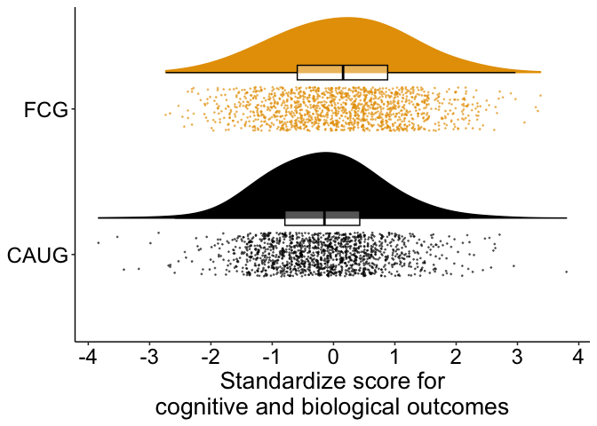<!-- -->

``` r
ggsave(
  paste0(home, "figures/aim1_cog_bio.png"),
  dpi = 600,
  width = 9, 
  height = 7
)
```

### Psychopathology

``` r
d_psy %>% 
  ggplot(aes(group, value_z)) +
  geom_flat_violin(
    aes(color = group, fill = group),
    position = position_nudge(x = .25, y = 0),
    adjust = 2,
    trim = TRUE
  ) +
  geom_point(
    aes(color = group, fill = group),
    position = position_jitter(width = .15),
    size = .25,
    alpha = 1/2
  ) +
  geom_boxplot(
    aes(x = as.numeric(group) + .25, y = value_z, group = group),
    color = "black",
    alpha = 1/3,
    width = .1,
    outlier.shape = NA
  ) +
  scale_y_continuous(breaks = seq.int(-4, 6, 1)) +
  scale_fill_manual(values = cbbPalette) +
  scale_color_manual(values = cbbPalette) +
  theme_beip +
  theme(
    legend.position = "none",
    plot.caption = element_text(hjust = .5, size = 15)
  ) +
  coord_flip() +
  labs(
    x = NULL,
    y = "Standardize score for\n symptoms of psychopathology"
  )
```

<!-- -->

``` r
ggsave(
  paste0(home, "figures/aim1_psy.png"),
  dpi = 600,
  width = 9, 
  height = 7
)
```

## Aim 2 moderating effects

``` r
d_plot <-
  d_cog_bio %>% 
  dplyr::select(
    ID, 
    group, 
    male,
    wave_ordered, 
    age_years, 
    construct, 
    value_z
  ) %>% 
  bind_rows(
    d_psy %>% 
      dplyr::select(
        ID, 
        group, 
        male,
        wave_ordered, 
        age_years, 
        domain, 
        value_z
      )
  ) %>% 
  mutate(
    domain_construct_pretty = case_when(
      construct == "IQ" ~ "IQ",
      construct == "physical" ~ "Physical growth",
      construct == "EEG" ~ paste0("EEG alpha power"),
      domain == "rad"~ "Reactive attachment\ndisorder",
      domain == "dsed" ~ "Disinhibited social\nengagement disorder",
      domain == "adhd" ~ "ADHD",
      domain == "extern" ~ "Externalizing",
      domain == "intern" ~ "Internalizing"
    ),
    domain_construct_pretty = fct_relevel(
      domain_construct_pretty,
      "IQ",
      "Physical growth", 
      "EEG alpha power", 
      "Disinhibited social\nengagement disorder",
      "Reactive attachment\ndisorder",
      "ADHD", 
      "Externalizing", 
      "Internalizing"
    ),
    male = if_else(
      male == 1, "Male", "Female"
    ),
    group = recode_factor(
      group,
      "FCG" = "Foster care",
      "CAUG" = "Care as usual"
    )
  )
```

### By domain by age of assessment

``` r
d_plot %>% 
  ggplot(aes(age_years, value_z, fill = group, color = group)) +
  geom_smooth(method = "lm") +
  scale_y_continuous(breaks = seq.int(-1, 1, .2)) +
  scale_x_continuous(breaks = seq.int(5, 20, 5)) +
  scale_fill_manual(values = cbbPalette) +
  scale_color_manual(values = cbbPalette) +
  theme_beip +
  theme(
    legend.position = "bottom",
    plot.caption = element_text(hjust = .5, size = 16),
    axis.title.y = element_text(vjust = 2)
  ) +
  #coord_flip() +
  labs(
    fill = NULL,
    color = NULL,
    x = "Age of assessment (years)",
    y = "Standardized score"
  ) +
  facet_wrap(.~domain_construct_pretty, ncol = 2)
```

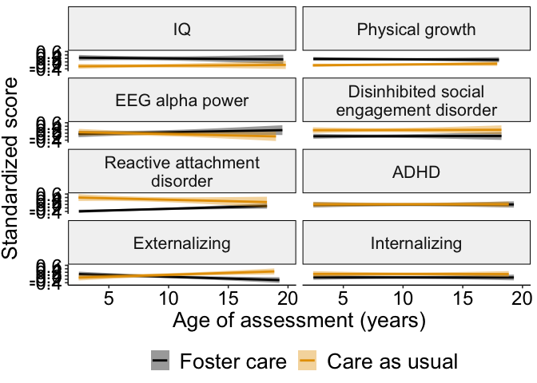<!-- -->

``` r
ggsave(
  paste0(home, "figures/aim2_all_domain_wave.png"),
  dpi = 600,
  width = 6, 
  height = 10
)

ggsave(
  paste0(home, "figures/aim2_all_domain_wave.pdf"),
  dpi = 600,
  width = 6, 
  height = 10
)
```

### Forest plot

``` r
library(weights)

forest_df_viz <-
  forest_df %>% 
  mutate_at(
    vars(Coefficient:p),
    as.numeric
  ) %>% 
  mutate(
    Parameter = fct_relevel(
      Parameter,
        "Overall cognitive, physical, and neural",
        "Overall psychopathology",
        "IQ",
        "Physical growth",
        "EEG alpha power",
        "Disinhibited social engagement disorder",
        "Reactive attachment disorder",
        "ADHD",
        "Externalizing",
        "Internalizing"
    ),
    p = rd(p, digits = 3),
    p = paste0("p=", p),
    p = if_else(
      p == "p=.0000000", "p<.001", p
    )
  )

forest_df_viz
```

    ## # A tibble: 10 × 5
    ##    Parameter                               Coefficient  CI_low CI_high p     
    ##    <fct>                                         <dbl>   <dbl>   <dbl> <chr> 
    ##  1 Overall cognitive, physical, and neural      0.262   0.0658  0.458  p=.012
    ##  2 Overall psychopathology                     -0.247  -0.416  -0.0812 p=.004
    ##  3 EEG alpha power                              0.0623 -0.162   0.291  p=.598
    ##  4 IQ                                           0.394   0.163   0.631  p<.001
    ##  5 Physical growth                              0.276   0.0732  0.480  p=.008
    ##  6 ADHD                                        -0.0480 -0.236   0.148  p=.618
    ##  7 Disinhibited social engagement disorder     -0.355  -0.560  -0.153  p<.001
    ##  8 Externalizing                               -0.150  -0.324   0.0506 p=.106
    ##  9 Internalizing                               -0.216  -0.415  -0.0252 p=.030
    ## 10 Reactive attachment disorder                -0.611  -0.811  -0.392  p<.001

``` r
forest_cogbio_p <-
  forest_df_viz %>% 
  filter(
    Parameter == "Overall cognitive, physical, and neural" |
    Parameter == "IQ" |
    Parameter == "Physical growth" |
    Parameter == "EEG alpha power"
  ) %>% 
  ggplot(aes(fct_rev(Parameter), Coefficient)) +
  geom_pointrange(
    aes(
      ymin = CI_low,
      ymax = CI_high
    ),
    size = .5
  ) + 
  geom_hline(yintercept = 0, linetype = "dotted") +
  geom_text(aes(label = p), nudge_y = .4) +
  scale_y_continuous(breaks = seq.int(-1, 1, .2), limits = c(-1, 1)) +
  coord_flip() +
  theme_beip +
  theme(
    axis.text.y = element_text(face = c("italic", "italic", "italic", "bold"))
  ) +
  labs(
    x = NULL,
    y = "Standardized regression coefficient"
  )

forest_cogbio_p
```

<!-- -->

``` r
ggsave(
  paste0(home, "figures/forest_plot_cogbio.png"),
  dpi = 600,
  width = 10.5, 
  height = 5
)
```

``` r
forest_psy_p <-
  forest_df_viz %>% 
  filter(
    Parameter != "Overall cognitive, physical, and neural",
    Parameter != "IQ",
    Parameter != "Physical growth",
    Parameter != "EEG alpha power",
  ) %>% 
  ggplot(aes(fct_rev(Parameter), Coefficient)) +
  geom_pointrange(
    aes(
      ymin = CI_low,
      ymax = CI_high
    ),
    size = .5
  ) + 
  geom_hline(yintercept = 0, linetype = "dotted") +
  geom_text(aes(label = p), nudge_y = .4) +
  scale_y_continuous(breaks = seq.int(-1, 1, .2), limits = c(-1, 1)) +
  coord_flip() +
  theme_beip +
  theme(
    axis.text.y = element_text(face = c("italic", "italic", "italic", "italic", "italic", "bold"))
  ) +
  labs(
    x = NULL,
    y = "Standardized regression coefficient"
  )

forest_psy_p
```

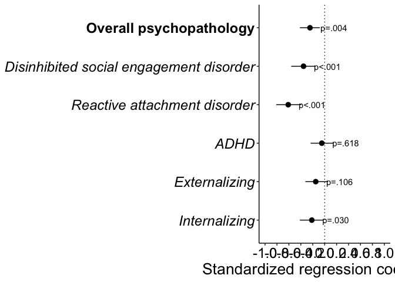<!-- -->

``` r
ggsave(
  paste0(home, "figures/forest_plot_psychopathology.png"),
  dpi = 600,
  width = 9, 
  height = 5
)

ggarrange(
  forest_cogbio_p, 
  forest_psy_p, 
  nrow = 2, 
  align = "hv"
)
```

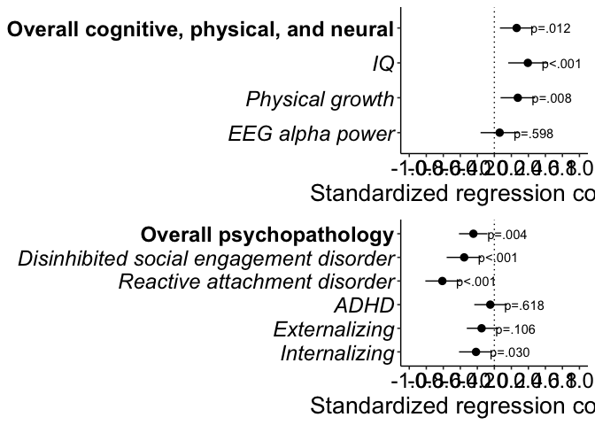<!-- -->

``` r
ggsave(
  paste0(home, "figures/forest_plot.png"),
  dpi = 600,
  width = 10.5, 
  height = 9
)

ggsave(
  paste0(home, "figures/forest_plot.pdf"),
  dpi = 600,
  width = 10.5, 
  height = 9
)
```

## Aim 3

#### Age of placement by domain

``` r
d_plot_fcg <-
  d_fcg_cog_bio %>% 
  dplyr::select(
    ID, 
    group, 
    male,
    age_years,
    wave_ordered, 
    FC_placement_age,
    stable,
    construct, 
    value_z
  ) %>% 
  bind_rows(
    d_fcg_psy %>% 
      dplyr::select(
        ID, 
        group, 
        male,
        age_years,
        wave_ordered, 
        FC_placement_age,
        stable,
        domain, 
        value_z
      )
  ) %>% 
  mutate(
    domain_construct_pretty = case_when(
      construct == "IQ" ~ "IQ",
      construct == "physical" ~ "Physical growth",
      construct == "EEG" ~ "EEG alpha power",
      domain == "rad"~ "Reactive attachment\ndisorder",
      domain == "dsed" ~ "Disinhibited social\nengagement disorder",
      domain == "adhd" ~ "ADHD",
      domain == "extern" ~ "Externalizing",
      domain == "intern" ~ "Internalizing"
    ),
    domain_construct_pretty = fct_relevel(
      domain_construct_pretty,
      "IQ",
      "Physical growth", 
      "EEG alpha power", 
      "Disinhibited social\nengagement disorder",
      "Reactive attachment\ndisorder",
      "ADHD", 
      "Externalizing", 
      "Internalizing"
    ),
    stable = recode_factor(
      stable,
      "disrupted" = "Disrupted",
      "stable" = "Stable"
    )
  )

d_plot_fcg %>% 
  ggplot(
    aes(
      FC_placement_age, 
      value_z, 
      color = wave_ordered
    )
  ) +
  geom_smooth(method = "lm", size = 2, se = FALSE) +
  scale_y_continuous(breaks = seq.int(-1, 1.4, .4)) +
  scale_x_continuous(breaks = seq.int(0, 30, 5)) +
  scale_color_viridis_d() +
  theme_beip +
  theme(
    legend.position = "right",
    plot.caption = element_text(hjust = .5, size = 16),
    axis.title.y = element_text(vjust = 2)
  ) +
  labs(
    color = "Assessment wave",
    x = "Age of placement in foster care (months)",
    y = "Standardized score"
  ) +
  facet_wrap(.~domain_construct_pretty, ncol = 2)
```

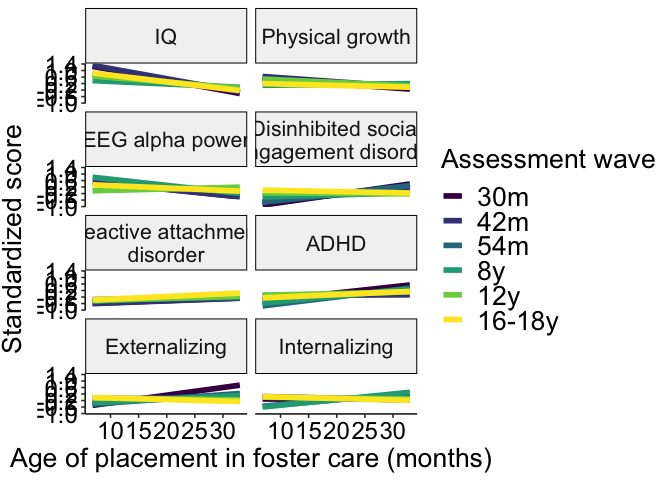<!-- -->

``` r
ggsave(
  paste0(home, "figures/aim3_all_ageplacement_domain_wave.png"),
  dpi = 600,
  width = 9, 
  height = 11
)
```

#### Stability by age of assessment

``` r
d_plot_fcg %>% 
  filter(!is.na(stable)) %>% 
  ggplot(
    aes(
      age_years, 
      value_z, 
      color = stable,
      fill = stable
    )
  ) +
  geom_smooth(method = "lm", size = 2) +
  scale_y_continuous(breaks = seq.int(-1, 1.4, .4)) +
  scale_x_continuous(breaks = seq.int(0, 30, 5)) +
  scale_color_viridis_d(begin = .5) +
  scale_fill_viridis_d(guide = FALSE, begin = .5) +
  theme_beip +
  theme(
    legend.position = "bottom",
    plot.caption = element_text(hjust = .5, size = 16),
    axis.title.y = element_text(vjust = 2)
  ) +
  labs(
    color = NULL,
    x = "Age of assessment (years)",
    y = "Standardized score"
  ) +
  facet_wrap(.~domain_construct_pretty, ncol = 2)
```

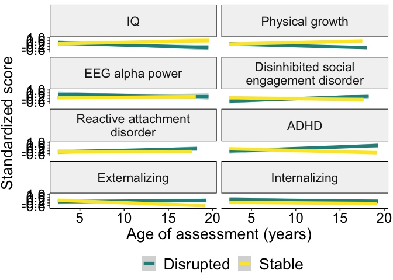<!-- -->

``` r
ggsave(
  paste0(home, "figures/aim3_all_stability_domain_age.png"),
  dpi = 600,
  width = 6, 
  height = 10
)

ggsave(
  paste0(home, "figures/aim3_all_stability_domain_age.pdf"),
  dpi = 600,
  width = 6, 
  height = 10
)
```

# Supplemental Analyses

## Associations of baseline characteristics with stability at each wave

``` r
stability_wide <- 
  d %>% 
  filter(group == "FCG") %>% 
  select(
    ID,
    wave,
    stable_num,
    stability_group
  ) %>% 
  distinct(ID, wave, stable_num, .keep_all = TRUE) %>% 
  filter(!is.na(stable_num)) %>% 
  # because child could be disrupted between assessment WITHIN a wave, counting as disrupted if marked as "0" for at least one assessment in that wave
  group_by(ID, wave) %>% 
  mutate(
    stable_num = max(stable_num, na.rm = TRUE)
  ) %>%
  distinct(ID, wave, stable_num, .keep_all = TRUE) %>% 
  pivot_wider(
    names_from = wave,
    values_from = stable_num,
    names_prefix = "stable_"
  ) 
```

``` r
d_BL_wide_FCG <-
  d_BL_wide %>% 
  filter(group == "FCG") %>% 
  left_join(stability_wide, by = "ID") 
```

``` r
## 8-year wave stability ~ baseline characteristics
d_BL_wide_FCG %>% 
  count(stable_8y)
```

    ## # A tibble: 3 × 2
    ##   stable_8y     n
    ##       <dbl> <int>
    ## 1         0    27
    ## 2         1    32
    ## 3        NA     6

``` r
# DSED
t.test(d_BL_wide_FCG$dsed ~ d_BL_wide_FCG$stable_8y)
```

    ## 
    ##  Welch Two Sample t-test
    ## 
    ## data:  d_BL_wide_FCG$dsed by d_BL_wide_FCG$stable_8y
    ## t = 0.66776, df = 48.455, p-value = 0.5075
    ## alternative hypothesis: true difference in means between group 0 and group 1 is not equal to 0
    ## 95 percent confidence interval:
    ##  -0.6980228  1.3924673
    ## sample estimates:
    ## mean in group 0 mean in group 1 
    ##        2.791667        2.444444

``` r
# RAD
t.test(d_BL_wide_FCG$rad ~ d_BL_wide_FCG$stable_8y)
```

    ## 
    ##  Welch Two Sample t-test
    ## 
    ## data:  d_BL_wide_FCG$rad by d_BL_wide_FCG$stable_8y
    ## t = -0.061068, df = 48.839, p-value = 0.9516
    ## alternative hypothesis: true difference in means between group 0 and group 1 is not equal to 0
    ## 95 percent confidence interval:
    ##  -1.412914  1.329581
    ## sample estimates:
    ## mean in group 0 mean in group 1 
    ##        2.458333        2.500000

``` r
# ADHD
t.test(d_BL_wide_FCG$adhd ~ d_BL_wide_FCG$stable_8y)
```

    ## 
    ##  Welch Two Sample t-test
    ## 
    ## data:  d_BL_wide_FCG$adhd by d_BL_wide_FCG$stable_8y
    ## t = 0.8665, df = 52.996, p-value = 0.3901
    ## alternative hypothesis: true difference in means between group 0 and group 1 is not equal to 0
    ## 95 percent confidence interval:
    ##  -0.1446525  0.3646967
    ## sample estimates:
    ## mean in group 0 mean in group 1 
    ##       0.7024359       0.5924138

``` r
# externalizing
t.test(d_BL_wide_FCG$extern ~ d_BL_wide_FCG$stable_8y)
```

    ## 
    ##  Welch Two Sample t-test
    ## 
    ## data:  d_BL_wide_FCG$extern by d_BL_wide_FCG$stable_8y
    ## t = 1.4135, df = 51.021, p-value = 0.1636
    ## alternative hypothesis: true difference in means between group 0 and group 1 is not equal to 0
    ## 95 percent confidence interval:
    ##  -0.06113965  0.35209456
    ## sample estimates:
    ## mean in group 0 mean in group 1 
    ##       0.5629487       0.4174713

``` r
# internalizing
t.test(d_BL_wide_FCG$intern ~ d_BL_wide_FCG$stable_8y)
```

    ## 
    ##  Welch Two Sample t-test
    ## 
    ## data:  d_BL_wide_FCG$intern by d_BL_wide_FCG$stable_8y
    ## t = 1.1191, df = 50.374, p-value = 0.2684
    ## alternative hypothesis: true difference in means between group 0 and group 1 is not equal to 0
    ## 95 percent confidence interval:
    ##  -0.07406977  0.26055076
    ## sample estimates:
    ## mean in group 0 mean in group 1 
    ##       0.6257692       0.5325287

``` r
# head circumference
t.test(d_BL_wide_FCG$head ~ d_BL_wide_FCG$stable_8y)
```

    ## 
    ##  Welch Two Sample t-test
    ## 
    ## data:  d_BL_wide_FCG$head by d_BL_wide_FCG$stable_8y
    ## t = -0.23302, df = 50.305, p-value = 0.8167
    ## alternative hypothesis: true difference in means between group 0 and group 1 is not equal to 0
    ## 95 percent confidence interval:
    ##  -1.405769  1.113462
    ## sample estimates:
    ## mean in group 0 mean in group 1 
    ##        46.30385        46.45000

``` r
# height
t.test(d_BL_wide_FCG$height ~ d_BL_wide_FCG$stable_8y)
```

    ## 
    ##  Welch Two Sample t-test
    ## 
    ## data:  d_BL_wide_FCG$height by d_BL_wide_FCG$stable_8y
    ## t = 1.6444, df = 50.155, p-value = 0.1063
    ## alternative hypothesis: true difference in means between group 0 and group 1 is not equal to 0
    ## 95 percent confidence interval:
    ##  -0.6563033  6.5859737
    ## sample estimates:
    ## mean in group 0 mean in group 1 
    ##        81.75769        78.79286

``` r
# weight
t.test(d_BL_wide_FCG$weight ~ d_BL_wide_FCG$stable_8y)
```

    ## 
    ##  Welch Two Sample t-test
    ## 
    ## data:  d_BL_wide_FCG$weight by d_BL_wide_FCG$stable_8y
    ## t = 0.72135, df = 52, p-value = 0.4739
    ## alternative hypothesis: true difference in means between group 0 and group 1 is not equal to 0
    ## 95 percent confidence interval:
    ##  -0.6417953  1.3621799
    ## sample estimates:
    ## mean in group 0 mean in group 1 
    ##        10.39269        10.03250

``` r
# weight
t.test(d_BL_wide_FCG$iq ~ d_BL_wide_FCG$stable_8y)
```

    ## 
    ##  Welch Two Sample t-test
    ## 
    ## data:  d_BL_wide_FCG$iq by d_BL_wide_FCG$stable_8y
    ## t = -0.22349, df = 51.006, p-value = 0.824
    ## alternative hypothesis: true difference in means between group 0 and group 1 is not equal to 0
    ## 95 percent confidence interval:
    ##  -10.174970   8.136508
    ## sample estimates:
    ## mean in group 0 mean in group 1 
    ##        67.23077        68.25000

``` r
## 12-year wave stability ~ baseline characteristics
d_BL_wide_FCG %>% 
  count(stable_12y)
```

    ## # A tibble: 3 × 2
    ##   stable_12y     n
    ##        <dbl> <int>
    ## 1          0    25
    ## 2          1    29
    ## 3         NA    11

``` r
# DSED
t.test(d_BL_wide_FCG$dsed ~ d_BL_wide_FCG$stable_12y)
```

    ## 
    ##  Welch Two Sample t-test
    ## 
    ## data:  d_BL_wide_FCG$dsed by d_BL_wide_FCG$stable_12y
    ## t = 0.90415, df = 44.996, p-value = 0.3707
    ## alternative hypothesis: true difference in means between group 0 and group 1 is not equal to 0
    ## 95 percent confidence interval:
    ##  -0.6093606  1.6021142
    ## sample estimates:
    ## mean in group 0 mean in group 1 
    ##        2.913043        2.416667

``` r
# RAD
t.test(d_BL_wide_FCG$rad ~ d_BL_wide_FCG$stable_12y)
```

    ## 
    ##  Welch Two Sample t-test
    ## 
    ## data:  d_BL_wide_FCG$rad by d_BL_wide_FCG$stable_12y
    ## t = 0.12739, df = 45.889, p-value = 0.8992
    ## alternative hypothesis: true difference in means between group 0 and group 1 is not equal to 0
    ## 95 percent confidence interval:
    ##  -1.364377  1.548724
    ## sample estimates:
    ## mean in group 0 mean in group 1 
    ##        2.652174        2.560000

``` r
# ADHD
t.test(d_BL_wide_FCG$adhd ~ d_BL_wide_FCG$stable_12y)
```

    ## 
    ##  Welch Two Sample t-test
    ## 
    ## data:  d_BL_wide_FCG$adhd by d_BL_wide_FCG$stable_12y
    ## t = 0.64472, df = 47.815, p-value = 0.5222
    ## alternative hypothesis: true difference in means between group 0 and group 1 is not equal to 0
    ## 95 percent confidence interval:
    ##  -0.1933064  0.3757637
    ## sample estimates:
    ## mean in group 0 mean in group 1 
    ##       0.6776389       0.5864103

``` r
# externalizing
t.test(d_BL_wide_FCG$extern ~ d_BL_wide_FCG$stable_12y)
```

    ## 
    ##  Welch Two Sample t-test
    ## 
    ## data:  d_BL_wide_FCG$extern by d_BL_wide_FCG$stable_12y
    ## t = 0.6547, df = 45.309, p-value = 0.516
    ## alternative hypothesis: true difference in means between group 0 and group 1 is not equal to 0
    ## 95 percent confidence interval:
    ##  -0.1512951  0.2970644
    ## sample estimates:
    ## mean in group 0 mean in group 1 
    ##       0.5358333       0.4629487

``` r
# internalizing
t.test(d_BL_wide_FCG$intern ~ d_BL_wide_FCG$stable_12y)
```

    ## 
    ##  Welch Two Sample t-test
    ## 
    ## data:  d_BL_wide_FCG$intern by d_BL_wide_FCG$stable_12y
    ## t = 0.25111, df = 47.953, p-value = 0.8028
    ## alternative hypothesis: true difference in means between group 0 and group 1 is not equal to 0
    ## 95 percent confidence interval:
    ##  -0.1372264  0.1763931
    ## sample estimates:
    ## mean in group 0 mean in group 1 
    ##       0.5562500       0.5366667

``` r
# head circumference
t.test(d_BL_wide_FCG$head ~ d_BL_wide_FCG$stable_12y)
```

    ## 
    ##  Welch Two Sample t-test
    ## 
    ## data:  d_BL_wide_FCG$head by d_BL_wide_FCG$stable_12y
    ## t = -0.59158, df = 46.83, p-value = 0.557
    ## alternative hypothesis: true difference in means between group 0 and group 1 is not equal to 0
    ## 95 percent confidence interval:
    ##  -1.6635695  0.9075695
    ## sample estimates:
    ## mean in group 0 mean in group 1 
    ##          46.250          46.628

``` r
# height
t.test(d_BL_wide_FCG$height ~ d_BL_wide_FCG$stable_12y)
```

    ## 
    ##  Welch Two Sample t-test
    ## 
    ## data:  d_BL_wide_FCG$height by d_BL_wide_FCG$stable_12y
    ## t = 1.0423, df = 45.69, p-value = 0.3028
    ## alternative hypothesis: true difference in means between group 0 and group 1 is not equal to 0
    ## 95 percent confidence interval:
    ##  -1.879704  5.915370
    ## sample estimates:
    ## mean in group 0 mean in group 1 
    ##        81.44583        79.42800

``` r
# weight
t.test(d_BL_wide_FCG$weight ~ d_BL_wide_FCG$stable_12y)
```

    ## 
    ##  Welch Two Sample t-test
    ## 
    ## data:  d_BL_wide_FCG$weight by d_BL_wide_FCG$stable_12y
    ## t = 0.31186, df = 46.947, p-value = 0.7565
    ## alternative hypothesis: true difference in means between group 0 and group 1 is not equal to 0
    ## 95 percent confidence interval:
    ##  -0.9013196  1.2320196
    ## sample estimates:
    ## mean in group 0 mean in group 1 
    ##        10.41375        10.24840

``` r
# weight
t.test(d_BL_wide_FCG$iq ~ d_BL_wide_FCG$stable_12y)
```

    ## 
    ##  Welch Two Sample t-test
    ## 
    ## data:  d_BL_wide_FCG$iq by d_BL_wide_FCG$stable_12y
    ## t = 0.42632, df = 46.544, p-value = 0.6718
    ## alternative hypothesis: true difference in means between group 0 and group 1 is not equal to 0
    ## 95 percent confidence interval:
    ##  -7.316186 11.249519
    ## sample estimates:
    ## mean in group 0 mean in group 1 
    ##        68.16667        66.20000

``` r
## 16/18-year wave stability ~ baseline characteristics
d_BL_wide_FCG %>% 
  count(`stable_16-18y`)
```

    ## # A tibble: 3 × 2
    ##   `stable_16-18y`     n
    ##             <dbl> <int>
    ## 1               0    28
    ## 2               1    24
    ## 3              NA    13

``` r
# DSED
t.test(d_BL_wide_FCG$dsed ~ d_BL_wide_FCG$`stable_16-18y`)
```

    ## 
    ##  Welch Two Sample t-test
    ## 
    ## data:  d_BL_wide_FCG$dsed by d_BL_wide_FCG$`stable_16-18y`
    ## t = 1.0715, df = 40.964, p-value = 0.2902
    ## alternative hypothesis: true difference in means between group 0 and group 1 is not equal to 0
    ## 95 percent confidence interval:
    ##  -0.5207189  1.6976419
    ## sample estimates:
    ## mean in group 0 mean in group 1 
    ##        3.038462        2.450000

``` r
# RAD
t.test(d_BL_wide_FCG$rad ~ d_BL_wide_FCG$`stable_16-18y`)
```

    ## 
    ##  Welch Two Sample t-test
    ## 
    ## data:  d_BL_wide_FCG$rad by d_BL_wide_FCG$`stable_16-18y`
    ## t = -0.29936, df = 39.846, p-value = 0.7662
    ## alternative hypothesis: true difference in means between group 0 and group 1 is not equal to 0
    ## 95 percent confidence interval:
    ##  -1.732147  1.285260
    ## sample estimates:
    ## mean in group 0 mean in group 1 
    ##        2.538462        2.761905

``` r
# ADHD
t.test(d_BL_wide_FCG$adhd ~ d_BL_wide_FCG$`stable_16-18y`)
```

    ## 
    ##  Welch Two Sample t-test
    ## 
    ## data:  d_BL_wide_FCG$adhd by d_BL_wide_FCG$`stable_16-18y`
    ## t = 0.014679, df = 40.896, p-value = 0.9884
    ## alternative hypothesis: true difference in means between group 0 and group 1 is not equal to 0
    ## 95 percent confidence interval:
    ##  -0.2989449  0.3033220
    ## sample estimates:
    ## mean in group 0 mean in group 1 
    ##       0.6270370       0.6248485

``` r
# externalizing
t.test(d_BL_wide_FCG$extern ~ d_BL_wide_FCG$`stable_16-18y`)
```

    ## 
    ##  Welch Two Sample t-test
    ## 
    ## data:  d_BL_wide_FCG$extern by d_BL_wide_FCG$`stable_16-18y`
    ## t = -0.093029, df = 46.992, p-value = 0.9263
    ## alternative hypothesis: true difference in means between group 0 and group 1 is not equal to 0
    ## 95 percent confidence interval:
    ##  -0.2312004  0.2107627
    ## sample estimates:
    ## mean in group 0 mean in group 1 
    ##       0.4996296       0.5098485

``` r
# internalizing
t.test(d_BL_wide_FCG$intern ~ d_BL_wide_FCG$`stable_16-18y`)
```

    ## 
    ##  Welch Two Sample t-test
    ## 
    ## data:  d_BL_wide_FCG$intern by d_BL_wide_FCG$`stable_16-18y`
    ## t = 0.25735, df = 47, p-value = 0.798
    ## alternative hypothesis: true difference in means between group 0 and group 1 is not equal to 0
    ## 95 percent confidence interval:
    ##  -0.1312903  0.1698088
    ## sample estimates:
    ## mean in group 0 mean in group 1 
    ##       0.5425926       0.5233333

``` r
# head circumference
t.test(d_BL_wide_FCG$head ~ d_BL_wide_FCG$`stable_16-18y`)
```

    ## 
    ##  Welch Two Sample t-test
    ## 
    ## data:  d_BL_wide_FCG$head by d_BL_wide_FCG$`stable_16-18y`
    ## t = -0.4776, df = 44.299, p-value = 0.6353
    ## alternative hypothesis: true difference in means between group 0 and group 1 is not equal to 0
    ## 95 percent confidence interval:
    ##  -1.5876012  0.9792096
    ## sample estimates:
    ## mean in group 0 mean in group 1 
    ##        46.27308        46.57727

``` r
# height
t.test(d_BL_wide_FCG$height ~ d_BL_wide_FCG$`stable_16-18y`)
```

    ## 
    ##  Welch Two Sample t-test
    ## 
    ## data:  d_BL_wide_FCG$height by d_BL_wide_FCG$`stable_16-18y`
    ## t = 0.75716, df = 45.901, p-value = 0.4528
    ## alternative hypothesis: true difference in means between group 0 and group 1 is not equal to 0
    ## 95 percent confidence interval:
    ##  -2.378331  5.246163
    ## sample estimates:
    ## mean in group 0 mean in group 1 
    ##        81.23846        79.80455

``` r
# weight
t.test(d_BL_wide_FCG$weight ~ d_BL_wide_FCG$`stable_16-18y`)
```

    ## 
    ##  Welch Two Sample t-test
    ## 
    ## data:  d_BL_wide_FCG$weight by d_BL_wide_FCG$`stable_16-18y`
    ## t = -0.053763, df = 43.554, p-value = 0.9574
    ## alternative hypothesis: true difference in means between group 0 and group 1 is not equal to 0
    ## 95 percent confidence interval:
    ##  -1.076844  1.020900
    ## sample estimates:
    ## mean in group 0 mean in group 1 
    ##        10.37885        10.40682

``` r
# weight
t.test(d_BL_wide_FCG$iq ~ d_BL_wide_FCG$`stable_16-18y`)
```

    ## 
    ##  Welch Two Sample t-test
    ## 
    ## data:  d_BL_wide_FCG$iq by d_BL_wide_FCG$`stable_16-18y`
    ## t = 0.86982, df = 41.649, p-value = 0.3894
    ## alternative hypothesis: true difference in means between group 0 and group 1 is not equal to 0
    ## 95 percent confidence interval:
    ##  -5.287362 13.294355
    ## sample estimates:
    ## mean in group 0 mean in group 1 
    ##        68.23077        64.22727

## Aim 2: Age as categorical

### EEG, IQ, physical size

``` r
# CAUG is baseline
contrasts(d_cog_bio$group) = c(0, 1)

contrasts(d_cog_bio$male) = c(-.5, .5) 

contrasts(d_cog_bio$construct) <- cbind(
  IQvEEG = c(-1/3, 1 - (1/3), -1/3),
  PHYSvEEG = c(-1/3, -1/3, 1 - (1/3))
)

contrasts(d_cog_bio$wave_ordered) <- cbind(
  `42mv30m` = c(-1/6, 1 - (1/6), -1/6, -1/6, -1/6, -1/6),
  `54mv30m` = c(-1/6, -1/6, 1 - (1/6), -1/6, -1/6, -1/6),
  `8yv30m` = c(-1/6, -1/6, -1/6, 1 - (1/6), -1/6, -1/6),
  `12yv30m` = c(-1/6, -1/6, -1/6, -1/6, 1 - (1/6), -1/6),
  `16yv30m` = c(-1/6, -1/6, -1/6, -1/6, -1/6, 1 - (1/6))
)
```

#### Two-way moderations

``` r
a2_cogbio_sup <- lmer(
  value_z ~ 
    group * construct +
    group * male +
    group * wave_ordered +
    (1|ID) +
    (1|family_id), 
  REML = FALSE,
  data = d_cog_bio
)

anova(a2_cogbio_sup)
```

    ## Type III Analysis of Variance Table with Satterthwaite's method
    ##                    Sum Sq Mean Sq NumDF   DenDF F value   Pr(>F)   
    ## group              4.3921  4.3921     1  142.18  6.2492 0.013561 * 
    ## construct          0.1479  0.0740     2 2664.85  0.1052 0.900118   
    ## male               1.3440  1.3440     1  124.23  1.9123 0.169189   
    ## wave_ordered       0.5770  0.1154     5 2679.83  0.1642 0.975658   
    ## group:construct    7.0911  3.5456     2 2664.85  5.0447 0.006505 **
    ## group:male         0.0089  0.0089     1  124.23  0.0126 0.910822   
    ## group:wave_ordered 4.9953  0.9991     5 2679.83  1.4215 0.213159   
    ## ---
    ## Signif. codes:  0 '***' 0.001 '**' 0.01 '*' 0.05 '.' 0.1 ' ' 1

### Psychopathology

``` r
contrasts(d_psy$group) = c(0, 1) # CAUG is baseline

contrasts(d_psy$male) = c(-.5, .5) 

contrasts(d_psy$domain) = cbind(
  DSEDvADHD = c(-1/5, 1 - (1/5), -1/5, -1/5, -1/5),
  EXTvADHD = c(-1/5, -1/5, 1 - (1/5), -1/5, -1/5),
  INTvADHD = c(-1/5, -1/5, -1/5, 1 - (1/5), -1/5),
  RADvADHD = c(-1/5, -1/5, -1/5, -1/5, 1 - (1/5))
)

contrasts(d_psy$informant) = c(-.5, .5)

contrasts(d_psy$wave_ordered) <- cbind(
  `42mv30m` = c(-1/6, 1 - (1/6), -1/6, -1/6, -1/6, -1/6),
  `54mv30m` = c(-1/6, -1/6, 1 - (1/6), -1/6, -1/6, -1/6),
  `8yv30m` = c(-1/6, -1/6, -1/6, 1 - (1/6), -1/6, -1/6),
  `12yv30m` = c(-1/6, -1/6, -1/6, -1/6, 1 - (1/6), -1/6),
  `16yv30m` = c(-1/6, -1/6, -1/6, -1/6, -1/6, 1 - (1/6))
)
```

#### Two-way moderations

``` r
a2_psy_type_sup <- lmer(
  value_z ~ 
    group * domain +
    group * male +
    group * wave_ordered +
    informant +
    (1|ID) +
    (1|family_id),  
  data = d_psy
)

anova(a2_psy_type_sup)
```

    ## Type III Analysis of Variance Table with Satterthwaite's method
    ##                    Sum Sq Mean Sq NumDF  DenDF F value         Pr(>F)    
    ## group               8.024  8.0242     1  125.9 10.2441       0.001736 ** 
    ## domain              0.241  0.0601     4 4149.5  0.0768       0.989344    
    ## male                5.249  5.2488     1  122.1  6.7009       0.010806 *  
    ## wave_ordered        2.252  0.4505     5 4190.6  0.5751       0.719176    
    ## informant           0.722  0.7221     1 4180.6  0.9219       0.337039    
    ## group:domain       36.257  9.0642     4 4149.6 11.5719 0.000000002413 ***
    ## group:male          1.888  1.8875     1  114.3  2.4097       0.123346    
    ## group:wave_ordered  5.794  1.1587     5 4192.2  1.4793       0.193040    
    ## ---
    ## Signif. codes:  0 '***' 0.001 '**' 0.01 '*' 0.05 '.' 0.1 ' ' 1

### Visualize effect of the intervention by assessment wave

``` r
d_plot_summary <-
  d_plot %>% 
  group_by(group, wave_ordered, domain_construct_pretty) %>% 
  summarise(
    n = n(),
    mean = mean(value_z),
    sd = sd(value_z),
    se = sd / sqrt(n)
  )

d_plot_summary %>% 
  ggplot(aes(wave_ordered, mean, color = group)) +
  geom_pointrange(
    aes(
      ymin = mean - se,
      ymax = mean + se
    ),
    position = "dodge"
  ) +
  #scale_fill_manual(values = cbbPalette) +
  scale_color_manual(values = cbbPalette) +
  theme_beip +
  theme(
    legend.position = "bottom",
    plot.caption = element_text(hjust = .5, size = 16),
    axis.title.y = element_text(vjust = 2),
    axis.title.x = element_text(vjust = -1),
    panel.grid.major.x = element_line(color = "gray", linetype = 3)
  ) +
  #coord_flip() +
  labs(
    fill = NULL,
    color = NULL,
    x = "Assessment wave",
    y = "Standardized score"
  ) +
  facet_wrap(.~domain_construct_pretty, ncol = 2)
```

<!-- -->

``` r
ggsave(
  paste0(home, "figures/supplemental_aim2_domain_wave_means.png"),
  dpi = 600,
  width = 9, 
  height = 11
)
```

## Aim 3: Age as categorical

### Age of placement

#### EEG, IQ, physical size

``` r
contrasts(d_fcg_cog_bio$male) = c(-.5, .5) 

contrasts(d_fcg_cog_bio$construct) <- cbind(
  IQvEEG = c(-1/3, 1 - (1/3), -1/3),
  PHYSvEEG = c(-1/3, -1/3, 1 - (1/3))
)

contrasts(d_fcg_cog_bio$wave_ordered) <- cbind(
  `42mv30m` = c(-1/6, 1 - (1/6), -1/6, -1/6, -1/6, -1/6),
  `54mv30m` = c(-1/6, -1/6, 1 - (1/6), -1/6, -1/6, -1/6),
  `8yv30m` = c(-1/6, -1/6, -1/6, 1 - (1/6), -1/6, -1/6),
  `12yv30m` = c(-1/6, -1/6, -1/6, -1/6, 1 - (1/6), -1/6),
  `16yv30m` = c(-1/6, -1/6, -1/6, -1/6, -1/6, 1 - (1/6))
)
```

``` r
###### Two-way moderations
a3_age_placement_sup_X <- lmer(
  value_z ~ 
    scale(FC_placement_age, scale = TRUE) * male +
    scale(FC_placement_age, scale = TRUE) * wave_ordered +
    scale(FC_placement_age, scale = TRUE) * construct +
    (1|ID) +
    (1|family_id), 
  data = d_fcg_cog_bio
)

anova(a3_age_placement_std_X)
```

    ## Type III Analysis of Variance Table with Satterthwaite's method
    ##                                                                      Sum Sq
    ## scale(FC_placement_age, scale = TRUE)                                4.9783
    ## male                                                                 1.6114
    ## scale(age_years, scale = TRUE)                                       0.7571
    ## construct                                                            2.2375
    ## scale(FC_placement_age, scale = TRUE):male                           1.8489
    ## scale(FC_placement_age, scale = TRUE):scale(age_years, scale = TRUE) 4.0998
    ## scale(FC_placement_age, scale = TRUE):construct                      7.0161
    ##                                                                      Mean Sq
    ## scale(FC_placement_age, scale = TRUE)                                 4.9783
    ## male                                                                  1.6114
    ## scale(age_years, scale = TRUE)                                        0.7571
    ## construct                                                             1.1187
    ## scale(FC_placement_age, scale = TRUE):male                            1.8489
    ## scale(FC_placement_age, scale = TRUE):scale(age_years, scale = TRUE)  4.0998
    ## scale(FC_placement_age, scale = TRUE):construct                       3.5080
    ##                                                                      NumDF
    ## scale(FC_placement_age, scale = TRUE)                                    1
    ## male                                                                     1
    ## scale(age_years, scale = TRUE)                                           1
    ## construct                                                                2
    ## scale(FC_placement_age, scale = TRUE):male                               1
    ## scale(FC_placement_age, scale = TRUE):scale(age_years, scale = TRUE)     1
    ## scale(FC_placement_age, scale = TRUE):construct                          2
    ##                                                                        DenDF
    ## scale(FC_placement_age, scale = TRUE)                                  60.57
    ## male                                                                   57.66
    ## scale(age_years, scale = TRUE)                                       1347.49
    ## construct                                                            1324.72
    ## scale(FC_placement_age, scale = TRUE):male                             55.70
    ## scale(FC_placement_age, scale = TRUE):scale(age_years, scale = TRUE) 1354.20
    ## scale(FC_placement_age, scale = TRUE):construct                      1325.48
    ##                                                                      F value
    ## scale(FC_placement_age, scale = TRUE)                                 6.6906
    ## male                                                                  2.1656
    ## scale(age_years, scale = TRUE)                                        1.0175
    ## construct                                                             1.5035
    ## scale(FC_placement_age, scale = TRUE):male                            2.4848
    ## scale(FC_placement_age, scale = TRUE):scale(age_years, scale = TRUE)  5.5099
    ## scale(FC_placement_age, scale = TRUE):construct                       4.7146
    ##                                                                        Pr(>F)
    ## scale(FC_placement_age, scale = TRUE)                                0.012111
    ## male                                                                 0.146567
    ## scale(age_years, scale = TRUE)                                       0.313305
    ## construct                                                            0.222723
    ## scale(FC_placement_age, scale = TRUE):male                           0.120616
    ## scale(FC_placement_age, scale = TRUE):scale(age_years, scale = TRUE) 0.019053
    ## scale(FC_placement_age, scale = TRUE):construct                      0.009114
    ##                                                                        
    ## scale(FC_placement_age, scale = TRUE)                                * 
    ## male                                                                   
    ## scale(age_years, scale = TRUE)                                         
    ## construct                                                              
    ## scale(FC_placement_age, scale = TRUE):male                             
    ## scale(FC_placement_age, scale = TRUE):scale(age_years, scale = TRUE) * 
    ## scale(FC_placement_age, scale = TRUE):construct                      **
    ## ---
    ## Signif. codes:  0 '***' 0.001 '**' 0.01 '*' 0.05 '.' 0.1 ' ' 1

##### By wave

``` r
# 30 months is baseline
contrasts(d_fcg_cog_bio$wave_ordered) <- cbind(
  `42mv30m` = c(0, 1, 0, 0, 0, 0),
  `54mv30m` = c(0, 0, 1, 0, 0, 0),
  `8yv30m` = c(0, 0, 0, 1, 0, 0),
  `12yv30m` = c(0, 0, 0, 0, 1, 0),
  `16yv30m` = c(0, 0, 0, 0, 0, 1)
)

a3_cog_bio_age_placement_wave30 <- lmer(
  value_z ~ 
    scale(FC_placement_age, scale = TRUE) * wave_ordered +
    construct +
    male +
    (1|ID) +
    (1|family_id), 
  data = d_fcg_cog_bio
)

set.seed(123456)
a3_cog_bio_age_placement_wave30_parameters <- 
  model_parameters(
    a3_cog_bio_age_placement_wave30,
    bootstrap = TRUE,
    ci_method = "quantile",
    iterations = 1000
  )
a3_cog_bio_age_placement_wave30_parameters
```

    ## # Fixed Effects
    ## 
    ## Parameter                              | Coefficient |         95% CI |     p
    ## -----------------------------------------------------------------------------
    ## (Intercept)                            |        0.08 | [-0.10,  0.25] | 0.374
    ## FC placement age                       |       -0.27 | [-0.45, -0.10] | 0.002
    ## wave ordered42mv30m                    |        0.12 | [-0.03,  0.27] | 0.138
    ## wave ordered54mv30m                    |        0.04 | [-0.22,  0.30] | 0.748
    ## wave ordered8yv30m                     |        0.07 | [-0.07,  0.21] | 0.332
    ## wave ordered12yv30m                    |        0.05 | [-0.10,  0.18] | 0.504
    ## wave ordered16yv30m                    |       -0.05 | [-0.19,  0.10] | 0.538
    ## constructIQvEEG                        |        0.12 | [-0.02,  0.26] | 0.106
    ## constructPHYSvEEG                      |        0.09 | [-0.03,  0.21] | 0.176
    ## male [1]                               |        0.22 | [-0.08,  0.53] | 0.124
    ## FC placement age × wave ordered42mv30m |   -6.66e-03 | [-0.14,  0.13] | 0.920
    ## FC placement age × wave ordered54mv30m |        0.03 | [-0.22,  0.27] | 0.852
    ## FC placement age × wave ordered8yv30m  |        0.19 | [ 0.06,  0.34] | 0.012
    ## FC placement age × wave ordered12yv30m |        0.16 | [ 0.02,  0.31] | 0.022
    ## FC placement age × wave ordered16yv30m |        0.14 | [-0.01,  0.30] | 0.078

``` r
# 42 months is baseline
contrasts(d_fcg_cog_bio$wave_ordered) <- cbind(
  `30mv42m` = c(1, 0, 0, 0, 0, 0),
  `54mv42m` = c(0, 0, 1, 0, 0, 0),
  `8yv42m` = c(0, 0, 0, 1, 0, 0),
  `12yv42m` = c(0, 0, 0, 0, 1, 0),
  `16yv42m` = c(0, 0, 0, 0, 0, 1)
)

a3_cog_bio_age_placement_wave42 <- lmer(
  value_z ~ 
    scale(FC_placement_age, scale = TRUE) * wave_ordered +
    construct +
    male +
    (1|ID) +
    (1|family_id), 
  data = d_fcg_cog_bio
)

set.seed(123456)
a3_cog_bio_age_placement_wave42_parameters <- 
  model_parameters(
    a3_cog_bio_age_placement_wave42,
    bootstrap = TRUE,
    ci_method = "quantile",
    iterations = 1000
  )
a3_cog_bio_age_placement_wave42_parameters
```

    ## # Fixed Effects
    ## 
    ## Parameter                              | Coefficient |         95% CI |     p
    ## -----------------------------------------------------------------------------
    ## (Intercept)                            |        0.19 | [ 0.02,  0.38] | 0.028
    ## FC placement age                       |       -0.28 | [-0.46, -0.10] | 0.006
    ## wave ordered30mv42m                    |       -0.12 | [-0.27,  0.03] | 0.138
    ## wave ordered54mv42m                    |       -0.07 | [-0.32,  0.17] | 0.594
    ## wave ordered8yv42m                     |       -0.05 | [-0.19,  0.10] | 0.548
    ## wave ordered12yv42m                    |       -0.07 | [-0.22,  0.08] | 0.406
    ## wave ordered16yv42m                    |       -0.16 | [-0.32, -0.02] | 0.030
    ## constructIQvEEG                        |        0.12 | [-0.02,  0.26] | 0.106
    ## constructPHYSvEEG                      |        0.09 | [-0.03,  0.21] | 0.176
    ## male [1]                               |        0.22 | [-0.08,  0.53] | 0.124
    ## FC placement age × wave ordered30mv42m |    6.66e-03 | [-0.13,  0.14] | 0.920
    ## FC placement age × wave ordered54mv42m |        0.03 | [-0.21,  0.28] | 0.806
    ## FC placement age × wave ordered8yv42m  |        0.20 | [ 0.06,  0.35] | 0.010
    ## FC placement age × wave ordered12yv42m |        0.17 | [ 0.02,  0.32] | 0.030
    ## FC placement age × wave ordered16yv42m |        0.15 | [ 0.00,  0.30] | 0.056

``` r
# 54 months is baseline
contrasts(d_fcg_cog_bio$wave_ordered) <- cbind(
  `30mv54m` = c(1, 0, 0, 0, 0, 0),
  `42mv54m` = c(0, 1, 0, 0, 0, 0),
  `8yv54m` = c(0, 0, 0, 1, 0, 0),
  `12yv54m` = c(0, 0, 0, 0, 1, 0),
  `16yv54m` = c(0, 0, 0, 0, 0, 1)
)

a3_cog_bio_age_placement_wave54 <- lmer(
  value_z ~ 
    scale(FC_placement_age, scale = TRUE) * wave_ordered +
    construct +
    male +
    (1|ID) +
    (1|family_id), 
  data = d_fcg_cog_bio
)

set.seed(123456)
a3_cog_bio_age_placement_wave54_parameters <- 
  model_parameters(
    a3_cog_bio_age_placement_wave54,
    bootstrap = TRUE,
    ci_method = "quantile",
    iterations = 1000
  )
a3_cog_bio_age_placement_wave54_parameters
```

    ## # Fixed Effects
    ## 
    ## Parameter                              | Coefficient |        95% CI |     p
    ## ----------------------------------------------------------------------------
    ## (Intercept)                            |        0.12 | [-0.17, 0.38] | 0.392
    ## FC placement age                       |       -0.25 | [-0.51, 0.02] | 0.080
    ## wave ordered30mv54m                    |       -0.04 | [-0.30, 0.22] | 0.748
    ## wave ordered42mv54m                    |        0.07 | [-0.17, 0.32] | 0.594
    ## wave ordered8yv54m                     |        0.03 | [-0.22, 0.29] | 0.826
    ## wave ordered12yv54m                    |   -1.14e-03 | [-0.26, 0.27] | 0.994
    ## wave ordered16yv54m                    |       -0.09 | [-0.35, 0.18] | 0.498
    ## constructIQvEEG                        |        0.12 | [-0.02, 0.26] | 0.106
    ## constructPHYSvEEG                      |        0.09 | [-0.03, 0.21] | 0.176
    ## male [1]                               |        0.22 | [-0.08, 0.53] | 0.124
    ## FC placement age × wave ordered30mv54m |       -0.03 | [-0.27, 0.22] | 0.852
    ## FC placement age × wave ordered42mv54m |       -0.03 | [-0.28, 0.21] | 0.806
    ## FC placement age × wave ordered8yv54m  |        0.17 | [-0.09, 0.41] | 0.220
    ## FC placement age × wave ordered12yv54m |        0.14 | [-0.11, 0.40] | 0.266
    ## FC placement age × wave ordered16yv54m |        0.11 | [-0.13, 0.37] | 0.384

``` r
# 8 years is baseline
contrasts(d_fcg_cog_bio$wave_ordered) <- cbind(
  `30mv8y` = c(1, 0, 0, 0, 0, 0),
  `42mv8y` = c(0, 1, 0, 0, 0, 0),
  `54mv8y` = c(0, 0, 1, 0, 0, 0),
  `12yv8y` = c(0, 0, 0, 0, 1, 0),
  `16yv8y` = c(0, 0, 0, 0, 0, 1)
)

a3_cog_bio_age_placement_wave8 <- lmer(
  value_z ~ 
    scale(FC_placement_age, scale = TRUE) * wave_ordered +
    construct +
    male +
    (1|ID) +
    (1|family_id), 
  data = d_fcg_cog_bio
)

set.seed(123456)
a3_cog_bio_age_placement_wave8_parameters <- 
  model_parameters(
    a3_cog_bio_age_placement_wave8,
    bootstrap = TRUE,
    ci_method = "quantile",
    iterations = 1000
  )
a3_cog_bio_age_placement_wave8_parameters
```

    ## # Fixed Effects
    ## 
    ## Parameter                             | Coefficient |         95% CI |     p
    ## ----------------------------------------------------------------------------
    ## (Intercept)                           |        0.15 | [-0.02,  0.33] | 0.082
    ## FC placement age                      |       -0.08 | [-0.26,  0.10] | 0.340
    ## wave ordered30mv8y                    |       -0.07 | [-0.21,  0.07] | 0.332
    ## wave ordered42mv8y                    |        0.05 | [-0.10,  0.19] | 0.548
    ## wave ordered54mv8y                    |       -0.03 | [-0.29,  0.22] | 0.826
    ## wave ordered12yv8y                    |       -0.02 | [-0.16,  0.12] | 0.732
    ## wave ordered16yv8y                    |       -0.11 | [-0.27,  0.02] | 0.122
    ## constructIQvEEG                       |        0.12 | [-0.02,  0.26] | 0.106
    ## constructPHYSvEEG                     |        0.09 | [-0.03,  0.21] | 0.176
    ## male [1]                              |        0.22 | [-0.08,  0.53] | 0.124
    ## FC placement age × wave ordered30mv8y |       -0.19 | [-0.34, -0.06] | 0.012
    ## FC placement age × wave ordered42mv8y |       -0.20 | [-0.35, -0.06] | 0.010
    ## FC placement age × wave ordered54mv8y |       -0.17 | [-0.41,  0.09] | 0.220
    ## FC placement age × wave ordered12yv8y |       -0.03 | [-0.18,  0.11] | 0.712
    ## FC placement age × wave ordered16yv8y |       -0.05 | [-0.21,  0.09] | 0.514

``` r
# 12 years is baseline
contrasts(d_fcg_cog_bio$wave_ordered) <- cbind(
  `30mv12y` = c(1, 0, 0, 0, 0, 0),
  `42mv12y` = c(0, 1, 0, 0, 0, 0),
  `54mv12y` = c(0, 0, 1, 0, 0, 0),
  `8yv12y` = c(0, 0, 0, 1, 0, 0),
  `16yv12y` = c(0, 0, 0, 0, 0, 1)
)

a3_cog_bio_age_placement_wave12 <- lmer(
  value_z ~ 
    scale(FC_placement_age, scale = TRUE) * wave_ordered +
    construct +
    male +
    (1|ID) +
    (1|family_id), 
  data = d_fcg_cog_bio
)

set.seed(123456)
a3_cog_bio_age_placement_wave12_parameters <- 
  model_parameters(
    a3_cog_bio_age_placement_wave12,
    bootstrap = TRUE,
    ci_method = "quantile",
    iterations = 1000
  )
a3_cog_bio_age_placement_wave12_parameters
```

    ## # Fixed Effects
    ## 
    ## Parameter                              | Coefficient |         95% CI |     p
    ## -----------------------------------------------------------------------------
    ## (Intercept)                            |        0.13 | [-0.06,  0.31] | 0.178
    ## FC placement age                       |       -0.11 | [-0.29,  0.06] | 0.220
    ## wave ordered30mv12y                    |       -0.05 | [-0.18,  0.10] | 0.504
    ## wave ordered42mv12y                    |        0.07 | [-0.08,  0.22] | 0.406
    ## wave ordered54mv12y                    |    1.14e-03 | [-0.27,  0.26] | 0.994
    ## wave ordered8yv12y                     |        0.02 | [-0.12,  0.16] | 0.732
    ## wave ordered16yv12y                    |       -0.09 | [-0.24,  0.06] | 0.228
    ## constructIQvEEG                        |        0.12 | [-0.02,  0.26] | 0.106
    ## constructPHYSvEEG                      |        0.09 | [-0.03,  0.21] | 0.176
    ## male [1]                               |        0.22 | [-0.08,  0.53] | 0.124
    ## FC placement age × wave ordered30mv12y |       -0.16 | [-0.31, -0.02] | 0.022
    ## FC placement age × wave ordered42mv12y |       -0.17 | [-0.32, -0.02] | 0.030
    ## FC placement age × wave ordered54mv12y |       -0.14 | [-0.40,  0.11] | 0.266
    ## FC placement age × wave ordered8yv12y  |        0.03 | [-0.11,  0.18] | 0.712
    ## FC placement age × wave ordered16yv12y |       -0.03 | [-0.17,  0.13] | 0.746

``` r
# 16 years is baseline
contrasts(d_fcg_cog_bio$wave_ordered) <- cbind(
  `30mv16y` = c(1, 0, 0, 0, 0, 0),
  `42mv16y` = c(0, 1, 0, 0, 0, 0),
  `54mv16y` = c(0, 0, 1, 0, 0, 0),
  `8yv16y` = c(0, 0, 0, 1, 0, 0),
  `12yv16y` = c(0, 0, 0, 0, 1, 0)
)

a3_cog_bio_age_placement_wave16 <- lmer(
  value_z ~ 
    scale(FC_placement_age, scale = TRUE) * wave_ordered +
    construct +
    male +
    (1|ID) +
    (1|family_id), 
  data = d_fcg_cog_bio
)

set.seed(123456)
a3_cog_bio_age_placement_wave16_parameters <- 
  model_parameters(
    a3_cog_bio_age_placement_wave16,
    bootstrap = TRUE,
    ci_method = "quantile",
    iterations = 1000
  )
a3_cog_bio_age_placement_wave16_parameters
```

    ## # Fixed Effects
    ## 
    ## Parameter                              | Coefficient |        95% CI |     p
    ## ----------------------------------------------------------------------------
    ## (Intercept)                            |        0.03 | [-0.16, 0.22] | 0.710
    ## FC placement age                       |       -0.13 | [-0.33, 0.06] | 0.142
    ## wave ordered30mv16y                    |        0.05 | [-0.10, 0.19] | 0.538
    ## wave ordered42mv16y                    |        0.16 | [ 0.02, 0.32] | 0.030
    ## wave ordered54mv16y                    |        0.09 | [-0.18, 0.35] | 0.498
    ## wave ordered8yv16y                     |        0.11 | [-0.02, 0.27] | 0.122
    ## wave ordered12yv16y                    |        0.09 | [-0.06, 0.24] | 0.228
    ## constructIQvEEG                        |        0.12 | [-0.02, 0.26] | 0.106
    ## constructPHYSvEEG                      |        0.09 | [-0.03, 0.21] | 0.176
    ## male [1]                               |        0.22 | [-0.08, 0.53] | 0.124
    ## FC placement age × wave ordered30mv16y |       -0.14 | [-0.30, 0.01] | 0.078
    ## FC placement age × wave ordered42mv16y |       -0.15 | [-0.30, 0.00] | 0.056
    ## FC placement age × wave ordered54mv16y |       -0.11 | [-0.37, 0.13] | 0.384
    ## FC placement age × wave ordered8yv16y  |        0.05 | [-0.09, 0.21] | 0.514
    ## FC placement age × wave ordered12yv16y |        0.03 | [-0.13, 0.17] | 0.746

#### Psychopathology

``` r
contrasts(d_fcg_psy$male) = c(-.5, .5) 

contrasts(d_fcg_psy$domain) = cbind(
  DSEDvADHD = c(-1/5, 1 - (1/5), -1/5, -1/5, -1/5),
  EXTvADHD = c(-1/5, -1/5, 1 - (1/5), -1/5, -1/5),
  INTvADHD = c(-1/5, -1/5, -1/5, 1 - (1/5), -1/5),
  RADvADHD = c(-1/5, -1/5, -1/5, -1/5, 1 - (1/5))
)

contrasts(d_fcg_psy$informant) = c(-.5, .5)

contrasts(d_fcg_psy$wave_ordered) <- cbind(
  `42mv30m` = c(-1/6, 1 - (1/6), -1/6, -1/6, -1/6, -1/6),
  `54mv30m` = c(-1/6, -1/6, 1 - (1/6), -1/6, -1/6, -1/6),
  `8yv30m` = c(-1/6, -1/6, -1/6, 1 - (1/6), -1/6, -1/6),
  `12yv30m` = c(-1/6, -1/6, -1/6, -1/6, 1 - (1/6), -1/6),
  `16yv30m` = c(-1/6, -1/6, -1/6, -1/6, -1/6, 1 - (1/6))
)
```

``` r
a3_psy_age_placement_sup_X <- lmer(
  value_z ~ 
    scale(FC_placement_age, scale = TRUE) * male +
    scale(FC_placement_age, scale = TRUE) * wave_ordered +
    scale(FC_placement_age, scale = TRUE) * domain +
    informant +
    (1|ID) +
    (1|family_id),
  data = d_fcg_psy
)

anova(a3_psy_age_placement_sup_X)
```

    ## Type III Analysis of Variance Table with Satterthwaite's method
    ##                                                     Sum Sq Mean Sq NumDF
    ## scale(FC_placement_age, scale = TRUE)               0.9373  0.9373     1
    ## male                                                5.1326  5.1326     1
    ## wave_ordered                                        5.2957  1.0591     5
    ## domain                                             14.6996  3.6749     4
    ## informant                                           0.2902  0.2902     1
    ## scale(FC_placement_age, scale = TRUE):male          0.0520  0.0520     1
    ## scale(FC_placement_age, scale = TRUE):wave_ordered 13.9325  2.7865     5
    ## scale(FC_placement_age, scale = TRUE):domain        4.5277  1.1319     4
    ##                                                      DenDF F value    Pr(>F)
    ## scale(FC_placement_age, scale = TRUE)                60.46  1.4329 0.2359619
    ## male                                                 41.12  7.8467 0.0077261
    ## wave_ordered                                       2078.33  1.6192 0.1515580
    ## domain                                             2063.40  5.6181 0.0001698
    ## informant                                          2072.85  0.4436 0.5054657
    ## scale(FC_placement_age, scale = TRUE):male           31.04  0.0794 0.7799220
    ## scale(FC_placement_age, scale = TRUE):wave_ordered 2085.02  4.2599 0.0007403
    ## scale(FC_placement_age, scale = TRUE):domain       2063.52  1.7305 0.1405263
    ##                                                       
    ## scale(FC_placement_age, scale = TRUE)                 
    ## male                                               ** 
    ## wave_ordered                                          
    ## domain                                             ***
    ## informant                                             
    ## scale(FC_placement_age, scale = TRUE):male            
    ## scale(FC_placement_age, scale = TRUE):wave_ordered ***
    ## scale(FC_placement_age, scale = TRUE):domain          
    ## ---
    ## Signif. codes:  0 '***' 0.001 '**' 0.01 '*' 0.05 '.' 0.1 ' ' 1

##### By wave

``` r
# 30 months is baseline
contrasts(d_fcg_psy$wave_ordered) <- cbind(
  `42mv30m` = c(0, 1, 0, 0, 0, 0),
  `54mv30m` = c(0, 0, 1, 0, 0, 0),
  `8yv30m` = c(0, 0, 0, 1, 0, 0),
  `12yv30m` = c(0, 0, 0, 0, 1, 0),
  `16yv30m` = c(0, 0, 0, 0, 0, 1)
)

a3_psy_age_placement_wave30 <- lmer(
  value_z ~ 
    scale(FC_placement_age, scale = TRUE) * wave_ordered +
    domain +
    male +
    informant +
    (1|ID) +
    (1|family_id), 
  data = d_fcg_psy
)

set.seed(123456)
a3_psy_age_placement_wave30_parameters <- 
  model_parameters(
    a3_psy_age_placement_wave30,
    bootstrap = TRUE,
    ci_method = "quantile",
    iterations = 1000
  )
a3_psy_age_placement_wave30_parameters
```

    ## # Fixed Effects
    ## 
    ## Parameter                              | Coefficient |         95% CI |      p
    ## ------------------------------------------------------------------------------
    ## (Intercept)                            |        0.03 | [-0.13,  0.19] | 0.694 
    ## FC placement age                       |        0.17 | [ 0.02,  0.32] | 0.020 
    ## wave ordered42mv30m                    |       -0.12 | [-0.26,  0.00] | 0.054 
    ## wave ordered54mv30m                    |       -0.07 | [-0.21,  0.06] | 0.286 
    ## wave ordered8yv30m                     |       -0.16 | [-0.31, -0.01] | 0.040 
    ## wave ordered12yv30m                    |       -0.15 | [-0.27, -0.03] | 0.020 
    ## wave ordered16yv30m                    |       -0.15 | [-0.28, -0.04] | 0.002 
    ## domainDSEDvADHD                        |       -0.15 | [-0.27, -0.05] | 0.006 
    ## domainEXTvADHD                         |       -0.06 | [-0.16,  0.04] | 0.286 
    ## domainINTvADHD                         |       -0.08 | [-0.18,  0.03] | 0.152 
    ## domainRADvADHD                         |       -0.27 | [-0.40, -0.15] | < .001
    ## male [1]                               |        0.32 | [ 0.11,  0.55] | 0.004 
    ## informant1                             |        0.04 | [-0.08,  0.15] | 0.482 
    ## FC placement age × wave ordered42mv30m |       -0.13 | [-0.26,  0.01] | 0.080 
    ## FC placement age × wave ordered54mv30m |       -0.01 | [-0.14,  0.12] | 0.856 
    ## FC placement age × wave ordered8yv30m  |       -0.05 | [-0.19,  0.08] | 0.424 
    ## FC placement age × wave ordered12yv30m |       -0.18 | [-0.30, -0.06] | 0.004 
    ## FC placement age × wave ordered16yv30m |       -0.23 | [-0.35, -0.11] | 0.002

``` r
# 42 months is baseline
contrasts(d_fcg_psy$wave_ordered) <- cbind(
  `30mv42m` = c(1, 0, 0, 0, 0, 0),
  `54mv42m` = c(0, 0, 1, 0, 0, 0),
  `8yv42m` = c(0, 0, 0, 1, 0, 0),
  `12yv42m` = c(0, 0, 0, 0, 1, 0),
  `16yv42m` = c(0, 0, 0, 0, 0, 1)
)

a3_psy_age_placement_wave42 <- lmer(
  value_z ~ 
    scale(FC_placement_age, scale = TRUE) * wave_ordered +
    domain +
    male +
    informant +
    (1|ID) +
    (1|family_id), 
  data = d_fcg_psy
)

set.seed(123456)
a3_psy_age_placement_wave42_parameters <- 
  model_parameters(
    a3_psy_age_placement_wave42,
    bootstrap = TRUE,
    ci_method = "quantile",
    iterations = 1000
  )
a3_psy_age_placement_wave42_parameters
```

    ## # Fixed Effects
    ## 
    ## Parameter                              | Coefficient |         95% CI |      p
    ## ------------------------------------------------------------------------------
    ## (Intercept)                            |       -0.09 | [-0.25,  0.06] | 0.262 
    ## FC placement age                       |        0.05 | [-0.11,  0.19] | 0.568 
    ## wave ordered30mv42m                    |        0.12 | [ 0.00,  0.26] | 0.054 
    ## wave ordered54mv42m                    |        0.05 | [-0.09,  0.17] | 0.476 
    ## wave ordered8yv42m                     |       -0.04 | [-0.19,  0.12] | 0.620 
    ## wave ordered12yv42m                    |       -0.03 | [-0.15,  0.10] | 0.602 
    ## wave ordered16yv42m                    |       -0.03 | [-0.15,  0.09] | 0.564 
    ## domainDSEDvADHD                        |       -0.15 | [-0.27, -0.05] | 0.006 
    ## domainEXTvADHD                         |       -0.06 | [-0.16,  0.04] | 0.286 
    ## domainINTvADHD                         |       -0.08 | [-0.18,  0.03] | 0.152 
    ## domainRADvADHD                         |       -0.27 | [-0.40, -0.15] | < .001
    ## male [1]                               |        0.32 | [ 0.11,  0.55] | 0.004 
    ## informant1                             |        0.04 | [-0.08,  0.15] | 0.482 
    ## FC placement age × wave ordered30mv42m |        0.13 | [-0.01,  0.26] | 0.080 
    ## FC placement age × wave ordered54mv42m |        0.12 | [-0.01,  0.25] | 0.070 
    ## FC placement age × wave ordered8yv42m  |        0.07 | [-0.06,  0.20] | 0.274 
    ## FC placement age × wave ordered12yv42m |       -0.05 | [-0.17,  0.06] | 0.394 
    ## FC placement age × wave ordered16yv42m |       -0.10 | [-0.22,  0.01] | 0.082

``` r
# 54 months is baseline
contrasts(d_fcg_psy$wave_ordered) <- cbind(
  `30mv54m` = c(1, 0, 0, 0, 0, 0),
  `42mv54m` = c(0, 1, 0, 0, 0, 0),
  `8yv54m` = c(0, 0, 0, 1, 0, 0),
  `12yv54m` = c(0, 0, 0, 0, 1, 0),
  `16yv54m` = c(0, 0, 0, 0, 0, 1)
)

a3_psy_age_placement_wave54 <- lmer(
  value_z ~ 
    scale(FC_placement_age, scale = TRUE) * wave_ordered +
    domain +
    male +
    informant +
    (1|ID) +
    (1|family_id), 
  data = d_fcg_psy
)

set.seed(123456)
a3_psy_age_placement_wave54_parameters <- 
  model_parameters(
    a3_psy_age_placement_wave54,
    bootstrap = TRUE,
    ci_method = "quantile",
    iterations = 1000
  )
a3_psy_age_placement_wave54_parameters
```

    ## # Fixed Effects
    ## 
    ## Parameter                              | Coefficient |         95% CI |      p
    ## ------------------------------------------------------------------------------
    ## (Intercept)                            |       -0.04 | [-0.20,  0.11] | 0.586 
    ## FC placement age                       |        0.16 | [ 0.01,  0.30] | 0.034 
    ## wave ordered30mv54m                    |        0.07 | [-0.06,  0.21] | 0.286 
    ## wave ordered42mv54m                    |       -0.05 | [-0.17,  0.09] | 0.476 
    ## wave ordered8yv54m                     |       -0.09 | [-0.23,  0.06] | 0.238 
    ## wave ordered12yv54m                    |       -0.08 | [-0.19,  0.04] | 0.204 
    ## wave ordered16yv54m                    |       -0.08 | [-0.20,  0.04] | 0.164 
    ## domainDSEDvADHD                        |       -0.15 | [-0.27, -0.05] | 0.006 
    ## domainEXTvADHD                         |       -0.06 | [-0.16,  0.04] | 0.286 
    ## domainINTvADHD                         |       -0.08 | [-0.18,  0.03] | 0.152 
    ## domainRADvADHD                         |       -0.27 | [-0.40, -0.15] | < .001
    ## male [1]                               |        0.32 | [ 0.11,  0.55] | 0.004 
    ## informant1                             |        0.04 | [-0.08,  0.15] | 0.482 
    ## FC placement age × wave ordered30mv54m |        0.01 | [-0.12,  0.14] | 0.856 
    ## FC placement age × wave ordered42mv54m |       -0.12 | [-0.25,  0.01] | 0.070 
    ## FC placement age × wave ordered8yv54m  |       -0.04 | [-0.17,  0.08] | 0.512 
    ## FC placement age × wave ordered12yv54m |       -0.17 | [-0.29, -0.05] | 0.008 
    ## FC placement age × wave ordered16yv54m |       -0.22 | [-0.34, -0.10] | < .001

``` r
# 8 years is baseline
contrasts(d_fcg_psy$wave_ordered) <- cbind(
  `30mv8y` = c(1, 0, 0, 0, 0, 0),
  `42mv8y` = c(0, 1, 0, 0, 0, 0),
  `54mv8y` = c(0, 0, 1, 0, 0, 0),
  `12yv8y` = c(0, 0, 0, 0, 1, 0),
  `16yv8y` = c(0, 0, 0, 0, 0, 1)
)

a3_psy_age_placement_wave8 <- lmer(
  value_z ~ 
    scale(FC_placement_age, scale = TRUE) * wave_ordered +
    domain +
    male +
    informant +
    (1|ID) +
    (1|family_id), 
  data = d_fcg_psy
)

set.seed(123456)
a3_psy_age_placement_wave8_parameters <- 
  model_parameters(
    a3_psy_age_placement_wave8,
    bootstrap = TRUE,
    ci_method = "quantile",
    iterations = 1000
  )
a3_psy_age_placement_wave8_parameters
```

    ## # Fixed Effects
    ## 
    ## Parameter                             | Coefficient |         95% CI |      p
    ## -----------------------------------------------------------------------------
    ## (Intercept)                           |       -0.13 | [-0.28,  0.02] | 0.102 
    ## FC placement age                      |        0.12 | [-0.03,  0.27] | 0.120 
    ## wave ordered30mv8y                    |        0.16 | [ 0.01,  0.31] | 0.040 
    ## wave ordered42mv8y                    |        0.04 | [-0.12,  0.19] | 0.620 
    ## wave ordered54mv8y                    |        0.09 | [-0.06,  0.23] | 0.238 
    ## wave ordered12yv8y                    |        0.01 | [-0.11,  0.14] | 0.874 
    ## wave ordered16yv8y                    |    6.37e-03 | [-0.12,  0.14] | 0.928 
    ## domainDSEDvADHD                       |       -0.15 | [-0.27, -0.05] | 0.006 
    ## domainEXTvADHD                        |       -0.06 | [-0.16,  0.04] | 0.286 
    ## domainINTvADHD                        |       -0.08 | [-0.18,  0.03] | 0.152 
    ## domainRADvADHD                        |       -0.27 | [-0.40, -0.15] | < .001
    ## male [1]                              |        0.32 | [ 0.11,  0.55] | 0.004 
    ## informant1                            |        0.04 | [-0.08,  0.15] | 0.482 
    ## FC placement age × wave ordered30mv8y |        0.05 | [-0.08,  0.19] | 0.424 
    ## FC placement age × wave ordered42mv8y |       -0.07 | [-0.20,  0.06] | 0.274 
    ## FC placement age × wave ordered54mv8y |        0.04 | [-0.08,  0.17] | 0.512 
    ## FC placement age × wave ordered12yv8y |       -0.12 | [-0.24, -0.01] | 0.038 
    ## FC placement age × wave ordered16yv8y |       -0.17 | [-0.29, -0.06] | < .001

``` r
# 12 years is baseline
contrasts(d_fcg_psy$wave_ordered) <- cbind(
  `30mv12y` = c(1, 0, 0, 0, 0, 0),
  `42mv12y` = c(0, 1, 0, 0, 0, 0),
  `54mv12y` = c(0, 0, 1, 0, 0, 0),
  `8yv12y` = c(0, 0, 0, 1, 0, 0),
  `16yv8y` = c(0, 0, 0, 0, 0, 1)
)

a3_psy_age_placement_wave12 <- lmer(
  value_z ~ 
    scale(FC_placement_age, scale = TRUE) * wave_ordered +
    domain +
    male +
    informant +
    (1|ID) +
    (1|family_id), 
  data = d_fcg_psy
)

set.seed(123456)
a3_psy_age_placement_wave12_parameters <- 
  model_parameters(
    a3_psy_age_placement_wave12,
    bootstrap = TRUE,
    ci_method = "quantile",
    iterations = 1000
  )
a3_psy_age_placement_wave12_parameters
```

    ## # Fixed Effects
    ## 
    ## Parameter                              | Coefficient |         95% CI |      p
    ## ------------------------------------------------------------------------------
    ## (Intercept)                            |       -0.12 | [-0.26,  0.02] | 0.092 
    ## FC placement age                       |   -3.50e-03 | [-0.15,  0.12] | 0.954 
    ## wave ordered30mv12y                    |        0.15 | [ 0.03,  0.27] | 0.020 
    ## wave ordered42mv12y                    |        0.03 | [-0.10,  0.15] | 0.602 
    ## wave ordered54mv12y                    |        0.08 | [-0.04,  0.19] | 0.204 
    ## wave ordered8yv12y                     |       -0.01 | [-0.14,  0.11] | 0.874 
    ## wave ordered16yv8y                     |   -3.66e-03 | [-0.11,  0.10] | 0.916 
    ## domainDSEDvADHD                        |       -0.15 | [-0.27, -0.05] | 0.006 
    ## domainEXTvADHD                         |       -0.06 | [-0.16,  0.04] | 0.286 
    ## domainINTvADHD                         |       -0.08 | [-0.18,  0.03] | 0.152 
    ## domainRADvADHD                         |       -0.27 | [-0.40, -0.15] | < .001
    ## male [1]                               |        0.32 | [ 0.11,  0.55] | 0.004 
    ## informant1                             |        0.04 | [-0.08,  0.15] | 0.482 
    ## FC placement age × wave ordered30mv12y |        0.18 | [ 0.06,  0.30] | 0.004 
    ## FC placement age × wave ordered42mv12y |        0.05 | [-0.06,  0.17] | 0.394 
    ## FC placement age × wave ordered54mv12y |        0.17 | [ 0.05,  0.29] | 0.008 
    ## FC placement age × wave ordered8yv12y  |        0.12 | [ 0.01,  0.24] | 0.038 
    ## FC placement age × wave ordered16yv8y  |       -0.05 | [-0.15,  0.05] | 0.374

``` r
# 16-18 years is baseline
contrasts(d_fcg_psy$wave_ordered) <- cbind(
  `30mv12y` = c(1, 0, 0, 0, 0, 0),
  `42mv12y` = c(0, 1, 0, 0, 0, 0),
  `54mv12y` = c(0, 0, 1, 0, 0, 0),
  `8yv12y` = c(0, 0, 0, 1, 0, 0),
  `16yv8y` = c(0, 0, 0, 0, 1, 0)
)

a3_psy_age_placement_wave16 <- lmer(
  value_z ~ 
    scale(FC_placement_age, scale = TRUE) * wave_ordered +
    domain +
    male +
    informant +
    (1|ID) +
    (1|family_id), 
  data = d_fcg_psy
)

set.seed(123456)
a3_psy_age_placement_wave16_parameters <- 
  model_parameters(
    a3_psy_age_placement_wave16,
    bootstrap = TRUE,
    ci_method = "quantile",
    iterations = 1000
  )
a3_psy_age_placement_wave16_parameters
```

    ## # Fixed Effects
    ## 
    ## Parameter                              | Coefficient |         95% CI |      p
    ## ------------------------------------------------------------------------------
    ## (Intercept)                            |       -0.12 | [-0.26,  0.01] | 0.078 
    ## FC placement age                       |       -0.05 | [-0.20,  0.08] | 0.404 
    ## wave ordered30mv12y                    |        0.15 | [ 0.04,  0.28] | 0.002 
    ## wave ordered42mv12y                    |        0.03 | [-0.09,  0.15] | 0.564 
    ## wave ordered54mv12y                    |        0.08 | [-0.04,  0.20] | 0.164 
    ## wave ordered8yv12y                     |   -6.37e-03 | [-0.14,  0.12] | 0.928 
    ## wave ordered16yv8y                     |    3.66e-03 | [-0.10,  0.11] | 0.916 
    ## domainDSEDvADHD                        |       -0.15 | [-0.27, -0.05] | 0.006 
    ## domainEXTvADHD                         |       -0.06 | [-0.16,  0.04] | 0.286 
    ## domainINTvADHD                         |       -0.08 | [-0.18,  0.03] | 0.152 
    ## domainRADvADHD                         |       -0.27 | [-0.40, -0.15] | < .001
    ## male [1]                               |        0.32 | [ 0.11,  0.55] | 0.004 
    ## informant1                             |        0.04 | [-0.08,  0.15] | 0.482 
    ## FC placement age × wave ordered30mv12y |        0.23 | [ 0.11,  0.35] | 0.002 
    ## FC placement age × wave ordered42mv12y |        0.10 | [-0.01,  0.22] | 0.082 
    ## FC placement age × wave ordered54mv12y |        0.22 | [ 0.10,  0.34] | < .001
    ## FC placement age × wave ordered8yv12y  |        0.17 | [ 0.06,  0.29] | < .001
    ## FC placement age × wave ordered16yv8y  |        0.05 | [-0.05,  0.15] | 0.374

### Stability

#### EEG, IQ, physical size

``` r
contrasts(d_fcg_cog_bio$stable) = c(0, 1) # disrupted is baseline

contrasts(d_fcg_cog_bio$wave_ordered) <- cbind(
  `42mv30m` = c(-1/6, 1 - (1/6), -1/6, -1/6, -1/6, -1/6),
  `54mv30m` = c(-1/6, -1/6, 1 - (1/6), -1/6, -1/6, -1/6),
  `8yv30m` = c(-1/6, -1/6, -1/6, 1 - (1/6), -1/6, -1/6),
  `12yv30m` = c(-1/6, -1/6, -1/6, -1/6, 1 - (1/6), -1/6),
  `16yv30m` = c(-1/6, -1/6, -1/6, -1/6, -1/6, 1 - (1/6))
)
```

``` r
a3_cogbio_stability_wave_X <- lmer(
  value_z ~ 
    stable * wave_ordered + 
    male +
    construct +
    (1|ID) +
    (1|family_id),
  data = d_fcg_cog_bio
)

anova(a3_cogbio_stability_wave_X)
```

    ## Type III Analysis of Variance Table with Satterthwaite's method
    ##                      Sum Sq Mean Sq NumDF   DenDF F value  Pr(>F)  
    ## stable               0.0212 0.02123     1 1112.46  0.0284 0.86612  
    ## wave_ordered         3.7510 0.75020     5 1319.02  1.0051 0.41326  
    ## male                 0.6328 0.63284     1   55.39  0.8479 0.36115  
    ## construct            2.2587 1.12935     2 1317.74  1.5130 0.22062  
    ## stable:wave_ordered 10.3116 2.06233     5 1337.67  2.7630 0.01721 *
    ## ---
    ## Signif. codes:  0 '***' 0.001 '**' 0.01 '*' 0.05 '.' 0.1 ' ' 1

##### By wave

``` r
# 30 months is baseline
contrasts(d_fcg_cog_bio$wave_ordered) <- cbind(
  `42mv30m` = c(0, 1, 0, 0, 0, 0),
  `54mv30m` = c(0, 0, 1, 0, 0, 0),
  `8yv30m` = c(0, 0, 0, 1, 0, 0),
  `12yv30m` = c(0, 0, 0, 0, 1, 0),
  `16yv30m` = c(0, 0, 0, 0, 0, 1)
)

a3_cogbio_stability_wave30 <- lmer(
  value_z ~ 
    stable * wave_ordered + 
    male +
    construct +
    (1|ID) +
    (1|family_id),
  data = d_fcg_cog_bio
)

set.seed(123456)
a3_cogbio_stability_wave30_parameters <-
  model_parameters(
    a3_cogbio_stability_wave30,
    bootstrap = TRUE,
    ci_method = "quantile",
    iterations = 1000
  )

a3_cogbio_stability_wave30_parameters
```

    ## # Fixed Effects
    ## 
    ## Parameter                     | Coefficient |         95% CI |     p
    ## --------------------------------------------------------------------
    ## (Intercept)                   |        0.52 | [ 0.06,  0.99] | 0.036
    ## stable1                       |       -0.46 | [-0.92,  0.01] | 0.064
    ## wave ordered42mv30m           |       -0.17 | [-0.67,  0.32] | 0.476
    ## wave ordered54mv30m           |       -0.30 | [-0.92,  0.36] | 0.360
    ## wave ordered8yv30m            |       -0.51 | [-0.96, -0.04] | 0.038
    ## wave ordered12yv30m           |       -0.50 | [-0.96,  0.00] | 0.052
    ## wave ordered16yv30m           |       -0.63 | [-1.08, -0.16] | 0.002
    ## male [1]                      |        0.14 | [-0.15,  0.46] | 0.338
    ## constructIQvEEG               |        0.12 | [-0.02,  0.27] | 0.092
    ## constructPHYSvEEG             |        0.09 | [-0.03,  0.21] | 0.182
    ## stable1 × wave ordered42mv30m |        0.30 | [-0.24,  0.81] | 0.282
    ## stable1 × wave ordered54mv30m |        0.34 | [-0.36,  1.00] | 0.342
    ## stable1 × wave ordered8yv30m  |        0.77 | [ 0.23,  1.25] | 0.002
    ## stable1 × wave ordered12yv30m |        0.67 | [ 0.15,  1.20] | 0.016
    ## stable1 × wave ordered16yv30m |        0.79 | [ 0.29,  1.32] | 0.002

``` r
# 42 months is baseline
contrasts(d_fcg_cog_bio$wave_ordered) <- cbind(
  `30mv42m` = c(1, 0, 0, 0, 0, 0),
  `54mv42m` = c(0, 0, 1, 0, 0, 0),
  `8yv42m` = c(0, 0, 0, 1, 0, 0),
  `12yv42m` = c(0, 0, 0, 0, 1, 0),
  `16yv42m` = c(0, 0, 0, 0, 0, 1)
)

a3_cogbio_stability_wave42 <- lmer(
  value_z ~ 
    stable * wave_ordered + 
    male +
    construct +
    (1|ID) +
    (1|family_id),
  data = d_fcg_cog_bio
)

set.seed(123456)
a3_cogbio_stability_wave42_parameters <-
  model_parameters(
    a3_cogbio_stability_wave42,
    bootstrap = TRUE,
    ci_method = "quantile",
    iterations = 1000
  )

a3_cogbio_stability_wave42_parameters
```

    ## # Fixed Effects
    ## 
    ## Parameter                     | Coefficient |         95% CI |     p
    ## --------------------------------------------------------------------
    ## (Intercept)                   |        0.34 | [-0.01,  0.67] | 0.056
    ## stable1                       |       -0.17 | [-0.49,  0.16] | 0.404
    ## wave ordered30mv42m           |        0.17 | [-0.32,  0.67] | 0.476
    ## wave ordered54mv42m           |       -0.11 | [-0.62,  0.40] | 0.672
    ## wave ordered8yv42m            |       -0.34 | [-0.66,  0.00] | 0.050
    ## wave ordered12yv42m           |       -0.32 | [-0.67,  0.05] | 0.106
    ## wave ordered16yv42m           |       -0.45 | [-0.82, -0.09] | 0.010
    ## male [1]                      |        0.14 | [-0.15,  0.46] | 0.338
    ## constructIQvEEG               |        0.12 | [-0.02,  0.27] | 0.092
    ## constructPHYSvEEG             |        0.09 | [-0.03,  0.21] | 0.182
    ## stable1 × wave ordered30mv42m |       -0.30 | [-0.81,  0.24] | 0.282
    ## stable1 × wave ordered54mv42m |        0.03 | [-0.59,  0.61] | 0.914
    ## stable1 × wave ordered8yv42m  |        0.45 | [ 0.09,  0.85] | 0.022
    ## stable1 × wave ordered12yv42m |        0.39 | [-0.07,  0.78] | 0.090
    ## stable1 × wave ordered16yv42m |        0.50 | [ 0.08,  0.91] | 0.018

``` r
# 54 months is baseline
contrasts(d_fcg_cog_bio$wave_ordered) <- cbind(
  `30mv54m` = c(1, 0, 0, 0, 0, 0),
  `42mv54m` = c(0, 1, 0, 0, 0, 0),
  `8yv54m` = c(0, 0, 0, 1, 0, 0),
  `12yv54m` = c(0, 0, 0, 0, 1, 0),
  `16yv54m` = c(0, 0, 0, 0, 0, 1)
)

a3_cogbio_stability_wave54 <- lmer(
  value_z ~ 
    stable * wave_ordered + 
    male +
    construct +
    (1|ID) +
    (1|family_id),
  data = d_fcg_cog_bio
)

set.seed(123456)
a3_cogbio_stability_wave54_parameters <-
  model_parameters(
    a3_cogbio_stability_wave54,
    bootstrap = TRUE,
    ci_method = "quantile",
    iterations = 1000
  )

a3_cogbio_stability_wave54_parameters
```

    ## # Fixed Effects
    ## 
    ## Parameter                     | Coefficient |        95% CI |     p
    ## -------------------------------------------------------------------
    ## (Intercept)                   |        0.22 | [-0.23, 0.69] | 0.358
    ## stable1                       |       -0.13 | [-0.63, 0.40] | 0.616
    ## wave ordered30mv54m           |        0.30 | [-0.36, 0.92] | 0.360
    ## wave ordered42mv54m           |        0.11 | [-0.40, 0.62] | 0.672
    ## wave ordered8yv54m            |       -0.22 | [-0.67, 0.20] | 0.364
    ## wave ordered12yv54m           |       -0.19 | [-0.67, 0.28] | 0.432
    ## wave ordered16yv54m           |       -0.34 | [-0.80, 0.11] | 0.172
    ## male [1]                      |        0.14 | [-0.15, 0.46] | 0.338
    ## constructIQvEEG               |        0.12 | [-0.02, 0.27] | 0.092
    ## constructPHYSvEEG             |        0.09 | [-0.03, 0.21] | 0.182
    ## stable1 × wave ordered30mv54m |       -0.34 | [-1.00, 0.36] | 0.342
    ## stable1 × wave ordered42mv54m |       -0.03 | [-0.61, 0.59] | 0.914
    ## stable1 × wave ordered8yv54m  |        0.43 | [-0.09, 0.94] | 0.114
    ## stable1 × wave ordered12yv54m |        0.34 | [-0.20, 0.89] | 0.220
    ## stable1 × wave ordered16yv54m |        0.45 | [-0.10, 1.00] | 0.108

``` r
# 8 years is baseline
contrasts(d_fcg_cog_bio$wave_ordered) <- cbind(
  `30mv8y` = c(1, 0, 0, 0, 0, 0),
  `42mv8y` = c(0, 1, 0, 0, 0, 0),
  `54mv8y` = c(0, 0, 1, 0, 0, 0),
  `12yv8y` = c(0, 0, 0, 0, 1, 0),
  `16yv8y` = c(0, 0, 0, 0, 0, 1)
)

a3_cogbio_stability_wave8 <- lmer(
  value_z ~ 
    stable * wave_ordered + 
    male +
    construct +
    (1|ID) +
    (1|family_id),
  data = d_fcg_cog_bio
)

set.seed(123456)
a3_cogbio_stability_wave8_parameters <-
  model_parameters(
    a3_cogbio_stability_wave8,
    bootstrap = TRUE,
    ci_method = "quantile",
    iterations = 1000
  )

a3_cogbio_stability_wave8_parameters
```

    ## # Fixed Effects
    ## 
    ## Parameter                    | Coefficient |         95% CI |     p
    ## -------------------------------------------------------------------
    ## (Intercept)                  |   -2.02e-03 | [-0.21,  0.23] | 0.992
    ## stable1                      |        0.30 | [ 0.04,  0.54] | 0.028
    ## wave ordered30mv8y           |        0.51 | [ 0.04,  0.96] | 0.038
    ## wave ordered42mv8y           |        0.34 | [ 0.00,  0.66] | 0.050
    ## wave ordered54mv8y           |        0.22 | [-0.20,  0.67] | 0.364
    ## wave ordered12yv8y           |        0.03 | [-0.19,  0.24] | 0.838
    ## wave ordered16yv8y           |       -0.11 | [-0.34,  0.09] | 0.312
    ## male [1]                     |        0.14 | [-0.15,  0.46] | 0.338
    ## constructIQvEEG              |        0.12 | [-0.02,  0.27] | 0.092
    ## constructPHYSvEEG            |        0.09 | [-0.03,  0.21] | 0.182
    ## stable1 × wave ordered30mv8y |       -0.77 | [-1.25, -0.23] | 0.002
    ## stable1 × wave ordered42mv8y |       -0.45 | [-0.85, -0.09] | 0.022
    ## stable1 × wave ordered54mv8y |       -0.43 | [-0.94,  0.09] | 0.114
    ## stable1 × wave ordered12yv8y |       -0.08 | [-0.39,  0.21] | 0.632
    ## stable1 × wave ordered16yv8y |        0.03 | [-0.30,  0.36] | 0.816

``` r
# 12 years is baseline
contrasts(d_fcg_cog_bio$wave_ordered) <- cbind(
  `30mv12y` = c(1, 0, 0, 0, 0, 0),
  `42mv12y` = c(0, 1, 0, 0, 0, 0),
  `54mv12y` = c(0, 0, 1, 0, 0, 0),
  `8yv12y` = c(0, 0, 0, 1, 0, 0),
  `16yv12y` = c(0, 0, 0, 0, 0, 1)
)

a3_cogbio_stability_wave12 <- lmer(
  value_z ~ 
    stable * wave_ordered + 
    male +
    construct +
    (1|ID) +
    (1|family_id),
  data = d_fcg_cog_bio
)

set.seed(123456)
a3_cogbio_stability_wave12_parameters <-
  model_parameters(
    a3_cogbio_stability_wave12,
    bootstrap = TRUE,
    ci_method = "quantile",
    iterations = 1000
  )

a3_cogbio_stability_wave12_parameters
```

    ## # Fixed Effects
    ## 
    ## Parameter                     | Coefficient |         95% CI |     p
    ## --------------------------------------------------------------------
    ## (Intercept)                   |        0.03 | [-0.22,  0.25] | 0.830
    ## stable1                       |        0.21 | [-0.07,  0.47] | 0.106
    ## wave ordered30mv12y           |        0.50 | [ 0.00,  0.96] | 0.052
    ## wave ordered42mv12y           |        0.32 | [-0.05,  0.67] | 0.106
    ## wave ordered54mv12y           |        0.19 | [-0.28,  0.67] | 0.432
    ## wave ordered8yv12y            |       -0.03 | [-0.24,  0.19] | 0.838
    ## wave ordered16yv12y           |       -0.14 | [-0.34,  0.11] | 0.228
    ## male [1]                      |        0.14 | [-0.15,  0.46] | 0.338
    ## constructIQvEEG               |        0.12 | [-0.02,  0.27] | 0.092
    ## constructPHYSvEEG             |        0.09 | [-0.03,  0.21] | 0.182
    ## stable1 × wave ordered30mv12y |       -0.67 | [-1.20, -0.15] | 0.016
    ## stable1 × wave ordered42mv12y |       -0.39 | [-0.78,  0.07] | 0.090
    ## stable1 × wave ordered54mv12y |       -0.34 | [-0.89,  0.20] | 0.220
    ## stable1 × wave ordered8yv12y  |        0.08 | [-0.21,  0.39] | 0.632
    ## stable1 × wave ordered16yv12y |        0.12 | [-0.21,  0.44] | 0.474

``` r
# 16 years is baseline
contrasts(d_fcg_cog_bio$wave_ordered) <- cbind(
  `30mv16y` = c(1, 0, 0, 0, 0, 0),
  `42mv16y` = c(0, 1, 0, 0, 0, 0),
  `54mv16y` = c(0, 0, 1, 0, 0, 0),
  `8yv16y` = c(0, 0, 0, 1, 0, 0),
  `12yv16y` = c(0, 0, 0, 0, 1, 0)
)

a3_cogbio_stability_wave16 <- lmer(
  value_z ~ 
    stable * wave_ordered + 
    male +
    construct +
    (1|ID) +
    (1|family_id),
  data = d_fcg_cog_bio
)

set.seed(123456)
a3_cogbio_stability_wave16_parameters <-
  model_parameters(
    a3_cogbio_stability_wave16,
    bootstrap = TRUE,
    ci_method = "quantile",
    iterations = 1000
  )

a3_cogbio_stability_wave16_parameters
```

    ## # Fixed Effects
    ## 
    ## Parameter                     | Coefficient |         95% CI |     p
    ## --------------------------------------------------------------------
    ## (Intercept)                   |       -0.11 | [-0.33,  0.09] | 0.334
    ## stable1                       |        0.33 | [ 0.06,  0.57] | 0.014
    ## wave ordered30mv16y           |        0.63 | [ 0.16,  1.08] | 0.002
    ## wave ordered42mv16y           |        0.45 | [ 0.09,  0.82] | 0.010
    ## wave ordered54mv16y           |        0.34 | [-0.11,  0.80] | 0.172
    ## wave ordered8yv16y            |        0.11 | [-0.09,  0.34] | 0.312
    ## wave ordered12yv16y           |        0.14 | [-0.11,  0.34] | 0.228
    ## male [1]                      |        0.14 | [-0.15,  0.46] | 0.338
    ## constructIQvEEG               |        0.12 | [-0.02,  0.27] | 0.092
    ## constructPHYSvEEG             |        0.09 | [-0.03,  0.21] | 0.182
    ## stable1 × wave ordered30mv16y |       -0.79 | [-1.32, -0.29] | 0.002
    ## stable1 × wave ordered42mv16y |       -0.50 | [-0.91, -0.08] | 0.018
    ## stable1 × wave ordered54mv16y |       -0.45 | [-1.00,  0.10] | 0.108
    ## stable1 × wave ordered8yv16y  |       -0.03 | [-0.36,  0.30] | 0.816
    ## stable1 × wave ordered12yv16y |       -0.12 | [-0.44,  0.21] | 0.474

### Psychopathology

``` r
contrasts(d_fcg_psy$stable) = c(0, 1) # disrupted is baseline

contrasts(d_fcg_psy$wave_ordered) <- cbind(
  `42mv30m` = c(-1/6, 1 - (1/6), -1/6, -1/6, -1/6, -1/6),
  `54mv30m` = c(-1/6, -1/6, 1 - (1/6), -1/6, -1/6, -1/6),
  `8yv30m` = c(-1/6, -1/6, -1/6, 1 - (1/6), -1/6, -1/6),
  `12yv30m` = c(-1/6, -1/6, -1/6, -1/6, 1 - (1/6), -1/6),
  `16yv30m` = c(-1/6, -1/6, -1/6, -1/6, -1/6, 1 - (1/6))
)
```

``` r
a3_psy_stability_wave <- lmer(
  value_z ~ 
    stable * wave_ordered +
    male +
    domain +
    informant +
    (1|ID) +
    (1|family_id),
  data = d_fcg_psy
)

anova(a3_psy_stability_wave)
```

    ## Type III Analysis of Variance Table with Satterthwaite's method
    ##                      Sum Sq Mean Sq NumDF   DenDF F value    Pr(>F)    
    ## stable               2.0085  2.0085     1 1479.93  3.0453 0.0811783 .  
    ## wave_ordered         4.4192  0.8838     5 1959.33  1.3401 0.2444117    
    ## male                 5.9424  5.9424     1   39.55  9.0097 0.0046349 ** 
    ## domain              14.8056  3.7014     4 2065.18  5.6120 0.0001717 ***
    ## informant            0.3378  0.3378     1 2076.45  0.5122 0.4742867    
    ## stable:wave_ordered  4.0880  0.8176     5 2028.77  1.2396 0.2878714    
    ## ---
    ## Signif. codes:  0 '***' 0.001 '**' 0.01 '*' 0.05 '.' 0.1 ' ' 1

#### By wave

``` r
# 30 months is baseline
contrasts(d_fcg_psy$wave_ordered) <- cbind(
  `42mv30m` = c(0, 1, 0, 0, 0, 0),
  `54mv30m` = c(0, 0, 1, 0, 0, 0),
  `8yv30m` = c(0, 0, 0, 1, 0, 0),
  `12yv30m` = c(0, 0, 0, 0, 1, 0),
  `16yv30m` = c(0, 0, 0, 0, 0, 1)
)

a3_psy_stability_wave30 <- lmer(
  value_z ~ 
    stable * wave_ordered +
    male +
    domain +
    informant +
    (1|ID) +
    (1|family_id),
  data = d_fcg_psy
)

set.seed(123456)
a3_psy_stability_wave30_parameters <-
  model_parameters(
    a3_psy_stability_wave30,
    bootstrap = TRUE,
    ci_method = "quantile",
    iterations = 1000
  )

a3_psy_stability_wave30_parameters
```

    ## # Fixed Effects
    ## 
    ## Parameter                     | Coefficient |         95% CI |      p
    ## ---------------------------------------------------------------------
    ## (Intercept)                   |        0.23 | [-0.17,  0.64] | 0.248 
    ## stable1                       |       -0.22 | [-0.64,  0.17] | 0.262 
    ## wave ordered42mv30m           |       -0.33 | [-0.77,  0.14] | 0.162 
    ## wave ordered54mv30m           |       -0.32 | [-0.75,  0.09] | 0.122 
    ## wave ordered8yv30m            |       -0.31 | [-0.72,  0.10] | 0.126 
    ## wave ordered12yv30m           |       -0.23 | [-0.63,  0.14] | 0.236 
    ## wave ordered16yv30m           |       -0.28 | [-0.68,  0.12] | 0.152 
    ## male [1]                      |        0.33 | [ 0.12,  0.54] | < .001
    ## domainDSEDvADHD               |       -0.15 | [-0.27, -0.05] | 0.006 
    ## domainEXTvADHD                |       -0.06 | [-0.16,  0.04] | 0.290 
    ## domainINTvADHD                |       -0.08 | [-0.18,  0.03] | 0.152 
    ## domainRADvADHD                |       -0.27 | [-0.40, -0.15] | < .001
    ## informant1                    |        0.04 | [-0.08,  0.15] | 0.464 
    ## stable1 × wave ordered42mv30m |        0.23 | [-0.28,  0.67] | 0.384 
    ## stable1 × wave ordered54mv30m |        0.27 | [-0.16,  0.72] | 0.222 
    ## stable1 × wave ordered8yv30m  |        0.09 | [-0.30,  0.53] | 0.668 
    ## stable1 × wave ordered12yv30m |       -0.03 | [-0.43,  0.41] | 0.878 
    ## stable1 × wave ordered16yv30m |    3.88e-03 | [-0.40,  0.43] | 0.984

``` r
# 42 months is baseline
contrasts(d_fcg_psy$wave_ordered) <- cbind(
  `30mv42m` = c(1, 0, 0, 0, 0, 0),
  `54mv42m` = c(0, 0, 1, 0, 0, 0),
  `8yv42m` = c(0, 0, 0, 1, 0, 0),
  `12yv42m` = c(0, 0, 0, 0, 1, 0),
  `16yv42m` = c(0, 0, 0, 0, 0, 1)
)

a3_psy_stability_wave42 <- lmer(
  value_z ~ 
    stable * wave_ordered +
    male +
    domain +
    informant +
    (1|ID) +
    (1|family_id),
  data = d_fcg_psy
)

set.seed(123456)
a3_psy_stability_wave42_parameters <-
  model_parameters(
    a3_psy_stability_wave42,
    bootstrap = TRUE,
    ci_method = "quantile",
    iterations = 1000
  )

a3_psy_stability_wave42_parameters
```

    ## # Fixed Effects
    ## 
    ## Parameter                     | Coefficient |         95% CI |      p
    ## ---------------------------------------------------------------------
    ## (Intercept)                   |       -0.09 | [-0.43,  0.24] | 0.584 
    ## stable1                       |   -1.25e-03 | [-0.34,  0.32] | 0.992 
    ## wave ordered30mv42m           |        0.33 | [-0.14,  0.77] | 0.162 
    ## wave ordered54mv42m           |        0.02 | [-0.34,  0.38] | 0.916 
    ## wave ordered8yv42m            |        0.02 | [-0.33,  0.36] | 0.908 
    ## wave ordered12yv42m           |        0.10 | [-0.23,  0.44] | 0.568 
    ## wave ordered16yv42m           |        0.05 | [-0.27,  0.38] | 0.770 
    ## male [1]                      |        0.33 | [ 0.12,  0.54] | < .001
    ## domainDSEDvADHD               |       -0.15 | [-0.27, -0.05] | 0.006 
    ## domainEXTvADHD                |       -0.06 | [-0.16,  0.04] | 0.290 
    ## domainINTvADHD                |       -0.08 | [-0.18,  0.03] | 0.152 
    ## domainRADvADHD                |       -0.27 | [-0.40, -0.15] | < .001
    ## informant1                    |        0.04 | [-0.08,  0.15] | 0.464 
    ## stable1 × wave ordered30mv42m |       -0.23 | [-0.67,  0.28] | 0.384 
    ## stable1 × wave ordered54mv42m |        0.05 | [-0.35,  0.45] | 0.820 
    ## stable1 × wave ordered8yv42m  |       -0.12 | [-0.49,  0.25] | 0.546 
    ## stable1 × wave ordered12yv42m |       -0.24 | [-0.59,  0.14] | 0.190 
    ## stable1 × wave ordered16yv42m |       -0.22 | [-0.58,  0.15] | 0.266

``` r
# 54 months is baseline
contrasts(d_fcg_psy$wave_ordered) <- cbind(
  `30mv54m` = c(1, 0, 0, 0, 0, 0),
  `42mv54m` = c(0, 1, 0, 0, 0, 0),
  `8yv54m` = c(0, 0, 0, 1, 0, 0),
  `12yv54m` = c(0, 0, 0, 0, 1, 0),
  `16yv54m` = c(0, 0, 0, 0, 0, 1)
)

a3_psy_stability_wave54 <- lmer(
  value_z ~ 
    stable * wave_ordered +
    male +
    domain +
    informant +
    (1|ID) +
    (1|family_id),
  data = d_fcg_psy
)

set.seed(123456)
a3_psy_stability_wave54_parameters <-
  model_parameters(
    a3_psy_stability_wave54,
    bootstrap = TRUE,
    ci_method = "quantile",
    iterations = 1000
  )

a3_psy_stability_wave54_parameters
```

    ## # Fixed Effects
    ## 
    ## Parameter                     | Coefficient |         95% CI |      p
    ## ---------------------------------------------------------------------
    ## (Intercept)                   |       -0.08 | [-0.33,  0.16] | 0.522 
    ## stable1                       |        0.05 | [-0.19,  0.31] | 0.714 
    ## wave ordered30mv54m           |        0.32 | [-0.09,  0.75] | 0.122 
    ## wave ordered42mv54m           |       -0.02 | [-0.38,  0.34] | 0.916 
    ## wave ordered8yv54m            |    9.83e-03 | [-0.23,  0.26] | 0.928 
    ## wave ordered12yv54m           |        0.08 | [-0.14,  0.30] | 0.454 
    ## wave ordered16yv54m           |        0.04 | [-0.18,  0.26] | 0.746 
    ## male [1]                      |        0.33 | [ 0.12,  0.54] | < .001
    ## domainDSEDvADHD               |       -0.15 | [-0.27, -0.05] | 0.006 
    ## domainEXTvADHD                |       -0.06 | [-0.16,  0.04] | 0.290 
    ## domainINTvADHD                |       -0.08 | [-0.18,  0.03] | 0.152 
    ## domainRADvADHD                |       -0.27 | [-0.40, -0.15] | < .001
    ## informant1                    |        0.04 | [-0.08,  0.15] | 0.464 
    ## stable1 × wave ordered30mv54m |       -0.27 | [-0.72,  0.16] | 0.222 
    ## stable1 × wave ordered42mv54m |       -0.05 | [-0.45,  0.35] | 0.820 
    ## stable1 × wave ordered8yv54m  |       -0.16 | [-0.48,  0.13] | 0.276 
    ## stable1 × wave ordered12yv54m |       -0.29 | [-0.56, -0.04] | 0.028 
    ## stable1 × wave ordered16yv54m |       -0.26 | [-0.54,  0.01] | 0.064

``` r
# 8 years is baseline
contrasts(d_fcg_psy$wave_ordered) <- cbind(
  `30mv8y` = c(1, 0, 0, 0, 0, 0),
  `42mv8y` = c(0, 1, 0, 0, 0, 0),
  `54mv8y` = c(0, 0, 1, 0, 0, 0),
  `12yv8y` = c(0, 0, 0, 0, 1, 0),
  `16yv8y` = c(0, 0, 0, 0, 0, 1)
)

a3_psy_stability_wave8 <- lmer(
  value_z ~ 
    stable * wave_ordered +
    male +
    domain +
    informant +
    (1|ID) +
    (1|family_id),
  data = d_fcg_psy
)

set.seed(123456)
a3_psy_stability_wave8_parameters <-
  model_parameters(
    a3_psy_stability_wave8,
    bootstrap = TRUE,
    ci_method = "quantile",
    iterations = 1000
  )

a3_psy_stability_wave8_parameters
```

    ## # Fixed Effects
    ## 
    ## Parameter                    | Coefficient |         95% CI |      p
    ## --------------------------------------------------------------------
    ## (Intercept)                  |       -0.07 | [-0.26,  0.13] | 0.466 
    ## stable1                      |       -0.12 | [-0.35,  0.10] | 0.304 
    ## wave ordered30mv8y           |        0.31 | [-0.10,  0.72] | 0.126 
    ## wave ordered42mv8y           |       -0.02 | [-0.36,  0.33] | 0.908 
    ## wave ordered54mv8y           |   -9.83e-03 | [-0.26,  0.23] | 0.928 
    ## wave ordered12yv8y           |        0.08 | [-0.11,  0.26] | 0.432 
    ## wave ordered16yv8y           |        0.03 | [-0.16,  0.22] | 0.744 
    ## male [1]                     |        0.33 | [ 0.12,  0.54] | < .001
    ## domainDSEDvADHD              |       -0.15 | [-0.27, -0.05] | 0.006 
    ## domainEXTvADHD               |       -0.06 | [-0.16,  0.04] | 0.290 
    ## domainINTvADHD               |       -0.08 | [-0.18,  0.03] | 0.152 
    ## domainRADvADHD               |       -0.27 | [-0.40, -0.15] | < .001
    ## informant1                   |        0.04 | [-0.08,  0.15] | 0.464 
    ## stable1 × wave ordered30mv8y |       -0.09 | [-0.53,  0.30] | 0.668 
    ## stable1 × wave ordered42mv8y |        0.12 | [-0.25,  0.49] | 0.546 
    ## stable1 × wave ordered54mv8y |        0.16 | [-0.13,  0.48] | 0.276 
    ## stable1 × wave ordered12yv8y |       -0.13 | [-0.36,  0.13] | 0.304 
    ## stable1 × wave ordered16yv8y |       -0.10 | [-0.35,  0.16] | 0.442

``` r
# 12 years is baseline
contrasts(d_fcg_psy$wave_ordered) <- cbind(
  `30mv12y` = c(1, 0, 0, 0, 0, 0),
  `42mv12y` = c(0, 1, 0, 0, 0, 0),
  `54mv12y` = c(0, 0, 1, 0, 0, 0),
  `8yv12y` = c(0, 0, 0, 1, 0, 0),
  `16yv8y` = c(0, 0, 0, 0, 0, 1)
)

a3_psy_stability_wave12 <- lmer(
  value_z ~ 
    stable * wave_ordered +
    male +
    domain +
    informant +
    (1|ID) +
    (1|family_id),
  data = d_fcg_psy
)

set.seed(123456)
a3_psy_stability_wave12_parameters <-
  model_parameters(
    a3_psy_stability_wave12,
    bootstrap = TRUE,
    ci_method = "quantile",
    iterations = 1000
  )

a3_psy_stability_wave12_parameters
```

    ## # Fixed Effects
    ## 
    ## Parameter                     | Coefficient |         95% CI |      p
    ## ---------------------------------------------------------------------
    ## (Intercept)                   |    5.09e-03 | [-0.17,  0.18] | 0.958 
    ## stable1                       |       -0.24 | [-0.41, -0.08] | 0.004 
    ## wave ordered30mv12y           |        0.23 | [-0.14,  0.63] | 0.236 
    ## wave ordered42mv12y           |       -0.10 | [-0.44,  0.23] | 0.568 
    ## wave ordered54mv12y           |       -0.08 | [-0.30,  0.14] | 0.454 
    ## wave ordered8yv12y            |       -0.08 | [-0.26,  0.11] | 0.432 
    ## wave ordered16yv8y            |       -0.04 | [-0.19,  0.10] | 0.554 
    ## male [1]                      |        0.33 | [ 0.12,  0.54] | < .001
    ## domainDSEDvADHD               |       -0.15 | [-0.27, -0.05] | 0.006 
    ## domainEXTvADHD                |       -0.06 | [-0.16,  0.04] | 0.290 
    ## domainINTvADHD                |       -0.08 | [-0.18,  0.03] | 0.152 
    ## domainRADvADHD                |       -0.27 | [-0.40, -0.15] | < .001
    ## informant1                    |        0.04 | [-0.08,  0.15] | 0.464 
    ## stable1 × wave ordered30mv12y |        0.03 | [-0.41,  0.43] | 0.878 
    ## stable1 × wave ordered42mv12y |        0.24 | [-0.14,  0.59] | 0.190 
    ## stable1 × wave ordered54mv12y |        0.29 | [ 0.04,  0.56] | 0.028 
    ## stable1 × wave ordered8yv12y  |        0.13 | [-0.13,  0.36] | 0.304 
    ## stable1 × wave ordered16yv8y  |        0.03 | [-0.18,  0.25] | 0.782

``` r
# 16-18 years is baseline
contrasts(d_fcg_psy$wave_ordered) <- cbind(
  `30mv12y` = c(1, 0, 0, 0, 0, 0),
  `42mv12y` = c(0, 1, 0, 0, 0, 0),
  `54mv12y` = c(0, 0, 1, 0, 0, 0),
  `8yv12y` = c(0, 0, 0, 1, 0, 0),
  `16yv8y` = c(0, 0, 0, 0, 1, 0)
)


a3_psy_stability_wave16 <- lmer(
  value_z ~ 
    stable * wave_ordered +
    male +
    domain +
    informant +
    (1|ID) +
    (1|family_id),
  data = d_fcg_psy
)

set.seed(123456)
a3_psy_stability_wave16_parameters <-
  model_parameters(
    a3_psy_stability_wave16,
    bootstrap = TRUE,
    ci_method = "quantile",
    iterations = 1000
  )

a3_psy_stability_wave16_parameters
```

    ## # Fixed Effects
    ## 
    ## Parameter                     | Coefficient |         95% CI |      p
    ## ---------------------------------------------------------------------
    ## (Intercept)                   |       -0.04 | [-0.20,  0.12] | 0.612 
    ## stable1                       |       -0.22 | [-0.40, -0.04] | 0.020 
    ## wave ordered30mv12y           |        0.28 | [-0.12,  0.68] | 0.152 
    ## wave ordered42mv12y           |       -0.05 | [-0.38,  0.27] | 0.770 
    ## wave ordered54mv12y           |       -0.04 | [-0.26,  0.18] | 0.746 
    ## wave ordered8yv12y            |       -0.03 | [-0.22,  0.16] | 0.744 
    ## wave ordered16yv8y            |        0.04 | [-0.10,  0.19] | 0.554 
    ## male [1]                      |        0.33 | [ 0.12,  0.54] | < .001
    ## domainDSEDvADHD               |       -0.15 | [-0.27, -0.05] | 0.006 
    ## domainEXTvADHD                |       -0.06 | [-0.16,  0.04] | 0.290 
    ## domainINTvADHD                |       -0.08 | [-0.18,  0.03] | 0.152 
    ## domainRADvADHD                |       -0.27 | [-0.40, -0.15] | < .001
    ## informant1                    |        0.04 | [-0.08,  0.15] | 0.464 
    ## stable1 × wave ordered30mv12y |   -3.88e-03 | [-0.43,  0.40] | 0.984 
    ## stable1 × wave ordered42mv12y |        0.22 | [-0.15,  0.58] | 0.266 
    ## stable1 × wave ordered54mv12y |        0.26 | [-0.01,  0.54] | 0.064 
    ## stable1 × wave ordered8yv12y  |        0.10 | [-0.16,  0.35] | 0.442 
    ## stable1 × wave ordered16yv8y  |       -0.03 | [-0.25,  0.18] | 0.782

## Visualize effect of placement stability by assessment wave

``` r
d_plot_fcg_stable_summary <-
  d_plot_fcg %>% 
  filter(!is.na(stable)) %>% 
  group_by(stable, wave_ordered, domain_construct_pretty) %>% 
  summarise(
    n = n(),
    mean = mean(value_z),
    sd = sd(value_z),
    se = sd / sqrt(n)
  )

d_plot_fcg_stable_summary %>% 
  ggplot(aes(wave_ordered, mean, color = stable)) +
  geom_pointrange(
    aes(
      ymin = mean - se,
      ymax = mean + se
    ),
    #position = position_dodge(width = .5),
    size = .65
  ) +
  scale_color_viridis_d(begin = .5) +
  scale_fill_viridis_d(guide = FALSE, begin = .5) +
  theme_beip +
  theme(
    legend.position = "bottom",
    plot.caption = element_text(hjust = .5, size = 16),
    axis.title.y = element_text(vjust = 2),
    axis.title.x = element_text(vjust = -.5),
    panel.grid.major.x = element_line(color = "gray", linetype = 3)
  ) +
  labs(
    color = NULL,
    x = "Age of assessment (years)",
    y = "Standardized score"
  ) +
  facet_wrap(.~domain_construct_pretty, ncol = 2)
```

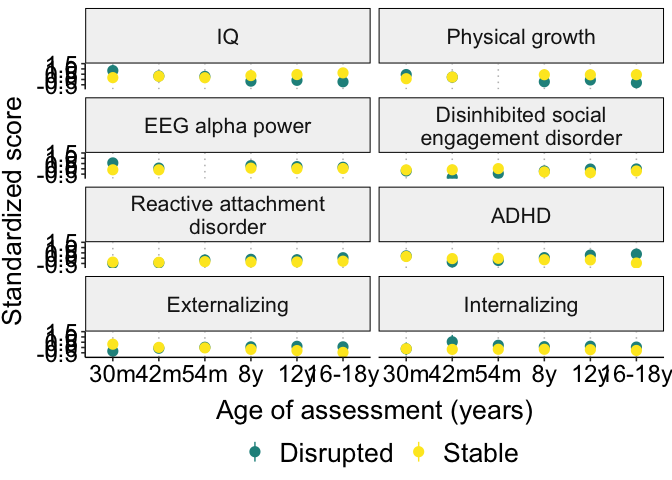<!-- -->

``` r
ggsave(
  paste0(home, "figures/supplemental_aim3_stability_domain_wave_means.png"),
  dpi = 600,
  width = 9, 
  height = 11
)
```
