Multi-Level Analysis of Foster Care as an Alternative to
Institutionalization on Psychobiological Outcomes Across Childhood
================
2022

-   [Set up environment](#set-up-environment)
-   [Read in data](#read-in-data)
-   [Descriptives](#descriptives)
    -   [Supplemental Tables](#supplemental-tables)
    -   [CONSORT diagram](#consort-diagram)
-   [Remove cases with missing data for “value” from
    dataset](#remove-cases-with-missing-data-for-value-from-dataset)
-   [Create subsetted data frames](#create-subsetted-data-frames)
    -   [Subset IQ, EEG, and physical growth
        data](#subset-iq-eeg-and-physical-growth-data)
    -   [Subset psychopathology data](#subset-psychopathology-data)
    -   [Subset FCG data](#subset-fcg-data)
-   [Distributions](#distributions)
    -   [Age](#age)
    -   [IQ](#iq)
    -   [EEG](#eeg)
    -   [Physical size](#physical-size)
    -   [ADHD](#adhd)
-   [Internalizing](#internalizing)
    -   [Externalizing](#externalizing)
    -   [DSED](#dsed)
    -   [RAD](#rad)
    -   [Age of placement in foster
        care](#age-of-placement-in-foster-care)
    -   [Stability of foster care
        placement](#stability-of-foster-care-placement)
-   [Descriptives: Raw measurement
    values](#descriptives-raw-measurement-values)
    -   [Means, SDs](#means-sds)
-   [Correlations](#correlations)
-   [Results](#results)
    -   [Aim 1](#aim-1)
    -   [Aim 2](#aim-2)
    -   [Aim 3](#aim-3)
-   [Visualizations of effects](#visualizations-of-effects)
    -   [Aim 1 main effects](#aim-1-main-effects)
    -   [Aim 2 moderating effects](#aim-2-moderating-effects)
    -   [Aim 3](#aim-3-1)

``` r
knitr::opts_chunk$set(echo = TRUE, warning = FALSE, message = FALSE)
```

# Set up environment

``` r
#Libraries
library(lme4)
library(lmerTest)
library(tidyverse)
library(sjstats)
library(labelled)
library(ggResidpanel)
library(effectsize)
library(ggsci)
library(gt)
library(ggpubr)
library(performance)
library(parameters)
library(cowplot)
library(dplyr)
library(readr)
library(corrr)
library(glue)

source("R_rainclouds.R")

#Files__________________________________________________________________________
home <- "/Users/lking@ideo.com/Library/CloudStorage/Box-Box/lucy_king_files/Tulane/BEIP/comprehensive_analysis/"

cleaned_data_file <- paste0(home, "data/BEIP_big_analysis_tidied_data_20220214.csv")

#Aesthetics_____________________________________________________________________
theme_beip <-
  theme_pubr() +
  theme(
    panel.grid = element_blank(),
    plot.title = element_text(size = 18, hjust = .5),
    axis.title = element_text(size = 20),
    axis.text = element_text(size = 18),
    legend.title = element_text(size = 20), 
    legend.text = element_text(size = 20),
    strip.text = element_text(size = 16),
    legend.position = "bottom"
  )

#Other__________________________________________________________________________
options(scipen = 999) # turn off scientific notation 
set.seed(123456)
cbbPalette <- c(
  "#000000", 
  "#E69F00", 
  "#56B4E9", 
  "#009E73", 
  "#F0E442", 
  "#0072B2", 
  "#D55E00", 
  "#CC79A7"
)
```

# Read in data

``` r
d  <-
  read_csv(cleaned_data_file) %>% 
  filter(group != "NIG") %>% 
  mutate(
    male = as.factor(male),
    informant = as.factor(informant),
    ethnic = factor(
      ethnic,
      levels = c(0, 1, 2, 3),
      labels = c("Romanian", "Rroma", "Unknown", "Other")
    ),
    wave_ordered = fct_relevel(
      wave,
      "30m", "42m", "54m", "8y", "12y", "16-18y"
    ),
    stable = as.factor(stable)
  ) %>% 
  group_by(ID) %>% 
  mutate(
    stability_group = as.factor(
      case_when(
        group == "FCG" & min(stable_num) == 0 ~ "FCG, Disrupted",
        group == "FCG" & min(stable_num) == 1 ~ "FCG, Stable",
        group == "CAUG" ~ "CAUG"
      )
    )
  ) %>% 
  ungroup()
```

# Descriptives

## Supplemental Tables

### Baseline characteristics

``` r
d_baseline_physical <-
  d %>%
  filter(wave == "BL", construct == "physical") %>% 
  distinct(ID, value, .keep_all = TRUE) %>% 
  pivot_wider(
    id_cols = c(ID, group),
    names_from = domain,
    values_from = value
  )

d_baseline_physical %>% 
  group_by(group) %>% 
  summarise(
    mean_height = mean(height, na.rm = TRUE),
    sd_height =  sd(height, na.rm = TRUE),
    mean_weight = mean(weight, na.rm = TRUE),
    sd_weight=  sd(weight, na.rm = TRUE)
  )
```

    ## # A tibble: 2 × 5
    ##   group mean_height sd_height mean_weight sd_weight
    ##   <chr>       <dbl>     <dbl>       <dbl>     <dbl>
    ## 1 CAUG         80.1      7.99        10.3      2.21
    ## 2 FCG          80.6      6.81        10.3      1.91

``` r
t.test(d_baseline_physical$height ~ d_baseline_physical$group)
```

    ## 
    ##  Welch Two Sample t-test
    ## 
    ## data:  d_baseline_physical$height by d_baseline_physical$group
    ## t = -0.38602, df = 112.35, p-value = 0.7002
    ## alternative hypothesis: true difference in means between group CAUG and group FCG is not equal to 0
    ## 95 percent confidence interval:
    ##  -3.219820  2.169764
    ## sample estimates:
    ## mean in group CAUG  mean in group FCG 
    ##           80.06207           80.58710

``` r
t.test(d_baseline_physical$weight ~ d_baseline_physical$group)
```

    ## 
    ##  Welch Two Sample t-test
    ## 
    ## data:  d_baseline_physical$weight by d_baseline_physical$group
    ## t = 0.16835, df = 112.95, p-value = 0.8666
    ## alternative hypothesis: true difference in means between group CAUG and group FCG is not equal to 0
    ## 95 percent confidence interval:
    ##  -0.6870395  0.8146458
    ## sample estimates:
    ## mean in group CAUG  mean in group FCG 
    ##           10.32945           10.26565

``` r
d_baseline <-
  d %>%  
  filter(wave == "BL") %>% 
  distinct(ID, group, .keep_all = TRUE) %>% 
  mutate(
    romanian = ethnic == "Romanian"
  )

d_baseline %>% 
  group_by(group) %>% 
  summarise(
    mean_BW = mean(birth_weight, na.rm = TRUE),
    sd_BQ = sd(birth_weight,  na.rm = TRUE),
    mean_gest_age = mean(gestation_weeks, na.rm = TRUE),
    sd_gest_age = sd(gestation_weeks, na.rm = TRUE),
    mean_pct_inst = mean(pctinst, na.rm = TRUE),
    sd_pct_inst = sd(pctinst, na.rm = TRUE),
    min_pct_inst = min(pctinst, na.rm = TRUE),
    max_pct_inst = max(pctinst, na.rm = TRUE),
    mean_inst_age = mean(inst_entry_age, na.rm = TRUE),
    sd_ints_age = sd(inst_entry_age, na.rm = TRUE),
    mean_bl_age = mean(age_months, na.rm = TRUE),
    sd_bl_age = sd(age_months, na.rm = TRUE)
  )
```

    ## # A tibble: 2 × 13
    ##   group mean_BW sd_BQ mean_gest_age sd_gest_age mean_pct_inst sd_pct_inst
    ##   <chr>   <dbl> <dbl>         <dbl>       <dbl>         <dbl>       <dbl>
    ## 1 CAUG    2830.  568.          37.6        1.50          86.0        21.6
    ## 2 FCG     2719.  629.          37.0        2.62          86.1        21.7
    ## # … with 6 more variables: min_pct_inst <dbl>, max_pct_inst <dbl>,
    ## #   mean_inst_age <dbl>, sd_ints_age <dbl>, mean_bl_age <dbl>, sd_bl_age <dbl>

``` r
t.test(d_baseline$age_months ~ d_baseline$group)
```

    ## 
    ##  Welch Two Sample t-test
    ## 
    ## data:  d_baseline$age_months by d_baseline$group
    ## t = 0.41446, df = 134, p-value = 0.6792
    ## alternative hypothesis: true difference in means between group CAUG and group FCG is not equal to 0
    ## 95 percent confidence interval:
    ##  -1.989960  3.045076
    ## sample estimates:
    ## mean in group CAUG  mean in group FCG 
    ##           21.01182           20.48426

``` r
t.test(d_baseline$birth_weight ~ d_baseline$group)
```

    ## 
    ##  Welch Two Sample t-test
    ## 
    ## data:  d_baseline$birth_weight by d_baseline$group
    ## t = 1.0317, df = 119.44, p-value = 0.3043
    ## alternative hypothesis: true difference in means between group CAUG and group FCG is not equal to 0
    ## 95 percent confidence interval:
    ##  -102.7583  326.3282
    ## sample estimates:
    ## mean in group CAUG  mean in group FCG 
    ##           2830.333           2718.548

``` r
t.test(d_baseline$gestation_weeks ~ d_baseline$group)
```

    ## 
    ##  Welch Two Sample t-test
    ## 
    ## data:  d_baseline$gestation_weeks by d_baseline$group
    ## t = 1.4888, df = 93.319, p-value = 0.1399
    ## alternative hypothesis: true difference in means between group CAUG and group FCG is not equal to 0
    ## 95 percent confidence interval:
    ##  -0.1963582  1.3731136
    ## sample estimates:
    ## mean in group CAUG  mean in group FCG 
    ##           37.57143           36.98305

``` r
t.test(d_baseline$pctinst ~ d_baseline$group)
```

    ## 
    ##  Welch Two Sample t-test
    ## 
    ## data:  d_baseline$pctinst by d_baseline$group
    ## t = -0.030545, df = 134, p-value = 0.9757
    ## alternative hypothesis: true difference in means between group CAUG and group FCG is not equal to 0
    ## 95 percent confidence interval:
    ##  -7.455721  7.228932
    ## sample estimates:
    ## mean in group CAUG  mean in group FCG 
    ##           85.96542           86.07882

``` r
d_baseline %>% 
  count(group, male) %>% 
  group_by(group) %>% 
  mutate(per = n / sum(n))
```

    ## # A tibble: 4 × 4
    ## # Groups:   group [2]
    ##   group male      n   per
    ##   <chr> <fct> <int> <dbl>
    ## 1 CAUG  0        35 0.515
    ## 2 CAUG  1        33 0.485
    ## 3 FCG   0        34 0.5  
    ## 4 FCG   1        34 0.5

``` r
d_baseline %>% 
  count(group, ethnic) %>% 
  group_by(group) %>% 
  mutate(per = n / sum(n))
```

    ## # A tibble: 8 × 4
    ## # Groups:   group [2]
    ##   group ethnic       n    per
    ##   <chr> <fct>    <int>  <dbl>
    ## 1 CAUG  Romanian    34 0.5   
    ## 2 CAUG  Rroma       21 0.309 
    ## 3 CAUG  Unknown     12 0.176 
    ## 4 CAUG  Other        1 0.0147
    ## 5 FCG   Romanian    42 0.618 
    ## 6 FCG   Rroma       18 0.265 
    ## 7 FCG   Unknown      7 0.103 
    ## 8 FCG   Other        1 0.0147

``` r
table_sex <- table(d_baseline$male, d_baseline$group)
prop.test(table_sex)
```

    ## 
    ##  2-sample test for equality of proportions with continuity correction
    ## 
    ## data:  table_sex
    ## X-squared = 0, df = 1, p-value = 1
    ## alternative hypothesis: two.sided
    ## 95 percent confidence interval:
    ##  -0.1680655  0.1974836
    ## sample estimates:
    ##    prop 1    prop 2 
    ## 0.5072464 0.4925373

``` r
table_ethnic <- table(d_baseline$romanian, d_baseline$group)
prop.test(table_ethnic)
```

    ## 
    ##  2-sample test for equality of proportions with continuity correction
    ## 
    ## data:  table_ethnic
    ## X-squared = 1.4614, df = 1, p-value = 0.2267
    ## alternative hypothesis: two.sided
    ## 95 percent confidence interval:
    ##  -0.06359584  0.30219234
    ## sample estimates:
    ##    prop 1    prop 2 
    ## 0.5666667 0.4473684

``` r
# baseline: length of stay in institutional care (in months)
d_baseline <-
  d_baseline %>% 
  mutate(
    length_inst = age_months - inst_entry_age
  ) 

d_baseline %>% 
  group_by(group) %>% 
  summarise(
    mean_length_inst = mean(length_inst),
    min_length_inst = min(length_inst),
    max_length_inst = max(length_inst)
  )
```

    ## # A tibble: 2 × 4
    ##   group mean_length_inst min_length_inst max_length_inst
    ##   <chr>            <dbl>           <dbl>           <dbl>
    ## 1 CAUG              18.6           0.592            31.8
    ## 2 FCG               17.8           2.24             30.4

### Remove baseline data

``` r
d <-
  d %>% 
  filter(wave != "BL") %>% 
  ungroup()
```

### Export included ID list

``` r
IDs <-
  d %>% 
  filter(!is.na(value)) %>% 
  distinct(ID, group)

#write_csv(IDs, paste0(home, "data/included_IDs_20220215.csv"))
```

## CONSORT diagram

``` r
ids_by_wave <-
  d_baseline %>% 
  select(ID, group) %>% 
  mutate(wBL = 1) %>% 
  left_join(
    d %>% 
      filter(!is.na(value), wave_ordered == "30m") %>% 
      distinct(ID) %>% 
      mutate(w30 = 1),
    by = "ID"
  ) %>% 
  left_join(
    d %>% 
      filter(!is.na(value), wave_ordered == "42m") %>% 
      distinct(ID) %>% 
      mutate(w42 = 1),
    by = "ID"
  ) %>% 
  left_join(
    d %>% 
      filter(!is.na(value), wave_ordered == "54m") %>% 
      distinct(ID) %>% 
      mutate(w54 = 1),
    by = "ID"
  ) %>% 
  left_join(
    d %>% 
      filter(!is.na(value), wave_ordered == "8y") %>% 
      distinct(ID) %>% 
      mutate(w8y = 1),
    by = "ID"
  ) %>% 
  left_join(
    d %>% 
      filter(!is.na(value), wave_ordered == "12y") %>% 
      distinct(ID) %>% 
      mutate(w12y = 1),
    by = "ID"
  ) %>% 
  left_join(
    d %>% 
      filter(!is.na(value), wave_ordered == "16-18y") %>% 
      distinct(ID) %>% 
      mutate(w16_18 = 1),
    by = "ID"
  )

write_csv(ids_by_wave, paste0(home, "data/ids_by_wave_20220217.csv"))
```

### Number of individuals who completed at least one follow-up assessment

``` r
IDs %>% 
  count(group)
```

    ## # A tibble: 2 × 2
    ##   group     n
    ##   <chr> <int>
    ## 1 CAUG     65
    ## 2 FCG      65

### Total number of observations

``` r
d %>% 
  filter(!is.na(value)) %>% 
  count() 
```

    ## # A tibble: 1 × 1
    ##       n
    ##   <int>
    ## 1  7088

### Total number of observations per group

``` r
d %>% 
  filter(!is.na(value)) %>% 
  count(group) 
```

    ## # A tibble: 2 × 2
    ##   group     n
    ##   <chr> <int>
    ## 1 CAUG   3460
    ## 2 FCG    3628

### Total number of observations per wave

``` r
d %>% 
  filter(!is.na(value)) %>% 
  count(wave_ordered) 
```

    ## # A tibble: 6 × 2
    ##   wave_ordered     n
    ##   <fct>        <int>
    ## 1 30m           1162
    ## 2 42m           1122
    ## 3 54m            668
    ## 4 8y            1059
    ## 5 12y           1621
    ## 6 16-18y        1456

### Number of individuals per group per wave

``` r
d %>% 
  filter(!is.na(value)) %>% 
  distinct(ID, group, wave_ordered) %>% 
  count(group, wave_ordered)
```

    ## # A tibble: 12 × 3
    ##    group wave_ordered     n
    ##    <chr> <fct>        <int>
    ##  1 CAUG  30m             65
    ##  2 CAUG  42m             62
    ##  3 CAUG  54m             53
    ##  4 CAUG  8y              56
    ##  5 CAUG  12y             58
    ##  6 CAUG  16-18y          56
    ##  7 FCG   30m             64
    ##  8 FCG   42m             64
    ##  9 FCG   54m             60
    ## 10 FCG   8y              60
    ## 11 FCG   12y             56
    ## 12 FCG   16-18y          53

### Number of observations per group per wave

``` r
d %>% 
  filter(!is.na(value)) %>% 
  count(group, wave_ordered) %>% 
  arrange(group, wave_ordered)
```

    ## # A tibble: 12 × 3
    ##    group wave_ordered     n
    ##    <chr> <fct>        <int>
    ##  1 CAUG  30m            573
    ##  2 CAUG  42m            547
    ##  3 CAUG  54m            312
    ##  4 CAUG  8y             503
    ##  5 CAUG  12y            805
    ##  6 CAUG  16-18y         720
    ##  7 FCG   30m            589
    ##  8 FCG   42m            575
    ##  9 FCG   54m            356
    ## 10 FCG   8y             556
    ## 11 FCG   12y            816
    ## 12 FCG   16-18y         736

### Number of individuals per group per construct per wave

``` r
d %>% 
  filter(!is.na(value)) %>% 
  distinct(ID, group, wave_ordered, construct) %>% 
  count(group, wave_ordered, construct) %>% 
  arrange(group, wave_ordered, construct)
```

    ## # A tibble: 44 × 4
    ##    group wave_ordered construct           n
    ##    <chr> <fct>        <chr>           <int>
    ##  1 CAUG  30m          EEG                53
    ##  2 CAUG  30m          IQ                 59
    ##  3 CAUG  30m          physical           57
    ##  4 CAUG  30m          psychopathology    59
    ##  5 CAUG  42m          EEG                48
    ##  6 CAUG  42m          IQ                 57
    ##  7 CAUG  42m          physical           55
    ##  8 CAUG  42m          psychopathology    57
    ##  9 CAUG  54m          IQ                 51
    ## 10 CAUG  54m          psychopathology    53
    ## # … with 34 more rows

### Number who completed across waves

``` r
d %>% 
  distinct(ID, wave) %>% 
  count(ID, wave) %>% 
  pivot_wider(
    names_from = wave,
    values_from = n,
    names_prefix = "w"
  ) %>% 
  count(!is.na(w30m), !is.na(w42m), !is.na(w54m), !is.na(w8y), !is.na(w12y), !is.na(`w16-18y`)) 
```

    ## # A tibble: 11 × 7
    ##    `!is.na(w30m)` `!is.na(w42m)` `!is.na(w54m)` `!is.na(w8y)` `!is.na(w12y)`
    ##    <lgl>          <lgl>          <lgl>          <lgl>         <lgl>         
    ##  1 TRUE           FALSE          FALSE          FALSE         FALSE         
    ##  2 TRUE           FALSE          TRUE           TRUE          TRUE          
    ##  3 TRUE           TRUE           FALSE          FALSE         FALSE         
    ##  4 TRUE           TRUE           FALSE          TRUE          TRUE          
    ##  5 TRUE           TRUE           TRUE           FALSE         FALSE         
    ##  6 TRUE           TRUE           TRUE           FALSE         TRUE          
    ##  7 TRUE           TRUE           TRUE           FALSE         TRUE          
    ##  8 TRUE           TRUE           TRUE           TRUE          FALSE         
    ##  9 TRUE           TRUE           TRUE           TRUE          FALSE         
    ## 10 TRUE           TRUE           TRUE           TRUE          TRUE          
    ## 11 TRUE           TRUE           TRUE           TRUE          TRUE          
    ## # … with 2 more variables: `!is.na(\`w16-18y\`)` <lgl>, n <int>

# Remove cases with missing data for “value” from dataset

``` r
d <-
  d %>% 
  filter(!is.na(value))
```

# Create subsetted data frames

## Subset IQ, EEG, and physical growth data

By standardizing within wave, within-person growth effects are no longer
detectable. In other words, we cannot say whether X tends to increase as
age increases. Instead, we can say that X is relatively higher or lower
when age is higher or lower. Because the same measure is being used for
multiple types of psychopathology (e.g., ITSEA measures internalizing
and externalizing), for psychopathology, must standardize within wave,
measure, and domain (i.e., so scores for each domain are relative)

``` r
d_cog_bio <-
  d %>% 
  filter(construct != "psychopathology") %>% 
  # standardized within wave (eliminates within-person growth effects) and measure (puts all data on same scale)
  group_by(wave, measure, domain) %>% 
  mutate(
    value_z = scale(value)
  ) %>% 
  ungroup() %>% 
  filter() %>% 
  mutate_at(
    vars(domain, informant, group, wave, construct),
    as.factor
  ) %>%
  mutate(
    domain = droplevels(domain),
    informant = droplevels(informant),
    wave = droplevels(wave),
    construct = droplevels(construct)
  )

d_cog_bio %>% 
  filter(domain == "eeg") %>% 
  group_by(wave, group, measure) %>% 
  summarise_at(vars(value), funs(mean, sd))
```

    ## # A tibble: 10 × 5
    ## # Groups:   wave, group [10]
    ##    wave   group measure   mean     sd
    ##    <fct>  <fct> <chr>    <dbl>  <dbl>
    ##  1 12y    CAUG  relalpha 0.170 0.0532
    ##  2 12y    FCG   relalpha 0.181 0.0514
    ##  3 16-18y CAUG  relalpha 0.183 0.0646
    ##  4 16-18y FCG   relalpha 0.192 0.0683
    ##  5 30m    CAUG  relalpha 0.218 0.0318
    ##  6 30m    FCG   relalpha 0.212 0.0308
    ##  7 42m    CAUG  relalpha 0.223 0.0329
    ##  8 42m    FCG   relalpha 0.217 0.0330
    ##  9 8y     CAUG  relalpha 0.177 0.0363
    ## 10 8y     FCG   relalpha 0.191 0.0386

## Subset psychopathology data

``` r
d_psy <-
  d %>% 
  filter(construct == "psychopathology") %>% 
  group_by(wave, measure, domain) %>%  
  mutate(
    value_z = scale(value)
  ) %>% 
  ungroup() %>% 
  dplyr::select(-construct) %>% 
  mutate_at(
    vars(domain, informant, group, wave),
    as.factor
  ) %>%
  mutate(
    domain = droplevels(domain),
    informant = droplevels(informant),
    wave = droplevels(wave)
  )
```

## Subset FCG data

``` r
d_fcg_cog_bio <-
  d_cog_bio %>% 
  filter(group == "FCG") 

d_fcg_psy <-
  d_psy %>% 
  filter(group == "FCG")
```

### Stability of FC placement

IDs 82 and 98 reintegrated in bio families prior to FC placement;
therefore, not included in stability analyses.

``` r
d %>% 
  filter(group == "FCG") %>% 
  distinct(ID, stability_group) %>% 
  count(stability_group)
```

    ## # A tibble: 3 × 2
    ##   stability_group     n
    ##   <fct>           <int>
    ## 1 FCG, Stable        26
    ## 2 FCG, Disrupted     37
    ## 3 <NA>                2

``` r
d %>% 
  filter(group == "FCG") %>% 
  distinct(ID, wave_ordered, stable) %>% 
  count(wave_ordered, stable)
```

    ## # A tibble: 18 × 3
    ##    wave_ordered stable        n
    ##    <fct>        <fct>     <int>
    ##  1 30m          disrupted     4
    ##  2 30m          stable       58
    ##  3 30m          <NA>          2
    ##  4 42m          disrupted     9
    ##  5 42m          stable       54
    ##  6 42m          <NA>          2
    ##  7 54m          disrupted    16
    ##  8 54m          stable       43
    ##  9 54m          <NA>          2
    ## 10 8y           disrupted    27
    ## 11 8y           stable       32
    ## 12 8y           <NA>          1
    ## 13 12y          disrupted    26
    ## 14 12y          stable       29
    ## 15 12y          <NA>          2
    ## 16 16-18y       disrupted    32
    ## 17 16-18y       stable       24
    ## 18 16-18y       <NA>          1

# Distributions

## Age

``` r
d %>% 
  distinct(ID, mean_age_years_wave, wave_ordered) %>% 
  ggplot(aes(mean_age_years_wave, fill = wave_ordered)) +
  geom_histogram(alpha = 1/2) +
  scale_x_continuous(breaks = seq.int(0, 18, 2)) +
  scale_y_continuous(breaks = seq.int(0, 150, 20)) +
  scale_fill_manual(values=cbbPalette) +
  theme_beip +
  theme(
    legend.position = "right"
  ) +
  labs(x = "Age (years)", fill = "Wave")
```

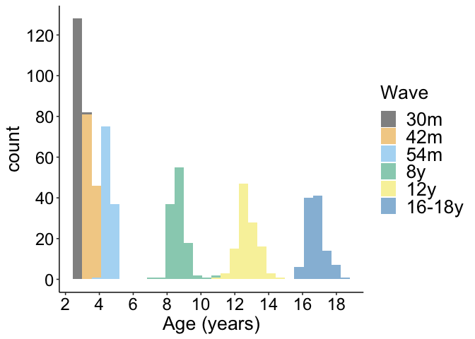<!-- -->

``` r
ggsave(
  paste0(home, "figures/age_years_wave_histogram.png"),
  width = 8, 
  height = 6
)
```

## IQ

``` r
d_cog_bio %>% 
  filter(construct == "IQ") %>% 
  ggplot(aes(value)) +
  geom_histogram(binwidth = 20) +
  #scale_y_continuous(breaks = seq.int(0, 25), 10) +
  theme_beip +
  scale_fill_manual(values = cbbPalette) +
  labs(
    fill = NULL,
    x = "Raw IQ score"
  ) +
  facet_grid(wave_ordered~group)
```

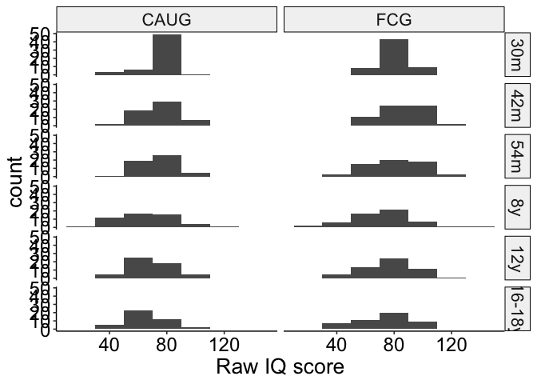<!-- -->

``` r
ggsave(
  paste0(home, "figures/IQ_histograms.png"),
  dpi = 600,
  width = 7,
  height = 10
)
```

## EEG

``` r
d_cog_bio %>% 
  filter(construct == "EEG", str_detect(measure, "relalpha") == TRUE) %>% 
  ggplot(aes(value)) +
  geom_histogram(binwidth = .05) +
  theme_beip +
  scale_fill_manual(values = cbbPalette) +
  labs(
    fill = NULL,
    x = "EEG relative alpha power"
  ) +
  facet_grid(wave_ordered~group)
```

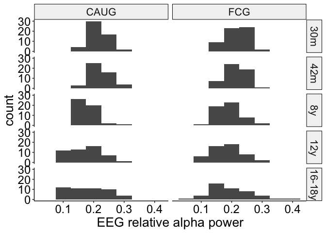<!-- -->

``` r
ggsave(
  paste0(home, "figures/EEG_rel_alpha_histograms.png"),
  dpi = 600,
  width = 7,
  height = 10
)
```

## Physical size

``` r
d_cog_bio %>% 
  filter(construct == "physical", domain == "height") %>% 
  ggplot(aes(value)) +
  geom_histogram(binwidth = 10) +
  theme_beip +
  scale_fill_manual(values = cbbPalette) +
  labs(
    fill = NULL,
    x = "Height"
  ) +
  facet_grid(wave_ordered~group, scales = "free")
```

<!-- -->

``` r
ggsave(
  paste0(home, "figures/height_histograms.png"),
  dpi = 600,
  width = 7,
  height = 10
)
```

``` r
d_cog_bio %>% 
  filter(construct == "physical", domain == "weight") %>% 
  ggplot(aes(value)) +
  geom_histogram(binwidth = 10) +
  scale_x_continuous(breaks = seq.int(0, 110, 20)) +
  theme_beip +
  scale_fill_manual(values = cbbPalette) +
  labs(
    fill = NULL,
    x = "Weight"
  ) +
  facet_grid(wave_ordered~group, scales = "free")
```

<!-- -->

``` r
ggsave(
  paste0(home, "figures/weight_histograms.png"),
  dpi = 600,
  width = 7,
  height = 10
)
```

``` r
d_cog_bio %>% 
  filter(construct == "physical", domain == "head") %>% 
  ggplot(aes(value)) +
  geom_histogram(binwidth = 2) +
  theme_beip +
  scale_fill_manual(values = cbbPalette) +
  labs(
    fill = NULL,
    x = "Head circumference"
  ) +
  facet_grid(wave_ordered~group, scales = "free")
```

<!-- -->

``` r
ggsave(
  paste0(home, "figures/headcir_histograms.png"),
  dpi = 600,
  width = 7,
  height = 10
)
```

## ADHD

``` r
d_psy %>% 
  filter(domain == "adhd", measure == "itsea") %>% 
  ggplot(aes(value)) +
  geom_histogram(binwidth = .5) +
  theme_beip +
  scale_fill_manual(values = cbbPalette) +
  labs(
    fill = NULL,
    x = "ADHD symptoms\n(assessed with ITSEA)"
  ) +
  facet_grid(wave_ordered~group)
```

<!-- -->

``` r
ggsave(
  paste0(home, "figures/adhd_histograms_itsea.png"),
  dpi = 600,
  width = 7,
  height = 4.3
)
```

``` r
d_psy %>% 
  filter(domain == "adhd", measure == "papa") %>% 
  ggplot(aes(value)) +
  geom_histogram(binwidth = 5) +
  theme_beip +
  scale_fill_manual(values = cbbPalette) +
  labs(
    fill = NULL,
    x = "ADHD symptoms\n(assessed with PAPA)"
  ) +
  facet_grid(wave_ordered~group)
```

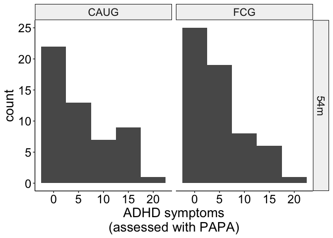<!-- -->

``` r
ggsave(
  paste0(home, "figures/adhd_histograms_papa.png"),
  dpi = 600,
  width = 7,
  height = 3
)
```

``` r
d_psy %>% 
  filter(domain == "adhd", measure == "hbq") %>% 
  ggplot(aes(value)) +
  geom_histogram(binwidth = .5) +
  theme_beip +
  scale_fill_manual(values = cbbPalette) +
  labs(
    fill = NULL,
    x = "ADHD symptoms\n(assessed with HBQ)"
  ) +
  facet_grid(wave_ordered~group)
```

<!-- -->

``` r
ggsave(
  paste0(home, "figures/adhd_histograms_hbq.png"),
  dpi = 600,
  width = 7,
  height = 6.3
)
```

``` r
d_psy %>% 
  filter(domain == "adhd", measure == "disc") %>% 
  ggplot(aes(value)) +
  geom_histogram(binwidth = 2) +
  theme_beip +
  scale_fill_manual(values = cbbPalette) +
  labs(
    fill = NULL,
    x = "ADHD symptoms\n(assessed with DISC)"
  ) +
  facet_grid(wave_ordered~group)
```

<!-- -->

``` r
ggsave(
  paste0(home, "figures/adhd_histograms_disc.png"),
  dpi = 600,
  width = 7,
  height = 4.3
)
```

# Internalizing

``` r
d_psy %>% 
  filter(domain == "intern", measure == "itsea") %>% 
  ggplot(aes(value)) +
  geom_histogram(binwidth = .5) +
  theme_beip +
  scale_fill_manual(values = cbbPalette) +
  labs(
    fill = NULL,
    x = "Internalizing symptoms\n(assessed with ITSEA)"
  ) +
  facet_grid(wave_ordered~group)
```

<!-- -->

``` r
ggsave(
  paste0(home, "figures/intern_histograms_itsea.png"),
  dpi = 600,
  width = 7,
  height = 4.3
)
```

``` r
d_psy %>% 
  filter(domain == "intern", measure == "papa") %>% 
  ggplot(aes(value)) +
  geom_histogram(binwidth = 5) +
  theme_beip +
  scale_fill_manual(values = cbbPalette) +
  labs(
    fill = NULL,
    x = "Internalizing symptoms\n(assessed with PAPA)"
  ) +
  facet_grid(wave_ordered~group)
```

<!-- -->

``` r
ggsave(
  paste0(home, "figures/intern_histograms_papa.png"),
  dpi = 600,
  width = 7,
  height = 3
)
```

``` r
d_psy %>% 
  filter(domain == "intern", measure == "hbq") %>% 
  ggplot(aes(value)) +
  geom_histogram(binwidth = .5) +
  theme_beip +
  scale_fill_manual(values = cbbPalette) +
  labs(
    fill = NULL,
    x = "Internalizing symptoms\n(assessed with HBQ)"
  ) +
  facet_grid(wave_ordered~group)
```

<!-- -->

``` r
ggsave(
  paste0(home, "figures/intern_histograms_hbq.png"),
  dpi = 600,
  width = 7,
  height = 6.3
)
```

``` r
d_psy %>% 
  filter(domain == "intern", measure == "disc") %>% 
  ggplot(aes(value)) +
  geom_histogram(binwidth = 2) +
  theme_beip +
  scale_fill_manual(values = cbbPalette) +
  labs(
    fill = NULL,
    x = "Internalizing symptoms\n(assessed with DISC)"
  ) +
  facet_grid(wave_ordered~group)
```

<!-- -->

``` r
ggsave(
  paste0(home, "figures/intern_histograms_disc.png"),
  dpi = 600,
  width = 7,
  height = 4.3
)
```

## Externalizing

``` r
d_psy %>% 
  filter(domain == "extern", measure == "itsea") %>% 
  ggplot(aes(value)) +
  geom_histogram(binwidth = .5) +
  theme_beip +
  scale_fill_manual(values = cbbPalette) +
  labs(
    fill = NULL,
    x = "Externalizing symptoms\n(assessed with ITSEA)"
  ) +
  facet_grid(wave_ordered~group)
```

<!-- -->

``` r
ggsave(
  paste0(home, "figures/extern_histograms_itsea.png"),
  dpi = 600,
  width = 7,
  height = 4.3
)
```

``` r
d_psy %>% 
  filter(domain == "extern", measure == "papa") %>% 
  ggplot(aes(value)) +
  geom_histogram(binwidth = 5) +
  theme_beip +
  scale_fill_manual(values = cbbPalette) +
  labs(
    fill = NULL,
    x = "Externalizing symptoms\n(assessed with PAPA)"
  ) +
  facet_grid(wave_ordered~group)
```

<!-- -->

``` r
ggsave(
  paste0(home, "figures/extern_histograms_papa.png"),
  dpi = 600,
  width = 7,
  height = 3
)
```

``` r
d_psy %>% 
  filter(domain == "extern", measure == "hbq") %>% 
  ggplot(aes(value)) +
  geom_histogram(binwidth = .5) +
  theme_beip +
  scale_fill_manual(values = cbbPalette) +
  labs(
    fill = NULL,
    x = "Externalizing symptoms\n(assessed with HBQ)"
  ) +
  facet_grid(wave_ordered~group)
```

<!-- -->

``` r
ggsave(
  paste0(home, "figures/extern_histograms_hbq.png"),
  dpi = 600,
  width = 7,
  height = 6.3
)
```

``` r
d_psy %>% 
  filter(domain == "extern", measure == "disc") %>% 
  ggplot(aes(value)) +
  geom_histogram(binwidth = 2) +
  theme_beip +
  scale_fill_manual(values = cbbPalette) +
  labs(
    fill = NULL,
    x = "Externalizing symptoms\n(assessed with DISC)"
  ) +
  facet_grid(wave_ordered~group)
```

<!-- -->

``` r
ggsave(
  paste0(home, "figures/extern_histograms_disc.png"),
  dpi = 600,
  width = 7,
  height = 4.3
)
```

## DSED

``` r
d_psy %>% 
  filter(domain == "dsed") %>% 
  ggplot(aes(value)) +
  geom_histogram(binwidth = 2) +
  theme_beip +
  scale_fill_manual(values = cbbPalette) +
  labs(
    fill = NULL,
    x = "DSED symptoms"
  ) +
  facet_grid(wave_ordered~group)
```

<!-- -->

``` r
ggsave(
  paste0(home, "figures/DSED_histograms.png"),
  dpi = 600,
  width = 7,
  height = 10
)
```

## RAD

``` r
d_psy %>% 
  filter(domain == "rad") %>% 
  ggplot(aes(value)) +
  geom_histogram(binwidth = 2) +
  theme_beip +
  scale_fill_manual(values = cbbPalette) +
  labs(
    fill = NULL,
    x = "RAD symptoms"
  ) +
  facet_grid(wave_ordered~group)
```

<!-- -->

``` r
ggsave(
  paste0(home, "figures/rad_histograms.png"),
  dpi = 600,
  width = 7,
  height = 10
)
```

## Age of placement in foster care

``` r
d %>% 
  filter(group == "FCG") %>% 
  distinct(ID, FC_placement_age) %>% 
  ggplot(aes(FC_placement_age)) +
  geom_histogram() +
  scale_y_continuous(breaks = seq.int(0, 10, 1)) +
  theme_beip +
  labs(
    fill = NULL,
    x = "Age of placement in foster care\n(months)"
  )
```

<!-- -->

``` r
ggsave(
  paste0(home, "figures/age_placement_histogram.png"),
  width = 9, 
  height = 7
)
```

## Stability of foster care placement

``` r
d %>% 
  mutate(
    stable = recode_factor(
      stable,
      "disrupted" = "Disrupted",
      "stable" = "Stable"
    )
  ) %>% 
  filter(group == "FCG", !is.na(stable)) %>% 
  distinct(ID, wave_ordered, stable) %>% 
  count(wave_ordered, stable) %>% 
  ggplot(aes(wave_ordered, n, fill = stable)) +
  geom_col(position = "dodge") +
  scale_fill_viridis_d(begin = .5) +
  scale_y_continuous(breaks = seq.int(0, 70, 5)) +
  theme_beip +
  theme(
    legend.position = "right"
  ) +
  labs(
    y = "Number of children",
    x = "Assesment wave",
    fill = "Foster care placement"
  )
```

<!-- -->

``` r
ggsave(
  paste0(home, "figures/wave_stability_counts.png"),
  width = 10, 
  height = 6
)
```

# Descriptives: Raw measurement values

## Means, SDs

``` r
d_baseline %>% 
  filter(group == "FCG") %>% 
  summarise_at(
    vars(FC_placement_age),
    funs(mean, sd, min, max), na.rm = TRUE
  )
```

    ## # A tibble: 1 × 4
    ##    mean    sd   min   max
    ##   <dbl> <dbl> <dbl> <dbl>
    ## 1  22.6  7.33  6.81  33.0

``` r
d_cog_bio_summary_iq_phys <- 
  d_cog_bio %>% 
  filter(domain != "eeg") %>% 
  group_by(group, domain) %>% 
  summarise(
    n = n(),
    mean = mean(value, na.rm = TRUE),
    sd = sd(value, na.rm = TRUE),
    se = sd / sqrt(n),
    min = min(value, na.rm = TRUE),
    max = max(value, na.rm = TRUE)
  ) 
d_cog_bio_summary_iq_phys
```

    ## # A tibble: 8 × 8
    ## # Groups:   group [2]
    ##   group domain     n  mean    sd    se   min   max
    ##   <fct> <fct>  <int> <dbl> <dbl> <dbl> <dbl> <dbl>
    ## 1 CAUG  head     268  50.7  2.90 0.177 44.9   59.2
    ## 2 CAUG  height   268 125.  31.1  1.90  81.4  184. 
    ## 3 CAUG  iq       313  72.0 15.2  0.860 12    118  
    ## 4 CAUG  weight   268  30.0 18.7  1.14   9.08 108. 
    ## 5 FCG   head     278  51.0  3.01 0.181 44.2   59.5
    ## 6 FCG   height   276 127.  31.2  1.88  81.5  189  
    ## 7 FCG   iq       337  78.9 18.3  0.998 11    143  
    ## 8 FCG   weight   276  32.6 20.7  1.24   8.72 102

``` r
d_cog_bio_summary_eeg <- 
  d_cog_bio %>% 
  filter(domain == "eeg") %>% 
  group_by(group, measure) %>% 
  summarise(
    n = n(),
    mean = mean(value, na.rm = TRUE),
    sd = sd(value, na.rm = TRUE),
    se = sd / sqrt(n),
    min = min(value, na.rm = TRUE),
    max = max(value, na.rm = TRUE)
  ) 
d_cog_bio_summary_eeg
```

    ## # A tibble: 2 × 8
    ## # Groups:   group [2]
    ##   group measure      n  mean     sd      se    min   max
    ##   <fct> <chr>    <int> <dbl>  <dbl>   <dbl>  <dbl> <dbl>
    ## 1 CAUG  relalpha   247 0.194 0.0501 0.00319 0.0795 0.317
    ## 2 FCG   relalpha   258 0.199 0.0473 0.00294 0.0749 0.408

``` r
d_psy_summary_overall <- 
  d_psy %>% 
  group_by(group, domain, measure) %>% 
  summarise(
    n = n(),
    mean = mean(value, na.rm = TRUE),
    sd = sd(value, na.rm = TRUE),
    se = sd / sqrt(n),
    min = min(value, na.rm = TRUE),
    max = max(value, na.rm = TRUE)
  )
d_psy_summary_overall
```

    ## # A tibble: 28 × 9
    ## # Groups:   group, domain [10]
    ##    group domain measure     n  mean    sd     se   min   max
    ##    <fct> <fct>  <chr>   <int> <dbl> <dbl>  <dbl> <dbl> <dbl>
    ##  1 CAUG  adhd   disc      106 4.27  4.61  0.448      0 17   
    ##  2 CAUG  adhd   hbq       214 0.752 0.453 0.0310     0  1.92
    ##  3 CAUG  adhd   itsea     113 0.918 0.563 0.0530     0  2   
    ##  4 CAUG  adhd   papa       52 5.79  5.49  0.761      0 18   
    ##  5 CAUG  dsed   dai       327 1.83  2.12  0.117      0 10   
    ##  6 CAUG  extern disc      106 3.74  3.92  0.381      0 17   
    ##  7 CAUG  extern hbq       211 0.486 0.429 0.0295     0  1.91
    ##  8 CAUG  extern itsea     113 0.559 0.430 0.0405     0  1.92
    ##  9 CAUG  extern papa       52 2.44  2.48  0.345      0 10   
    ## 10 CAUG  intern disc      106 1.17  2.34  0.227      0 18   
    ## # … with 18 more rows

``` r
d_cog_bio_summary <- 
  d_cog_bio %>% 
  group_by(group, wave_ordered, domain) %>% 
  summarise(
    n = n(),
    mean = mean(value, na.rm = TRUE),
    sd = sd(value, na.rm = TRUE),
    se = sd / sqrt(n),
    min = min(value, na.rm = TRUE),
    max = max(value, na.rm = TRUE)
  ) 

d_psy_summary <- 
  d_psy %>% 
  group_by(group, wave_ordered, domain) %>% 
  summarise(
    n = n(),
    mean = mean(value, na.rm = TRUE),
    sd = sd(value, na.rm = TRUE),
    se = sd / sqrt(n),
    min = min(value, na.rm = TRUE),
    max = max(value, na.rm = TRUE)
  )
```

``` r
d_cog_bio %>% 
  filter(domain == "eeg") %>% 
  group_by(wave_ordered, group) %>% 
  summarise_at(
    vars(value, value_z),
    funs(mean, sd)
  )
```

    ## # A tibble: 10 × 6
    ## # Groups:   wave_ordered [5]
    ##    wave_ordered group value_mean value_z_mean value_sd value_z_sd
    ##    <fct>        <fct>      <dbl>        <dbl>    <dbl>      <dbl>
    ##  1 30m          CAUG       0.218       0.0972   0.0318      1.02 
    ##  2 30m          FCG        0.212      -0.0888   0.0308      0.985
    ##  3 42m          CAUG       0.223       0.0928   0.0329      1.00 
    ##  4 42m          FCG        0.217      -0.0874   0.0330      1.00 
    ##  5 8y           CAUG       0.177      -0.189    0.0363      0.956
    ##  6 8y           FCG        0.191       0.175    0.0386      1.02 
    ##  7 12y          CAUG       0.170      -0.104    0.0532      1.02 
    ##  8 12y          FCG        0.181       0.102    0.0514      0.983
    ##  9 16-18y       CAUG       0.183      -0.0689   0.0646      0.975
    ## 10 16-18y       FCG        0.192       0.0719   0.0683      1.03

# Correlations

``` r
out_corr <- 
  d_cog_bio %>% 
  filter(domain != "eeg") %>% 
  dplyr::select(ID, domain, value_z) %>% 
  bind_rows(
    d_cog_bio %>% 
      filter(domain == "eeg") %>% 
      mutate(domain = measure) %>% 
      dplyr::select(ID, domain, value_z)
  ) %>% 
  bind_rows(
    d_psy %>% 
      dplyr::select(ID, domain, value_z)
  ) %>% 
  group_by(ID, domain) %>% 
  summarise(value_z = mean(value_z, na.rm = TRUE)) %>% 
  dplyr::select(
    domain,
    value_z
  ) %>% 
  spread(domain, value_z) %>% 
  ungroup() %>% 
  dplyr::select(-ID) %>% 
  corrr::correlate() %>% 
  fashion() 

out_corr
```

    ##        term adhd dsed extern head height intern   iq  rad relalpha weight
    ## 1      adhd       .49    .76  .01   -.00    .39 -.26  .37     -.02   -.01
    ## 2      dsed  .49         .34 -.09   -.04    .13 -.50  .68     -.06   -.06
    ## 3    extern  .76  .34        -.01   -.09    .38 -.16  .26     -.11   -.10
    ## 4      head  .01 -.09   -.01         .42   -.11  .29 -.09     -.01    .50
    ## 5    height -.00 -.04   -.09  .42          -.12  .32 -.17     -.02    .73
    ## 6    intern  .39  .13    .38 -.11   -.12        -.25  .26      .28   -.16
    ## 7        iq -.26 -.50   -.16  .29    .32   -.25      -.53     -.02    .28
    ## 8       rad  .37  .68    .26 -.09   -.17    .26 -.53           .03   -.15
    ## 9  relalpha -.02 -.06   -.11 -.01   -.02    .28 -.02  .03            -.06
    ## 10   weight -.01 -.06   -.10  .50    .73   -.16  .28 -.15     -.06

``` r
out_corr_plot <- 
  out_corr %>% 
  gather(variable, value, -term) %>% 
  mutate(
    term = as.character(term),
    value_chr = as.character(value),
    value_num = as.numeric(value_chr)
  ) %>% 
  na.omit() %>% 
  mutate(
    term = factor(
      term,
      levels = c(
        "iq", 
        "head", 
        "height", 
        "weight",
        "relalpha",
        "dsed",
        "rad",
        "adhd",
        "extern",
        "intern"
      ),
      labels = c(
        "IQ",
        "Head circumference",
        "Height",
        "Weight",
        "EEG alpha power",
        "DSED",
        "RAD",
        "ADHD",
        "Externalizing",
        "Internalizing"
      )
    ),
    variable = factor(
      variable,
      levels = c(
        "iq", 
        "head", 
        "height", 
        "weight",
        "relalpha",
        "dsed",
        "rad",
        "adhd",
        "extern",
        "intern"
      ),
      labels = c(
        "IQ",
        "Head circumference",
        "Height",
        "Weight",
        "EEG alpha power",
        "DSED",
        "RAD",
        "ADHD",
        "Externalizing",
        "Internalizing"
      )
    )
  )
```

``` r
out_corr_plot %>% 
  ggplot(aes(x = variable, y = fct_rev(term))) +
  geom_tile(aes(fill = abs(value_num))) +
  geom_text(
    aes(label = value_chr), 
    size = 4
  ) +
  scale_fill_gradient2(
    low = "blue",
    high = "red",
    mid = "white",
    na.value = "white",
    midpoint = 0,
    limit = c(-1, 1),
    space = "Lab",
    name = "Pearson correlation\ncoefficient"
  ) +
  theme_void() +
  theme(
    axis.text.x = element_text(
      angle = 45,
      hjust = 1,
      vjust = 1,
      size = 12
    ),
    axis.text.y = element_text(
      size = 12,
      hjust = .9
    )
  ) 
```

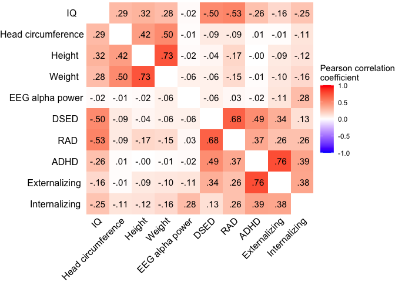<!-- -->

``` r
ggsave(
  paste0(home, "figures/correlations.png"),
  dpi = 600,
  width = 8, 
  height = 6
)
```

# Results

## Aim 1

### EEG, IQ, physical size

#### Main effect of group (with main effect covariates)

``` r
# CAUG is baseline
contrasts(d_cog_bio$group) = c(0, 1)

contrasts(d_cog_bio$male) = c(-.5, .5) 

contrasts(d_cog_bio$construct) <- cbind(
  "IQvEEG" = c(-1/3, 1 - (1/3), -1/3),
  "PHYSvEEG" = c(-1/3, -1/3, 1 - (1/3))
)
```

``` r
a1_cogbio <- lmer(
  value_z ~ 
    group +
    male +
    scale(age_years, scale = TRUE) +
    construct +
    (1|ID), 
  data = d_cog_bio
)

set.seed(123456)
a1_cogbio_parameters <-
  model_parameters(
  a1_cogbio,
  bootstrap = TRUE,
  ci_method = "quantile",
  iterations = 1000
)

a1_cogbio_parameters
```

    ## # Fixed Effects
    ## 
    ## Parameter         | Coefficient |         95% CI |     p
    ## --------------------------------------------------------
    ## (Intercept)       |       -0.14 | [-0.28,  0.00] | 0.044
    ## group1            |        0.27 | [ 0.08,  0.46] | 0.004
    ## male [1]          |        0.14 | [-0.06,  0.34] | 0.158
    ## age years         |   -6.81e-03 | [-0.04,  0.03] | 0.664
    ## constructIQvEEG   |       -0.02 | [-0.11,  0.08] | 0.644
    ## constructPHYSvEEG |   -5.55e-03 | [-0.09,  0.08] | 0.892

``` r
forest_df <-
  tibble(
    Parameter = "Overall cognitive, physical, and neural",
    Coefficient = a1_cogbio_parameters$Coefficient[[2]],
    CI_low = a1_cogbio_parameters$CI_low[[2]],
    CI_high = a1_cogbio_parameters$CI_high[[2]],
    p = a1_cogbio_parameters$p[[2]],
  )
```

### Psychopathology

#### Main effect of group (with main effect covariates)

``` r
# contrast code to center all variables except group; allows interpretation of coefficient as averages across levels of other factors
contrasts(d_psy$group) = c(0, 1) # CAUG is baseline

contrasts(d_psy$male) = c(-.5, .5) 

contrasts(d_psy$domain) = cbind(
  DSEDvADHD = c(-1/5, 1 - (1/5), -1/5, -1/5, -1/5),
  EXTvADHD = c(-1/5, -1/5, 1 - (1/5), -1/5, -1/5),
  INTvADHD = c(-1/5, -1/5, -1/5, 1 - (1/5), -1/5),
  RADvADHD = c(-1/5, -1/5, -1/5, -1/5, 1 - (1/5))
)

contrasts(d_psy$informant) = c(-.5, .5)
```

``` r
a1_psy <- lmer(
  value_z ~ 
    group +
    male +
    scale(age_years, scale = TRUE) +
    domain +
    informant +
    (1|ID), 
  data = d_psy
)

set.seed(123456)
a1_psy_parameters <-
  model_parameters(
    a1_psy,
    bootstrap = TRUE,
    ci_method = "quantile",
    iterations = 1000
  )

a1_psy_parameters
```

    ## # Fixed Effects
    ## 
    ## Parameter       | Coefficient |         95% CI |     p
    ## ------------------------------------------------------
    ## (Intercept)     |        0.15 | [ 0.02,  0.26] | 0.022
    ## group1          |       -0.24 | [-0.40, -0.08] | 0.006
    ## male [1]        |        0.23 | [ 0.09,  0.40] | 0.002
    ## age years       |       -0.02 | [-0.05,  0.01] | 0.162
    ## domainDSEDvADHD |    4.55e-04 | [-0.09,  0.09] | 0.978
    ## domainEXTvADHD  |    1.29e-03 | [-0.08,  0.08] | 0.970
    ## domainINTvADHD  |    7.53e-03 | [-0.07,  0.09] | 0.850
    ## domainRADvADHD  |    8.31e-03 | [-0.08,  0.10] | 0.836
    ## informant1      |        0.03 | [-0.05,  0.10] | 0.534

``` r
forest_df <-
  forest_df %>% 
  rbind( 
    c(
      "Overall psychopathology",
      a1_psy_parameters$Coefficient[[2]],
      a1_psy_parameters$CI_low[[2]],
      a1_psy_parameters$CI_hi[[2]],
      a1_psy_parameters$p[[2]]
    )
  )
```

## Aim 2

### EEG, IQ, physical size

#### Two-way moderations

``` r
a2_cogbio <- lmer(
  value_z ~ 
    group * construct +
    group * male +
    group * scale(age_years, scale = FALSE) +
    (1 |ID), 
  data = d_cog_bio
)

anova(a2_cogbio)
```

    ## Type III Analysis of Variance Table with Satterthwaite's method
    ##                                       Sum Sq Mean Sq NumDF   DenDF F value
    ## group                                 4.2951  4.2951     1  127.42  6.0803
    ## construct                             0.2150  0.1075     2 2659.01  0.1522
    ## male                                  1.3252  1.3252     1  120.35  1.8761
    ## scale(age_years, scale = FALSE)       0.1362  0.1362     1 2710.58  0.1927
    ## group:construct                       7.8419  3.9209     2 2659.01  5.5507
    ## group:male                            0.0074  0.0074     1  120.35  0.0105
    ## group:scale(age_years, scale = FALSE) 0.3141  0.3141     1 2710.58  0.4446
    ##                                        Pr(>F)   
    ## group                                 0.01500 * 
    ## construct                             0.85884   
    ## male                                  0.17333   
    ## scale(age_years, scale = FALSE)       0.66068   
    ## group:construct                       0.00393 **
    ## group:male                            0.91853   
    ## group:scale(age_years, scale = FALSE) 0.50495   
    ## ---
    ## Signif. codes:  0 '***' 0.001 '**' 0.01 '*' 0.05 '.' 0.1 ' ' 1

##### Simple effects of outcome domain (IQ vs. EEG vs. physical size )

###### EEG

``` r
# EEG = baseline
contrasts(d_cog_bio$construct) <- cbind(
  "IQvEEG" = c(0, 1, 0),
  "PHYSvEEG" = c(0, 0, 1)
)

# CAUG = baseline
a2_cogbio_EEG <- lmer(
  value_z ~ 
    group * construct +
    male +
    scale(age_years, scale = TRUE) +
    (1 |ID), 
  data = d_cog_bio
)

set.seed(123456)
a2_cogbio_EEG_parameters <-
  model_parameters(
    a2_cogbio_EEG,
    bootstrap = TRUE,
    ci_method = "quantile",
    iterations = 1000
  )
a2_cogbio_EEG_parameters
```

    ## # Fixed Effects
    ## 
    ## Parameter                  | Coefficient |         95% CI |      p
    ## ------------------------------------------------------------------
    ## (Intercept)                |       -0.02 | [-0.20,  0.13] | 0.798 
    ## group1                     |        0.06 | [-0.16,  0.30] | 0.540 
    ## constructIQvEEG            |       -0.19 | [-0.33, -0.05] | 0.008 
    ## constructPHYSvEEG          |       -0.11 | [-0.23,  0.00] | 0.062 
    ## male [1]                   |        0.14 | [-0.06,  0.34] | 0.156 
    ## age years                  |   -7.04e-03 | [-0.04,  0.03] | 0.650 
    ## group1 * constructIQvEEG   |        0.33 | [ 0.14,  0.53] | < .001
    ## group1 * constructPHYSvEEG |        0.22 | [ 0.04,  0.37] | 0.012

``` r
forest_df <-
  forest_df %>% 
  rbind( 
    c(
      "EEG alpha power",
      a2_cogbio_EEG_parameters$Coefficient[[2]],
      a2_cogbio_EEG_parameters$CI_low[[2]],
      a2_cogbio_EEG_parameters$CI_hi[[2]],
      a2_cogbio_EEG_parameters$p[[2]]
    )
  )
```

###### IQ

``` r
# IQ = baseline
contrasts(d_cog_bio$construct) <- cbind(
  "EEGvIQ" = c(1, 0, 0),
  "PHYSvIQ" = c(0, 0, 1)
)

a2_cogbio_IQ <- lmer(
  value_z ~ 
    group * construct +
    male +
    scale(age_years, scale = TRUE) +
    (1 |ID), 
  data = d_cog_bio
)

set.seed(123456)
a2_cogbio_IQ_parameters <-
  model_parameters(
    a2_cogbio_IQ,
    bootstrap = TRUE,
    ci_method = "quantile",
    iterations = 1000
  )

a2_cogbio_IQ_parameters
```

    ## # Fixed Effects
    ## 
    ## Parameter                 | Coefficient |         95% CI |      p
    ## -----------------------------------------------------------------
    ## (Intercept)               |       -0.21 | [-0.37, -0.06] | 0.008 
    ## group1                    |        0.40 | [ 0.18,  0.63] | < .001
    ## constructEEGvIQ           |        0.19 | [ 0.05,  0.33] | 0.008 
    ## constructPHYSvIQ          |        0.08 | [-0.04,  0.18] | 0.148 
    ## male [1]                  |        0.14 | [-0.06,  0.34] | 0.156 
    ## age years                 |   -7.04e-03 | [-0.04,  0.03] | 0.650 
    ## group1 * constructEEGvIQ  |       -0.33 | [-0.53, -0.14] | < .001
    ## group1 * constructPHYSvIQ |       -0.12 | [-0.26,  0.04] | 0.126

``` r
forest_df <-
  forest_df %>% 
  rbind( 
    c(
      "IQ",
      a2_cogbio_IQ_parameters$Coefficient[[2]],
      a2_cogbio_IQ_parameters$CI_low[[2]],
      a2_cogbio_IQ_parameters$CI_hi[[2]],
      a2_cogbio_IQ_parameters$p[[2]]
    )
  )
```

###### Physical size

``` r
# PHYS = baseline
contrasts(d_cog_bio$construct) <- cbind(
  "EEGvPHYS" = c(1, 0, 0),
  "IQvPHYS" = c(0, 1, 0)
)

a2_cogbio_PHY <- lmer(
  value_z ~ 
    group * construct +
    male +
    scale(age_years, scale = TRUE) +
    (1 |ID),  
  data = d_cog_bio
)

set.seed(123456)
a2_cogbio_PHY_parameters <- 
  model_parameters(
    a2_cogbio_PHY,
    bootstrap = TRUE,
    ci_method = "quantile",
    iterations = 1000
  )

a2_cogbio_PHY_parameters
```

    ## # Fixed Effects
    ## 
    ## Parameter                  | Coefficient |         95% CI |     p
    ## -----------------------------------------------------------------
    ## (Intercept)                |       -0.14 | [-0.29,  0.00] | 0.044
    ## group1                     |        0.28 | [ 0.08,  0.48] | 0.004
    ## constructEEGvPHYS          |        0.11 | [ 0.00,  0.23] | 0.062
    ## constructIQvPHYS           |       -0.08 | [-0.18,  0.04] | 0.148
    ## male [1]                   |        0.14 | [-0.06,  0.34] | 0.156
    ## age years                  |   -7.04e-03 | [-0.04,  0.03] | 0.650
    ## group1 * constructEEGvPHYS |       -0.22 | [-0.37, -0.04] | 0.012
    ## group1 * constructIQvPHYS  |        0.12 | [-0.04,  0.26] | 0.126

``` r
forest_df <-
  forest_df %>% 
  rbind( 
    c(
      "Physical growth",
      a2_cogbio_PHY_parameters$Coefficient[[2]],
      a2_cogbio_PHY_parameters$CI_low[[2]],
      a2_cogbio_PHY_parameters$CI_hi[[2]],
      a2_cogbio_PHY_parameters$p[[2]]
    )
  )
```

#### Three-way moderations

``` r
a2_cogbio_domainXage <- lmer(
  value_z ~ 
    group * construct * scale(age_years, scale = FALSE) +
    male +
    (1 |ID), 
  data = d_cog_bio
)

anova(a2_cogbio_domainXage)
```

    ## Type III Analysis of Variance Table with Satterthwaite's method
    ##                                                 Sum Sq Mean Sq NumDF   DenDF
    ## group                                           4.2876  4.2876     1  128.81
    ## construct                                       0.2359  0.1179     2 2655.71
    ## scale(age_years, scale = FALSE)                 0.2130  0.2130     1 2695.66
    ## male                                            1.3645  1.3645     1  121.44
    ## group:construct                                 8.0310  4.0155     2 2655.73
    ## group:scale(age_years, scale = FALSE)           0.0000  0.0000     1 2695.61
    ## construct:scale(age_years, scale = FALSE)       0.1204  0.0602     2 2656.29
    ## group:construct:scale(age_years, scale = FALSE) 2.3747  1.1873     2 2656.29
    ##                                                 F value   Pr(>F)   
    ## group                                            6.0674 0.015090 * 
    ## construct                                        0.1669 0.846303   
    ## scale(age_years, scale = FALSE)                  0.3014 0.583075   
    ## male                                             1.9309 0.167207   
    ## group:construct                                  5.6824 0.003447 **
    ## group:scale(age_years, scale = FALSE)            0.0000 0.996352   
    ## construct:scale(age_years, scale = FALSE)        0.0852 0.918323   
    ## group:construct:scale(age_years, scale = FALSE)  1.6802 0.186532   
    ## ---
    ## Signif. codes:  0 '***' 0.001 '**' 0.01 '*' 0.05 '.' 0.1 ' ' 1

``` r
a2_cogbio_domainXsex <- lmer(
  value_z ~ 
    group * construct * male +
    scale(age_years, scale = TRUE) +
    (1 |ID), 
  data = d_cog_bio
)

anova(a2_cogbio_domainXsex)
```

    ## Type III Analysis of Variance Table with Satterthwaite's method
    ##                                Sum Sq Mean Sq NumDF   DenDF F value
    ## group                           4.189  4.1886     1  127.73  6.1200
    ## construct                       0.283  0.1417     2 2656.43  0.2070
    ## male                            0.002  0.0018     1  127.74  0.0027
    ## scale(age_years, scale = TRUE)  0.147  0.1467     1 2706.31  0.2143
    ## group:construct                 9.043  4.5215     2 2656.54  6.6063
    ## group:male                      0.000  0.0003     1  127.74  0.0004
    ## construct:male                 44.060 22.0298     2 2656.56 32.1875
    ## group:construct:male           16.574  8.2868     2 2656.58 12.1078
    ##                                             Pr(>F)    
    ## group                                     0.014679 *  
    ## construct                                 0.813041    
    ## male                                      0.958630    
    ## scale(age_years, scale = TRUE)            0.643450    
    ## group:construct                           0.001374 ** 
    ## group:male                                0.983855    
    ## construct:male                 0.00000000000001541 ***
    ## group:construct:male           0.00000582762662385 ***
    ## ---
    ## Signif. codes:  0 '***' 0.001 '**' 0.01 '*' 0.05 '.' 0.1 ' ' 1

##### Simple effects of sex and outcome domain

###### Male, EEG

``` r
# EEG = baseline
contrasts(d_cog_bio$construct) <- cbind(
  "IQvEEG" = c(0, 1, 0),
  "PHYSvEEG" = c(0, 0, 1)
)

# Male = baseline
contrasts(d_cog_bio$male) = c(1, 0)

a2_cogbio_EEG_male <- lmer(
  value_z ~ 
    group * construct * male +
    scale(age_years, scale = TRUE) +
    (1 |ID), 
  data = d_cog_bio
)

set.seed(123456)
a2_cogbio_EEG_male_parameters <-
  model_parameters(
    a2_cogbio_EEG_male,
    bootstrap = TRUE,
    ci_method = "quantile",
    iterations = 1000
  )

a2_cogbio_EEG_male_parameters
```

    ## # Fixed Effects
    ## 
    ## Parameter                               | Coefficient |         95% CI |      p
    ## -------------------------------------------------------------------------------
    ## (Intercept)                             |       -0.24 | [-0.47,  0.00] | 0.050 
    ## group1                                  |        0.28 | [-0.05,  0.60] | 0.098 
    ## constructIQvEEG                         |        0.11 | [-0.09,  0.30] | 0.276 
    ## constructPHYSvEEG                       |        0.27 | [ 0.10,  0.42] | < .001
    ## male [1]                                |        0.47 | [ 0.12,  0.80] | 0.004 
    ## age years                               |   -7.05e-03 | [-0.04,  0.03] | 0.640 
    ## group1 * constructIQvEEG                |       -0.12 | [-0.40,  0.12] | 0.340 
    ## group1 * constructPHYSvEEG              |    7.78e-03 | [-0.20,  0.24] | 0.954 
    ## group1 * male [1]                       |       -0.46 | [-0.91,  0.00] | 0.050 
    ## constructIQvEEG * male [1]              |       -0.63 | [-0.89, -0.36] | < .001
    ## constructPHYSvEEG * male [1]            |       -0.81 | [-1.04, -0.57] | < .001
    ## (group1 * constructIQvEEG) * male [1]   |        0.95 | [ 0.59,  1.32] | < .001
    ## (group1 * constructPHYSvEEG) * male [1] |        0.43 | [ 0.12,  0.74] | 0.004

###### Female, EEG

``` r
# EEG = baseline
contrasts(d_cog_bio$construct) <- cbind(
  "IQvEEG" = c(0, 1, 0),
  "PHYSvEEG" = c(0, 0, 1)
)

# Female = baseline
contrasts(d_cog_bio$male) = c(0, 1)

a2_cogbio_EEG_female <- lmer(
  value_z ~ 
    group * construct * male +
    scale(age_years, scale = TRUE) +
    (1 |ID), 
  data = d_cog_bio
)

set.seed(123456)
a2_cogbio_EEG_female_parameters <-
  model_parameters(
    a2_cogbio_EEG_female,
    bootstrap = TRUE,
    ci_method = "quantile",
    iterations = 1000
  )

a2_cogbio_EEG_female_parameters
```

    ## # Fixed Effects
    ## 
    ## Parameter                               | Coefficient |         95% CI |      p
    ## -------------------------------------------------------------------------------
    ## (Intercept)                             |        0.22 | [-0.01,  0.47] | 0.058 
    ## group1                                  |       -0.18 | [-0.50,  0.15] | 0.310 
    ## constructIQvEEG                         |       -0.52 | [-0.71, -0.34] | < .001
    ## constructPHYSvEEG                       |       -0.54 | [-0.70, -0.38] | < .001
    ## male [1]                                |       -0.47 | [-0.80, -0.12] | 0.004 
    ## age years                               |   -7.05e-03 | [-0.04,  0.03] | 0.640 
    ## group1 * constructIQvEEG                |        0.83 | [ 0.57,  1.08] | < .001
    ## group1 * constructPHYSvEEG              |        0.45 | [ 0.23,  0.69] | < .001
    ## group1 * male [1]                       |        0.46 | [ 0.00,  0.91] | 0.050 
    ## constructIQvEEG * male [1]              |        0.63 | [ 0.36,  0.89] | < .001
    ## constructPHYSvEEG * male [1]            |        0.81 | [ 0.57,  1.04] | < .001
    ## (group1 * constructIQvEEG) * male [1]   |       -0.95 | [-1.32, -0.59] | < .001
    ## (group1 * constructPHYSvEEG) * male [1] |       -0.43 | [-0.74, -0.12] | 0.004

###### Male, IQ

``` r
# IQ = baseline
contrasts(d_cog_bio$construct) <- cbind(
  "EEGvIQ" = c(1, 0, 0),
  "PHYSvIQ" = c(0, 0, 1)
)

# Male = baseline
contrasts(d_cog_bio$male) = c(1, 0)

a2_cogbio_IQ_male <- lmer(
  value_z ~ 
    group * construct * male +
    scale(age_years, scale = TRUE) +
    (1 |ID), 
  data = d_cog_bio
)

set.seed(123456)
a2_cogbio_IQ_male_parameters <-
  model_parameters(
    a2_cogbio_IQ_male,
    bootstrap = TRUE,
    ci_method = "quantile",
    iterations = 1000
  )

a2_cogbio_IQ_male_parameters
```

    ## # Fixed Effects
    ## 
    ## Parameter                              | Coefficient |         95% CI |      p
    ## ------------------------------------------------------------------------------
    ## (Intercept)                            |       -0.14 | [-0.37,  0.09] | 0.232 
    ## group1                                 |        0.16 | [-0.18,  0.48] | 0.350 
    ## constructEEGvIQ                        |       -0.11 | [-0.30,  0.09] | 0.276 
    ## constructPHYSvIQ                       |        0.16 | [ 0.01,  0.31] | 0.034 
    ## male [1]                               |       -0.16 | [-0.48,  0.15] | 0.296 
    ## age years                              |   -7.05e-03 | [-0.04,  0.03] | 0.640 
    ## group1 * constructEEGvIQ               |        0.12 | [-0.12,  0.40] | 0.340 
    ## group1 * constructPHYSvIQ              |        0.14 | [-0.08,  0.35] | 0.194 
    ## group1 * male [1]                      |        0.50 | [ 0.09,  0.95] | 0.022 
    ## constructEEGvIQ * male [1]             |        0.63 | [ 0.36,  0.89] | < .001
    ## constructPHYSvIQ * male [1]            |       -0.18 | [-0.38,  0.03] | 0.104 
    ## (group1 * constructEEGvIQ) * male [1]  |       -0.95 | [-1.32, -0.59] | < .001
    ## (group1 * constructPHYSvIQ) * male [1] |       -0.52 | [-0.81, -0.22] | < .001

###### Female, IQ

``` r
# IQ = baseline
contrasts(d_cog_bio$construct) <- cbind(
  "EEGvIQ" = c(1, 0, 0),
  "PHYSvIQ" = c(0, 0, 1)
)

# Female = baseline
contrasts(d_cog_bio$male) = c(0, 1)

a2_cogbio_IQ_female <- lmer(
  value_z ~ 
    group * construct * male +
    scale(age_years, scale = TRUE) +
    (1 |ID), 
  data = d_cog_bio
)

set.seed(123456)
a2_cogbio_IQ_female_parameters <-
  model_parameters(
    a2_cogbio_IQ_female,
    bootstrap = TRUE,
    ci_method = "quantile",
    iterations = 1000
  )

a2_cogbio_IQ_female_parameters
```

    ## # Fixed Effects
    ## 
    ## Parameter                              | Coefficient |         95% CI |      p
    ## ------------------------------------------------------------------------------
    ## (Intercept)                            |       -0.29 | [-0.53, -0.08] | 0.004 
    ## group1                                 |        0.66 | [ 0.34,  0.97] | < .001
    ## constructEEGvIQ                        |        0.52 | [ 0.34,  0.71] | < .001
    ## constructPHYSvIQ                       |       -0.02 | [-0.16,  0.13] | 0.842 
    ## male [1]                               |        0.16 | [-0.15,  0.48] | 0.296 
    ## age years                              |   -7.05e-03 | [-0.04,  0.03] | 0.640 
    ## group1 * constructEEGvIQ               |       -0.83 | [-1.08, -0.57] | < .001
    ## group1 * constructPHYSvIQ              |       -0.38 | [-0.58, -0.19] | < .001
    ## group1 * male [1]                      |       -0.50 | [-0.95, -0.09] | 0.022 
    ## constructEEGvIQ * male [1]             |       -0.63 | [-0.89, -0.36] | < .001
    ## constructPHYSvIQ * male [1]            |        0.18 | [-0.03,  0.38] | 0.104 
    ## (group1 * constructEEGvIQ) * male [1]  |        0.95 | [ 0.59,  1.32] | < .001
    ## (group1 * constructPHYSvIQ) * male [1] |        0.52 | [ 0.22,  0.81] | < .001

###### Male, physical size

``` r
# PHYS = baseline
contrasts(d_cog_bio$construct) <- cbind(
  "EEGvPHYS" = c(1, 0, 0),
  "IQvPHYS" = c(0, 1, 0)
)

# Male = baseline
contrasts(d_cog_bio$male) = c(1, 0)

a2_cogbio_PHYS_male <- lmer(
  value_z ~ 
    group * construct * male +
    scale(age_years, scale = TRUE) +
    (1 |ID), 
  data = d_cog_bio
)

set.seed(123456)
a2_cogbio_PHYS_male_parameters <-
  model_parameters(
    a2_cogbio_PHYS_male,
    bootstrap = TRUE,
    ci_method = "quantile",
    iterations = 1000
  )

a2_cogbio_PHYS_male_parameters
```

    ## # Fixed Effects
    ## 
    ## Parameter                               | Coefficient |         95% CI |      p
    ## -------------------------------------------------------------------------------
    ## (Intercept)                             |        0.02 | [-0.18,  0.22] | 0.786 
    ## group1                                  |        0.29 | [ 0.02,  0.56] | 0.030 
    ## constructEEGvPHYS                       |       -0.27 | [-0.42, -0.10] | < .001
    ## constructIQvPHYS                        |       -0.16 | [-0.31, -0.01] | 0.034 
    ## male [1]                                |       -0.34 | [-0.62, -0.06] | 0.020 
    ## age years                               |   -7.05e-03 | [-0.04,  0.03] | 0.640 
    ## group1 * constructEEGvPHYS              |   -7.78e-03 | [-0.24,  0.20] | 0.954 
    ## group1 * constructIQvPHYS               |       -0.14 | [-0.35,  0.08] | 0.194 
    ## group1 * male [1]                       |       -0.01 | [-0.39,  0.35] | 0.940 
    ## constructEEGvPHYS * male [1]            |        0.81 | [ 0.57,  1.04] | < .001
    ## constructIQvPHYS * male [1]             |        0.18 | [-0.03,  0.38] | 0.104 
    ## (group1 * constructEEGvPHYS) * male [1] |       -0.43 | [-0.74, -0.12] | 0.004 
    ## (group1 * constructIQvPHYS) * male [1]  |        0.52 | [ 0.22,  0.81] | < .001

###### Female, physical size

``` r
# PHYS = baseline
contrasts(d_cog_bio$construct) <- cbind(
  "EEGvPHYS" = c(1, 0, 0),
  "IQvPHYS" = c(0, 1, 0)
)

# Female = baseline
contrasts(d_cog_bio$male) = c(0, 1)

a2_cogbio_PHYS_female <- lmer(
  value_z ~ 
    group * construct * male +
    scale(age_years, scale = TRUE) +
    (1 |ID), 
  data = d_cog_bio
)

set.seed(123456)
a2_cogbio_PHYS_female_parameters <-
  model_parameters(
    a2_cogbio_PHYS_female,
    bootstrap = TRUE,
    ci_method = "quantile",
    iterations = 1000
  )

a2_cogbio_PHYS_female_parameters
```

    ## # Fixed Effects
    ## 
    ## Parameter                               | Coefficient |         95% CI |      p
    ## -------------------------------------------------------------------------------
    ## (Intercept)                             |       -0.31 | [-0.52, -0.12] | 0.004 
    ## group1                                  |        0.27 | [ 0.00,  0.57] | 0.054 
    ## constructEEGvPHYS                       |        0.54 | [ 0.38,  0.70] | < .001
    ## constructIQvPHYS                        |        0.02 | [-0.13,  0.16] | 0.842 
    ## male [1]                                |        0.34 | [ 0.06,  0.62] | 0.020 
    ## age years                               |   -7.05e-03 | [-0.04,  0.03] | 0.640 
    ## group1 * constructEEGvPHYS              |       -0.45 | [-0.69, -0.23] | < .001
    ## group1 * constructIQvPHYS               |        0.38 | [ 0.19,  0.58] | < .001
    ## group1 * male [1]                       |        0.01 | [-0.35,  0.39] | 0.940 
    ## constructEEGvPHYS * male [1]            |       -0.81 | [-1.04, -0.57] | < .001
    ## constructIQvPHYS * male [1]             |       -0.18 | [-0.38,  0.03] | 0.104 
    ## (group1 * constructEEGvPHYS) * male [1] |        0.43 | [ 0.12,  0.74] | 0.004 
    ## (group1 * constructIQvPHYS) * male [1]  |       -0.52 | [-0.81, -0.22] | < .001

### Psychopathology

#### Two-way moderations

``` r
a2_psy_type <- lmer(
  value_z ~ 
    group * domain +
    group * male +
    group * scale(age_years, scale = TRUE) +
    informant +
    (1 |ID), 
  data = d_psy
)

anova(a2_psy_type)
```

    ## Type III Analysis of Variance Table with Satterthwaite's method
    ##                                      Sum Sq Mean Sq NumDF  DenDF F value
    ## group                                 8.662  8.6621     1  124.3 11.0641
    ## domain                                0.144  0.0359     4 4158.0  0.0459
    ## male                                  6.036  6.0360     1  123.3  7.7098
    ## scale(age_years, scale = TRUE)        1.441  1.4407     1 4262.6  1.8402
    ## informant                             0.277  0.2772     1 4189.9  0.3541
    ## group:domain                         37.143  9.2858     4 4158.2 11.8607
    ## group:male                            1.808  1.8083     1  123.3  2.3097
    ## group:scale(age_years, scale = TRUE)  1.670  1.6702     1 4264.7  2.1333
    ##                                              Pr(>F)    
    ## group                                      0.001158 ** 
    ## domain                                     0.996034    
    ## male                                       0.006350 ** 
    ## scale(age_years, scale = TRUE)             0.174997    
    ## informant                                  0.551821    
    ## group:domain                         0.000000001395 ***
    ## group:male                                 0.131131    
    ## group:scale(age_years, scale = TRUE)       0.144202    
    ## ---
    ## Signif. codes:  0 '***' 0.001 '**' 0.01 '*' 0.05 '.' 0.1 ' ' 1

##### Simple effects of type of psychopathology

###### ADHD

``` r
# CAUG = baseline
contrasts(d_psy$group) = c(0, 1)

# ADHD = baseline
contrasts(d_psy$domain) = cbind(
  DSEDvADHD = c(0, 1, 0, 0, 0),
  EXTvADHD = c(0, 0, 1, 0, 0),
  INTvADHD = c(0, 0, 0, 1, 0),
  RADvADHD = c(0, 0, 0, 0, 1)
)

a2_psy_ADHD <- lmer(
  value_z ~ 
    group * domain + 
    male +
    scale(age_years, scale = TRUE) +
    informant +
    (1 |ID), 
  data = d_psy
)

set.seed(123456)
a2_psy_ADHD_parameters <- 
  model_parameters(
    a2_psy_ADHD,
    bootstrap = TRUE,
    ci_method = "quantile",
    iterations = 1000
  )

a2_psy_ADHD_parameters
```

    ## # Fixed Effects
    ## 
    ## Parameter                | Coefficient |         95% CI |      p
    ## ----------------------------------------------------------------
    ## (Intercept)              |        0.04 | [-0.10,  0.17] | 0.578 
    ## group1                   |       -0.04 | [-0.23,  0.15] | 0.668 
    ## domainDSEDvADHD          |        0.16 | [ 0.03,  0.28] | 0.016 
    ## domainEXTvADHD           |        0.05 | [-0.06,  0.17] | 0.366 
    ## domainINTvADHD           |        0.10 | [-0.02,  0.21] | 0.098 
    ## domainRADvADHD           |        0.30 | [ 0.17,  0.42] | < .001
    ## male [1]                 |        0.23 | [ 0.09,  0.40] | 0.002 
    ## age years                |       -0.02 | [-0.05,  0.01] | 0.166 
    ## informant1               |        0.02 | [-0.06,  0.10] | 0.568 
    ## group1 * domainDSEDvADHD |       -0.31 | [-0.47, -0.14] | < .001
    ## group1 * domainEXTvADHD  |       -0.10 | [-0.25,  0.05] | 0.198 
    ## group1 * domainINTvADHD  |       -0.17 | [-0.32, -0.02] | 0.020 
    ## group1 * domainRADvADHD  |       -0.56 | [-0.73, -0.40] | < .001

``` r
forest_df <-
  forest_df %>% 
  rbind( 
    c(
      "ADHD",
      a2_psy_ADHD_parameters$Coefficient[[2]],
      a2_psy_ADHD_parameters$CI_low[[2]],
      a2_psy_ADHD_parameters$CI_hi[[2]],
      a2_psy_ADHD_parameters$p[[2]]
    )
  )
```

###### DSED

``` r
# CAUG = baseline
contrasts(d_psy$group) = c(0, 1)

# DSED = baseline
contrasts(d_psy$domain) = cbind(
  ADHDvDSED = c(1, 0, 0, 0, 0),
  EXTvDSED = c(0, 0, 1, 0, 0),
  INTvDSED = c(0, 0, 0, 1, 0),
  RADvDSED = c(0, 0, 0, 0, 1)
)

a2_psy_DSED <- lmer(
  value_z ~ 
    group * domain + 
    male +
    scale(age_years, scale = TRUE) +
    informant +
    (1 |ID), 
  data = d_psy
)

set.seed(123456)
a2_psy_DSED_parameters <-
  model_parameters(
    a2_psy_DSED,
    bootstrap = TRUE,
    ci_method = "quantile",
    iterations = 1000
  )
a2_psy_DSED_parameters
```

    ## # Fixed Effects
    ## 
    ## Parameter                | Coefficient |         95% CI |      p
    ## ----------------------------------------------------------------
    ## (Intercept)              |        0.20 | [ 0.05,  0.34] | 0.012 
    ## group1                   |       -0.35 | [-0.55, -0.15] | 0.002 
    ## domainADHDvDSED          |       -0.16 | [-0.28, -0.03] | 0.016 
    ## domainEXTvDSED           |       -0.11 | [-0.23,  0.03] | 0.116 
    ## domainINTvDSED           |       -0.07 | [-0.19,  0.06] | 0.328 
    ## domainRADvDSED           |        0.14 | [ 0.01,  0.27] | 0.032 
    ## male [1]                 |        0.23 | [ 0.09,  0.40] | 0.002 
    ## age years                |       -0.02 | [-0.05,  0.01] | 0.166 
    ## informant1               |        0.02 | [-0.06,  0.10] | 0.568 
    ## group1 * domainADHDvDSED |        0.31 | [ 0.14,  0.47] | < .001
    ## group1 * domainEXTvDSED  |        0.20 | [ 0.03,  0.38] | 0.024 
    ## group1 * domainINTvDSED  |        0.14 | [-0.02,  0.30] | 0.096 
    ## group1 * domainRADvDSED  |       -0.25 | [-0.43, -0.06] | 0.006

``` r
forest_df <-
  forest_df %>% 
  rbind( 
    c(
      "DSED",
      a2_psy_DSED_parameters$Coefficient[[2]],
      a2_psy_DSED_parameters$CI_low[[2]],
      a2_psy_DSED_parameters$CI_hi[[2]],
      a2_psy_DSED_parameters$p[[2]]
    )
  )
```

###### Externalizing

``` r
# CAUG = baseline
contrasts(d_psy$group) = c(0, 1)

# EXT = baseline
contrasts(d_psy$domain) = cbind(
  ADHDvEXT = c(1, 0, 0, 0, 0),
  DSEDvEXT = c(0, 1, 0, 0, 0),
  INTvEXT = c(0, 0, 0, 1, 0),
  RADvEXT = c(0, 0, 0, 0, 1)
)

a2_psy_EXT <- lmer(
  value_z ~ 
    group * domain + 
    male +
    scale(age_years, scale = TRUE) +
    informant +
    (1 |ID), 
  data = d_psy
)

set.seed(123456)
a2_psy_EXT_parameters <-
  model_parameters(
    a2_psy_EXT,
    bootstrap = TRUE,
    ci_method = "quantile",
    iterations = 1000
  )

a2_psy_EXT_parameters
```

    ## # Fixed Effects
    ## 
    ## Parameter               | Coefficient |         95% CI |      p
    ## ---------------------------------------------------------------
    ## (Intercept)             |        0.09 | [-0.04,  0.21] | 0.184 
    ## group1                  |       -0.15 | [-0.32,  0.04] | 0.120 
    ## domainADHDvEXT          |       -0.05 | [-0.17,  0.06] | 0.366 
    ## domainDSEDvEXT          |        0.11 | [-0.03,  0.23] | 0.116 
    ## domainINTvEXT           |        0.04 | [-0.06,  0.16] | 0.452 
    ## domainRADvEXT           |        0.25 | [ 0.12,  0.37] | < .001
    ## male [1]                |        0.23 | [ 0.09,  0.40] | 0.002 
    ## age years               |       -0.02 | [-0.05,  0.01] | 0.166 
    ## informant1              |        0.02 | [-0.06,  0.10] | 0.568 
    ## group1 * domainADHDvEXT |        0.10 | [-0.05,  0.25] | 0.198 
    ## group1 * domainDSEDvEXT |       -0.20 | [-0.38, -0.03] | 0.024 
    ## group1 * domainINTvEXT  |       -0.07 | [-0.21,  0.08] | 0.390 
    ## group1 * domainRADvEXT  |       -0.46 | [-0.62, -0.28] | < .001

``` r
forest_df <-
  forest_df %>% 
  rbind( 
    c(
      "Externalizing",
      a2_psy_EXT_parameters$Coefficient[[2]],
      a2_psy_EXT_parameters$CI_low[[2]],
      a2_psy_EXT_parameters$CI_hi[[2]],
      a2_psy_EXT_parameters$p[[2]]
    )
  )
```

###### Internalizing

``` r
# CAUG = baseline
contrasts(d_psy$group) = c(0, 1)

# INT = baseline
contrasts(d_psy$domain) = cbind(
  ADHDvINT = c(1, 0, 0, 0, 0),
  DSEDvINT = c(0, 1, 0, 0, 0),
  INTvEXT = c(0, 0, 1, 0, 0),
  RADvINT = c(0, 0, 0, 0, 1)
)

a2_psy_INT <- lmer(
  value_z ~ 
    group * domain + 
    male +
    scale(age_years, scale = TRUE) +
    informant +
    (1 |ID), 
  data = d_psy
)

set.seed(123456)
a2_psy_INT_parameters <-
  model_parameters(
    a2_psy_INT,
    bootstrap = TRUE,
    ci_method = "quantile",
    iterations = 1000
  )

a2_psy_INT_parameters
```

    ## # Fixed Effects
    ## 
    ## Parameter               | Coefficient |         95% CI |      p
    ## ---------------------------------------------------------------
    ## (Intercept)             |        0.13 | [ 0.00,  0.26] | 0.056 
    ## group1                  |       -0.21 | [-0.40, -0.03] | 0.026 
    ## domainADHDvINT          |       -0.10 | [-0.21,  0.02] | 0.098 
    ## domainDSEDvINT          |        0.07 | [-0.06,  0.19] | 0.328 
    ## domainINTvEXT           |       -0.04 | [-0.16,  0.06] | 0.452 
    ## domainRADvINT           |        0.21 | [ 0.08,  0.32] | < .001
    ## male [1]                |        0.23 | [ 0.09,  0.40] | 0.002 
    ## age years               |       -0.02 | [-0.05,  0.01] | 0.166 
    ## informant1              |        0.02 | [-0.06,  0.10] | 0.568 
    ## group1 * domainADHDvINT |        0.17 | [ 0.02,  0.32] | 0.020 
    ## group1 * domainDSEDvINT |       -0.14 | [-0.30,  0.02] | 0.096 
    ## group1 * domainINTvEXT  |        0.07 | [-0.08,  0.21] | 0.390 
    ## group1 * domainRADvINT  |       -0.39 | [-0.55, -0.21] | < .001

``` r
forest_df <-
  forest_df %>% 
  rbind( 
    c(
      "Internalizing",
      a2_psy_INT_parameters$Coefficient[[2]],
      a2_psy_INT_parameters$CI_low[[2]],
      a2_psy_INT_parameters$CI_hi[[2]],
      a2_psy_INT_parameters$p[[2]]
    )
  )
```

###### RAD

``` r
# CAUG = baseline
contrasts(d_psy$group) = c(0, 1)

# RAD = baseline
contrasts(d_psy$domain) = cbind(
  ADHDvRAD = c(1, 0, 0, 0, 0),
  DSEDvRAD = c(0, 1, 0, 0, 0),
  EXTvRAD = c(0, 0, 1, 0, 0),
  INTvRAD = c(0, 0, 0, 1, 0)
)

a2_psy_RAD <- lmer(
  value_z ~ 
    group * domain + 
    male +
    scale(age_years, scale = TRUE) +
    informant +
    (1 |ID), 
  data = d_psy
)

set.seed(123456)
a2_psy_RAD_parameters <- 
  model_parameters(
    a2_psy_RAD,
    bootstrap = TRUE,
    ci_method = "quantile",
    iterations = 1000
  )

a2_psy_RAD_parameters
```

    ## # Fixed Effects
    ## 
    ## Parameter               | Coefficient |         95% CI |      p
    ## ---------------------------------------------------------------
    ## (Intercept)             |        0.34 | [ 0.19,  0.48] | < .001
    ## group1                  |       -0.60 | [-0.81, -0.39] | < .001
    ## domainADHDvRAD          |       -0.30 | [-0.42, -0.17] | < .001
    ## domainDSEDvRAD          |       -0.14 | [-0.27, -0.01] | 0.032 
    ## domainEXTvRAD           |       -0.25 | [-0.37, -0.12] | < .001
    ## domainINTvRAD           |       -0.21 | [-0.32, -0.08] | < .001
    ## male [1]                |        0.23 | [ 0.09,  0.40] | 0.002 
    ## age years               |       -0.02 | [-0.05,  0.01] | 0.166 
    ## informant1              |        0.02 | [-0.06,  0.10] | 0.568 
    ## group1 * domainADHDvRAD |        0.56 | [ 0.40,  0.73] | < .001
    ## group1 * domainDSEDvRAD |        0.25 | [ 0.06,  0.43] | 0.006 
    ## group1 * domainEXTvRAD  |        0.46 | [ 0.28,  0.62] | < .001
    ## group1 * domainINTvRAD  |        0.39 | [ 0.21,  0.55] | < .001

``` r
forest_df <-
  forest_df %>% 
  rbind( 
    c(
      "RAD",
      a2_psy_RAD_parameters$Coefficient[[2]],
      a2_psy_RAD_parameters$CI_low[[2]],
      a2_psy_RAD_parameters$CI_hi[[2]],
      a2_psy_RAD_parameters$p[[2]]
    )
  )
```

#### Three-way moderations

``` r
a2_psy_type_gender <- lmer(
  value_z ~ 
    group * domain * male +
    scale(age_years, scale = TRUE) +
    informant +
    (1 |ID), 
  data = d_psy
)

anova(a2_psy_type_gender)
```

    ## Type III Analysis of Variance Table with Satterthwaite's method
    ##                                Sum Sq Mean Sq NumDF  DenDF F value
    ## group                           8.420  8.4201     1  124.0 10.8081
    ## domain                          0.284  0.0710     4 4150.7  0.0911
    ## male                            5.464  5.4640     1  124.0  7.0137
    ## scale(age_years, scale = TRUE)  1.602  1.6017     1 4255.0  2.0560
    ## informant                       0.251  0.2514     1 4182.5  0.3226
    ## group:domain                   35.113  8.7783     4 4152.7 11.2678
    ## group:male                      1.650  1.6501     1  124.0  2.1181
    ## domain:male                    21.226  5.3066     4 4152.8  6.8115
    ## group:domain:male               1.868  0.4670     4 4152.7  0.5995
    ##                                        Pr(>F)    
    ## group                                0.001315 ** 
    ## domain                               0.985275    
    ## male                                 0.009140 ** 
    ## scale(age_years, scale = TRUE)       0.151684    
    ## informant                            0.570051    
    ## group:domain                   0.000000004294 ***
    ## group:male                           0.148091    
    ## domain:male                    0.000018420983 ***
    ## group:domain:male                    0.663020    
    ## ---
    ## Signif. codes:  0 '***' 0.001 '**' 0.01 '*' 0.05 '.' 0.1 ' ' 1

``` r
a2_psy_type_age<- lmer(
  value_z ~ 
    group * domain * scale(age_years, scale = TRUE) +
    male +
    informant +
    (1 |ID), 
  data = d_psy
)

anova(a2_psy_type_age)
```

    ## Type III Analysis of Variance Table with Satterthwaite's method
    ##                                              Sum Sq Mean Sq NumDF  DenDF
    ## group                                        7.1220  7.1220     1  126.4
    ## domain                                       0.2474  0.0619     4 4149.3
    ## scale(age_years, scale = TRUE)               1.2229  1.2229     1 4251.3
    ## male                                         6.0534  6.0534     1  123.7
    ## informant                                    0.3134  0.3134     1 4180.6
    ## group:domain                                28.4351  7.1088     4 4149.7
    ## group:scale(age_years, scale = TRUE)         0.3003  0.3003     1 4253.3
    ## domain:scale(age_years, scale = TRUE)        0.1363  0.0341     4 4149.5
    ## group:domain:scale(age_years, scale = TRUE) 18.4269  4.6067     4 4149.6
    ##                                             F value       Pr(>F)    
    ## group                                        9.1312     0.003043 ** 
    ## domain                                       0.0793     0.988669    
    ## scale(age_years, scale = TRUE)               1.5679     0.210581    
    ## male                                         7.7611     0.006180 ** 
    ## informant                                    0.4018     0.526182    
    ## group:domain                                 9.1142 0.0000002503 ***
    ## group:scale(age_years, scale = TRUE)         0.3851     0.534945    
    ## domain:scale(age_years, scale = TRUE)        0.0437     0.996394    
    ## group:domain:scale(age_years, scale = TRUE)  5.9064 0.0000976619 ***
    ## ---
    ## Signif. codes:  0 '***' 0.001 '**' 0.01 '*' 0.05 '.' 0.1 ' ' 1

##### Simple effects of type of psychopathology and age of assessment

###### ADHD, 42 months (3.5 years)

``` r
# CAUG = baseline
contrasts(d_psy$group) = c(0, 1)

# ADHD = baseline
contrasts(d_psy$domain) = cbind(
  DSEDvADHD = c(0, 1, 0, 0, 0),
  EXTvADHD = c(0, 0, 1, 0, 0),
  INTvADHD = c(0, 0, 0, 1, 0),
  RADvADHD = c(0, 0, 0, 0, 1)
)

a2_ADHD_age3 <- lmer(
  value_z ~ 
    group * domain * I(age_years - 3.5) +
    male +
    informant +
    (1 |ID), 
  data = d_psy
)

set.seed(123456)
a2_ADHD_age3_parameters <- 
  model_parameters(
    a2_ADHD_age3,
    bootstrap = TRUE,
    ci_method = "quantile",
    iterations = 1000
  )

a2_ADHD_age3_parameters
```

    ## # Fixed Effects
    ## 
    ## Parameter                                    | Coefficient |         95% CI |      p
    ## ------------------------------------------------------------------------------------
    ## (Intercept)                                  |        0.05 | [-0.12,  0.21] | 0.590 
    ## group1                                       |       -0.02 | [-0.25,  0.20] | 0.878 
    ## domainDSEDvADHD                              |        0.17 | [-0.01,  0.35] | 0.058 
    ## domainEXTvADHD                               |       -0.09 | [-0.27,  0.07] | 0.304 
    ## domainINTvADHD                               |        0.11 | [-0.07,  0.28] | 0.234 
    ## domainRADvADHD                               |        0.38 | [ 0.21,  0.55] | < .001
    ## age years - 3 5                              |   -1.53e-03 | [-0.02,  0.01] | 0.848 
    ## male [1]                                     |        0.23 | [ 0.09,  0.40] | 0.002 
    ## informant1                                   |        0.02 | [-0.05,  0.10] | 0.532 
    ## group1 * domainDSEDvADHD                     |       -0.34 | [-0.58, -0.09] | 0.008 
    ## group1 * domainEXTvADHD                      |        0.18 | [-0.05,  0.41] | 0.130 
    ## group1 * domainINTvADHD                      |       -0.18 | [-0.41,  0.07] | 0.156 
    ## group1 * domainRADvADHD                      |       -0.74 | [-0.96, -0.49] | < .001
    ## group1 * age years - 3 5                     |   -4.05e-03 | [-0.02,  0.02] | 0.690 
    ## domainDSEDvADHD * age years - 3 5            |   -2.67e-03 | [-0.03,  0.02] | 0.846 
    ## domainEXTvADHD * age years - 3 5             |        0.02 | [ 0.00,  0.04] | 0.024 
    ## domainINTvADHD * age years - 3 5             |   -1.51e-03 | [-0.02,  0.02] | 0.842 
    ## domainRADvADHD * age years - 3 5             |       -0.02 | [-0.04,  0.01] | 0.156 
    ## (group1 * domainDSEDvADHD) * age years - 3 5 |    5.00e-03 | [-0.03,  0.04] | 0.776 
    ## (group1 * domainEXTvADHD) * age years - 3 5  |       -0.04 | [-0.07, -0.02] | 0.002 
    ## (group1 * domainINTvADHD) * age years - 3 5  |    1.59e-03 | [-0.03,  0.03] | 0.936 
    ## (group1 * domainRADvADHD) * age years - 3 5  |        0.04 | [ 0.01,  0.07] | 0.032

###### ADHD, 8 years

``` r
# CAUG = baseline
contrasts(d_psy$group) = c(0, 1)

# ADHD = baseline
contrasts(d_psy$domain) = cbind(
  DSEDvADHD = c(0, 1, 0, 0, 0),
  EXTvADHD = c(0, 0, 1, 0, 0),
  INTvADHD = c(0, 0, 0, 1, 0),
  RADvADHD = c(0, 0, 0, 0, 1)
)

a2_ADHD_age8 <- lmer(
  value_z ~ 
    group * domain * I(age_years - 8) +
    male +
    informant +
    (1 |ID), 
  data = d_psy
)

set.seed(123456)
a2_ADHD_age8_parameters <- 
  model_parameters(
    a2_ADHD_age8,
    bootstrap = TRUE,
    ci_method = "quantile",
    iterations = 1000
  )

a2_ADHD_age8_parameters
```

    ## # Fixed Effects
    ## 
    ## Parameter                                  | Coefficient |         95% CI |      p
    ## ----------------------------------------------------------------------------------
    ## (Intercept)                                |        0.04 | [-0.11,  0.17] | 0.576 
    ## group1                                     |       -0.03 | [-0.23,  0.15] | 0.716 
    ## domainDSEDvADHD                            |        0.16 | [ 0.03,  0.29] | 0.016 
    ## domainEXTvADHD                             |    2.46e-03 | [-0.11,  0.13] | 0.976 
    ## domainINTvADHD                             |        0.10 | [-0.03,  0.22] | 0.126 
    ## domainRADvADHD                             |        0.30 | [ 0.17,  0.43] | < .001
    ## age years - 8                              |   -1.53e-03 | [-0.02,  0.01] | 0.848 
    ## male [1]                                   |        0.23 | [ 0.09,  0.40] | 0.002 
    ## informant1                                 |        0.02 | [-0.05,  0.10] | 0.532 
    ## group1 * domainDSEDvADHD                   |       -0.32 | [-0.48, -0.14] | < .001
    ## group1 * domainEXTvADHD                    |   -7.94e-03 | [-0.16,  0.15] | 0.924 
    ## group1 * domainINTvADHD                    |       -0.17 | [-0.33, -0.01] | 0.042 
    ## group1 * domainRADvADHD                    |       -0.56 | [-0.73, -0.39] | < .001
    ## group1 * age years - 8                     |   -4.05e-03 | [-0.02,  0.02] | 0.690 
    ## domainDSEDvADHD * age years - 8            |   -2.67e-03 | [-0.03,  0.02] | 0.846 
    ## domainEXTvADHD * age years - 8             |        0.02 | [ 0.00,  0.04] | 0.024 
    ## domainINTvADHD * age years - 8             |   -1.51e-03 | [-0.02,  0.02] | 0.842 
    ## domainRADvADHD * age years - 8             |       -0.02 | [-0.04,  0.01] | 0.156 
    ## (group1 * domainDSEDvADHD) * age years - 8 |    5.00e-03 | [-0.03,  0.04] | 0.776 
    ## (group1 * domainEXTvADHD) * age years - 8  |       -0.04 | [-0.07, -0.02] | 0.002 
    ## (group1 * domainINTvADHD) * age years - 8  |    1.59e-03 | [-0.03,  0.03] | 0.936 
    ## (group1 * domainRADvADHD) * age years - 8  |        0.04 | [ 0.01,  0.07] | 0.032

###### ADHD, 16 years

``` r
# CAUG = baseline
contrasts(d_psy$group) = c(0, 1)

# ADHD = baseline
contrasts(d_psy$domain) = cbind(
  DSEDvADHD = c(0, 1, 0, 0, 0),
  EXTvADHD = c(0, 0, 1, 0, 0),
  INTvADHD = c(0, 0, 0, 1, 0),
  RADvADHD = c(0, 0, 0, 0, 1)
)

a2_ADHD_age16 <- lmer(
  value_z ~ 
    group * domain * I(age_years - 16) +
    male +
    informant +
    (1 |ID), 
  data = d_psy
)

set.seed(123456)
a2_ADHD_age16_parameters <- 
  model_parameters(
    a2_ADHD_age16,
    bootstrap = TRUE,
    ci_method = "quantile",
    iterations = 1000
  )

a2_ADHD_age16_parameters
```

    ## # Fixed Effects
    ## 
    ## Parameter                                   | Coefficient |         95% CI |     p
    ## ----------------------------------------------------------------------------------
    ## (Intercept)                                 |        0.03 | [-0.15,  0.18] | 0.698
    ## group1                                      |       -0.07 | [-0.30,  0.16] | 0.524
    ## domainDSEDvADHD                             |        0.14 | [-0.07,  0.35] | 0.214
    ## domainEXTvADHD                              |        0.17 | [ 0.02,  0.33] | 0.028
    ## domainINTvADHD                              |        0.09 | [-0.07,  0.24] | 0.296
    ## domainRADvADHD                              |        0.17 | [-0.04,  0.38] | 0.134
    ## age years - 16                              |   -1.53e-03 | [-0.02,  0.01] | 0.848
    ## male [1]                                    |        0.23 | [ 0.09,  0.40] | 0.002
    ## informant1                                  |        0.02 | [-0.05,  0.10] | 0.532
    ## group1 * domainDSEDvADHD                    |       -0.27 | [-0.56,  0.02] | 0.084
    ## group1 * domainEXTvADHD                     |       -0.35 | [-0.57, -0.14] | 0.004
    ## group1 * domainINTvADHD                     |       -0.16 | [-0.38,  0.06] | 0.146
    ## group1 * domainRADvADHD                     |       -0.25 | [-0.56,  0.04] | 0.096
    ## group1 * age years - 16                     |   -4.05e-03 | [-0.02,  0.02] | 0.690
    ## domainDSEDvADHD * age years - 16            |   -2.67e-03 | [-0.03,  0.02] | 0.846
    ## domainEXTvADHD * age years - 16             |        0.02 | [ 0.00,  0.04] | 0.024
    ## domainINTvADHD * age years - 16             |   -1.51e-03 | [-0.02,  0.02] | 0.842
    ## domainRADvADHD * age years - 16             |       -0.02 | [-0.04,  0.01] | 0.156
    ## (group1 * domainDSEDvADHD) * age years - 16 |    5.00e-03 | [-0.03,  0.04] | 0.776
    ## (group1 * domainEXTvADHD) * age years - 16  |       -0.04 | [-0.07, -0.02] | 0.002
    ## (group1 * domainINTvADHD) * age years - 16  |    1.59e-03 | [-0.03,  0.03] | 0.936
    ## (group1 * domainRADvADHD) * age years - 16  |        0.04 | [ 0.01,  0.07] | 0.032

###### DSED, 42 months (3.5 years)

``` r
# CAUG = baseline
contrasts(d_psy$group) = c(0, 1)

# DSED = baseline
contrasts(d_psy$domain) = cbind(
  ADHDvDSED = c(1, 0, 0, 0, 0),
  EXTvDSED = c(0, 0, 1, 0, 0),
  INTvDSED = c(0, 0, 0, 1, 0),
  RADvDSED = c(0, 0, 0, 0, 1)
)

a2_DSED_age3 <- lmer(
  value_z ~ 
    group * domain * I(age_years - 3.5) +
    male +
    informant +
    (1 |ID), 
  data = d_psy
)

set.seed(123456)
a2_DSED_age3_parameters <-
  model_parameters(
    a2_DSED_age3,
    bootstrap = TRUE,
    ci_method = "quantile",
    iterations = 1000
  )
a2_DSED_age3_parameters
```

    ## # Fixed Effects
    ## 
    ## Parameter                                    | Coefficient |         95% CI |      p
    ## ------------------------------------------------------------------------------------
    ## (Intercept)                                  |        0.22 | [ 0.05,  0.39] | 0.012 
    ## group1                                       |       -0.36 | [-0.60, -0.13] | 0.008 
    ## domainADHDvDSED                              |       -0.17 | [-0.35,  0.01] | 0.058 
    ## domainEXTvDSED                               |       -0.26 | [-0.44, -0.09] | 0.006 
    ## domainINTvDSED                               |       -0.07 | [-0.25,  0.11] | 0.440 
    ## domainRADvDSED                               |        0.20 | [ 0.03,  0.37] | 0.014 
    ## age years - 3 5                              |   -4.49e-03 | [-0.02,  0.01] | 0.644 
    ## male [1]                                     |        0.23 | [ 0.09,  0.40] | 0.002 
    ## informant1                                   |        0.02 | [-0.05,  0.10] | 0.532 
    ## group1 * domainADHDvDSED                     |        0.34 | [ 0.09,  0.58] | 0.008 
    ## group1 * domainEXTvDSED                      |        0.52 | [ 0.28,  0.76] | < .001
    ## group1 * domainINTvDSED                      |        0.16 | [-0.10,  0.39] | 0.206 
    ## group1 * domainRADvDSED                      |       -0.39 | [-0.65, -0.15] | 0.002 
    ## group1 * age years - 3 5                     |    1.16e-03 | [-0.03,  0.03] | 0.928 
    ## domainADHDvDSED * age years - 3 5            |    2.67e-03 | [-0.02,  0.03] | 0.846 
    ## domainEXTvDSED * age years - 3 5             |        0.02 | [ 0.00,  0.05] | 0.036 
    ## domainINTvDSED * age years - 3 5             |    5.48e-04 | [-0.02,  0.03] | 0.962 
    ## domainRADvDSED * age years - 3 5             |       -0.01 | [-0.04,  0.01] | 0.292 
    ## (group1 * domainADHDvDSED) * age years - 3 5 |   -5.00e-03 | [-0.04,  0.03] | 0.776 
    ## (group1 * domainEXTvDSED) * age years - 3 5  |       -0.05 | [-0.08, -0.01] | 0.002 
    ## (group1 * domainINTvDSED) * age years - 3 5  |   -3.62e-03 | [-0.04,  0.03] | 0.854 
    ## (group1 * domainRADvDSED) * age years - 3 5  |        0.03 | [-0.01,  0.07] | 0.082

###### DSED, 8 years

``` r
# CAUG = baseline
contrasts(d_psy$group) = c(0, 1)

# DSED = baseline
contrasts(d_psy$domain) = cbind(
  ADHDvDSED = c(1, 0, 0, 0, 0),
  EXTvDSED = c(0, 0, 1, 0, 0),
  INTvDSED = c(0, 0, 0, 1, 0),
  RADvDSED = c(0, 0, 0, 0, 1)
)

a2_DSED_age8 <- lmer(
  value_z ~ 
    group * domain * I(age_years - 8) +
    male +
    informant +
    (1 |ID), 
  data = d_psy
)

set.seed(123456)
a2_DSED_age8_parameters <-
  model_parameters(
    a2_DSED_age8,
    bootstrap = TRUE,
    ci_method = "quantile",
    iterations = 1000
  )
a2_DSED_age8_parameters
```

    ## # Fixed Effects
    ## 
    ## Parameter                                  | Coefficient |         95% CI |      p
    ## ----------------------------------------------------------------------------------
    ## (Intercept)                                |        0.20 | [ 0.06,  0.35] | 0.012 
    ## group1                                     |       -0.35 | [-0.55, -0.15] | 0.002 
    ## domainADHDvDSED                            |       -0.16 | [-0.29, -0.03] | 0.016 
    ## domainEXTvDSED                             |       -0.16 | [-0.29, -0.02] | 0.028 
    ## domainINTvDSED                             |       -0.07 | [-0.20,  0.07] | 0.340 
    ## domainRADvDSED                             |        0.14 | [ 0.01,  0.27] | 0.034 
    ## age years - 8                              |   -4.49e-03 | [-0.02,  0.01] | 0.644 
    ## male [1]                                   |        0.23 | [ 0.09,  0.40] | 0.002 
    ## informant1                                 |        0.02 | [-0.05,  0.10] | 0.532 
    ## group1 * domainADHDvDSED                   |        0.32 | [ 0.14,  0.48] | < .001
    ## group1 * domainEXTvDSED                    |        0.30 | [ 0.12,  0.48] | < .001
    ## group1 * domainINTvDSED                    |        0.14 | [-0.04,  0.31] | 0.098 
    ## group1 * domainRADvDSED                    |       -0.24 | [-0.42, -0.05] | 0.010 
    ## group1 * age years - 8                     |    1.16e-03 | [-0.03,  0.03] | 0.928 
    ## domainADHDvDSED * age years - 8            |    2.67e-03 | [-0.02,  0.03] | 0.846 
    ## domainEXTvDSED * age years - 8             |        0.02 | [ 0.00,  0.05] | 0.036 
    ## domainINTvDSED * age years - 8             |    5.48e-04 | [-0.02,  0.03] | 0.962 
    ## domainRADvDSED * age years - 8             |       -0.01 | [-0.04,  0.01] | 0.292 
    ## (group1 * domainADHDvDSED) * age years - 8 |   -5.00e-03 | [-0.04,  0.03] | 0.776 
    ## (group1 * domainEXTvDSED) * age years - 8  |       -0.05 | [-0.08, -0.01] | 0.002 
    ## (group1 * domainINTvDSED) * age years - 8  |   -3.62e-03 | [-0.04,  0.03] | 0.854 
    ## (group1 * domainRADvDSED) * age years - 8  |        0.03 | [-0.01,  0.07] | 0.082

###### DSED, 16 years

``` r
# CAUG = baseline
contrasts(d_psy$group) = c(0, 1)

# DSED = baseline
contrasts(d_psy$domain) = cbind(
  ADHDvDSED = c(1, 0, 0, 0, 0),
  EXTvDSED = c(0, 0, 1, 0, 0),
  INTvDSED = c(0, 0, 0, 1, 0),
  RADvDSED = c(0, 0, 0, 0, 1)
)

a2_DSED_age16 <- lmer(
  value_z ~ 
    group * domain * I(age_years - 16) +
    male +
    informant +
    (1 |ID), 
  data = d_psy
)

set.seed(123456)
a2_DSED_age16_parameters <-
  model_parameters(
    a2_DSED_age16,
    bootstrap = TRUE,
    ci_method = "quantile",
    iterations = 1000
  )
a2_DSED_age16_parameters
```

    ## # Fixed Effects
    ## 
    ## Parameter                                   | Coefficient |         95% CI |     p
    ## ----------------------------------------------------------------------------------
    ## (Intercept)                                 |        0.17 | [-0.06,  0.38] | 0.122
    ## group1                                      |       -0.34 | [-0.64, -0.04] | 0.028
    ## domainADHDvDSED                             |       -0.14 | [-0.35,  0.07] | 0.214
    ## domainEXTvDSED                              |        0.03 | [-0.18,  0.26] | 0.802
    ## domainINTvDSED                              |       -0.06 | [-0.27,  0.16] | 0.598
    ## domainRADvDSED                              |        0.02 | [-0.23,  0.27] | 0.854
    ## age years - 16                              |   -4.49e-03 | [-0.02,  0.01] | 0.644
    ## male [1]                                    |        0.23 | [ 0.09,  0.40] | 0.002
    ## informant1                                  |        0.02 | [-0.05,  0.10] | 0.532
    ## group1 * domainADHDvDSED                    |        0.27 | [-0.02,  0.56] | 0.084
    ## group1 * domainEXTvDSED                     |       -0.07 | [-0.38,  0.23] | 0.622
    ## group1 * domainINTvDSED                     |        0.11 | [-0.19,  0.43] | 0.468
    ## group1 * domainRADvDSED                     |        0.02 | [-0.33,  0.40] | 0.910
    ## group1 * age years - 16                     |    1.16e-03 | [-0.03,  0.03] | 0.928
    ## domainADHDvDSED * age years - 16            |    2.67e-03 | [-0.02,  0.03] | 0.846
    ## domainEXTvDSED * age years - 16             |        0.02 | [ 0.00,  0.05] | 0.036
    ## domainINTvDSED * age years - 16             |    5.48e-04 | [-0.02,  0.03] | 0.962
    ## domainRADvDSED * age years - 16             |       -0.01 | [-0.04,  0.01] | 0.292
    ## (group1 * domainADHDvDSED) * age years - 16 |   -5.00e-03 | [-0.04,  0.03] | 0.776
    ## (group1 * domainEXTvDSED) * age years - 16  |       -0.05 | [-0.08, -0.01] | 0.002
    ## (group1 * domainINTvDSED) * age years - 16  |   -3.62e-03 | [-0.04,  0.03] | 0.854
    ## (group1 * domainRADvDSED) * age years - 16  |        0.03 | [-0.01,  0.07] | 0.082

###### Externalizing, 42 months (3.5 years)

``` r
# CAUG = baseline
contrasts(d_psy$group) = c(0, 1)

# EXT = baseline
contrasts(d_psy$domain) = cbind(
  ADHDvEXT = c(1, 0, 0, 0, 0),
  DSEDvEXT = c(0, 1, 0, 0, 0),
  INTvEXT = c(0, 0, 0, 1, 0),
  RADvEXT = c(0, 0, 0, 0, 1)
)

a2_EXT_age3 <- lmer(
  value_z ~ 
    group * domain * I(age_years - 3.5) +
    male +
    informant +
    (1 |ID), 
  data = d_psy
)

set.seed(123456)
a2_EXT_age3_parameters <-
  model_parameters(
    a2_EXT_age3,
    bootstrap = TRUE,
    ci_method = "quantile",
    iterations = 1000
  )

a2_EXT_age3_parameters
```

    ## # Fixed Effects
    ## 
    ## Parameter                                   | Coefficient |         95% CI |      p
    ## -----------------------------------------------------------------------------------
    ## (Intercept)                                 |       -0.05 | [-0.21,  0.13] | 0.610 
    ## group1                                      |        0.16 | [-0.05,  0.38] | 0.152 
    ## domainADHDvEXT                              |        0.09 | [-0.07,  0.27] | 0.304 
    ## domainDSEDvEXT                              |        0.26 | [ 0.09,  0.44] | 0.006 
    ## domainINTvEXT                               |        0.20 | [ 0.02,  0.38] | 0.032 
    ## domainRADvEXT                               |        0.46 | [ 0.29,  0.63] | < .001
    ## age years - 3 5                             |        0.02 | [ 0.01,  0.03] | 0.002 
    ## male [1]                                    |        0.23 | [ 0.09,  0.40] | 0.002 
    ## informant1                                  |        0.02 | [-0.05,  0.10] | 0.532 
    ## group1 * domainADHDvEXT                     |       -0.18 | [-0.41,  0.05] | 0.130 
    ## group1 * domainDSEDvEXT                     |       -0.52 | [-0.76, -0.28] | < .001
    ## group1 * domainINTvEXT                      |       -0.36 | [-0.60, -0.12] | < .001
    ## group1 * domainRADvEXT                      |       -0.92 | [-1.16, -0.67] | < .001
    ## group1 * age years - 3 5                    |       -0.05 | [-0.07, -0.03] | < .001
    ## domainADHDvEXT * age years - 3 5            |       -0.02 | [-0.04,  0.00] | 0.024 
    ## domainDSEDvEXT * age years - 3 5            |       -0.02 | [-0.05,  0.00] | 0.036 
    ## domainINTvEXT * age years - 3 5             |       -0.02 | [-0.04,  0.00] | 0.024 
    ## domainRADvEXT * age years - 3 5             |       -0.04 | [-0.06, -0.01] | 0.008 
    ## (group1 * domainADHDvEXT) * age years - 3 5 |        0.04 | [ 0.02,  0.07] | 0.002 
    ## (group1 * domainDSEDvEXT) * age years - 3 5 |        0.05 | [ 0.01,  0.08] | 0.002 
    ## (group1 * domainINTvEXT) * age years - 3 5  |        0.04 | [ 0.02,  0.07] | < .001
    ## (group1 * domainRADvEXT) * age years - 3 5  |        0.08 | [ 0.05,  0.11] | < .001

###### Externalizing, 8 years

``` r
# CAUG = baseline
contrasts(d_psy$group) = c(0, 1)

# EXT = baseline
contrasts(d_psy$domain) = cbind(
  ADHDvEXT = c(1, 0, 0, 0, 0),
  DSEDvEXT = c(0, 1, 0, 0, 0),
  INTvEXT = c(0, 0, 0, 1, 0),
  RADvEXT = c(0, 0, 0, 0, 1)
)

a2_EXT_age8 <- lmer(
  value_z ~ 
    group * domain * I(age_years - 8) +
    male +
    informant +
    (1 |ID), 
  data = d_psy
)

set.seed(123456)
a2_EXT_age8_parameters <-
  model_parameters(
    a2_EXT_age8,
    bootstrap = TRUE,
    ci_method = "quantile",
    iterations = 1000
  )

a2_EXT_age8_parameters
```

    ## # Fixed Effects
    ## 
    ## Parameter                                 | Coefficient |         95% CI |      p
    ## ---------------------------------------------------------------------------------
    ## (Intercept)                               |        0.04 | [-0.09,  0.18] | 0.538 
    ## group1                                    |       -0.05 | [-0.22,  0.14] | 0.612 
    ## domainADHDvEXT                            |   -2.46e-03 | [-0.13,  0.11] | 0.976 
    ## domainDSEDvEXT                            |        0.16 | [ 0.02,  0.29] | 0.028 
    ## domainINTvEXT                             |        0.09 | [-0.02,  0.22] | 0.122 
    ## domainRADvEXT                             |        0.30 | [ 0.17,  0.42] | < .001
    ## age years - 8                             |        0.02 | [ 0.01,  0.03] | 0.002 
    ## male [1]                                  |        0.23 | [ 0.09,  0.40] | 0.002 
    ## informant1                                |        0.02 | [-0.05,  0.10] | 0.532 
    ## group1 * domainADHDvEXT                   |    7.94e-03 | [-0.15,  0.16] | 0.924 
    ## group1 * domainDSEDvEXT                   |       -0.30 | [-0.48, -0.12] | < .001
    ## group1 * domainINTvEXT                    |       -0.17 | [-0.32,  0.00] | 0.054 
    ## group1 * domainRADvEXT                    |       -0.55 | [-0.72, -0.37] | < .001
    ## group1 * age years - 8                    |       -0.05 | [-0.07, -0.03] | < .001
    ## domainADHDvEXT * age years - 8            |       -0.02 | [-0.04,  0.00] | 0.024 
    ## domainDSEDvEXT * age years - 8            |       -0.02 | [-0.05,  0.00] | 0.036 
    ## domainINTvEXT * age years - 8             |       -0.02 | [-0.04,  0.00] | 0.024 
    ## domainRADvEXT * age years - 8             |       -0.04 | [-0.06, -0.01] | 0.008 
    ## (group1 * domainADHDvEXT) * age years - 8 |        0.04 | [ 0.02,  0.07] | 0.002 
    ## (group1 * domainDSEDvEXT) * age years - 8 |        0.05 | [ 0.01,  0.08] | 0.002 
    ## (group1 * domainINTvEXT) * age years - 8  |        0.04 | [ 0.02,  0.07] | < .001
    ## (group1 * domainRADvEXT) * age years - 8  |        0.08 | [ 0.05,  0.11] | < .001

###### Externalizing, 16 years

``` r
# CAUG = baseline
contrasts(d_psy$group) = c(0, 1)

# EXT = baseline
contrasts(d_psy$domain) = cbind(
  ADHDvEXT = c(1, 0, 0, 0, 0),
  DSEDvEXT = c(0, 1, 0, 0, 0),
  INTvEXT = c(0, 0, 0, 1, 0),
  RADvEXT = c(0, 0, 0, 0, 1)
)

a2_EXT_age16 <- lmer(
  value_z ~ 
    group * domain * I(age_years - 16) +
    male +
    informant +
    (1 |ID), 
  data = d_psy
)

set.seed(123456)
a2_EXT_age16_parameters <-
  model_parameters(
    a2_EXT_age16,
    bootstrap = TRUE,
    ci_method = "quantile",
    iterations = 1000
  )

a2_EXT_age16_parameters
```

    ## # Fixed Effects
    ## 
    ## Parameter                                  | Coefficient |         95% CI |      p
    ## ----------------------------------------------------------------------------------
    ## (Intercept)                                |        0.20 | [ 0.05,  0.34] | 0.008 
    ## group1                                     |       -0.42 | [-0.64, -0.19] | < .001
    ## domainADHDvEXT                             |       -0.17 | [-0.33, -0.02] | 0.028 
    ## domainDSEDvEXT                             |       -0.03 | [-0.26,  0.18] | 0.802 
    ## domainINTvEXT                              |       -0.09 | [-0.24,  0.06] | 0.260 
    ## domainRADvEXT                              |       -0.01 | [-0.22,  0.22] | 0.910 
    ## age years - 16                             |        0.02 | [ 0.01,  0.03] | 0.002 
    ## male [1]                                   |        0.23 | [ 0.09,  0.40] | 0.002 
    ## informant1                                 |        0.02 | [-0.05,  0.10] | 0.532 
    ## group1 * domainADHDvEXT                    |        0.35 | [ 0.14,  0.57] | 0.004 
    ## group1 * domainDSEDvEXT                    |        0.07 | [-0.23,  0.38] | 0.622 
    ## group1 * domainINTvEXT                     |        0.18 | [-0.03,  0.42] | 0.096 
    ## group1 * domainRADvEXT                     |        0.10 | [-0.20,  0.40] | 0.550 
    ## group1 * age years - 16                    |       -0.05 | [-0.07, -0.03] | < .001
    ## domainADHDvEXT * age years - 16            |       -0.02 | [-0.04,  0.00] | 0.024 
    ## domainDSEDvEXT * age years - 16            |       -0.02 | [-0.05,  0.00] | 0.036 
    ## domainINTvEXT * age years - 16             |       -0.02 | [-0.04,  0.00] | 0.024 
    ## domainRADvEXT * age years - 16             |       -0.04 | [-0.06, -0.01] | 0.008 
    ## (group1 * domainADHDvEXT) * age years - 16 |        0.04 | [ 0.02,  0.07] | 0.002 
    ## (group1 * domainDSEDvEXT) * age years - 16 |        0.05 | [ 0.01,  0.08] | 0.002 
    ## (group1 * domainINTvEXT) * age years - 16  |        0.04 | [ 0.02,  0.07] | < .001
    ## (group1 * domainRADvEXT) * age years - 16  |        0.08 | [ 0.05,  0.11] | < .001

###### Internalizing, 42 months (3.5 years)

``` r
# CAUG = baseline
contrasts(d_psy$group) = c(0, 1)

# INT = baseline
contrasts(d_psy$domain) = cbind(
  ADHDvINT = c(1, 0, 0, 0, 0),
  DSEDvINT = c(0, 1, 0, 0, 0),
  INTvINT = c(0, 0, 1, 0, 0),
  RADvINT = c(0, 0, 0, 0, 1)
)

a2_INT_age3 <- lmer(
  value_z ~ 
    group * domain * I(age_years - 3.5) +
    male +
    informant +
    (1 |ID), 
  data = d_psy
)

set.seed(123456)
a2_INT_age3_parameters <-
  model_parameters(
    a2_INT_age3,
    bootstrap = TRUE,
    ci_method = "quantile",
    iterations = 1000
  )

a2_INT_age3_parameters
```

    ## # Fixed Effects
    ## 
    ## Parameter                                   | Coefficient |         95% CI |      p
    ## -----------------------------------------------------------------------------------
    ## (Intercept)                                 |        0.15 | [-0.03,  0.32] | 0.092 
    ## group1                                      |       -0.20 | [-0.43,  0.03] | 0.094 
    ## domainADHDvINT                              |       -0.11 | [-0.28,  0.07] | 0.234 
    ## domainDSEDvINT                              |        0.07 | [-0.11,  0.25] | 0.440 
    ## domainINTvINT                               |       -0.20 | [-0.38, -0.02] | 0.032 
    ## domainRADvINT                               |        0.26 | [ 0.10,  0.44] | 0.006 
    ## age years - 3 5                             |   -3.56e-03 | [-0.02,  0.01] | 0.678 
    ## male [1]                                    |        0.23 | [ 0.09,  0.40] | 0.002 
    ## informant1                                  |        0.02 | [-0.05,  0.10] | 0.532 
    ## group1 * domainADHDvINT                     |        0.18 | [-0.07,  0.41] | 0.156 
    ## group1 * domainDSEDvINT                     |       -0.16 | [-0.39,  0.10] | 0.206 
    ## group1 * domainINTvINT                      |        0.36 | [ 0.12,  0.60] | < .001
    ## group1 * domainRADvINT                      |       -0.56 | [-0.80, -0.31] | < .001
    ## group1 * age years - 3 5                    |   -2.93e-03 | [-0.02,  0.02] | 0.802 
    ## domainADHDvINT * age years - 3 5            |    1.51e-03 | [-0.02,  0.02] | 0.842 
    ## domainDSEDvINT * age years - 3 5            |   -5.48e-04 | [-0.03,  0.02] | 0.962 
    ## domainINTvINT * age years - 3 5             |        0.02 | [ 0.00,  0.04] | 0.024 
    ## domainRADvINT * age years - 3 5             |       -0.01 | [-0.04,  0.01] | 0.182 
    ## (group1 * domainADHDvINT) * age years - 3 5 |   -1.59e-03 | [-0.03,  0.03] | 0.936 
    ## (group1 * domainDSEDvINT) * age years - 3 5 |    3.62e-03 | [-0.03,  0.04] | 0.854 
    ## (group1 * domainINTvINT) * age years - 3 5  |       -0.04 | [-0.07, -0.02] | < .001
    ## (group1 * domainRADvINT) * age years - 3 5  |        0.04 | [ 0.01,  0.07] | 0.020

###### Internalizing, 8 years

``` r
# CAUG = baseline
contrasts(d_psy$group) = c(0, 1)

# INT = baseline
contrasts(d_psy$domain) = cbind(
  ADHDvINT = c(1, 0, 0, 0, 0),
  DSEDvINT = c(0, 1, 0, 0, 0),
  INTvINT = c(0, 0, 1, 0, 0),
  RADvINT = c(0, 0, 0, 0, 1)
)

a2_INT_age8 <- lmer(
  value_z ~ 
    group * domain * I(age_years - 8) +
    male +
    informant +
    (1 |ID), 
  data = d_psy
)

set.seed(123456)
a2_INT_age8_parameters <-
  model_parameters(
    a2_INT_age8,
    bootstrap = TRUE,
    ci_method = "quantile",
    iterations = 1000
  )

a2_INT_age8_parameters
```

    ## # Fixed Effects
    ## 
    ## Parameter                                 | Coefficient |         95% CI |      p
    ## ---------------------------------------------------------------------------------
    ## (Intercept)                               |        0.14 | [ 0.00,  0.27] | 0.058 
    ## group1                                    |       -0.21 | [-0.40, -0.02] | 0.034 
    ## domainADHDvINT                            |       -0.10 | [-0.22,  0.03] | 0.126 
    ## domainDSEDvINT                            |        0.07 | [-0.07,  0.20] | 0.340 
    ## domainINTvINT                             |       -0.09 | [-0.22,  0.02] | 0.122 
    ## domainRADvINT                             |        0.20 | [ 0.07,  0.33] | < .001
    ## age years - 8                             |   -3.56e-03 | [-0.02,  0.01] | 0.678 
    ## male [1]                                  |        0.23 | [ 0.09,  0.40] | 0.002 
    ## informant1                                |        0.02 | [-0.05,  0.10] | 0.532 
    ## group1 * domainADHDvINT                   |        0.17 | [ 0.01,  0.33] | 0.042 
    ## group1 * domainDSEDvINT                   |       -0.14 | [-0.31,  0.04] | 0.098 
    ## group1 * domainINTvINT                    |        0.17 | [ 0.00,  0.32] | 0.054 
    ## group1 * domainRADvINT                    |       -0.39 | [-0.55, -0.20] | < .001
    ## group1 * age years - 8                    |   -2.93e-03 | [-0.02,  0.02] | 0.802 
    ## domainADHDvINT * age years - 8            |    1.51e-03 | [-0.02,  0.02] | 0.842 
    ## domainDSEDvINT * age years - 8            |   -5.48e-04 | [-0.03,  0.02] | 0.962 
    ## domainINTvINT * age years - 8             |        0.02 | [ 0.00,  0.04] | 0.024 
    ## domainRADvINT * age years - 8             |       -0.01 | [-0.04,  0.01] | 0.182 
    ## (group1 * domainADHDvINT) * age years - 8 |   -1.59e-03 | [-0.03,  0.03] | 0.936 
    ## (group1 * domainDSEDvINT) * age years - 8 |    3.62e-03 | [-0.03,  0.04] | 0.854 
    ## (group1 * domainINTvINT) * age years - 8  |       -0.04 | [-0.07, -0.02] | < .001
    ## (group1 * domainRADvINT) * age years - 8  |        0.04 | [ 0.01,  0.07] | 0.020

###### Internalizing, 16 years

``` r
# CAUG = baseline
contrasts(d_psy$group) = c(0, 1)

# INT = baseline
contrasts(d_psy$domain) = cbind(
  ADHDvINT = c(1, 0, 0, 0, 0),
  DSEDvINT = c(0, 1, 0, 0, 0),
  INTvINT = c(0, 0, 1, 0, 0),
  RADvINT = c(0, 0, 0, 0, 1)
)

a2_INT_age16 <- lmer(
  value_z ~ 
    group * domain * I(age_years - 16) +
    male +
    informant +
    (1 |ID), 
  data = d_psy
)

set.seed(123456)
a2_INT_age16_parameters <-
  model_parameters(
    a2_INT_age16,
    bootstrap = TRUE,
    ci_method = "quantile",
    iterations = 1000
  )

a2_INT_age16_parameters
```

    ## # Fixed Effects
    ## 
    ## Parameter                                  | Coefficient |         95% CI |      p
    ## ----------------------------------------------------------------------------------
    ## (Intercept)                                |        0.11 | [-0.05,  0.26] | 0.150 
    ## group1                                     |       -0.23 | [-0.45, -0.01] | 0.042 
    ## domainADHDvINT                             |       -0.09 | [-0.24,  0.07] | 0.296 
    ## domainDSEDvINT                             |        0.06 | [-0.16,  0.27] | 0.598 
    ## domainINTvINT                              |        0.09 | [-0.06,  0.24] | 0.260 
    ## domainRADvINT                              |        0.08 | [-0.14,  0.29] | 0.442 
    ## age years - 16                             |   -3.56e-03 | [-0.02,  0.01] | 0.678 
    ## male [1]                                   |        0.23 | [ 0.09,  0.40] | 0.002 
    ## informant1                                 |        0.02 | [-0.05,  0.10] | 0.532 
    ## group1 * domainADHDvINT                    |        0.16 | [-0.06,  0.38] | 0.146 
    ## group1 * domainDSEDvINT                    |       -0.11 | [-0.43,  0.19] | 0.468 
    ## group1 * domainINTvINT                     |       -0.18 | [-0.42,  0.03] | 0.096 
    ## group1 * domainRADvINT                     |       -0.09 | [-0.38,  0.19] | 0.560 
    ## group1 * age years - 16                    |   -2.93e-03 | [-0.02,  0.02] | 0.802 
    ## domainADHDvINT * age years - 16            |    1.51e-03 | [-0.02,  0.02] | 0.842 
    ## domainDSEDvINT * age years - 16            |   -5.48e-04 | [-0.03,  0.02] | 0.962 
    ## domainINTvINT * age years - 16             |        0.02 | [ 0.00,  0.04] | 0.024 
    ## domainRADvINT * age years - 16             |       -0.01 | [-0.04,  0.01] | 0.182 
    ## (group1 * domainADHDvINT) * age years - 16 |   -1.59e-03 | [-0.03,  0.03] | 0.936 
    ## (group1 * domainDSEDvINT) * age years - 16 |    3.62e-03 | [-0.03,  0.04] | 0.854 
    ## (group1 * domainINTvINT) * age years - 16  |       -0.04 | [-0.07, -0.02] | < .001
    ## (group1 * domainRADvINT) * age years - 16  |        0.04 | [ 0.01,  0.07] | 0.020

###### RAD, 42 months (3.5 years)

``` r
# CAUG = baseline
contrasts(d_psy$group) = c(0, 1)

# RAD = baseline
contrasts(d_psy$domain) = cbind(
  ADHDvRAD = c(1, 0, 0, 0, 0),
  DSEDvRAD = c(0, 1, 0, 0, 0),
  EXTvRAD = c(0, 0, 1, 0, 0),
  INTvRAD = c(0, 0, 0, 1, 0)
)

a2_RAD_age3 <- lmer(
  value_z ~ 
    group * domain * I(age_years - 3.5) +
    male +
    informant +
    (1 |ID), 
  data = d_psy
)

set.seed(123456)
a2_RAD_age3_parameters <- 
  model_parameters(
    a2_RAD_age3,
    bootstrap = TRUE,
    ci_method = "quantile",
    iterations = 1000
  )

a2_RAD_age3_parameters
```

    ## # Fixed Effects
    ## 
    ## Parameter                                   | Coefficient |         95% CI |      p
    ## -----------------------------------------------------------------------------------
    ## (Intercept)                                 |        0.42 | [ 0.26,  0.59] | < .001
    ## group1                                      |       -0.75 | [-0.99, -0.52] | < .001
    ## domainADHDvRAD                              |       -0.38 | [-0.55, -0.21] | < .001
    ## domainDSEDvRAD                              |       -0.20 | [-0.37, -0.03] | 0.014 
    ## domainEXTvRAD                               |       -0.46 | [-0.63, -0.29] | < .001
    ## domainINTvRAD                               |       -0.26 | [-0.44, -0.10] | 0.006 
    ## age years - 3 5                             |       -0.02 | [-0.04,  0.00] | 0.072 
    ## male [1]                                    |        0.23 | [ 0.09,  0.40] | 0.002 
    ## informant1                                  |        0.02 | [-0.05,  0.10] | 0.532 
    ## group1 * domainADHDvRAD                     |        0.74 | [ 0.49,  0.96] | < .001
    ## group1 * domainDSEDvRAD                     |        0.39 | [ 0.15,  0.65] | 0.002 
    ## group1 * domainEXTvRAD                      |        0.92 | [ 0.67,  1.16] | < .001
    ## group1 * domainINTvRAD                      |        0.56 | [ 0.31,  0.80] | < .001
    ## group1 * age years - 3 5                    |        0.03 | [ 0.01,  0.06] | 0.012 
    ## domainADHDvRAD * age years - 3 5            |        0.02 | [-0.01,  0.04] | 0.156 
    ## domainDSEDvRAD * age years - 3 5            |        0.01 | [-0.01,  0.04] | 0.292 
    ## domainEXTvRAD * age years - 3 5             |        0.04 | [ 0.01,  0.06] | 0.008 
    ## domainINTvRAD * age years - 3 5             |        0.01 | [-0.01,  0.04] | 0.182 
    ## (group1 * domainADHDvRAD) * age years - 3 5 |       -0.04 | [-0.07, -0.01] | 0.032 
    ## (group1 * domainDSEDvRAD) * age years - 3 5 |       -0.03 | [-0.07,  0.01] | 0.082 
    ## (group1 * domainEXTvRAD) * age years - 3 5  |       -0.08 | [-0.11, -0.05] | < .001
    ## (group1 * domainINTvRAD) * age years - 3 5  |       -0.04 | [-0.07, -0.01] | 0.020

###### RAD, 8 years

``` r
# CAUG = baseline
contrasts(d_psy$group) = c(0, 1)

# RAD = baseline
contrasts(d_psy$domain) = cbind(
  ADHDvRAD = c(1, 0, 0, 0, 0),
  DSEDvRAD = c(0, 1, 0, 0, 0),
  EXTvRAD = c(0, 0, 1, 0, 0),
  INTvRAD = c(0, 0, 0, 1, 0)
)

a2_RAD_age8 <- lmer(
  value_z ~ 
    group * domain * I(age_years - 8) +
    male +
    informant +
    (1 |ID), 
  data = d_psy
)

set.seed(123456)
a2_RAD_age8_parameters <- 
  model_parameters(
    a2_RAD_age8,
    bootstrap = TRUE,
    ci_method = "quantile",
    iterations = 1000
  )

a2_RAD_age8_parameters
```

    ## # Fixed Effects
    ## 
    ## Parameter                                 | Coefficient |         95% CI |      p
    ## ---------------------------------------------------------------------------------
    ## (Intercept)                               |        0.34 | [ 0.19,  0.49] | < .001
    ## group1                                    |       -0.60 | [-0.80, -0.39] | < .001
    ## domainADHDvRAD                            |       -0.30 | [-0.43, -0.17] | < .001
    ## domainDSEDvRAD                            |       -0.14 | [-0.27, -0.01] | 0.034 
    ## domainEXTvRAD                             |       -0.30 | [-0.42, -0.17] | < .001
    ## domainINTvRAD                             |       -0.20 | [-0.33, -0.07] | < .001
    ## age years - 8                             |       -0.02 | [-0.04,  0.00] | 0.072 
    ## male [1]                                  |        0.23 | [ 0.09,  0.40] | 0.002 
    ## informant1                                |        0.02 | [-0.05,  0.10] | 0.532 
    ## group1 * domainADHDvRAD                   |        0.56 | [ 0.39,  0.73] | < .001
    ## group1 * domainDSEDvRAD                   |        0.24 | [ 0.05,  0.42] | 0.010 
    ## group1 * domainEXTvRAD                    |        0.55 | [ 0.37,  0.72] | < .001
    ## group1 * domainINTvRAD                    |        0.39 | [ 0.20,  0.55] | < .001
    ## group1 * age years - 8                    |        0.03 | [ 0.01,  0.06] | 0.012 
    ## domainADHDvRAD * age years - 8            |        0.02 | [-0.01,  0.04] | 0.156 
    ## domainDSEDvRAD * age years - 8            |        0.01 | [-0.01,  0.04] | 0.292 
    ## domainEXTvRAD * age years - 8             |        0.04 | [ 0.01,  0.06] | 0.008 
    ## domainINTvRAD * age years - 8             |        0.01 | [-0.01,  0.04] | 0.182 
    ## (group1 * domainADHDvRAD) * age years - 8 |       -0.04 | [-0.07, -0.01] | 0.032 
    ## (group1 * domainDSEDvRAD) * age years - 8 |       -0.03 | [-0.07,  0.01] | 0.082 
    ## (group1 * domainEXTvRAD) * age years - 8  |       -0.08 | [-0.11, -0.05] | < .001
    ## (group1 * domainINTvRAD) * age years - 8  |       -0.04 | [-0.07, -0.01] | 0.020

###### RAD, 16 years

``` r
# CAUG = baseline
contrasts(d_psy$group) = c(0, 1)

# RAD = baseline
contrasts(d_psy$domain) = cbind(
  ADHDvRAD = c(1, 0, 0, 0, 0),
  DSEDvRAD = c(0, 1, 0, 0, 0),
  EXTvRAD = c(0, 0, 1, 0, 0),
  INTvRAD = c(0, 0, 0, 1, 0)
)

a2_RAD_age16 <- lmer(
  value_z ~ 
    group * domain * I(age_years - 16) +
    male +
    informant +
    (1 |ID), 
  data = d_psy
)

set.seed(123456)
a2_RAD_age16_parameters <- 
  model_parameters(
    a2_RAD_age16,
    bootstrap = TRUE,
    ci_method = "quantile",
    iterations = 1000
  )

a2_RAD_age16_parameters
```

    ## # Fixed Effects
    ## 
    ## Parameter                                  | Coefficient |         95% CI |      p
    ## ----------------------------------------------------------------------------------
    ## (Intercept)                                |        0.19 | [-0.02,  0.42] | 0.072 
    ## group1                                     |       -0.32 | [-0.62, -0.01] | 0.044 
    ## domainADHDvRAD                             |       -0.17 | [-0.38,  0.04] | 0.134 
    ## domainDSEDvRAD                             |       -0.02 | [-0.27,  0.23] | 0.854 
    ## domainEXTvRAD                              |        0.01 | [-0.22,  0.22] | 0.910 
    ## domainINTvRAD                              |       -0.08 | [-0.29,  0.14] | 0.442 
    ## age years - 16                             |       -0.02 | [-0.04,  0.00] | 0.072 
    ## male [1]                                   |        0.23 | [ 0.09,  0.40] | 0.002 
    ## informant1                                 |        0.02 | [-0.05,  0.10] | 0.532 
    ## group1 * domainADHDvRAD                    |        0.25 | [-0.04,  0.56] | 0.096 
    ## group1 * domainDSEDvRAD                    |       -0.02 | [-0.40,  0.33] | 0.910 
    ## group1 * domainEXTvRAD                     |       -0.10 | [-0.40,  0.20] | 0.550 
    ## group1 * domainINTvRAD                     |        0.09 | [-0.19,  0.38] | 0.560 
    ## group1 * age years - 16                    |        0.03 | [ 0.01,  0.06] | 0.012 
    ## domainADHDvRAD * age years - 16            |        0.02 | [-0.01,  0.04] | 0.156 
    ## domainDSEDvRAD * age years - 16            |        0.01 | [-0.01,  0.04] | 0.292 
    ## domainEXTvRAD * age years - 16             |        0.04 | [ 0.01,  0.06] | 0.008 
    ## domainINTvRAD * age years - 16             |        0.01 | [-0.01,  0.04] | 0.182 
    ## (group1 * domainADHDvRAD) * age years - 16 |       -0.04 | [-0.07, -0.01] | 0.032 
    ## (group1 * domainDSEDvRAD) * age years - 16 |       -0.03 | [-0.07,  0.01] | 0.082 
    ## (group1 * domainEXTvRAD) * age years - 16  |       -0.08 | [-0.11, -0.05] | < .001
    ## (group1 * domainINTvRAD) * age years - 16  |       -0.04 | [-0.07, -0.01] | 0.020

## Aim 3

### Age of placement

#### IQ, EEG, physical size

##### Main effect of age of placement

``` r
contrasts(d_fcg_cog_bio$male) = c(-.5, .5) 

contrasts(d_fcg_cog_bio$construct) <- cbind(
  "IQvEEG" = c(-1/3, 1 - (1/3), -1/3),
  "PHYSvEEG" = c(-1/3, -1/3, 1 - (1/3))
)
```

``` r
a3_age_placement_std <- lmer(
  value_z ~ 
    scale(FC_placement_age, scale = TRUE) +
    male +
    scale(age_years, scale = TRUE) +
    construct +
    (1|ID), 
  data = d_fcg_cog_bio
)

a3_age_placement_raw <- lmer(
  value_z ~ 
    scale(FC_placement_age, scale = FALSE) +
    male +
    scale(age_years, scale = TRUE) +
    construct +
    (1|ID), 
  data = d_fcg_cog_bio
)

set.seed(123456)
a3_age_placement_parameters_std <-
  model_parameters(
    a3_age_placement_std,
    bootstrap = TRUE,
    ci_method = "quantile",
    iterations = 1000
  )

a3_age_placement_parameters_std
```

    ## # Fixed Effects
    ## 
    ## Parameter         | Coefficient |         95% CI |     p
    ## --------------------------------------------------------
    ## (Intercept)       |        0.12 | [-0.02,  0.27] | 0.112
    ## FC placement age  |       -0.18 | [-0.32, -0.04] | 0.018
    ## male [1]          |        0.20 | [-0.11,  0.51] | 0.204
    ## age years         |       -0.02 | [-0.07,  0.03] | 0.414
    ## constructIQvEEG   |        0.12 | [-0.02,  0.27] | 0.088
    ## constructPHYSvEEG |        0.09 | [-0.03,  0.21] | 0.176

``` r
set.seed(123456)
a3_age_placement_parameters_raw <-
  model_parameters(
    a3_age_placement_raw,
    bootstrap = TRUE,
    ci_method = "quantile",
    iterations = 1000
  )

a3_age_placement_parameters_raw
```

    ## # Fixed Effects
    ## 
    ## Parameter         | Coefficient |         95% CI |     p
    ## --------------------------------------------------------
    ## (Intercept)       |        0.12 | [-0.02,  0.27] | 0.112
    ## FC placement age  |       -0.03 | [-0.05, -0.01] | 0.018
    ## male [1]          |        0.20 | [-0.11,  0.51] | 0.204
    ## age years         |       -0.02 | [-0.07,  0.03] | 0.414
    ## constructIQvEEG   |        0.12 | [-0.02,  0.27] | 0.088
    ## constructPHYSvEEG |        0.09 | [-0.03,  0.21] | 0.176

###### Two-way moderations

``` r
a3_age_placement_std_X <- lmer(
  value_z ~ 
    scale(FC_placement_age, scale = TRUE) * male +
    scale(FC_placement_age, scale = TRUE) * scale(age_years, scale = TRUE) +
    scale(FC_placement_age, scale = TRUE) * construct +
    (1|ID), 
  data = d_fcg_cog_bio
)

anova(a3_age_placement_std_X)
```

    ## Type III Analysis of Variance Table with Satterthwaite's method
    ##                                                                      Sum Sq
    ## scale(FC_placement_age, scale = TRUE)                                5.1885
    ## male                                                                 1.1913
    ## scale(age_years, scale = TRUE)                                       0.6951
    ## construct                                                            2.2504
    ## scale(FC_placement_age, scale = TRUE):male                           1.2542
    ## scale(FC_placement_age, scale = TRUE):scale(age_years, scale = TRUE) 4.2228
    ## scale(FC_placement_age, scale = TRUE):construct                      6.9985
    ##                                                                      Mean Sq
    ## scale(FC_placement_age, scale = TRUE)                                 5.1885
    ## male                                                                  1.1913
    ## scale(age_years, scale = TRUE)                                        0.6951
    ## construct                                                             1.1252
    ## scale(FC_placement_age, scale = TRUE):male                            1.2542
    ## scale(FC_placement_age, scale = TRUE):scale(age_years, scale = TRUE)  4.2228
    ## scale(FC_placement_age, scale = TRUE):construct                       3.4992
    ##                                                                      NumDF
    ## scale(FC_placement_age, scale = TRUE)                                    1
    ## male                                                                     1
    ## scale(age_years, scale = TRUE)                                           1
    ## construct                                                                2
    ## scale(FC_placement_age, scale = TRUE):male                               1
    ## scale(FC_placement_age, scale = TRUE):scale(age_years, scale = TRUE)     1
    ## scale(FC_placement_age, scale = TRUE):construct                          2
    ##                                                                        DenDF
    ## scale(FC_placement_age, scale = TRUE)                                  63.97
    ## male                                                                   58.49
    ## scale(age_years, scale = TRUE)                                       1346.86
    ## construct                                                            1325.03
    ## scale(FC_placement_age, scale = TRUE):male                             60.56
    ## scale(FC_placement_age, scale = TRUE):scale(age_years, scale = TRUE) 1354.22
    ## scale(FC_placement_age, scale = TRUE):construct                      1325.80
    ##                                                                      F value
    ## scale(FC_placement_age, scale = TRUE)                                 6.9739
    ## male                                                                  1.6012
    ## scale(age_years, scale = TRUE)                                        0.9343
    ## construct                                                             1.5124
    ## scale(FC_placement_age, scale = TRUE):male                            1.6858
    ## scale(FC_placement_age, scale = TRUE):scale(age_years, scale = TRUE)  5.6759
    ## scale(FC_placement_age, scale = TRUE):construct                       4.7033
    ##                                                                        Pr(>F)
    ## scale(FC_placement_age, scale = TRUE)                                0.010381
    ## male                                                                 0.210755
    ## scale(age_years, scale = TRUE)                                       0.333922
    ## construct                                                            0.220758
    ## scale(FC_placement_age, scale = TRUE):male                           0.199085
    ## scale(FC_placement_age, scale = TRUE):scale(age_years, scale = TRUE) 0.017337
    ## scale(FC_placement_age, scale = TRUE):construct                      0.009217
    ##                                                                        
    ## scale(FC_placement_age, scale = TRUE)                                * 
    ## male                                                                   
    ## scale(age_years, scale = TRUE)                                         
    ## construct                                                              
    ## scale(FC_placement_age, scale = TRUE):male                             
    ## scale(FC_placement_age, scale = TRUE):scale(age_years, scale = TRUE) * 
    ## scale(FC_placement_age, scale = TRUE):construct                      **
    ## ---
    ## Signif. codes:  0 '***' 0.001 '**' 0.01 '*' 0.05 '.' 0.1 ' ' 1

###### Simple effects of outcome domain (IQ vs. EEG vs. physical size )

###### EEG

``` r
# EEG = baseline
contrasts(d_fcg_cog_bio$construct) <- cbind(
  "IQvEEG" = c(0, 1, 0),
  "PHYSvEEG" = c(0, 0, 1)
)

a3_age_placement_EEG_std <- lmer(
  value_z ~ 
    scale(FC_placement_age, scale = TRUE) * construct +
    scale(age_years, scale = TRUE) +
    male +
    (1|ID), 
  data = d_fcg_cog_bio
)

a3_age_placement_EEG_raw <- lmer(
  value_z ~ 
    scale(FC_placement_age, scale = FALSE) * construct +
    scale(age_years, scale = TRUE) +
    male +
    (1|ID), 
  data = d_fcg_cog_bio
)

set.seed(123456)
a3_age_placement_EEG_parameters_std <- 
  model_parameters(
    a3_age_placement_EEG_std,
    bootstrap = TRUE,
    ci_method = "quantile",
    iterations = 1000
  )
a3_age_placement_EEG_parameters_std
```

    ## # Fixed Effects
    ## 
    ## Parameter                            | Coefficient |         95% CI |     p
    ## ---------------------------------------------------------------------------
    ## (Intercept)                          |        0.05 | [-0.12,  0.23] | 0.554
    ## FC placement age                     |       -0.21 | [-0.38, -0.04] | 0.024
    ## constructIQvEEG                      |        0.12 | [-0.02,  0.26] | 0.092
    ## constructPHYSvEEG                    |        0.09 | [-0.03,  0.21] | 0.178
    ## age years                            |       -0.02 | [-0.07,  0.03] | 0.422
    ## male [1]                             |        0.20 | [-0.11,  0.51] | 0.208
    ## FC placement age * constructIQvEEG   |       -0.09 | [-0.24,  0.05] | 0.226
    ## FC placement age * constructPHYSvEEG |        0.09 | [-0.03,  0.21] | 0.160

``` r
set.seed(123456)
a3_age_placement_EEG_parameters_raw <- 
  model_parameters(
    a3_age_placement_EEG_raw,
    bootstrap = TRUE,
    ci_method = "quantile",
    iterations = 1000
  )
a3_age_placement_EEG_parameters_raw
```

    ## # Fixed Effects
    ## 
    ## Parameter                            | Coefficient |         95% CI |     p
    ## ---------------------------------------------------------------------------
    ## (Intercept)                          |        0.05 | [-0.12,  0.23] | 0.554
    ## FC placement age                     |       -0.03 | [-0.06, -0.01] | 0.024
    ## constructIQvEEG                      |        0.12 | [-0.02,  0.26] | 0.092
    ## constructPHYSvEEG                    |        0.09 | [-0.03,  0.21] | 0.178
    ## age years                            |       -0.02 | [-0.07,  0.03] | 0.422
    ## male [1]                             |        0.20 | [-0.11,  0.51] | 0.208
    ## FC placement age * constructIQvEEG   |       -0.01 | [-0.04,  0.01] | 0.226
    ## FC placement age * constructPHYSvEEG |        0.01 | [ 0.00,  0.03] | 0.160

###### IQ

``` r
# IQ = baseline
contrasts(d_fcg_cog_bio$construct) <- cbind(
  "EEGvIQ" = c(1, 0, 0),
  "PHYSvIQ" = c(0, 0, 1)
)

a3_age_placement_IQ_std <- lmer(
  value_z ~ 
    scale(FC_placement_age, scale = TRUE) * construct +
    scale(age_years, scale = TRUE) +
    male +
    (1|ID), 
  data = d_fcg_cog_bio
)

a3_age_placement_IQ_raw <- lmer(
  value_z ~ 
    scale(FC_placement_age, scale = FALSE) * construct +
    scale(age_years, scale = TRUE) +
    male +
    (1|ID), 
  data = d_fcg_cog_bio
)

set.seed(123456)
a3_age_placement_IQ_parameters_std <- 
  model_parameters(
    a3_age_placement_IQ_std,
    bootstrap = TRUE,
    ci_method = "quantile",
    iterations = 1000
  )
a3_age_placement_IQ_parameters_std
```

    ## # Fixed Effects
    ## 
    ## Parameter                           | Coefficient |         95% CI |      p
    ## ---------------------------------------------------------------------------
    ## (Intercept)                         |        0.17 | [ 0.00,  0.33] | 0.046 
    ## FC placement age                    |       -0.30 | [-0.45, -0.14] | < .001
    ## constructEEGvIQ                     |       -0.12 | [-0.26,  0.02] | 0.092 
    ## constructPHYSvIQ                    |       -0.04 | [-0.15,  0.08] | 0.522 
    ## age years                           |       -0.02 | [-0.07,  0.03] | 0.422 
    ## male [1]                            |        0.20 | [-0.11,  0.51] | 0.208 
    ## FC placement age * constructEEGvIQ  |        0.09 | [-0.05,  0.24] | 0.226 
    ## FC placement age * constructPHYSvIQ |        0.18 | [ 0.07,  0.29] | < .001

``` r
set.seed(123456)
a3_age_placement_IQ_parameters_raw <- 
  model_parameters(
    a3_age_placement_IQ_raw,
    bootstrap = TRUE,
    ci_method = "quantile",
    iterations = 1000
  )
a3_age_placement_IQ_parameters_raw
```

    ## # Fixed Effects
    ## 
    ## Parameter                           | Coefficient |         95% CI |      p
    ## ---------------------------------------------------------------------------
    ## (Intercept)                         |        0.17 | [ 0.00,  0.33] | 0.046 
    ## FC placement age                    |       -0.04 | [-0.07, -0.02] | < .001
    ## constructEEGvIQ                     |       -0.12 | [-0.26,  0.02] | 0.092 
    ## constructPHYSvIQ                    |       -0.04 | [-0.15,  0.08] | 0.522 
    ## age years                           |       -0.02 | [-0.07,  0.03] | 0.422 
    ## male [1]                            |        0.20 | [-0.11,  0.51] | 0.208 
    ## FC placement age * constructEEGvIQ  |        0.01 | [-0.01,  0.04] | 0.226 
    ## FC placement age * constructPHYSvIQ |        0.03 | [ 0.01,  0.04] | < .001

###### Physical size

``` r
# PHYS = baseline
contrasts(d_fcg_cog_bio$construct) <- cbind(
  "EEGvPHYS" = c(1, 0, 0),
  "IQvPHYS" = c(0, 1, 0)
)

a3_age_placement_PHY_std <- lmer(
  value_z ~ 
    scale(FC_placement_age, scale = TRUE) * construct +
    scale(age_years, scale = TRUE) +
    male +
    (1|ID), 
  data = d_fcg_cog_bio
)

a3_age_placement_PHY_raw <- lmer(
  value_z ~ 
    scale(FC_placement_age, scale = FALSE) * construct +
    scale(age_years, scale = TRUE) +
    male +
    (1|ID), 
  data = d_fcg_cog_bio
)

set.seed(123456)
a3_age_placement_PHY_parameters_std <- 
  model_parameters(
    a3_age_placement_PHY_std,
    bootstrap = TRUE,
    ci_method = "quantile",
    iterations = 1000
  )
a3_age_placement_PHY_parameters_std
```

    ## # Fixed Effects
    ## 
    ## Parameter                            | Coefficient |         95% CI |      p
    ## ----------------------------------------------------------------------------
    ## (Intercept)                          |        0.14 | [-0.01,  0.28] | 0.070 
    ## FC placement age                     |       -0.12 | [-0.27,  0.02] | 0.104 
    ## constructEEGvPHYS                    |       -0.09 | [-0.21,  0.03] | 0.178 
    ## constructIQvPHYS                     |        0.04 | [-0.08,  0.15] | 0.522 
    ## age years                            |       -0.02 | [-0.07,  0.03] | 0.422 
    ## male [1]                             |        0.20 | [-0.11,  0.51] | 0.208 
    ## FC placement age * constructEEGvPHYS |       -0.09 | [-0.21,  0.03] | 0.160 
    ## FC placement age * constructIQvPHYS  |       -0.18 | [-0.29, -0.07] | < .001

``` r
set.seed(123456)
a3_age_placement_PHY_parameters_raw <- 
  model_parameters(
    a3_age_placement_PHY_raw,
    bootstrap = TRUE,
    ci_method = "quantile",
    iterations = 1000
  )
a3_age_placement_PHY_parameters_raw
```

    ## # Fixed Effects
    ## 
    ## Parameter                            | Coefficient |         95% CI |      p
    ## ----------------------------------------------------------------------------
    ## (Intercept)                          |        0.14 | [-0.01,  0.28] | 0.070 
    ## FC placement age                     |       -0.02 | [-0.04,  0.00] | 0.104 
    ## constructEEGvPHYS                    |       -0.09 | [-0.21,  0.03] | 0.178 
    ## constructIQvPHYS                     |        0.04 | [-0.08,  0.15] | 0.522 
    ## age years                            |       -0.02 | [-0.07,  0.03] | 0.422 
    ## male [1]                             |        0.20 | [-0.11,  0.51] | 0.208 
    ## FC placement age * constructEEGvPHYS |       -0.01 | [-0.03,  0.00] | 0.160 
    ## FC placement age * constructIQvPHYS  |       -0.03 | [-0.04, -0.01] | < .001

###### Simple effects of age of asssesment

###### 42 months (3.5 years)

``` r
contrasts(d_fcg_cog_bio$construct) <- cbind(
  "IQvEEG" = c(-1/3, 1 - (1/3), -1/3),
  "PHYSvEEG" = c(-1/3, -1/3, 1 - (1/3))
)

a3_age_placement_age3_std <- lmer(
  value_z ~ 
    scale(FC_placement_age, scale = TRUE) * I(age_years - 3.5) +
    construct +
    male +
    (1|ID), 
  data = d_fcg_cog_bio
)

a3_age_placement_age3_raw <- lmer(
  value_z ~ 
    scale(FC_placement_age, scale = FALSE) * I(age_years - 3.5) +
    construct +
    male +
    (1|ID), 
  data = d_fcg_cog_bio
)

set.seed(123456)
a3_age_placement_age3_std_parameters <- 
  model_parameters(
    a3_age_placement_age3_std,
    bootstrap = TRUE,
    ci_method = "quantile",
    iterations = 1000
  )
a3_age_placement_age3_std_parameters
```

    ## # Fixed Effects
    ## 
    ## Parameter                    | Coefficient |         95% CI |     p
    ## -------------------------------------------------------------------
    ## (Intercept)                  |        0.14 | [-0.01,  0.29] | 0.074
    ## FC placement age             |       -0.23 | [-0.38, -0.09] | 0.004
    ## age years - 3 5              |   -4.50e-03 | [-0.01,  0.00] | 0.302
    ## constructIQvEEG              |        0.12 | [-0.02,  0.26] | 0.092
    ## constructPHYSvEEG            |        0.09 | [-0.03,  0.21] | 0.174
    ## male [1]                     |        0.19 | [-0.12,  0.51] | 0.220
    ## FC placement age * age years |        0.01 | [ 0.00,  0.02] | 0.010

``` r
set.seed(123456)
a3_age_placement_age3_parameters_raw <- 
  model_parameters(
    a3_age_placement_age3_raw,
    bootstrap = TRUE,
    ci_method = "quantile",
    iterations = 1000
  )
a3_age_placement_age3_parameters_raw
```

    ## # Fixed Effects
    ## 
    ## Parameter                    | Coefficient |         95% CI |     p
    ## -------------------------------------------------------------------
    ## (Intercept)                  |        0.14 | [-0.01,  0.29] | 0.074
    ## FC placement age             |       -0.03 | [-0.06, -0.01] | 0.004
    ## age years - 3 5              |   -4.50e-03 | [-0.01,  0.00] | 0.302
    ## constructIQvEEG              |        0.12 | [-0.02,  0.26] | 0.092
    ## constructPHYSvEEG            |        0.09 | [-0.03,  0.21] | 0.174
    ## male [1]                     |        0.19 | [-0.12,  0.51] | 0.220
    ## FC placement age * age years |    1.75e-03 | [ 0.00,  0.00] | 0.010

###### 8 years

``` r
a3_age_placement_age8_std <- lmer(
  value_z ~ 
    scale(FC_placement_age, scale = TRUE) * I(age_years - 8) +
    construct +
    male +
    (1|ID), 
  data = d_fcg_cog_bio
)

a3_age_placement_age8_raw <- lmer(
  value_z ~ 
    scale(FC_placement_age, scale = FALSE) * I(age_years - 8) +
    construct +
    male +
    (1|ID), 
  data = d_fcg_cog_bio
)

set.seed(123456)
a3_age_placement_age8_std_parameters <- 
  model_parameters(
    a3_age_placement_age8_std,
    bootstrap = TRUE,
    ci_method = "quantile",
    iterations = 1000
  )
a3_age_placement_age8_std_parameters
```

    ## # Fixed Effects
    ## 
    ## Parameter                    | Coefficient |         95% CI |     p
    ## -------------------------------------------------------------------
    ## (Intercept)                  |        0.12 | [-0.03,  0.27] | 0.112
    ## FC placement age             |       -0.18 | [-0.31, -0.04] | 0.018
    ## age years - 8                |   -4.50e-03 | [-0.01,  0.00] | 0.302
    ## constructIQvEEG              |        0.12 | [-0.02,  0.26] | 0.092
    ## constructPHYSvEEG            |        0.09 | [-0.03,  0.21] | 0.174
    ## male [1]                     |        0.19 | [-0.12,  0.51] | 0.220
    ## FC placement age * age years |        0.01 | [ 0.00,  0.02] | 0.010

``` r
set.seed(123456)
a3_age_placement_age8_parameters_raw <- 
  model_parameters(
    a3_age_placement_age8_raw,
    bootstrap = TRUE,
    ci_method = "quantile",
    iterations = 1000
  )
a3_age_placement_age8_parameters_raw
```

    ## # Fixed Effects
    ## 
    ## Parameter                    | Coefficient |         95% CI |     p
    ## -------------------------------------------------------------------
    ## (Intercept)                  |        0.12 | [-0.03,  0.27] | 0.112
    ## FC placement age             |       -0.03 | [-0.05, -0.01] | 0.018
    ## age years - 8                |   -4.50e-03 | [-0.01,  0.00] | 0.302
    ## constructIQvEEG              |        0.12 | [-0.02,  0.26] | 0.092
    ## constructPHYSvEEG            |        0.09 | [-0.03,  0.21] | 0.174
    ## male [1]                     |        0.19 | [-0.12,  0.51] | 0.220
    ## FC placement age * age years |    1.75e-03 | [ 0.00,  0.00] | 0.010

###### 16 years

``` r
a3_age_placement_age16_std <- lmer(
  value_z ~ 
    scale(FC_placement_age, scale = TRUE) * I(age_years - 16) +
    construct +
    male +
    (1|ID), 
  data = d_fcg_cog_bio
)

a3_age_placement_age16_raw <- lmer(
  value_z ~ 
    scale(FC_placement_age, scale = FALSE) * I(age_years - 16) +
    construct +
    male +
    (1|ID), 
  data = d_fcg_cog_bio
)

set.seed(123456)
a3_age_placement_age16_std_parameters <- 
  model_parameters(
    a3_age_placement_age16_std,
    bootstrap = TRUE,
    ci_method = "quantile",
    iterations = 1000
  )
a3_age_placement_age16_std_parameters
```

    ## # Fixed Effects
    ## 
    ## Parameter                    | Coefficient |        95% CI |     p
    ## ------------------------------------------------------------------
    ## (Intercept)                  |        0.08 | [-0.08, 0.25] | 0.312
    ## FC placement age             |       -0.09 | [-0.24, 0.07] | 0.292
    ## age years - 16               |   -4.50e-03 | [-0.01, 0.00] | 0.302
    ## constructIQvEEG              |        0.12 | [-0.02, 0.26] | 0.092
    ## constructPHYSvEEG            |        0.09 | [-0.03, 0.21] | 0.174
    ## male [1]                     |        0.19 | [-0.12, 0.51] | 0.220
    ## FC placement age * age years |        0.01 | [ 0.00, 0.02] | 0.010

``` r
set.seed(123456)
a3_age_placement_age16_parameters_raw <- 
  model_parameters(
    a3_age_placement_age16_raw,
    bootstrap = TRUE,
    ci_method = "quantile",
    iterations = 1000
  )
a3_age_placement_age16_parameters_raw
```

    ## # Fixed Effects
    ## 
    ## Parameter                    | Coefficient |        95% CI |     p
    ## ------------------------------------------------------------------
    ## (Intercept)                  |        0.08 | [-0.08, 0.25] | 0.312
    ## FC placement age             |       -0.01 | [-0.04, 0.01] | 0.292
    ## age years - 16               |   -4.50e-03 | [-0.01, 0.00] | 0.302
    ## constructIQvEEG              |        0.12 | [-0.02, 0.26] | 0.092
    ## constructPHYSvEEG            |        0.09 | [-0.03, 0.21] | 0.174
    ## male [1]                     |        0.19 | [-0.12, 0.51] | 0.220
    ## FC placement age * age years |    1.75e-03 | [ 0.00, 0.00] | 0.010

#### Psychopathology

##### Main effect of age of placement

``` r
contrasts(d_fcg_psy$male) = c(-.5, .5) 

contrasts(d_fcg_psy$domain) = cbind(
  DSEDvADHD = c(-1/5, 1 - (1/5), -1/5, -1/5, -1/5),
  EXTvADHD = c(-1/5, -1/5, 1 - (1/5), -1/5, -1/5),
  INTvADHD = c(-1/5, -1/5, -1/5, 1 - (1/5), -1/5),
  RADvADHD = c(-1/5, -1/5, -1/5, -1/5, 1 - (1/5))
)

contrasts(d_fcg_psy$informant) = c(-.5, .5)
```

``` r
a3_psy_age_placement_std <- lmer(
  value_z ~ 
    scale(FC_placement_age, scale = TRUE) +
    male +
    scale(age_years, scale = TRUE) +
    domain +
    informant +
    (1|ID), 
  data = d_fcg_psy
)

a3_psy_age_placement_raw <- lmer(
  value_z ~ 
    scale(FC_placement_age, scale = FALSE) +
    male +
    scale(age_years, scale = TRUE) +
    domain +
    informant +
    (1|ID), 
  data = d_fcg_psy
)

set.seed(123456)
a3_psy_age_placement_parameters_std <-
  model_parameters(
    a3_psy_age_placement_std,
    bootstrap = TRUE,
    ci_method = "quantile",
    iterations = 1000
  )

a3_psy_age_placement_parameters_std
```

    ## # Fixed Effects
    ## 
    ## Parameter        | Coefficient |         95% CI |      p
    ## --------------------------------------------------------
    ## (Intercept)      |       -0.11 | [-0.23,  0.01] | 0.076 
    ## FC placement age |        0.04 | [-0.07,  0.15] | 0.478 
    ## male [1]         |        0.32 | [ 0.07,  0.55] | 0.010 
    ## age years        |       -0.04 | [-0.07,  0.00] | 0.036 
    ## domainDSEDvADHD  |       -0.17 | [-0.28, -0.06] | < .001
    ## domainEXTvADHD   |       -0.06 | [-0.16,  0.04] | 0.266 
    ## domainINTvADHD   |       -0.08 | [-0.18,  0.02] | 0.118 
    ## domainRADvADHD   |       -0.29 | [-0.40, -0.17] | < .001
    ## informant1       |    9.64e-03 | [-0.09,  0.10] | 0.846

``` r
set.seed(123456)
a3_psy_age_placement_parameters_raw <-
  model_parameters(
    a3_psy_age_placement_raw,
    bootstrap = TRUE,
    ci_method = "quantile",
    iterations = 1000
  )

a3_psy_age_placement_parameters_raw
```

    ## # Fixed Effects
    ## 
    ## Parameter        | Coefficient |         95% CI |      p
    ## --------------------------------------------------------
    ## (Intercept)      |       -0.11 | [-0.23,  0.01] | 0.076 
    ## FC placement age |    5.47e-03 | [-0.01,  0.02] | 0.478 
    ## male [1]         |        0.32 | [ 0.07,  0.55] | 0.010 
    ## age years        |       -0.04 | [-0.07,  0.00] | 0.036 
    ## domainDSEDvADHD  |       -0.17 | [-0.28, -0.06] | < .001
    ## domainEXTvADHD   |       -0.06 | [-0.16,  0.04] | 0.266 
    ## domainINTvADHD   |       -0.08 | [-0.18,  0.02] | 0.118 
    ## domainRADvADHD   |       -0.29 | [-0.40, -0.17] | < .001
    ## informant1       |    9.64e-03 | [-0.09,  0.10] | 0.846

##### Two-way moderations

``` r
a3_psy_age_placement_int <- lmer(
  value_z ~ 
    scale(FC_placement_age, scale = TRUE) * male +
    scale(FC_placement_age, scale = TRUE) * scale(age_years, scale = TRUE) +
    scale(FC_placement_age, scale = TRUE) * domain +
    informant +
    (1|ID), 
  data = d_fcg_psy
)

anova(a3_psy_age_placement_int)
```

    ## Type III Analysis of Variance Table with Satterthwaite's method
    ##                                                                       Sum Sq
    ## scale(FC_placement_age, scale = TRUE)                                 0.1437
    ## male                                                                  4.7540
    ## scale(age_years, scale = TRUE)                                        2.1861
    ## domain                                                               16.5697
    ## informant                                                             0.0588
    ## scale(FC_placement_age, scale = TRUE):male                            0.0969
    ## scale(FC_placement_age, scale = TRUE):scale(age_years, scale = TRUE)  9.6758
    ## scale(FC_placement_age, scale = TRUE):domain                          4.5524
    ##                                                                      Mean Sq
    ## scale(FC_placement_age, scale = TRUE)                                 0.1437
    ## male                                                                  4.7540
    ## scale(age_years, scale = TRUE)                                        2.1861
    ## domain                                                                4.1424
    ## informant                                                             0.0588
    ## scale(FC_placement_age, scale = TRUE):male                            0.0969
    ## scale(FC_placement_age, scale = TRUE):scale(age_years, scale = TRUE)  9.6758
    ## scale(FC_placement_age, scale = TRUE):domain                          1.1381
    ##                                                                      NumDF
    ## scale(FC_placement_age, scale = TRUE)                                    1
    ## male                                                                     1
    ## scale(age_years, scale = TRUE)                                           1
    ## domain                                                                   4
    ## informant                                                                1
    ## scale(FC_placement_age, scale = TRUE):male                               1
    ## scale(FC_placement_age, scale = TRUE):scale(age_years, scale = TRUE)     1
    ## scale(FC_placement_age, scale = TRUE):domain                             4
    ##                                                                        DenDF
    ## scale(FC_placement_age, scale = TRUE)                                  60.48
    ## male                                                                   58.73
    ## scale(age_years, scale = TRUE)                                       2115.09
    ## domain                                                               2072.90
    ## informant                                                            2085.99
    ## scale(FC_placement_age, scale = TRUE):male                             59.84
    ## scale(FC_placement_age, scale = TRUE):scale(age_years, scale = TRUE) 2118.94
    ## scale(FC_placement_age, scale = TRUE):domain                         2073.07
    ##                                                                      F value
    ## scale(FC_placement_age, scale = TRUE)                                 0.2195
    ## male                                                                  7.2645
    ## scale(age_years, scale = TRUE)                                        3.3405
    ## domain                                                                6.3300
    ## informant                                                             0.0899
    ## scale(FC_placement_age, scale = TRUE):male                            0.1480
    ## scale(FC_placement_age, scale = TRUE):scale(age_years, scale = TRUE) 14.7853
    ## scale(FC_placement_age, scale = TRUE):domain                          1.7391
    ##                                                                          Pr(>F)
    ## scale(FC_placement_age, scale = TRUE)                                  0.641083
    ## male                                                                   0.009159
    ## scale(age_years, scale = TRUE)                                         0.067734
    ## domain                                                               0.00004632
    ## informant                                                              0.764331
    ## scale(FC_placement_age, scale = TRUE):male                             0.701790
    ## scale(FC_placement_age, scale = TRUE):scale(age_years, scale = TRUE)   0.000124
    ## scale(FC_placement_age, scale = TRUE):domain                           0.138656
    ##                                                                         
    ## scale(FC_placement_age, scale = TRUE)                                   
    ## male                                                                 ** 
    ## scale(age_years, scale = TRUE)                                       .  
    ## domain                                                               ***
    ## informant                                                               
    ## scale(FC_placement_age, scale = TRUE):male                              
    ## scale(FC_placement_age, scale = TRUE):scale(age_years, scale = TRUE) ***
    ## scale(FC_placement_age, scale = TRUE):domain                            
    ## ---
    ## Signif. codes:  0 '***' 0.001 '**' 0.01 '*' 0.05 '.' 0.1 ' ' 1

##### Simple effects of age of asssesment

###### 42 months (3.5 years)

``` r
contrasts(d_fcg_psy$domain) = cbind(
  DSEDvADHD = c(-1/5, 1 - (1/5), -1/5, -1/5, -1/5),
  EXTvADHD = c(-1/5, -1/5, 1 - (1/5), -1/5, -1/5),
  INTvADHD = c(-1/5, -1/5, -1/5, 1 - (1/5), -1/5),
  RADvADHD = c(-1/5, -1/5, -1/5, -1/5, 1 - (1/5))
)

a3_psy_age_placement_age3_std <- lmer(
  value_z ~ 
    scale(FC_placement_age, scale = TRUE) * I(age_years - 3.5) +
    domain +
    male +
    informant +
    (1|ID), 
  data = d_fcg_psy
)

a3_psy_age_placement_age3_raw <- lmer(
  value_z ~ 
    scale(FC_placement_age, scale = FALSE) * I(age_years - 3.5) +
    domain +
    male +
    informant +
    (1|ID), 
  data = d_fcg_psy
)

set.seed(123456)
a3_psy_age_placement_age3_std_parameters <- 
  model_parameters(
    a3_psy_age_placement_age3_std,
    bootstrap = TRUE,
    ci_method = "quantile",
    iterations = 1000
  )
a3_psy_age_placement_age3_std_parameters
```

    ## # Fixed Effects
    ## 
    ## Parameter                    | Coefficient |         95% CI |      p
    ## --------------------------------------------------------------------
    ## (Intercept)                  |       -0.07 | [-0.19,  0.06] | 0.290 
    ## FC placement age             |        0.11 | [-0.01,  0.23] | 0.056 
    ## age years - 3 5              |   -6.39e-03 | [-0.01,  0.00] | 0.050 
    ## domainDSEDvADHD              |       -0.17 | [-0.28, -0.06] | 0.002 
    ## domainEXTvADHD               |       -0.06 | [-0.16,  0.04] | 0.266 
    ## domainINTvADHD               |       -0.08 | [-0.18,  0.02] | 0.118 
    ## domainRADvADHD               |       -0.28 | [-0.40, -0.17] | < .001
    ## male [1]                     |        0.34 | [ 0.09,  0.57] | 0.010 
    ## informant1                   |        0.01 | [-0.08,  0.11] | 0.746 
    ## FC placement age * age years |       -0.01 | [-0.02, -0.01] | < .001

``` r
set.seed(123456)
a3_psy_age_placement_age3_parameters_raw <- 
  model_parameters(
    a3_psy_age_placement_age3_raw,
    bootstrap = TRUE,
    ci_method = "quantile",
    iterations = 1000
  )
a3_psy_age_placement_age3_parameters_raw
```

    ## # Fixed Effects
    ## 
    ## Parameter                    | Coefficient |         95% CI |      p
    ## --------------------------------------------------------------------
    ## (Intercept)                  |       -0.07 | [-0.19,  0.06] | 0.290 
    ## FC placement age             |        0.02 | [ 0.00,  0.03] | 0.056 
    ## age years - 3 5              |   -6.39e-03 | [-0.01,  0.00] | 0.050 
    ## domainDSEDvADHD              |       -0.17 | [-0.28, -0.06] | 0.002 
    ## domainEXTvADHD               |       -0.06 | [-0.16,  0.04] | 0.266 
    ## domainINTvADHD               |       -0.08 | [-0.18,  0.02] | 0.118 
    ## domainRADvADHD               |       -0.28 | [-0.40, -0.17] | < .001
    ## male [1]                     |        0.34 | [ 0.09,  0.57] | 0.010 
    ## informant1                   |        0.01 | [-0.08,  0.11] | 0.746 
    ## FC placement age * age years |   -1.98e-03 | [ 0.00,  0.00] | < .001

###### 8 years

``` r
a3_psy_age_placement_age8_std <- lmer(
  value_z ~ 
    scale(FC_placement_age, scale = TRUE) * I(age_years - 8) +
    domain +
    male +
    informant +
    (1|ID), 
  data = d_fcg_psy
)

a3_psy_age_placement_age8_raw <- lmer(
  value_z ~ 
    scale(FC_placement_age, scale = FALSE) * I(age_years - 8) +
    domain +
    male +
    informant +
    (1|ID), 
  data = d_fcg_psy
)

set.seed(123456)
a3_psy_age_placement_age8_std_parameters <- 
  model_parameters(
    a3_psy_age_placement_age8_std,
    bootstrap = TRUE,
    ci_method = "quantile",
    iterations = 1000
  )
a3_psy_age_placement_age8_std_parameters
```

    ## # Fixed Effects
    ## 
    ## Parameter                    | Coefficient |         95% CI |      p
    ## --------------------------------------------------------------------
    ## (Intercept)                  |       -0.09 | [-0.21,  0.02] | 0.114 
    ## FC placement age             |        0.05 | [-0.06,  0.16] | 0.380 
    ## age years - 8                |   -6.39e-03 | [-0.01,  0.00] | 0.050 
    ## domainDSEDvADHD              |       -0.17 | [-0.28, -0.06] | 0.002 
    ## domainEXTvADHD               |       -0.06 | [-0.16,  0.04] | 0.266 
    ## domainINTvADHD               |       -0.08 | [-0.18,  0.02] | 0.118 
    ## domainRADvADHD               |       -0.28 | [-0.40, -0.17] | < .001
    ## male [1]                     |        0.34 | [ 0.09,  0.57] | 0.010 
    ## informant1                   |        0.01 | [-0.08,  0.11] | 0.746 
    ## FC placement age * age years |       -0.01 | [-0.02, -0.01] | < .001

``` r
set.seed(123456)
a3_psy_age_placement_age8_parameters_raw <- 
  model_parameters(
    a3_psy_age_placement_age8_raw,
    bootstrap = TRUE,
    ci_method = "quantile",
    iterations = 1000
  )
a3_psy_age_placement_age8_parameters_raw
```

    ## # Fixed Effects
    ## 
    ## Parameter                    | Coefficient |         95% CI |      p
    ## --------------------------------------------------------------------
    ## (Intercept)                  |       -0.09 | [-0.21,  0.02] | 0.114 
    ## FC placement age             |    6.83e-03 | [-0.01,  0.02] | 0.380 
    ## age years - 8                |   -6.39e-03 | [-0.01,  0.00] | 0.050 
    ## domainDSEDvADHD              |       -0.17 | [-0.28, -0.06] | 0.002 
    ## domainEXTvADHD               |       -0.06 | [-0.16,  0.04] | 0.266 
    ## domainINTvADHD               |       -0.08 | [-0.18,  0.02] | 0.118 
    ## domainRADvADHD               |       -0.28 | [-0.40, -0.17] | < .001
    ## male [1]                     |        0.34 | [ 0.09,  0.57] | 0.010 
    ## informant1                   |        0.01 | [-0.08,  0.11] | 0.746 
    ## FC placement age * age years |   -1.98e-03 | [ 0.00,  0.00] | < .001

###### 16 years

``` r
a3_psy_age_placement_age16_std <- lmer(
  value_z ~ 
    scale(FC_placement_age, scale = TRUE) * I(age_years - 16) +
    domain +
    male +
    informant +
    (1|ID), 
  data = d_fcg_psy
)

a3_psy_age_placement_age16_raw <- lmer(
  value_z ~ 
    scale(FC_placement_age, scale = FALSE) * I(age_years - 16) +
    domain +
    male +
    informant +
    (1|ID), 
  data = d_fcg_psy
)

set.seed(123456)
a3_psy_age_placement_age16_std_parameters <- 
  model_parameters(
    a3_psy_age_placement_age16_std,
    bootstrap = TRUE,
    ci_method = "quantile",
    iterations = 1000
  )
a3_psy_age_placement_age16_std_parameters
```

    ## # Fixed Effects
    ## 
    ## Parameter                    | Coefficient |         95% CI |      p
    ## --------------------------------------------------------------------
    ## (Intercept)                  |       -0.15 | [-0.27, -0.02] | 0.024 
    ## FC placement age             |       -0.06 | [-0.18,  0.06] | 0.316 
    ## age years - 16               |   -6.39e-03 | [-0.01,  0.00] | 0.050 
    ## domainDSEDvADHD              |       -0.17 | [-0.28, -0.06] | 0.002 
    ## domainEXTvADHD               |       -0.06 | [-0.16,  0.04] | 0.266 
    ## domainINTvADHD               |       -0.08 | [-0.18,  0.02] | 0.118 
    ## domainRADvADHD               |       -0.28 | [-0.40, -0.17] | < .001
    ## male [1]                     |        0.34 | [ 0.09,  0.57] | 0.010 
    ## informant1                   |        0.01 | [-0.08,  0.11] | 0.746 
    ## FC placement age * age years |       -0.01 | [-0.02, -0.01] | < .001

``` r
set.seed(123456)
a3_psy_age_placement_age16_parameters_raw <- 
  model_parameters(
    a3_psy_age_placement_age16_raw,
    bootstrap = TRUE,
    ci_method = "quantile",
    iterations = 1000
  )
a3_psy_age_placement_age16_parameters_raw
```

    ## # Fixed Effects
    ## 
    ## Parameter                    | Coefficient |         95% CI |      p
    ## --------------------------------------------------------------------
    ## (Intercept)                  |       -0.15 | [-0.27, -0.02] | 0.024 
    ## FC placement age             |   -8.87e-03 | [-0.03,  0.01] | 0.316 
    ## age years - 16               |   -6.39e-03 | [-0.01,  0.00] | 0.050 
    ## domainDSEDvADHD              |       -0.17 | [-0.28, -0.06] | 0.002 
    ## domainEXTvADHD               |       -0.06 | [-0.16,  0.04] | 0.266 
    ## domainINTvADHD               |       -0.08 | [-0.18,  0.02] | 0.118 
    ## domainRADvADHD               |       -0.28 | [-0.40, -0.17] | < .001
    ## male [1]                     |        0.34 | [ 0.09,  0.57] | 0.010 
    ## informant1                   |        0.01 | [-0.08,  0.11] | 0.746 
    ## FC placement age * age years |   -1.98e-03 | [ 0.00,  0.00] | < .001

### Stability

#### IQ, EEG, physical size

##### Stability

``` r
contrasts(d_fcg_cog_bio$male) = c(-.5, .5) 

contrasts(d_fcg_cog_bio$construct) <- cbind(
  "IQvEEG" = c(-1/3, 1 - (1/3), -1/3),
  "PHYSvEEG" = c(-1/3, -1/3, 1 - (1/3))
)

contrasts(d_fcg_cog_bio$stable) = c(0, 1) # disrupted is baseline
```

Stability changes in correspondence with wave/age; therefore, a main
effect collapsing across ages of assessment would confound state and
trait variance because the parameter estimate represents both a contrast
of kids who were ever disrupted vs. not and a contrast of after
vs. prior to disruption (i.e., regression estimate would be fit to all
disrupted observations vs. all stable observations and some kids are in
both groups). To distinguish these sources of variance, only interpret
moderated by age so that we can say, at a given age, kids who were
disrupted were doing worse/better than kids who were not.

``` r
a3_cogbio_stability <- lmer(
  value_z ~ 
    stable * scale(age_years, scale = TRUE) + 
    male +
    construct +
    (1|ID), 
  data = d_fcg_cog_bio
)

set.seed(123456)
a3_cogbio_stability_parameters <-
  model_parameters(
    a3_cogbio_stability,
    bootstrap = TRUE,
    ci_method = "quantile",
    iterations = 1000
  )

a3_cogbio_stability_parameters
```

    ## # Fixed Effects
    ## 
    ## Parameter           | Coefficient |         95% CI |      p
    ## -----------------------------------------------------------
    ## (Intercept)         |        0.11 | [-0.09,  0.29] | 0.288 
    ## stable1             |        0.08 | [-0.07,  0.25] | 0.274 
    ## age years           |       -0.14 | [-0.24, -0.04] | 0.010 
    ## male [1]            |        0.11 | [-0.18,  0.43] | 0.468 
    ## constructIQvEEG     |        0.12 | [-0.02,  0.27] | 0.084 
    ## constructPHYSvEEG   |        0.09 | [-0.03,  0.21] | 0.174 
    ## stable1 * age years |        0.21 | [ 0.09,  0.33] | < .001

###### Simple effects of age of asssesment

###### 42 months (3.5 years)

``` r
contrasts(d_fcg_cog_bio$construct) <- cbind(
  "IQvEEG" = c(-1/3, 1 - (1/3), -1/3),
  "PHYSvEEG" = c(-1/3, -1/3, 1 - (1/3))
)

a3_stab_age3 <- lmer(
  value_z ~ 
    stable * I(age_years - 3.5) +
    construct +
    male +
    (1|ID), 
  data = d_fcg_cog_bio
)

set.seed(123456)
a3_stab_age3_parameters <- 
  model_parameters(
    a3_stab_age3,
    bootstrap = TRUE,
    ci_method = "quantile",
    iterations = 1000
  )
a3_stab_age3_parameters
```

    ## # Fixed Effects
    ## 
    ## Parameter                 | Coefficient |         95% CI |      p
    ## -----------------------------------------------------------------
    ## (Intercept)               |        0.24 | [-0.01,  0.47] | 0.070 
    ## stable1                   |       -0.11 | [-0.31,  0.12] | 0.344 
    ## age years - 3 5           |       -0.03 | [-0.04, -0.01] | 0.010 
    ## constructIQvEEG           |        0.12 | [-0.02,  0.27] | 0.084 
    ## constructPHYSvEEG         |        0.09 | [-0.03,  0.21] | 0.174 
    ## male [1]                  |        0.11 | [-0.18,  0.43] | 0.468 
    ## stable1 * age years - 3 5 |        0.04 | [ 0.02,  0.06] | < .001

###### 8 years

``` r
a3_stab_age8 <- lmer(
  value_z ~ 
    stable * I(age_years - 8) +
    construct +
    male +
    (1|ID), 
  data = d_fcg_cog_bio
)

set.seed(123456)
a3_stab_age8_parameters <- 
  model_parameters(
    a3_stab_age8,
    bootstrap = TRUE,
    ci_method = "quantile",
    iterations = 1000
  )
a3_stab_age8_parameters
```

    ## # Fixed Effects
    ## 
    ## Parameter               | Coefficient |         95% CI |      p
    ## ---------------------------------------------------------------
    ## (Intercept)             |        0.12 | [-0.08,  0.30] | 0.268 
    ## stable1                 |        0.07 | [-0.08,  0.24] | 0.348 
    ## age years - 8           |       -0.03 | [-0.04, -0.01] | 0.010 
    ## constructIQvEEG         |        0.12 | [-0.02,  0.27] | 0.084 
    ## constructPHYSvEEG       |        0.09 | [-0.03,  0.21] | 0.174 
    ## male [1]                |        0.11 | [-0.18,  0.43] | 0.468 
    ## stable1 * age years - 8 |        0.04 | [ 0.02,  0.06] | < .001

###### 16 years

``` r
a3_stab_age16 <- lmer(
  value_z ~ 
    stable * I(age_years - 16) +
    construct +
    male +
    (1|ID), 
  data = d_fcg_cog_bio
)

set.seed(123456)
a3_stab_age16_parameters <- 
  model_parameters(
    a3_stab_age16,
    bootstrap = TRUE,
    ci_method = "quantile",
    iterations = 1000
  )
a3_stab_age16_parameters
```

    ## # Fixed Effects
    ## 
    ## Parameter                | Coefficient |         95% CI |      p
    ## ----------------------------------------------------------------
    ## (Intercept)              |       -0.09 | [-0.29,  0.09] | 0.340 
    ## stable1                  |        0.38 | [ 0.18,  0.60] | < .001
    ## age years - 16           |       -0.03 | [-0.04, -0.01] | 0.010 
    ## constructIQvEEG          |        0.12 | [-0.02,  0.27] | 0.084 
    ## constructPHYSvEEG        |        0.09 | [-0.03,  0.21] | 0.174 
    ## male [1]                 |        0.11 | [-0.18,  0.43] | 0.468 
    ## stable1 * age years - 16 |        0.04 | [ 0.02,  0.06] | < .001

#### Psychopathology

##### Main effect of stability

``` r
contrasts(d_fcg_psy$male) = c(-.5, .5) 

contrasts(d_fcg_psy$domain) = cbind(
  DSEDvADHD = c(-1/5, 1 - (1/5), -1/5, -1/5, -1/5),
  EXTvADHD = c(-1/5, -1/5, 1 - (1/5), -1/5, -1/5),
  INTvADHD = c(-1/5, -1/5, -1/5, 1 - (1/5), -1/5),
  RADvADHD = c(-1/5, -1/5, -1/5, -1/5, 1 - (1/5))
)

contrasts(d_fcg_psy$informant) = c(-.5, .5)

contrasts(d_fcg_psy$stable) = c(0, 1) # disrupted is baseline
```

``` r
a3_psy_stability <- lmer(
  value_z ~ 
    stable * scale(age_years, scale = TRUE) +
    male +
    domain +
    informant +
    (1|ID), 
  data = d_fcg_psy
)

set.seed(123456)
a3_psy_stability_parameters <-
  model_parameters(
    a3_psy_stability,
    bootstrap = TRUE,
    ci_method = "quantile",
    iterations = 1000
  )

a3_psy_stability_parameters
```

    ## # Fixed Effects
    ## 
    ## Parameter           | Coefficient |         95% CI |      p
    ## -----------------------------------------------------------
    ## (Intercept)         |       -0.06 | [-0.20,  0.09] | 0.368 
    ## stable1             |       -0.11 | [-0.22,  0.02] | 0.080 
    ## age years           |        0.02 | [-0.05,  0.09] | 0.588 
    ## male [1]            |        0.34 | [ 0.11,  0.56] | 0.006 
    ## domainDSEDvADHD     |       -0.17 | [-0.28, -0.05] | 0.002 
    ## domainEXTvADHD      |       -0.06 | [-0.16,  0.04] | 0.260 
    ## domainINTvADHD      |       -0.08 | [-0.18,  0.02] | 0.118 
    ## domainRADvADHD      |       -0.28 | [-0.40, -0.17] | < .001
    ## informant1          |        0.02 | [-0.08,  0.12] | 0.708 
    ## stable1 * age years |       -0.12 | [-0.20, -0.03] | 0.014

###### Simple effects of age of asssesment

###### 42 months (3.5 years)

``` r
contrasts(d_fcg_psy$domain) = cbind(
  DSEDvADHD = c(-1/5, 1 - (1/5), -1/5, -1/5, -1/5),
  EXTvADHD = c(-1/5, -1/5, 1 - (1/5), -1/5, -1/5),
  INTvADHD = c(-1/5, -1/5, -1/5, 1 - (1/5), -1/5),
  RADvADHD = c(-1/5, -1/5, -1/5, -1/5, 1 - (1/5))
)

a3_psy_stab_age3 <- lmer(
  value_z ~ 
    stable * I(age_years - 3.5) +
    domain +
    male +
    informant +
    (1|ID), 
  data = d_fcg_psy
)

set.seed(123456)
a3_psy_stab_age3_parameters <- 
  model_parameters(
    a3_psy_stab_age3,
    bootstrap = TRUE,
    ci_method = "quantile",
    iterations = 1000
  )
a3_psy_stab_age3_parameters
```

    ## # Fixed Effects
    ## 
    ## Parameter                 | Coefficient |         95% CI |      p
    ## -----------------------------------------------------------------
    ## (Intercept)               |       -0.08 | [-0.25,  0.10] | 0.368 
    ## stable1                   |        0.02 | [-0.15,  0.18] | 0.780 
    ## age years - 3 5           |    3.42e-03 | [-0.01,  0.02] | 0.588 
    ## domainDSEDvADHD           |       -0.17 | [-0.28, -0.05] | 0.002 
    ## domainEXTvADHD            |       -0.06 | [-0.16,  0.04] | 0.260 
    ## domainINTvADHD            |       -0.08 | [-0.18,  0.02] | 0.118 
    ## domainRADvADHD            |       -0.28 | [-0.40, -0.17] | < .001
    ## male [1]                  |        0.34 | [ 0.11,  0.56] | 0.006 
    ## informant1                |        0.02 | [-0.08,  0.12] | 0.708 
    ## stable1 * age years - 3 5 |       -0.02 | [-0.04, -0.01] | 0.014

###### 8 years

``` r
a3_psy_stab_age8 <- lmer(
  value_z ~ 
    stable * I(age_years - 8) +
    domain +
    male +
    informant +
    (1|ID), 
  data = d_fcg_psy
)

set.seed(123456)
a3_psy_stab_age8_parameters <- 
  model_parameters(
    a3_psy_stab_age8,
    bootstrap = TRUE,
    ci_method = "quantile",
    iterations = 1000
  )
a3_psy_stab_age8_parameters
```

    ## # Fixed Effects
    ## 
    ## Parameter               | Coefficient |         95% CI |      p
    ## ---------------------------------------------------------------
    ## (Intercept)             |       -0.07 | [-0.20,  0.09] | 0.354 
    ## stable1                 |       -0.07 | [-0.20,  0.05] | 0.236 
    ## age years - 8           |    3.42e-03 | [-0.01,  0.02] | 0.588 
    ## domainDSEDvADHD         |       -0.17 | [-0.28, -0.05] | 0.002 
    ## domainEXTvADHD          |       -0.06 | [-0.16,  0.04] | 0.260 
    ## domainINTvADHD          |       -0.08 | [-0.18,  0.02] | 0.118 
    ## domainRADvADHD          |       -0.28 | [-0.40, -0.17] | < .001
    ## male [1]                |        0.34 | [ 0.11,  0.56] | 0.006 
    ## informant1              |        0.02 | [-0.08,  0.12] | 0.708 
    ## stable1 * age years - 8 |       -0.02 | [-0.04, -0.01] | 0.014

###### 16 years

``` r
a3_psy_stab_age16 <- lmer(
  value_z ~ 
    stable * I(age_years - 16) +
    domain +
    male +
    informant +
    (1|ID), 
  data = d_fcg_psy
)

set.seed(123456)
a3_psy_stab_age16_parameters <- 
  model_parameters(
    a3_psy_stab_age16,
    bootstrap = TRUE,
    ci_method = "quantile",
    iterations = 1000
  )
a3_psy_stab_age16_parameters
```

    ## # Fixed Effects
    ## 
    ## Parameter                | Coefficient |         95% CI |      p
    ## ----------------------------------------------------------------
    ## (Intercept)              |       -0.03 | [-0.18,  0.10] | 0.596 
    ## stable1                  |       -0.25 | [-0.40, -0.10] | 0.002 
    ## age years - 16           |    3.42e-03 | [-0.01,  0.02] | 0.588 
    ## domainDSEDvADHD          |       -0.17 | [-0.28, -0.05] | 0.002 
    ## domainEXTvADHD           |       -0.06 | [-0.16,  0.04] | 0.260 
    ## domainINTvADHD           |       -0.08 | [-0.18,  0.02] | 0.118 
    ## domainRADvADHD           |       -0.28 | [-0.40, -0.17] | < .001
    ## male [1]                 |        0.34 | [ 0.11,  0.56] | 0.006 
    ## informant1               |        0.02 | [-0.08,  0.12] | 0.708 
    ## stable1 * age years - 16 |       -0.02 | [-0.04, -0.01] | 0.014

# Visualizations of effects

## Aim 1 main effects

### Cognitive and biological

``` r
d_cog_bio %>% 
  ggplot(aes(group, value_z)) +
  geom_flat_violin(
    aes(color = group, fill = group),
    position = position_nudge(x = .25, y = 0),
    adjust = 2,
    trim = TRUE
  ) +
  geom_point(
    aes(color = group, fill = group),
    position = position_jitter(width = .15),
    size = .25,
    alpha = 1/2
  ) +
  geom_boxplot(
    aes(x = as.numeric(group) + .25, y = value_z, group = group),
    color = "black",
    alpha = 1/3,
    width = .1,
    outlier.shape = NA
  ) +
  scale_y_continuous(breaks = seq.int(-4, 4, 1)) +
  scale_fill_manual(values = cbbPalette) +
  scale_color_manual(values = cbbPalette) +
  theme_beip +
  theme(
    legend.position = "none",
    plot.caption = element_text(hjust = .5, size = 15)
  ) +
  coord_flip() +
  labs(
    x = NULL,
    y = "Standardize score for\ncognitive and biological outcomes"
  )
```

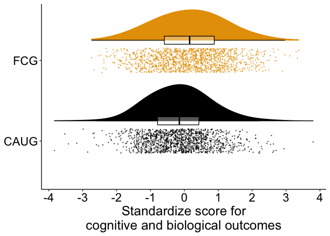<!-- -->

``` r
ggsave(
  paste0(home, "figures/aim1_cog_bio.png"),
  dpi = 600,
  width = 9, 
  height = 7
)
```

### Psychopathology

``` r
d_psy %>% 
  ggplot(aes(group, value_z)) +
  geom_flat_violin(
    aes(color = group, fill = group),
    position = position_nudge(x = .25, y = 0),
    adjust = 2,
    trim = TRUE
  ) +
  geom_point(
    aes(color = group, fill = group),
    position = position_jitter(width = .15),
    size = .25,
    alpha = 1/2
  ) +
  geom_boxplot(
    aes(x = as.numeric(group) + .25, y = value_z, group = group),
    color = "black",
    alpha = 1/3,
    width = .1,
    outlier.shape = NA
  ) +
  scale_y_continuous(breaks = seq.int(-4, 6, 1)) +
  scale_fill_manual(values = cbbPalette) +
  scale_color_manual(values = cbbPalette) +
  theme_beip +
  theme(
    legend.position = "none",
    plot.caption = element_text(hjust = .5, size = 15)
  ) +
  coord_flip() +
  labs(
    x = NULL,
    y = "Standardize score for\n symptoms of psychopathology"
  )
```

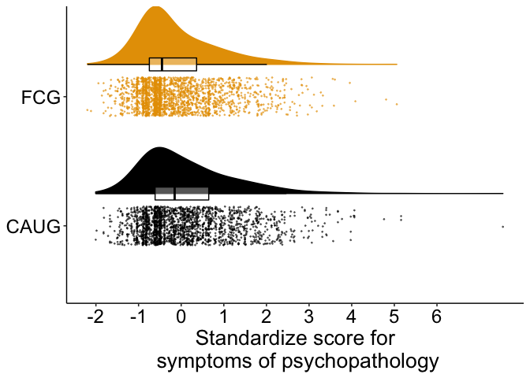<!-- -->

``` r
ggsave(
  paste0(home, "figures/aim1_psy.png"),
  dpi = 600,
  width = 9, 
  height = 7
)
```

## Aim 2 moderating effects

``` r
d_plot <-
  d_cog_bio %>% 
  dplyr::select(
    ID, 
    group, 
    male,
    wave_ordered, 
    age_years, 
    construct, 
    value_z
  ) %>% 
  bind_rows(
    d_psy %>% 
      dplyr::select(
        ID, 
        group, 
        male,
        wave_ordered, 
        age_years, 
        domain, 
        value_z
      )
  ) %>% 
  mutate(
    domain_construct_pretty = case_when(
      construct == "IQ" ~ "IQ",
      construct == "physical" ~ "Physical growth",
      construct == "EEG" ~ paste0("EEG alpha power"),
      domain == "rad"~ "RAD",
      domain == "dsed" ~ "DSED",
      domain == "adhd" ~ "ADHD",
      domain == "extern" ~ "Externalizing",
      domain == "intern" ~ "Internalizing"
    ),
    domain_construct_pretty = fct_relevel(
      domain_construct_pretty,
      "IQ",
      "Physical growth", 
      "EEG alpha power", 
      "DSED", 
      "RAD", 
      "ADHD", 
      "Externalizing", 
      "Internalizing"
    ),
    male = if_else(
      male == 1, "Male", "Female"
    )
  )
```

### By domain by age of assessment

``` r
d_plot %>% 
  ggplot(aes(age_years, value_z, fill = group, color = group)) +
  geom_smooth(method = "lm") +
  scale_y_continuous(breaks = seq.int(-1, 1, .2)) +
  scale_x_continuous(breaks = seq.int(5, 20, 5)) +
  scale_fill_manual(values = cbbPalette) +
  scale_color_manual(values = cbbPalette) +
  theme_beip +
  theme(
    legend.position = "bottom",
    plot.caption = element_text(hjust = .5, size = 16),
    axis.title.y = element_text(vjust = 2)
  ) +
  #coord_flip() +
  labs(
    fill = NULL,
    color = NULL,
    x = "Age of assessment (years)",
    y = "Standardized score"
  ) +
  facet_wrap(.~domain_construct_pretty, ncol = 2)
```

<!-- -->

``` r
ggsave(
  paste0(home, "figures/aim2_all_domain_wave.png"),
  dpi = 600,
  width = 6, 
  height = 10
)
```

### Forest plot

``` r
library(weights)

forest_df_viz <-
  forest_df %>% 
  mutate_at(
    vars(Coefficient:p),
    as.numeric
  ) %>% 
  mutate(
    Parameter = fct_relevel(
      Parameter,
        "Overall cognitive, physical, and neural",
        "Overall psychopathology",
        "IQ",
        "Physical growth",
        "EEG alpha power",
        "DSED",
        "RAD",
        "ADHD",
        "Externalizing",
        "Internalizing"
    ),
    p = rd(p, digits = 3),
    p = paste0("p=", p),
    p = if_else(
      p == "p=.0000000", "p<.001", p
    )
  )

forest_df_viz
```

    ## # A tibble: 10 × 5
    ##    Parameter                               Coefficient  CI_low CI_high p     
    ##    <fct>                                         <dbl>   <dbl>   <dbl> <chr> 
    ##  1 Overall cognitive, physical, and neural      0.270   0.0812  0.459  p=.004
    ##  2 Overall psychopathology                     -0.242  -0.399  -0.0796 p=.006
    ##  3 EEG alpha power                              0.0640 -0.157   0.295  p=.540
    ##  4 IQ                                           0.397   0.179   0.631  p<.001
    ##  5 Physical growth                              0.281   0.0819  0.480  p=.004
    ##  6 ADHD                                        -0.0414 -0.233   0.146  p=.668
    ##  7 DSED                                        -0.351  -0.554  -0.146  p=.002
    ##  8 Externalizing                               -0.146  -0.321   0.0446 p=.120
    ##  9 Internalizing                               -0.215  -0.397  -0.0342 p=.026
    ## 10 RAD                                         -0.605  -0.806  -0.395  p<.001

``` r
forest_cogbio_p <-
  forest_df_viz %>% 
  filter(
    Parameter == "Overall cognitive, physical, and neural" |
    Parameter == "IQ" |
    Parameter == "Physical growth" |
    Parameter == "EEG alpha power"
  ) %>% 
  ggplot(aes(fct_rev(Parameter), Coefficient)) +
  geom_pointrange(
    aes(
      ymin = CI_low,
      ymax = CI_high
    ),
    size = .5
  ) + 
  geom_hline(yintercept = 0, linetype = "dotted") +
  geom_text(aes(label = p), nudge_y = .4) +
  scale_y_continuous(breaks = seq.int(-1, 1, .2), limits = c(-1, 1)) +
  coord_flip() +
  theme_beip +
  theme(
    axis.text.y = element_text(face = c("italic", "italic", "italic", "bold"))
  ) +
  labs(
    x = NULL,
    y = "Standardized regression coefficient"
  )

forest_cogbio_p
```

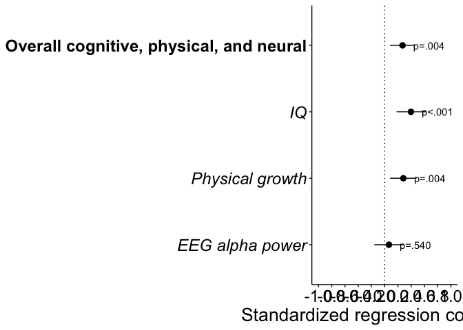<!-- -->

``` r
ggsave(
  paste0(home, "figures/forest_plot_cogbio.png"),
  dpi = 600,
  width = 10.5, 
  height = 5
)
```

``` r
forest_psy_p <-
  forest_df_viz %>% 
  filter(
    Parameter != "Overall cognitive, physical, and neural",
    Parameter != "IQ",
    Parameter != "Physical growth",
    Parameter != "EEG alpha power",
  ) %>% 
  ggplot(aes(fct_rev(Parameter), Coefficient)) +
  geom_pointrange(
    aes(
      ymin = CI_low,
      ymax = CI_high
    ),
    size = .5
  ) + 
  geom_hline(yintercept = 0, linetype = "dotted") +
  geom_text(aes(label = p), nudge_y = .4) +
  scale_y_continuous(breaks = seq.int(-1, 1, .2), limits = c(-1, 1)) +
  coord_flip() +
  theme_beip +
  theme(
    axis.text.y = element_text(face = c("italic", "italic", "italic", "italic", "italic", "bold"))
  ) +
  labs(
    x = NULL,
    y = "Standardized regression coefficient"
  )

forest_psy_p
```

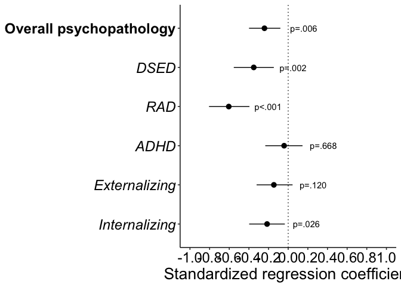<!-- -->

``` r
ggsave(
  paste0(home, "figures/forest_plot_psychopathology.png"),
  dpi = 600,
  width = 9, 
  height = 5
)

ggarrange(
  forest_cogbio_p, 
  forest_psy_p, 
  nrow = 2, 
  align = "hv"
)
```

<!-- -->

``` r
ggsave(
  paste0(home, "figures/forest_plot.png"),
  dpi = 600,
  width = 10.5, 
  height = 9
)
```

## Aim 3

#### Age of placement by domain

``` r
d_plot_fcg <-
  d_fcg_cog_bio %>% 
  dplyr::select(
    ID, 
    group, 
    male,
    age_years,
    wave_ordered, 
    FC_placement_age,
    stable,
    construct, 
    value_z
  ) %>% 
  bind_rows(
    d_fcg_psy %>% 
      dplyr::select(
        ID, 
        group, 
        male,
        age_years,
        wave_ordered, 
        FC_placement_age,
        stable,
        domain, 
        value_z
      )
  ) %>% 
  mutate(
    domain_construct_pretty = case_when(
      construct == "IQ" ~ "IQ",
      construct == "physical" ~ "Physical growth",
      construct == "EEG" ~ "EEG alpha-power",
      domain == "rad"~ "RAD",
      domain == "dsed" ~ "DSED",
      domain == "adhd" ~ "ADHD",
      domain == "extern" ~ "Externalizing",
      domain == "intern" ~ "Internalizing"
    ),
    domain_construct_pretty = fct_relevel(
      domain_construct_pretty,
      "IQ",
      "Physical growth", 
      "EEG alpha-power", 
      "DSED", 
      "RAD", 
      "ADHD", 
      "Externalizing", 
      "Internalizing"
    ),
    stable = recode_factor(
      stable,
      "disrupted" = "Disrupted",
      "stable" = "Stable"
    )
  )

d_plot_fcg %>% 
  ggplot(
    aes(
      FC_placement_age, 
      value_z, 
      color = wave_ordered
    )
  ) +
  geom_smooth(method = "lm", size = 2, se = FALSE) +
  scale_y_continuous(breaks = seq.int(-1, 1.4, .4)) +
  scale_x_continuous(breaks = seq.int(0, 30, 5)) +
  scale_color_viridis_d() +
  theme_beip +
  theme(
    legend.position = "right",
    plot.caption = element_text(hjust = .5, size = 16),
    axis.title.y = element_text(vjust = 2)
  ) +
  labs(
    color = "Assessment wave",
    x = "Age of placement in foster care (months)",
    y = "Standardized score"
  ) +
  facet_wrap(.~domain_construct_pretty, ncol = 2)
```

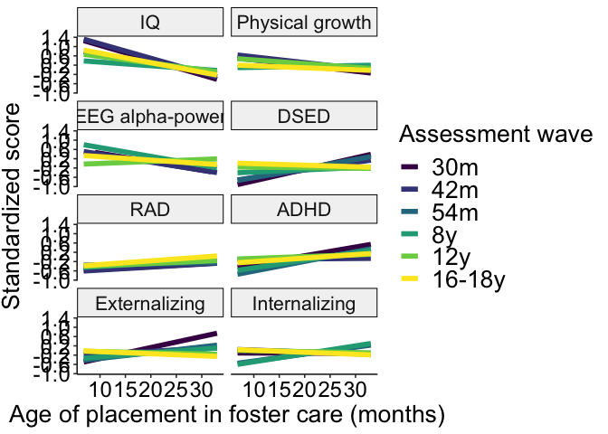<!-- -->

``` r
ggsave(
  paste0(home, "figures/aim3_all_ageplacement_domain_wave.png"),
  dpi = 600,
  width = 9, 
  height = 11
)
```

#### Stability by age of assessment

``` r
d_plot_fcg %>% 
  filter(!is.na(stable)) %>% 
  ggplot(
    aes(
      age_years, 
      value_z, 
      color = stable,
      fill = stable
    )
  ) +
  geom_smooth(method = "lm", size = 2) +
  scale_y_continuous(breaks = seq.int(-1, 1.4, .4)) +
  scale_x_continuous(breaks = seq.int(0, 30, 5)) +
  scale_color_viridis_d(begin = .5) +
  scale_fill_viridis_d(guide = FALSE, begin = .5) +
  theme_beip +
  theme(
    legend.position = "right",
    plot.caption = element_text(hjust = .5, size = 16),
    axis.title.y = element_text(vjust = 2)
  ) +
  labs(
    color = "Foster care placement",
    x = "Age of assessment (years)",
    y = "Standardized score"
  ) +
  facet_wrap(.~domain_construct_pretty, ncol = 2)
```

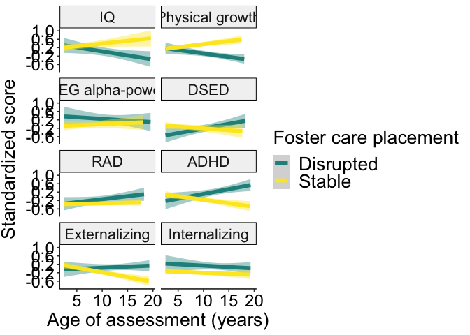<!-- -->

``` r
ggsave(
  paste0(home, "figures/aim3_all_stability_domain_age.png"),
  dpi = 600,
  width = 9, 
  height = 11
)
```

#### Stability by wave

``` r
d_plot_fcg %>% 
  filter(!is.na(stable)) %>% 
  ggplot(
    aes(
      wave_ordered, 
      value_z, 
      fill = stable
    )
  ) +
  geom_boxplot() +
  #scale_y_continuous(breaks = seq.int(-1, 1.4, .4)) +
  scale_fill_viridis_d() +
  theme_beip +
  theme(
    legend.position = "right",
    plot.caption = element_text(hjust = .5, size = 16),
    axis.title.y = element_text(vjust = 2),
    axis.text.x = element_text(angle = 320, hjust = .1)
  ) +
  labs(
    fill = "Foster care placement",
    x = "Assessment wave", 
    y = "Standardized score"
  ) +
  facet_wrap(.~domain_construct_pretty, ncol = 2)
```

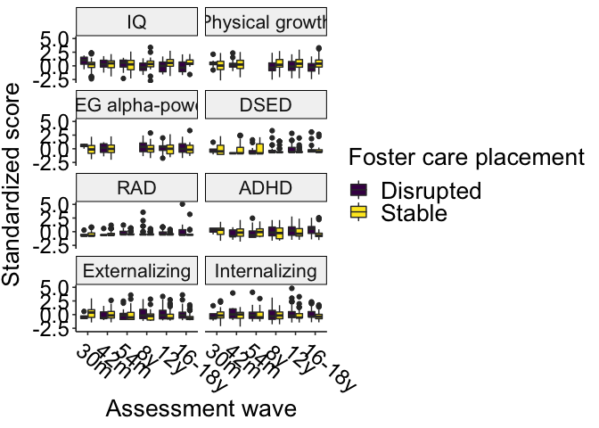<!-- -->

``` r
ggsave(
  paste0(home, "figures/aim3_all_stability_domain_wave_boxplots.png"),
  dpi = 600,
  width = 9, 
  height = 11
)
```
