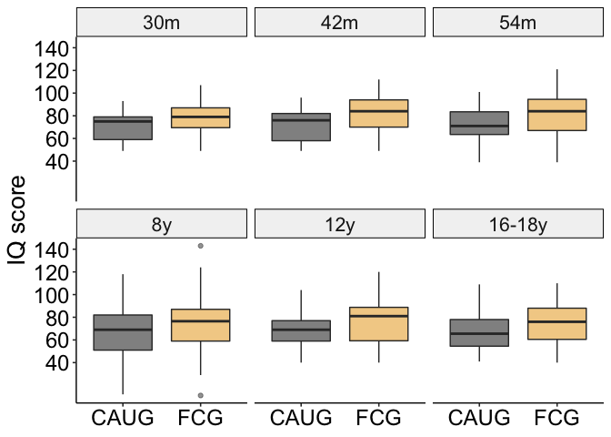
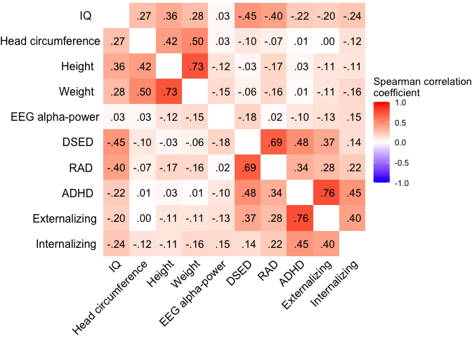
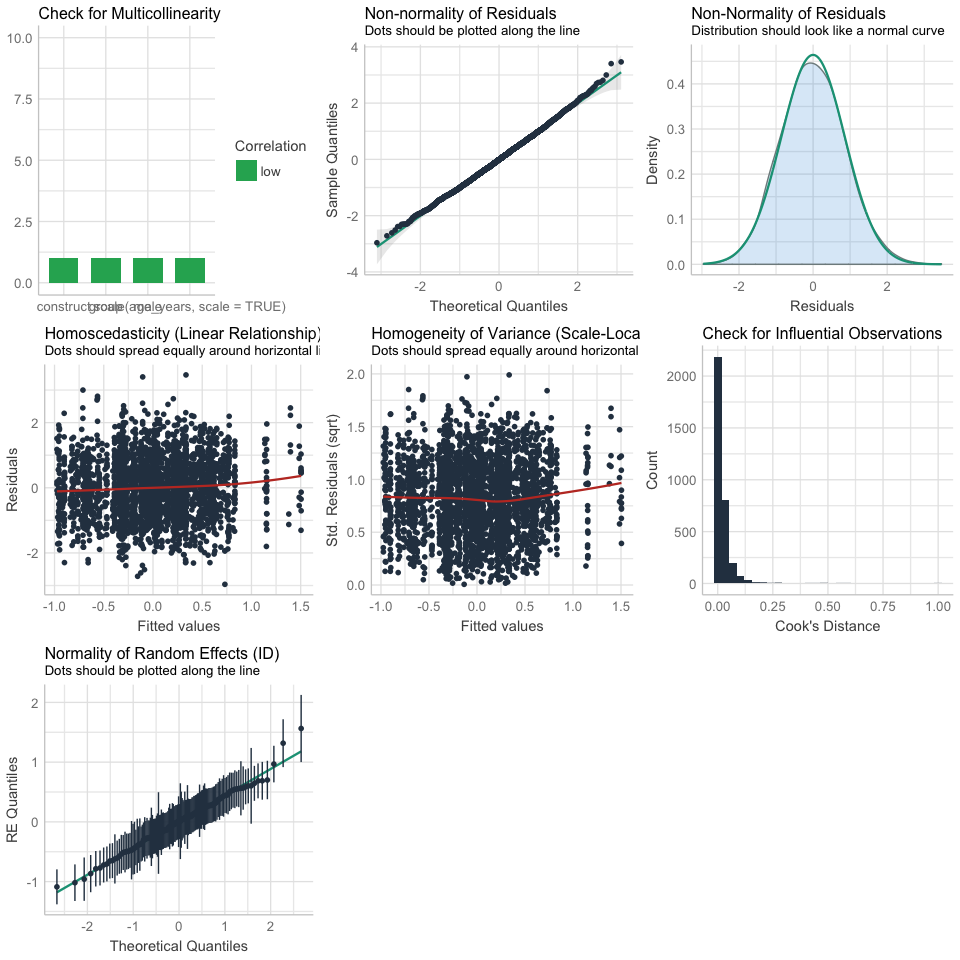
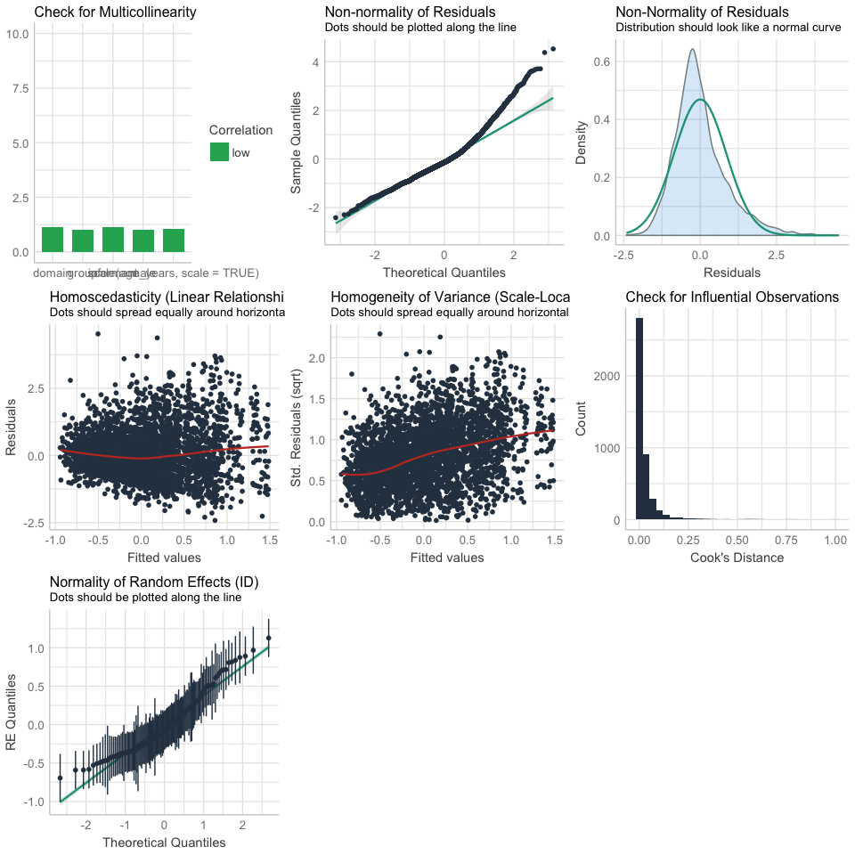
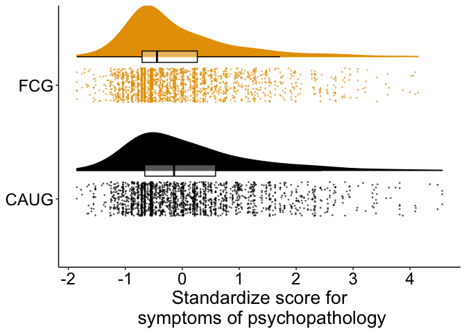

Multi-Level Analysis of Foster Care as an Alternative to
Institutionalization on Psychobiological Outcomes Across Childhood
================
2021

  - [Set up environment](#set-up-environment)
  - [Read in data](#read-in-data)
  - [Descriptives](#descriptives)
      - [Supplemental Tables](#supplemental-tables)
      - [CONSORT diagram](#consort-diagram)
      - [Age](#age)
  - [Remove cases with missing data for “value” from
    dataset](#remove-cases-with-missing-data-for-value-from-dataset)
  - [Create subsetted data frames](#create-subsetted-data-frames)
      - [Subset IQ, EEG, and physical growth
        data](#subset-iq-eeg-and-physical-growth-data)
      - [Subset psychopathology data](#subset-psychopathology-data)
      - [Subset FCG data](#subset-fcg-data)
  - [Visualize distributions](#visualize-distributions)
      - [IQ, physical size, EEG](#iq-physical-size-eeg)
      - [Psychopathology](#psychopathology)
      - [Age of placement in foster
        care](#age-of-placement-in-foster-care)
  - [Descriptives: Raw measurement
    values](#descriptives-raw-measurement-values)
      - [Means, SDs](#means-sds)
      - [Means plots and boxplots](#means-plots-and-boxplots)
  - [Correlations](#correlations)
  - [Results](#results)
      - [Aim 1](#aim-1)
      - [Aim 2](#aim-2)
      - [Aim 3](#aim-3)
  - [Visualizations of effects](#visualizations-of-effects)
      - [Aim 1 main effects](#aim-1-main-effects)
      - [Aim 2 moderating effects](#aim-2-moderating-effects)
      - [Aim 3](#aim-3-1)

``` r
knitr::opts_chunk$set(echo = TRUE, warning=FALSE, message=FALSE)
```

# Set up environment

``` r
#Libraries
library(lme4)
library(lmerTest)
library(tidyverse)
library(sjstats)
library(labelled)
library(ggResidpanel)
library(effectsize)
library(ggsci)
library(gt)
library(ggpubr)
library(performance)
library(robustlmm)
library(parameters)
library(cowplot)
library(cowplot)
library(dplyr)
library(readr)
library(corrr)

source("R_rainclouds.R")

#Files__________________________________________________________________________
home <- "~/Box/lucy_king_files/Tulane/BEIP/comprehensive_analysis/"

cleaned_data_file <- "~/Box/lucy_king_files/Tulane/BEIP/comprehensive_analysis/data/BEIP_big_analysis_tidied_data_20210723.csv"

#Aesthetics_____________________________________________________________________
theme_beip <-
  theme_pubr() +
  theme(
    panel.grid = element_blank(),
    plot.title = element_text(size = 18, hjust = .5),
    axis.title = element_text(size = 20),
    axis.text = element_text(size = 18),
    legend.title = element_text(size = 20), 
    legend.text = element_text(size = 20),
    strip.text = element_text(size = 16),
    legend.position = "bottom"
  )

#Other__________________________________________________________________________
options(scipen = 999) # turn off scientific notation 
set.seed(123456)
cbbPalette <- c(
  "#000000", 
  "#E69F00", 
  "#56B4E9", 
  "#009E73", 
  "#F0E442", 
  "#0072B2", 
  "#D55E00", 
  "#CC79A7"
)
```

# Read in data

``` r
d <-
  read_csv(cleaned_data_file) %>% 
  filter(group != "NIG") %>% 
  mutate(
    male = as.factor(male),
    informant = as.factor(informant),
    ethnic = factor(
      ethnic,
      levels = c(0, 1, 2, 3),
      labels = c("Romanian", "Rroma", "Unknown", "Other")
    ),
    wave_ordered = fct_relevel(
      wave,
      "30m", "42m", "54m", "8y", "12y", "16y"
    ),
    stable = as.factor(stable)
  ) %>% 
  group_by(ID) %>% 
  mutate(
    stability_group = as.factor(
      case_when(
        group == "FCG" & min(stable_num) == 0 ~ "FCG, Disrupted",
        group == "FCG" & min(stable_num) == 1 ~ "FCG, Stable",
        group == "CAUG" ~ "CAUG"
      )
    )
  )
```

# Descriptives

## Supplemental Tables

### Baseline characteristics

``` r
d_baseline_physical <-
  d %>%
  filter(wave == "BL", construct == "physical") %>% 
  distinct(ID, value, .keep_all = TRUE) %>% 
  pivot_wider(
    id_cols = c(ID, group),
    names_from = domain,
    values_from = value
  )

d_baseline_physical %>% 
  group_by(group) %>% 
  summarise(
    mean_height = mean(height, na.rm = TRUE),
    sd_height =  sd(height, na.rm = TRUE),
    mean_weight = mean(weight, na.rm = TRUE),
    sd_weight=  sd(weight, na.rm = TRUE)
  )
```

    ## # A tibble: 2 x 5
    ##   group mean_height sd_height mean_weight sd_weight
    ## * <chr>       <dbl>     <dbl>       <dbl>     <dbl>
    ## 1 CAUG         80.1      7.99        10.3      2.21
    ## 2 FCG          80.6      6.81        10.3      1.91

``` r
t.test(d_baseline_physical$height ~ d_baseline_physical$group)
```

    ## 
    ##  Welch Two Sample t-test
    ## 
    ## data:  d_baseline_physical$height by d_baseline_physical$group
    ## t = -0.38602, df = 112.35, p-value = 0.7002
    ## alternative hypothesis: true difference in means is not equal to 0
    ## 95 percent confidence interval:
    ##  -3.219820  2.169764
    ## sample estimates:
    ## mean in group CAUG  mean in group FCG 
    ##           80.06207           80.58710

``` r
t.test(d_baseline_physical$weight ~ d_baseline_physical$group)
```

    ## 
    ##  Welch Two Sample t-test
    ## 
    ## data:  d_baseline_physical$weight by d_baseline_physical$group
    ## t = 0.16835, df = 112.95, p-value = 0.8666
    ## alternative hypothesis: true difference in means is not equal to 0
    ## 95 percent confidence interval:
    ##  -0.6870395  0.8146458
    ## sample estimates:
    ## mean in group CAUG  mean in group FCG 
    ##           10.32945           10.26565

``` r
d_baseline <-
  d %>%  
  filter(wave == "BL") %>% 
  distinct(ID, group, .keep_all = TRUE) %>% 
  mutate(
    romanian = ethnic == "Romanian"
  )

d_baseline %>% 
  group_by(group) %>% 
  summarise(
    mean_BW = mean(birth_weight, na.rm = TRUE),
    sd_BQ = sd(birth_weight,  na.rm = TRUE),
    mean_gest_age = mean(gestation_weeks, na.rm = TRUE),
    sd_gest_age = sd(gestation_weeks, na.rm = TRUE),
    mean_pct_inst = mean(pctinst, na.rm = TRUE),
    sd_pct_inst = sd(pctinst, na.rm = TRUE),
    min_pct_inst = min(pctinst, na.rm = TRUE),
    max_pct_inst = max(pctinst, na.rm = TRUE),
    mean_inst_age = mean(inst_entry_age, na.rm = TRUE),
    sd_ints_age = sd(inst_entry_age, na.rm = TRUE),
    mean_bl_age = mean(age_months, na.rm = TRUE),
    sd_bl_age = sd(age_months, na.rm = TRUE)
  )
```

    ## # A tibble: 2 x 13
    ##   group mean_BW sd_BQ mean_gest_age sd_gest_age mean_pct_inst sd_pct_inst
    ## * <chr>   <dbl> <dbl>         <dbl>       <dbl>         <dbl>       <dbl>
    ## 1 CAUG    2830.  568.          37.6        1.50          86.0        21.6
    ## 2 FCG     2719.  629.          37.0        2.62          86.1        21.7
    ## # … with 6 more variables: min_pct_inst <dbl>, max_pct_inst <dbl>,
    ## #   mean_inst_age <dbl>, sd_ints_age <dbl>, mean_bl_age <dbl>, sd_bl_age <dbl>

``` r
t.test(d_baseline$age_months ~ d_baseline$group)
```

    ## 
    ##  Welch Two Sample t-test
    ## 
    ## data:  d_baseline$age_months by d_baseline$group
    ## t = 0.41446, df = 134, p-value = 0.6792
    ## alternative hypothesis: true difference in means is not equal to 0
    ## 95 percent confidence interval:
    ##  -1.989960  3.045076
    ## sample estimates:
    ## mean in group CAUG  mean in group FCG 
    ##           21.01182           20.48426

``` r
t.test(d_baseline$birth_weight ~ d_baseline$group)
```

    ## 
    ##  Welch Two Sample t-test
    ## 
    ## data:  d_baseline$birth_weight by d_baseline$group
    ## t = 1.0317, df = 119.44, p-value = 0.3043
    ## alternative hypothesis: true difference in means is not equal to 0
    ## 95 percent confidence interval:
    ##  -102.7583  326.3282
    ## sample estimates:
    ## mean in group CAUG  mean in group FCG 
    ##           2830.333           2718.548

``` r
t.test(d_baseline$gestation_weeks ~ d_baseline$group)
```

    ## 
    ##  Welch Two Sample t-test
    ## 
    ## data:  d_baseline$gestation_weeks by d_baseline$group
    ## t = 1.4888, df = 93.319, p-value = 0.1399
    ## alternative hypothesis: true difference in means is not equal to 0
    ## 95 percent confidence interval:
    ##  -0.1963582  1.3731136
    ## sample estimates:
    ## mean in group CAUG  mean in group FCG 
    ##           37.57143           36.98305

``` r
t.test(d_baseline$pctinst ~ d_baseline$group)
```

    ## 
    ##  Welch Two Sample t-test
    ## 
    ## data:  d_baseline$pctinst by d_baseline$group
    ## t = -0.030545, df = 134, p-value = 0.9757
    ## alternative hypothesis: true difference in means is not equal to 0
    ## 95 percent confidence interval:
    ##  -7.455721  7.228932
    ## sample estimates:
    ## mean in group CAUG  mean in group FCG 
    ##           85.96542           86.07882

``` r
d_baseline %>% 
  count(group, male) %>% 
  group_by(group) %>% 
  mutate(per = n / sum(n))
```

    ## # A tibble: 136 x 5
    ## # Groups:   group [2]
    ##       ID group male      n    per
    ##    <dbl> <chr> <fct> <int>  <dbl>
    ##  1     1 FCG   0         1 0.0147
    ##  2     2 FCG   0         1 0.0147
    ##  3     3 FCG   1         1 0.0147
    ##  4     4 FCG   0         1 0.0147
    ##  5     5 FCG   0         1 0.0147
    ##  6     6 CAUG  0         1 0.0147
    ##  7     7 FCG   0         1 0.0147
    ##  8     8 CAUG  1         1 0.0147
    ##  9     9 CAUG  1         1 0.0147
    ## 10    10 CAUG  1         1 0.0147
    ## # … with 126 more rows

``` r
d_baseline %>% 
  count(group, ethnic) %>% 
  group_by(group) %>% 
  mutate(per = n / sum(n))
```

    ## # A tibble: 136 x 5
    ## # Groups:   group [2]
    ##       ID group ethnic       n    per
    ##    <dbl> <chr> <fct>    <int>  <dbl>
    ##  1     1 FCG   Romanian     1 0.0147
    ##  2     2 FCG   Rroma        1 0.0147
    ##  3     3 FCG   Romanian     1 0.0147
    ##  4     4 FCG   Romanian     1 0.0147
    ##  5     5 FCG   Romanian     1 0.0147
    ##  6     6 CAUG  Rroma        1 0.0147
    ##  7     7 FCG   Romanian     1 0.0147
    ##  8     8 CAUG  Rroma        1 0.0147
    ##  9     9 CAUG  Rroma        1 0.0147
    ## 10    10 CAUG  Romanian     1 0.0147
    ## # … with 126 more rows

``` r
table_sex <- table(d_baseline$male, d_baseline$group)
prop.test(table_sex)
```

    ## 
    ##  2-sample test for equality of proportions with continuity correction
    ## 
    ## data:  table_sex
    ## X-squared = 0, df = 1, p-value = 1
    ## alternative hypothesis: two.sided
    ## 95 percent confidence interval:
    ##  -0.1680655  0.1974836
    ## sample estimates:
    ##    prop 1    prop 2 
    ## 0.5072464 0.4925373

``` r
table_ethnic <- table(d_baseline$romanian, d_baseline$group)
prop.test(table_ethnic)
```

    ## 
    ##  2-sample test for equality of proportions with continuity correction
    ## 
    ## data:  table_ethnic
    ## X-squared = 1.4614, df = 1, p-value = 0.2267
    ## alternative hypothesis: two.sided
    ## 95 percent confidence interval:
    ##  -0.06359584  0.30219234
    ## sample estimates:
    ##    prop 1    prop 2 
    ## 0.5666667 0.4473684

``` r
# baseline: length of stay in institutional care (in months)
d_baseline <-
  d_baseline %>% 
  mutate(
    length_inst = age_months - inst_entry_age
  )

d_baseline %>% 
  group_by(group) %>% 
  summarise(
    mean_length_inst = mean(length_inst),
    min_length_inst = min(length_inst),
    max_length_inst = max(length_inst)
  )
```

    ## # A tibble: 2 x 4
    ##   group mean_length_inst min_length_inst max_length_inst
    ## * <chr>            <dbl>           <dbl>           <dbl>
    ## 1 CAUG              18.6           0.592            31.8
    ## 2 FCG               17.8           2.24             30.4

### Remove baseline data

``` r
d <-
  d %>% 
  filter(wave != "BL")
```

## CONSORT diagram

### Total individuals per group

``` r
d %>% 
  filter(!is.na(value)) %>% 
  distinct(ID, group) %>% 
  count(group) 
```

    ## # A tibble: 130 x 3
    ## # Groups:   ID [130]
    ##       ID group     n
    ##    <dbl> <chr> <int>
    ##  1     1 FCG       1
    ##  2     2 FCG       1
    ##  3     3 FCG       1
    ##  4     5 FCG       1
    ##  5     6 CAUG      1
    ##  6     8 CAUG      1
    ##  7     9 CAUG      1
    ##  8    10 CAUG      1
    ##  9    11 FCG       1
    ## 10    12 CAUG      1
    ## # … with 120 more rows

### Total number of observations

``` r
d %>% 
  filter(!is.na(value)) %>% 
  count() 
```

    ## # A tibble: 130 x 2
    ## # Groups:   ID [130]
    ##       ID     n
    ##    <dbl> <int>
    ##  1     1    27
    ##  2     2    66
    ##  3     3    22
    ##  4     5    70
    ##  5     6    63
    ##  6     8    73
    ##  7     9    53
    ##  8    10    66
    ##  9    11    73
    ## 10    12    67
    ## # … with 120 more rows

### Total number of observations per group

``` r
d %>% 
  filter(!is.na(value)) %>% 
  count(group) 
```

    ## # A tibble: 130 x 3
    ## # Groups:   ID [130]
    ##       ID group     n
    ##    <dbl> <chr> <int>
    ##  1     1 FCG      27
    ##  2     2 FCG      66
    ##  3     3 FCG      22
    ##  4     5 FCG      70
    ##  5     6 CAUG     63
    ##  6     8 CAUG     73
    ##  7     9 CAUG     53
    ##  8    10 CAUG     66
    ##  9    11 FCG      73
    ## 10    12 CAUG     67
    ## # … with 120 more rows

### Total number of observations per wave

``` r
d %>% 
  filter(!is.na(value)) %>% 
  count(wave_ordered) 
```

    ## # A tibble: 707 x 3
    ## # Groups:   ID [130]
    ##       ID wave_ordered     n
    ##    <dbl> <fct>        <int>
    ##  1     1 30m             11
    ##  2     1 42m             10
    ##  3     1 54m              6
    ##  4     2 30m             11
    ##  5     2 42m             11
    ##  6     2 54m              6
    ##  7     2 8y              11
    ##  8     2 12y             13
    ##  9     2 16-18y          14
    ## 10     3 30m             11
    ## # … with 697 more rows

### Number of individuals per group per wave

``` r
d %>% 
  filter(!is.na(value)) %>% 
  distinct(ID, group, wave_ordered) %>% 
  count(group, wave_ordered)
```

    ## # A tibble: 707 x 4
    ## # Groups:   ID [130]
    ##       ID group wave_ordered     n
    ##    <dbl> <chr> <fct>        <int>
    ##  1     1 FCG   30m              1
    ##  2     1 FCG   42m              1
    ##  3     1 FCG   54m              1
    ##  4     2 FCG   30m              1
    ##  5     2 FCG   42m              1
    ##  6     2 FCG   54m              1
    ##  7     2 FCG   8y               1
    ##  8     2 FCG   12y              1
    ##  9     2 FCG   16-18y           1
    ## 10     3 FCG   30m              1
    ## # … with 697 more rows

### Number of observations per group per wave

``` r
d %>% 
  filter(!is.na(value)) %>% 
  count(group, wave_ordered) %>% 
  arrange(group, wave_ordered)
```

    ## # A tibble: 707 x 4
    ## # Groups:   ID [130]
    ##       ID group wave_ordered     n
    ##    <dbl> <chr> <fct>        <int>
    ##  1     6 CAUG  30m             11
    ##  2     8 CAUG  30m             11
    ##  3     9 CAUG  30m             11
    ##  4    10 CAUG  30m             11
    ##  5    12 CAUG  30m             11
    ##  6    13 CAUG  30m             11
    ##  7    14 CAUG  30m             11
    ##  8    15 CAUG  30m             11
    ##  9    17 CAUG  30m             11
    ## 10    20 CAUG  30m             11
    ## # … with 697 more rows

### Number of individuals per group per construct per wave

``` r
d %>% 
  filter(!is.na(value)) %>% 
  distinct(ID, group, wave_ordered, construct) %>% 
  count(group, wave_ordered, construct) %>% 
  arrange(group, wave_ordered, construct)
```

    ## # A tibble: 2,408 x 5
    ## # Groups:   ID [130]
    ##       ID group wave_ordered construct     n
    ##    <dbl> <chr> <fct>        <chr>     <int>
    ##  1     6 CAUG  30m          EEG           1
    ##  2     8 CAUG  30m          EEG           1
    ##  3     9 CAUG  30m          EEG           1
    ##  4    10 CAUG  30m          EEG           1
    ##  5    12 CAUG  30m          EEG           1
    ##  6    13 CAUG  30m          EEG           1
    ##  7    14 CAUG  30m          EEG           1
    ##  8    15 CAUG  30m          EEG           1
    ##  9    17 CAUG  30m          EEG           1
    ## 10    20 CAUG  30m          EEG           1
    ## # … with 2,398 more rows

### Number of observations per group per construct per wave

``` r
d %>% 
  filter(!is.na(value)) %>% 
  count(group, wave_ordered, construct) %>% 
  arrange(group, wave_ordered, construct)
```

    ## # A tibble: 2,408 x 5
    ## # Groups:   ID [130]
    ##       ID group wave_ordered construct     n
    ##    <dbl> <chr> <fct>        <chr>     <int>
    ##  1     6 CAUG  30m          EEG           2
    ##  2     8 CAUG  30m          EEG           2
    ##  3     9 CAUG  30m          EEG           2
    ##  4    10 CAUG  30m          EEG           2
    ##  5    12 CAUG  30m          EEG           2
    ##  6    13 CAUG  30m          EEG           2
    ##  7    14 CAUG  30m          EEG           2
    ##  8    15 CAUG  30m          EEG           2
    ##  9    17 CAUG  30m          EEG           2
    ## 10    20 CAUG  30m          EEG           2
    ## # … with 2,398 more rows

``` r
d %>% 
  filter(wave != "BL") %>% 
  count(wave, construct) %>% 
  arrange(construct, wave) %>% 
  ggplot(aes(wave, n, color = construct)) +
  geom_point(size = 5) +
  scale_y_continuous(breaks = seq.int(300, 1600, 100)) +
  labs(
    y = "Number of observations"
  ) +
  theme_beip +
  labs(color = NULL, x = "Assessment wave")
```

<!-- -->

``` r
ggsave(
  paste0(home, "figures/wave_construct_n.png"),
  width = 10,
  height = 7
)
```

### Psychopathology: number of observations per wave per measure per domain

``` r
d %>% 
  filter(wave != "BL") %>% 
  filter(construct == "psychopathology") %>% 
  count(group, wave, measure, domain) %>% 
  arrange(wave, domain, measure, desc(n))
```

    ## # A tibble: 4,019 x 6
    ## # Groups:   ID [130]
    ##       ID group wave  measure domain     n
    ##    <dbl> <chr> <chr> <chr>   <chr>  <int>
    ##  1     2 FCG   12y   disc    adhd       1
    ##  2     5 FCG   12y   disc    adhd       1
    ##  3     6 CAUG  12y   disc    adhd       1
    ##  4     8 CAUG  12y   disc    adhd       1
    ##  5     9 CAUG  12y   disc    adhd       1
    ##  6    10 CAUG  12y   disc    adhd       1
    ##  7    11 FCG   12y   disc    adhd       1
    ##  8    12 CAUG  12y   disc    adhd       1
    ##  9    13 CAUG  12y   disc    adhd       1
    ## 10    14 CAUG  12y   disc    adhd       1
    ## # … with 4,009 more rows

``` r
d %>% 
  filter(wave != "BL") %>% 
  filter(construct == "psychopathology") %>% 
  count(wave, measure, domain) %>% 
  arrange(wave, domain, measure, desc(n)) %>% 
  ggplot(aes(wave, n, color = measure)) +
  geom_point(size = 3) +
  labs(
    y = "Number of observations\nby type of psychopathology"
  ) +
  theme_beip +
  theme(
    legend.position = "right"
  ) +
  facet_grid(.~domain) 
```

<!-- -->

``` r
ggsave(
  paste0(home, "figures/wave_domain_psychopathology_n.png"),
  width = 12,
  height = 5
)
```

### Psychopathology: Number of observations per wave per measure

``` r
d %>% 
  filter(wave != "BL") %>% 
  filter(construct == "psychopathology") %>% 
  count(wave, measure, informant) %>% 
  arrange(wave, desc(n))
```

    ## # A tibble: 1,729 x 5
    ## # Groups:   ID [130]
    ##       ID wave  measure informant     n
    ##    <dbl> <chr> <chr>   <fct>     <int>
    ##  1     2 12y   disc    P             3
    ##  2     5 12y   disc    P             3
    ##  3     5 12y   hbq     P             3
    ##  4     5 12y   hbq     T             3
    ##  5     6 12y   disc    P             3
    ##  6     6 12y   hbq     P             3
    ##  7     8 12y   disc    P             3
    ##  8     8 12y   hbq     P             3
    ##  9     8 12y   hbq     T             3
    ## 10     9 12y   disc    P             3
    ## # … with 1,719 more rows

### IQ: Number of observations per wave per measure

``` r
d %>% 
  filter(wave != "BL") %>% 
  filter(construct == "IQ") %>% 
  count(wave, measure) %>% 
  arrange(wave, desc(n))
```

    ## # A tibble: 651 x 4
    ## # Groups:   ID [127]
    ##       ID wave  measure     n
    ##    <dbl> <chr> <chr>   <int>
    ##  1     2 12y   wisc        1
    ##  2     5 12y   wisc        1
    ##  3     6 12y   wisc        1
    ##  4     8 12y   wisc        1
    ##  5     9 12y   wisc        1
    ##  6    10 12y   wisc        1
    ##  7    11 12y   wisc        1
    ##  8    12 12y   wisc        1
    ##  9    13 12y   wisc        1
    ## 10    14 12y   wisc        1
    ## # … with 641 more rows

### EEG: Number of observations per wave per group per measure

``` r
d %>% 
  filter(wave != "BL") %>% 
  filter(construct == "EEG") %>% 
  count(group, wave, measure) %>% 
  arrange(group, wave, desc(n))
```

    ## # A tibble: 1,041 x 5
    ## # Groups:   ID [127]
    ##       ID group wave  measure     n
    ##    <dbl> <chr> <chr> <chr>   <int>
    ##  1     6 CAUG  12y   alphaEC     1
    ##  2     6 CAUG  12y   alphaEO     1
    ##  3     8 CAUG  12y   alphaEC     1
    ##  4     8 CAUG  12y   alphaEO     1
    ##  5     9 CAUG  12y   alphaEC     1
    ##  6     9 CAUG  12y   alphaEO     1
    ##  7    10 CAUG  12y   alphaEC     1
    ##  8    10 CAUG  12y   alphaEO     1
    ##  9    12 CAUG  12y   alphaEC     1
    ## 10    12 CAUG  12y   alphaEO     1
    ## # … with 1,031 more rows

``` r
d %>% 
  filter(wave != "BL") %>% 
  filter(construct == "EEG") %>% 
  count(group, wave, measure) %>% 
  arrange(wave, desc(n)) %>% 
  ggplot(aes(wave, n, color = measure)) +
  geom_point(size = 3) +
  labs(
    y = "Number of observations\nby type of EEG"
  ) +
  theme_beip +
  theme(
    legend.position = "right"
  ) +
  facet_grid(.~group)
```

<!-- -->

``` r
ggsave(
  paste0(home, "figures/wave_measure_EEG_n.png"),
  width = 9,
  height = 5
)
```

### Identify who discontinued and missed waves

``` r
## all 
missing_data_all <- 
  d %>% 
  filter(!is.na(value), wave != "BL") %>% 
  distinct(ID, wave) %>% 
  count(ID, wave) %>% 
  pivot_wider(
    names_from = wave,
    values_from = n,
    names_prefix = "w"
  )

missing_data_all %>% 
  group_by(ID) %>% 
  mutate(
    sum = sum(
      c(
        w30m,
        w42m,
        w54m,
        w8y,
        w12y,
        `w16-18y`
      ),
      na.rm = TRUE
    )
  ) %>% 
  ungroup() %>% 
  count(sum)
```

    ## # A tibble: 6 x 2
    ##     sum     n
    ## * <int> <int>
    ## 1     1     1
    ## 2     2     6
    ## 3     3     3
    ## 4     4     8
    ## 5     5    19
    ## 6     6    93

``` r
### FCG
missing_data_FCG <- 
  d %>% 
  filter(group == "FCG", !is.na(value)) %>% 
  distinct(ID, wave) %>% 
  count(ID, wave) %>% 
  pivot_wider(
    names_from = wave,
    values_from = n,
    names_prefix = "w"
  )

missing_data_FCG %>% 
  count(w30m, w42m, w54m, w8y, w12y, `w16-18y`)
```

    ## # A tibble: 65 x 8
    ## # Groups:   ID [65]
    ##       ID  w30m  w42m  w54m   w8y  w12y `w16-18y`     n
    ##    <dbl> <int> <int> <int> <int> <int>     <int> <int>
    ##  1     1     1     1     1    NA    NA        NA     1
    ##  2     2     1     1     1     1     1         1     1
    ##  3     3     1     1    NA    NA    NA        NA     1
    ##  4     5     1     1     1     1     1         1     1
    ##  5    11     1     1     1     1     1         1     1
    ##  6    16     1     1     1     1     1         1     1
    ##  7    18     1     1     1     1    NA        NA     1
    ##  8    19     1     1     1     1     1         1     1
    ##  9    21     1     1     1     1     1         1     1
    ## 10    23     1     1     1     1     1         1     1
    ## # … with 55 more rows

``` r
### CAUG
missing_data_CAUG <- 
  d %>% 
  filter(group == "CAUG", !is.na(value)) %>% 
  distinct(ID, wave) %>% 
  count(ID, wave) %>% 
  pivot_wider(
    names_from = wave,
    values_from = n,
    names_prefix = "w"
  )

missing_data_CAUG %>% 
  count(w30m, w42m, w54m, w8y, w12y, `w16-18y`)
```

    ## # A tibble: 65 x 8
    ## # Groups:   ID [65]
    ##       ID  w30m  w42m  w54m   w8y  w12y `w16-18y`     n
    ##    <dbl> <int> <int> <int> <int> <int>     <int> <int>
    ##  1     6     1     1     1     1     1         1     1
    ##  2     8     1     1     1     1     1         1     1
    ##  3     9     1     1     1     1     1         1     1
    ##  4    10     1     1     1     1     1         1     1
    ##  5    12     1     1     1     1     1         1     1
    ##  6    13     1     1     1     1     1         1     1
    ##  7    14     1     1     1     1     1         1     1
    ##  8    15     1     1     1     1     1         1     1
    ##  9    17     1     1     1     1     1         1     1
    ## 10    20     1     1     1    NA     1         1     1
    ## # … with 55 more rows

## Age

``` r
d %>% 
  group_by(wave, group) %>% 
  summarise_at(
    vars(mean_age_months_wave, mean_age_years_wave),
    funs(mean, min, max, sd), na.rm = TRUE
  )
```

    ## # A tibble: 12 x 10
    ## # Groups:   wave [6]
    ##    wave   group mean_age_months_wave_… mean_age_years_wave… mean_age_months_wav…
    ##    <chr>  <chr>                  <dbl>                <dbl>                <dbl>
    ##  1 12y    CAUG                   153.                 12.8                 134. 
    ##  2 12y    FCG                    153.                 12.7                 139. 
    ##  3 16-18y CAUG                   201.                 16.7                 192. 
    ##  4 16-18y FCG                    200.                 16.7                 190. 
    ##  5 30m    CAUG                    30.9                 2.57                 29.5
    ##  6 30m    FCG                     30.6                 2.55                 29.4
    ##  7 42m    CAUG                    42.5                 3.54                 41.2
    ##  8 42m    FCG                     42.3                 3.53                 41.8
    ##  9 54m    CAUG                    55.7                 4.64                 53.2
    ## 10 54m    FCG                     54.8                 4.57                 48.9
    ## 11 8y     CAUG                   104.                  8.69                 97.0
    ## 12 8y     FCG                    102.                  8.53                 82.2
    ## # … with 5 more variables: mean_age_years_wave_min <dbl>,
    ## #   mean_age_months_wave_max <dbl>, mean_age_years_wave_max <dbl>,
    ## #   mean_age_months_wave_sd <dbl>, mean_age_years_wave_sd <dbl>

``` r
d %>% 
  distinct(ID, mean_age_years_wave, wave_ordered) %>% 
  ggplot(aes(mean_age_years_wave, fill = wave_ordered)) +
  geom_histogram(alpha = 1/2) +
  scale_x_continuous(breaks = seq.int(0, 18, 2)) +
  scale_fill_manual(values=cbbPalette) +
  theme_beip +
  theme(
    legend.position = "right"
  ) +
  labs(x = "Age (years)", fill = "Wave")
```

<!-- -->

``` r
ggsave(
  paste0(home, "figures/age_years_wave_histogram.png"),
  width = 9, 
  height = 7
)

d %>% 
  group_by(wave, group) %>% 
  summarise_at(
    vars(mean_age_months_wave),
    funs(min, max), na.rm = TRUE
  )
```

    ## # A tibble: 12 x 4
    ## # Groups:   wave [6]
    ##    wave   group   min   max
    ##    <chr>  <chr> <dbl> <dbl>
    ##  1 12y    CAUG  134.  176. 
    ##  2 12y    FCG   139.  170. 
    ##  3 16-18y CAUG  192.  219. 
    ##  4 16-18y FCG   190.  219. 
    ##  5 30m    CAUG   29.5  34.8
    ##  6 30m    FCG    29.4  36.7
    ##  7 42m    CAUG   41.2  43.8
    ##  8 42m    FCG    41.8  43.1
    ##  9 54m    CAUG   53.2  61.1
    ## 10 54m    FCG    48.9  57.0
    ## 11 8y     CAUG   97.0 121. 
    ## 12 8y     FCG    82.2 127.

``` r
d %>% 
  group_by(wave, group) %>% 
  summarise_at(
    vars(mean_age_years_wave),
    funs(min, max), na.rm = TRUE
  )
```

    ## # A tibble: 12 x 4
    ## # Groups:   wave [6]
    ##    wave   group   min   max
    ##    <chr>  <chr> <dbl> <dbl>
    ##  1 12y    CAUG  11.1  14.7 
    ##  2 12y    FCG   11.5  14.2 
    ##  3 16-18y CAUG  16.0  18.2 
    ##  4 16-18y FCG   15.9  18.2 
    ##  5 30m    CAUG   2.46  2.90
    ##  6 30m    FCG    2.45  3.06
    ##  7 42m    CAUG   3.43  3.65
    ##  8 42m    FCG    3.48  3.60
    ##  9 54m    CAUG   4.44  5.09
    ## 10 54m    FCG    4.08  4.75
    ## 11 8y     CAUG   8.08 10.1 
    ## 12 8y     FCG    6.85 10.6

# Remove cases with missing data for “value” from dataset

``` r
d <-
  d %>% 
  filter(!is.na(value))

d %>% 
  count(group)
```

    ## # A tibble: 130 x 3
    ## # Groups:   ID [130]
    ##       ID group     n
    ##    <dbl> <chr> <int>
    ##  1     1 FCG      27
    ##  2     2 FCG      66
    ##  3     3 FCG      22
    ##  4     5 FCG      70
    ##  5     6 CAUG     63
    ##  6     8 CAUG     73
    ##  7     9 CAUG     53
    ##  8    10 CAUG     66
    ##  9    11 FCG      73
    ## 10    12 CAUG     67
    ## # … with 120 more rows

# Create subsetted data frames

## Subset IQ, EEG, and physical growth data

By standardizing within wave, within-person growth effects are no longer
detectable. In other words, we cannot say whether X tends to increase as
age increases. Instead, we can say that X is relatively higher or lower
when age is higher or lower.

``` r
d_cog_bio <-
  d %>% 
  filter(construct != "psychopathology") %>% 
  # standardized within wave (eliminates within-person growth effects) and measure (puts all data on same scale)
  group_by(wave, measure) %>% 
  mutate(
    value_z = scale(value)
  ) %>% 
  ungroup() %>% 
  filter() %>% 
  mutate_at(
    vars(domain, informant, group, wave, construct),
    as.factor
  ) %>%
  mutate(
    domain = droplevels(domain),
    informant = droplevels(informant),
    wave = droplevels(wave),
    construct = droplevels(construct)
  )
```

## Subset psychopathology data

``` r
d_psy <-
  d %>% 
  filter(construct == "psychopathology") %>% 
    # standardized within wave (eliminates within-person growth effects) and measure (puts all data on same scale)
  group_by(wave, measure) %>%  
  mutate(
    value_z = scale(value)
  ) %>% 
  ungroup() %>% 
  dplyr::select(-construct) %>% 
  mutate_at(
    vars(domain, informant, group, wave),
    as.factor
  ) %>%
  mutate(
    domain = droplevels(domain),
    informant = droplevels(informant),
    wave = droplevels(wave)
  )
```

## Subset FCG data

``` r
d_fcg_cog_bio <-
  d_cog_bio %>% 
  filter(group == "FCG") 

d_fcg_psy <-
  d_psy %>% 
  filter(group == "FCG")
```

### Stability of FC placement

IDs 82 and 98 reintegrated in bio families prior to FC placement;
therefore, not included in stability analyses.

``` r
d_fcg_cog_bio %>% 
  distinct(ID, stability_group) %>% 
  count(stability_group)
```

    ## # A tibble: 3 x 2
    ##   stability_group     n
    ## * <fct>           <int>
    ## 1 FCG, Stable        26
    ## 2 FCG, Disrupted     37
    ## 3 <NA>                2

# Visualize distributions

## IQ, physical size, EEG

### By group

``` r
d_cog_bio %>% 
  ggplot(aes(value_z, fill = group)) +
  geom_density(alpha = 1/2) +
  theme_beip +
  scale_fill_manual(values = cbbPalette) +
  labs(
    fill = NULL,
    title = "IQ, physical size, EEG",
    x = "Standardized score"
  )
```

<!-- -->

### By group by wave

``` r
d_cog_bio %>% 
  ggplot(aes(value_z, fill = group)) +
  geom_density(alpha = 1/2) +
  theme_beip +
  scale_fill_manual(values = cbbPalette) +
  labs(
    fill = NULL,
    title = "IQ, physical size, EEG",
    x = "Standardized score"
  ) +
  facet_grid(wave~.)
```

<!-- --> \#\#\#
By group by wave by construct

``` r
d_cog_bio %>% 
  ggplot(aes(value_z, fill = group)) +
  geom_density(alpha = 1/2) +
  theme_beip +
  scale_fill_manual(values = cbbPalette) +
  labs(
    fill = NULL,
    title = "IQ, physical size, EEG",
    x = "Standardized score"
  ) +
  facet_grid(wave~construct, scales = "free")
```

<!-- -->

## Psychopathology

### By group

``` r
d_psy %>% 
  ggplot(aes(value_z, fill = group)) +
  geom_density(alpha = 1/2) +
  theme_beip +
  scale_fill_manual(values = cbbPalette) +
  labs(
    fill = NULL,
    title = "Psychopathology", 
    x = "Standardized outcome score"
  )
```

<!-- -->

``` r
ggsave(
  paste0(home, "figures/psy_raw_group_density.png"),
  width = 9, 
  height = 7
)

d_psy %>% 
  ggplot(aes(sqrt(value_z), fill = group)) +
  geom_density(alpha = 1/2) +
  theme_beip +
  scale_fill_manual(values = cbbPalette) +
  labs(
    fill = NULL,
    title = "Psychopathology", 
    x = "Standardized outcome score"
  )
```

<!-- -->

``` r
ggsave(
  paste0(home, "figures/psy_sqrt_group_density.png"),
  width = 9, 
  height = 7
)
```

### By group by wave by domain

``` r
d_psy %>% 
  ggplot(aes(value_z, fill = group)) +
  geom_density(alpha = 1/2) +
  theme_pubr() +
  theme_beip +
  scale_fill_manual(values = cbbPalette) +
  labs(x = "Standardized outcome score", fill = NULL) +
  facet_grid(wave~domain, scales = "free") 
```

<!-- -->

## Age of placement in foster care

``` r
d %>% 
  filter(group == "FCG") %>% 
  distinct(ID, FC_placement_age) %>% 
  ggplot(aes(FC_placement_age)) +
  geom_histogram() +
  theme_beip +
  labs(
    fill = NULL,
    x = "Age of placement in foster care\n(months)"
  )
```

<!-- -->

``` r
ggsave(
  paste0(home, "figures/age_placement_histogram.png"),
  width = 9, 
  height = 7
)
```

# Descriptives: Raw measurement values

## Means, SDs

``` r
d_cog_bio_summary_overall <- 
  d_cog_bio %>% 
  group_by(group, domain) %>% 
  summarise(
    n = n(),
    mean = mean(value, na.rm = TRUE),
    sd = sd(value, na.rm = TRUE),
    se = sd / sqrt(n),
    min = min(value, na.rm = TRUE),
    max = max(value, na.rm = TRUE)
  ) 
d_cog_bio_summary_overall
```

    ## # A tibble: 10 x 8
    ## # Groups:   group [2]
    ##    group domain     n    mean      sd      se    min     max
    ##    <fct> <fct>  <int>   <dbl>   <dbl>   <dbl>  <dbl>   <dbl>
    ##  1 CAUG  eeg      512   0.357  0.0894 0.00395  0.201   0.721
    ##  2 CAUG  head     268  50.7    2.90   0.177   44.9    59.2  
    ##  3 CAUG  height   268 125.    31.1    1.90    81.4   184.   
    ##  4 CAUG  iq       313  69.8   14.9    0.844   12     118    
    ##  5 CAUG  weight   268  30.0   18.7    1.14     9.08  108.   
    ##  6 FCG   eeg      529   0.360  0.0825 0.00359  0.219   0.645
    ##  7 FCG   head     278  51.0    3.01   0.181   44.2    59.5  
    ##  8 FCG   height   276 127.    31.2    1.88    81.5   189    
    ##  9 FCG   iq       337  77.1   19.0    1.03    11     143    
    ## 10 FCG   weight   276  32.6   20.7    1.24     8.72  102

``` r
d_psy_summary_overall <- 
  d_psy %>% 
  group_by(group, domain, measure) %>% 
  summarise(
    n = n(),
    mean = mean(value, na.rm = TRUE),
    sd = sd(value, na.rm = TRUE),
    se = sd / sqrt(n),
    min = min(value, na.rm = TRUE),
    max = max(value, na.rm = TRUE)
  )
d_psy_summary_overall
```

    ## # A tibble: 28 x 9
    ## # Groups:   group, domain [10]
    ##    group domain measure     n  mean    sd     se   min   max
    ##    <fct> <fct>  <chr>   <int> <dbl> <dbl>  <dbl> <dbl> <dbl>
    ##  1 CAUG  adhd   disc      106 4.27  4.61  0.448      0 17   
    ##  2 CAUG  adhd   hbq       226 0.692 0.398 0.0265     0  1.89
    ##  3 CAUG  adhd   itsea     113 0.918 0.563 0.0530     0  2   
    ##  4 CAUG  adhd   papa       52 5.79  5.49  0.761      0 18   
    ##  5 CAUG  dsed   dai       327 1.83  2.12  0.117      0 10   
    ##  6 CAUG  extern disc      106 3.74  3.92  0.381      0 17   
    ##  7 CAUG  extern hbq       211 0.486 0.429 0.0295     0  1.91
    ##  8 CAUG  extern itsea     113 0.559 0.430 0.0405     0  1.92
    ##  9 CAUG  extern papa       52 2.44  2.48  0.345      0 10   
    ## 10 CAUG  intern disc      106 1.17  2.34  0.227      0 18   
    ## # … with 18 more rows

``` r
d_psy %>% 
  filter(domain == "intern") %>% 
  group_by(wave_ordered, group) %>% 
  summarise_at(
    vars(value_z),
    funs(mean)
  )
```

    ## # A tibble: 12 x 3
    ## # Groups:   wave_ordered [6]
    ##    wave_ordered group value_z
    ##    <fct>        <fct>   <dbl>
    ##  1 30m          CAUG  -0.258 
    ##  2 30m          FCG   -0.365 
    ##  3 42m          CAUG  -0.357 
    ##  4 42m          FCG   -0.464 
    ##  5 54m          CAUG   0.142 
    ##  6 54m          FCG    0.0240
    ##  7 8y           CAUG  -0.0378
    ##  8 8y           FCG   -0.185 
    ##  9 12y          CAUG  -0.266 
    ## 10 12y          FCG   -0.370 
    ## 11 16-18y       CAUG  -0.243 
    ## 12 16-18y       FCG   -0.375

``` r
d_cog_bio_summary <- 
  d_cog_bio %>% 
  group_by(group, wave_ordered, domain) %>% 
  summarise(
    n = n(),
    mean = mean(value, na.rm = TRUE),
    sd = sd(value, na.rm = TRUE),
    se = sd / sqrt(n),
    min = min(value, na.rm = TRUE),
    max = max(value, na.rm = TRUE)
  ) 

d_psy_summary <- 
  d_psy %>% 
  group_by(group, wave_ordered, domain) %>% 
  summarise(
    n = n(),
    mean = mean(value, na.rm = TRUE),
    sd = sd(value, na.rm = TRUE),
    se = sd / sqrt(n),
    min = min(value, na.rm = TRUE),
    max = max(value, na.rm = TRUE)
  )
```

## Means plots and boxplots

### IQ

``` r
d_cog_bio %>% 
  filter(domain == "iq") %>% 
  ggplot(aes(group, value, fill = group)) +
  geom_boxplot(alpha = 1/2) +
  scale_y_continuous(breaks = seq.int(40, 140, 20)) +
  scale_fill_manual(values = cbbPalette) +
  theme_beip +
  theme(
    legend.position = "none"
  ) +
  facet_wrap(.~wave_ordered) +
  labs(
    fill = NULL,
    x = NULL,
    y = "IQ score"
  )
```

<!-- -->

``` r
ggsave(
  paste0(home, "figures/iq_boxplots_raw.png"),
  dpi = 300,
  height = 7,
  width = 9
)
```

``` r
d_cog_bio_summary %>% 
  filter(domain == "iq") %>% 
  ggplot(aes(group, mean, color = group)) +
  geom_pointrange(aes(ymin = mean - se, ymax = mean + se), size = 1) +
  scale_y_continuous(breaks = seq.int(65, 85, 5)) +
  scale_color_manual(values = cbbPalette) +
  ggrepel::geom_label_repel(aes(label = round(mean, 2)), point.padding = 5) +
  theme_beip +
  theme(
    legend.position = "none"
  ) +
  facet_wrap(.~wave_ordered) +
  labs(
    fill = NULL,
    x = NULL,
    y = "IQ score"
  )
```

<!-- -->

``` r
ggsave(
  paste0(home, "figures/iq_mean_points_raw.png"),
  dpi = 300,
  height = 6,
  width = 9
)
```

### EEG

``` r
d_cog_bio %>% 
  filter(domain == "eeg") %>% 
  ggplot(aes(group, value, fill = group)) +
  geom_boxplot(alpha = 1/2) +
  #scale_y_continuous(breaks = seq.int(40, 140, 20)) +
  scale_fill_manual(values = cbbPalette) +
  theme_beip +
  theme(
    legend.position = "none",
    axis.text.x = element_text(angle = 320, hjust = .1)
  ) +
  facet_grid(.~wave_ordered) +
  labs(
    fill = NULL,
    x = NULL,
    y = "EEG alpha-power"
  )
```

<!-- -->

``` r
ggsave(
  paste0(home, "figures/eeg_boxplots_raw.png"),
  dpi = 300,
  height = 6,
  width = 9
)
```

``` r
d_cog_bio_summary %>% 
  filter(domain == "eeg") %>% 
  ggplot(aes(group, mean, color = group)) +
  geom_pointrange(aes(ymin = mean - se, ymax = mean + se), size = 1) +
  scale_color_manual(values = cbbPalette) +
  ggrepel::geom_label_repel(aes(label = round(mean, 2)), point.padding = 5) +
  theme_beip +
  theme(
    legend.position = "none"
  ) +
  facet_wrap(.~wave_ordered, scales = "free") +
  labs(
    fill = NULL,
    x = NULL,
    y = "EEG alpha power"
  )
```

<!-- -->

``` r
ggsave(
  paste0(home, "figures/eeg_mean_points_raw.png"),
  dpi = 300,
  height = 6,
  width = 9
)
```

### Height

``` r
d_cog_bio_summary %>% 
  filter(domain == "height") %>% 
  ggplot(aes(group, mean, color = group)) +
  geom_pointrange(aes(ymin = mean - se, ymax = mean + se), size = 1) +
  #scale_y_continuous(breaks = seq.int(65, 85, 5)) +
  scale_color_manual(values = cbbPalette) +
  ggrepel::geom_label_repel(aes(label = round(mean, 2)), point.padding = 10) +
  theme_beip +
  theme(
    legend.position = "none"
  ) +
  facet_wrap(.~wave_ordered, scales = "free") +
  labs(
    fill = NULL,
    x = NULL,
    y = "Height (cm)"
  )
```

<!-- -->

``` r
ggsave(
  paste0(home, "figures/iq_mean_points_raw.png"),
  dpi = 300,
  height = 6,
  width = 9
)
```

### Weight

``` r
d_cog_bio %>% 
  filter(domain == "weight") %>% 
  ggplot(aes(group, value, fill = group)) +
  geom_boxplot(alpha = 1/2) +
  scale_y_continuous(breaks = seq.int(10, 110, 20)) +
  scale_fill_manual(values = cbbPalette) +
  theme_beip +
  theme(
    legend.position = "none",
    axis.text.x = element_text(angle = 320, hjust = .1) 
  ) +
  facet_grid(.~wave_ordered, scales = "free") +
  labs(
    fill = NULL,
    x = NULL,
    y = "Weight (kg)"
  )
```

<!-- -->

``` r
ggsave(
  paste0(home, "figures/weight_boxplots_raw.png"),
  dpi = 300,
  height = 6,
  width = 9
)
```

``` r
d_cog_bio_summary %>% 
  filter(domain == "weight") %>% 
  ggplot(aes(group, mean, color = group)) +
  geom_pointrange(aes(ymin = mean - se, ymax = mean + se), size = 1) +
  #scale_y_continuous(breaks = seq.int(65, 85, 5)) +
  scale_color_manual(values = cbbPalette) +
  ggrepel::geom_label_repel(aes(label = round(mean, 2)), point.padding = 10) +
  theme_beip +
  theme(
    legend.position = "none"
  ) +
  facet_wrap(.~wave_ordered, scales = "free") +
  labs(
    fill = NULL,
    x = NULL,
    y = "Weight (kg)"
  )
```

<!-- -->

``` r
ggsave(
  paste0(home, "figures/weight_mean_points_raw.png"),
  dpi = 300,
  height = 6,
  width = 9
)
```

### Head circumference

``` r
d_cog_bio %>% 
  filter(domain == "head") %>% 
  ggplot(aes(group, value, fill = group)) +
  geom_boxplot(alpha = 1/2) +
  scale_y_continuous(breaks = seq.int(40, 60, 2)) +
  scale_fill_manual(values = cbbPalette) +
  theme_beip +
  theme(
    legend.position = "none",
    axis.text.x = element_text(angle = 320, hjust = .1) 
  ) +
  facet_grid(.~wave_ordered, scales = "free") +
  labs(
    fill = NULL,
    x = NULL,
    y = "Head circumference (cm)"
  )
```

<!-- -->

``` r
ggsave(
  paste0(home, "figures/head_boxplots_raw.png"),
  dpi = 300,
  height = 6,
  width = 9
)
```

``` r
d_cog_bio_summary %>% 
  filter(domain == "head") %>% 
  ggplot(aes(group, mean, color = group)) +
  geom_pointrange(aes(ymin = mean - se, ymax = mean + se), size = 1) +
  #scale_y_continuous(breaks = seq.int(65, 85, 5)) +
  scale_color_manual(values = cbbPalette) +
  ggrepel::geom_label_repel(aes(label = round(mean, 2)), point.padding = 10) +
  theme_beip +
  theme(
    legend.position = "none"
  ) +
  facet_wrap(.~wave_ordered, scales = "free") +
  labs(
    fill = NULL,
    x = NULL,
    y = "Head circumference (cm)"
  )
```

<!-- -->

``` r
ggsave(
  paste0(home, "figures/head_mean_points_raw.png"),
  dpi = 300,
  height = 6,
  width = 9
)
```

### DAI

``` r
d_psy_summary %>% 
  filter(domain == "dsed") %>% 
  ggplot(aes(group, mean, color = group)) +
  geom_pointrange(aes(ymin = mean - se, ymax = mean + se), size = 1) +
  #scale_y_continuous(breaks = seq.int(65, 85, 5)) +
  scale_color_manual(values = cbbPalette) +
  ggrepel::geom_label_repel(aes(label = round(mean, 2)), point.padding = 10) +
  theme_beip +
  theme(
    legend.position = "none"
  ) +
  facet_wrap(.~wave_ordered, scales = "free") +
  labs(
    fill = NULL,
    x = NULL,
    y = "DSED symptoms"
  )
```

<!-- -->

``` r
ggsave(
  paste0(home, "figures/DSED_mean_points_raw.png"),
  dpi = 300,
  height = 6,
  width = 9
)
```

### ADHD

``` r
d_psy_summary %>% 
  filter(domain == "adhd") %>% 
  ggplot(aes(group, mean, color = group)) +
  geom_pointrange(aes(ymin = mean - se, ymax = mean + se), size = 1) +
  #scale_y_continuous(breaks = seq.int(65, 85, 5)) +
  scale_color_manual(values = cbbPalette) +
  ggrepel::geom_label_repel(aes(label = round(mean, 2)), point.padding = 10) +
  theme_beip +
  theme(
    legend.position = "none"
  ) +
  facet_wrap(.~wave_ordered, scales = "free") +
  labs(
    fill = NULL,
    x = NULL,
    y = "ADHD symptoms"
  )
```

<!-- -->

``` r
ggsave(
  paste0(home, "figures/ADHD_mean_points_raw.png"),
  dpi = 300,
  height = 6,
  width = 9
)
```

### Externalizing

``` r
d_psy_summary %>% 
  filter(domain == "extern") %>% 
  ggplot(aes(group, mean, color = group)) +
  geom_pointrange(aes(ymin = mean - se, ymax = mean + se), size = 1) +
  #scale_y_continuous(breaks = seq.int(65, 85, 5)) +
  scale_color_manual(values = cbbPalette) +
  ggrepel::geom_label_repel(aes(label = round(mean, 2)), point.padding = 10) +
  theme_beip +
  theme(
    legend.position = "none"
  ) +
  facet_wrap(.~wave_ordered, scales = "free") +
  labs(
    fill = NULL,
    x = NULL,
    y = "Externalizing symptoms"
  )
```

<!-- -->

``` r
ggsave(
  paste0(home, "figures/extern_mean_points_raw.png"),
  dpi = 300,
  height = 6,
  width = 9
)
```

### Internalizing

``` r
d_psy_summary %>% 
  filter(domain == "intern") %>% 
  ggplot(aes(group, mean, color = group)) +
  geom_pointrange(aes(ymin = mean - se, ymax = mean + se), size = 1) +
  #scale_y_continuous(breaks = seq.int(65, 85, 5)) +
  scale_color_manual(values = cbbPalette) +
  ggrepel::geom_label_repel(aes(label = round(mean, 2)), point.padding = 10) +
  theme_beip +
  theme(
    legend.position = "none"
  ) +
  facet_wrap(.~wave_ordered, scales = "free") +
  labs(
    fill = NULL,
    x = NULL,
    y = "Internalizing symptoms"
  )
```

<!-- -->

``` r
ggsave(
  paste0(home, "figures/intern_mean_points_raw.png"),
  dpi = 300,
  height = 6,
  width = 9
)
```

# Correlations

``` r
out_corr <- 
  d %>% 
  group_by(wave, measure) %>% 
  mutate(
    value_z = scale(value)
  ) %>% 
  group_by(ID, domain) %>% 
  summarise(value_z = mean(value_z, na.rm = TRUE)) %>% 
  dplyr::select(
    domain,
    value_z
  ) %>% 
  spread(domain, value_z) %>% 
  ungroup() %>% 
  dplyr::select(-ID) %>% 
  corrr::correlate() %>% 
  fashion() 

out_corr
```

    ##      term adhd dsed  eeg extern head height intern   iq  rad weight
    ## 1    adhd       .48 -.10    .76  .01    .03    .45 -.22  .34    .01
    ## 2    dsed  .48      -.18    .37 -.10   -.03    .14 -.45  .69   -.06
    ## 3     eeg -.10 -.18        -.13  .03   -.12    .15  .03  .02   -.15
    ## 4  extern  .76  .37 -.13         .00   -.11    .40 -.20  .28   -.11
    ## 5    head  .01 -.10  .03    .00         .42   -.12  .27 -.07    .50
    ## 6  height  .03 -.03 -.12   -.11  .42          -.11  .36 -.17    .73
    ## 7  intern  .45  .14  .15    .40 -.12   -.11        -.24  .22   -.16
    ## 8      iq -.22 -.45  .03   -.20  .27    .36   -.24      -.40    .28
    ## 9     rad  .34  .69  .02    .28 -.07   -.17    .22 -.40        -.16
    ## 10 weight  .01 -.06 -.15   -.11  .50    .73   -.16  .28 -.16

``` r
out_corr_plot <- 
  out_corr %>% 
  gather(variable, value, -term) %>% 
  mutate(
    term = as.character(term),
    value_chr = as.character(value),
    # value_chr = case_when(
    #   term == "child_num_wit_types" & variable == "child_num_dir_types" ~ ".38",
    #   variable == "child_num_wit_types" & term == "child_num_dir_types" ~ NA_character_,
    #   TRUE ~ value_chr
    # ),
   value_num = as.numeric(value_chr)
  ) %>% 
  na.omit() %>% 
  mutate(
    term = factor(
      term,
      levels = c(
        "iq", 
        "head", 
        "height", 
        "weight",
        "eeg",
        "dsed",
        "rad",
        "adhd",
        "extern",
        "intern"
      ),
      labels = c(
        "IQ",
        "Head circumference",
        "Height",
        "Weight",
        "EEG alpha-power",
        "DSED",
        "RAD",
        "ADHD",
        "Externalizing",
        "Internalizing"
      )
    ),
    variable = factor(
      variable,
      levels = c(
        "iq", 
        "head", 
        "height", 
        "weight",
        "eeg",
        "dsed",
        "rad",
        "adhd",
        "extern",
        "intern"
      ),
      labels = c(
        "IQ",
        "Head circumference",
        "Height",
        "Weight",
        "EEG alpha-power",
        "DSED",
        "RAD",
        "ADHD",
        "Externalizing",
        "Internalizing"
      )
    )
  )
```

``` r
out_corr_plot %>% 
  ggplot(aes(x = variable, y = fct_rev(term))) +
  geom_tile(aes(fill = abs(value_num))) +
  geom_text(
    aes(label = value_chr), 
    size = 4
  ) +
  scale_fill_gradient2(
    low = "blue",
    high = "red",
    mid = "white",
    na.value = "white",
    midpoint = 0,
    limit = c(-1, 1),
    space = "Lab",
    name = "Spearman correlation\ncoefficient"
  ) +
  theme_void() +
  theme(
    axis.text.x = element_text(
      angle = 45,
      hjust = 1,
      vjust = 1,
      size = 12
    ),
    axis.text.y = element_text(
      size = 12,
      hjust = .9
    )
  ) 
```

<!-- -->

# Results

## Aim 1

### EEG, IQ, physical size

#### Main effect of group (with main effect covariates)

``` r
# CAUG is baseline
contrasts(d_cog_bio$group) = c(0, 1)

contrasts(d_cog_bio$male) = c(-.5, .5) 

contrasts(d_cog_bio$construct) <- cbind(
  "IQvEEG" = c(-1/3, 1 - (1/3), -1/3),
  "PHYSvEEG" = c(-1/3, -1/3, 1 - (1/3))
)
```

``` r
a1_cogbio <- lmer(
  value_z ~ 
    group +
    male +
    scale(age_years, scale = TRUE) +
    construct +
    (1|ID), 
  data = d_cog_bio
)

anova(a1_cogbio)
```

    ## Type III Analysis of Variance Table with Satterthwaite's method
    ##                                Sum Sq Mean Sq NumDF  DenDF F value  Pr(>F)  
    ## group                          4.7926  4.7926     1  119.1  6.2652 0.01367 *
    ## male                           1.4453  1.4453     1  119.1  1.8894 0.17185  
    ## scale(age_years, scale = TRUE) 0.0020  0.0020     1 3261.0  0.0026 0.95933  
    ## construct                      0.1701  0.0851     2 3198.8  0.1112 0.89475  
    ## ---
    ## Signif. codes:  0 '***' 0.001 '**' 0.01 '*' 0.05 '.' 0.1 ' ' 1

``` r
a1_cogbio_parameters <-
  model_parameters(
  a1_cogbio,
  bootstrap = TRUE,
  df_method = "satterthwaite",
  iterations = 1000
)

a1_cogbio_parameters
```

    ## Parameter         | Coefficient |        95% CI |     p
    ## -------------------------------------------------------
    ## (Intercept)       |       -0.11 | [-0.24, 0.01] | 0.095
    ## group1            |        0.22 | [ 0.06, 0.40] | 0.018
    ## male [1]          |        0.13 | [-0.05, 0.29] | 0.165
    ## age_years         |    1.65e-03 | [-0.03, 0.03] | 0.930
    ## constructIQvEEG   |       -0.02 | [-0.10, 0.07] | 0.687
    ## constructPHYSvEEG |    1.68e-03 | [-0.07, 0.07] | 0.955

``` r
# diagnostics 
check_model(a1_cogbio)
```

<!-- -->

### Psychopathology

#### Main effect of group (with main effect covariates)

``` r
# contrast code to center all variables except group; allows interpretation of coefficient as averages across levels of other factors
contrasts(d_psy$group) = c(0, 1) # CAUG is baseline

contrasts(d_psy$male) = c(-.5, .5) 

contrasts(d_psy$domain) = cbind(
  DESDvADHD = c(-1/5, 1 - (1/5), -1/5, -1/5, -1/5),
  EXTvADHD = c(-1/5, -1/5, 1 - (1/5), -1/5, -1/5),
  INTvADHD = c(-1/5, -1/5, -1/5, 1 - (1/5), -1/5),
  RADvADHD = c(-1/5, -1/5, -1/5, -1/5, 1 - (1/5))
)

contrasts(d_psy$informant) = c(-.5, .5)
```

``` r
a1_psy <- lmer(
  value_z ~ 
    group +
    male +
    scale(age_years, scale = TRUE) +
    domain +
    informant +
    (1|ID), 
  data = d_psy
)

anova(a1_psy)
```

    ## Type III Analysis of Variance Table with Satterthwaite's method
    ##                                 Sum Sq Mean Sq NumDF  DenDF F value
    ## group                            5.581   5.581     1  124.1  7.4918
    ## male                             6.152   6.152     1  124.1  8.2596
    ## scale(age_years, scale = TRUE)   1.040   1.040     1 4287.3  1.3959
    ## domain                         285.959  71.490     4 4183.0 95.9737
    ## informant                        0.009   0.009     1 4208.7  0.0124
    ##                                               Pr(>F)    
    ## group                                       0.007109 ** 
    ## male                                        0.004771 ** 
    ## scale(age_years, scale = TRUE)              0.237484    
    ## domain                         < 0.00000000000000022 ***
    ## informant                                   0.911344    
    ## ---
    ## Signif. codes:  0 '***' 0.001 '**' 0.01 '*' 0.05 '.' 0.1 ' ' 1

``` r
a1_psy_parameters <-
  model_parameters(
    a1_psy,
    bootstrap = TRUE,
    df_method = "satterthwaite",
    iterations = 1000
  )

a1_psy_parameters
```

    ## Parameter       | Coefficient |         95% CI |      p
    ## -------------------------------------------------------
    ## (Intercept)     |        0.11 | [ 0.00,  0.22] | 0.046 
    ## group1          |       -0.21 | [-0.37, -0.06] | 0.008 
    ## male [1]        |        0.22 | [ 0.07,  0.38] | 0.008 
    ## age_years       |       -0.02 | [-0.04,  0.01] | 0.283 
    ## domainDESDvADHD |       -0.31 | [-0.40, -0.22] | < .001
    ## domainEXTvADHD  |       -0.59 | [-0.66, -0.51] | < .001
    ## domainINTvADHD  |       -0.68 | [-0.75, -0.60] | < .001
    ## domainRADvADHD  |       -0.53 | [-0.62, -0.45] | < .001
    ## informant1      |   -4.90e-03 | [-0.08,  0.07] | 0.884

``` r
# diagnostics 
check_model(a1_psy)
```

<!-- -->

## Aim 2

### EEG, IQ, physical size

#### Two-way moderations

``` r
a2_cogbio <- lmer(
  value_z ~ 
    group * construct +
    group * male +
    group * scale(age_years, scale = FALSE) +
    (1 |ID), 
  data = d_cog_bio
)

anova(a2_cogbio)
```

    ## Type III Analysis of Variance Table with Satterthwaite's method
    ##                                        Sum Sq Mean Sq NumDF  DenDF F value
    ## group                                  5.1649  5.1649     1  122.5  6.7851
    ## construct                              0.2413  0.1206     2 3196.1  0.1585
    ## male                                   1.4219  1.4219     1  118.4  1.8679
    ## scale(age_years, scale = FALSE)        0.0019  0.0019     1 3257.7  0.0025
    ## group:construct                       14.3671  7.1836     2 3196.1  9.4370
    ## group:male                             0.0858  0.0858     1  118.4  0.1127
    ## group:scale(age_years, scale = FALSE)  0.3097  0.3097     1 3257.7  0.4068
    ##                                           Pr(>F)    
    ## group                                    0.01033 *  
    ## construct                                0.85344    
    ## male                                     0.17430    
    ## scale(age_years, scale = FALSE)          0.96052    
    ## group:construct                       0.00008196 ***
    ## group:male                               0.73772    
    ## group:scale(age_years, scale = FALSE)    0.52365    
    ## ---
    ## Signif. codes:  0 '***' 0.001 '**' 0.01 '*' 0.05 '.' 0.1 ' ' 1

##### Simple effects of outcome domain (IQ vs. EEG vs. physical size )

###### EEG

``` r
# EEG = baseline
contrasts(d_cog_bio$construct) <- cbind(
  "IQvEEG" = c(0, 1, 0),
  "PHYSvEEG" = c(0, 0, 1)
)

# CAUG = baseline
a2_cogbio_EEG <- lmer(
  value_z ~ 
    group * construct +
    male +
    scale(age_years, scale = TRUE) +
    (1 |ID), 
  data = d_cog_bio
)

a2_cogbio_EEG_parameters <-
  model_parameters(
    a2_cogbio_EEG,
    bootstrap = TRUE,
    df_method = "satterthwaite",
    iterations = 1000
  )
a2_cogbio_EEG_parameters
```

    ## Parameter                  | Coefficient |         95% CI |      p
    ## ------------------------------------------------------------------
    ## (Intercept)                |       -0.02 | [-0.16,  0.13] | 0.827 
    ## group1                     |        0.05 | [-0.15,  0.26] | 0.611 
    ## constructIQvEEG            |       -0.20 | [-0.33, -0.09] | < .001
    ## constructPHYSvEEG          |       -0.11 | [-0.21, -0.02] | 0.020 
    ## male [1]                   |        0.12 | [-0.07,  0.30] | 0.188 
    ## age_years                  |    4.53e-04 | [-0.03,  0.03] | 0.964 
    ## group1 * constructIQvEEG   |        0.36 | [ 0.19,  0.53] | < .001
    ## group1 * constructPHYSvEEG |        0.23 | [ 0.09,  0.35] | < .001

###### IQ

``` r
# IQ = baseline
contrasts(d_cog_bio$construct) <- cbind(
  "EEGvIQ" = c(1, 0, 0),
  "PHYSvIQ" = c(0, 0, 1)
)

a2_cogbio_IQ <- lmer(
  value_z ~ 
    group * construct +
    male +
    scale(age_years, scale = TRUE) +
    (1 |ID), 
  data = d_cog_bio
)

a2_cogbio_IQ_parameters <-
  model_parameters(
    a2_cogbio_IQ,
    bootstrap = TRUE,
    df_method = "satterthwaite",
    iterations = 1000
  )

a2_cogbio_IQ_parameters
```

    ## Parameter                 | Coefficient |         95% CI |      p
    ## -----------------------------------------------------------------
    ## (Intercept)               |       -0.22 | [-0.37, -0.07] | 0.010 
    ## group1                    |        0.41 | [ 0.22,  0.63] | 0.003 
    ## constructEEGvIQ           |        0.20 | [ 0.08,  0.33] | 0.002 
    ## constructPHYSvIQ          |        0.09 | [-0.02,  0.21] | 0.106 
    ## male [1]                  |        0.13 | [-0.05,  0.31] | 0.169 
    ## age_years                 |   -5.94e-05 | [-0.03,  0.03] | > .999
    ## group1 * constructEEGvIQ  |       -0.36 | [-0.53, -0.20] | < .001
    ## group1 * constructPHYSvIQ |       -0.13 | [-0.29,  0.00] | 0.077

###### Physical size

``` r
# PHYS = baseline
contrasts(d_cog_bio$construct) <- cbind(
  "EEGvPHYS" = c(1, 0, 0),
  "IQvPHYS" = c(0, 1, 0)
)

a2_cogbio_PHY <- lmer(
  value_z ~ 
    group * construct +
    male +
    scale(age_years, scale = TRUE) +
    (1 |ID),  
  data = d_cog_bio
)

a2_cogbio_PHY_parameters <- 
  model_parameters(
    a2_cogbio_PHY,
    bootstrap = TRUE,
    df_method = "satterthwaite",
    iterations = 1000
  )

a2_cogbio_PHY_parameters
```

    ## Parameter                  | Coefficient |         95% CI |      p
    ## ------------------------------------------------------------------
    ## (Intercept)                |       -0.13 | [-0.25,  0.01] | 0.061 
    ## group1                     |        0.27 | [ 0.10,  0.45] | 0.007 
    ## constructEEGvPHYS          |        0.12 | [ 0.02,  0.21] | 0.024 
    ## constructIQvPHYS           |       -0.09 | [-0.20,  0.02] | 0.136 
    ## male [1]                   |        0.12 | [-0.05,  0.30] | 0.182 
    ## age_years                  |    5.02e-04 | [-0.03,  0.03] | 0.978 
    ## group1 * constructEEGvPHYS |       -0.23 | [-0.37, -0.10] | < .001
    ## group1 * constructIQvPHYS  |        0.13 | [-0.03,  0.29] | 0.118

#### Three-way moderations

``` r
a2_cogbio_domainXage <- lmer(
  value_z ~ 
    group * construct * scale(age_years, scale = FALSE) +
    male +
    (1 |ID), 
  data = d_cog_bio
)

anova(a2_cogbio_domainXage)
```

    ## Type III Analysis of Variance Table with Satterthwaite's method
    ##                                                  Sum Sq Mean Sq NumDF  DenDF
    ## group                                            5.2200  5.2200     1  123.5
    ## construct                                        0.2504  0.1252     2 3192.4
    ## scale(age_years, scale = FALSE)                  0.0000  0.0000     1 3246.1
    ## male                                             1.4606  1.4606     1  119.3
    ## group:construct                                 14.3421  7.1710     2 3192.4
    ## group:scale(age_years, scale = FALSE)            0.2387  0.2387     1 3246.1
    ## construct:scale(age_years, scale = FALSE)        0.0359  0.0179     2 3191.5
    ## group:construct:scale(age_years, scale = FALSE)  1.6506  0.8253     2 3191.6
    ##                                                 F value     Pr(>F)    
    ## group                                            6.8524   0.009958 ** 
    ## construct                                        0.1644   0.848445    
    ## scale(age_years, scale = FALSE)                  0.0000   0.998673    
    ## male                                             1.9174   0.168731    
    ## group:construct                                  9.4136 0.00008389 ***
    ## group:scale(age_years, scale = FALSE)            0.3134   0.575652    
    ## construct:scale(age_years, scale = FALSE)        0.0236   0.976717    
    ## group:construct:scale(age_years, scale = FALSE)  1.0834   0.338564    
    ## ---
    ## Signif. codes:  0 '***' 0.001 '**' 0.01 '*' 0.05 '.' 0.1 ' ' 1

``` r
a2_cogbio_domainXsex<- lmer(
  value_z ~ 
    group * construct * male +
    scale(age_years, scale = TRUE) +
    (1 |ID), 
  data = d_cog_bio
)

anova(a2_cogbio_domainXsex)
```

    ## Type III Analysis of Variance Table with Satterthwaite's method
    ##                                Sum Sq Mean Sq NumDF  DenDF F value
    ## group                           5.151  5.1511     1  122.8  6.9352
    ## construct                       0.205  0.1027     2 3193.5  0.1383
    ## male                            0.269  0.2691     1  122.8  0.3624
    ## scale(age_years, scale = TRUE)  0.003  0.0032     1 3253.7  0.0043
    ## group:construct                15.654  7.8269     2 3193.6 10.5379
    ## group:male                      0.000  0.0000     1  122.8  0.0000
    ## construct:male                 39.644 19.8220     2 3193.6 26.6876
    ## group:construct:male           21.687 10.8436     2 3193.6 14.5995
    ##                                           Pr(>F)    
    ## group                                   0.009538 ** 
    ## construct                               0.870843    
    ## male                                    0.548309    
    ## scale(age_years, scale = TRUE)          0.947543    
    ## group:construct                0.000027446127026 ***
    ## group:male                              0.994844    
    ## construct:male                 0.000000000003203 ***
    ## group:construct:male           0.000000487894351 ***
    ## ---
    ## Signif. codes:  0 '***' 0.001 '**' 0.01 '*' 0.05 '.' 0.1 ' ' 1

##### Simple effects of sex and outcome domain

###### Male, EEG

``` r
# EEG = baseline
contrasts(d_cog_bio$construct) <- cbind(
  "IQvEEG" = c(0, 1, 0),
  "PHYSvEEG" = c(0, 0, 1)
)

# Male = baseline
contrasts(d_cog_bio$male) = c(1, 0)

a2_cogbio_EEG_male <- lmer(
  value_z ~ 
    group * construct * male +
    scale(age_years, scale = TRUE) +
    (1 |ID), 
  data = d_cog_bio
)

a2_cogbio_EEG_male_parameters <-
  model_parameters(
    a2_cogbio_EEG_male,
    bootstrap = TRUE,
    df_method = "satterthwaite",
    iterations = 1000
  )

a2_cogbio_EEG_male_parameters
```

    ## Parameter                               | Coefficient |         95% CI |      p
    ## -------------------------------------------------------------------------------
    ## (Intercept)                             |       -0.16 | [-0.35,  0.04] | 0.109 
    ## group1                                  |        0.27 | [ 0.00,  0.54] | 0.055 
    ## constructIQvEEG                         |        0.02 | [-0.15,  0.19] | 0.834 
    ## constructPHYSvEEG                       |        0.19 | [ 0.05,  0.33] | 0.008 
    ## male [1]                                |        0.31 | [ 0.02,  0.59] | 0.029 
    ## age_years                               |    4.78e-04 | [-0.03,  0.03] | 0.993 
    ## group1 * constructIQvEEG                |       -0.10 | [-0.35,  0.14] | 0.372 
    ## group1 * constructPHYSvEEG              |        0.04 | [-0.15,  0.22] | 0.670 
    ## group1 * male [1]                       |       -0.46 | [-0.81, -0.09] | 0.019 
    ## constructIQvEEG * male [1]              |       -0.46 | [-0.69, -0.23] | 0.002 
    ## constructPHYSvEEG * male [1]            |       -0.63 | [-0.82, -0.44] | < .001
    ## (group1 * constructIQvEEG) * male [1]   |        0.94 | [ 0.60,  1.28] | < .001
    ## (group1 * constructPHYSvEEG) * male [1] |        0.40 | [ 0.12,  0.66] | 0.002

###### Female, EEG

``` r
# EEG = baseline
contrasts(d_cog_bio$construct) <- cbind(
  "IQvEEG" = c(0, 1, 0),
  "PHYSvEEG" = c(0, 0, 1)
)

# Female = baseline
contrasts(d_cog_bio$male) = c(0, 1)

a2_cogbio_EEG_female <- lmer(
  value_z ~ 
    group * construct * male +
    scale(age_years, scale = TRUE) +
    (1 |ID), 
  data = d_cog_bio
)

a2_cogbio_EEG_female_parameters <-
  model_parameters(
    a2_cogbio_EEG_female,
    bootstrap = TRUE,
    df_method = "satterthwaite",
    iterations = 1000
  )

a2_cogbio_EEG_female_parameters
```

    ## Parameter                               | Coefficient |         95% CI |      p
    ## -------------------------------------------------------------------------------
    ## (Intercept)                             |        0.15 | [-0.05,  0.36] | 0.147 
    ## group1                                  |       -0.18 | [-0.47,  0.10] | 0.196 
    ## constructIQvEEG                         |       -0.44 | [-0.62, -0.27] | < .001
    ## constructPHYSvEEG                       |       -0.44 | [-0.57, -0.30] | < .001
    ## male [1]                                |       -0.30 | [-0.61, -0.04] | 0.036 
    ## age_years                               |    1.75e-03 | [-0.03,  0.03] | 0.910 
    ## group1 * constructIQvEEG                |        0.84 | [ 0.59,  1.08] | < .001
    ## group1 * constructPHYSvEEG              |        0.43 | [ 0.25,  0.62] | < .001
    ## group1 * male [1]                       |        0.43 | [ 0.06,  0.85] | 0.029 
    ## constructIQvEEG * male [1]              |        0.46 | [ 0.24,  0.71] | < .001
    ## constructPHYSvEEG * male [1]            |        0.63 | [ 0.45,  0.83] | < .001
    ## (group1 * constructIQvEEG) * male [1]   |       -0.93 | [-1.29, -0.58] | < .001
    ## (group1 * constructPHYSvEEG) * male [1] |       -0.39 | [-0.67, -0.12] | 0.007

###### Male, IQ

``` r
# IQ = baseline
contrasts(d_cog_bio$construct) <- cbind(
  "EEGvIQ" = c(1, 0, 0),
  "PHYSvIQ" = c(0, 0, 1)
)

# Male = baseline
contrasts(d_cog_bio$male) = c(1, 0)

a2_cogbio_IQ_male <- lmer(
  value_z ~ 
    group * construct * male +
    scale(age_years, scale = TRUE) +
    (1 |ID), 
  data = d_cog_bio
)

a2_cogbio_IQ_male_parameters <-
  model_parameters(
    a2_cogbio_IQ_male,
    bootstrap = TRUE,
    df_method = "satterthwaite",
    iterations = 1000
  )

a2_cogbio_IQ_male_parameters
```

    ## Parameter                              | Coefficient |         95% CI |      p
    ## ------------------------------------------------------------------------------
    ## (Intercept)                            |       -0.13 | [-0.36,  0.07] | 0.209 
    ## group1                                 |        0.17 | [-0.14,  0.47] | 0.273 
    ## constructEEGvIQ                        |       -0.02 | [-0.18,  0.15] | 0.832 
    ## constructPHYSvIQ                       |        0.17 | [ 0.02,  0.33] | 0.030 
    ## male [1]                               |       -0.15 | [-0.45,  0.16] | 0.328 
    ## age_years                              |    1.08e-03 | [-0.03,  0.03] | 0.938 
    ## group1 * constructEEGvIQ               |        0.09 | [-0.16,  0.32] | 0.464 
    ## group1 * constructPHYSvIQ              |        0.13 | [-0.09,  0.33] | 0.213 
    ## group1 * male [1]                      |        0.49 | [ 0.04,  0.89] | 0.027 
    ## constructEEGvIQ * male [1]             |        0.46 | [ 0.23,  0.70] | < .001
    ## constructPHYSvIQ * male [1]            |       -0.17 | [-0.40,  0.04] | 0.125 
    ## (group1 * constructEEGvIQ) * male [1]  |       -0.93 | [-1.24, -0.58] | < .001
    ## (group1 * constructPHYSvIQ) * male [1] |       -0.54 | [-0.82, -0.25] | < .001

###### Female, IQ

``` r
# IQ = baseline
contrasts(d_cog_bio$construct) <- cbind(
  "EEGvIQ" = c(1, 0, 0),
  "PHYSvIQ" = c(0, 0, 1)
)

# Female = baseline
contrasts(d_cog_bio$male) = c(0, 1)

a2_cogbio_IQ_female <- lmer(
  value_z ~ 
    group * construct * male +
    scale(age_years, scale = TRUE) +
    (1 |ID), 
  data = d_cog_bio
)

a2_cogbio_IQ_female_parameters <-
  model_parameters(
    a2_cogbio_IQ_female,
    bootstrap = TRUE,
    df_method = "satterthwaite",
    iterations = 1000
  )

a2_cogbio_IQ_female_parameters
```

    ## Parameter                              | Coefficient |         95% CI |      p
    ## ------------------------------------------------------------------------------
    ## (Intercept)                            |       -0.29 | [-0.50, -0.09] | 0.005 
    ## group1                                 |        0.65 | [ 0.37,  0.96] | < .001
    ## constructEEGvIQ                        |        0.44 | [ 0.27,  0.61] | < .001
    ## constructPHYSvIQ                       |   -4.22e-03 | [-0.17,  0.16] | 0.944 
    ## male [1]                               |        0.16 | [-0.15,  0.45] | 0.323 
    ## age_years                              |    9.48e-04 | [-0.03,  0.03] | 0.944 
    ## group1 * constructEEGvIQ               |       -0.84 | [-1.09, -0.61] | < .001
    ## group1 * constructPHYSvIQ              |       -0.40 | [-0.63, -0.19] | < .001
    ## group1 * male [1]                      |       -0.49 | [-0.90, -0.06] | 0.028 
    ## constructEEGvIQ * male [1]             |       -0.46 | [-0.70, -0.21] | < .001
    ## constructPHYSvIQ * male [1]            |        0.18 | [-0.05,  0.40] | 0.126 
    ## (group1 * constructEEGvIQ) * male [1]  |        0.93 | [ 0.61,  1.28] | < .001
    ## (group1 * constructPHYSvIQ) * male [1] |        0.54 | [ 0.22,  0.84] | < .001

###### Male, physical size

``` r
# PHYS = baseline
contrasts(d_cog_bio$construct) <- cbind(
  "EEGvPHYS" = c(1, 0, 0),
  "IQvPHYS" = c(0, 1, 0)
)

# Male = baseline
contrasts(d_cog_bio$male) = c(1, 0)

a2_cogbio_PHYS_male <- lmer(
  value_z ~ 
    group * construct * male +
    scale(age_years, scale = TRUE) +
    (1 |ID), 
  data = d_cog_bio
)

a2_cogbio_PHYS_male_parameters <-
  model_parameters(
    a2_cogbio_PHYS_male,
    bootstrap = TRUE,
    df_method = "satterthwaite",
    iterations = 1000
  )

a2_cogbio_PHYS_male_parameters
```

    ## Parameter                               | Coefficient |         95% CI |      p
    ## -------------------------------------------------------------------------------
    ## (Intercept)                             |        0.04 | [-0.15,  0.21] | 0.706 
    ## group1                                  |        0.30 | [ 0.03,  0.55] | 0.027 
    ## constructEEGvPHYS                       |       -0.19 | [-0.33, -0.06] | 0.011 
    ## constructIQvPHYS                        |       -0.17 | [-0.32, -0.01] | 0.037 
    ## male [1]                                |       -0.33 | [-0.57, -0.07] | 0.019 
    ## age_years                               |    5.39e-04 | [-0.03,  0.03] | 0.958 
    ## group1 * constructEEGvPHYS              |       -0.04 | [-0.23,  0.15] | 0.700 
    ## group1 * constructIQvPHYS               |       -0.13 | [-0.36,  0.08] | 0.236 
    ## group1 * male [1]                       |       -0.05 | [-0.41,  0.32] | 0.807 
    ## constructEEGvPHYS * male [1]            |        0.63 | [ 0.43,  0.83] | < .001
    ## constructIQvPHYS * male [1]             |        0.17 | [-0.04,  0.40] | 0.132 
    ## (group1 * constructEEGvPHYS) * male [1] |       -0.39 | [-0.66, -0.11] | 0.006 
    ## (group1 * constructIQvPHYS) * male [1]  |        0.54 | [ 0.24,  0.85] | 0.002

###### Female, physical size

``` r
# PHYS = baseline
contrasts(d_cog_bio$construct) <- cbind(
  "EEGvPHYS" = c(1, 0, 0),
  "IQvPHYS" = c(0, 1, 0)
)

# Female = baseline
contrasts(d_cog_bio$male) = c(0, 1)

a2_cogbio_PHYS_female <- lmer(
  value_z ~ 
    group * construct * male +
    scale(age_years, scale = TRUE) +
    (1 |ID), 
  data = d_cog_bio
)

a2_cogbio_PHYS_female_parameters <-
  model_parameters(
    a2_cogbio_PHYS_female,
    bootstrap = TRUE,
    df_method = "satterthwaite",
    iterations = 1000
  )

a2_cogbio_PHYS_female_parameters
```

    ## Parameter                               | Coefficient |         95% CI |      p
    ## -------------------------------------------------------------------------------
    ## (Intercept)                             |       -0.29 | [-0.47, -0.11] | 0.002 
    ## group1                                  |        0.25 | [-0.01,  0.52] | 0.070 
    ## constructEEGvPHYS                       |        0.44 | [ 0.31,  0.58] | < .001
    ## constructIQvPHYS                        |    5.31e-03 | [-0.16,  0.17] | 0.953 
    ## male [1]                                |        0.32 | [ 0.06,  0.59] | 0.017 
    ## age_years                               |    1.41e-03 | [-0.03,  0.03] | 0.935 
    ## group1 * constructEEGvPHYS              |       -0.44 | [-0.63, -0.24] | < .001
    ## group1 * constructIQvPHYS               |        0.41 | [ 0.18,  0.64] | < .001
    ## group1 * male [1]                       |        0.06 | [-0.33,  0.43] | 0.797 
    ## constructEEGvPHYS * male [1]            |       -0.63 | [-0.83, -0.45] | < .001
    ## constructIQvPHYS * male [1]             |       -0.18 | [-0.40,  0.05] | 0.137 
    ## (group1 * constructEEGvPHYS) * male [1] |        0.39 | [ 0.14,  0.67] | 0.005 
    ## (group1 * constructIQvPHYS) * male [1]  |       -0.54 | [-0.83, -0.24] | 0.002

### Psychopathology

#### Two-way moderations

``` r
a2_psy_type <- lmer(
  value_z ~ 
    group * domain +
    group * male +
    group * scale(age_years, scale = TRUE) +
    informant +
    (1 |ID), 
  data = d_psy
)

anova(a2_psy_type)
```

    ## Type III Analysis of Variance Table with Satterthwaite's method
    ##                                       Sum Sq Mean Sq NumDF  DenDF F value
    ## group                                  7.567   7.567     1  124.8 10.2728
    ## domain                               284.727  71.182     4 4178.6 96.6372
    ## male                                   6.081   6.081     1  123.7  8.2556
    ## scale(age_years, scale = TRUE)         0.954   0.954     1 4282.0  1.2958
    ## informant                              0.020   0.020     1 4204.1  0.0265
    ## group:domain                          38.410   9.602     4 4178.6 13.0364
    ## group:male                             1.290   1.290     1  123.7  1.7511
    ## group:scale(age_years, scale = TRUE)   1.699   1.699     1 4284.7  2.3064
    ##                                                     Pr(>F)    
    ## group                                             0.001714 ** 
    ## domain                               < 0.00000000000000022 ***
    ## male                                              0.004783 ** 
    ## scale(age_years, scale = TRUE)                    0.255039    
    ## informant                                         0.870736    
    ## group:domain                               0.0000000001493 ***
    ## group:male                                        0.188174    
    ## group:scale(age_years, scale = TRUE)              0.128917    
    ## ---
    ## Signif. codes:  0 '***' 0.001 '**' 0.01 '*' 0.05 '.' 0.1 ' ' 1

##### Simple effects of type of psychopathology

###### ADHD

``` r
# CAUG = baseline
contrasts(d_psy$group) = c(0, 1)

# ADHD = baseline
contrasts(d_psy$domain) = cbind(
  DESDvADHD = c(0, 1, 0, 0, 0),
  EXTvADHD = c(0, 0, 1, 0, 0),
  INTvADHD = c(0, 0, 0, 1, 0),
  RADvADHD = c(0, 0, 0, 0, 1)
)

a2_psy_ADHD <- lmer(
  value_z ~ 
    group * domain + 
    male +
    scale(age_years, scale = TRUE) +
    informant +
    (1 |ID), 
  data = d_psy
)

a2_psy_ADHD_parameters <- 
  model_parameters(
    a2_psy_ADHD,
    bootstrap = TRUE,
    df_method = "satterthwaite",
    iterations = 1000
  )

a2_psy_ADHD_parameters
```

    ## Parameter                | Coefficient |         95% CI |      p
    ## ----------------------------------------------------------------
    ## (Intercept)              |        0.44 | [ 0.31,  0.56] | < .001
    ## group1                   |       -0.03 | [-0.21,  0.15] | 0.742 
    ## domainDESDvADHD          |       -0.14 | [-0.27, -0.02] | 0.029 
    ## domainEXTvADHD           |       -0.53 | [-0.63, -0.42] | < .001
    ## domainINTvADHD           |       -0.62 | [-0.74, -0.51] | < .001
    ## domainRADvADHD           |       -0.25 | [-0.38, -0.13] | < .001
    ## male [1]                 |        0.23 | [ 0.08,  0.38] | 0.003 
    ## age_years                |       -0.02 | [-0.04,  0.01] | 0.237 
    ## informant1               |   -8.72e-03 | [-0.08,  0.07] | 0.838 
    ## group1 * domainDESDvADHD |       -0.31 | [-0.49, -0.15] | < .001
    ## group1 * domainEXTvADHD  |       -0.11 | [-0.26,  0.04] | 0.147 
    ## group1 * domainINTvADHD  |       -0.10 | [-0.26,  0.05] | 0.194 
    ## group1 * domainRADvADHD  |       -0.55 | [-0.71, -0.36] | < .001

###### DESD

``` r
# CAUG = baseline
contrasts(d_psy$group) = c(0, 1)

# DESD = baseline
contrasts(d_psy$domain) = cbind(
  ADHDvDESD = c(1, 0, 0, 0, 0),
  EXTvDESD = c(0, 0, 1, 0, 0),
  INTvDESD = c(0, 0, 0, 1, 0),
  RADvDESD = c(0, 0, 0, 0, 1)
)

a2_psy_DESD <- lmer(
  value_z ~ 
    group * domain + 
    male +
    scale(age_years, scale = TRUE) +
    informant +
    (1 |ID), 
  data = d_psy
)

a2_psy_DESD_parameters <-
  model_parameters(
    a2_psy_DESD,
    bootstrap = TRUE,
    df_method = "satterthwaite",
    iterations = 1000
  )
a2_psy_DESD_parameters
```

    ## Parameter                | Coefficient |         95% CI |      p
    ## ----------------------------------------------------------------
    ## (Intercept)              |        0.29 | [ 0.16,  0.44] | < .001
    ## group1                   |       -0.35 | [-0.55, -0.16] | 0.002 
    ## domainADHDvDESD          |        0.14 | [ 0.01,  0.26] | 0.028 
    ## domainEXTvDESD           |       -0.39 | [-0.51, -0.27] | < .001
    ## domainINTvDESD           |       -0.49 | [-0.60, -0.36] | < .001
    ## domainRADvDESD           |       -0.11 | [-0.25,  0.02] | 0.109 
    ## male [1]                 |        0.22 | [ 0.07,  0.37] | 0.005 
    ## age_years                |       -0.02 | [-0.04,  0.01] | 0.245 
    ## informant1               |   -7.50e-03 | [-0.08,  0.07] | 0.833 
    ## group1 * domainADHDvDESD |        0.32 | [ 0.15,  0.50] | < .001
    ## group1 * domainEXTvDESD  |        0.22 | [ 0.04,  0.37] | 0.016 
    ## group1 * domainINTvDESD  |        0.23 | [ 0.05,  0.38] | 0.011 
    ## group1 * domainRADvDESD  |       -0.23 | [-0.40, -0.05] | 0.018

###### Externalizing

``` r
# CAUG = baseline
contrasts(d_psy$group) = c(0, 1)

# EXT = baseline
contrasts(d_psy$domain) = cbind(
  ADHDvEXT = c(1, 0, 0, 0, 0),
  DESDvEXT = c(0, 1, 0, 0, 0),
  INTvEXT = c(0, 0, 0, 1, 0),
  RADvEXT = c(0, 0, 0, 0, 1)
)

a2_psy_EXT <- lmer(
  value_z ~ 
    group * domain + 
    male +
    scale(age_years, scale = TRUE) +
    informant +
    (1 |ID), 
  data = d_psy
)

a2_psy_EXT_parameters <-
  model_parameters(
    a2_psy_EXT,
    bootstrap = TRUE,
    df_method = "satterthwaite",
    iterations = 1000
  )

a2_psy_EXT_parameters
```

    ## Parameter               | Coefficient |         95% CI |      p
    ## ---------------------------------------------------------------
    ## (Intercept)             |       -0.09 | [-0.21,  0.05] | 0.183 
    ## group1                  |       -0.14 | [-0.32,  0.04] | 0.130 
    ## domainADHDvEXT          |        0.53 | [ 0.42,  0.63] | < .001
    ## domainDESDvEXT          |        0.39 | [ 0.27,  0.49] | < .001
    ## domainINTvEXT           |       -0.10 | [-0.20,  0.01] | 0.071 
    ## domainRADvEXT           |        0.28 | [ 0.15,  0.40] | < .001
    ## male [1]                |        0.22 | [ 0.06,  0.38] | 0.004 
    ## age_years               |       -0.02 | [-0.05,  0.01] | 0.272 
    ## informant1              |   -8.95e-03 | [-0.08,  0.07] | 0.853 
    ## group1 * domainADHDvEXT |        0.11 | [-0.04,  0.27] | 0.159 
    ## group1 * domainDESDvEXT |       -0.20 | [-0.38, -0.04] | 0.022 
    ## group1 * domainINTvEXT  |    8.81e-03 | [-0.14,  0.16] | 0.887 
    ## group1 * domainRADvEXT  |       -0.44 | [-0.61, -0.27] | < .001

###### Internalizing

``` r
# CAUG = baseline
contrasts(d_psy$group) = c(0, 1)

# INT = baseline
contrasts(d_psy$domain) = cbind(
  ADHDvINT = c(1, 0, 0, 0, 0),
  DESDvINT = c(0, 1, 0, 0, 0),
  INTvINT = c(0, 0, 1, 0, 0),
  RADvINT = c(0, 0, 0, 0, 1)
)

a2_psy_INT <- lmer(
  value_z ~ 
    group * domain + 
    male +
    scale(age_years, scale = TRUE) +
    informant +
    (1 |ID), 
  data = d_psy
)

a2_psy_INT_parameters <-
  model_parameters(
    a2_psy_INT,
    bootstrap = TRUE,
    df_method = "satterthwaite",
    iterations = 1000
  )

a2_psy_INT_parameters
```

    ## Parameter               | Coefficient |         95% CI |      p
    ## ---------------------------------------------------------------
    ## (Intercept)             |       -0.19 | [-0.32, -0.07] | 0.004 
    ## group1                  |       -0.12 | [-0.29,  0.04] | 0.154 
    ## domainADHDvINT          |        0.62 | [ 0.52,  0.73] | < .001
    ## domainDESDvINT          |        0.48 | [ 0.37,  0.61] | < .001
    ## domainINTvINT           |        0.10 | [ 0.00,  0.21] | 0.069 
    ## domainRADvINT           |        0.37 | [ 0.25,  0.50] | < .001
    ## male [1]                |        0.22 | [ 0.07,  0.37] | 0.005 
    ## age_years               |       -0.02 | [-0.04,  0.01] | 0.237 
    ## informant1              |   -7.63e-03 | [-0.08,  0.06] | 0.843 
    ## group1 * domainADHDvINT |        0.11 | [-0.05,  0.24] | 0.191 
    ## group1 * domainDESDvINT |       -0.22 | [-0.39, -0.06] | 0.007 
    ## group1 * domainINTvINT  |       -0.01 | [-0.16,  0.13] | 0.881 
    ## group1 * domainRADvINT  |       -0.45 | [-0.63, -0.29] | < .001

###### RAD

``` r
# CAUG = baseline
contrasts(d_psy$group) = c(0, 1)

# RAD = baseline
contrasts(d_psy$domain) = cbind(
  ADHDvRAD = c(1, 0, 0, 0, 0),
  DESDvRAD = c(0, 1, 0, 0, 0),
  EXTvRAD = c(0, 0, 1, 0, 0),
  INTvRAD = c(0, 0, 0, 1, 0)
)

a2_psy_RAD <- lmer(
  value_z ~ 
    group * domain + 
    male +
    scale(age_years, scale = TRUE) +
    informant +
    (1 |ID), 
  data = d_psy
)

a2_psy_RAD_parameters <- 
  model_parameters(
    a2_psy_RAD,
    bootstrap = TRUE,
    df_method = "satterthwaite",
    iterations = 1000
  )

a2_psy_RAD_parameters
```

    ## Parameter               | Coefficient |         95% CI |      p
    ## ---------------------------------------------------------------
    ## (Intercept)             |        0.19 | [ 0.04,  0.33] | 0.014 
    ## group1                  |       -0.58 | [-0.78, -0.38] | < .001
    ## domainADHDvRAD          |        0.25 | [ 0.12,  0.38] | < .001
    ## domainDESDvRAD          |        0.11 | [-0.03,  0.23] | 0.124 
    ## domainEXTvRAD           |       -0.28 | [-0.41, -0.15] | < .001
    ## domainINTvRAD           |       -0.38 | [-0.50, -0.25] | < .001
    ## male [1]                |        0.22 | [ 0.08,  0.38] | 0.003 
    ## age_years               |       -0.02 | [-0.04,  0.01] | 0.264 
    ## informant1              |   -6.76e-03 | [-0.08,  0.07] | 0.873 
    ## group1 * domainADHDvRAD |        0.55 | [ 0.40,  0.71] | < .001
    ## group1 * domainDESDvRAD |        0.23 | [ 0.05,  0.42] | 0.014 
    ## group1 * domainEXTvRAD  |        0.45 | [ 0.28,  0.60] | < .001
    ## group1 * domainINTvRAD  |        0.46 | [ 0.29,  0.62] | < .001

#### Three-way moderations

``` r
a2_psy_type_gender <- lmer(
  value_z ~ 
    group * domain * male +
    scale(age_years, scale = TRUE) +
    informant +
    (1 |ID), 
  data = d_psy
)

anova(a2_psy_type_gender)
```

    ## Type III Analysis of Variance Table with Satterthwaite's method
    ##                                 Sum Sq Mean Sq NumDF  DenDF F value
    ## group                            7.350   7.350     1  124.4 10.0368
    ## domain                         278.388  69.597     4 4171.3 95.0410
    ## male                             5.448   5.448     1  124.4  7.4403
    ## scale(age_years, scale = TRUE)   1.077   1.077     1 4274.4  1.4714
    ## informant                        0.025   0.025     1 4196.6  0.0346
    ## group:domain                    36.234   9.058     4 4173.3 12.3702
    ## group:male                       1.200   1.200     1  124.4  1.6392
    ## domain:male                     23.773   5.943     4 4173.3  8.1159
    ## group:domain:male                0.957   0.239     4 4173.2  0.3267
    ##                                               Pr(>F)    
    ## group                                       0.001931 ** 
    ## domain                         < 0.00000000000000022 ***
    ## male                                        0.007301 ** 
    ## scale(age_years, scale = TRUE)              0.225194    
    ## informant                                   0.852503    
    ## group:domain                           0.00000000053 ***
    ## group:male                                  0.202817    
    ## domain:male                            0.00000162578 ***
    ## group:domain:male                           0.860191    
    ## ---
    ## Signif. codes:  0 '***' 0.001 '**' 0.01 '*' 0.05 '.' 0.1 ' ' 1

``` r
a2_psy_type_age<- lmer(
  value_z ~ 
    group * domain * scale(age_years, scale = TRUE) +
    male +
    informant +
    (1 |ID), 
  data = d_psy
)

anova(a2_psy_type_age)
```

    ## Type III Analysis of Variance Table with Satterthwaite's method
    ##                                              Sum Sq Mean Sq NumDF  DenDF
    ## group                                         6.124   6.124     1  127.0
    ## domain                                      279.598  69.900     4 4170.1
    ## scale(age_years, scale = TRUE)                0.843   0.843     1 4271.0
    ## male                                          6.100   6.100     1  124.2
    ## informant                                     0.016   0.016     1 4195.0
    ## group:domain                                 28.794   7.198     4 4170.3
    ## group:scale(age_years, scale = TRUE)          0.303   0.303     1 4273.6
    ## domain:scale(age_years, scale = TRUE)         4.790   1.198     4 4170.0
    ## group:domain:scale(age_years, scale = TRUE)  17.719   4.430     4 4170.1
    ##                                             F value                Pr(>F)    
    ## group                                        8.3590              0.004516 ** 
    ## domain                                      95.4042 < 0.00000000000000022 ***
    ## scale(age_years, scale = TRUE)               1.1512              0.283353    
    ## male                                         8.3264              0.004609 ** 
    ## informant                                    0.0213              0.884036    
    ## group:domain                                 9.8249         0.00000006564 ***
    ## group:scale(age_years, scale = TRUE)         0.4130              0.520468    
    ## domain:scale(age_years, scale = TRUE)        1.6345              0.162623    
    ## group:domain:scale(age_years, scale = TRUE)  6.0460         0.00007557876 ***
    ## ---
    ## Signif. codes:  0 '***' 0.001 '**' 0.01 '*' 0.05 '.' 0.1 ' ' 1

##### Simple effects of type of psychopathology and age of assessment

###### ADHD, 42 months (3.5 years)

``` r
# CAUG = baseline
contrasts(d_psy$group) = c(0, 1)

# ADHD = baseline
contrasts(d_psy$domain) = cbind(
  DESDvADHD = c(0, 1, 0, 0, 0),
  EXTvADHD = c(0, 0, 1, 0, 0),
  INTvADHD = c(0, 0, 0, 1, 0),
  RADvADHD = c(0, 0, 0, 0, 1)
)

a2_ADHD_age3 <- lmer(
  value_z ~ 
    group * domain * I(age_years - 3.5) +
    male +
    informant +
    (1 |ID), 
  data = d_psy
)

a2_ADHD_age3_parameters <- 
  model_parameters(
    a2_ADHD_age3,
    bootstrap = TRUE,
    df_method = "satterthwaite",
    iterations = 1000
  )

a2_ADHD_age3_parameters
```

    ## Parameter                                    | Coefficient |         95% CI |      p
    ## ------------------------------------------------------------------------------------
    ## (Intercept)                                  |        0.45 | [ 0.30,  0.64] | < .001
    ## group1                                       |       -0.01 | [-0.24,  0.24] | 0.967 
    ## domainDESDvADHD                              |       -0.14 | [-0.32,  0.04] | 0.112 
    ## domainEXTvADHD                               |       -0.75 | [-0.92, -0.57] | < .001
    ## domainINTvADHD                               |       -0.59 | [-0.76, -0.41] | < .001
    ## domainRADvADHD                               |       -0.18 | [-0.36,  0.00] | 0.053 
    ## age_years - 3.5                              |   -3.22e-03 | [-0.02,  0.01] | 0.652 
    ## male [1]                                     |        0.23 | [ 0.08,  0.39] | 0.006 
    ## informant1                                   |   -4.75e-03 | [-0.08,  0.07] | 0.903 
    ## group1 * domainDESDvADHD                     |       -0.35 | [-0.59, -0.10] | 0.006 
    ## group1 * domainEXTvADHD                      |        0.14 | [-0.10,  0.39] | 0.247 
    ## group1 * domainINTvADHD                      |       -0.10 | [-0.35,  0.16] | 0.415 
    ## group1 * domainRADvADHD                      |       -0.74 | [-0.99, -0.50] | < .001
    ## group1 * age_years - 3.5                     |   -4.79e-03 | [-0.03,  0.01] | 0.623 
    ## domainDESDvADHD * age_years - 3.5            |   -2.51e-04 | [-0.02,  0.02] | 0.998 
    ## domainEXTvADHD * age_years - 3.5             |        0.03 | [ 0.01,  0.05] | < .001
    ## domainINTvADHD * age_years - 3.5             |   -4.97e-03 | [-0.03,  0.01] | 0.606 
    ## domainRADvADHD * age_years - 3.5             |       -0.02 | [-0.04,  0.01] | 0.154 
    ## (group1 * domainDESDvADHD) * age_years - 3.5 |    4.79e-03 | [-0.03,  0.04] | 0.763 
    ## (group1 * domainEXTvADHD) * age_years - 3.5  |       -0.04 | [-0.06, -0.01] | 0.011 
    ## (group1 * domainINTvADHD) * age_years - 3.5  |    2.23e-04 | [-0.03,  0.03] | 0.991 
    ## (group1 * domainRADvADHD) * age_years - 3.5  |        0.04 | [ 0.01,  0.08] | 0.010

###### ADHD, 8 years

``` r
# CAUG = baseline
contrasts(d_psy$group) = c(0, 1)

# ADHD = baseline
contrasts(d_psy$domain) = cbind(
  DESDvADHD = c(0, 1, 0, 0, 0),
  EXTvADHD = c(0, 0, 1, 0, 0),
  INTvADHD = c(0, 0, 0, 1, 0),
  RADvADHD = c(0, 0, 0, 0, 1)
)

a2_ADHD_age8 <- lmer(
  value_z ~ 
    group * domain * I(age_years - 8) +
    male +
    informant +
    (1 |ID), 
  data = d_psy
)

a2_ADHD_age8_parameters <- 
  model_parameters(
    a2_ADHD_age8,
    bootstrap = TRUE,
    df_method = "satterthwaite",
    iterations = 1000
  )

a2_ADHD_age8_parameters
```

    ## Parameter                                  | Coefficient |         95% CI |      p
    ## ----------------------------------------------------------------------------------
    ## (Intercept)                                |        0.45 | [ 0.31,  0.58] | < .001
    ## group1                                     |       -0.02 | [-0.21,  0.16] | 0.804 
    ## domainDESDvADHD                            |       -0.14 | [-0.26, -0.02] | 0.025 
    ## domainEXTvADHD                             |       -0.60 | [-0.70, -0.48] | < .001
    ## domainINTvADHD                             |       -0.61 | [-0.72, -0.50] | < .001
    ## domainRADvADHD                             |       -0.26 | [-0.38, -0.13] | < .001
    ## age_years - 8                              |   -3.17e-03 | [-0.02,  0.01] | 0.622 
    ## male [1]                                   |        0.23 | [ 0.07,  0.38] | 0.003 
    ## informant1                                 |   -3.46e-03 | [-0.08,  0.07] | 0.913 
    ## group1 * domainDESDvADHD                   |       -0.33 | [-0.50, -0.16] | < .001
    ## group1 * domainEXTvADHD                    |       -0.03 | [-0.18,  0.13] | 0.742 
    ## group1 * domainINTvADHD                    |       -0.10 | [-0.26,  0.08] | 0.229 
    ## group1 * domainRADvADHD                    |       -0.55 | [-0.73, -0.37] | < .001
    ## group1 * age_years - 8                     |   -5.01e-03 | [-0.02,  0.02] | 0.637 
    ## domainDESDvADHD * age_years - 8            |    6.70e-04 | [-0.02,  0.03] | 0.938 
    ## domainEXTvADHD * age_years - 8             |        0.03 | [ 0.01,  0.05] | 0.002 
    ## domainINTvADHD * age_years - 8             |   -5.07e-03 | [-0.03,  0.02] | 0.660 
    ## domainRADvADHD * age_years - 8             |       -0.02 | [-0.04,  0.01] | 0.167 
    ## (group1 * domainDESDvADHD) * age_years - 8 |    3.46e-03 | [-0.03,  0.04] | 0.838 
    ## (group1 * domainEXTvADHD) * age_years - 8  |       -0.04 | [-0.07, -0.01] | 0.006 
    ## (group1 * domainINTvADHD) * age_years - 8  |   -1.76e-04 | [-0.03,  0.03] | 0.976 
    ## (group1 * domainRADvADHD) * age_years - 8  |        0.04 | [ 0.01,  0.07] | 0.010

###### ADHD, 16 years

``` r
# CAUG = baseline
contrasts(d_psy$group) = c(0, 1)

# ADHD = baseline
contrasts(d_psy$domain) = cbind(
  DESDvADHD = c(0, 1, 0, 0, 0),
  EXTvADHD = c(0, 0, 1, 0, 0),
  INTvADHD = c(0, 0, 0, 1, 0),
  RADvADHD = c(0, 0, 0, 0, 1)
)

a2_ADHD_age16 <- lmer(
  value_z ~ 
    group * domain * I(age_years - 16) +
    male +
    informant +
    (1 |ID), 
  data = d_psy
)

a2_ADHD_age16_parameters <- 
  model_parameters(
    a2_ADHD_age16,
    bootstrap = TRUE,
    df_method = "satterthwaite",
    iterations = 1000
  )

a2_ADHD_age16_parameters
```

    ## Parameter                                   | Coefficient |         95% CI |      p
    ## -----------------------------------------------------------------------------------
    ## (Intercept)                                 |        0.42 | [ 0.27,  0.57] | < .001
    ## group1                                      |       -0.07 | [-0.28,  0.14] | 0.538 
    ## domainDESDvADHD                             |       -0.14 | [-0.34,  0.06] | 0.189 
    ## domainEXTvADHD                              |       -0.34 | [-0.50, -0.19] | < .001
    ## domainINTvADHD                              |       -0.65 | [-0.81, -0.49] | < .001
    ## domainRADvADHD                              |       -0.39 | [-0.61, -0.18] | < .001
    ## age_years - 16                              |   -2.84e-03 | [-0.02,  0.01] | 0.677 
    ## male [1]                                    |        0.23 | [ 0.08,  0.38] | 0.002 
    ## informant1                                  |   -2.86e-03 | [-0.08,  0.06] | 0.926 
    ## group1 * domainDESDvADHD                    |       -0.30 | [-0.59, -0.01] | 0.044 
    ## group1 * domainEXTvADHD                     |       -0.32 | [-0.54, -0.11] | 0.004 
    ## group1 * domainINTvADHD                     |       -0.09 | [-0.31,  0.12] | 0.411 
    ## group1 * domainRADvADHD                     |       -0.20 | [-0.50,  0.10] | 0.174 
    ## group1 * age_years - 16                     |   -6.47e-03 | [-0.02,  0.02] | 0.538 
    ## domainDESDvADHD * age_years - 16            |    2.78e-04 | [-0.02,  0.02] | 0.977 
    ## domainEXTvADHD * age_years - 16             |        0.03 | [ 0.01,  0.05] | 0.003 
    ## domainINTvADHD * age_years - 16             |   -5.31e-03 | [-0.03,  0.02] | 0.644 
    ## domainRADvADHD * age_years - 16             |       -0.02 | [-0.04,  0.01] | 0.136 
    ## (group1 * domainDESDvADHD) * age_years - 16 |    4.30e-03 | [-0.03,  0.04] | 0.768 
    ## (group1 * domainEXTvADHD) * age_years - 16  |       -0.04 | [-0.06, -0.01] | 0.009 
    ## (group1 * domainINTvADHD) * age_years - 16  |    8.61e-04 | [-0.03,  0.03] | 0.940 
    ## (group1 * domainRADvADHD) * age_years - 16  |        0.04 | [ 0.01,  0.07] | 0.005

###### DESD, 42 months (3.5 years)

``` r
# CAUG = baseline
contrasts(d_psy$group) = c(0, 1)

# DESD = baseline
contrasts(d_psy$domain) = cbind(
  ADHDvDESD = c(1, 0, 0, 0, 0),
  EXTvDESD = c(0, 0, 1, 0, 0),
  INTvDESD = c(0, 0, 0, 1, 0),
  RADvDESD = c(0, 0, 0, 0, 1)
)

a2_DESD_age3 <- lmer(
  value_z ~ 
    group * domain * I(age_years - 3.5) +
    male +
    informant +
    (1 |ID), 
  data = d_psy
)

a2_DESD_age3_parameters <-
  model_parameters(
    a2_DESD_age3,
    bootstrap = TRUE,
    df_method = "satterthwaite",
    iterations = 1000
  )
a2_DESD_age3_parameters
```

    ## Parameter                                    | Coefficient |         95% CI |      p
    ## ------------------------------------------------------------------------------------
    ## (Intercept)                                  |        0.31 | [ 0.14,  0.48] | < .001
    ## group1                                       |       -0.34 | [-0.58, -0.13] | 0.003 
    ## domainADHDvDESD                              |        0.14 | [-0.03,  0.30] | 0.093 
    ## domainEXTvDESD                               |       -0.60 | [-0.78, -0.44] | < .001
    ## domainINTvDESD                               |       -0.45 | [-0.61, -0.28] | < .001
    ## domainRADvDESD                               |       -0.04 | [-0.20,  0.12] | 0.684 
    ## age_years - 3.5                              |   -2.88e-03 | [-0.02,  0.01] | 0.747 
    ## male [1]                                     |        0.22 | [ 0.07,  0.39] | 0.002 
    ## informant1                                   |   -6.36e-03 | [-0.08,  0.07] | 0.871 
    ## group1 * domainADHDvDESD                     |        0.35 | [ 0.12,  0.59] | 0.007 
    ## group1 * domainEXTvDESD                      |        0.50 | [ 0.23,  0.73] | < .001
    ## group1 * domainINTvDESD                      |        0.25 | [ 0.02,  0.48] | 0.035 
    ## group1 * domainRADvDESD                      |       -0.40 | [-0.64, -0.16] | 0.003 
    ## group1 * age_years - 3.5                     |   -1.35e-03 | [-0.03,  0.02] | 0.911 
    ## domainADHDvDESD * age_years - 3.5            |   -5.10e-04 | [-0.02,  0.02] | 0.963 
    ## domainEXTvDESD * age_years - 3.5             |        0.03 | [ 0.01,  0.06] | 0.006 
    ## domainINTvDESD * age_years - 3.5             |   -5.17e-03 | [-0.03,  0.02] | 0.648 
    ## domainRADvDESD * age_years - 3.5             |       -0.02 | [-0.04,  0.01] | 0.211 
    ## (group1 * domainADHDvDESD) * age_years - 3.5 |   -3.47e-03 | [-0.03,  0.03] | 0.833 
    ## (group1 * domainEXTvDESD) * age_years - 3.5  |       -0.04 | [-0.07, -0.01] | 0.015 
    ## (group1 * domainINTvDESD) * age_years - 3.5  |   -2.82e-03 | [-0.04,  0.03] | 0.824 
    ## (group1 * domainRADvDESD) * age_years - 3.5  |        0.04 | [ 0.00,  0.08] | 0.032

###### DESD, 8 years

``` r
# CAUG = baseline
contrasts(d_psy$group) = c(0, 1)

# DESD = baseline
contrasts(d_psy$domain) = cbind(
  ADHDvDESD = c(1, 0, 0, 0, 0),
  EXTvDESD = c(0, 0, 1, 0, 0),
  INTvDESD = c(0, 0, 0, 1, 0),
  RADvDESD = c(0, 0, 0, 0, 1)
)

a2_DESD_age8 <- lmer(
  value_z ~ 
    group * domain * I(age_years - 8) +
    male +
    informant +
    (1 |ID), 
  data = d_psy
)

a2_DESD_age8_parameters <-
  model_parameters(
    a2_DESD_age8,
    bootstrap = TRUE,
    df_method = "satterthwaite",
    iterations = 1000
  )
a2_DESD_age8_parameters
```

    ## Parameter                                  | Coefficient |         95% CI |      p
    ## ----------------------------------------------------------------------------------
    ## (Intercept)                                |        0.30 | [ 0.16,  0.44] | < .001
    ## group1                                     |       -0.35 | [-0.54, -0.16] | < .001
    ## domainADHDvDESD                            |        0.14 | [ 0.03,  0.26] | 0.021 
    ## domainEXTvDESD                             |       -0.46 | [-0.58, -0.33] | < .001
    ## domainINTvDESD                             |       -0.47 | [-0.59, -0.34] | < .001
    ## domainRADvDESD                             |       -0.11 | [-0.24,  0.02] | 0.094 
    ## age_years - 8                              |   -3.44e-03 | [-0.02,  0.02] | 0.759 
    ## male [1]                                   |        0.23 | [ 0.07,  0.39] | 0.003 
    ## informant1                                 |   -8.93e-03 | [-0.09,  0.07] | 0.837 
    ## group1 * domainADHDvDESD                   |        0.33 | [ 0.17,  0.50] | < .001
    ## group1 * domainEXTvDESD                    |        0.31 | [ 0.13,  0.47] | 0.002 
    ## group1 * domainINTvDESD                    |        0.23 | [ 0.05,  0.40] | 0.009 
    ## group1 * domainRADvDESD                    |       -0.22 | [-0.40, -0.03] | 0.023 
    ## group1 * age_years - 8                     |   -1.38e-03 | [-0.03,  0.02] | 0.887 
    ## domainADHDvDESD * age_years - 8            |    2.11e-04 | [-0.02,  0.02] | > .999
    ## domainEXTvDESD * age_years - 8             |        0.03 | [ 0.01,  0.05] | 0.005 
    ## domainINTvDESD * age_years - 8             |   -4.63e-03 | [-0.03,  0.02] | 0.648 
    ## domainRADvDESD * age_years - 8             |       -0.02 | [-0.05,  0.01] | 0.194 
    ## (group1 * domainADHDvDESD) * age_years - 8 |   -3.30e-03 | [-0.03,  0.03] | 0.829 
    ## (group1 * domainEXTvDESD) * age_years - 8  |       -0.04 | [-0.07, -0.01] | 0.013 
    ## (group1 * domainINTvDESD) * age_years - 8  |   -3.50e-03 | [-0.03,  0.03] | 0.870 
    ## (group1 * domainRADvDESD) * age_years - 8  |        0.04 | [ 0.00,  0.07] | 0.035

###### DESD, 16 years

``` r
# CAUG = baseline
contrasts(d_psy$group) = c(0, 1)

# DESD = baseline
contrasts(d_psy$domain) = cbind(
  ADHDvDESD = c(1, 0, 0, 0, 0),
  EXTvDESD = c(0, 0, 1, 0, 0),
  INTvDESD = c(0, 0, 0, 1, 0),
  RADvDESD = c(0, 0, 0, 0, 1)
)

a2_DESD_age16 <- lmer(
  value_z ~ 
    group * domain * I(age_years - 16) +
    male +
    informant +
    (1 |ID), 
  data = d_psy
)

a2_DESD_age16_parameters <-
  model_parameters(
    a2_DESD_age16,
    bootstrap = TRUE,
    df_method = "satterthwaite",
    iterations = 1000
  )
a2_DESD_age16_parameters
```

    ## Parameter                                   | Coefficient |         95% CI |      p
    ## -----------------------------------------------------------------------------------
    ## (Intercept)                                 |        0.28 | [ 0.08,  0.49] | 0.015 
    ## group1                                      |       -0.36 | [-0.65, -0.09] | 0.009 
    ## domainADHDvDESD                             |        0.14 | [-0.07,  0.36] | 0.184 
    ## domainEXTvDESD                              |       -0.21 | [-0.42,  0.01] | 0.058 
    ## domainINTvDESD                              |       -0.52 | [-0.71, -0.30] | < .001
    ## domainRADvDESD                              |       -0.25 | [-0.52,  0.00] | 0.059 
    ## age_years - 16                              |   -2.60e-03 | [-0.02,  0.02] | 0.774 
    ## male [1]                                    |        0.23 | [ 0.08,  0.38] | 0.003 
    ## informant1                                  |   -8.54e-03 | [-0.08,  0.07] | 0.832 
    ## group1 * domainADHDvDESD                    |        0.30 | [ 0.01,  0.59] | 0.045 
    ## group1 * domainEXTvDESD                     |       -0.03 | [-0.32,  0.26] | 0.817 
    ## group1 * domainINTvDESD                     |        0.21 | [-0.10,  0.49] | 0.188 
    ## group1 * domainRADvDESD                     |        0.10 | [-0.27,  0.46] | 0.625 
    ## group1 * age_years - 16                     |   -8.78e-04 | [-0.03,  0.02] | 0.906 
    ## domainADHDvDESD * age_years - 16            |   -2.13e-04 | [-0.02,  0.02] | 0.984 
    ## domainEXTvDESD * age_years - 16             |        0.03 | [ 0.01,  0.05] | 0.014 
    ## domainINTvDESD * age_years - 16             |   -5.93e-03 | [-0.03,  0.02] | 0.602 
    ## domainRADvDESD * age_years - 16             |       -0.02 | [-0.05,  0.01] | 0.201 
    ## (group1 * domainADHDvDESD) * age_years - 16 |   -4.49e-03 | [-0.04,  0.03] | 0.811 
    ## (group1 * domainEXTvDESD) * age_years - 16  |       -0.04 | [-0.07, -0.01] | 0.014 
    ## (group1 * domainINTvDESD) * age_years - 16  |   -3.57e-03 | [-0.04,  0.03] | 0.841 
    ## (group1 * domainRADvDESD) * age_years - 16  |        0.04 | [ 0.00,  0.08] | 0.047

###### Externalizing, 42 months (3.5 years)

``` r
# CAUG = baseline
contrasts(d_psy$group) = c(0, 1)

# EXT = baseline
contrasts(d_psy$domain) = cbind(
  ADHDvEXT = c(1, 0, 0, 0, 0),
  DESDvEXT = c(0, 1, 0, 0, 0),
  INTvEXT = c(0, 0, 0, 1, 0),
  RADvEXT = c(0, 0, 0, 0, 1)
)

a2_EXT_age3 <- lmer(
  value_z ~ 
    group * domain * I(age_years - 3.5) +
    male +
    informant +
    (1 |ID), 
  data = d_psy
)

a2_EXT_age3_parameters <-
  model_parameters(
    a2_EXT_age3,
    bootstrap = TRUE,
    df_method = "satterthwaite",
    iterations = 1000
  )

a2_EXT_age3_parameters
```

    ## Parameter                                   | Coefficient |         95% CI |      p
    ## -----------------------------------------------------------------------------------
    ## (Intercept)                                 |       -0.29 | [-0.45, -0.12] | < .001
    ## group1                                      |        0.15 | [-0.07,  0.37] | 0.205 
    ## domainADHDvEXT                              |        0.75 | [ 0.57,  0.92] | < .001
    ## domainDESDvEXT                              |        0.60 | [ 0.43,  0.78] | < .001
    ## domainINTvEXT                               |        0.15 | [-0.02,  0.33] | 0.094 
    ## domainRADvEXT                               |        0.56 | [ 0.39,  0.75] | < .001
    ## age_years - 3.5                             |        0.03 | [ 0.01,  0.04] | < .001
    ## male [1]                                    |        0.23 | [ 0.08,  0.37] | 0.003 
    ## informant1                                  |   -6.82e-03 | [-0.08,  0.07] | 0.859 
    ## group1 * domainADHDvEXT                     |       -0.15 | [-0.40,  0.09] | 0.259 
    ## group1 * domainDESDvEXT                     |       -0.49 | [-0.72, -0.26] | < .001
    ## group1 * domainINTvEXT                      |       -0.26 | [-0.49,  0.00] | 0.049 
    ## group1 * domainRADvEXT                      |       -0.89 | [-1.15, -0.64] | < .001
    ## group1 * age_years - 3.5                    |       -0.04 | [-0.06, -0.02] | < .001
    ## domainADHDvEXT * age_years - 3.5            |       -0.03 | [-0.05, -0.01] | 0.002 
    ## domainDESDvEXT * age_years - 3.5            |       -0.03 | [-0.05, -0.01] | 0.004 
    ## domainINTvEXT * age_years - 3.5             |       -0.04 | [-0.06, -0.02] | 0.002 
    ## domainRADvEXT * age_years - 3.5             |       -0.05 | [-0.07, -0.02] | < .001
    ## (group1 * domainADHDvEXT) * age_years - 3.5 |        0.04 | [ 0.01,  0.07] | 0.006 
    ## (group1 * domainDESDvEXT) * age_years - 3.5 |        0.04 | [ 0.01,  0.07] | 0.009 
    ## (group1 * domainINTvEXT) * age_years - 3.5  |        0.04 | [ 0.01,  0.07] | 0.011 
    ## (group1 * domainRADvEXT) * age_years - 3.5  |        0.08 | [ 0.05,  0.11] | < .001

###### Externalizing, 8 years

``` r
# CAUG = baseline
contrasts(d_psy$group) = c(0, 1)

# EXT = baseline
contrasts(d_psy$domain) = cbind(
  ADHDvEXT = c(1, 0, 0, 0, 0),
  DESDvEXT = c(0, 1, 0, 0, 0),
  INTvEXT = c(0, 0, 0, 1, 0),
  RADvEXT = c(0, 0, 0, 0, 1)
)

a2_EXT_age8 <- lmer(
  value_z ~ 
    group * domain * I(age_years - 8) +
    male +
    informant +
    (1 |ID), 
  data = d_psy
)

a2_EXT_age8_parameters <-
  model_parameters(
    a2_EXT_age8,
    bootstrap = TRUE,
    df_method = "satterthwaite",
    iterations = 1000
  )

a2_EXT_age8_parameters
```

    ## Parameter                                 | Coefficient |         95% CI |      p
    ## ---------------------------------------------------------------------------------
    ## (Intercept)                               |       -0.16 | [-0.29, -0.02] | 0.023 
    ## group1                                    |       -0.04 | [-0.23,  0.13] | 0.611 
    ## domainADHDvEXT                            |        0.60 | [ 0.49,  0.72] | < .001
    ## domainDESDvEXT                            |        0.46 | [ 0.34,  0.58] | < .001
    ## domainINTvEXT                             |       -0.01 | [-0.13,  0.10] | 0.815 
    ## domainRADvEXT                             |        0.35 | [ 0.23,  0.47] | < .001
    ## age_years - 8                             |        0.03 | [ 0.01,  0.04] | < .001
    ## male [1]                                  |        0.23 | [ 0.07,  0.38] | 0.006 
    ## informant1                                |   -7.69e-03 | [-0.08,  0.07] | 0.891 
    ## group1 * domainADHDvEXT                   |        0.03 | [-0.13,  0.18] | 0.739 
    ## group1 * domainDESDvEXT                   |       -0.31 | [-0.48, -0.13] | < .001
    ## group1 * domainINTvEXT                    |       -0.07 | [-0.23,  0.08] | 0.370 
    ## group1 * domainRADvEXT                    |       -0.53 | [-0.69, -0.36] | < .001
    ## group1 * age_years - 8                    |       -0.04 | [-0.06, -0.02] | < .001
    ## domainADHDvEXT * age_years - 8            |       -0.03 | [-0.05, -0.01] | 0.003 
    ## domainDESDvEXT * age_years - 8            |       -0.03 | [-0.05, -0.01] | 0.010 
    ## domainINTvEXT * age_years - 8             |       -0.04 | [-0.06, -0.02] | 0.002 
    ## domainRADvEXT * age_years - 8             |       -0.05 | [-0.07, -0.02] | < .001
    ## (group1 * domainADHDvEXT) * age_years - 8 |        0.04 | [ 0.01,  0.07] | 0.008 
    ## (group1 * domainDESDvEXT) * age_years - 8 |        0.04 | [ 0.01,  0.08] | 0.016 
    ## (group1 * domainINTvEXT) * age_years - 8  |        0.04 | [ 0.01,  0.07] | 0.006 
    ## (group1 * domainRADvEXT) * age_years - 8  |        0.08 | [ 0.05,  0.11] | < .001

###### Externalizing, 16 years

``` r
# CAUG = baseline
contrasts(d_psy$group) = c(0, 1)

# EXT = baseline
contrasts(d_psy$domain) = cbind(
  ADHDvEXT = c(1, 0, 0, 0, 0),
  DESDvEXT = c(0, 1, 0, 0, 0),
  INTvEXT = c(0, 0, 0, 1, 0),
  RADvEXT = c(0, 0, 0, 0, 1)
)

a2_EXT_age16 <- lmer(
  value_z ~ 
    group * domain * I(age_years - 16) +
    male +
    informant +
    (1 |ID), 
  data = d_psy
)

a2_EXT_age16_parameters <-
  model_parameters(
    a2_EXT_age16,
    bootstrap = TRUE,
    df_method = "satterthwaite",
    iterations = 1000
  )

a2_EXT_age16_parameters
```

    ## Parameter                                  | Coefficient |         95% CI |      p
    ## ----------------------------------------------------------------------------------
    ## (Intercept)                                |        0.07 | [-0.08,  0.22] | 0.369 
    ## group1                                     |       -0.40 | [-0.61, -0.18] | 0.002 
    ## domainADHDvEXT                             |        0.34 | [ 0.19,  0.51] | < .001
    ## domainDESDvEXT                             |        0.20 | [ 0.01,  0.41] | 0.042 
    ## domainINTvEXT                              |       -0.31 | [-0.46, -0.16] | < .001
    ## domainRADvEXT                              |       -0.04 | [-0.25,  0.17] | 0.714 
    ## age_years - 16                             |        0.03 | [ 0.01,  0.04] | < .001
    ## male [1]                                   |        0.22 | [ 0.06,  0.38] | 0.007 
    ## informant1                                 |   -5.81e-03 | [-0.08,  0.07] | 0.880 
    ## group1 * domainADHDvEXT                    |        0.33 | [ 0.11,  0.54] | 0.004 
    ## group1 * domainDESDvEXT                    |        0.04 | [-0.27,  0.33] | 0.802 
    ## group1 * domainINTvEXT                     |        0.24 | [ 0.02,  0.45] | 0.038 
    ## group1 * domainRADvEXT                     |        0.12 | [-0.14,  0.43] | 0.423 
    ## group1 * age_years - 16                    |       -0.04 | [-0.06, -0.02] | < .001
    ## domainADHDvEXT * age_years - 16            |       -0.03 | [-0.05, -0.01] | 0.004 
    ## domainDESDvEXT * age_years - 16            |       -0.03 | [-0.05, -0.01] | 0.007 
    ## domainINTvEXT * age_years - 16             |       -0.04 | [-0.06, -0.02] | 0.002 
    ## domainRADvEXT * age_years - 16             |       -0.05 | [-0.07, -0.03] | < .001
    ## (group1 * domainADHDvEXT) * age_years - 16 |        0.04 | [ 0.01,  0.06] | 0.011 
    ## (group1 * domainDESDvEXT) * age_years - 16 |        0.04 | [ 0.01,  0.07] | 0.011 
    ## (group1 * domainINTvEXT) * age_years - 16  |        0.04 | [ 0.01,  0.06] | 0.010 
    ## (group1 * domainRADvEXT) * age_years - 16  |        0.08 | [ 0.05,  0.11] | < .001

###### Internalizing, 42 months (3.5 years)

``` r
# CAUG = baseline
contrasts(d_psy$group) = c(0, 1)

# INT = baseline
contrasts(d_psy$domain) = cbind(
  ADHDvINT = c(1, 0, 0, 0, 0),
  DESDvINT = c(0, 1, 0, 0, 0),
  INTvINT = c(0, 0, 1, 0, 0),
  RADvINT = c(0, 0, 0, 0, 1)
)

a2_INT_age3 <- lmer(
  value_z ~ 
    group * domain * I(age_years - 3.5) +
    male +
    informant +
    (1 |ID), 
  data = d_psy
)

a2_INT_age3_parameters <-
  model_parameters(
    a2_INT_age3,
    bootstrap = TRUE,
    df_method = "satterthwaite",
    iterations = 1000
  )

a2_INT_age3_parameters
```

    ## Parameter                                   | Coefficient |         95% CI |      p
    ## -----------------------------------------------------------------------------------
    ## (Intercept)                                 |       -0.13 | [-0.29,  0.04] | 0.115 
    ## group1                                      |       -0.10 | [-0.32,  0.12] | 0.397 
    ## domainADHDvINT                              |        0.59 | [ 0.42,  0.77] | < .001
    ## domainDESDvINT                              |        0.45 | [ 0.27,  0.62] | < .001
    ## domainINTvINT                               |       -0.15 | [-0.32,  0.02] | 0.088 
    ## domainRADvINT                               |        0.41 | [ 0.23,  0.60] | < .001
    ## age_years - 3.5                             |   -8.09e-03 | [-0.02,  0.01] | 0.261 
    ## male [1]                                    |        0.23 | [ 0.07,  0.37] | 0.006 
    ## informant1                                  |   -4.17e-03 | [-0.08,  0.07] | 0.933 
    ## group1 * domainADHDvINT                     |        0.11 | [-0.14,  0.35] | 0.374 
    ## group1 * domainDESDvINT                     |       -0.25 | [-0.47,  0.00] | 0.037 
    ## group1 * domainINTvINT                      |        0.25 | [ 0.00,  0.48] | 0.043 
    ## group1 * domainRADvINT                      |       -0.65 | [-0.89, -0.40] | < .001
    ## group1 * age_years - 3.5                    |   -5.23e-03 | [-0.02,  0.02] | 0.617 
    ## domainADHDvINT * age_years - 3.5            |    5.02e-03 | [-0.02,  0.02] | 0.605 
    ## domainDESDvINT * age_years - 3.5            |    4.93e-03 | [-0.02,  0.03] | 0.669 
    ## domainINTvINT * age_years - 3.5             |        0.04 | [ 0.02,  0.06] | 0.002 
    ## domainRADvINT * age_years - 3.5             |       -0.01 | [-0.04,  0.01] | 0.293 
    ## (group1 * domainADHDvINT) * age_years - 3.5 |   -7.84e-04 | [-0.03,  0.03] | 0.960 
    ## (group1 * domainDESDvINT) * age_years - 3.5 |    3.90e-03 | [-0.03,  0.04] | 0.800 
    ## (group1 * domainINTvINT) * age_years - 3.5  |       -0.04 | [-0.07, -0.01] | 0.005 
    ## (group1 * domainRADvINT) * age_years - 3.5  |        0.04 | [ 0.01,  0.08] | 0.008

###### Internalizing, 8 years

``` r
# CAUG = baseline
contrasts(d_psy$group) = c(0, 1)

# INT = baseline
contrasts(d_psy$domain) = cbind(
  ADHDvINT = c(1, 0, 0, 0, 0),
  DESDvINT = c(0, 1, 0, 0, 0),
  INTvINT = c(0, 0, 1, 0, 0),
  RADvINT = c(0, 0, 0, 0, 1)
)

a2_INT_age8 <- lmer(
  value_z ~ 
    group * domain * I(age_years - 8) +
    male +
    informant +
    (1 |ID), 
  data = d_psy
)

a2_INT_age8_parameters <-
  model_parameters(
    a2_INT_age8,
    bootstrap = TRUE,
    df_method = "satterthwaite",
    iterations = 1000
  )

a2_INT_age8_parameters
```

    ## Parameter                                 | Coefficient |         95% CI |      p
    ## ---------------------------------------------------------------------------------
    ## (Intercept)                               |       -0.18 | [-0.31, -0.04] | 0.009 
    ## group1                                    |       -0.12 | [-0.30,  0.06] | 0.203 
    ## domainADHDvINT                            |        0.62 | [ 0.50,  0.73] | < .001
    ## domainDESDvINT                            |        0.47 | [ 0.35,  0.60] | < .001
    ## domainINTvINT                             |        0.01 | [-0.10,  0.14] | 0.798 
    ## domainRADvINT                             |        0.36 | [ 0.23,  0.48] | < .001
    ## age_years - 8                             |   -8.24e-03 | [-0.02,  0.01] | 0.291 
    ## male [1]                                  |        0.23 | [ 0.05,  0.38] | 0.006 
    ## informant1                                |   -5.97e-03 | [-0.08,  0.06] | 0.863 
    ## group1 * domainADHDvINT                   |        0.10 | [-0.07,  0.26] | 0.245 
    ## group1 * domainDESDvINT                   |       -0.23 | [-0.41, -0.07] | 0.010 
    ## group1 * domainINTvINT                    |        0.07 | [-0.09,  0.23] | 0.368 
    ## group1 * domainRADvINT                    |       -0.45 | [-0.62, -0.29] | < .001
    ## group1 * age_years - 8                    |   -4.90e-03 | [-0.02,  0.01] | 0.640 
    ## domainADHDvINT * age_years - 8            |    4.42e-03 | [-0.02,  0.02] | 0.682 
    ## domainDESDvINT * age_years - 8            |    5.71e-03 | [-0.02,  0.03] | 0.674 
    ## domainINTvINT * age_years - 8             |        0.04 | [ 0.02,  0.06] | < .001
    ## domainRADvINT * age_years - 8             |       -0.01 | [-0.04,  0.01] | 0.292 
    ## (group1 * domainADHDvINT) * age_years - 8 |   -3.08e-04 | [-0.03,  0.03] | 0.986 
    ## (group1 * domainDESDvINT) * age_years - 8 |    2.61e-03 | [-0.03,  0.03] | 0.870 
    ## (group1 * domainINTvINT) * age_years - 8  |       -0.04 | [-0.07, -0.01] | 0.007 
    ## (group1 * domainRADvINT) * age_years - 8  |        0.04 | [ 0.01,  0.08] | 0.008

###### Internalizing, 16 years

``` r
# CAUG = baseline
contrasts(d_psy$group) = c(0, 1)

# INT = baseline
contrasts(d_psy$domain) = cbind(
  ADHDvINT = c(1, 0, 0, 0, 0),
  DESDvINT = c(0, 1, 0, 0, 0),
  INTvINT = c(0, 0, 1, 0, 0),
  RADvINT = c(0, 0, 0, 0, 1)
)

a2_INT_age16 <- lmer(
  value_z ~ 
    group * domain * I(age_years - 16) +
    male +
    informant +
    (1 |ID), 
  data = d_psy
)

a2_INT_age16_parameters <-
  model_parameters(
    a2_INT_age16,
    bootstrap = TRUE,
    df_method = "satterthwaite",
    iterations = 1000
  )

a2_INT_age16_parameters
```

    ## Parameter                                  | Coefficient |         95% CI |      p
    ## ----------------------------------------------------------------------------------
    ## (Intercept)                                |       -0.24 | [-0.38, -0.07] | < .001
    ## group1                                     |       -0.16 | [-0.38,  0.06] | 0.132 
    ## domainADHDvINT                             |        0.66 | [ 0.50,  0.80] | < .001
    ## domainDESDvINT                             |        0.52 | [ 0.30,  0.73] | < .001
    ## domainINTvINT                              |        0.31 | [ 0.16,  0.46] | < .001
    ## domainRADvINT                              |        0.26 | [ 0.05,  0.47] | 0.011 
    ## age_years - 16                             |   -8.50e-03 | [-0.02,  0.01] | 0.235 
    ## male [1]                                   |        0.24 | [ 0.09,  0.38] | 0.004 
    ## informant1                                 |   -4.81e-03 | [-0.07,  0.07] | 0.903 
    ## group1 * domainADHDvINT                    |        0.10 | [-0.10,  0.33] | 0.367 
    ## group1 * domainDESDvINT                    |       -0.21 | [-0.50,  0.10] | 0.174 
    ## group1 * domainINTvINT                     |       -0.23 | [-0.43, -0.01] | 0.040 
    ## group1 * domainRADvINT                     |       -0.11 | [-0.40,  0.19] | 0.454 
    ## group1 * age_years - 16                    |   -4.52e-03 | [-0.03,  0.02] | 0.657 
    ## domainADHDvINT * age_years - 16            |    5.87e-03 | [-0.01,  0.03] | 0.617 
    ## domainDESDvINT * age_years - 16            |    6.32e-03 | [-0.02,  0.03] | 0.609 
    ## domainINTvINT * age_years - 16             |        0.04 | [ 0.02,  0.06] | < .001
    ## domainRADvINT * age_years - 16             |       -0.01 | [-0.04,  0.01] | 0.321 
    ## (group1 * domainADHDvINT) * age_years - 16 |   -3.70e-04 | [-0.03,  0.03] | 0.972 
    ## (group1 * domainDESDvINT) * age_years - 16 |    2.95e-03 | [-0.03,  0.04] | 0.864 
    ## (group1 * domainINTvINT) * age_years - 16  |       -0.04 | [-0.07, -0.01] | 0.008 
    ## (group1 * domainRADvINT) * age_years - 16  |        0.04 | [ 0.01,  0.08] | 0.011

###### RAD, 42 months (3.5 years)

``` r
# CAUG = baseline
contrasts(d_psy$group) = c(0, 1)

# RAD = baseline
contrasts(d_psy$domain) = cbind(
  ADHDvRAD = c(1, 0, 0, 0, 0),
  DESDvRAD = c(0, 1, 0, 0, 0),
  EXTvRAD = c(0, 0, 1, 0, 0),
  INTvRAD = c(0, 0, 0, 1, 0)
)

a2_RAD_age3 <- lmer(
  value_z ~ 
    group * domain * I(age_years - 3.5) +
    male +
    informant +
    (1 |ID), 
  data = d_psy
)

a2_RAD_age3_parameters <- 
  model_parameters(
    a2_RAD_age3,
    bootstrap = TRUE,
    df_method = "satterthwaite",
    iterations = 1000
  )

a2_RAD_age3_parameters
```

    ## Parameter                                   | Coefficient |         95% CI |      p
    ## -----------------------------------------------------------------------------------
    ## (Intercept)                                 |        0.28 | [ 0.12,  0.43] | 0.002 
    ## group1                                      |       -0.74 | [-0.97, -0.51] | < .001
    ## domainADHDvRAD                              |        0.18 | [ 0.00,  0.36] | 0.043 
    ## domainDESDvRAD                              |        0.03 | [-0.13,  0.20] | 0.697 
    ## domainEXTvRAD                               |       -0.56 | [-0.74, -0.38] | < .001
    ## domainINTvRAD                               |       -0.41 | [-0.60, -0.24] | < .001
    ## age_years - 3.5                             |       -0.02 | [-0.04,  0.00] | 0.028 
    ## male [1]                                    |        0.23 | [ 0.08,  0.37] | 0.003 
    ## informant1                                  |   -3.20e-03 | [-0.07,  0.07] | 0.930 
    ## group1 * domainADHDvRAD                     |        0.75 | [ 0.51,  0.99] | < .001
    ## group1 * domainDESDvRAD                     |        0.40 | [ 0.17,  0.63] | 0.002 
    ## group1 * domainEXTvRAD                      |        0.89 | [ 0.65,  1.14] | < .001
    ## group1 * domainINTvRAD                      |        0.65 | [ 0.40,  0.90] | < .001
    ## group1 * age_years - 3.5                    |        0.04 | [ 0.01,  0.06] | 0.012 
    ## domainADHDvRAD * age_years - 3.5            |        0.02 | [-0.01,  0.04] | 0.166 
    ## domainDESDvRAD * age_years - 3.5            |        0.02 | [-0.01,  0.04] | 0.201 
    ## domainEXTvRAD * age_years - 3.5             |        0.05 | [ 0.03,  0.07] | < .001
    ## domainINTvRAD * age_years - 3.5             |        0.01 | [-0.01,  0.04] | 0.317 
    ## (group1 * domainADHDvRAD) * age_years - 3.5 |       -0.04 | [-0.08, -0.01] | 0.014 
    ## (group1 * domainDESDvRAD) * age_years - 3.5 |       -0.04 | [-0.08,  0.00] | 0.039 
    ## (group1 * domainEXTvRAD) * age_years - 3.5  |       -0.08 | [-0.11, -0.05] | < .001
    ## (group1 * domainINTvRAD) * age_years - 3.5  |       -0.04 | [-0.08, -0.01] | 0.015

###### RAD, 8 years

``` r
# CAUG = baseline
contrasts(d_psy$group) = c(0, 1)

# RAD = baseline
contrasts(d_psy$domain) = cbind(
  ADHDvRAD = c(1, 0, 0, 0, 0),
  DESDvRAD = c(0, 1, 0, 0, 0),
  EXTvRAD = c(0, 0, 1, 0, 0),
  INTvRAD = c(0, 0, 0, 1, 0)
)

a2_RAD_age8 <- lmer(
  value_z ~ 
    group * domain * I(age_years - 8) +
    male +
    informant +
    (1 |ID), 
  data = d_psy
)

a2_RAD_age8_parameters <- 
  model_parameters(
    a2_RAD_age8,
    bootstrap = TRUE,
    df_method = "satterthwaite",
    iterations = 1000
  )

a2_RAD_age8_parameters
```

    ## Parameter                                 | Coefficient |         95% CI |      p
    ## ---------------------------------------------------------------------------------
    ## (Intercept)                               |        0.19 | [ 0.04,  0.33] | 0.012 
    ## group1                                    |       -0.57 | [-0.76, -0.37] | < .001
    ## domainADHDvRAD                            |        0.25 | [ 0.13,  0.39] | < .001
    ## domainDESDvRAD                            |        0.11 | [-0.02,  0.25] | 0.110 
    ## domainEXTvRAD                             |       -0.35 | [-0.47, -0.21] | < .001
    ## domainINTvRAD                             |       -0.36 | [-0.49, -0.22] | < .001
    ## age_years - 8                             |       -0.02 | [-0.04,  0.00] | 0.032 
    ## male [1]                                  |        0.23 | [ 0.08,  0.39] | 0.011 
    ## informant1                                |   -5.79e-03 | [-0.08,  0.07] | 0.909 
    ## group1 * domainADHDvRAD                   |        0.55 | [ 0.38,  0.72] | < .001
    ## group1 * domainDESDvRAD                   |        0.22 | [ 0.03,  0.41] | 0.019 
    ## group1 * domainEXTvRAD                    |        0.53 | [ 0.35,  0.70] | < .001
    ## group1 * domainINTvRAD                    |        0.45 | [ 0.28,  0.63] | < .001
    ## group1 * age_years - 8                    |        0.04 | [ 0.01,  0.06] | < .001
    ## domainADHDvRAD * age_years - 8            |        0.02 | [-0.01,  0.04] | 0.148 
    ## domainDESDvRAD * age_years - 8            |        0.02 | [-0.01,  0.05] | 0.173 
    ## domainEXTvRAD * age_years - 8             |        0.05 | [ 0.03,  0.07] | < .001
    ## domainINTvRAD * age_years - 8             |        0.01 | [-0.01,  0.04] | 0.335 
    ## (group1 * domainADHDvRAD) * age_years - 8 |       -0.04 | [-0.08, -0.01] | 0.007 
    ## (group1 * domainDESDvRAD) * age_years - 8 |       -0.04 | [-0.08,  0.00] | 0.031 
    ## (group1 * domainEXTvRAD) * age_years - 8  |       -0.08 | [-0.11, -0.05] | < .001
    ## (group1 * domainINTvRAD) * age_years - 8  |       -0.04 | [-0.08, -0.01] | 0.009

###### RAD, 16 years

``` r
# CAUG = baseline
contrasts(d_psy$group) = c(0, 1)

# RAD = baseline
contrasts(d_psy$domain) = cbind(
  ADHDvRAD = c(1, 0, 0, 0, 0),
  DESDvRAD = c(0, 1, 0, 0, 0),
  EXTvRAD = c(0, 0, 1, 0, 0),
  INTvRAD = c(0, 0, 0, 1, 0)
)

a2_RAD_age16 <- lmer(
  value_z ~ 
    group * domain * I(age_years - 16) +
    male +
    informant +
    (1 |ID), 
  data = d_psy
)

a2_RAD_age16_parameters <- 
  model_parameters(
    a2_RAD_age16,
    bootstrap = TRUE,
    df_method = "satterthwaite",
    iterations = 1000
  )

a2_RAD_age16_parameters
```

    ## Parameter                                  | Coefficient |         95% CI |      p
    ## ----------------------------------------------------------------------------------
    ## (Intercept)                                |        0.02 | [-0.18,  0.23] | 0.828 
    ## group1                                     |       -0.27 | [-0.57,  0.01] | 0.073 
    ## domainADHDvRAD                             |        0.39 | [ 0.17,  0.60] | < .001
    ## domainDESDvRAD                             |        0.26 | [ 0.00,  0.49] | 0.043 
    ## domainEXTvRAD                              |        0.04 | [-0.16,  0.25] | 0.673 
    ## domainINTvRAD                              |       -0.26 | [-0.46, -0.05] | 0.016 
    ## age_years - 16                             |       -0.02 | [-0.04,  0.00] | 0.036 
    ## male [1]                                   |        0.23 | [ 0.08,  0.39] | 0.005 
    ## informant1                                 |   -7.55e-03 | [-0.08,  0.07] | 0.872 
    ## group1 * domainADHDvRAD                    |        0.21 | [-0.09,  0.51] | 0.159 
    ## group1 * domainDESDvRAD                    |       -0.09 | [-0.47,  0.27] | 0.614 
    ## group1 * domainEXTvRAD                     |       -0.11 | [-0.43,  0.17] | 0.418 
    ## group1 * domainINTvRAD                     |        0.11 | [-0.18,  0.42] | 0.451 
    ## group1 * age_years - 16                    |        0.04 | [ 0.01,  0.06] | 0.006 
    ## domainADHDvRAD * age_years - 16            |        0.02 | [-0.01,  0.04] | 0.156 
    ## domainDESDvRAD * age_years - 16            |        0.02 | [-0.01,  0.04] | 0.181 
    ## domainEXTvRAD * age_years - 16             |        0.05 | [ 0.03,  0.07] | < .001
    ## domainINTvRAD * age_years - 16             |        0.01 | [-0.01,  0.03] | 0.345 
    ## (group1 * domainADHDvRAD) * age_years - 16 |       -0.04 | [-0.07, -0.01] | 0.009 
    ## (group1 * domainDESDvRAD) * age_years - 16 |       -0.04 | [-0.08,  0.00] | 0.044 
    ## (group1 * domainEXTvRAD) * age_years - 16  |       -0.08 | [-0.11, -0.05] | < .001
    ## (group1 * domainINTvRAD) * age_years - 16  |       -0.04 | [-0.08, -0.01] | 0.012

### Additional analyses

#### EEG eyes open only

``` r
d_int_eegEO <-
  d_cog_bio %>% 
  filter(
    construct == "EEG",
    measure == "alphaEO"
  )

contrasts(d_int_eegEO$male) = c(-.5, .5)

mod_eeg_EO <- lmer(
  value_z ~ 
    group +
    male +
    scale(age_years, scale = TRUE) +
    (1 |ID), 
  data = d_int_eegEO
)

mod_eeg_EO_parameters <-
  model_parameters(
    mod_eeg_EO,
    bootstrap = TRUE,
    df_method = "satterthwaite",
    iterations = 1000
  )

mod_eeg_EO_parameters
```

    ## Parameter   | Coefficient |        95% CI |     p
    ## -------------------------------------------------
    ## (Intercept) |       -0.02 | [-0.22, 0.16] | 0.814
    ## group1      |        0.05 | [-0.22, 0.31] | 0.732
    ## male [1]    |       -0.10 | [-0.35, 0.15] | 0.458
    ## age_years   |    5.96e-03 | [-0.06, 0.07] | 0.864

## Aim 3

### Age of placement

#### IQ, EEG, physical size

##### Main effect of age of placement

``` r
contrasts(d_fcg_cog_bio$male) = c(-.5, .5) 

contrasts(d_fcg_cog_bio$construct) <- cbind(
  "IQvEEG" = c(-1/3, 1 - (1/3), -1/3),
  "PHYSvEEG" = c(-1/3, -1/3, 1 - (1/3))
)
```

``` r
a3_age_placement_std <- lmer(
  value_z ~ 
    scale(FC_placement_age, scale = TRUE) +
    male +
    scale(age_years, scale = TRUE) +
    construct +
    (1|ID), 
  data = d_fcg_cog_bio
)

a3_age_placement_raw <- lmer(
  value_z ~ 
    scale(FC_placement_age, scale = FALSE) +
    male +
    scale(age_years, scale = TRUE) +
    construct +
    (1|ID), 
  data = d_fcg_cog_bio
)

a3_age_placement_parameters_std <-
  model_parameters(
    a3_age_placement_std,
    bootstrap = TRUE,
    df_method = "satterthwaite",
    iterations = 1000
  )

a3_age_placement_parameters_std
```

    ## Parameter         | Coefficient |         95% CI |     p
    ## --------------------------------------------------------
    ## (Intercept)       |        0.12 | [ 0.00,  0.25] | 0.058
    ## FC_placement_age  |       -0.17 | [-0.30, -0.04] | 0.012
    ## male [1]          |        0.21 | [-0.06,  0.46] | 0.122
    ## age_years         |   -9.82e-03 | [-0.05,  0.04] | 0.660
    ## constructIQvEEG   |        0.17 | [ 0.05,  0.29] | 0.009
    ## constructPHYSvEEG |        0.13 | [ 0.04,  0.22] | 0.007

``` r
a3_age_placement_parameters_raw <-
  model_parameters(
    a3_age_placement_raw,
    bootstrap = TRUE,
    df_method = "satterthwaite",
    iterations = 1000
  )

a3_age_placement_parameters_raw
```

    ## Parameter         | Coefficient |         95% CI |     p
    ## --------------------------------------------------------
    ## (Intercept)       |        0.12 | [ 0.00,  0.25] | 0.053
    ## FC_placement_age  |       -0.02 | [-0.04, -0.01] | 0.012
    ## male [1]          |        0.21 | [-0.05,  0.50] | 0.115
    ## age_years         |       -0.01 | [-0.05,  0.03] | 0.716
    ## constructIQvEEG   |        0.18 | [ 0.06,  0.28] | 0.003
    ## constructPHYSvEEG |        0.13 | [ 0.04,  0.23] | 0.013

###### Two-way interactions

``` r
a3_age_placement_std_X <- lmer(
  value_z ~ 
    scale(FC_placement_age, scale = TRUE) * male +
    scale(FC_placement_age, scale = TRUE) * scale(age_years, scale = TRUE) +
    scale(FC_placement_age, scale = TRUE) * construct +
    (1|ID), 
  data = d_fcg_cog_bio
)

anova(a3_age_placement_std_X)
```

    ## Type III Analysis of Variance Table with Satterthwaite's method
    ##                                                                       Sum Sq
    ## scale(FC_placement_age, scale = TRUE)                                 5.6841
    ## male                                                                  1.8436
    ## scale(age_years, scale = TRUE)                                        0.2721
    ## construct                                                             7.5168
    ## scale(FC_placement_age, scale = TRUE):male                            1.1443
    ## scale(FC_placement_age, scale = TRUE):scale(age_years, scale = TRUE)  4.9179
    ## scale(FC_placement_age, scale = TRUE):construct                      10.7436
    ##                                                                      Mean Sq
    ## scale(FC_placement_age, scale = TRUE)                                 5.6841
    ## male                                                                  1.8436
    ## scale(age_years, scale = TRUE)                                        0.2721
    ## construct                                                             3.7584
    ## scale(FC_placement_age, scale = TRUE):male                            1.1443
    ## scale(FC_placement_age, scale = TRUE):scale(age_years, scale = TRUE)  4.9179
    ## scale(FC_placement_age, scale = TRUE):construct                       5.3718
    ##                                                                      NumDF
    ## scale(FC_placement_age, scale = TRUE)                                    1
    ## male                                                                     1
    ## scale(age_years, scale = TRUE)                                           1
    ## construct                                                                2
    ## scale(FC_placement_age, scale = TRUE):male                               1
    ## scale(FC_placement_age, scale = TRUE):scale(age_years, scale = TRUE)     1
    ## scale(FC_placement_age, scale = TRUE):construct                          2
    ##                                                                        DenDF
    ## scale(FC_placement_age, scale = TRUE)                                  64.65
    ## male                                                                   60.44
    ## scale(age_years, scale = TRUE)                                       1643.65
    ## construct                                                            1618.13
    ## scale(FC_placement_age, scale = TRUE):male                             62.82
    ## scale(FC_placement_age, scale = TRUE):scale(age_years, scale = TRUE) 1652.17
    ## scale(FC_placement_age, scale = TRUE):construct                      1621.09
    ##                                                                      F value
    ## scale(FC_placement_age, scale = TRUE)                                 7.4816
    ## male                                                                  2.4266
    ## scale(age_years, scale = TRUE)                                        0.3582
    ## construct                                                             4.9469
    ## scale(FC_placement_age, scale = TRUE):male                            1.5062
    ## scale(FC_placement_age, scale = TRUE):scale(age_years, scale = TRUE)  6.4730
    ## scale(FC_placement_age, scale = TRUE):construct                       7.0705
    ##                                                                         Pr(>F)
    ## scale(FC_placement_age, scale = TRUE)                                0.0080364
    ## male                                                                 0.1245093
    ## scale(age_years, scale = TRUE)                                       0.5496064
    ## construct                                                            0.0072135
    ## scale(FC_placement_age, scale = TRUE):male                           0.2243021
    ## scale(FC_placement_age, scale = TRUE):scale(age_years, scale = TRUE) 0.0110426
    ## scale(FC_placement_age, scale = TRUE):construct                      0.0008763
    ##                                                                         
    ## scale(FC_placement_age, scale = TRUE)                                ** 
    ## male                                                                    
    ## scale(age_years, scale = TRUE)                                          
    ## construct                                                            ** 
    ## scale(FC_placement_age, scale = TRUE):male                              
    ## scale(FC_placement_age, scale = TRUE):scale(age_years, scale = TRUE) *  
    ## scale(FC_placement_age, scale = TRUE):construct                      ***
    ## ---
    ## Signif. codes:  0 '***' 0.001 '**' 0.01 '*' 0.05 '.' 0.1 ' ' 1

###### Simple effects of outcome domain (IQ vs. EEG vs. physical size )

###### EEG

``` r
# EEG = baseline
contrasts(d_fcg_cog_bio$construct) <- cbind(
  "IQvEEG" = c(0, 1, 0),
  "PHYSvEEG" = c(0, 0, 1)
)

a3_age_placement_EEG_std <- lmer(
  value_z ~ 
    scale(FC_placement_age, scale = TRUE) * construct +
    scale(age_years, scale = TRUE) +
    male +
    (1|ID), 
  data = d_fcg_cog_bio
)

a3_age_placement_EEG_raw <- lmer(
  value_z ~ 
    scale(FC_placement_age, scale = FALSE) * construct +
    scale(age_years, scale = TRUE) +
    male +
    (1|ID), 
  data = d_fcg_cog_bio
)

a3_construct_EEG_parameters_std <- 
  model_parameters(
    a3_age_placement_EEG_std,
    bootstrap = TRUE,
    df_method = "satterthwaite",
    iterations = 1000
  )
a3_construct_EEG_parameters_std
```

    ## Parameter                            | Coefficient |         95% CI |     p
    ## ---------------------------------------------------------------------------
    ## (Intercept)                          |        0.03 | [-0.13,  0.16] | 0.739
    ## FC_placement_age                     |       -0.12 | [-0.26,  0.03] | 0.097
    ## constructIQvEEG                      |        0.17 | [ 0.05,  0.29] | 0.005
    ## constructPHYSvEEG                    |        0.13 | [ 0.02,  0.22] | 0.009
    ## age_years                            |   -9.02e-03 | [-0.05,  0.03] | 0.666
    ## male [1]                             |        0.21 | [-0.06,  0.46] | 0.103
    ## FC_placement_age * constructIQvEEG   |       -0.21 | [-0.32, -0.09] | 0.002
    ## FC_placement_age * constructPHYSvEEG |   -8.70e-03 | [-0.10,  0.08] | 0.839

``` r
a3_construct_EEG_parameters_raw <- 
  model_parameters(
    a3_age_placement_EEG_raw,
    bootstrap = TRUE,
    df_method = "satterthwaite",
    iterations = 1000
  )
a3_construct_EEG_parameters_raw
```

    ## Parameter                            | Coefficient |         95% CI |      p
    ## ----------------------------------------------------------------------------
    ## (Intercept)                          |        0.03 | [-0.11,  0.17] | 0.731 
    ## FC_placement_age                     |       -0.02 | [-0.04,  0.00] | 0.100 
    ## constructIQvEEG                      |        0.17 | [ 0.06,  0.29] | 0.010 
    ## constructPHYSvEEG                    |        0.13 | [ 0.04,  0.22] | 0.011 
    ## age_years                            |   -8.98e-03 | [-0.05,  0.03] | 0.693 
    ## male [1]                             |        0.21 | [-0.03,  0.48] | 0.117 
    ## FC_placement_age * constructIQvEEG   |       -0.03 | [-0.05, -0.01] | < .001
    ## FC_placement_age * constructPHYSvEEG |   -1.23e-03 | [-0.02,  0.01] | 0.888

###### IQ

``` r
# IQ = baseline
contrasts(d_fcg_cog_bio$construct) <- cbind(
  "EEGvIQ" = c(1, 0, 0),
  "PHYSvIQ" = c(0, 0, 1)
)

a3_age_placement_IQ_std <- lmer(
  value_z ~ 
    scale(FC_placement_age, scale = TRUE) * construct +
    scale(age_years, scale = TRUE) +
    male +
    (1|ID), 
  data = d_fcg_cog_bio
)

a3_age_placement_IQ_raw <- lmer(
  value_z ~ 
    scale(FC_placement_age, scale = FALSE) * construct +
    scale(age_years, scale = TRUE) +
    male +
    (1|ID), 
  data = d_fcg_cog_bio
)

a3_construct_IQ_parameters_std <- 
  model_parameters(
    a3_age_placement_IQ_std,
    bootstrap = TRUE,
    df_method = "satterthwaite",
    iterations = 1000
  )
a3_construct_IQ_parameters_std
```

    ## Parameter                           | Coefficient |         95% CI |      p
    ## ---------------------------------------------------------------------------
    ## (Intercept)                         |        0.20 | [ 0.05,  0.35] | 0.010 
    ## FC_placement_age                    |       -0.33 | [-0.48, -0.18] | < .001
    ## constructEEGvIQ                     |       -0.17 | [-0.29, -0.05] | 0.007 
    ## constructPHYSvIQ                    |       -0.04 | [-0.15,  0.07] | 0.486 
    ## age_years                           |   -9.64e-03 | [-0.05,  0.03] | 0.657 
    ## male [1]                            |        0.21 | [-0.04,  0.48] | 0.119 
    ## FC_placement_age * constructEEGvIQ  |        0.22 | [ 0.10,  0.34] | 0.003 
    ## FC_placement_age * constructPHYSvIQ |        0.20 | [ 0.09,  0.32] | < .001

``` r
a3_construct_IQ_parameters_raw <- 
  model_parameters(
    a3_age_placement_IQ_raw,
    bootstrap = TRUE,
    df_method = "satterthwaite",
    iterations = 1000
  )
a3_construct_IQ_parameters_raw
```

    ## Parameter                           | Coefficient |         95% CI |      p
    ## ---------------------------------------------------------------------------
    ## (Intercept)                         |        0.20 | [ 0.04,  0.35] | 0.012 
    ## FC_placement_age                    |       -0.05 | [-0.07, -0.03] | < .001
    ## constructEEGvIQ                     |       -0.17 | [-0.29, -0.05] | 0.007 
    ## constructPHYSvIQ                    |       -0.04 | [-0.16,  0.07] | 0.427 
    ## age_years                           |   -9.84e-03 | [-0.05,  0.03] | 0.654 
    ## male [1]                            |        0.21 | [-0.05,  0.46] | 0.115 
    ## FC_placement_age * constructEEGvIQ  |        0.03 | [ 0.01,  0.05] | < .001
    ## FC_placement_age * constructPHYSvIQ |        0.03 | [ 0.01,  0.05] | < .001

###### Physical size

``` r
# PHYS = baseline
contrasts(d_fcg_cog_bio$construct) <- cbind(
  "EEGvPHYS" = c(1, 0, 0),
  "IQvPHYS" = c(0, 1, 0)
)

a3_age_placement_PHY_std <- lmer(
  value_z ~ 
    scale(FC_placement_age, scale = TRUE) * construct +
    scale(age_years, scale = TRUE) +
    male +
    (1|ID), 
  data = d_fcg_cog_bio
)

a3_age_placement_PHY_raw <- lmer(
  value_z ~ 
    scale(FC_placement_age, scale = FALSE) * construct +
    scale(age_years, scale = TRUE) +
    male +
    (1|ID), 
  data = d_fcg_cog_bio
)

a3_construct_PHY_parameters_std <- 
  model_parameters(
    a3_age_placement_PHY_std,
    bootstrap = TRUE,
    df_method = "satterthwaite",
    iterations = 1000
  )
a3_construct_PHY_parameters_std
```

    ## Parameter                            | Coefficient |         95% CI |      p
    ## ----------------------------------------------------------------------------
    ## (Intercept)                          |        0.15 | [ 0.01,  0.29] | 0.027 
    ## FC_placement_age                     |       -0.13 | [-0.26,  0.00] | 0.064 
    ## constructEEGvPHYS                    |       -0.13 | [-0.22, -0.03] | 0.009 
    ## constructIQvPHYS                     |        0.04 | [-0.08,  0.15] | 0.460 
    ## age_years                            |   -9.13e-03 | [-0.05,  0.03] | 0.666 
    ## male [1]                             |        0.21 | [-0.05,  0.47] | 0.117 
    ## FC_placement_age * constructEEGvPHYS |        0.01 | [-0.09,  0.10] | 0.878 
    ## FC_placement_age * constructIQvPHYS  |       -0.20 | [-0.31, -0.10] | < .001

``` r
a3_construct_PHY_parameters_raw <- 
  model_parameters(
    a3_age_placement_PHY_raw,
    bootstrap = TRUE,
    df_method = "satterthwaite",
    iterations = 1000
  )
a3_construct_PHY_parameters_raw
```

    ## Parameter                            | Coefficient |         95% CI |     p
    ## ---------------------------------------------------------------------------
    ## (Intercept)                          |        0.15 | [ 0.02,  0.28] | 0.033
    ## FC_placement_age                     |       -0.02 | [-0.04,  0.00] | 0.072
    ## constructEEGvPHYS                    |       -0.13 | [-0.22, -0.03] | 0.008
    ## constructIQvPHYS                     |        0.04 | [-0.06,  0.16] | 0.444
    ## age_years                            |   -8.55e-03 | [-0.05,  0.03] | 0.672
    ## male [1]                             |        0.21 | [-0.05,  0.47] | 0.112
    ## FC_placement_age * constructEEGvPHYS |    1.37e-03 | [-0.01,  0.02] | 0.887
    ## FC_placement_age * constructIQvPHYS  |       -0.03 | [-0.05, -0.01] | 0.002

###### Simple effects of age of asssesment

###### 42 months (3.5 years)

``` r
contrasts(d_fcg_cog_bio$construct) <- cbind(
  "IQvEEG" = c(-1/3, 1 - (1/3), -1/3),
  "PHYSvEEG" = c(-1/3, -1/3, 1 - (1/3))
)

a3_age_placement_age3_std <- lmer(
  value_z ~ 
    scale(FC_placement_age, scale = TRUE) * I(age_years - 3.5) +
    construct +
    male +
    (1|ID), 
  data = d_fcg_cog_bio
)

a3_age_placement_age3_raw <- lmer(
  value_z ~ 
    scale(FC_placement_age, scale = FALSE) * I(age_years - 3.5) +
    construct +
    male +
    (1|ID), 
  data = d_fcg_cog_bio
)

a3_age_placement_age3_std_parameters <- 
  model_parameters(
    a3_age_placement_age3_std,
    bootstrap = TRUE,
    df_method = "satterthwaite",
    iterations = 1000
  )
a3_age_placement_age3_std_parameters
```

    ## Parameter                    | Coefficient |         95% CI |     p
    ## -------------------------------------------------------------------
    ## (Intercept)                  |        0.13 | [-0.01,  0.27] | 0.066
    ## FC_placement_age             |       -0.22 | [-0.36, -0.09] | 0.004
    ## age_years - 3.5              |   -2.71e-03 | [-0.01,  0.01] | 0.531
    ## constructIQvEEG              |        0.17 | [ 0.05,  0.29] | 0.007
    ## constructPHYSvEEG            |        0.13 | [ 0.04,  0.22] | 0.008
    ## male [1]                     |        0.21 | [-0.07,  0.49] | 0.138
    ## FC_placement_age * age_years |        0.01 | [ 0.00,  0.02] | 0.005

``` r
a3_age_placement_age3_parameters_raw <- 
  model_parameters(
    a3_age_placement_age3_raw,
    bootstrap = TRUE,
    df_method = "satterthwaite",
    iterations = 1000
  )
a3_age_placement_age3_parameters_raw
```

    ## Parameter                    | Coefficient |         95% CI |     p
    ## -------------------------------------------------------------------
    ## (Intercept)                  |        0.14 | [ 0.00,  0.27] | 0.049
    ## FC_placement_age             |       -0.03 | [-0.05, -0.01] | 0.003
    ## age_years - 3.5              |   -2.43e-03 | [-0.01,  0.01] | 0.608
    ## constructIQvEEG              |        0.17 | [ 0.05,  0.29] | 0.004
    ## constructPHYSvEEG            |        0.13 | [ 0.04,  0.23] | 0.009
    ## male [1]                     |        0.21 | [-0.06,  0.48] | 0.142
    ## FC_placement_age * age_years |    1.72e-03 | [ 0.00,  0.00] | 0.009

###### 8 years

``` r
a3_age_placement_age8_std <- lmer(
  value_z ~ 
    scale(FC_placement_age, scale = TRUE) * I(age_years - 8) +
    construct +
    male +
    (1|ID), 
  data = d_fcg_cog_bio
)

a3_age_placement_age8_raw <- lmer(
  value_z ~ 
    scale(FC_placement_age, scale = FALSE) * I(age_years - 8) +
    construct +
    male +
    (1|ID), 
  data = d_fcg_cog_bio
)

a3_age_placement_age8_std_parameters <- 
  model_parameters(
    a3_age_placement_age8_std,
    bootstrap = TRUE,
    df_method = "satterthwaite",
    iterations = 1000
  )
a3_age_placement_age8_std_parameters
```

    ## Parameter                    | Coefficient |         95% CI |     p
    ## -------------------------------------------------------------------
    ## (Intercept)                  |        0.12 | [-0.01,  0.25] | 0.075
    ## FC_placement_age             |       -0.17 | [-0.28, -0.03] | 0.014
    ## age_years - 8                |   -2.48e-03 | [-0.01,  0.01] | 0.516
    ## constructIQvEEG              |        0.17 | [ 0.05,  0.30] | 0.003
    ## constructPHYSvEEG            |        0.13 | [ 0.04,  0.23] | 0.007
    ## male [1]                     |        0.20 | [-0.06,  0.46] | 0.143
    ## FC_placement_age * age_years |        0.01 | [ 0.00,  0.02] | 0.005

``` r
a3_age_placement_age8_parameters_raw <- 
  model_parameters(
    a3_age_placement_age8_raw,
    bootstrap = TRUE,
    df_method = "satterthwaite",
    iterations = 1000
  )
a3_age_placement_age8_parameters_raw
```

    ## Parameter                    | Coefficient |         95% CI |     p
    ## -------------------------------------------------------------------
    ## (Intercept)                  |        0.12 | [ 0.00,  0.25] | 0.050
    ## FC_placement_age             |       -0.03 | [-0.04,  0.00] | 0.012
    ## age_years - 8                |   -2.42e-03 | [-0.01,  0.01] | 0.552
    ## constructIQvEEG              |        0.17 | [ 0.05,  0.31] | 0.003
    ## constructPHYSvEEG            |        0.13 | [ 0.04,  0.23] | 0.009
    ## male [1]                     |        0.20 | [-0.07,  0.47] | 0.124
    ## FC_placement_age * age_years |    1.72e-03 | [ 0.00,  0.00] | 0.004

###### 16 years

``` r
a3_age_placement_age16_std <- lmer(
  value_z ~ 
    scale(FC_placement_age, scale = TRUE) * I(age_years - 16) +
    construct +
    male +
    (1|ID), 
  data = d_fcg_cog_bio
)

a3_age_placement_age16_raw <- lmer(
  value_z ~ 
    scale(FC_placement_age, scale = FALSE) * I(age_years - 16) +
    construct +
    male +
    (1|ID), 
  data = d_fcg_cog_bio
)

a3_age_placement_age16_std_parameters <- 
  model_parameters(
    a3_age_placement_age16_std,
    bootstrap = TRUE,
    df_method = "satterthwaite",
    iterations = 1000
  )
a3_age_placement_age16_std_parameters
```

    ## Parameter                    | Coefficient |        95% CI |     p
    ## ------------------------------------------------------------------
    ## (Intercept)                  |        0.11 | [-0.04, 0.26] | 0.157
    ## FC_placement_age             |       -0.07 | [-0.23, 0.07] | 0.323
    ## age_years - 16               |   -2.30e-03 | [-0.01, 0.01] | 0.569
    ## constructIQvEEG              |        0.17 | [ 0.06, 0.29] | 0.004
    ## constructPHYSvEEG            |        0.13 | [ 0.04, 0.23] | 0.012
    ## male [1]                     |        0.21 | [-0.07, 0.47] | 0.130
    ## FC_placement_age * age_years |        0.01 | [ 0.00, 0.02] | 0.009

``` r
a3_age_placement_age16_parameters_raw <- 
  model_parameters(
    a3_age_placement_age16_raw,
    bootstrap = TRUE,
    df_method = "satterthwaite",
    iterations = 1000
  )
a3_age_placement_age16_parameters_raw
```

    ## Parameter                    | Coefficient |        95% CI |     p
    ## ------------------------------------------------------------------
    ## (Intercept)                  |        0.10 | [-0.05, 0.24] | 0.140
    ## FC_placement_age             |       -0.01 | [-0.03, 0.01] | 0.324
    ## age_years - 16               |   -2.60e-03 | [-0.01, 0.01] | 0.514
    ## constructIQvEEG              |        0.17 | [ 0.06, 0.29] | 0.002
    ## constructPHYSvEEG            |        0.13 | [ 0.04, 0.23] | 0.009
    ## male [1]                     |        0.20 | [-0.06, 0.45] | 0.135
    ## FC_placement_age * age_years |    1.74e-03 | [ 0.00, 0.00] | 0.008

#### Psychopathology

##### Main effect of age of placement

``` r
contrasts(d_fcg_psy$male) = c(-.5, .5) 

contrasts(d_fcg_psy$domain) = cbind(
  DESDvADHD = c(-1/5, 1 - (1/5), -1/5, -1/5, -1/5),
  EXTvADHD = c(-1/5, -1/5, 1 - (1/5), -1/5, -1/5),
  INTvADHD = c(-1/5, -1/5, -1/5, 1 - (1/5), -1/5),
  RADvADHD = c(-1/5, -1/5, -1/5, -1/5, 1 - (1/5))
)

contrasts(d_fcg_psy$informant) = c(-.5, .5)
```

``` r
a3_psy_age_placement_std <- lmer(
  value_z ~ 
    scale(FC_placement_age, scale = TRUE) +
    male +
    scale(age_years, scale = TRUE) +
    domain +
    informant +
    (1|ID), 
  data = d_fcg_psy
)

a3_psy_age_placement_raw <- lmer(
  value_z ~ 
    scale(FC_placement_age, scale = FALSE) +
    male +
    scale(age_years, scale = TRUE) +
    domain +
    informant +
    (1|ID), 
  data = d_fcg_psy
)

a3_psy_age_placement_parameters_std <-
  model_parameters(
    a3_psy_age_placement_std,
    bootstrap = TRUE,
    df_method = "satterthwaite",
    iterations = 1000
  )

a3_psy_age_placement_parameters_std
```

    ## Parameter        | Coefficient |         95% CI |      p
    ## --------------------------------------------------------
    ## (Intercept)      |       -0.12 | [-0.24, -0.02] | 0.037 
    ## FC_placement_age |        0.04 | [-0.07,  0.14] | 0.493 
    ## male [1]         |        0.31 | [ 0.10,  0.52] | 0.006 
    ## age_years        |       -0.04 | [-0.07,  0.00] | 0.029 
    ## domainDESDvADHD  |       -0.47 | [-0.59, -0.37] | < .001
    ## domainEXTvADHD   |       -0.64 | [-0.74, -0.55] | < .001
    ## domainINTvADHD   |       -0.73 | [-0.82, -0.63] | < .001
    ## domainRADvADHD   |       -0.82 | [-0.93, -0.71] | < .001
    ## informant1       |       -0.03 | [-0.13,  0.06] | 0.524

``` r
a3_psy_age_placement_parameters_raw <-
  model_parameters(
    a3_psy_age_placement_raw,
    bootstrap = TRUE,
    df_method = "satterthwaite",
    iterations = 1000
  )

a3_psy_age_placement_parameters_raw
```

    ## Parameter        | Coefficient |         95% CI |      p
    ## --------------------------------------------------------
    ## (Intercept)      |       -0.12 | [-0.23, -0.01] | 0.037 
    ## FC_placement_age |    5.52e-03 | [-0.01,  0.02] | 0.470 
    ## male [1]         |        0.30 | [ 0.07,  0.51] | 0.008 
    ## age_years        |       -0.04 | [-0.07,  0.00] | 0.031 
    ## domainDESDvADHD  |       -0.48 | [-0.59, -0.36] | < .001
    ## domainEXTvADHD   |       -0.64 | [-0.73, -0.54] | < .001
    ## domainINTvADHD   |       -0.73 | [-0.83, -0.63] | < .001
    ## domainRADvADHD   |       -0.82 | [-0.94, -0.70] | < .001
    ## informant1       |       -0.03 | [-0.12,  0.07] | 0.514

##### Two-way interactions

``` r
a3_psy_age_placement_int <- lmer(
  value_z ~ 
    scale(FC_placement_age, scale = TRUE) * male +
    scale(FC_placement_age, scale = TRUE) * scale(age_years, scale = TRUE) +
    scale(FC_placement_age, scale = TRUE) * domain +
    informant +
    (1|ID), 
  data = d_fcg_psy
)

anova(a3_psy_age_placement_int)
```

    ## Type III Analysis of Variance Table with Satterthwaite's method
    ##                                                                       Sum Sq
    ## scale(FC_placement_age, scale = TRUE)                                  0.166
    ## male                                                                   4.490
    ## scale(age_years, scale = TRUE)                                         2.230
    ## domain                                                               195.636
    ## informant                                                              0.154
    ## scale(FC_placement_age, scale = TRUE):male                             0.064
    ## scale(FC_placement_age, scale = TRUE):scale(age_years, scale = TRUE)   8.988
    ## scale(FC_placement_age, scale = TRUE):domain                           4.975
    ##                                                                      Mean Sq
    ## scale(FC_placement_age, scale = TRUE)                                  0.166
    ## male                                                                   4.490
    ## scale(age_years, scale = TRUE)                                         2.230
    ## domain                                                                48.909
    ## informant                                                              0.154
    ## scale(FC_placement_age, scale = TRUE):male                             0.064
    ## scale(FC_placement_age, scale = TRUE):scale(age_years, scale = TRUE)   8.988
    ## scale(FC_placement_age, scale = TRUE):domain                           1.244
    ##                                                                      NumDF
    ## scale(FC_placement_age, scale = TRUE)                                    1
    ## male                                                                     1
    ## scale(age_years, scale = TRUE)                                           1
    ## domain                                                                   4
    ## informant                                                                1
    ## scale(FC_placement_age, scale = TRUE):male                               1
    ## scale(FC_placement_age, scale = TRUE):scale(age_years, scale = TRUE)     1
    ## scale(FC_placement_age, scale = TRUE):domain                             4
    ##                                                                        DenDF
    ## scale(FC_placement_age, scale = TRUE)                                  62.15
    ## male                                                                   60.30
    ## scale(age_years, scale = TRUE)                                       2160.97
    ## domain                                                               2119.49
    ## informant                                                            2130.19
    ## scale(FC_placement_age, scale = TRUE):male                             61.48
    ## scale(FC_placement_age, scale = TRUE):scale(age_years, scale = TRUE) 2165.67
    ## scale(FC_placement_age, scale = TRUE):domain                         2119.58
    ##                                                                      F value
    ## scale(FC_placement_age, scale = TRUE)                                 0.2745
    ## male                                                                  7.4206
    ## scale(age_years, scale = TRUE)                                        3.6855
    ## domain                                                               80.8325
    ## informant                                                             0.2546
    ## scale(FC_placement_age, scale = TRUE):male                            0.1058
    ## scale(FC_placement_age, scale = TRUE):scale(age_years, scale = TRUE) 14.8542
    ## scale(FC_placement_age, scale = TRUE):domain                          2.0556
    ##                                                                                     Pr(>F)
    ## scale(FC_placement_age, scale = TRUE)                                            0.6022025
    ## male                                                                             0.0084238
    ## scale(age_years, scale = TRUE)                                                   0.0550176
    ## domain                                                               < 0.00000000000000022
    ## informant                                                                        0.6139068
    ## scale(FC_placement_age, scale = TRUE):male                                       0.7461338
    ## scale(FC_placement_age, scale = TRUE):scale(age_years, scale = TRUE)             0.0001195
    ## scale(FC_placement_age, scale = TRUE):domain                                     0.0841704
    ##                                                                         
    ## scale(FC_placement_age, scale = TRUE)                                   
    ## male                                                                 ** 
    ## scale(age_years, scale = TRUE)                                       .  
    ## domain                                                               ***
    ## informant                                                               
    ## scale(FC_placement_age, scale = TRUE):male                              
    ## scale(FC_placement_age, scale = TRUE):scale(age_years, scale = TRUE) ***
    ## scale(FC_placement_age, scale = TRUE):domain                         .  
    ## ---
    ## Signif. codes:  0 '***' 0.001 '**' 0.01 '*' 0.05 '.' 0.1 ' ' 1

###### Simple effects of type of psychopathology

###### ADHD

``` r
# ADHD = baseline
contrasts(d_fcg_psy$domain) = cbind(
  DESDvADHD = c(0, 1, 0, 0, 0),
  EXTvADHD = c(0, 0, 1, 0, 0),
  INTvADHD = c(0, 0, 0, 1, 0),
  RADvADHD = c(0, 0, 0, 0, 1)
)

a3_ADHD_age_placement_std <- lmer(
  value_z ~ 
    scale(FC_placement_age, scale = TRUE) * domain +
    male +
    scale(age_years, scale = TRUE) +
    informant +
    (1|ID), 
  data = d_fcg_psy
)

a3_ADHD_age_placement_raw <- lmer(
  value_z ~ 
    scale(FC_placement_age, scale = FALSE) * domain +
    male +
    scale(age_years, scale = TRUE) +
    informant +
    (1|ID), 
  data = d_fcg_psy
)

a3_ADHD_age_placement_parameters_std <-
  model_parameters(
    a3_ADHD_age_placement_std,
    bootstrap = TRUE,
    df_method = "satterthwaite",
    iterations = 1000
  )

a3_ADHD_age_placement_parameters_std
```

    ## Parameter                          | Coefficient |         95% CI |      p
    ## --------------------------------------------------------------------------
    ## (Intercept)                        |        0.41 | [ 0.28,  0.54] | < .001
    ## FC_placement_age                   |        0.10 | [-0.03,  0.22] | 0.123 
    ## domainDESDvADHD                    |       -0.47 | [-0.59, -0.37] | < .001
    ## domainEXTvADHD                     |       -0.64 | [-0.75, -0.54] | < .001
    ## domainINTvADHD                     |       -0.72 | [-0.82, -0.62] | < .001
    ## domainRADvADHD                     |       -0.82 | [-0.93, -0.71] | < .001
    ## male [1]                           |        0.30 | [ 0.09,  0.52] | 0.010 
    ## age_years                          |       -0.04 | [-0.07,  0.00] | 0.042 
    ## informant1                         |       -0.03 | [-0.12,  0.06] | 0.518 
    ## FC_placement_age * domainDESDvADHD |        0.01 | [-0.09,  0.12] | 0.788 
    ## FC_placement_age * domainEXTvADHD  |       -0.08 | [-0.18,  0.02] | 0.105 
    ## FC_placement_age * domainINTvADHD  |       -0.12 | [-0.22, -0.02] | 0.012 
    ## FC_placement_age * domainRADvADHD  |       -0.08 | [-0.18,  0.03] | 0.165

``` r
a3_ADHD_age_placement_parameters_raw <-
  model_parameters(
    a3_ADHD_age_placement_raw,
    bootstrap = TRUE,
    df_method = "satterthwaite",
    iterations = 1000
  )

a3_ADHD_age_placement_parameters_raw
```

    ## Parameter                          | Coefficient |         95% CI |      p
    ## --------------------------------------------------------------------------
    ## (Intercept)                        |        0.41 | [ 0.28,  0.54] | < .001
    ## FC_placement_age                   |        0.01 | [ 0.00,  0.03] | 0.143 
    ## domainDESDvADHD                    |       -0.48 | [-0.59, -0.37] | < .001
    ## domainEXTvADHD                     |       -0.64 | [-0.75, -0.54] | < .001
    ## domainINTvADHD                     |       -0.72 | [-0.82, -0.63] | < .001
    ## domainRADvADHD                     |       -0.82 | [-0.94, -0.70] | < .001
    ## male [1]                           |        0.30 | [ 0.08,  0.53] | 0.009 
    ## age_years                          |       -0.04 | [-0.07,  0.00] | 0.037 
    ## informant1                         |       -0.03 | [-0.11,  0.06] | 0.477 
    ## FC_placement_age * domainDESDvADHD |    2.09e-03 | [-0.01,  0.02] | 0.784 
    ## FC_placement_age * domainEXTvADHD  |       -0.01 | [-0.02,  0.00] | 0.122 
    ## FC_placement_age * domainINTvADHD  |       -0.02 | [-0.03,  0.00] | 0.027 
    ## FC_placement_age * domainRADvADHD  |       -0.01 | [-0.03,  0.01] | 0.208

###### DESD

``` r
# DESD = baseline
contrasts(d_fcg_psy$domain) = cbind(
  ADHDvDESD = c(1, 0, 0, 0, 0),
  EXTvDESD = c(0, 0, 1, 0, 0),
  INTvDESD = c(0, 0, 0, 1, 0),
  RADvDESD = c(0, 0, 0, 0, 1)
)

a3_DESD_age_placement_std <- lmer(
  value_z ~ 
    scale(FC_placement_age, scale = TRUE) * domain +
    male +
    scale(age_years, scale = TRUE) +
    informant +
    (1|ID), 
  data = d_fcg_psy
)

a3_DESD_age_placement_raw <- lmer(
  value_z ~ 
    scale(FC_placement_age, scale = FALSE) * domain +
    male +
    scale(age_years, scale = TRUE) +
    informant +
    (1|ID), 
  data = d_fcg_psy
)

a3_DESD_age_placement_parameters_std <-
  model_parameters(
    a3_DESD_age_placement_std,
    bootstrap = TRUE,
    df_method = "satterthwaite",
    iterations = 1000
  )

a3_DESD_age_placement_parameters_std
```

    ## Parameter                          | Coefficient |         95% CI |      p
    ## --------------------------------------------------------------------------
    ## (Intercept)                        |       -0.07 | [-0.20,  0.08] | 0.346 
    ## FC_placement_age                   |        0.11 | [-0.03,  0.24] | 0.119 
    ## domainADHDvDESD                    |        0.48 | [ 0.37,  0.58] | < .001
    ## domainEXTvDESD                     |       -0.17 | [-0.27, -0.06] | 0.002 
    ## domainINTvDESD                     |       -0.25 | [-0.35, -0.14] | < .001
    ## domainRADvDESD                     |       -0.35 | [-0.46, -0.23] | < .001
    ## male [1]                           |        0.30 | [ 0.07,  0.51] | 0.008 
    ## age_years                          |       -0.04 | [-0.07, -0.01] | 0.030 
    ## informant1                         |       -0.03 | [-0.12,  0.07] | 0.529 
    ## FC_placement_age * domainADHDvDESD |       -0.01 | [-0.12,  0.09] | 0.824 
    ## FC_placement_age * domainEXTvDESD  |       -0.09 | [-0.20,  0.02] | 0.090 
    ## FC_placement_age * domainINTvDESD  |       -0.13 | [-0.24, -0.03] | 0.018 
    ## FC_placement_age * domainRADvDESD  |       -0.09 | [-0.21,  0.03] | 0.146

``` r
a3_DESD_age_placement_parameters_raw <-
  model_parameters(
    a3_DESD_age_placement_raw,
    bootstrap = TRUE,
    df_method = "satterthwaite",
    iterations = 1000
  )

a3_DESD_age_placement_parameters_raw
```

    ## Parameter                          | Coefficient |         95% CI |      p
    ## --------------------------------------------------------------------------
    ## (Intercept)                        |       -0.06 | [-0.20,  0.08] | 0.409 
    ## FC_placement_age                   |        0.02 | [ 0.00,  0.03] | 0.093 
    ## domainADHDvDESD                    |        0.47 | [ 0.36,  0.58] | < .001
    ## domainEXTvDESD                     |       -0.17 | [-0.28, -0.06] | 0.002 
    ## domainINTvDESD                     |       -0.26 | [-0.36, -0.15] | < .001
    ## domainRADvDESD                     |       -0.35 | [-0.46, -0.23] | < .001
    ## male [1]                           |        0.30 | [ 0.06,  0.53] | 0.005 
    ## age_years                          |       -0.04 | [-0.07,  0.00] | 0.033 
    ## informant1                         |       -0.03 | [-0.12,  0.06] | 0.545 
    ## FC_placement_age * domainADHDvDESD |   -1.66e-03 | [-0.02,  0.01] | 0.817 
    ## FC_placement_age * domainEXTvDESD  |       -0.01 | [-0.03,  0.00] | 0.071 
    ## FC_placement_age * domainINTvDESD  |       -0.02 | [-0.03,  0.00] | 0.010 
    ## FC_placement_age * domainRADvDESD  |       -0.01 | [-0.03,  0.00] | 0.145

###### Externalizing

``` r
# EXT = baseline
contrasts(d_fcg_psy$domain) = cbind(
  ADHDvEXT = c(1, 0, 0, 0, 0),
  DESDvEXT = c(0, 1, 0, 0, 0),
  INTvEXT = c(0, 0, 0, 1, 0),
  RADvEXT = c(0, 0, 0, 0, 1)
)


a3_EXT_age_placement_std <- lmer(
  value_z ~ 
    scale(FC_placement_age, scale = TRUE) * domain +
    male +
    scale(age_years, scale = TRUE) +
    informant +
    (1|ID), 
  data = d_fcg_psy
)

a3_EXT_age_placement_raw <- lmer(
  value_z ~ 
    scale(FC_placement_age, scale = FALSE) * domain +
    male +
    scale(age_years, scale = TRUE) +
    informant +
    (1|ID), 
  data = d_fcg_psy
)

a3_EXT_age_placement_parameters_std <-
  model_parameters(
    a3_EXT_age_placement_std,
    bootstrap = TRUE,
    df_method = "satterthwaite",
    iterations = 1000
  )

a3_EXT_age_placement_parameters_std
```

    ## Parameter                         | Coefficient |         95% CI |      p
    ## -------------------------------------------------------------------------
    ## (Intercept)                       |       -0.23 | [-0.35, -0.10] | < .001
    ## FC_placement_age                  |        0.01 | [-0.11,  0.13] | 0.874 
    ## domainADHDvEXT                    |        0.64 | [ 0.54,  0.74] | < .001
    ## domainDESDvEXT                    |        0.16 | [ 0.05,  0.27] | 0.005 
    ## domainINTvEXT                     |       -0.09 | [-0.18,  0.02] | 0.090 
    ## domainRADvEXT                     |       -0.18 | [-0.29, -0.07] | 0.002 
    ## male [1]                          |        0.30 | [ 0.08,  0.52] | 0.007 
    ## age_years                         |       -0.04 | [-0.07,  0.00] | 0.043 
    ## informant1                        |       -0.03 | [-0.11,  0.07] | 0.565 
    ## FC_placement_age * domainADHDvEXT |        0.08 | [-0.02,  0.18] | 0.123 
    ## FC_placement_age * domainDESDvEXT |        0.09 | [-0.01,  0.20] | 0.086 
    ## FC_placement_age * domainINTvEXT  |       -0.04 | [-0.14,  0.06] | 0.452 
    ## FC_placement_age * domainRADvEXT  |    9.01e-03 | [-0.10,  0.11] | 0.882

``` r
a3_EXT_age_placement_parameters_raw <-
  model_parameters(
    a3_EXT_age_placement_raw,
    bootstrap = TRUE,
    df_method = "satterthwaite",
    iterations = 1000
  )

a3_EXT_age_placement_parameters_raw
```

    ## Parameter                         | Coefficient |         95% CI |      p
    ## -------------------------------------------------------------------------
    ## (Intercept)                       |       -0.23 | [-0.35, -0.10] | 0.003 
    ## FC_placement_age                  |    1.44e-03 | [-0.02,  0.02] | 0.906 
    ## domainADHDvEXT                    |        0.64 | [ 0.54,  0.74] | < .001
    ## domainDESDvEXT                    |        0.16 | [ 0.06,  0.28] | 0.006 
    ## domainINTvEXT                     |       -0.08 | [-0.18,  0.01] | 0.083 
    ## domainRADvEXT                     |       -0.18 | [-0.29, -0.07] | < .001
    ## male [1]                          |        0.30 | [ 0.09,  0.52] | 0.011 
    ## age_years                         |       -0.04 | [-0.07,  0.00] | 0.036 
    ## informant1                        |       -0.03 | [-0.12,  0.07] | 0.557 
    ## FC_placement_age * domainADHDvEXT |        0.01 | [ 0.00,  0.02] | 0.108 
    ## FC_placement_age * domainDESDvEXT |        0.01 | [ 0.00,  0.03] | 0.082 
    ## FC_placement_age * domainINTvEXT  |   -5.09e-03 | [-0.02,  0.01] | 0.484 
    ## FC_placement_age * domainRADvEXT  |    1.30e-03 | [-0.01,  0.02] | 0.864

###### Internalizing

``` r
# INT = baseline
contrasts(d_fcg_psy$domain) = cbind(
  ADHDvINT = c(1, 0, 0, 0, 0),
  DESDvINT = c(0, 1, 0, 0, 0),
  INTvINT = c(0, 0, 1, 0, 0),
  RADvINT = c(0, 0, 0, 0, 1)
)

a3_INT_age_placement_std <- lmer(
  value_z ~ 
    scale(FC_placement_age, scale = TRUE) * domain +
    male +
    scale(age_years, scale = TRUE) +
    informant +
    (1|ID), 
  data = d_fcg_psy
)

a3_INT_age_placement_raw <- lmer(
  value_z ~ 
    scale(FC_placement_age, scale = FALSE) * domain +
    male +
    scale(age_years, scale = TRUE) +
    informant +
    (1|ID), 
  data = d_fcg_psy
)

a3_INT_age_placement_parameters_std <-
  model_parameters(
    a3_INT_age_placement_std,
    bootstrap = TRUE,
    df_method = "satterthwaite",
    iterations = 1000
  )

a3_INT_age_placement_parameters_std
```

    ## Parameter                         | Coefficient |         95% CI |      p
    ## -------------------------------------------------------------------------
    ## (Intercept)                       |       -0.32 | [-0.44, -0.19] | < .001
    ## FC_placement_age                  |       -0.02 | [-0.16,  0.10] | 0.722 
    ## domainADHDvINT                    |        0.73 | [ 0.63,  0.82] | < .001
    ## domainDESDvINT                    |        0.25 | [ 0.14,  0.36] | < .001
    ## domainINTvINT                     |        0.08 | [-0.01,  0.18] | 0.095 
    ## domainRADvINT                     |       -0.10 | [-0.21,  0.01] | 0.083 
    ## male [1]                          |        0.30 | [ 0.08,  0.54] | 0.011 
    ## age_years                         |       -0.04 | [-0.07,  0.00] | 0.033 
    ## informant1                        |       -0.03 | [-0.12,  0.06] | 0.531 
    ## FC_placement_age * domainADHDvINT |        0.12 | [ 0.02,  0.22] | 0.019 
    ## FC_placement_age * domainDESDvINT |        0.14 | [ 0.02,  0.24] | 0.023 
    ## FC_placement_age * domainINTvINT  |        0.04 | [-0.06,  0.14] | 0.404 
    ## FC_placement_age * domainRADvINT  |        0.05 | [-0.06,  0.16] | 0.399

``` r
a3_INT_age_placement_parameters_raw <-
  model_parameters(
    a3_INT_age_placement_raw,
    bootstrap = TRUE,
    df_method = "satterthwaite",
    iterations = 1000
  )

a3_INT_age_placement_parameters_raw
```

    ## Parameter                         | Coefficient |         95% CI |      p
    ## -------------------------------------------------------------------------
    ## (Intercept)                       |       -0.31 | [-0.43, -0.19] | < .001
    ## FC_placement_age                  |   -3.36e-03 | [-0.02,  0.02] | 0.692 
    ## domainADHDvINT                    |        0.73 | [ 0.63,  0.83] | < .001
    ## domainDESDvINT                    |        0.25 | [ 0.14,  0.36] | < .001
    ## domainINTvINT                     |        0.08 | [-0.01,  0.18] | 0.088 
    ## domainRADvINT                     |       -0.10 | [-0.20,  0.02] | 0.093 
    ## male [1]                          |        0.30 | [ 0.07,  0.51] | 0.008 
    ## age_years                         |       -0.04 | [-0.07,  0.00] | 0.029 
    ## informant1                        |       -0.03 | [-0.12,  0.07] | 0.587 
    ## FC_placement_age * domainADHDvINT |        0.02 | [ 0.00,  0.03] | 0.021 
    ## FC_placement_age * domainDESDvINT |        0.02 | [ 0.00,  0.03] | 0.015 
    ## FC_placement_age * domainINTvINT  |    5.66e-03 | [-0.01,  0.02] | 0.430 
    ## FC_placement_age * domainRADvINT  |    6.85e-03 | [-0.01,  0.02] | 0.395

###### RAD

``` r
# RAD = baseline
contrasts(d_fcg_psy$domain) = cbind(
  ADHDvRAD = c(1, 0, 0, 0, 0),
  DESDvRAD = c(0, 1, 0, 0, 0),
  EXTvRAD = c(0, 0, 1, 0, 0),
  INTvRAD = c(0, 0, 0, 1, 0)
)

a3_RAD_age_placement_std <- lmer(
  value_z ~ 
    scale(FC_placement_age, scale = TRUE) * domain +
    male +
    scale(age_years, scale = TRUE) +
    informant +
    (1|ID), 
  data = d_fcg_psy
)

a3_RAD_age_placement_raw <- lmer(
  value_z ~ 
    scale(FC_placement_age, scale = FALSE) * domain +
    male +
    scale(age_years, scale = TRUE) +
    informant +
    (1|ID), 
  data = d_fcg_psy
)

a3_RAD_age_placement_parameters_std <-
  model_parameters(
    a3_RAD_age_placement_std,
    bootstrap = TRUE,
    df_method = "satterthwaite",
    iterations = 1000
  )

a3_RAD_age_placement_parameters_std
```

    ## Parameter                         | Coefficient |         95% CI |      p
    ## -------------------------------------------------------------------------
    ## (Intercept)                       |       -0.41 | [-0.55, -0.27] | < .001
    ## FC_placement_age                  |        0.02 | [-0.11,  0.16] | 0.761 
    ## domainADHDvRAD                    |        0.82 | [ 0.70,  0.93] | < .001
    ## domainDESDvRAD                    |        0.34 | [ 0.23,  0.46] | < .001
    ## domainEXTvRAD                     |        0.18 | [ 0.06,  0.29] | 0.004 
    ## domainINTvRAD                     |        0.10 | [-0.02,  0.20] | 0.084 
    ## male [1]                          |        0.30 | [ 0.08,  0.53] | 0.012 
    ## age_years                         |       -0.04 | [-0.08,  0.00] | 0.034 
    ## informant1                        |       -0.03 | [-0.12,  0.07] | 0.547 
    ## FC_placement_age * domainADHDvRAD |        0.07 | [-0.03,  0.18] | 0.202 
    ## FC_placement_age * domainDESDvRAD |        0.09 | [-0.04,  0.21] | 0.151 
    ## FC_placement_age * domainEXTvRAD  |   -6.40e-03 | [-0.11,  0.10] | 0.906 
    ## FC_placement_age * domainINTvRAD  |       -0.05 | [-0.16,  0.06] | 0.388

``` r
a3_RAD_age_placement_parameters_raw <-
  model_parameters(
    a3_RAD_age_placement_raw,
    bootstrap = TRUE,
    df_method = "satterthwaite",
    iterations = 1000
  )

a3_RAD_age_placement_parameters_raw
```

    ## Parameter                         | Coefficient |         95% CI |      p
    ## -------------------------------------------------------------------------
    ## (Intercept)                       |       -0.41 | [-0.55, -0.27] | < .001
    ## FC_placement_age                  |    2.72e-03 | [-0.02,  0.02] | 0.758 
    ## domainADHDvRAD                    |        0.82 | [ 0.71,  0.93] | < .001
    ## domainDESDvRAD                    |        0.35 | [ 0.23,  0.46] | < .001
    ## domainEXTvRAD                     |        0.18 | [ 0.07,  0.28] | < .001
    ## domainINTvRAD                     |        0.10 | [-0.02,  0.21] | 0.088 
    ## male [1]                          |        0.30 | [ 0.08,  0.53] | 0.009 
    ## age_years                         |       -0.04 | [-0.07,  0.00] | 0.048 
    ## informant1                        |       -0.03 | [-0.12,  0.06] | 0.548 
    ## FC_placement_age * domainADHDvRAD |        0.01 | [-0.01,  0.03] | 0.195 
    ## FC_placement_age * domainDESDvRAD |        0.01 | [ 0.00,  0.03] | 0.160 
    ## FC_placement_age * domainEXTvRAD  |   -8.92e-04 | [-0.02,  0.02] | 0.929 
    ## FC_placement_age * domainINTvRAD  |   -6.28e-03 | [-0.02,  0.01] | 0.408

##### Simple effects of age of asssesment

###### 42 months (3.5 years)

``` r
contrasts(d_fcg_psy$domain) = cbind(
  DESDvADHD = c(-1/5, 1 - (1/5), -1/5, -1/5, -1/5),
  EXTvADHD = c(-1/5, -1/5, 1 - (1/5), -1/5, -1/5),
  INTvADHD = c(-1/5, -1/5, -1/5, 1 - (1/5), -1/5),
  RADvADHD = c(-1/5, -1/5, -1/5, -1/5, 1 - (1/5))
)

a3_psy_age_placement_age3_std <- lmer(
  value_z ~ 
    scale(FC_placement_age, scale = TRUE) * I(age_years - 3.5) +
    domain +
    male +
    informant +
    (1|ID), 
  data = d_fcg_psy
)

a3_psy_age_placement_age3_raw <- lmer(
  value_z ~ 
    scale(FC_placement_age, scale = FALSE) * I(age_years - 3.5) +
    domain +
    male +
    informant +
    (1|ID), 
  data = d_fcg_psy
)

a3_psy_age_placement_age3_std_parameters <- 
  model_parameters(
    a3_psy_age_placement_age3_std,
    bootstrap = TRUE,
    df_method = "satterthwaite",
    iterations = 1000
  )
a3_psy_age_placement_age3_std_parameters
```

    ## Parameter                    | Coefficient |         95% CI |      p
    ## --------------------------------------------------------------------
    ## (Intercept)                  |       -0.08 | [-0.20,  0.05] | 0.210 
    ## FC_placement_age             |        0.11 | [ 0.00,  0.22] | 0.051 
    ## age_years - 3.5              |   -6.37e-03 | [-0.01,  0.00] | 0.077 
    ## domainDESDvADHD              |       -0.48 | [-0.59, -0.36] | < .001
    ## domainEXTvADHD               |       -0.64 | [-0.74, -0.55] | < .001
    ## domainINTvADHD               |       -0.73 | [-0.82, -0.63] | < .001
    ## domainRADvADHD               |       -0.82 | [-0.93, -0.71] | < .001
    ## male [1]                     |        0.31 | [ 0.09,  0.52] | 0.005 
    ## informant1                   |       -0.03 | [-0.12,  0.07] | 0.599 
    ## FC_placement_age * age_years |       -0.01 | [-0.02, -0.01] | < .001

``` r
a3_psy_age_placement_age3_parameters_raw <- 
  model_parameters(
    a3_psy_age_placement_age3_raw,
    bootstrap = TRUE,
    df_method = "satterthwaite",
    iterations = 1000
  )
a3_psy_age_placement_age3_parameters_raw
```

    ## Parameter                    | Coefficient |         95% CI |      p
    ## --------------------------------------------------------------------
    ## (Intercept)                  |       -0.08 | [-0.20,  0.03] | 0.155 
    ## FC_placement_age             |        0.02 | [ 0.00,  0.03] | 0.052 
    ## age_years - 3.5              |   -6.77e-03 | [-0.01,  0.00] | 0.033 
    ## domainDESDvADHD              |       -0.47 | [-0.59, -0.37] | < .001
    ## domainEXTvADHD               |       -0.65 | [-0.73, -0.55] | < .001
    ## domainINTvADHD               |       -0.73 | [-0.83, -0.64] | < .001
    ## domainRADvADHD               |       -0.82 | [-0.93, -0.71] | < .001
    ## male [1]                     |        0.32 | [ 0.10,  0.54] | 0.009 
    ## informant1                   |       -0.03 | [-0.12,  0.07] | 0.567 
    ## FC_placement_age * age_years |   -1.91e-03 | [ 0.00,  0.00] | < .001

###### 8 years

``` r
a3_psy_age_placement_age8_std <- lmer(
  value_z ~ 
    scale(FC_placement_age, scale = TRUE) * I(age_years - 8) +
    domain +
    male +
    informant +
    (1|ID), 
  data = d_fcg_psy
)

a3_psy_age_placement_age8_raw <- lmer(
  value_z ~ 
    scale(FC_placement_age, scale = FALSE) * I(age_years - 8) +
    domain +
    male +
    informant +
    (1|ID), 
  data = d_fcg_psy
)

a3_psy_age_placement_age8_std_parameters <- 
  model_parameters(
    a3_psy_age_placement_age8_std,
    bootstrap = TRUE,
    df_method = "satterthwaite",
    iterations = 1000
  )
a3_psy_age_placement_age8_std_parameters
```

    ## Parameter                    | Coefficient |         95% CI |      p
    ## --------------------------------------------------------------------
    ## (Intercept)                  |       -0.11 | [-0.23,  0.00] | 0.053 
    ## FC_placement_age             |        0.05 | [-0.06,  0.16] | 0.388 
    ## age_years - 8                |   -6.56e-03 | [-0.01,  0.00] | 0.044 
    ## domainDESDvADHD              |       -0.47 | [-0.58, -0.37] | < .001
    ## domainEXTvADHD               |       -0.65 | [-0.74, -0.55] | < .001
    ## domainINTvADHD               |       -0.73 | [-0.82, -0.64] | < .001
    ## domainRADvADHD               |       -0.82 | [-0.93, -0.71] | < .001
    ## male [1]                     |        0.32 | [ 0.07,  0.54] | 0.008 
    ## informant1                   |       -0.02 | [-0.11,  0.07] | 0.681 
    ## FC_placement_age * age_years |       -0.01 | [-0.02, -0.01] | < .001

``` r
a3_psy_age_placement_age8_parameters_raw <- 
  model_parameters(
    a3_psy_age_placement_age8_raw,
    bootstrap = TRUE,
    df_method = "satterthwaite",
    iterations = 1000
  )
a3_psy_age_placement_age8_parameters_raw
```

    ## Parameter                    | Coefficient |         95% CI |      p
    ## --------------------------------------------------------------------
    ## (Intercept)                  |       -0.11 | [-0.23,  0.00] | 0.063 
    ## FC_placement_age             |    7.31e-03 | [-0.01,  0.02] | 0.374 
    ## age_years - 8                |   -6.49e-03 | [-0.01,  0.00] | 0.048 
    ## domainDESDvADHD              |       -0.47 | [-0.58, -0.37] | < .001
    ## domainEXTvADHD               |       -0.64 | [-0.73, -0.55] | < .001
    ## domainINTvADHD               |       -0.73 | [-0.83, -0.63] | < .001
    ## domainRADvADHD               |       -0.82 | [-0.93, -0.71] | < .001
    ## male [1]                     |        0.31 | [ 0.10,  0.55] | 0.005 
    ## informant1                   |       -0.02 | [-0.11,  0.07] | 0.677 
    ## FC_placement_age * age_years |   -1.92e-03 | [ 0.00,  0.00] | < .001

###### 16 years

``` r
a3_psy_age_placement_age16_std <- lmer(
  value_z ~ 
    scale(FC_placement_age, scale = TRUE) * I(age_years - 16) +
    domain +
    male +
    informant +
    (1|ID), 
  data = d_fcg_psy
)

a3_psy_age_placement_age16_raw <- lmer(
  value_z ~ 
    scale(FC_placement_age, scale = FALSE) * I(age_years - 16) +
    domain +
    male +
    informant +
    (1|ID), 
  data = d_fcg_psy
)

a3_psy_age_placement_age16_std_parameters <- 
  model_parameters(
    a3_psy_age_placement_age16_std,
    bootstrap = TRUE,
    df_method = "satterthwaite",
    iterations = 1000
  )
a3_psy_age_placement_age16_std_parameters
```

    ## Parameter                    | Coefficient |         95% CI |      p
    ## --------------------------------------------------------------------
    ## (Intercept)                  |       -0.16 | [-0.28, -0.04] | 0.015 
    ## FC_placement_age             |       -0.06 | [-0.17,  0.06] | 0.340 
    ## age_years - 16               |   -6.64e-03 | [-0.01,  0.00] | 0.047 
    ## domainDESDvADHD              |       -0.47 | [-0.58, -0.37] | < .001
    ## domainEXTvADHD               |       -0.64 | [-0.74, -0.56] | < .001
    ## domainINTvADHD               |       -0.73 | [-0.83, -0.64] | < .001
    ## domainRADvADHD               |       -0.82 | [-0.93, -0.71] | < .001
    ## male [1]                     |        0.31 | [ 0.09,  0.54] | 0.005 
    ## informant1                   |       -0.02 | [-0.11,  0.07] | 0.657 
    ## FC_placement_age * age_years |       -0.01 | [-0.02, -0.01] | 0.002

``` r
a3_psy_age_placement_age16_parameters_raw <- 
  model_parameters(
    a3_psy_age_placement_age16_raw,
    bootstrap = TRUE,
    df_method = "satterthwaite",
    iterations = 1000
  )
a3_psy_age_placement_age16_parameters_raw
```

    ## Parameter                    | Coefficient |         95% CI |      p
    ## --------------------------------------------------------------------
    ## (Intercept)                  |       -0.16 | [-0.28, -0.04] | 0.005 
    ## FC_placement_age             |   -8.24e-03 | [-0.03,  0.01] | 0.329 
    ## age_years - 16               |   -6.49e-03 | [-0.01,  0.00] | 0.064 
    ## domainDESDvADHD              |       -0.47 | [-0.58, -0.36] | < .001
    ## domainEXTvADHD               |       -0.64 | [-0.74, -0.55] | < .001
    ## domainINTvADHD               |       -0.72 | [-0.82, -0.63] | < .001
    ## domainRADvADHD               |       -0.81 | [-0.93, -0.71] | < .001
    ## male [1]                     |        0.31 | [ 0.09,  0.54] | 0.005 
    ## informant1                   |       -0.02 | [-0.12,  0.07] | 0.601 
    ## FC_placement_age * age_years |   -1.95e-03 | [ 0.00,  0.00] | < .001

### Stability

#### IQ, EEG, physical size

##### Stability

``` r
contrasts(d_fcg_cog_bio$male) = c(-.5, .5) 

contrasts(d_fcg_cog_bio$construct) <- cbind(
  "IQvEEG" = c(-1/3, 1 - (1/3), -1/3),
  "PHYSvEEG" = c(-1/3, -1/3, 1 - (1/3))
)

contrasts(d_fcg_cog_bio$stable) = c(0, 1) # disrupted is baseline
```

Stability changes in correspondence with wave/age; therefore, a main
effect collapsing across ages of assessment would confound state and
trait variance because the parameter estimate represents both a contrast
of kids who were ever disrupted vs. not and a contrast of after
vs. prior to disruption (i.e., regression estimate would be fit to all
disrupted observations vs. all stable observations and some kids are in
both groups). To distinguish these sources of variance, only interpret
moderated by age so that we can say, at a given age, kids who were
disrupted were doing worse/better than kids who were not.

``` r
a3_cogbio_stability <- lmer(
  value_z ~ 
    stable * scale(age_years, scale = TRUE) + 
    male +
    construct +
    (1|ID), 
  data = d_fcg_cog_bio
)

a3_cogbio_stability_parameters <-
  model_parameters(
    a3_cogbio_stability,
    bootstrap = TRUE,
    df_method = "satterthwaite",
    iterations = 1000
  )

a3_cogbio_stability_parameters
```

    ## Parameter           | Coefficient |         95% CI |      p
    ## -----------------------------------------------------------
    ## (Intercept)         |        0.13 | [-0.06,  0.30] | 0.154 
    ## stable1             |        0.03 | [-0.10,  0.18] | 0.651 
    ## age_years           |       -0.12 | [-0.22, -0.02] | 0.015 
    ## male [1]            |        0.16 | [-0.12,  0.43] | 0.243 
    ## constructIQvEEG     |        0.16 | [ 0.03,  0.29] | 0.014 
    ## constructPHYSvEEG   |        0.12 | [ 0.02,  0.22] | 0.011 
    ## stable1 * age_years |        0.18 | [ 0.07,  0.29] | < .001

###### Simple effects of age of asssesment

###### 42 months (3.5 years)

``` r
contrasts(d_fcg_cog_bio$construct) <- cbind(
  "IQvEEG" = c(-1/3, 1 - (1/3), -1/3),
  "PHYSvEEG" = c(-1/3, -1/3, 1 - (1/3))
)

a3_stab_age3 <- lmer(
  value_z ~ 
    stable * I(age_years - 3.5) +
    construct +
    male +
    (1|ID), 
  data = d_fcg_cog_bio
)

a3_stab_age3_parameters <- 
  model_parameters(
    a3_stab_age3,
    bootstrap = TRUE,
    df_method = "satterthwaite",
    iterations = 1000
  )
a3_stab_age3_parameters
```

    ## Parameter                 | Coefficient |         95% CI |     p
    ## ----------------------------------------------------------------
    ## (Intercept)               |        0.23 | [ 0.02,  0.45] | 0.037
    ## stable1                   |       -0.12 | [-0.33,  0.06] | 0.228
    ## age_years - 3.5           |       -0.02 | [-0.04,  0.00] | 0.013
    ## constructIQvEEG           |        0.16 | [ 0.04,  0.28] | 0.009
    ## constructPHYSvEEG         |        0.12 | [ 0.02,  0.22] | 0.012
    ## male [1]                  |        0.15 | [-0.11,  0.42] | 0.282
    ## stable1 * age_years - 3.5 |        0.03 | [ 0.01,  0.05] | 0.003

###### 8 years

``` r
a3_stab_age8 <- lmer(
  value_z ~ 
    stable * I(age_years - 8) +
    construct +
    male +
    (1|ID), 
  data = d_fcg_cog_bio
)

a3_stab_age8_parameters <- 
  model_parameters(
    a3_stab_age8,
    bootstrap = TRUE,
    df_method = "satterthwaite",
    iterations = 1000
  )
a3_stab_age8_parameters
```

    ## Parameter               | Coefficient |         95% CI |     p
    ## --------------------------------------------------------------
    ## (Intercept)             |        0.13 | [-0.04,  0.30] | 0.148
    ## stable1                 |        0.03 | [-0.11,  0.18] | 0.676
    ## age_years - 8           |       -0.02 | [-0.04, -0.01] | 0.010
    ## constructIQvEEG         |        0.16 | [ 0.04,  0.28] | 0.011
    ## constructPHYSvEEG       |        0.12 | [ 0.02,  0.21] | 0.011
    ## male [1]                |        0.15 | [-0.12,  0.43] | 0.249
    ## stable1 * age_years - 8 |        0.03 | [ 0.01,  0.05] | 0.003

###### 16 years

``` r
a3_stab_age16 <- lmer(
  value_z ~ 
    stable * I(age_years - 16) +
    construct +
    male +
    (1|ID), 
  data = d_fcg_cog_bio
)

a3_stab_age16_parameters <- 
  model_parameters(
    a3_stab_age16,
    bootstrap = TRUE,
    df_method = "satterthwaite",
    iterations = 1000
  )
a3_stab_age16_parameters
```

    ## Parameter                | Coefficient |         95% CI |      p
    ## ----------------------------------------------------------------
    ## (Intercept)              |       -0.04 | [-0.23,  0.12] | 0.596 
    ## stable1                  |        0.30 | [ 0.11,  0.49] | < .001
    ## age_years - 16           |       -0.02 | [-0.04, -0.01] | 0.012 
    ## constructIQvEEG          |        0.17 | [ 0.03,  0.29] | 0.014 
    ## constructPHYSvEEG        |        0.12 | [ 0.03,  0.22] | 0.018 
    ## male [1]                 |        0.15 | [-0.11,  0.41] | 0.302 
    ## stable1 * age_years - 16 |        0.03 | [ 0.01,  0.06] | < .001

##### Three-way moderations

``` r
a3_stability_X <- lmer(
  value_z ~ 
    stable * scale(age_years, scale = TRUE) * construct +
    stable * scale(age_years, scale = TRUE) * male + 
    (1|ID), 
  data = d_fcg_cog_bio
)

anova(a3_stability_X)
```

    ## Type III Analysis of Variance Table with Satterthwaite's method
    ##                                                  Sum Sq Mean Sq NumDF   DenDF
    ## stable                                           0.0091  0.0091     1 1347.08
    ## scale(age_years, scale = TRUE)                   0.9416  0.9416     1 1627.41
    ## construct                                        1.7877  0.8938     2 1582.13
    ## male                                             0.7271  0.7271     1   67.93
    ## stable:scale(age_years, scale = TRUE)            5.7964  5.7964     1 1637.94
    ## stable:construct                                23.8692 11.9346     2 1582.44
    ## scale(age_years, scale = TRUE):construct         0.2921  0.1461     2 1582.46
    ## stable:male                                      0.1204  0.1204     1 1303.92
    ## scale(age_years, scale = TRUE):male              7.0102  7.0102     1 1618.87
    ## stable:scale(age_years, scale = TRUE):construct  5.2665  2.6332     2 1582.93
    ## stable:scale(age_years, scale = TRUE):male       1.1613  1.1613     1 1638.92
    ##                                                 F value       Pr(>F)    
    ## stable                                           0.0124     0.911420    
    ## scale(age_years, scale = TRUE)                   1.2785     0.258341    
    ## construct                                        1.2136     0.297401    
    ## male                                             0.9872     0.323952    
    ## stable:scale(age_years, scale = TRUE)            7.8702     0.005085 ** 
    ## stable:construct                                16.2043 0.0000001081 ***
    ## scale(age_years, scale = TRUE):construct         0.1983     0.820141    
    ## stable:male                                      0.1634     0.686095    
    ## scale(age_years, scale = TRUE):male              9.5181     0.002069 ** 
    ## stable:scale(age_years, scale = TRUE):construct  3.5753     0.028234 *  
    ## stable:scale(age_years, scale = TRUE):male       1.5767     0.209410    
    ## ---
    ## Signif. codes:  0 '***' 0.001 '**' 0.01 '*' 0.05 '.' 0.1 ' ' 1

###### Simple effects of outcome domain and age of asssesment

###### EEG, 42 months (3.5 years)

``` r
# EEG = baseline
contrasts(d_fcg_cog_bio$construct) <- cbind(
  "IQvEEG" = c(0, 1, 0),
  "PHYSvEEG" = c(0, 0, 1)
)

a3_stab_age3_EEG <- lmer(
  value_z ~ 
    stable * I(age_years - 3.5) * construct +
    male +
    (1|ID), 
  data = d_fcg_cog_bio
)

a3_stab_age3_EEG_parameters <- 
  model_parameters(
    a3_stab_age3_EEG,
    bootstrap = TRUE,
    df_method = "satterthwaite",
    iterations = 1000
  )
a3_stab_age3_EEG_parameters
```

    ## Parameter                                     | Coefficient |         95% CI |     p
    ## ------------------------------------------------------------------------------------
    ## (Intercept)                                   |        0.32 | [ 0.00,  0.64] | 0.052
    ## stable1                                       |       -0.37 | [-0.68, -0.08] | 0.018
    ## age_years - 3.5                               |   -5.25e-03 | [-0.04,  0.02] | 0.772
    ## constructIQvEEG                               |       -0.02 | [-0.40,  0.35] | 0.887
    ## constructPHYSvEEG                             |       -0.18 | [-0.50,  0.17] | 0.291
    ## male [1]                                      |        0.14 | [-0.11,  0.39] | 0.269
    ## stable1 * age_years - 3.5                     |   -6.42e-03 | [-0.04,  0.03] | 0.684
    ## stable1 * constructIQvEEG                     |        0.27 | [-0.16,  0.71] | 0.214
    ## stable1 * constructPHYSvEEG                   |        0.41 | [ 0.03,  0.76] | 0.037
    ## age_years - 3.5 * constructIQvEEG             |       -0.03 | [-0.07,  0.01] | 0.160
    ## age_years - 3.5 * constructPHYSvEEG           |       -0.02 | [-0.06,  0.01] | 0.249
    ## stable1 * age_years - 3.5 * constructIQvEEG   |        0.06 | [ 0.01,  0.11] | 0.015
    ## stable1 * age_years - 3.5 * constructPHYSvEEG |        0.06 | [ 0.01,  0.10] | 0.010

###### EEG, 8 years

``` r
a3_stab_age8_EEG <- lmer(
  value_z ~ 
    stable * I(age_years - 8) * construct +
    male +
    (1|ID), 
  data = d_fcg_cog_bio
)

a3_stab_age8_EEG_parameters <- 
  model_parameters(
    a3_stab_age8_EEG,
    bootstrap = TRUE,
    df_method = "satterthwaite",
    iterations = 1000
  )
a3_stab_age8_EEG_parameters
```

    ## Parameter                                   | Coefficient |         95% CI |      p
    ## -----------------------------------------------------------------------------------
    ## (Intercept)                                 |        0.30 | [ 0.08,  0.52] | 0.012 
    ## stable1                                     |       -0.40 | [-0.61, -0.18] | < .001
    ## age_years - 8                               |   -4.53e-03 | [-0.03,  0.02] | 0.805 
    ## constructIQvEEG                             |       -0.16 | [-0.41,  0.06] | 0.190 
    ## constructPHYSvEEG                           |       -0.27 | [-0.47, -0.06] | 0.009 
    ## male [1]                                    |        0.15 | [-0.14,  0.40] | 0.308 
    ## stable1 * age_years - 8                     |   -7.48e-03 | [-0.04,  0.03] | 0.668 
    ## stable1 * constructIQvEEG                   |        0.56 | [ 0.27,  0.85] | < .001
    ## stable1 * constructPHYSvEEG                 |        0.65 | [ 0.41,  0.88] | < .001
    ## age_years - 8 * constructIQvEEG             |       -0.03 | [-0.07,  0.01] | 0.141 
    ## age_years - 8 * constructPHYSvEEG           |       -0.02 | [-0.06,  0.01] | 0.204 
    ## stable1 * age_years - 8 * constructIQvEEG   |        0.06 | [ 0.01,  0.11] | 0.024 
    ## stable1 * age_years - 8 * constructPHYSvEEG |        0.06 | [ 0.01,  0.10] | 0.010

###### EEG, 16 years

``` r
a3_stab_age16_EEG <- lmer(
  value_z ~ 
    stable * I(age_years - 16) * construct +
    male +
    (1|ID), 
  data = d_fcg_cog_bio
)

a3_stab_age16_EEG_parameters <- 
  model_parameters(
    a3_stab_age16_EEG,
    bootstrap = TRUE,
    df_method = "satterthwaite",
    iterations = 1000
  )
a3_stab_age16_EEG_parameters
```

    ## Parameter                                    | Coefficient |         95% CI |      p
    ## ------------------------------------------------------------------------------------
    ## (Intercept)                                  |        0.25 | [ 0.01,  0.48] | 0.044 
    ## stable1                                      |       -0.45 | [-0.74, -0.15] | 0.006 
    ## age_years - 16                               |   -5.38e-03 | [-0.03,  0.02] | 0.726 
    ## constructIQvEEG                              |       -0.42 | [-0.69, -0.07] | 0.012 
    ## constructPHYSvEEG                            |       -0.46 | [-0.68, -0.21] | < .001
    ## male [1]                                     |        0.13 | [-0.12,  0.40] | 0.302 
    ## stable1 * age_years - 16                     |   -6.20e-03 | [-0.04,  0.03] | 0.740 
    ## stable1 * constructIQvEEG                    |        1.07 | [ 0.59,  1.49] | < .001
    ## stable1 * constructPHYSvEEG                  |        1.10 | [ 0.72,  1.44] | < .001
    ## age_years - 16 * constructIQvEEG             |       -0.03 | [-0.07,  0.01] | 0.176 
    ## age_years - 16 * constructPHYSvEEG           |       -0.02 | [-0.06,  0.02] | 0.262 
    ## stable1 * age_years - 16 * constructIQvEEG   |        0.06 | [ 0.01,  0.12] | 0.021 
    ## stable1 * age_years - 16 * constructPHYSvEEG |        0.06 | [ 0.01,  0.10] | 0.024

###### IQ, 42 months (3.5 years)

``` r
# IQ = baseline
contrasts(d_fcg_cog_bio$construct) <- cbind(
  "EEGvIQ" = c(1, 0, 0),
  "PHYSvIQ" = c(0, 0, 1)
)

a3_stab_age3_IQ <- lmer(
  value_z ~ 
    stable * I(age_years - 3.5) * construct +
    male +
    (1|ID), 
  data = d_fcg_cog_bio
)

a3_stab_age3_IQ_parameters <- 
  model_parameters(
    a3_stab_age3_IQ,
    bootstrap = TRUE,
    df_method = "satterthwaite",
    iterations = 1000
  )
a3_stab_age3_IQ_parameters
```

    ## Parameter                                    | Coefficient |         95% CI |     p
    ## -----------------------------------------------------------------------------------
    ## (Intercept)                                  |        0.29 | [-0.02,  0.59] | 0.081
    ## stable1                                      |       -0.08 | [-0.42,  0.25] | 0.580
    ## age_years - 3.5                              |       -0.04 | [-0.07,  0.00] | 0.028
    ## constructEEGvIQ                              |        0.03 | [-0.33,  0.40] | 0.853
    ## constructPHYSvIQ                             |       -0.15 | [-0.49,  0.20] | 0.402
    ## male [1]                                     |        0.14 | [-0.12,  0.42] | 0.284
    ## stable1 * age_years - 3.5                    |        0.05 | [ 0.02,  0.09] | 0.005
    ## stable1 * constructEEGvIQ                    |       -0.28 | [-0.69,  0.12] | 0.183
    ## stable1 * constructPHYSvIQ                   |        0.11 | [-0.24,  0.48] | 0.548
    ## age_years - 3.5 * constructEEGvIQ            |        0.03 | [-0.01,  0.07] | 0.169
    ## age_years - 3.5 * constructPHYSvIQ           |    8.23e-03 | [-0.03,  0.05] | 0.696
    ## stable1 * age_years - 3.5 * constructEEGvIQ  |       -0.06 | [-0.11, -0.01] | 0.019
    ## stable1 * age_years - 3.5 * constructPHYSvIQ |   -4.82e-03 | [-0.06,  0.04] | 0.811

###### IQ, 8 years

``` r
a3_stab_age8_IQ <- lmer(
  value_z ~ 
    stable * I(age_years - 8) * construct +
    male +
    (1|ID), 
  data = d_fcg_cog_bio
)

a3_stab_age8_IQ_parameters <- 
  model_parameters(
    a3_stab_age8_IQ,
    bootstrap = TRUE,
    df_method = "satterthwaite",
    iterations = 1000
  )
a3_stab_age8_IQ_parameters
```

    ## Parameter                                  | Coefficient |         95% CI |      p
    ## ----------------------------------------------------------------------------------
    ## (Intercept)                                |        0.12 | [-0.10,  0.38] | 0.265 
    ## stable1                                    |        0.17 | [-0.09,  0.37] | 0.184 
    ## age_years - 8                              |       -0.03 | [-0.07, -0.01] | 0.034 
    ## constructEEGvIQ                            |        0.17 | [-0.08,  0.39] | 0.177 
    ## constructPHYSvIQ                           |       -0.11 | [-0.34,  0.12] | 0.395 
    ## male [1]                                   |        0.14 | [-0.12,  0.40] | 0.301 
    ## stable1 * age_years - 8                    |        0.06 | [ 0.01,  0.09] | 0.006 
    ## stable1 * constructEEGvIQ                  |       -0.57 | [-0.84, -0.27] | < .001
    ## stable1 * constructPHYSvIQ                 |        0.09 | [-0.18,  0.37] | 0.558 
    ## age_years - 8 * constructEEGvIQ            |        0.03 | [-0.01,  0.07] | 0.152 
    ## age_years - 8 * constructPHYSvIQ           |    7.61e-03 | [-0.03,  0.05] | 0.685 
    ## stable1 * age_years - 8 * constructEEGvIQ  |       -0.06 | [-0.11, -0.01] | 0.016 
    ## stable1 * age_years - 8 * constructPHYSvIQ |   -5.55e-03 | [-0.05,  0.04] | 0.777

###### IQ, 16 years

``` r
a3_stab_age16_IQ <- lmer(
  value_z ~ 
    stable * I(age_years - 16) * construct +
    male +
    (1|ID), 
  data = d_fcg_cog_bio
)

a3_stab_age16_IQ_parameters <- 
  model_parameters(
    a3_stab_age16_IQ,
    bootstrap = TRUE,
    df_method = "satterthwaite",
    iterations = 1000
  )
a3_stab_age16_IQ_parameters
```

    ## Parameter                                   | Coefficient |         95% CI |      p
    ## -----------------------------------------------------------------------------------
    ## (Intercept)                                 |       -0.15 | [-0.40,  0.12] | 0.278 
    ## stable1                                     |        0.60 | [ 0.22,  0.95] | 0.002 
    ## age_years - 16                              |       -0.03 | [-0.07, -0.01] | 0.028 
    ## constructEEGvIQ                             |        0.41 | [ 0.11,  0.70] | 0.005 
    ## constructPHYSvIQ                            |       -0.05 | [-0.32,  0.21] | 0.713 
    ## male [1]                                    |        0.15 | [-0.10,  0.40] | 0.250 
    ## stable1 * age_years - 16                    |        0.05 | [ 0.02,  0.09] | 0.005 
    ## stable1 * constructEEGvIQ                   |       -1.06 | [-1.48, -0.60] | < .001
    ## stable1 * constructPHYSvIQ                  |        0.05 | [-0.34,  0.44] | 0.790 
    ## age_years - 16 * constructEEGvIQ            |        0.03 | [-0.01,  0.07] | 0.159 
    ## age_years - 16 * constructPHYSvIQ           |    7.17e-03 | [-0.03,  0.05] | 0.725 
    ## stable1 * age_years - 16 * constructEEGvIQ  |       -0.06 | [-0.11, -0.01] | 0.017 
    ## stable1 * age_years - 16 * constructPHYSvIQ |   -4.49e-03 | [-0.05,  0.04] | 0.825

###### Physical size, 42 months (3.5 years)

``` r
# PHYS = baseline
contrasts(d_fcg_cog_bio$construct) <- cbind(
  "EEGvPHYS" = c(1, 0, 0),
  "IQvPHYS" = c(0, 1, 0)
)

a3_stab_age3_PHYS <- lmer(
  value_z ~ 
    stable * I(age_years - 3.5) * construct +
    male +
    (1|ID), 
  data = d_fcg_cog_bio
)

a3_stab_age3_PHYS_parameters <- 
  model_parameters(
    a3_stab_age3_PHYS,
    bootstrap = TRUE,
    df_method = "satterthwaite",
    iterations = 1000
  )
a3_stab_age3_PHYS_parameters
```

    ## Parameter                                     | Coefficient |         95% CI |     p
    ## ------------------------------------------------------------------------------------
    ## (Intercept)                                   |        0.15 | [-0.12,  0.42] | 0.277
    ## stable1                                       |        0.02 | [-0.23,  0.28] | 0.875
    ## age_years - 3.5                               |       -0.03 | [-0.05,  0.00] | 0.032
    ## constructEEGvPHYS                             |        0.17 | [-0.15,  0.49] | 0.317
    ## constructIQvPHYS                              |        0.13 | [-0.20,  0.47] | 0.436
    ## male [1]                                      |        0.16 | [-0.10,  0.40] | 0.222
    ## stable1 * age_years - 3.5                     |        0.05 | [ 0.02,  0.08] | 0.002
    ## stable1 * constructEEGvPHYS                   |       -0.39 | [-0.72, -0.04] | 0.028
    ## stable1 * constructIQvPHYS                    |       -0.11 | [-0.49,  0.26] | 0.583
    ## age_years - 3.5 * constructEEGvPHYS           |        0.02 | [-0.01,  0.06] | 0.215
    ## age_years - 3.5 * constructIQvPHYS            |   -6.82e-03 | [-0.05,  0.03] | 0.732
    ## stable1 * age_years - 3.5 * constructEEGvPHYS |       -0.06 | [-0.10, -0.01] | 0.008
    ## stable1 * age_years - 3.5 * constructIQvPHYS  |    5.36e-03 | [-0.04,  0.05] | 0.805

###### Physical size, 8 years

``` r
a3_stab_age8_PHYS <- lmer(
  value_z ~ 
    stable * I(age_years - 8) * construct +
    male +
    (1|ID), 
  data = d_fcg_cog_bio
)

a3_stab_age8_PHYS_parameters <- 
  model_parameters(
    a3_stab_age8_PHYS,
    bootstrap = TRUE,
    df_method = "satterthwaite",
    iterations = 1000
  )
a3_stab_age8_PHYS_parameters
```

    ## Parameter                                   | Coefficient |         95% CI |      p
    ## -----------------------------------------------------------------------------------
    ## (Intercept)                                 |        0.02 | [-0.18,  0.21] | 0.830 
    ## stable1                                     |        0.25 | [ 0.07,  0.44] | 0.016 
    ## age_years - 8                               |       -0.03 | [-0.05,  0.00] | 0.041 
    ## constructEEGvPHYS                           |        0.29 | [ 0.07,  0.49] | 0.011 
    ## constructIQvPHYS                            |        0.12 | [-0.10,  0.34] | 0.316 
    ## male [1]                                    |        0.14 | [-0.13,  0.38] | 0.311 
    ## stable1 * age_years - 8                     |        0.05 | [ 0.02,  0.08] | < .001
    ## stable1 * constructEEGvPHYS                 |       -0.66 | [-0.89, -0.40] | < .001
    ## stable1 * constructIQvPHYS                  |       -0.10 | [-0.36,  0.17] | 0.471 
    ## age_years - 8 * constructEEGvPHYS           |        0.02 | [-0.02,  0.06] | 0.237 
    ## age_years - 8 * constructIQvPHYS            |   -7.02e-03 | [-0.05,  0.03] | 0.664 
    ## stable1 * age_years - 8 * constructEEGvPHYS |       -0.05 | [-0.10, -0.01] | 0.013 
    ## stable1 * age_years - 8 * constructIQvPHYS  |    5.55e-03 | [-0.04,  0.05] | 0.770

###### Physical size, 16 years

``` r
a3_stab_age16_PHYS <- lmer(
  value_z ~ 
    stable * I(age_years - 16) * construct +
    male +
    (1|ID), 
  data = d_fcg_cog_bio
)

a3_stab_age16_PHYS_parameters <- 
  model_parameters(
    a3_stab_age16_PHYS,
    bootstrap = TRUE,
    df_method = "satterthwaite",
    iterations = 1000
  )
a3_stab_age16_PHYS_parameters
```

    ## Parameter                                    | Coefficient |         95% CI |      p
    ## ------------------------------------------------------------------------------------
    ## (Intercept)                                  |       -0.20 | [-0.39,  0.01] | 0.056 
    ## stable1                                      |        0.64 | [ 0.41,  0.87] | < .001
    ## age_years - 16                               |       -0.03 | [-0.05,  0.00] | 0.035 
    ## constructEEGvPHYS                            |        0.46 | [ 0.23,  0.70] | < .001
    ## constructIQvPHYS                             |        0.05 | [-0.22,  0.32] | 0.711 
    ## male [1]                                     |        0.15 | [-0.12,  0.42] | 0.254 
    ## stable1 * age_years - 16                     |        0.05 | [ 0.02,  0.08] | 0.003 
    ## stable1 * constructEEGvPHYS                  |       -1.10 | [-1.42, -0.78] | < .001
    ## stable1 * constructIQvPHYS                   |       -0.04 | [-0.42,  0.32] | 0.821 
    ## age_years - 16 * constructEEGvPHYS           |        0.02 | [-0.01,  0.06] | 0.187 
    ## age_years - 16 * constructIQvPHYS            |   -6.06e-03 | [-0.04,  0.03] | 0.731 
    ## stable1 * age_years - 16 * constructEEGvPHYS |       -0.06 | [-0.10, -0.02] | 0.011 
    ## stable1 * age_years - 16 * constructIQvPHYS  |    4.81e-03 | [-0.04,  0.05] | 0.840

#### Psychopathology

##### Main effect of stability

``` r
contrasts(d_fcg_psy$male) = c(-.5, .5) 

contrasts(d_fcg_psy$domain) = cbind(
  DESDvADHD = c(-1/5, 1 - (1/5), -1/5, -1/5, -1/5),
  EXTvADHD = c(-1/5, -1/5, 1 - (1/5), -1/5, -1/5),
  INTvADHD = c(-1/5, -1/5, -1/5, 1 - (1/5), -1/5),
  RADvADHD = c(-1/5, -1/5, -1/5, -1/5, 1 - (1/5))
)

contrasts(d_fcg_psy$informant) = c(-.5, .5)

contrasts(d_fcg_psy$stable) = c(0, 1) # disrupted is baseline
```

``` r
a3_psy_stability <- lmer(
  value_z ~ 
    stable * scale(age_years, scale = TRUE) +
    male +
    domain +
    informant +
    (1|ID), 
  data = d_fcg_psy
)

a3_psy_stability_parameters <-
  model_parameters(
    a3_psy_stability,
    bootstrap = TRUE,
    df_method = "satterthwaite",
    iterations = 1000
  )

a3_psy_stability_parameters
```

    ## Parameter           | Coefficient |         95% CI |      p
    ## -----------------------------------------------------------
    ## (Intercept)         |       -0.10 | [-0.22,  0.04] | 0.185 
    ## stable1             |       -0.07 | [-0.20,  0.04] | 0.225 
    ## age_years           |        0.04 | [-0.03,  0.12] | 0.243 
    ## male [1]            |        0.31 | [ 0.11,  0.51] | 0.003 
    ## domainDESDvADHD     |       -0.48 | [-0.59, -0.37] | < .001
    ## domainEXTvADHD      |       -0.65 | [-0.75, -0.55] | < .001
    ## domainINTvADHD      |       -0.74 | [-0.82, -0.63] | < .001
    ## domainRADvADHD      |       -0.83 | [-0.94, -0.72] | < .001
    ## informant1          |       -0.02 | [-0.11,  0.07] | 0.735 
    ## stable1 * age_years |       -0.14 | [-0.22, -0.05] | 0.004

###### Simple effects of age of asssesment

###### 42 months (3.5 years)

``` r
contrasts(d_fcg_psy$domain) = cbind(
  DESDvADHD = c(-1/5, 1 - (1/5), -1/5, -1/5, -1/5),
  EXTvADHD = c(-1/5, -1/5, 1 - (1/5), -1/5, -1/5),
  INTvADHD = c(-1/5, -1/5, -1/5, 1 - (1/5), -1/5),
  RADvADHD = c(-1/5, -1/5, -1/5, -1/5, 1 - (1/5))
)

a3_psy_stab_age3 <- lmer(
  value_z ~ 
    stable * I(age_years - 3.5) +
    domain +
    male +
    informant +
    (1|ID), 
  data = d_fcg_psy
)

a3_psy_stab_age3_parameters <- 
  model_parameters(
    a3_psy_stab_age3,
    bootstrap = TRUE,
    df_method = "satterthwaite",
    iterations = 1000
  )
a3_psy_stab_age3_parameters
```

    ## Parameter                 | Coefficient |         95% CI |      p
    ## -----------------------------------------------------------------
    ## (Intercept)               |       -0.14 | [-0.31,  0.03] | 0.112 
    ## stable1                   |        0.08 | [-0.09,  0.22] | 0.345 
    ## age_years - 3.5           |    8.05e-03 | [-0.01,  0.02] | 0.261 
    ## domainDESDvADHD           |       -0.48 | [-0.59, -0.36] | < .001
    ## domainEXTvADHD            |       -0.65 | [-0.75, -0.56] | < .001
    ## domainINTvADHD            |       -0.73 | [-0.84, -0.64] | < .001
    ## domainRADvADHD            |       -0.83 | [-0.94, -0.72] | < .001
    ## male [1]                  |        0.31 | [ 0.10,  0.51] | < .001
    ## informant1                |       -0.02 | [-0.11,  0.09] | 0.760 
    ## stable1 * age_years - 3.5 |       -0.03 | [-0.04, -0.01] | 0.004

###### 8 years

``` r
a3_psy_stab_age8 <- lmer(
  value_z ~ 
    stable * I(age_years - 8) +
    domain +
    male +
    informant +
    (1|ID), 
  data = d_fcg_psy
)

a3_psy_stab_age8_parameters <- 
  model_parameters(
    a3_psy_stab_age8,
    bootstrap = TRUE,
    df_method = "satterthwaite",
    iterations = 1000
  )
a3_psy_stab_age8_parameters
```

    ## Parameter               | Coefficient |         95% CI |      p
    ## ---------------------------------------------------------------
    ## (Intercept)             |       -0.10 | [-0.24,  0.04] | 0.161 
    ## stable1                 |       -0.04 | [-0.16,  0.09] | 0.556 
    ## age_years - 8           |    8.19e-03 | [ 0.00,  0.02] | 0.218 
    ## domainDESDvADHD         |       -0.48 | [-0.59, -0.37] | < .001
    ## domainEXTvADHD          |       -0.65 | [-0.75, -0.55] | < .001
    ## domainINTvADHD          |       -0.73 | [-0.82, -0.64] | < .001
    ## domainRADvADHD          |       -0.82 | [-0.94, -0.71] | < .001
    ## male [1]                |        0.31 | [ 0.08,  0.53] | 0.006 
    ## informant1              |       -0.02 | [-0.11,  0.08] | 0.751 
    ## stable1 * age_years - 8 |       -0.03 | [-0.04, -0.01] | 0.002

###### 16 years

``` r
a3_psy_stab_age16 <- lmer(
  value_z ~ 
    stable * I(age_years - 16) +
    domain +
    male +
    informant +
    (1|ID), 
  data = d_fcg_psy
)

a3_psy_stab_age16_parameters <- 
  model_parameters(
    a3_psy_stab_age16,
    bootstrap = TRUE,
    df_method = "satterthwaite",
    iterations = 1000
  )
a3_psy_stab_age16_parameters
```

    ## Parameter                | Coefficient |         95% CI |      p
    ## ----------------------------------------------------------------
    ## (Intercept)              |       -0.04 | [-0.18,  0.10] | 0.608 
    ## stable1                  |       -0.24 | [-0.39, -0.09] | 0.002 
    ## age_years - 16           |    8.06e-03 | [-0.01,  0.02] | 0.260 
    ## domainDESDvADHD          |       -0.48 | [-0.59, -0.36] | < .001
    ## domainEXTvADHD           |       -0.65 | [-0.75, -0.56] | < .001
    ## domainINTvADHD           |       -0.73 | [-0.83, -0.64] | < .001
    ## domainRADvADHD           |       -0.82 | [-0.94, -0.72] | < .001
    ## male [1]                 |        0.32 | [ 0.10,  0.53] | 0.005 
    ## informant1               |       -0.01 | [-0.11,  0.08] | 0.760 
    ## stable1 * age_years - 16 |       -0.03 | [-0.04, -0.01] | 0.002

##### Three-way moderations

``` r
a3_psy_stability_X <- lmer(
  value_z ~ 
    stable * scale(age_years, scale = TRUE) * domain +
    stable * scale(age_years, scale = TRUE) * male +
    informant +
    (1|ID), 
  data = d_fcg_psy
)

anova(a3_psy_stability_X)
```

    ## Type III Analysis of Variance Table with Satterthwaite's method
    ##                                               Sum Sq Mean Sq NumDF   DenDF
    ## stable                                         0.396  0.3955     1 1370.56
    ## scale(age_years, scale = TRUE)                 0.122  0.1218     1 2076.18
    ## domain                                       104.234 26.0585     4 2069.02
    ## male                                           3.262  3.2622     1   64.04
    ## informant                                      0.000  0.0004     1 2085.16
    ## stable:scale(age_years, scale = TRUE)          3.633  3.6329     1 2128.72
    ## stable:domain                                  3.310  0.8275     4 2069.08
    ## scale(age_years, scale = TRUE):domain          7.485  1.8713     4 2068.87
    ## stable:male                                    0.463  0.4633     1 1350.57
    ## scale(age_years, scale = TRUE):male            0.008  0.0080     1 2060.17
    ## stable:scale(age_years, scale = TRUE):domain  20.283  5.0708     4 2069.02
    ## stable:scale(age_years, scale = TRUE):male     3.508  3.5081     1 2127.20
    ##                                              F value                Pr(>F)    
    ## stable                                        0.6563               0.41799    
    ## scale(age_years, scale = TRUE)                0.2021               0.65307    
    ## domain                                       43.2433 < 0.00000000000000022 ***
    ## male                                          5.4135               0.02316 *  
    ## informant                                     0.0007               0.97905    
    ## stable:scale(age_years, scale = TRUE)         6.0287               0.01415 *  
    ## stable:domain                                 1.3733               0.24075    
    ## scale(age_years, scale = TRUE):domain         3.1054               0.01467 *  
    ## stable:male                                   0.7689               0.38072    
    ## scale(age_years, scale = TRUE):male           0.0133               0.90821    
    ## stable:scale(age_years, scale = TRUE):domain  8.4148          0.0000009871 ***
    ## stable:scale(age_years, scale = TRUE):male    5.8216               0.01591 *  
    ## ---
    ## Signif. codes:  0 '***' 0.001 '**' 0.01 '*' 0.05 '.' 0.1 ' ' 1

##### Simple effects of type of psychopathology and age of assessment

###### ADHD, 42 months (3.5 years)

``` r
# ADHD = baseline
contrasts(d_fcg_psy$domain) = cbind(
  DESDvADHD = c(0, 1, 0, 0, 0),
  EXTvADHD = c(0, 0, 1, 0, 0),
  INTvADHD = c(0, 0, 0, 1, 0),
  RADvADHD = c(0, 0, 0, 0, 1)
)

a3_ADHD_age3 <- lmer(
  value_z ~ 
    stable * domain * I(age_years - 3.5) +
    male +
    informant +
    (1 |ID), 
  data = d_fcg_psy
)

a3_ADHD_age3_parameters <- 
  model_parameters(
    a3_ADHD_age3,
    bootstrap = TRUE,
    df_method = "satterthwaite",
    iterations = 1000
  )

a3_ADHD_age3_parameters
```

    ## Parameter                                     | Coefficient |         95% CI |      p
    ## -------------------------------------------------------------------------------------
    ## (Intercept)                                   |        0.17 | [-0.09,  0.46] | 0.215 
    ## stable1                                       |        0.37 | [ 0.07,  0.65] | 0.014 
    ## domainDESDvADHD                               |       -0.56 | [-0.95, -0.16] | 0.006 
    ## domainEXTvADHD                                |       -0.40 | [-0.79, -0.06] | 0.029 
    ## domainINTvADHD                                |       -0.11 | [-0.49,  0.27] | 0.587 
    ## domainRADvADHD                                |       -0.52 | [-0.89, -0.16] | 0.008 
    ## age_years - 3.5                               |        0.04 | [ 0.01,  0.07] | 0.002 
    ## male [1]                                      |        0.31 | [ 0.11,  0.52] | 0.007 
    ## informant1                                    |   -1.56e-05 | [-0.10,  0.09] | 0.956 
    ## stable1 * domainDESDvADHD                     |        0.07 | [-0.37,  0.48] | 0.758 
    ## stable1 * domainEXTvADHD                      |       -0.26 | [-0.62,  0.16] | 0.209 
    ## stable1 * domainINTvADHD                      |       -0.74 | [-1.14, -0.33] | < .001
    ## stable1 * domainRADvADHD                      |       -0.52 | [-0.91, -0.12] | 0.020 
    ## stable1 * age_years - 3.5                     |       -0.08 | [-0.11, -0.05] | < .001
    ## domainDESDvADHD * age_years - 3.5             |   -5.50e-03 | [-0.05,  0.04] | 0.755 
    ## domainEXTvADHD * age_years - 3.5              |       -0.04 | [-0.07,  0.00] | 0.066 
    ## domainINTvADHD * age_years - 3.5              |       -0.08 | [-0.12, -0.04] | < .001
    ## domainRADvADHD * age_years - 3.5              |       -0.03 | [-0.07,  0.01] | 0.105 
    ## (stable1 * domainDESDvADHD) * age_years - 3.5 |        0.03 | [-0.02,  0.08] | 0.245 
    ## (stable1 * domainEXTvADHD) * age_years - 3.5  |        0.05 | [ 0.00,  0.09] | 0.043 
    ## (stable1 * domainINTvADHD) * age_years - 3.5  |        0.12 | [ 0.07,  0.16] | < .001
    ## (stable1 * domainRADvADHD) * age_years - 3.5  |        0.09 | [ 0.04,  0.14] | < .001

###### ADHD, 8 years

``` r
a3_ADHD_age8 <- lmer(
  value_z ~ 
    stable * domain * I(age_years - 8) +
    male +
    informant +
    (1 |ID), 
  data = d_fcg_psy
)

a3_ADHD_age8_parameters <- 
  model_parameters(
    a3_ADHD_age8,
    bootstrap = TRUE,
    df_method = "satterthwaite",
    iterations = 1000
  )

a3_ADHD_age8_parameters
```

    ## Parameter                                   | Coefficient |         95% CI |      p
    ## -----------------------------------------------------------------------------------
    ## (Intercept)                                 |        0.35 | [ 0.15,  0.57] | 0.004 
    ## stable1                                     |        0.02 | [-0.18,  0.22] | 0.830 
    ## domainDESDvADHD                             |       -0.57 | [-0.81, -0.34] | < .001
    ## domainEXTvADHD                              |       -0.56 | [-0.79, -0.34] | < .001
    ## domainINTvADHD                              |       -0.47 | [-0.69, -0.23] | < .001
    ## domainRADvADHD                              |       -0.66 | [-0.90, -0.44] | < .001
    ## age_years - 8                               |        0.04 | [ 0.02,  0.07] | 0.002 
    ## male [1]                                    |        0.31 | [ 0.11,  0.53] | 0.005 
    ## informant1                                  |   -2.14e-03 | [-0.10,  0.09] | 0.958 
    ## stable1 * domainDESDvADHD                   |        0.18 | [-0.11,  0.45] | 0.193 
    ## stable1 * domainEXTvADHD                    |       -0.05 | [-0.32,  0.20] | 0.685 
    ## stable1 * domainINTvADHD                    |       -0.22 | [-0.48,  0.04] | 0.095 
    ## stable1 * domainRADvADHD                    |       -0.11 | [-0.39,  0.17] | 0.423 
    ## stable1 * age_years - 8                     |       -0.08 | [-0.11, -0.05] | < .001
    ## domainDESDvADHD * age_years - 8             |   -7.58e-03 | [-0.05,  0.03] | 0.725 
    ## domainEXTvADHD * age_years - 8              |       -0.04 | [-0.07,  0.00] | 0.044 
    ## domainINTvADHD * age_years - 8              |       -0.08 | [-0.12, -0.05] | < .001
    ## domainRADvADHD * age_years - 8              |       -0.03 | [-0.08,  0.01] | 0.099 
    ## (stable1 * domainDESDvADHD) * age_years - 8 |        0.03 | [-0.02,  0.08] | 0.215 
    ## (stable1 * domainEXTvADHD) * age_years - 8  |        0.05 | [ 0.01,  0.09] | 0.031 
    ## (stable1 * domainINTvADHD) * age_years - 8  |        0.12 | [ 0.07,  0.16] | < .001
    ## (stable1 * domainRADvADHD) * age_years - 8  |        0.09 | [ 0.04,  0.14] | < .001

###### ADHD, 16 years

``` r
a3_ADHD_age16 <- lmer(
  value_z ~ 
    stable * domain * I(age_years - 16) +
    male +
    informant +
    (1 |ID), 
  data = d_fcg_psy
)

a3_ADHD_age16_parameters <- 
  model_parameters(
    a3_ADHD_age16,
    bootstrap = TRUE,
    df_method = "satterthwaite",
    iterations = 1000
  )

a3_ADHD_age16_parameters
```

    ## Parameter                                    | Coefficient |         95% CI |      p
    ## ------------------------------------------------------------------------------------
    ## (Intercept)                                  |        0.69 | [ 0.51,  0.87] | < .001
    ## stable1                                      |       -0.63 | [-0.85, -0.41] | < .001
    ## domainDESDvADHD                              |       -0.64 | [-0.90, -0.38] | < .001
    ## domainEXTvADHD                               |       -0.85 | [-1.06, -0.66] | < .001
    ## domainINTvADHD                               |       -1.13 | [-1.32, -0.93] | < .001
    ## domainRADvADHD                               |       -0.95 | [-1.22, -0.65] | < .001
    ## age_years - 16                               |        0.04 | [ 0.02,  0.07] | 0.002 
    ## male [1]                                     |        0.31 | [ 0.09,  0.50] | 0.007 
    ## informant1                                   |    2.88e-03 | [-0.10,  0.10] | > .999
    ## stable1 * domainDESDvADHD                    |        0.45 | [ 0.08,  0.81] | 0.012 
    ## stable1 * domainEXTvADHD                     |        0.32 | [ 0.04,  0.63] | 0.035 
    ## stable1 * domainINTvADHD                     |        0.72 | [ 0.44,  0.98] | < .001
    ## stable1 * domainRADvADHD                     |        0.66 | [ 0.28,  1.01] | < .001
    ## stable1 * age_years - 16                     |       -0.08 | [-0.11, -0.05] | < .001
    ## domainDESDvADHD * age_years - 16             |   -8.02e-03 | [-0.04,  0.03] | 0.683 
    ## domainEXTvADHD * age_years - 16              |       -0.04 | [-0.07,  0.00] | 0.044 
    ## domainINTvADHD * age_years - 16              |       -0.08 | [-0.12, -0.05] | < .001
    ## domainRADvADHD * age_years - 16              |       -0.03 | [-0.08,  0.01] | 0.114 
    ## (stable1 * domainDESDvADHD) * age_years - 16 |        0.03 | [-0.01,  0.08] | 0.158 
    ## (stable1 * domainEXTvADHD) * age_years - 16  |        0.05 | [ 0.01,  0.09] | 0.030 
    ## (stable1 * domainINTvADHD) * age_years - 16  |        0.12 | [ 0.08,  0.16] | < .001
    ## (stable1 * domainRADvADHD) * age_years - 16  |        0.09 | [ 0.05,  0.14] | 0.002

###### DESD, 42 months (3.5 years)

``` r
# DESD = baseline
contrasts(d_fcg_psy$domain) = cbind(
  ADHDvDESD = c(1, 0, 0, 0, 0),
  EXTvDESD = c(0, 0, 1, 0, 0),
  INTvDESD = c(0, 0, 0, 1, 0),
  RADvDESD = c(0, 0, 0, 0, 1)
)

a3_DESD_age3 <- lmer(
  value_z ~ 
    stable * domain * I(age_years - 3.5) +
    male +
    informant +
    (1 |ID), 
  data = d_fcg_psy
)

a3_DESD_age3_parameters <-
  model_parameters(
    a3_DESD_age3,
    bootstrap = TRUE,
    df_method = "satterthwaite",
    iterations = 1000
  )
a3_DESD_age3_parameters
```

    ## Parameter                                     | Coefficient |         95% CI |      p
    ## -------------------------------------------------------------------------------------
    ## (Intercept)                                   |       -0.37 | [-0.67, -0.07] | 0.012 
    ## stable1                                       |        0.43 | [ 0.11,  0.71] | 0.009 
    ## domainADHDvDESD                               |        0.56 | [ 0.17,  0.89] | 0.004 
    ## domainEXTvDESD                                |        0.14 | [-0.25,  0.49] | 0.467 
    ## domainINTvDESD                                |        0.44 | [ 0.05,  0.80] | 0.025 
    ## domainRADvDESD                                |        0.04 | [-0.31,  0.38] | 0.863 
    ## age_years - 3.5                               |        0.03 | [ 0.00,  0.07] | 0.044 
    ## male [1]                                      |        0.30 | [ 0.08,  0.51] | 0.007 
    ## informant1                                    |   -9.27e-04 | [-0.10,  0.09] | 0.989 
    ## stable1 * domainADHDvDESD                     |       -0.06 | [-0.44,  0.36] | 0.793 
    ## stable1 * domainEXTvDESD                      |       -0.30 | [-0.70,  0.10] | 0.138 
    ## stable1 * domainINTvDESD                      |       -0.78 | [-1.17, -0.37] | < .001
    ## stable1 * domainRADvDESD                      |       -0.59 | [-0.94, -0.15] | 0.004 
    ## stable1 * age_years - 3.5                     |       -0.05 | [-0.09, -0.01] | 0.023 
    ## domainADHDvDESD * age_years - 3.5             |    7.05e-03 | [-0.03,  0.05] | 0.762 
    ## domainEXTvDESD * age_years - 3.5              |       -0.03 | [-0.07,  0.01] | 0.179 
    ## domainINTvDESD * age_years - 3.5              |       -0.07 | [-0.11, -0.03] | 0.002 
    ## domainRADvDESD * age_years - 3.5              |       -0.03 | [-0.07,  0.02] | 0.240 
    ## (stable1 * domainADHDvDESD) * age_years - 3.5 |       -0.03 | [-0.08,  0.02] | 0.227 
    ## (stable1 * domainEXTvDESD) * age_years - 3.5  |        0.01 | [-0.03,  0.07] | 0.554 
    ## (stable1 * domainINTvDESD) * age_years - 3.5  |        0.08 | [ 0.04,  0.13] | < .001
    ## (stable1 * domainRADvDESD) * age_years - 3.5  |        0.06 | [ 0.01,  0.12] | 0.030

###### DESD, 8 years

``` r
a3_DESD_age8 <- lmer(
  value_z ~ 
    stable * domain * I(age_years - 8) +
    male +
    informant +
    (1 |ID), 
  data = d_fcg_psy
)

a3_DESD_age8_parameters <-
  model_parameters(
    a3_DESD_age8,
    bootstrap = TRUE,
    df_method = "satterthwaite",
    iterations = 1000
  )
a3_DESD_age8_parameters
```

    ## Parameter                                   | Coefficient |         95% CI |      p
    ## -----------------------------------------------------------------------------------
    ## (Intercept)                                 |       -0.22 | [-0.45, -0.01] | 0.049 
    ## stable1                                     |        0.21 | [-0.01,  0.44] | 0.065 
    ## domainADHDvDESD                             |        0.58 | [ 0.34,  0.82] | < .001
    ## domainEXTvDESD                              |        0.02 | [-0.23,  0.27] | 0.870 
    ## domainINTvDESD                              |        0.11 | [-0.13,  0.35] | 0.367 
    ## domainRADvDESD                              |       -0.09 | [-0.31,  0.14] | 0.446 
    ## age_years - 8                               |        0.03 | [ 0.00,  0.07] | 0.040 
    ## male [1]                                    |        0.31 | [ 0.09,  0.51] | 0.008 
    ## informant1                                  |   -3.23e-03 | [-0.09,  0.09] | 0.989 
    ## stable1 * domainADHDvDESD                   |       -0.19 | [-0.46,  0.07] | 0.188 
    ## stable1 * domainEXTvDESD                    |       -0.24 | [-0.53,  0.02] | 0.092 
    ## stable1 * domainINTvDESD                    |       -0.41 | [-0.68, -0.14] | 0.004 
    ## stable1 * domainRADvDESD                    |       -0.29 | [-0.55, -0.02] | 0.038 
    ## stable1 * age_years - 8                     |       -0.05 | [-0.09, -0.01] | 0.020 
    ## domainADHDvDESD * age_years - 8             |    7.91e-03 | [-0.03,  0.05] | 0.681 
    ## domainEXTvDESD * age_years - 8              |       -0.03 | [-0.07,  0.01] | 0.174 
    ## domainINTvDESD * age_years - 8              |       -0.08 | [-0.11, -0.03] | 0.003 
    ## domainRADvDESD * age_years - 8              |       -0.03 | [-0.07,  0.01] | 0.222 
    ## (stable1 * domainADHDvDESD) * age_years - 8 |       -0.03 | [-0.08,  0.02] | 0.202 
    ## (stable1 * domainEXTvDESD) * age_years - 8  |        0.02 | [-0.04,  0.06] | 0.542 
    ## (stable1 * domainINTvDESD) * age_years - 8  |        0.09 | [ 0.04,  0.14] | 0.002 
    ## (stable1 * domainRADvDESD) * age_years - 8  |        0.06 | [ 0.01,  0.11] | 0.028

###### DESD, 16 years

``` r
a3_DESD_age16 <- lmer(
  value_z ~ 
    stable * domain * I(age_years - 16) +
    male +
    informant +
    (1 |ID), 
  data = d_fcg_psy
)

a3_DESD_age16_parameters <-
  model_parameters(
    a3_DESD_age16,
    bootstrap = TRUE,
    df_method = "satterthwaite",
    iterations = 1000
  )
a3_DESD_age16_parameters
```

    ## Parameter                                    | Coefficient |         95% CI |      p
    ## ------------------------------------------------------------------------------------
    ## (Intercept)                                  |        0.05 | [-0.21,  0.31] | 0.746 
    ## stable1                                      |       -0.18 | [-0.54,  0.17] | 0.309 
    ## domainADHDvDESD                              |        0.64 | [ 0.39,  0.91] | < .001
    ## domainEXTvDESD                               |       -0.21 | [-0.49,  0.06] | 0.138 
    ## domainINTvDESD                               |       -0.49 | [-0.75, -0.22] | 0.002 
    ## domainRADvDESD                               |       -0.31 | [-0.62,  0.04] | 0.079 
    ## age_years - 16                               |        0.03 | [ 0.00,  0.07] | 0.043 
    ## male [1]                                     |        0.31 | [ 0.10,  0.52] | 0.008 
    ## informant1                                   |   -4.76e-03 | [-0.10,  0.09] | 0.925 
    ## stable1 * domainADHDvDESD                    |       -0.44 | [-0.83, -0.07] | 0.029 
    ## stable1 * domainEXTvDESD                     |       -0.13 | [-0.50,  0.25] | 0.523 
    ## stable1 * domainINTvDESD                     |        0.26 | [-0.14,  0.65] | 0.166 
    ## stable1 * domainRADvDESD                     |        0.18 | [-0.25,  0.66] | 0.414 
    ## stable1 * age_years - 16                     |       -0.05 | [-0.09, -0.01] | 0.011 
    ## domainADHDvDESD * age_years - 16             |    8.03e-03 | [-0.03,  0.05] | 0.719 
    ## domainEXTvDESD * age_years - 16              |       -0.03 | [-0.07,  0.01] | 0.191 
    ## domainINTvDESD * age_years - 16              |       -0.07 | [-0.11, -0.03] | < .001
    ## domainRADvDESD * age_years - 16              |       -0.03 | [-0.08,  0.02] | 0.254 
    ## (stable1 * domainADHDvDESD) * age_years - 16 |       -0.03 | [-0.08,  0.02] | 0.198 
    ## (stable1 * domainEXTvDESD) * age_years - 16  |        0.01 | [-0.04,  0.06] | 0.578 
    ## (stable1 * domainINTvDESD) * age_years - 16  |        0.08 | [ 0.04,  0.13] | 0.002 
    ## (stable1 * domainRADvDESD) * age_years - 16  |        0.06 | [ 0.01,  0.12] | 0.046

###### Externalizing, 42 months (3.5 years)

``` r
# EXT = baseline
contrasts(d_fcg_psy$domain) = cbind(
  ADHDvEXT = c(1, 0, 0, 0, 0),
  DESDvEXT = c(0, 1, 0, 0, 0),
  INTvEXT = c(0, 0, 0, 1, 0),
  RADvEXT = c(0, 0, 0, 0, 1)
)

a3_EXT_age3 <- lmer(
  value_z ~ 
    stable * domain * I(age_years - 3.5) +
    male +
    informant +
    (1 |ID), 
  data = d_fcg_psy
)

a3_EXT_age3_parameters <-
  model_parameters(
    a3_EXT_age3,
    bootstrap = TRUE,
    df_method = "satterthwaite",
    iterations = 1000
  )

a3_EXT_age3_parameters
```

    ## Parameter                                    | Coefficient |         95% CI |     p
    ## -----------------------------------------------------------------------------------
    ## (Intercept)                                  |       -0.24 | [-0.51,  0.06] | 0.107
    ## stable1                                      |        0.12 | [-0.17,  0.42] | 0.434
    ## domainADHDvEXT                               |        0.41 | [ 0.04,  0.75] | 0.028
    ## domainDESDvEXT                               |       -0.14 | [-0.56,  0.21] | 0.450
    ## domainINTvEXT                                |        0.30 | [-0.08,  0.65] | 0.110
    ## domainRADvEXT                                |       -0.13 | [-0.48,  0.25] | 0.504
    ## age_years - 3.5                              |    5.60e-03 | [-0.02,  0.03] | 0.688
    ## male [1]                                     |        0.31 | [ 0.11,  0.52] | 0.006
    ## informant1                                   |   -5.04e-03 | [-0.10,  0.09] | 0.922
    ## stable1 * domainADHDvEXT                     |        0.26 | [-0.14,  0.67] | 0.193
    ## stable1 * domainDESDvEXT                     |        0.31 | [-0.11,  0.75] | 0.154
    ## stable1 * domainINTvEXT                      |       -0.49 | [-0.86, -0.05] | 0.023
    ## stable1 * domainRADvEXT                      |       -0.24 | [-0.68,  0.15] | 0.226
    ## stable1 * age_years - 3.5                    |       -0.03 | [-0.07,  0.00] | 0.037
    ## domainADHDvEXT * age_years - 3.5             |        0.04 | [ 0.00,  0.07] | 0.047
    ## domainDESDvEXT * age_years - 3.5             |        0.03 | [-0.01,  0.07] | 0.187
    ## domainINTvEXT * age_years - 3.5              |       -0.05 | [-0.08, -0.01] | 0.006
    ## domainRADvEXT * age_years - 3.5              |    3.03e-03 | [-0.04,  0.05] | 0.860
    ## (stable1 * domainADHDvEXT) * age_years - 3.5 |       -0.05 | [-0.09,  0.00] | 0.049
    ## (stable1 * domainDESDvEXT) * age_years - 3.5 |       -0.01 | [-0.07,  0.04] | 0.544
    ## (stable1 * domainINTvEXT) * age_years - 3.5  |        0.07 | [ 0.02,  0.11] | 0.003
    ## (stable1 * domainRADvEXT) * age_years - 3.5  |        0.04 | [-0.01,  0.09] | 0.082

###### Externalizing, 8 years

``` r
a3_EXT_age8 <- lmer(
  value_z ~ 
    stable * domain * I(age_years - 8) +
    male +
    informant +
    (1 |ID), 
  data = d_fcg_psy
)

a3_EXT_age8_parameters <-
  model_parameters(
    a3_EXT_age8,
    bootstrap = TRUE,
    df_method = "satterthwaite",
    iterations = 1000
  )

a3_EXT_age8_parameters
```

    ## Parameter                                  | Coefficient |         95% CI |      p
    ## ----------------------------------------------------------------------------------
    ## (Intercept)                                |       -0.20 | [-0.41, -0.02] | 0.043 
    ## stable1                                    |       -0.03 | [-0.24,  0.17] | 0.737 
    ## domainADHDvEXT                             |        0.56 | [ 0.34,  0.80] | < .001
    ## domainDESDvEXT                             |       -0.02 | [-0.24,  0.22] | 0.864 
    ## domainINTvEXT                              |        0.09 | [-0.14,  0.31] | 0.463 
    ## domainRADvEXT                              |       -0.11 | [-0.36,  0.13] | 0.342 
    ## age_years - 8                              |    4.55e-03 | [-0.02,  0.03] | 0.718 
    ## male [1]                                   |        0.31 | [ 0.10,  0.52] | 0.007 
    ## informant1                                 |   -2.70e-03 | [-0.11,  0.09] | 0.952 
    ## stable1 * domainADHDvEXT                   |        0.06 | [-0.19,  0.31] | 0.667 
    ## stable1 * domainDESDvEXT                   |        0.24 | [-0.02,  0.51] | 0.074 
    ## stable1 * domainINTvEXT                    |       -0.16 | [-0.43,  0.10] | 0.229 
    ## stable1 * domainRADvEXT                    |       -0.05 | [-0.32,  0.22] | 0.771 
    ## stable1 * age_years - 8                    |       -0.03 | [-0.07,  0.00] | 0.038 
    ## domainADHDvEXT * age_years - 8             |        0.04 | [ 0.00,  0.07] | 0.060 
    ## domainDESDvEXT * age_years - 8             |        0.03 | [-0.01,  0.07] | 0.196 
    ## domainINTvEXT * age_years - 8              |       -0.05 | [-0.08, -0.01] | 0.017 
    ## domainRADvEXT * age_years - 8              |    3.58e-03 | [-0.04,  0.04] | 0.904 
    ## (stable1 * domainADHDvEXT) * age_years - 8 |       -0.05 | [-0.09,  0.00] | 0.041 
    ## (stable1 * domainDESDvEXT) * age_years - 8 |       -0.01 | [-0.06,  0.04] | 0.577 
    ## (stable1 * domainINTvEXT) * age_years - 8  |        0.07 | [ 0.03,  0.11] | 0.002 
    ## (stable1 * domainRADvEXT) * age_years - 8  |        0.04 | [ 0.00,  0.10] | 0.079

###### Externalizing, 16 years

``` r
a3_EXT_age16 <- lmer(
  value_z ~ 
    stable * domain * I(age_years - 16) +
    male +
    informant +
    (1 |ID), 
  data = d_fcg_psy
)

a3_EXT_age16_parameters <-
  model_parameters(
    a3_EXT_age16,
    bootstrap = TRUE,
    df_method = "satterthwaite",
    iterations = 1000
  )

a3_EXT_age16_parameters
```

    ## Parameter                                   | Coefficient |         95% CI |      p
    ## -----------------------------------------------------------------------------------
    ## (Intercept)                                 |       -0.17 | [-0.33,  0.03] | 0.078 
    ## stable1                                     |       -0.30 | [-0.54, -0.07] | 0.013 
    ## domainADHDvEXT                              |        0.85 | [ 0.65,  1.06] | < .001
    ## domainDESDvEXT                              |        0.21 | [-0.06,  0.49] | 0.127 
    ## domainINTvEXT                               |       -0.28 | [-0.48, -0.08] | 0.010 
    ## domainRADvEXT                               |       -0.09 | [-0.37,  0.18] | 0.523 
    ## age_years - 16                              |    4.97e-03 | [-0.02,  0.03] | 0.682 
    ## male [1]                                    |        0.31 | [ 0.11,  0.52] | 0.003 
    ## informant1                                  |   -3.34e-03 | [-0.09,  0.09] | 0.949 
    ## stable1 * domainADHDvEXT                    |       -0.33 | [-0.61, -0.02] | 0.037 
    ## stable1 * domainDESDvEXT                    |        0.12 | [-0.29,  0.48] | 0.547 
    ## stable1 * domainINTvEXT                     |        0.38 | [ 0.11,  0.68] | 0.007 
    ## stable1 * domainRADvEXT                     |        0.31 | [-0.08,  0.69] | 0.134 
    ## stable1 * age_years - 16                    |       -0.03 | [-0.06,  0.00] | 0.036 
    ## domainADHDvEXT * age_years - 16             |        0.04 | [ 0.00,  0.07] | 0.047 
    ## domainDESDvEXT * age_years - 16             |        0.03 | [-0.01,  0.07] | 0.152 
    ## domainINTvEXT * age_years - 16              |       -0.05 | [-0.08, -0.01] | 0.018 
    ## domainRADvEXT * age_years - 16              |    1.31e-03 | [-0.04,  0.04] | 0.930 
    ## (stable1 * domainADHDvEXT) * age_years - 16 |       -0.05 | [-0.09, -0.01] | 0.026 
    ## (stable1 * domainDESDvEXT) * age_years - 16 |       -0.02 | [-0.06,  0.03] | 0.508 
    ## (stable1 * domainINTvEXT) * age_years - 16  |        0.07 | [ 0.03,  0.11] | < .001
    ## (stable1 * domainRADvEXT) * age_years - 16  |        0.05 | [ 0.00,  0.09] | 0.064

###### Internalizing, 42 months (3.5 years)

``` r
# INT = baseline
contrasts(d_fcg_psy$domain) = cbind(
  ADHDvINT = c(1, 0, 0, 0, 0),
  DESDvINT = c(0, 1, 0, 0, 0),
  INTvINT = c(0, 0, 1, 0, 0),
  RADvINT = c(0, 0, 0, 0, 1)
)

a3_INT_age3 <- lmer(
  value_z ~ 
    stable * domain * I(age_years - 3.5) +
    male +
    informant +
    (1 |ID), 
  data = d_fcg_psy
)

a2_INT_age3_parameters <-
  model_parameters(
    a3_INT_age3,
    bootstrap = TRUE,
    df_method = "satterthwaite",
    iterations = 1000
  )

a2_INT_age3_parameters
```

    ## Parameter                                    | Coefficient |         95% CI |      p
    ## ------------------------------------------------------------------------------------
    ## (Intercept)                                  |        0.06 | [-0.22,  0.37] | 0.666 
    ## stable1                                      |       -0.35 | [-0.67, -0.04] | 0.027 
    ## domainADHDvINT                               |        0.12 | [-0.24,  0.45] | 0.544 
    ## domainDESDvINT                               |       -0.43 | [-0.80, -0.08] | 0.018 
    ## domainINTvINT                                |       -0.30 | [-0.68,  0.05] | 0.108 
    ## domainRADvINT                                |       -0.41 | [-0.78, -0.03] | 0.030 
    ## age_years - 3.5                              |       -0.04 | [-0.07, -0.01] | 0.006 
    ## male [1]                                     |        0.31 | [ 0.10,  0.52] | 0.004 
    ## informant1                                   |   -3.94e-03 | [-0.10,  0.09] | 0.949 
    ## stable1 * domainADHDvINT                     |        0.73 | [ 0.35,  1.15] | 0.002 
    ## stable1 * domainDESDvINT                     |        0.79 | [ 0.42,  1.18] | < .001
    ## stable1 * domainINTvINT                      |        0.48 | [ 0.09,  0.88] | 0.020 
    ## stable1 * domainRADvINT                      |        0.22 | [-0.19,  0.63] | 0.303 
    ## stable1 * age_years - 3.5                    |        0.04 | [ 0.00,  0.07] | 0.036 
    ## domainADHDvINT * age_years - 3.5             |        0.08 | [ 0.05,  0.12] | < .001
    ## domainDESDvINT * age_years - 3.5             |        0.07 | [ 0.04,  0.11] | < .001
    ## domainINTvINT * age_years - 3.5              |        0.05 | [ 0.01,  0.08] | 0.013 
    ## domainRADvINT * age_years - 3.5              |        0.05 | [ 0.01,  0.09] | 0.028 
    ## (stable1 * domainADHDvINT) * age_years - 3.5 |       -0.12 | [-0.16, -0.07] | < .001
    ## (stable1 * domainDESDvINT) * age_years - 3.5 |       -0.08 | [-0.13, -0.04] | 0.002 
    ## (stable1 * domainINTvINT) * age_years - 3.5  |       -0.07 | [-0.11, -0.03] | 0.002 
    ## (stable1 * domainRADvINT) * age_years - 3.5  |       -0.02 | [-0.07,  0.03] | 0.379

###### Internalizing, 8 years

``` r
a3_INT_age8 <- lmer(
  value_z ~ 
    stable * domain * I(age_years - 8) +
    male +
    informant +
    (1 |ID), 
  data = d_fcg_psy
)

a3_INT_age8_parameters <-
  model_parameters(
    a3_INT_age8,
    bootstrap = TRUE,
    df_method = "satterthwaite",
    iterations = 1000
  )

a3_INT_age8_parameters
```

    ## Parameter                                  | Coefficient |         95% CI |      p
    ## ----------------------------------------------------------------------------------
    ## (Intercept)                                |       -0.11 | [-0.33,  0.08] | 0.240 
    ## stable1                                    |       -0.20 | [-0.40,  0.00] | 0.054 
    ## domainADHDvINT                             |        0.47 | [ 0.25,  0.68] | < .001
    ## domainDESDvINT                             |       -0.10 | [-0.34,  0.13] | 0.361 
    ## domainINTvINT                              |       -0.09 | [-0.32,  0.12] | 0.399 
    ## domainRADvINT                              |       -0.20 | [-0.43,  0.02] | 0.073 
    ## age_years - 8                              |       -0.04 | [-0.07, -0.01] | 0.004 
    ## male [1]                                   |        0.31 | [ 0.10,  0.53] | 0.004 
    ## informant1                                 |   -6.55e-03 | [-0.10,  0.09] | 0.910 
    ## stable1 * domainADHDvINT                   |        0.21 | [-0.03,  0.48] | 0.086 
    ## stable1 * domainDESDvINT                   |        0.40 | [ 0.15,  0.66] | 0.002 
    ## stable1 * domainINTvINT                    |        0.17 | [-0.08,  0.42] | 0.179 
    ## stable1 * domainRADvINT                    |        0.12 | [-0.14,  0.37] | 0.356 
    ## stable1 * age_years - 8                    |        0.04 | [ 0.00,  0.07] | 0.027 
    ## domainADHDvINT * age_years - 8             |        0.08 | [ 0.05,  0.12] | < .001
    ## domainDESDvINT * age_years - 8             |        0.07 | [ 0.04,  0.11] | 0.002 
    ## domainINTvINT * age_years - 8              |        0.05 | [ 0.01,  0.08] | 0.005 
    ## domainRADvINT * age_years - 8              |        0.05 | [ 0.01,  0.09] | 0.015 
    ## (stable1 * domainADHDvINT) * age_years - 8 |       -0.12 | [-0.16, -0.07] | < .001
    ## (stable1 * domainDESDvINT) * age_years - 8 |       -0.08 | [-0.13, -0.04] | 0.003 
    ## (stable1 * domainINTvINT) * age_years - 8  |       -0.07 | [-0.11, -0.03] | < .001
    ## (stable1 * domainRADvINT) * age_years - 8  |       -0.02 | [-0.07,  0.02] | 0.277

###### Internalizing, 16 years

``` r
a3_INT_age16 <- lmer(
  value_z ~ 
    stable * domain * I(age_years - 16) +
    male +
    informant +
    (1 |ID), 
  data = d_fcg_psy
)

a3_INT_age16_parameters <-
  model_parameters(
    a3_INT_age16,
    bootstrap = TRUE,
    df_method = "satterthwaite",
    iterations = 1000
  )

a3_INT_age16_parameters
```

    ## Parameter                                   | Coefficient |         95% CI |      p
    ## -----------------------------------------------------------------------------------
    ## (Intercept)                                 |       -0.44 | [-0.63, -0.26] | < .001
    ## stable1                                     |        0.09 | [-0.14,  0.32] | 0.444 
    ## domainADHDvINT                              |        1.13 | [ 0.92,  1.34] | < .001
    ## domainDESDvINT                              |        0.49 | [ 0.20,  0.75] | < .001
    ## domainINTvINT                               |        0.28 | [ 0.08,  0.49] | 0.007 
    ## domainRADvINT                               |        0.19 | [-0.08,  0.44] | 0.175 
    ## age_years - 16                              |       -0.04 | [-0.07, -0.02] | 0.003 
    ## male [1]                                    |        0.31 | [ 0.09,  0.50] | 0.005 
    ## informant1                                  |   -4.31e-03 | [-0.10,  0.09] | 0.917 
    ## stable1 * domainADHDvINT                    |       -0.71 | [-1.00, -0.39] | < .001
    ## stable1 * domainDESDvINT                    |       -0.28 | [-0.65,  0.09] | 0.141 
    ## stable1 * domainINTvINT                     |       -0.40 | [-0.69, -0.11] | 0.012 
    ## stable1 * domainRADvINT                     |       -0.08 | [-0.48,  0.30] | 0.679 
    ## stable1 * age_years - 16                    |        0.04 | [ 0.01,  0.07] | 0.021 
    ## domainADHDvINT * age_years - 16             |        0.08 | [ 0.05,  0.12] | < .001
    ## domainDESDvINT * age_years - 16             |        0.08 | [ 0.03,  0.12] | 0.003 
    ## domainINTvINT * age_years - 16              |        0.05 | [ 0.01,  0.08] | 0.011 
    ## domainRADvINT * age_years - 16              |        0.05 | [ 0.01,  0.09] | 0.014 
    ## (stable1 * domainADHDvINT) * age_years - 16 |       -0.12 | [-0.16, -0.07] | < .001
    ## (stable1 * domainDESDvINT) * age_years - 16 |       -0.09 | [-0.14, -0.04] | 0.002 
    ## (stable1 * domainINTvINT) * age_years - 16  |       -0.07 | [-0.11, -0.03] | 0.002 
    ## (stable1 * domainRADvINT) * age_years - 16  |       -0.03 | [-0.07,  0.02] | 0.307

###### RAD, 42 months (3.5 years)

``` r
# RAD = baseline
contrasts(d_fcg_psy$domain) = cbind(
  ADHDvRAD = c(1, 0, 0, 0, 0),
  DESDvRAD = c(0, 1, 0, 0, 0),
  EXTvRAD = c(0, 0, 1, 0, 0),
  INTvRAD = c(0, 0, 0, 1, 0)
)

a3_RAD_age3 <- lmer(
  value_z ~ 
    stable * domain * I(age_years - 3.5) +
    male +
    informant +
    (1 |ID), 
  data = d_fcg_psy
)

a3_RAD_age3_parameters <- 
  model_parameters(
    a3_RAD_age3,
    bootstrap = TRUE,
    df_method = "satterthwaite",
    iterations = 1000
  )

a3_RAD_age3_parameters
```

    ## Parameter                                    | Coefficient |         95% CI |      p
    ## ------------------------------------------------------------------------------------
    ## (Intercept)                                  |       -0.34 | [-0.64, -0.04] | 0.028 
    ## stable1                                      |       -0.14 | [-0.43,  0.18] | 0.425 
    ## domainADHDvRAD                               |        0.52 | [ 0.15,  0.92] | 0.010 
    ## domainDESDvRAD                               |       -0.02 | [-0.39,  0.37] | 0.918 
    ## domainEXTvRAD                                |        0.12 | [-0.23,  0.48] | 0.522 
    ## domainINTvRAD                                |        0.41 | [ 0.05,  0.77] | 0.032 
    ## age_years - 3.5                              |    7.04e-03 | [-0.02,  0.04] | 0.664 
    ## male [1]                                     |        0.31 | [ 0.08,  0.52] | 0.007 
    ## informant1                                   |   -3.00e-03 | [-0.10,  0.09] | 0.949 
    ## stable1 * domainADHDvRAD                     |        0.50 | [ 0.09,  0.89] | 0.020 
    ## stable1 * domainDESDvRAD                     |        0.55 | [ 0.16,  0.97] | 0.010 
    ## stable1 * domainEXTvRAD                      |        0.25 | [-0.16,  0.64] | 0.220 
    ## stable1 * domainINTvRAD                      |       -0.22 | [-0.60,  0.20] | 0.296 
    ## stable1 * age_years - 3.5                    |        0.01 | [-0.03,  0.05] | 0.574 
    ## domainADHDvRAD * age_years - 3.5             |        0.03 | [-0.01,  0.07] | 0.099 
    ## domainDESDvRAD * age_years - 3.5             |        0.03 | [-0.02,  0.07] | 0.256 
    ## domainEXTvRAD * age_years - 3.5              |   -2.58e-03 | [-0.04,  0.04] | 0.904 
    ## domainINTvRAD * age_years - 3.5              |       -0.05 | [-0.09, -0.01] | 0.019 
    ## (stable1 * domainADHDvRAD) * age_years - 3.5 |       -0.09 | [-0.14, -0.04] | < .001
    ## (stable1 * domainDESDvRAD) * age_years - 3.5 |       -0.06 | [-0.11, -0.01] | 0.014 
    ## (stable1 * domainEXTvRAD) * age_years - 3.5  |       -0.04 | [-0.09,  0.00] | 0.081 
    ## (stable1 * domainINTvRAD) * age_years - 3.5  |        0.02 | [-0.02,  0.07] | 0.347

###### RAD, 8 years

``` r
a3_RAD_age8 <- lmer(
  value_z ~ 
    stable * domain * I(age_years - 8) +
    male +
    informant +
    (1 |ID), 
  data = d_fcg_psy
)

a3_RAD_age8_parameters <- 
  model_parameters(
    a3_RAD_age8,
    bootstrap = TRUE,
    df_method = "satterthwaite",
    iterations = 1000
  )

a3_RAD_age8_parameters
```

    ## Parameter                                  | Coefficient |         95% CI |      p
    ## ----------------------------------------------------------------------------------
    ## (Intercept)                                |       -0.31 | [-0.53, -0.09] | 0.002 
    ## stable1                                    |       -0.09 | [-0.33,  0.14] | 0.400 
    ## domainADHDvRAD                             |        0.67 | [ 0.42,  0.90] | < .001
    ## domainDESDvRAD                             |        0.09 | [-0.15,  0.31] | 0.450 
    ## domainEXTvRAD                              |        0.10 | [-0.14,  0.35] | 0.416 
    ## domainINTvRAD                              |        0.19 | [-0.04,  0.43] | 0.119 
    ## age_years - 8                              |    6.87e-03 | [-0.03,  0.04] | 0.677 
    ## male [1]                                   |        0.31 | [ 0.09,  0.53] | 0.006 
    ## informant1                                 |   -3.31e-03 | [-0.10,  0.09] | 0.944 
    ## stable1 * domainADHDvRAD                   |        0.10 | [-0.17,  0.38] | 0.468 
    ## stable1 * domainDESDvRAD                   |        0.29 | [ 0.01,  0.58] | 0.046 
    ## stable1 * domainEXTvRAD                    |        0.06 | [-0.20,  0.34] | 0.697 
    ## stable1 * domainINTvRAD                    |       -0.11 | [-0.40,  0.17] | 0.435 
    ## stable1 * age_years - 8                    |        0.01 | [-0.03,  0.05] | 0.539 
    ## domainADHDvRAD * age_years - 8             |        0.03 | [ 0.00,  0.08] | 0.097 
    ## domainDESDvRAD * age_years - 8             |        0.03 | [-0.02,  0.07] | 0.221 
    ## domainEXTvRAD * age_years - 8              |   -9.56e-04 | [-0.04,  0.04] | 0.976 
    ## domainINTvRAD * age_years - 8              |       -0.05 | [-0.09, -0.01] | 0.029 
    ## (stable1 * domainADHDvRAD) * age_years - 8 |       -0.09 | [-0.15, -0.04] | 0.002 
    ## (stable1 * domainDESDvRAD) * age_years - 8 |       -0.06 | [-0.12,  0.00] | 0.025 
    ## (stable1 * domainEXTvRAD) * age_years - 8  |       -0.05 | [-0.10,  0.00] | 0.069 
    ## (stable1 * domainINTvRAD) * age_years - 8  |        0.02 | [-0.02,  0.07] | 0.394

###### RAD, 16 years

``` r
a3_RAD_age16 <- lmer(
  value_z ~ 
    stable * domain * I(age_years - 16) +
    male +
    informant +
    (1 |ID), 
  data = d_fcg_psy
)

a3_RAD_age16_parameters <- 
  model_parameters(
    a3_RAD_age16,
    bootstrap = TRUE,
    df_method = "satterthwaite",
    iterations = 1000
  )

a3_RAD_age16_parameters
```

    ## Parameter                                   | Coefficient |         95% CI |      p
    ## -----------------------------------------------------------------------------------
    ## (Intercept)                                 |       -0.25 | [-0.52,  0.01] | 0.065 
    ## stable1                                     |    9.28e-03 | [-0.36,  0.37] | 0.966 
    ## domainADHDvRAD                              |        0.94 | [ 0.67,  1.22] | < .001
    ## domainDESDvRAD                              |        0.30 | [-0.02,  0.63] | 0.075 
    ## domainEXTvRAD                               |        0.09 | [-0.18,  0.35] | 0.542 
    ## domainINTvRAD                               |       -0.18 | [-0.46,  0.10] | 0.196 
    ## age_years - 16                              |    7.89e-03 | [-0.02,  0.04] | 0.659 
    ## male [1]                                    |        0.31 | [ 0.09,  0.55] | 0.008 
    ## informant1                                  |   -2.05e-04 | [-0.10,  0.09] | 0.979 
    ## stable1 * domainADHDvRAD                    |       -0.62 | [-1.04, -0.23] | 0.004 
    ## stable1 * domainDESDvRAD                    |       -0.19 | [-0.66,  0.28] | 0.429 
    ## stable1 * domainEXTvRAD                     |       -0.31 | [-0.70,  0.11] | 0.150 
    ## stable1 * domainINTvRAD                     |        0.07 | [-0.30,  0.50] | 0.706 
    ## stable1 * age_years - 16                    |        0.01 | [-0.03,  0.05] | 0.587 
    ## domainADHDvRAD * age_years - 16             |        0.03 | [-0.01,  0.07] | 0.112 
    ## domainDESDvRAD * age_years - 16             |        0.02 | [-0.02,  0.07] | 0.255 
    ## domainEXTvRAD * age_years - 16              |   -1.75e-03 | [-0.04,  0.04] | 0.918 
    ## domainINTvRAD * age_years - 16              |       -0.05 | [-0.09, -0.01] | 0.020 
    ## (stable1 * domainADHDvRAD) * age_years - 16 |       -0.09 | [-0.14, -0.04] | < .001
    ## (stable1 * domainDESDvRAD) * age_years - 16 |       -0.06 | [-0.12, -0.01] | 0.032 
    ## (stable1 * domainEXTvRAD) * age_years - 16  |       -0.05 | [-0.09,  0.01] | 0.074 
    ## (stable1 * domainINTvRAD) * age_years - 16  |        0.02 | [-0.02,  0.07] | 0.348

###### Simple effects of age of asssesment

###### Male, 42 months (3.5 years)

``` r
contrasts(d_fcg_psy$domain) = cbind(
  DESDvADHD = c(-1/5, 1 - (1/5), -1/5, -1/5, -1/5),
  EXTvADHD = c(-1/5, -1/5, 1 - (1/5), -1/5, -1/5),
  INTvADHD = c(-1/5, -1/5, -1/5, 1 - (1/5), -1/5),
  RADvADHD = c(-1/5, -1/5, -1/5, -1/5, 1 - (1/5))
)

contrasts(d_fcg_psy$male) = c (1, 0) # male is baseline

a3_psy_stab_age3_male <- lmer(
  value_z ~ 
    stable * I(age_years - 3.5) * male +
    domain +
    informant +
    (1|ID), 
  data = d_fcg_psy
)

a3_psy_stab_age3_male_parameters <- 
  model_parameters(
    a3_psy_stab_age3_male,
    bootstrap = TRUE,
    df_method = "satterthwaite",
    iterations = 1000
  )
a3_psy_stab_age3_male_parameters
```

    ## Parameter                              | Coefficient |         95% CI |      p
    ## ------------------------------------------------------------------------------
    ## (Intercept)                            |       -0.09 | [-0.33,  0.16] | 0.478 
    ## stable1                                |        0.23 | [ 0.01,  0.46] | 0.040 
    ## age_years - 3.5                        |        0.02 | [ 0.00,  0.04] | 0.065 
    ## male [1]                               |       -0.08 | [-0.46,  0.26] | 0.666 
    ## domainDESDvADHD                        |       -0.48 | [-0.60, -0.37] | < .001
    ## domainEXTvADHD                         |       -0.65 | [-0.75, -0.56] | < .001
    ## domainINTvADHD                         |       -0.73 | [-0.83, -0.63] | < .001
    ## domainRADvADHD                         |       -0.82 | [-0.94, -0.70] | < .001
    ## informant1                             |       -0.01 | [-0.11,  0.07] | 0.768 
    ## stable1 * age_years - 3.5              |       -0.04 | [-0.06, -0.02] | < .001
    ## stable1 * male [1]                     |       -0.34 | [-0.64,  0.01] | 0.049 
    ## age_years - 3.5 * male [1]             |       -0.02 | [-0.05,  0.01] | 0.140 
    ## (stable1 * age_years - 3.5) * male [1] |        0.04 | [ 0.01,  0.07] | 0.014

###### Male, 8 years

``` r
a3_psy_stab_age8_male <- lmer(
  value_z ~ 
    stable * I(age_years - 8) * male +
    domain +
    informant +
    (1|ID), 
  data = d_fcg_psy
)

a3_psy_stab_age8_male_parameters <- 
  model_parameters(
    a3_psy_stab_age8_male,
    bootstrap = TRUE,
    df_method = "satterthwaite",
    iterations = 1000
  )
a3_psy_stab_age8_male_parameters
```

    ## Parameter                            | Coefficient |         95% CI |      p
    ## ----------------------------------------------------------------------------
    ## (Intercept)                          |       -0.01 | [-0.20,  0.17] | 0.902 
    ## stable1                              |        0.04 | [-0.12,  0.21] | 0.622 
    ## age_years - 8                        |        0.02 | [ 0.00,  0.04] | 0.061 
    ## male [1]                             |       -0.18 | [-0.45,  0.11] | 0.212 
    ## domainDESDvADHD                      |       -0.48 | [-0.59, -0.36] | < .001
    ## domainEXTvADHD                       |       -0.65 | [-0.75, -0.56] | < .001
    ## domainINTvADHD                       |       -0.73 | [-0.83, -0.64] | < .001
    ## domainRADvADHD                       |       -0.83 | [-0.94, -0.72] | < .001
    ## informant1                           |       -0.01 | [-0.11,  0.08] | 0.765 
    ## stable1 * age_years - 8              |       -0.04 | [-0.07, -0.02] | < .001
    ## stable1 * male [1]                   |       -0.16 | [-0.40,  0.09] | 0.184 
    ## age_years - 8 * male [1]             |       -0.02 | [-0.05,  0.01] | 0.121 
    ## (stable1 * age_years - 8) * male [1] |        0.04 | [ 0.01,  0.07] | 0.015

###### Male, 16 years

``` r
a3_psy_stab_age16_male <- lmer(
  value_z ~ 
    stable * I(age_years - 16) * male +
    domain +
    informant +
    (1|ID), 
  data = d_fcg_psy
)

a3_psy_stab_age16_male_parameters <- 
  model_parameters(
    a3_psy_stab_age16_male,
    bootstrap = TRUE,
    df_method = "satterthwaite",
    iterations = 1000
  )
a3_psy_stab_age16_male_parameters
```

    ## Parameter                             | Coefficient |         95% CI |      p
    ## -----------------------------------------------------------------------------
    ## (Intercept)                           |        0.13 | [-0.06,  0.31] | 0.172 
    ## stable1                               |       -0.32 | [-0.52, -0.10] | 0.003 
    ## age_years - 16                        |        0.02 | [ 0.00,  0.04] | 0.080 
    ## male [1]                              |       -0.35 | [-0.63, -0.09] | 0.013 
    ## domainDESDvADHD                       |       -0.48 | [-0.60, -0.37] | < .001
    ## domainEXTvADHD                        |       -0.65 | [-0.75, -0.56] | < .001
    ## domainINTvADHD                        |       -0.73 | [-0.83, -0.64] | < .001
    ## domainRADvADHD                        |       -0.83 | [-0.94, -0.72] | < .001
    ## informant1                            |       -0.02 | [-0.11,  0.08] | 0.694 
    ## stable1 * age_years - 16              |       -0.04 | [-0.07, -0.02] | < .001
    ## stable1 * male [1]                    |        0.18 | [-0.13,  0.46] | 0.253 
    ## age_years - 16 * male [1]             |       -0.02 | [-0.05,  0.01] | 0.143 
    ## (stable1 * age_years - 16) * male [1] |        0.04 | [ 0.01,  0.07] | 0.019

###### Female, 42 months (3.5 years)

``` r
contrasts(d_fcg_psy$male) = c (0, 1) # female is baseline

a3_psy_stab_age3_female <- lmer(
  value_z ~ 
    stable * I(age_years - 3.5) * male +
    domain +
    informant +
    (1|ID), 
  data = d_fcg_psy
)

a3_psy_stab_age3_female_parameters <- 
  model_parameters(
    a3_psy_stab_age3_female,
    bootstrap = TRUE,
    df_method = "satterthwaite",
    iterations = 1000
  )
a3_psy_stab_age3_female_parameters
```

    ## Parameter                              | Coefficient |         95% CI |      p
    ## ------------------------------------------------------------------------------
    ## (Intercept)                            |       -0.17 | [-0.43,  0.08] | 0.174 
    ## stable1                                |       -0.10 | [-0.35,  0.13] | 0.391 
    ## age_years - 3.5                        |   -3.68e-03 | [-0.02,  0.02] | 0.696 
    ## male [1]                               |        0.08 | [-0.27,  0.43] | 0.629 
    ## domainDESDvADHD                        |       -0.48 | [-0.59, -0.37] | < .001
    ## domainEXTvADHD                         |       -0.65 | [-0.75, -0.56] | < .001
    ## domainINTvADHD                         |       -0.73 | [-0.83, -0.64] | < .001
    ## domainRADvADHD                         |       -0.83 | [-0.94, -0.72] | < .001
    ## informant1                             |       -0.02 | [-0.11,  0.08] | 0.738 
    ## stable1 * age_years - 3.5              |   -2.89e-03 | [-0.03,  0.02] | 0.835 
    ## stable1 * male [1]                     |        0.34 | [ 0.02,  0.69] | 0.046 
    ## age_years - 3.5 * male [1]             |        0.02 | [ 0.00,  0.05] | 0.124 
    ## (stable1 * age_years - 3.5) * male [1] |       -0.04 | [-0.08, -0.01] | 0.018

###### Female, 8 years

``` r
a3_psy_stab_age8_female <- lmer(
  value_z ~ 
    stable * I(age_years - 8) * male +
    domain +
    informant +
    (1|ID), 
  data = d_fcg_psy
)

a3_psy_stab_age8_female_parameters <- 
  model_parameters(
    a3_psy_stab_age8_female,
    bootstrap = TRUE,
    df_method = "satterthwaite",
    iterations = 1000
  )
a3_psy_stab_age8_female_parameters
```

    ## Parameter                            | Coefficient |         95% CI |      p
    ## ----------------------------------------------------------------------------
    ## (Intercept)                          |       -0.19 | [-0.39,  0.00] | 0.061 
    ## stable1                              |       -0.12 | [-0.28,  0.06] | 0.212 
    ## age_years - 8                        |   -2.83e-03 | [-0.02,  0.02] | 0.764 
    ## male [1]                             |        0.17 | [-0.10,  0.45] | 0.214 
    ## domainDESDvADHD                      |       -0.48 | [-0.59, -0.36] | < .001
    ## domainEXTvADHD                       |       -0.65 | [-0.75, -0.56] | < .001
    ## domainINTvADHD                       |       -0.73 | [-0.83, -0.63] | < .001
    ## domainRADvADHD                       |       -0.82 | [-0.94, -0.71] | < .001
    ## informant1                           |       -0.02 | [-0.11,  0.08] | 0.762 
    ## stable1 * age_years - 8              |   -3.20e-03 | [-0.03,  0.02] | 0.798 
    ## stable1 * male [1]                   |        0.15 | [-0.08,  0.39] | 0.220 
    ## age_years - 8 * male [1]             |        0.02 | [-0.01,  0.05] | 0.147 
    ## (stable1 * age_years - 8) * male [1] |       -0.04 | [-0.07, -0.01] | 0.021

###### Female, 16 years

``` r
a3_psy_stab_age16_female <- lmer(
  value_z ~ 
    stable * I(age_years - 16) * male +
    domain +
    informant +
    (1|ID), 
  data = d_fcg_psy
)

a3_psy_stab_age16_female_parameters <- 
  model_parameters(
    a3_psy_stab_age16_female,
    bootstrap = TRUE,
    df_method = "satterthwaite",
    iterations = 1000
  )
a3_psy_stab_age16_female_parameters
```

    ## Parameter                             | Coefficient |         95% CI |      p
    ## -----------------------------------------------------------------------------
    ## (Intercept)                           |       -0.22 | [-0.41, -0.03] | 0.021 
    ## stable1                               |       -0.14 | [-0.35,  0.08] | 0.213 
    ## age_years - 16                        |   -3.49e-03 | [-0.02,  0.02] | 0.739 
    ## male [1]                              |        0.34 | [ 0.07,  0.61] | 0.010 
    ## domainDESDvADHD                       |       -0.48 | [-0.58, -0.37] | < .001
    ## domainEXTvADHD                        |       -0.65 | [-0.75, -0.55] | < .001
    ## domainINTvADHD                        |       -0.73 | [-0.83, -0.64] | < .001
    ## domainRADvADHD                        |       -0.82 | [-0.94, -0.72] | < .001
    ## informant1                            |       -0.02 | [-0.11,  0.07] | 0.739 
    ## stable1 * age_years - 16              |   -2.51e-03 | [-0.03,  0.02] | 0.811 
    ## stable1 * male [1]                    |       -0.17 | [-0.47,  0.11] | 0.262 
    ## age_years - 16 * male [1]             |        0.02 | [-0.01,  0.05] | 0.125 
    ## (stable1 * age_years - 16) * male [1] |       -0.04 | [-0.07, -0.01] | 0.016

# Visualizations of effects

## Aim 1 main effects

### Cognitive and biological

``` r
d_cog_bio %>% 
  ggplot(aes(group, value_z)) +
  geom_flat_violin(
    aes(color = group, fill = group),
    position = position_nudge(x = .25, y = 0),
    adjust = 2,
    trim = TRUE
  ) +
  geom_point(
    aes(color = group, fill = group),
    position = position_jitter(width = .15),
    size = .25,
    alpha = 1/2
  ) +
  geom_boxplot(
    aes(x = as.numeric(group) + .25, y = value_z, group = group),
    color = "black",
    alpha = 1/3,
    width = .1,
    outlier.shape = NA
  ) +
  scale_y_continuous(breaks = seq.int(-4, 4, 1)) +
  scale_fill_manual(values = cbbPalette) +
  scale_color_manual(values = cbbPalette) +
  theme_beip +
  theme(
    legend.position = "none",
    plot.caption = element_text(hjust = .5, size = 15)
  ) +
  coord_flip() +
  labs(
    x = NULL,
    y = "Standardize score for\ncognitive and biological outcomes"
  )
```

<!-- -->

``` r
ggsave(
  paste0(home, "figures/aim1_cog_bio.png"),
  dpi = 600,
  width = 9, 
  height = 7
)
```

### Psychopathology

``` r
d_psy %>% 
  ggplot(aes(group, value_z)) +
  geom_flat_violin(
    aes(color = group, fill = group),
    position = position_nudge(x = .25, y = 0),
    adjust = 2,
    trim = TRUE
  ) +
  geom_point(
    aes(color = group, fill = group),
    position = position_jitter(width = .15),
    size = .25,
    alpha = 1/2
  ) +
  geom_boxplot(
    aes(x = as.numeric(group) + .25, y = value_z, group = group),
    color = "black",
    alpha = 1/3,
    width = .1,
    outlier.shape = NA
  ) +
  scale_y_continuous(breaks = seq.int(-4, 6, 1)) +
  scale_fill_manual(values = cbbPalette) +
  scale_color_manual(values = cbbPalette) +
  theme_beip +
  theme(
    legend.position = "none",
    plot.caption = element_text(hjust = .5, size = 15)
  ) +
  coord_flip() +
  labs(
    x = NULL,
    y = "Standardize score for\n symptoms of psychopathology"
  )
```

<!-- -->

``` r
ggsave(
  paste0(home, "figures/aim1_psy.png"),
  dpi = 600,
  width = 9, 
  height = 7
)
```

## Aim 2 moderating effects

#### EEG by gender

``` r
d_cog_bio <-
  d_cog_bio %>% 
  mutate(
    gender = if_else(
      male == 1, "Boys", "Girls"
    )
  )

d_cog_bio %>% 
  filter(construct == "EEG") %>% 
  ggplot(aes(group, value_z, fill = group, color = group)) +
  geom_boxplot(
    alpha = 1/2,
    outlier.shape = NA
  ) +
  scale_y_continuous(breaks = seq.int(-3, 3, 1)) +
  scale_fill_manual(values = cbbPalette) +
  scale_color_manual(values = cbbPalette) +
  theme_beip +
  theme(
    legend.position = "none",
    plot.caption = element_text(hjust = .5, size = 14)
  ) +
  labs(
    x = NULL,
    y = "Standardized EEG alpha-power"
  ) +
  facet_grid(.~gender)
```

<!-- -->

``` r
ggsave(
  paste0(home, "figures/aim2_EEG_sex.png"),
  dpi = 600,
  width = 9, 
  height = 7
)
```

### By domain by age of assessment

``` r
d_plot <-
  d_cog_bio %>% 
  dplyr::select(
    ID, 
    group, 
    wave_ordered, 
    age_years, 
    construct, 
    value_z
  ) %>% 
  bind_rows(
    d_psy %>% 
      dplyr::select(
        ID, 
        group, 
        wave_ordered, 
        age_years, 
        domain, 
        value_z
      )
  ) %>% 
  mutate(
    domain_construct_pretty = case_when(
      construct == "IQ" ~ "IQ",
      construct == "physical" ~ "Physical growth",
      construct == "EEG" ~ "EEG a-power",
      domain == "rad"~ "RAD",
      domain == "dsed" ~ "DSED",
      domain == "adhd" ~ "ADHD",
      domain == "extern" ~ "Externalizing",
      domain == "intern" ~ "Internalizing"
    ),
    domain_construct_pretty = fct_relevel(
      domain_construct_pretty,
      "IQ",
      "Physical growth", 
      "EEG a-power", 
      "DSED", 
      "RAD", 
      "ADHD", 
      "Externalizing", 
      "Internalizing"
    )
  )


d_plot %>% 
  ggplot(aes(age_years, value_z, fill = group, color = group)) +
  geom_smooth(method = "lm") +
  scale_y_continuous(breaks = seq.int(-1, 1, .2)) +
  scale_x_continuous(breaks = seq.int(5, 20, 5)) +
  scale_fill_manual(values = cbbPalette) +
  scale_color_manual(values = cbbPalette) +
  theme_beip +
  theme(
    legend.position = "bottom",
    plot.caption = element_text(hjust = .5, size = 16),
    axis.title.y = element_text(vjust = 2)
  ) +
  #coord_flip() +
  labs(
    fill = NULL,
    color = NULL,
    x = "Age of assessment (years)",
    y = "Standardized score"
  ) +
  facet_wrap(.~domain_construct_pretty, ncol = 2)
```

<!-- -->

``` r
ggsave(
  paste0(home, "figures/aim2_all_domain_wave.png"),
  dpi = 600,
  width = 6, 
  height = 10
)
```

## Aim 3

#### Age of placement by wave

``` r
d_plot_fcg <-
  d_fcg_cog_bio %>% 
  dplyr::select(
    ID, 
    group, 
    wave_ordered, 
    FC_placement_age,
    stable,
    age_years, 
    construct, 
    value_z
  ) %>% 
  bind_rows(
    d_fcg_psy %>% 
      dplyr::select(
        ID, 
        group, 
        wave_ordered, 
        FC_placement_age,
        stable,
        age_years, 
        domain, 
        value_z
      )
  ) %>% 
  mutate(
    domain_construct_pretty = case_when(
      construct == "IQ" ~ "IQ",
      construct == "physical" ~ "Physical growth",
      construct == "EEG" ~ "EEG a-power",
      domain == "rad"~ "RAD",
      domain == "dsed" ~ "DSED",
      domain == "adhd" ~ "ADHD",
      domain == "extern" ~ "Externalizing",
      domain == "intern" ~ "Internalizing"
    ),
    domain_construct_pretty = fct_relevel(
      domain_construct_pretty,
      "IQ",
      "Physical growth", 
      "EEG a-power", 
      "DSED", 
      "RAD", 
      "ADHD", 
      "Externalizing", 
      "Internalizing"
    ),
    age_years_group = case_when(
      age_years <= 3.5 ~ "< 3.5 years",
      age_years > 3.5 & age_years <= 8 ~ "3.5–8 years",
      age_years > 8 ~ "8–18 years"
    ),
    stable = recode_factor(
      stable,
      "disrupted" = "Disrupted",
      "stable" = "Stable"
    )
  )

d_plot_fcg %>% 
  ggplot(
    aes(
      FC_placement_age, 
      value_z, 
      color = wave_ordered
    )
  ) +
  geom_smooth(method = "lm", size = 2, se = FALSE) +
  scale_y_continuous(breaks = seq.int(-1, 1.4, .4)) +
  scale_x_continuous(breaks = seq.int(0, 30, 5)) +
  scale_color_viridis_d() +
  theme_beip +
  theme(
    legend.position = "right",
    plot.caption = element_text(hjust = .5, size = 16),
    axis.title.y = element_text(vjust = 2)
  ) +
  labs(
    color = "Assessment wave",
    x = "Age of placement in foster care (months)",
    y = "Standardized score"
  ) +
  facet_wrap(.~domain_construct_pretty, ncol = 2)
```

<!-- -->

``` r
ggsave(
  paste0(home, "figures/aim3_all_ageplacement_domain_wave.png"),
  dpi = 600,
  width = 9, 
  height = 11
)
```

#### Age of placement by age of assessment

``` r
d_plot_fcg %>% 
  ggplot(
    aes(
      FC_placement_age, 
      value_z, 
      color = age_years_group
    )
  ) +
  geom_smooth(method = "lm", size = 3, se = FALSE) +
  scale_y_continuous(breaks = seq.int(-1, 1.4, .4)) +
  scale_x_continuous(breaks = seq.int(0, 30, 5)) +
  scale_color_viridis_d() +
  theme_beip +
  theme(
    legend.position = "right",
    plot.caption = element_text(hjust = .5, size = 16),
    axis.title.y = element_text(vjust = 2)
  ) +
  labs(
    color = "Age of assessment",
    x = "Age of placement in foster care (months)",
    y = "Standardized score"
  ) +
  facet_wrap(.~domain_construct_pretty, ncol = 2)
```

<!-- -->

``` r
ggsave(
  paste0(home, "figures/aim3_all_ageplacement_domain_age.png"),
  dpi = 600,
  width = 9, 
  height = 11
)
```

#### Stability by age of assessment (geom\_smooth)

``` r
d_plot_fcg %>% 
  filter(!is.na(stable)) %>% 
  ggplot(
    aes(
      age_years, 
      value_z, 
      color = stable,
      fill = stable
    )
  ) +
  geom_smooth(method = "lm", size = 2) +
  scale_y_continuous(breaks = seq.int(-1, 1.4, .4)) +
  scale_x_continuous(breaks = seq.int(0, 30, 5)) +
  scale_color_viridis_d(begin = .5) +
  scale_fill_viridis_d(guide = FALSE, begin = .5) +
  theme_beip +
  theme(
    legend.position = "right",
    plot.caption = element_text(hjust = .5, size = 16),
    axis.title.y = element_text(vjust = 2)
  ) +
  labs(
    color = "Foster care placement",
    x = "Age of assessment (years)",
    y = "Standardized score"
  ) +
  facet_wrap(.~domain_construct_pretty, ncol = 2)
```

<!-- -->

``` r
ggsave(
  paste0(home, "figures/aim3_all_stability_domain_age.png"),
  dpi = 600,
  width = 9, 
  height = 11
)
```

#### Stability by wave

``` r
d_plot_fcg %>% 
  filter(!is.na(stable)) %>% 
  ggplot(
    aes(
      wave_ordered, 
      value_z, 
      fill = stable
    )
  ) +
  geom_boxplot() +
  #scale_y_continuous(breaks = seq.int(-1, 1.4, .4)) +
  scale_fill_viridis_d() +
  theme_beip +
  theme(
    legend.position = "right",
    plot.caption = element_text(hjust = .5, size = 16),
    axis.title.y = element_text(vjust = 2),
    axis.text.x = element_text(angle = 320, hjust = .1)
  ) +
  labs(
    fill = "Foster care placement",
    x = "Assessment wave", 
    y = "Standardized score"
  ) +
  facet_wrap(.~domain_construct_pretty, ncol = 2)
```

<!-- -->

``` r
ggsave(
  paste0(home, "figures/aim3_all_stability_domain_wave_boxplots.png"),
  dpi = 600,
  width = 9, 
  height = 11
)
```
