Multi-Level Analysis of Foster Care as an Alternative to
Institutionalization on Psychobiological Outcomes Across Childhood
================
2021

-   [Set up environment](#set-up-environment)
-   [Read in data](#read-in-data)
-   [Descriptives](#descriptives)
    -   [Supplemental Tables](#supplemental-tables)
    -   [CONSORT diagram](#consort-diagram)
    -   [Age](#age)
-   [Remove cases with missing data for “value” from
    dataset](#remove-cases-with-missing-data-for-value-from-dataset)
-   [Create subsetted data frames](#create-subsetted-data-frames)
    -   [Subset IQ, EEG, and physical growth
        data](#subset-iq-eeg-and-physical-growth-data)
    -   [Subset psychopathology data](#subset-psychopathology-data)
    -   [Subset FCG data](#subset-fcg-data)
-   [Visualize distributions](#visualize-distributions)
    -   [IQ, physical size, EEG](#iq-physical-size-eeg)
    -   [Psychopathology](#psychopathology)
    -   [Age of placement in foster
        care](#age-of-placement-in-foster-care)
-   [Descriptives: Raw measurement
    values](#descriptives-raw-measurement-values)
    -   [Means, SDs](#means-sds)
    -   [Means plots and boxplots](#means-plots-and-boxplots)
-   [Correlations](#correlations)
-   [Results](#results)
    -   [Aim 1](#aim-1)
    -   [Aim 2](#aim-2)
    -   [Aim 3](#aim-3)
-   [Visualizations of effects](#visualizations-of-effects)
    -   [Aim 1 main effects](#aim-1-main-effects)
    -   [Aim 2 moderating effects](#aim-2-moderating-effects)
    -   [Aim 3](#aim-3-1)

``` r
knitr::opts_chunk$set(echo = TRUE, warning=FALSE, message=FALSE)
```

# Set up environment

``` r
#Libraries
library(lme4)
library(lmerTest)
library(tidyverse)
library(sjstats)
library(labelled)
library(ggResidpanel)
library(effectsize)
library(ggsci)
library(gt)
library(ggpubr)
library(performance)
library(robustlmm)
library(parameters)
library(cowplot)
library(cowplot)
library(dplyr)
library(readr)
library(corrr)

source("R_rainclouds.R")

#Files__________________________________________________________________________
home <- "~/Box/lucy_king_files/Tulane/BEIP/comprehensive_analysis/"

cleaned_data_file <- "~/Box/lucy_king_files/Tulane/BEIP/comprehensive_analysis/data/BEIP_big_analysis_tidied_data_20210929.csv"

#Aesthetics_____________________________________________________________________
theme_beip <-
  theme_pubr() +
  theme(
    panel.grid = element_blank(),
    plot.title = element_text(size = 18, hjust = .5),
    axis.title = element_text(size = 20),
    axis.text = element_text(size = 18),
    legend.title = element_text(size = 20), 
    legend.text = element_text(size = 20),
    strip.text = element_text(size = 16),
    legend.position = "bottom"
  )

#Other__________________________________________________________________________
options(scipen = 999) # turn off scientific notation 
set.seed(123456)
cbbPalette <- c(
  "#000000", 
  "#E69F00", 
  "#56B4E9", 
  "#009E73", 
  "#F0E442", 
  "#0072B2", 
  "#D55E00", 
  "#CC79A7"
)
```

# Read in data

``` r
d <-
  read_csv(cleaned_data_file) %>% 
  filter(group != "NIG") %>% 
  mutate(
    male = as.factor(male),
    informant = as.factor(informant),
    ethnic = factor(
      ethnic,
      levels = c(0, 1, 2, 3),
      labels = c("Romanian", "Rroma", "Unknown", "Other")
    ),
    wave_ordered = fct_relevel(
      wave,
      "30m", "42m", "54m", "8y", "12y", "16y"
    ),
    stable = as.factor(stable)
  ) %>% 
  group_by(ID) %>% 
  mutate(
    stability_group = as.factor(
      case_when(
        group == "FCG" & min(stable_num) == 0 ~ "FCG, Disrupted",
        group == "FCG" & min(stable_num) == 1 ~ "FCG, Stable",
        group == "CAUG" ~ "CAUG"
      )
    )
  )
```

# Descriptives

## Supplemental Tables

### Baseline characteristics

``` r
d_baseline_physical <-
  d %>%
  filter(wave == "BL", construct == "physical") %>% 
  distinct(ID, value, .keep_all = TRUE) %>% 
  pivot_wider(
    id_cols = c(ID, group),
    names_from = domain,
    values_from = value
  )

d_baseline_physical %>% 
  group_by(group) %>% 
  summarise(
    mean_height = mean(height, na.rm = TRUE),
    sd_height =  sd(height, na.rm = TRUE),
    mean_weight = mean(weight, na.rm = TRUE),
    sd_weight=  sd(weight, na.rm = TRUE)
  )
```

    ## # A tibble: 2 × 5
    ##   group mean_height sd_height mean_weight sd_weight
    ##   <chr>       <dbl>     <dbl>       <dbl>     <dbl>
    ## 1 CAUG         80.1      7.99        10.3      2.21
    ## 2 FCG          80.6      6.81        10.3      1.91

``` r
t.test(d_baseline_physical$height ~ d_baseline_physical$group)
```

    ## 
    ##  Welch Two Sample t-test
    ## 
    ## data:  d_baseline_physical$height by d_baseline_physical$group
    ## t = -0.38602, df = 112.35, p-value = 0.7002
    ## alternative hypothesis: true difference in means between group CAUG and group FCG is not equal to 0
    ## 95 percent confidence interval:
    ##  -3.219820  2.169764
    ## sample estimates:
    ## mean in group CAUG  mean in group FCG 
    ##           80.06207           80.58710

``` r
t.test(d_baseline_physical$weight ~ d_baseline_physical$group)
```

    ## 
    ##  Welch Two Sample t-test
    ## 
    ## data:  d_baseline_physical$weight by d_baseline_physical$group
    ## t = 0.16835, df = 112.95, p-value = 0.8666
    ## alternative hypothesis: true difference in means between group CAUG and group FCG is not equal to 0
    ## 95 percent confidence interval:
    ##  -0.6870395  0.8146458
    ## sample estimates:
    ## mean in group CAUG  mean in group FCG 
    ##           10.32945           10.26565

``` r
d_baseline <-
  d %>%  
  filter(wave == "BL") %>% 
  distinct(ID, group, .keep_all = TRUE) %>% 
  mutate(
    romanian = ethnic == "Romanian"
  )

d_baseline %>% 
  group_by(group) %>% 
  summarise(
    mean_BW = mean(birth_weight, na.rm = TRUE),
    sd_BQ = sd(birth_weight,  na.rm = TRUE),
    mean_gest_age = mean(gestation_weeks, na.rm = TRUE),
    sd_gest_age = sd(gestation_weeks, na.rm = TRUE),
    mean_pct_inst = mean(pctinst, na.rm = TRUE),
    sd_pct_inst = sd(pctinst, na.rm = TRUE),
    min_pct_inst = min(pctinst, na.rm = TRUE),
    max_pct_inst = max(pctinst, na.rm = TRUE),
    mean_inst_age = mean(inst_entry_age, na.rm = TRUE),
    sd_ints_age = sd(inst_entry_age, na.rm = TRUE),
    mean_bl_age = mean(age_months, na.rm = TRUE),
    sd_bl_age = sd(age_months, na.rm = TRUE)
  )
```

    ## # A tibble: 2 × 13
    ##   group mean_BW sd_BQ mean_gest_age sd_gest_age mean_pct_inst sd_pct_inst
    ##   <chr>   <dbl> <dbl>         <dbl>       <dbl>         <dbl>       <dbl>
    ## 1 CAUG    2830.  568.          37.6        1.50          86.0        21.6
    ## 2 FCG     2719.  629.          37.0        2.62          86.1        21.7
    ## # … with 6 more variables: min_pct_inst <dbl>, max_pct_inst <dbl>,
    ## #   mean_inst_age <dbl>, sd_ints_age <dbl>, mean_bl_age <dbl>, sd_bl_age <dbl>

``` r
t.test(d_baseline$age_months ~ d_baseline$group)
```

    ## 
    ##  Welch Two Sample t-test
    ## 
    ## data:  d_baseline$age_months by d_baseline$group
    ## t = 0.41446, df = 134, p-value = 0.6792
    ## alternative hypothesis: true difference in means between group CAUG and group FCG is not equal to 0
    ## 95 percent confidence interval:
    ##  -1.989960  3.045076
    ## sample estimates:
    ## mean in group CAUG  mean in group FCG 
    ##           21.01182           20.48426

``` r
t.test(d_baseline$birth_weight ~ d_baseline$group)
```

    ## 
    ##  Welch Two Sample t-test
    ## 
    ## data:  d_baseline$birth_weight by d_baseline$group
    ## t = 1.0317, df = 119.44, p-value = 0.3043
    ## alternative hypothesis: true difference in means between group CAUG and group FCG is not equal to 0
    ## 95 percent confidence interval:
    ##  -102.7583  326.3282
    ## sample estimates:
    ## mean in group CAUG  mean in group FCG 
    ##           2830.333           2718.548

``` r
t.test(d_baseline$gestation_weeks ~ d_baseline$group)
```

    ## 
    ##  Welch Two Sample t-test
    ## 
    ## data:  d_baseline$gestation_weeks by d_baseline$group
    ## t = 1.4888, df = 93.319, p-value = 0.1399
    ## alternative hypothesis: true difference in means between group CAUG and group FCG is not equal to 0
    ## 95 percent confidence interval:
    ##  -0.1963582  1.3731136
    ## sample estimates:
    ## mean in group CAUG  mean in group FCG 
    ##           37.57143           36.98305

``` r
t.test(d_baseline$pctinst ~ d_baseline$group)
```

    ## 
    ##  Welch Two Sample t-test
    ## 
    ## data:  d_baseline$pctinst by d_baseline$group
    ## t = -0.030545, df = 134, p-value = 0.9757
    ## alternative hypothesis: true difference in means between group CAUG and group FCG is not equal to 0
    ## 95 percent confidence interval:
    ##  -7.455721  7.228932
    ## sample estimates:
    ## mean in group CAUG  mean in group FCG 
    ##           85.96542           86.07882

``` r
d_baseline %>% 
  count(group, male) %>% 
  group_by(group) %>% 
  mutate(per = n / sum(n))
```

    ## # A tibble: 136 × 5
    ## # Groups:   group [2]
    ##       ID group male      n    per
    ##    <dbl> <chr> <fct> <int>  <dbl>
    ##  1     1 FCG   0         1 0.0147
    ##  2     2 FCG   0         1 0.0147
    ##  3     3 FCG   1         1 0.0147
    ##  4     4 FCG   0         1 0.0147
    ##  5     5 FCG   0         1 0.0147
    ##  6     6 CAUG  0         1 0.0147
    ##  7     7 FCG   0         1 0.0147
    ##  8     8 CAUG  1         1 0.0147
    ##  9     9 CAUG  1         1 0.0147
    ## 10    10 CAUG  1         1 0.0147
    ## # … with 126 more rows

``` r
d_baseline %>% 
  count(group, ethnic) %>% 
  group_by(group) %>% 
  mutate(per = n / sum(n))
```

    ## # A tibble: 136 × 5
    ## # Groups:   group [2]
    ##       ID group ethnic       n    per
    ##    <dbl> <chr> <fct>    <int>  <dbl>
    ##  1     1 FCG   Romanian     1 0.0147
    ##  2     2 FCG   Rroma        1 0.0147
    ##  3     3 FCG   Romanian     1 0.0147
    ##  4     4 FCG   Romanian     1 0.0147
    ##  5     5 FCG   Romanian     1 0.0147
    ##  6     6 CAUG  Rroma        1 0.0147
    ##  7     7 FCG   Romanian     1 0.0147
    ##  8     8 CAUG  Rroma        1 0.0147
    ##  9     9 CAUG  Rroma        1 0.0147
    ## 10    10 CAUG  Romanian     1 0.0147
    ## # … with 126 more rows

``` r
table_sex <- table(d_baseline$male, d_baseline$group)
prop.test(table_sex)
```

    ## 
    ##  2-sample test for equality of proportions with continuity correction
    ## 
    ## data:  table_sex
    ## X-squared = 0, df = 1, p-value = 1
    ## alternative hypothesis: two.sided
    ## 95 percent confidence interval:
    ##  -0.1680655  0.1974836
    ## sample estimates:
    ##    prop 1    prop 2 
    ## 0.5072464 0.4925373

``` r
table_ethnic <- table(d_baseline$romanian, d_baseline$group)
prop.test(table_ethnic)
```

    ## 
    ##  2-sample test for equality of proportions with continuity correction
    ## 
    ## data:  table_ethnic
    ## X-squared = 1.4614, df = 1, p-value = 0.2267
    ## alternative hypothesis: two.sided
    ## 95 percent confidence interval:
    ##  -0.06359584  0.30219234
    ## sample estimates:
    ##    prop 1    prop 2 
    ## 0.5666667 0.4473684

``` r
# baseline: length of stay in institutional care (in months)
d_baseline <-
  d_baseline %>% 
  mutate(
    length_inst = age_months - inst_entry_age
  )

d_baseline %>% 
  group_by(group) %>% 
  summarise(
    mean_length_inst = mean(length_inst),
    min_length_inst = min(length_inst),
    max_length_inst = max(length_inst)
  )
```

    ## # A tibble: 2 × 4
    ##   group mean_length_inst min_length_inst max_length_inst
    ##   <chr>            <dbl>           <dbl>           <dbl>
    ## 1 CAUG              18.6           0.592            31.8
    ## 2 FCG               17.8           2.24             30.4

### Remove baseline data

``` r
d <-
  d %>% 
  filter(wave != "BL")
```

## CONSORT diagram

### Total individuals per group

``` r
d %>% 
  filter(!is.na(value)) %>% 
  distinct(ID, group) %>% 
  count(group) 
```

    ## # A tibble: 130 × 3
    ## # Groups:   ID [130]
    ##       ID group     n
    ##    <dbl> <chr> <int>
    ##  1     1 FCG       1
    ##  2     2 FCG       1
    ##  3     3 FCG       1
    ##  4     5 FCG       1
    ##  5     6 CAUG      1
    ##  6     8 CAUG      1
    ##  7     9 CAUG      1
    ##  8    10 CAUG      1
    ##  9    11 FCG       1
    ## 10    12 CAUG      1
    ## # … with 120 more rows

### Total number of observations

``` r
d %>% 
  filter(!is.na(value)) %>% 
  count() 
```

    ## # A tibble: 130 × 2
    ## # Groups:   ID [130]
    ##       ID     n
    ##    <dbl> <int>
    ##  1     1    28
    ##  2     2    66
    ##  3     3    22
    ##  4     5    70
    ##  5     6    63
    ##  6     8    73
    ##  7     9    53
    ##  8    10    66
    ##  9    11    73
    ## 10    12    68
    ## # … with 120 more rows

### Total number of observations per group

``` r
d %>% 
  filter(!is.na(value)) %>% 
  count(group) 
```

    ## # A tibble: 130 × 3
    ## # Groups:   ID [130]
    ##       ID group     n
    ##    <dbl> <chr> <int>
    ##  1     1 FCG      28
    ##  2     2 FCG      66
    ##  3     3 FCG      22
    ##  4     5 FCG      70
    ##  5     6 CAUG     63
    ##  6     8 CAUG     73
    ##  7     9 CAUG     53
    ##  8    10 CAUG     66
    ##  9    11 FCG      73
    ## 10    12 CAUG     68
    ## # … with 120 more rows

### Total number of observations per wave

``` r
d %>% 
  filter(!is.na(value)) %>% 
  count(wave_ordered) 
```

    ## # A tibble: 690 × 3
    ## # Groups:   ID [130]
    ##       ID wave_ordered     n
    ##    <dbl> <fct>        <int>
    ##  1     1 30m             11
    ##  2     1 42m             11
    ##  3     1 54m              6
    ##  4     2 30m             11
    ##  5     2 42m             11
    ##  6     2 54m              6
    ##  7     2 8y              11
    ##  8     2 12y             13
    ##  9     2 16-18y          14
    ## 10     3 30m             11
    ## # … with 680 more rows

### Number of individuals per group per wave

``` r
d %>% 
  filter(!is.na(value)) %>% 
  distinct(ID, group, wave_ordered) %>% 
  count(group, wave_ordered)
```

    ## # A tibble: 690 × 4
    ## # Groups:   ID [130]
    ##       ID group wave_ordered     n
    ##    <dbl> <chr> <fct>        <int>
    ##  1     1 FCG   30m              1
    ##  2     1 FCG   42m              1
    ##  3     1 FCG   54m              1
    ##  4     2 FCG   30m              1
    ##  5     2 FCG   42m              1
    ##  6     2 FCG   54m              1
    ##  7     2 FCG   8y               1
    ##  8     2 FCG   12y              1
    ##  9     2 FCG   16-18y           1
    ## 10     3 FCG   30m              1
    ## # … with 680 more rows

### Number of observations per group per wave

``` r
d %>% 
  filter(!is.na(value)) %>% 
  count(group, wave_ordered) %>% 
  arrange(group, wave_ordered)
```

    ## # A tibble: 690 × 4
    ## # Groups:   ID [130]
    ##       ID group wave_ordered     n
    ##    <dbl> <chr> <fct>        <int>
    ##  1     6 CAUG  30m             11
    ##  2     8 CAUG  30m             11
    ##  3     9 CAUG  30m             11
    ##  4    10 CAUG  30m             11
    ##  5    12 CAUG  30m             11
    ##  6    13 CAUG  30m             11
    ##  7    14 CAUG  30m             11
    ##  8    15 CAUG  30m             11
    ##  9    17 CAUG  30m             11
    ## 10    20 CAUG  30m              9
    ## # … with 680 more rows

### Number of individuals per group per construct per wave

``` r
d %>% 
  filter(!is.na(value)) %>% 
  distinct(ID, group, wave_ordered, construct) %>% 
  count(group, wave_ordered, construct) %>% 
  arrange(group, wave_ordered, construct)
```

    ## # A tibble: 2,368 × 5
    ## # Groups:   ID [130]
    ##       ID group wave_ordered construct     n
    ##    <dbl> <chr> <fct>        <chr>     <int>
    ##  1     6 CAUG  30m          EEG           1
    ##  2     8 CAUG  30m          EEG           1
    ##  3     9 CAUG  30m          EEG           1
    ##  4    10 CAUG  30m          EEG           1
    ##  5    12 CAUG  30m          EEG           1
    ##  6    13 CAUG  30m          EEG           1
    ##  7    14 CAUG  30m          EEG           1
    ##  8    15 CAUG  30m          EEG           1
    ##  9    17 CAUG  30m          EEG           1
    ## 10    22 CAUG  30m          EEG           1
    ## # … with 2,358 more rows

### Number of observations per group per construct per wave

``` r
d %>% 
  filter(!is.na(value)) %>% 
  count(group, wave_ordered, construct) %>% 
  arrange(group, wave_ordered, construct)
```

    ## # A tibble: 2,368 × 5
    ## # Groups:   ID [130]
    ##       ID group wave_ordered construct     n
    ##    <dbl> <chr> <fct>        <chr>     <int>
    ##  1     6 CAUG  30m          EEG           2
    ##  2     8 CAUG  30m          EEG           2
    ##  3     9 CAUG  30m          EEG           2
    ##  4    10 CAUG  30m          EEG           2
    ##  5    12 CAUG  30m          EEG           2
    ##  6    13 CAUG  30m          EEG           2
    ##  7    14 CAUG  30m          EEG           2
    ##  8    15 CAUG  30m          EEG           2
    ##  9    17 CAUG  30m          EEG           2
    ## 10    22 CAUG  30m          EEG           2
    ## # … with 2,358 more rows

``` r
d %>% 
  filter(wave != "BL") %>% 
  count(wave, construct) %>% 
  arrange(construct, wave) %>% 
  ggplot(aes(wave, n, color = construct)) +
  geom_point(size = 5) +
  scale_y_continuous(breaks = seq.int(300, 1600, 100)) +
  labs(
    y = "Number of observations"
  ) +
  theme_beip +
  labs(color = NULL, x = "Assessment wave")
```

<!-- -->

``` r
ggsave(
  paste0(home, "figures/wave_construct_n.png"),
  width = 10,
  height = 7
)
```

### Psychopathology: number of observations per wave per measure per domain

``` r
d %>% 
  filter(wave != "BL") %>% 
  filter(construct == "psychopathology") %>% 
  count(group, wave, measure, domain) %>% 
  arrange(wave, domain, measure, desc(n))
```

    ## # A tibble: 4,019 × 6
    ## # Groups:   ID [130]
    ##       ID group wave  measure domain     n
    ##    <dbl> <chr> <chr> <chr>   <chr>  <int>
    ##  1     2 FCG   12y   disc    adhd       1
    ##  2     5 FCG   12y   disc    adhd       1
    ##  3     6 CAUG  12y   disc    adhd       1
    ##  4     8 CAUG  12y   disc    adhd       1
    ##  5     9 CAUG  12y   disc    adhd       1
    ##  6    10 CAUG  12y   disc    adhd       1
    ##  7    11 FCG   12y   disc    adhd       1
    ##  8    12 CAUG  12y   disc    adhd       1
    ##  9    13 CAUG  12y   disc    adhd       1
    ## 10    14 CAUG  12y   disc    adhd       1
    ## # … with 4,009 more rows

``` r
d %>% 
  filter(wave != "BL") %>% 
  filter(construct == "psychopathology") %>% 
  count(wave, measure, domain) %>% 
  arrange(wave, domain, measure, desc(n)) %>% 
  ggplot(aes(wave, n, color = measure)) +
  geom_point(size = 3) +
  labs(
    y = "Number of observations\nby type of psychopathology"
  ) +
  theme_beip +
  theme(
    legend.position = "right"
  ) +
  facet_grid(.~domain) 
```

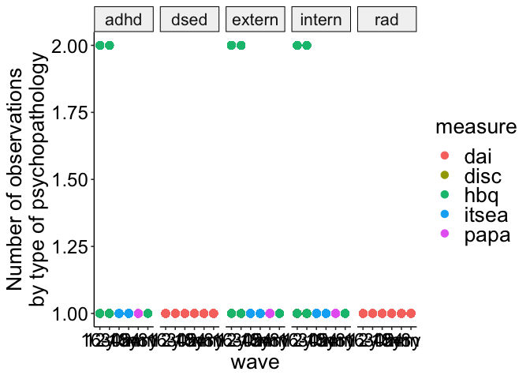<!-- -->

``` r
ggsave(
  paste0(home, "figures/wave_domain_psychopathology_n.png"),
  width = 12,
  height = 5
)
```

### Psychopathology: Number of observations per wave per measure

``` r
d %>% 
  filter(wave != "BL") %>% 
  filter(construct == "psychopathology") %>% 
  count(wave, measure, informant) %>% 
  arrange(wave, desc(n))
```

    ## # A tibble: 1,729 × 5
    ## # Groups:   ID [130]
    ##       ID wave  measure informant     n
    ##    <dbl> <chr> <chr>   <fct>     <int>
    ##  1     2 12y   disc    P             3
    ##  2     5 12y   disc    P             3
    ##  3     5 12y   hbq     P             3
    ##  4     5 12y   hbq     T             3
    ##  5     6 12y   disc    P             3
    ##  6     6 12y   hbq     P             3
    ##  7     8 12y   disc    P             3
    ##  8     8 12y   hbq     P             3
    ##  9     8 12y   hbq     T             3
    ## 10     9 12y   disc    P             3
    ## # … with 1,719 more rows

### IQ: Number of observations per wave per measure

``` r
d %>% 
  filter(wave != "BL") %>% 
  filter(construct == "IQ") %>% 
  count(wave, measure) %>% 
  arrange(wave, desc(n))
```

    ## # A tibble: 651 × 4
    ## # Groups:   ID [127]
    ##       ID wave  measure     n
    ##    <dbl> <chr> <chr>   <int>
    ##  1     2 12y   wisc        1
    ##  2     5 12y   wisc        1
    ##  3     6 12y   wisc        1
    ##  4     8 12y   wisc        1
    ##  5     9 12y   wisc        1
    ##  6    10 12y   wisc        1
    ##  7    11 12y   wisc        1
    ##  8    12 12y   wisc        1
    ##  9    13 12y   wisc        1
    ## 10    14 12y   wisc        1
    ## # … with 641 more rows

### EEG: Number of observations per wave per group per measure

``` r
d %>% 
  filter(wave != "BL") %>% 
  filter(construct == "EEG") %>% 
  count(group, wave, measure) %>% 
  arrange(group, wave, desc(n))
```

    ## # A tibble: 974 × 5
    ## # Groups:   ID [124]
    ##       ID group wave  measure     n
    ##    <dbl> <chr> <chr> <chr>   <int>
    ##  1     6 CAUG  12y   f3          1
    ##  2     6 CAUG  12y   f4          1
    ##  3     8 CAUG  12y   f3          1
    ##  4     8 CAUG  12y   f4          1
    ##  5     9 CAUG  12y   f3          1
    ##  6     9 CAUG  12y   f4          1
    ##  7    10 CAUG  12y   f3          1
    ##  8    10 CAUG  12y   f4          1
    ##  9    12 CAUG  12y   f3          1
    ## 10    12 CAUG  12y   f4          1
    ## # … with 964 more rows

``` r
d %>% 
  filter(wave != "BL") %>% 
  filter(construct == "EEG") %>% 
  count(group, wave, measure) %>% 
  arrange(wave, desc(n)) %>% 
  ggplot(aes(wave, n, color = measure)) +
  geom_point(size = 3) +
  labs(
    y = "Number of observations\nby type of EEG"
  ) +
  theme_beip +
  theme(
    legend.position = "right"
  ) +
  facet_grid(.~group)
```

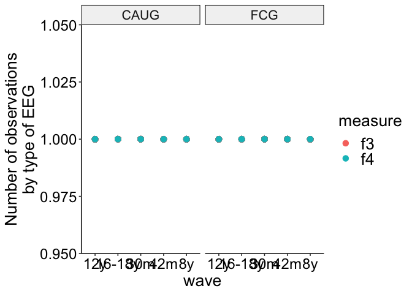<!-- -->

``` r
ggsave(
  paste0(home, "figures/wave_measure_EEG_n.png"),
  width = 9,
  height = 5
)
```

### Identify who discontinued and missed waves

``` r
## all 
missing_data_all <- 
  d %>% 
  filter(!is.na(value), wave != "BL") %>% 
  distinct(ID, wave) %>% 
  count(ID, wave) %>% 
  pivot_wider(
    names_from = wave,
    values_from = n,
    names_prefix = "w"
  )

missing_data_all %>% 
  group_by(ID) %>% 
  mutate(
    sum = sum(
      c(
        w30m,
        w42m,
        w54m,
        w8y,
        w12y,
        `w16-18y`
      ),
      na.rm = TRUE
    )
  ) %>% 
  ungroup() %>% 
  count(sum)
```

    ## # A tibble: 6 × 2
    ##     sum     n
    ##   <int> <int>
    ## 1     1     1
    ## 2     2     6
    ## 3     3    12
    ## 4     4     7
    ## 5     5    11
    ## 6     6    93

``` r
### FCG
missing_data_FCG <- 
  d %>% 
  filter(group == "FCG", !is.na(value)) %>% 
  distinct(ID, wave) %>% 
  count(ID, wave) %>% 
  pivot_wider(
    names_from = wave,
    values_from = n,
    names_prefix = "w"
  )

missing_data_FCG %>% 
  count(w30m, w42m, w54m, w8y, w12y, `w16-18y`)
```

    ## # A tibble: 65 × 8
    ## # Groups:   ID [65]
    ##       ID  w30m  w42m  w54m   w8y  w12y `w16-18y`     n
    ##    <dbl> <int> <int> <int> <int> <int>     <int> <int>
    ##  1     1     1     1     1    NA    NA        NA     1
    ##  2     2     1     1     1     1     1         1     1
    ##  3     3     1     1    NA    NA    NA        NA     1
    ##  4     5     1     1     1     1     1         1     1
    ##  5    11     1     1     1     1     1         1     1
    ##  6    16     1     1     1     1     1         1     1
    ##  7    18     1     1     1     1    NA        NA     1
    ##  8    19     1     1     1     1     1         1     1
    ##  9    21     1     1     1     1     1         1     1
    ## 10    23     1     1     1     1     1         1     1
    ## # … with 55 more rows

``` r
### CAUG
missing_data_CAUG <- 
  d %>% 
  filter(group == "CAUG", !is.na(value)) %>% 
  distinct(ID, wave) %>% 
  count(ID, wave) %>% 
  pivot_wider(
    names_from = wave,
    values_from = n,
    names_prefix = "w"
  )

missing_data_CAUG %>% 
  count(w30m, w42m, w54m, w8y, w12y, `w16-18y`)
```

    ## # A tibble: 65 × 8
    ## # Groups:   ID [65]
    ##       ID  w30m  w42m  w54m   w8y  w12y `w16-18y`     n
    ##    <dbl> <int> <int> <int> <int> <int>     <int> <int>
    ##  1     6     1     1     1     1     1         1     1
    ##  2     8     1     1     1     1     1         1     1
    ##  3     9     1     1     1     1     1         1     1
    ##  4    10     1     1     1     1     1         1     1
    ##  5    12     1     1     1     1     1         1     1
    ##  6    13     1     1     1     1     1         1     1
    ##  7    14     1     1     1     1     1         1     1
    ##  8    15     1     1     1     1     1         1     1
    ##  9    17     1     1     1     1     1         1     1
    ## 10    20     1     1     1    NA     1         1     1
    ## # … with 55 more rows

## Age

``` r
d %>% 
  group_by(wave, group) %>% 
  summarise_at(
    vars(mean_age_months_wave, mean_age_years_wave),
    funs(mean, min, max, sd), na.rm = TRUE
  )
```

    ## # A tibble: 12 × 10
    ## # Groups:   wave [6]
    ##    wave   group mean_age_months_wave_mean mean_age_years_wav… mean_age_months_w…
    ##    <chr>  <chr>                     <dbl>               <dbl>              <dbl>
    ##  1 12y    CAUG                      153.                12.8               134. 
    ##  2 12y    FCG                       153.                12.7               139. 
    ##  3 16-18y CAUG                      201.                16.7               192. 
    ##  4 16-18y FCG                       200.                16.7               190. 
    ##  5 30m    CAUG                       30.9                2.58               29.5
    ##  6 30m    FCG                        30.6                2.55               29.4
    ##  7 42m    CAUG                       42.5                3.54               41.2
    ##  8 42m    FCG                        42.3                3.53               41.8
    ##  9 54m    CAUG                       55.7                4.64               53.2
    ## 10 54m    FCG                        54.8                4.57               48.9
    ## 11 8y     CAUG                      104.                 8.69               97.0
    ## 12 8y     FCG                       102.                 8.53               82.2
    ## # … with 5 more variables: mean_age_years_wave_min <dbl>,
    ## #   mean_age_months_wave_max <dbl>, mean_age_years_wave_max <dbl>,
    ## #   mean_age_months_wave_sd <dbl>, mean_age_years_wave_sd <dbl>

``` r
d %>% 
  distinct(ID, mean_age_years_wave, wave_ordered) %>% 
  ggplot(aes(mean_age_years_wave, fill = wave_ordered)) +
  geom_histogram(alpha = 1/2) +
  scale_x_continuous(breaks = seq.int(0, 18, 2)) +
  scale_fill_manual(values=cbbPalette) +
  theme_beip +
  theme(
    legend.position = "right"
  ) +
  labs(x = "Age (years)", fill = "Wave")
```

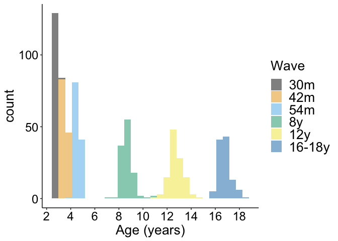<!-- -->

``` r
ggsave(
  paste0(home, "figures/age_years_wave_histogram.png"),
  width = 9, 
  height = 7
)

d %>% 
  group_by(wave, group) %>% 
  summarise_at(
    vars(mean_age_months_wave),
    funs(min, max), na.rm = TRUE
  )
```

    ## # A tibble: 12 × 4
    ## # Groups:   wave [6]
    ##    wave   group   min   max
    ##    <chr>  <chr> <dbl> <dbl>
    ##  1 12y    CAUG  134.  176. 
    ##  2 12y    FCG   139.  170. 
    ##  3 16-18y CAUG  192.  219. 
    ##  4 16-18y FCG   190.  219. 
    ##  5 30m    CAUG   29.5  36.0
    ##  6 30m    FCG    29.4  36.5
    ##  7 42m    CAUG   41.2  44.2
    ##  8 42m    FCG    41.8  43.1
    ##  9 54m    CAUG   53.2  61.1
    ## 10 54m    FCG    48.9  57.0
    ## 11 8y     CAUG   97.0 121. 
    ## 12 8y     FCG    82.2 127.

``` r
d %>% 
  group_by(wave, group) %>% 
  summarise_at(
    vars(mean_age_years_wave),
    funs(min, max), na.rm = TRUE
  )
```

    ## # A tibble: 12 × 4
    ## # Groups:   wave [6]
    ##    wave   group   min   max
    ##    <chr>  <chr> <dbl> <dbl>
    ##  1 12y    CAUG  11.1  14.7 
    ##  2 12y    FCG   11.5  14.2 
    ##  3 16-18y CAUG  16.0  18.2 
    ##  4 16-18y FCG   15.9  18.2 
    ##  5 30m    CAUG   2.46  3.00
    ##  6 30m    FCG    2.45  3.04
    ##  7 42m    CAUG   3.43  3.68
    ##  8 42m    FCG    3.48  3.60
    ##  9 54m    CAUG   4.44  5.09
    ## 10 54m    FCG    4.08  4.75
    ## 11 8y     CAUG   8.08 10.1 
    ## 12 8y     FCG    6.85 10.6

# Remove cases with missing data for “value” from dataset

``` r
d <-
  d %>% 
  filter(!is.na(value))

d %>% 
  count(group)
```

    ## # A tibble: 130 × 3
    ## # Groups:   ID [130]
    ##       ID group     n
    ##    <dbl> <chr> <int>
    ##  1     1 FCG      28
    ##  2     2 FCG      66
    ##  3     3 FCG      22
    ##  4     5 FCG      70
    ##  5     6 CAUG     63
    ##  6     8 CAUG     73
    ##  7     9 CAUG     53
    ##  8    10 CAUG     66
    ##  9    11 FCG      73
    ## 10    12 CAUG     68
    ## # … with 120 more rows

# Create subsetted data frames

## Subset IQ, EEG, and physical growth data

By standardizing within wave, within-person growth effects are no longer
detectable. In other words, we cannot say whether X tends to increase as
age increases. Instead, we can say that X is relatively higher or lower
when age is higher or lower.

``` r
d_cog_bio <-
  d %>% 
  filter(construct != "psychopathology") %>% 
  # standardized within wave (eliminates within-person growth effects) and measure (puts all data on same scale)
  group_by(wave, measure) %>% 
  mutate(
    value_z = scale(value)
  ) %>% 
  ungroup() %>% 
  filter() %>% 
  mutate_at(
    vars(domain, informant, group, wave, construct),
    as.factor
  ) %>%
  mutate(
    domain = droplevels(domain),
    informant = droplevels(informant),
    wave = droplevels(wave),
    construct = droplevels(construct)
  )
```

## Subset psychopathology data

``` r
d_psy <-
  d %>% 
  filter(construct == "psychopathology") %>% 
    # standardized within wave (eliminates within-person growth effects), domain, and measure (puts all data on same scale)
  group_by(wave, measure, domain) %>%  
  mutate(
    value_z = scale(value)
  ) %>% 
  ungroup() %>% 
  dplyr::select(-construct) %>% 
  mutate_at(
    vars(domain, informant, group, wave),
    as.factor
  ) %>%
  mutate(
    domain = droplevels(domain),
    informant = droplevels(informant),
    wave = droplevels(wave)
  )
```

## Subset FCG data

``` r
d_fcg_cog_bio <-
  d_cog_bio %>% 
  filter(group == "FCG") 

d_fcg_psy <-
  d_psy %>% 
  filter(group == "FCG")
```

### Stability of FC placement

IDs 82 and 98 reintegrated in bio families prior to FC placement;
therefore, not included in stability analyses.

``` r
d_fcg_cog_bio %>% 
  distinct(ID, stability_group) %>% 
  count(stability_group)
```

    ## # A tibble: 3 × 2
    ##   stability_group     n
    ##   <fct>           <int>
    ## 1 FCG, Stable        26
    ## 2 FCG, Disrupted     36
    ## 3 <NA>                2

# Visualize distributions

## IQ, physical size, EEG

### By group

``` r
d_cog_bio %>% 
  ggplot(aes(value_z, fill = group)) +
  geom_density(alpha = 1/2) +
  theme_beip +
  scale_fill_manual(values = cbbPalette) +
  labs(
    fill = NULL,
    title = "IQ, physical size, EEG",
    x = "Standardized score"
  )
```

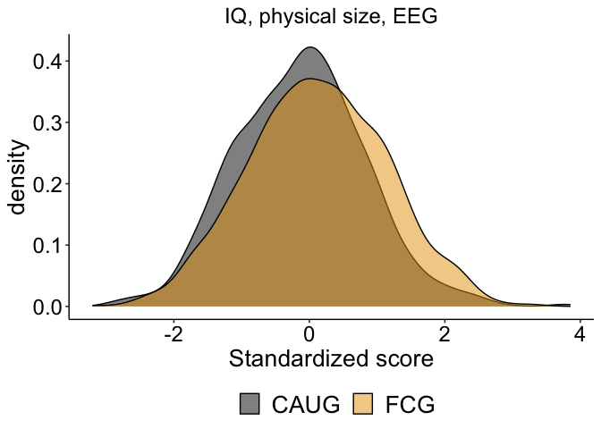<!-- -->

### By group by wave

``` r
d_cog_bio %>% 
  ggplot(aes(value_z, fill = group)) +
  geom_density(alpha = 1/2) +
  theme_beip +
  scale_fill_manual(values = cbbPalette) +
  labs(
    fill = NULL,
    title = "IQ, physical size, EEG",
    x = "Standardized score"
  ) +
  facet_grid(wave~.)
```

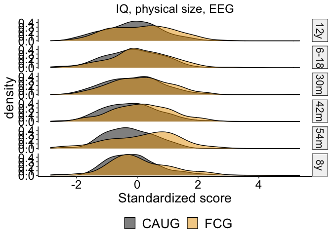<!-- --> \#\#\#
By group by wave by construct

``` r
d_cog_bio %>% 
  ggplot(aes(value_z, fill = group)) +
  geom_density(alpha = 1/2) +
  theme_beip +
  scale_fill_manual(values = cbbPalette) +
  labs(
    fill = NULL,
    title = "IQ, physical size, EEG",
    x = "Standardized score"
  ) +
  facet_grid(wave~construct, scales = "free")
```

<!-- -->

## Psychopathology

### By group

``` r
d_psy %>% 
  ggplot(aes(value_z, fill = group)) +
  geom_density(alpha = 1/2) +
  theme_beip +
  scale_fill_manual(values = cbbPalette) +
  labs(
    fill = NULL,
    title = "Psychopathology", 
    x = "Standardized outcome score"
  )
```

<!-- -->

``` r
ggsave(
  paste0(home, "figures/psy_raw_group_density.png"),
  width = 9, 
  height = 7
)

d_psy %>% 
  ggplot(aes(sqrt(value_z), fill = group)) +
  geom_density(alpha = 1/2) +
  theme_beip +
  scale_fill_manual(values = cbbPalette) +
  labs(
    fill = NULL,
    title = "Psychopathology", 
    x = "Standardized outcome score"
  )
```

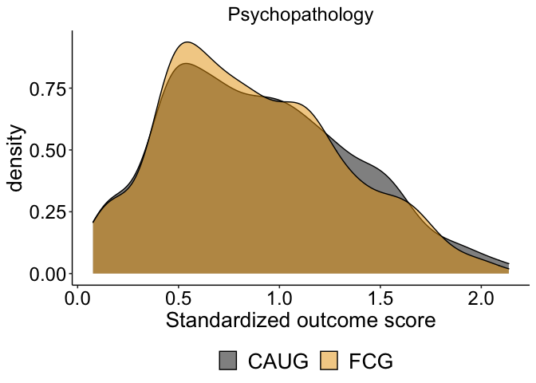<!-- -->

``` r
ggsave(
  paste0(home, "figures/psy_sqrt_group_density.png"),
  width = 9, 
  height = 7
)
```

### By group by wave by domain

``` r
d_psy %>% 
  ggplot(aes(value_z, fill = group)) +
  geom_density(alpha = 1/2) +
  theme_pubr() +
  theme_beip +
  scale_fill_manual(values = cbbPalette) +
  labs(x = "Standardized outcome score", fill = NULL) +
  facet_grid(wave~domain, scales = "free") 
```

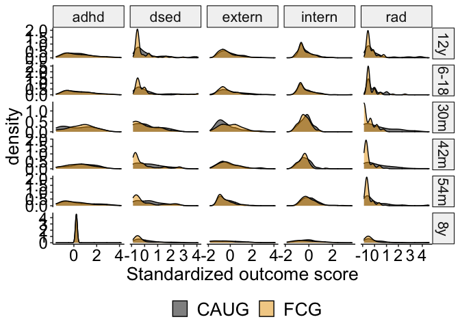<!-- -->

## Age of placement in foster care

``` r
d %>% 
  filter(group == "FCG") %>% 
  distinct(ID, FC_placement_age) %>% 
  filter(is.na(FC_placement_age))
```

    ## # A tibble: 2 × 2
    ## # Groups:   ID [2]
    ##      ID FC_placement_age
    ##   <dbl>            <dbl>
    ## 1    82               NA
    ## 2    98               NA

``` r
d %>% 
  filter(group == "FCG") %>% 
  distinct(ID, FC_placement_age) %>% 
  ggplot(aes(FC_placement_age)) +
  geom_histogram() +
  theme_beip +
  labs(
    fill = NULL,
    x = "Age of placement in foster care\n(months)"
  )
```

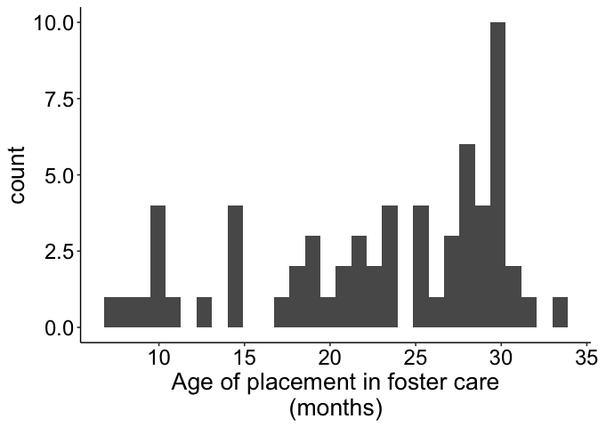<!-- -->

``` r
ggsave(
  paste0(home, "figures/age_placement_histogram.png"),
  width = 9, 
  height = 7
)
```

# Descriptives: Raw measurement values

## Means, SDs

``` r
d_cog_bio_summary_overall <- 
  d_cog_bio %>% 
  group_by(group, domain) %>% 
  summarise(
    n = n(),
    mean = mean(value, na.rm = TRUE),
    sd = sd(value, na.rm = TRUE),
    se = sd / sqrt(n),
    min = min(value, na.rm = TRUE),
    max = max(value, na.rm = TRUE)
  ) 
d_cog_bio_summary_overall
```

    ## # A tibble: 10 × 8
    ## # Groups:   group [2]
    ##    group domain     n    mean     sd      se    min    max
    ##    <fct> <fct>  <int>   <dbl>  <dbl>   <dbl>  <dbl>  <dbl>
    ##  1 CAUG  eeg      468   0.425  0.182 0.00839  0.135   1.30
    ##  2 CAUG  head     268  50.7    2.90  0.177   44.9    59.2 
    ##  3 CAUG  height   268 125.    31.1   1.90    81.4   184.  
    ##  4 CAUG  iq       313  69.8   14.9   0.844   12     118   
    ##  5 CAUG  weight   268  30.0   18.7   1.14     9.08  108.  
    ##  6 FCG   eeg      506   0.425  0.173 0.00769  0.151   1.41
    ##  7 FCG   head     278  51.0    3.01  0.181   44.2    59.5 
    ##  8 FCG   height   276 127.    31.2   1.88    81.5   189   
    ##  9 FCG   iq       337  77.1   19.0   1.03    11     143   
    ## 10 FCG   weight   276  32.6   20.7   1.24     8.72  102

``` r
d_psy_summary_overall <- 
  d_psy %>% 
  group_by(group, domain, measure) %>% 
  summarise(
    n = n(),
    mean = mean(value, na.rm = TRUE),
    sd = sd(value, na.rm = TRUE),
    se = sd / sqrt(n),
    min = min(value, na.rm = TRUE),
    max = max(value, na.rm = TRUE)
  )
d_psy_summary_overall
```

    ## # A tibble: 28 × 9
    ## # Groups:   group, domain [10]
    ##    group domain measure     n  mean    sd     se   min   max
    ##    <fct> <fct>  <chr>   <int> <dbl> <dbl>  <dbl> <dbl> <dbl>
    ##  1 CAUG  adhd   disc      106 4.27  4.61  0.448      0 17   
    ##  2 CAUG  adhd   hbq       226 0.692 0.398 0.0265     0  1.89
    ##  3 CAUG  adhd   itsea     113 0.918 0.563 0.0530     0  2   
    ##  4 CAUG  adhd   papa       52 5.79  5.49  0.761      0 18   
    ##  5 CAUG  dsed   dai       327 1.83  2.12  0.117      0 10   
    ##  6 CAUG  extern disc      106 3.74  3.92  0.381      0 17   
    ##  7 CAUG  extern hbq       211 0.486 0.429 0.0295     0  1.91
    ##  8 CAUG  extern itsea     113 0.559 0.430 0.0405     0  1.92
    ##  9 CAUG  extern papa       52 2.44  2.48  0.345      0 10   
    ## 10 CAUG  intern disc      106 1.17  2.34  0.227      0 18   
    ## # … with 18 more rows

``` r
d_psy %>% 
  filter(domain == "intern") %>% 
  group_by(wave_ordered, group) %>% 
  summarise_at(
    vars(value_z),
    funs(mean)
  )
```

    ## # A tibble: 12 × 3
    ## # Groups:   wave_ordered [6]
    ##    wave_ordered group value_z
    ##    <fct>        <fct>   <dbl>
    ##  1 30m          CAUG   0.111 
    ##  2 30m          FCG   -0.109 
    ##  3 42m          CAUG   0.117 
    ##  4 42m          FCG   -0.109 
    ##  5 54m          CAUG   0.0927
    ##  6 54m          FCG   -0.0817
    ##  7 8y           CAUG   0.0817
    ##  8 8y           FCG   -0.0692
    ##  9 12y          CAUG   0.0855
    ## 10 12y          FCG   -0.0822
    ## 11 16-18y       CAUG   0.117 
    ## 12 16-18y       FCG   -0.111

``` r
d_cog_bio_summary <- 
  d_cog_bio %>% 
  group_by(group, wave_ordered, domain) %>% 
  summarise(
    n = n(),
    mean = mean(value, na.rm = TRUE),
    sd = sd(value, na.rm = TRUE),
    se = sd / sqrt(n),
    min = min(value, na.rm = TRUE),
    max = max(value, na.rm = TRUE)
  ) 

d_psy_summary <- 
  d_psy %>% 
  group_by(group, wave_ordered, domain) %>% 
  summarise(
    n = n(),
    mean = mean(value, na.rm = TRUE),
    sd = sd(value, na.rm = TRUE),
    se = sd / sqrt(n),
    min = min(value, na.rm = TRUE),
    max = max(value, na.rm = TRUE)
  )
```

``` r
d_cog_bio %>% 
  filter(domain == "eeg") %>% 
  group_by(wave_ordered, group) %>% 
  summarise_at(
    vars(value, value_z),
    funs(mean, sd)
  )
```

    ## # A tibble: 10 × 6
    ## # Groups:   wave_ordered [5]
    ##    wave_ordered group value_mean value_z_mean value_sd value_z_sd
    ##    <fct>        <fct>      <dbl>        <dbl>    <dbl>      <dbl>
    ##  1 30m          CAUG       0.295      0.0433    0.0848      1.17 
    ##  2 30m          FCG        0.289     -0.0378    0.0600      0.824
    ##  3 42m          CAUG       0.300     -0.0349    0.0727      1.08 
    ##  4 42m          FCG        0.304      0.0292    0.0616      0.925
    ##  5 8y           CAUG       0.467      0.0196    0.236       1.05 
    ##  6 8y           FCG        0.459     -0.0178    0.213       0.951
    ##  7 12y          CAUG       0.520     -0.00680   0.148       1.04 
    ##  8 12y          FCG        0.522      0.00666   0.137       0.961
    ##  9 16-18y       CAUG       0.526     -0.196     0.144       1.11 
    ## 10 16-18y       FCG        0.579      0.205     0.108       0.827

## Means plots and boxplots

### IQ

``` r
d_cog_bio %>% 
  filter(domain == "iq") %>% 
  ggplot(aes(group, value, fill = group)) +
  geom_boxplot(alpha = 1/2) +
  scale_y_continuous(breaks = seq.int(40, 140, 20)) +
  scale_fill_manual(values = cbbPalette) +
  theme_beip +
  theme(
    legend.position = "none"
  ) +
  facet_wrap(.~wave_ordered) +
  labs(
    fill = NULL,
    x = NULL,
    y = "IQ score"
  )
```

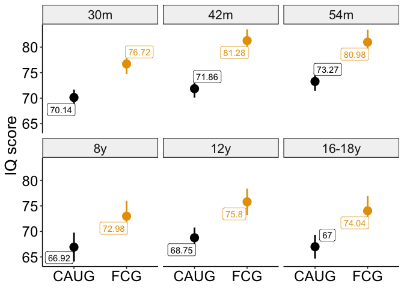<!-- -->

``` r
ggsave(
  paste0(home, "figures/iq_boxplots_raw.png"),
  dpi = 300,
  height = 7,
  width = 9
)
```

``` r
d_cog_bio_summary %>% 
  filter(domain == "iq") %>% 
  ggplot(aes(group, mean, color = group)) +
  geom_pointrange(aes(ymin = mean - se, ymax = mean + se), size = 1) +
  scale_y_continuous(breaks = seq.int(65, 85, 5)) +
  scale_color_manual(values = cbbPalette) +
  ggrepel::geom_label_repel(aes(label = round(mean, 2)), point.padding = 5) +
  theme_beip +
  theme(
    legend.position = "none"
  ) +
  facet_wrap(.~wave_ordered) +
  labs(
    fill = NULL,
    x = NULL,
    y = "IQ score"
  )
```

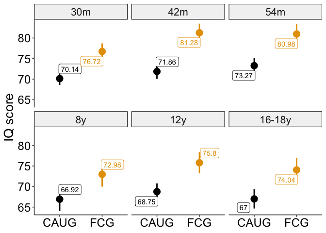<!-- -->

``` r
ggsave(
  paste0(home, "figures/iq_mean_points_raw.png"),
  dpi = 300,
  height = 6,
  width = 9
)
```

### EEG

``` r
d_cog_bio %>% 
  filter(domain == "eeg") %>% 
  ggplot(aes(group, value, fill = group)) +
  geom_boxplot(alpha = 1/2) +
  #scale_y_continuous(breaks = seq.int(40, 140, 20)) +
  scale_fill_manual(values = cbbPalette) +
  theme_beip +
  theme(
    legend.position = "none",
    axis.text.x = element_text(angle = 320, hjust = .1)
  ) +
  facet_grid(.~wave_ordered) +
  labs(
    fill = NULL,
    x = NULL,
    y = "EEG alphalpha-power"
  )
```

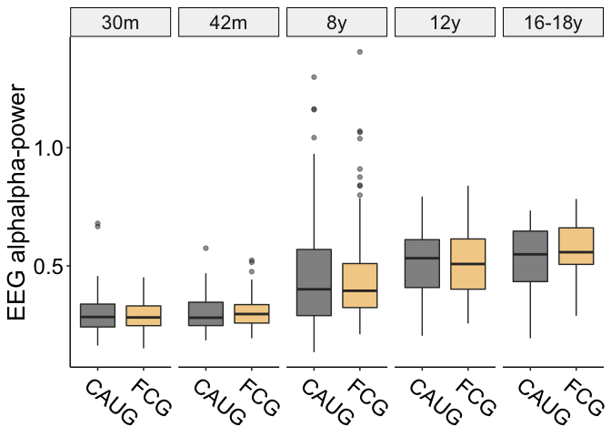<!-- -->

``` r
ggsave(
  paste0(home, "figures/eeg_boxplots_raw.png"),
  dpi = 300,
  height = 6,
  width = 9
)
```

``` r
d_cog_bio_summary %>% 
  filter(domain == "eeg") %>% 
  ggplot(aes(group, mean, color = group)) +
  geom_pointrange(aes(ymin = mean - se, ymax = mean + se), size = 1) +
  scale_color_manual(values = cbbPalette) +
  ggrepel::geom_label_repel(aes(label = round(mean, 2)), point.padding = 5) +
  theme_beip +
  theme(
    legend.position = "none"
  ) +
  facet_wrap(.~wave_ordered, scales = "free") +
  labs(
    fill = NULL,
    x = NULL,
    y = "EEG alpha power"
  )
```

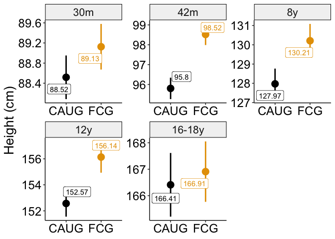<!-- -->

``` r
ggsave(
  paste0(home, "figures/eeg_mean_points_raw.png"),
  dpi = 300,
  height = 6,
  width = 9
)
```

### Height

``` r
d_cog_bio_summary %>% 
  filter(domain == "height") %>% 
  ggplot(aes(group, mean, color = group)) +
  geom_pointrange(aes(ymin = mean - se, ymax = mean + se), size = 1) +
  #scale_y_continuous(breaks = seq.int(65, 85, 5)) +
  scale_color_manual(values = cbbPalette) +
  ggrepel::geom_label_repel(aes(label = round(mean, 2)), point.padding = 10) +
  theme_beip +
  theme(
    legend.position = "none"
  ) +
  facet_wrap(.~wave_ordered, scales = "free") +
  labs(
    fill = NULL,
    x = NULL,
    y = "Height (cm)"
  )
```

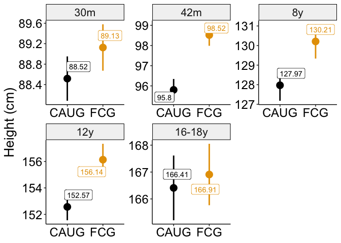<!-- -->

``` r
ggsave(
  paste0(home, "figures/iq_mean_points_raw.png"),
  dpi = 300,
  height = 6,
  width = 9
)
```

### Weight

``` r
d_cog_bio %>% 
  filter(domain == "weight") %>% 
  ggplot(aes(group, value, fill = group)) +
  geom_boxplot(alpha = 1/2) +
  scale_y_continuous(breaks = seq.int(10, 110, 20)) +
  scale_fill_manual(values = cbbPalette) +
  theme_beip +
  theme(
    legend.position = "none",
    axis.text.x = element_text(angle = 320, hjust = .1) 
  ) +
  facet_grid(.~wave_ordered, scales = "free") +
  labs(
    fill = NULL,
    x = NULL,
    y = "Weight (kg)"
  )
```

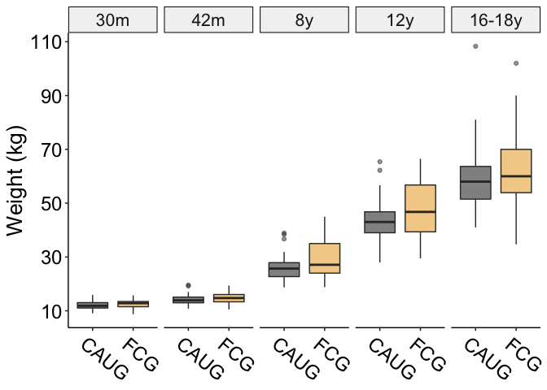<!-- -->

``` r
ggsave(
  paste0(home, "figures/weight_boxplots_raw.png"),
  dpi = 300,
  height = 6,
  width = 9
)
```

``` r
d_cog_bio_summary %>% 
  filter(domain == "weight") %>% 
  ggplot(aes(group, mean, color = group)) +
  geom_pointrange(aes(ymin = mean - se, ymax = mean + se), size = 1) +
  #scale_y_continuous(breaks = seq.int(65, 85, 5)) +
  scale_color_manual(values = cbbPalette) +
  ggrepel::geom_label_repel(aes(label = round(mean, 2)), point.padding = 10) +
  theme_beip +
  theme(
    legend.position = "none"
  ) +
  facet_wrap(.~wave_ordered, scales = "free") +
  labs(
    fill = NULL,
    x = NULL,
    y = "Weight (kg)"
  )
```

<!-- -->

``` r
ggsave(
  paste0(home, "figures/weight_mean_points_raw.png"),
  dpi = 300,
  height = 6,
  width = 9
)
```

### Head circumference

``` r
d_cog_bio %>% 
  filter(domain == "head") %>% 
  ggplot(aes(group, value, fill = group)) +
  geom_boxplot(alpha = 1/2) +
  scale_y_continuous(breaks = seq.int(40, 60, 2)) +
  scale_fill_manual(values = cbbPalette) +
  theme_beip +
  theme(
    legend.position = "none",
    axis.text.x = element_text(angle = 320, hjust = .1) 
  ) +
  facet_grid(.~wave_ordered, scales = "free") +
  labs(
    fill = NULL,
    x = NULL,
    y = "Head circumference (cm)"
  )
```

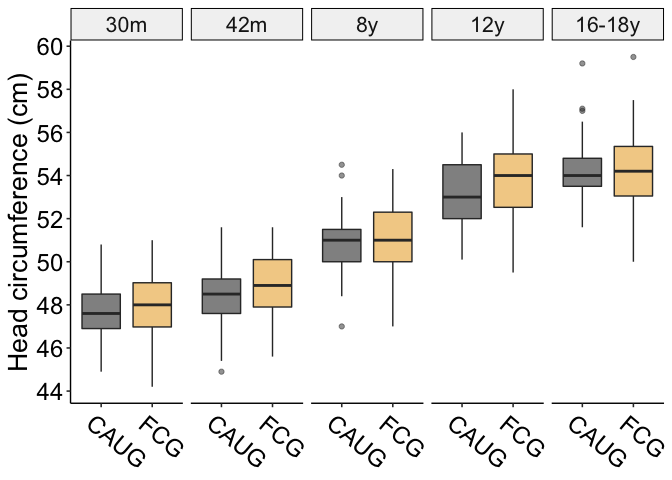<!-- -->

``` r
ggsave(
  paste0(home, "figures/head_boxplots_raw.png"),
  dpi = 300,
  height = 6,
  width = 9
)
```

``` r
d_cog_bio_summary %>% 
  filter(domain == "head") %>% 
  ggplot(aes(group, mean, color = group)) +
  geom_pointrange(aes(ymin = mean - se, ymax = mean + se), size = 1) +
  #scale_y_continuous(breaks = seq.int(65, 85, 5)) +
  scale_color_manual(values = cbbPalette) +
  ggrepel::geom_label_repel(aes(label = round(mean, 2)), point.padding = 10) +
  theme_beip +
  theme(
    legend.position = "none"
  ) +
  facet_wrap(.~wave_ordered, scales = "free") +
  labs(
    fill = NULL,
    x = NULL,
    y = "Head circumference (cm)"
  )
```

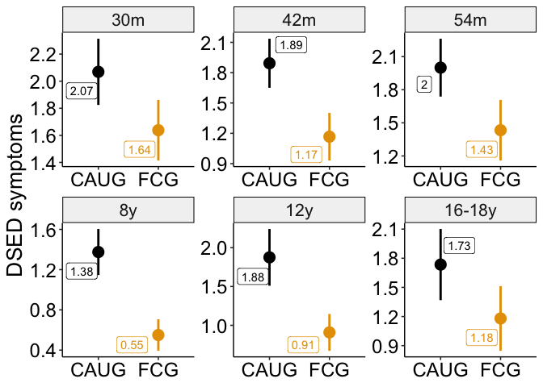<!-- -->

``` r
ggsave(
  paste0(home, "figures/head_mean_points_raw.png"),
  dpi = 300,
  height = 6,
  width = 9
)
```

### DAI

``` r
d_psy_summary %>% 
  filter(domain == "dsed") %>% 
  ggplot(aes(group, mean, color = group)) +
  geom_pointrange(aes(ymin = mean - se, ymax = mean + se), size = 1) +
  #scale_y_continuous(breaks = seq.int(65, 85, 5)) +
  scale_color_manual(values = cbbPalette) +
  ggrepel::geom_label_repel(aes(label = round(mean, 2)), point.padding = 10) +
  theme_beip +
  theme(
    legend.position = "none"
  ) +
  facet_wrap(.~wave_ordered, scales = "free") +
  labs(
    fill = NULL,
    x = NULL,
    y = "DSED symptoms"
  )
```

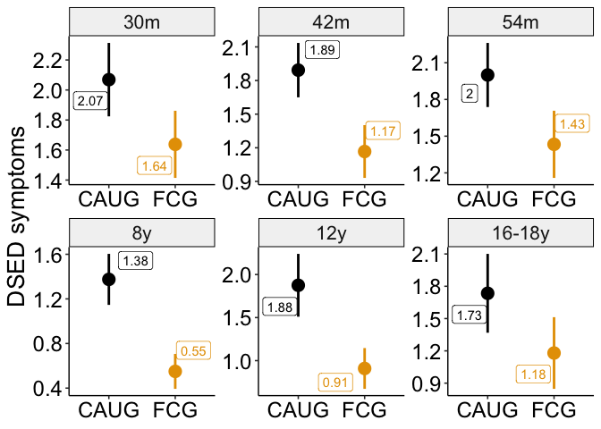<!-- -->

``` r
ggsave(
  paste0(home, "figures/DSED_mean_points_raw.png"),
  dpi = 300,
  height = 6,
  width = 9
)
```

### ADHD

``` r
d_psy_summary %>% 
  filter(domain == "adhd") %>% 
  ggplot(aes(group, mean, color = group)) +
  geom_pointrange(aes(ymin = mean - se, ymax = mean + se), size = 1) +
  #scale_y_continuous(breaks = seq.int(65, 85, 5)) +
  scale_color_manual(values = cbbPalette) +
  ggrepel::geom_label_repel(aes(label = round(mean, 2)), point.padding = 10) +
  theme_beip +
  theme(
    legend.position = "none"
  ) +
  facet_wrap(.~wave_ordered, scales = "free") +
  labs(
    fill = NULL,
    x = NULL,
    y = "ADHD symptoms"
  )
```

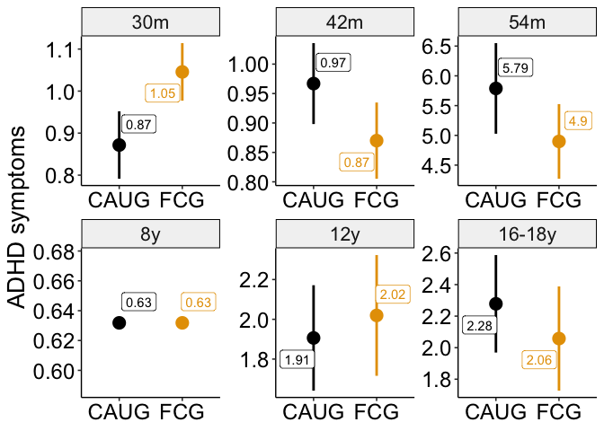<!-- -->

``` r
ggsave(
  paste0(home, "figures/ADHD_mean_points_raw.png"),
  dpi = 300,
  height = 6,
  width = 9
)
```

### Externalizing

``` r
d_psy_summary %>% 
  filter(domain == "extern") %>% 
  ggplot(aes(group, mean, color = group)) +
  geom_pointrange(aes(ymin = mean - se, ymax = mean + se), size = 1) +
  #scale_y_continuous(breaks = seq.int(65, 85, 5)) +
  scale_color_manual(values = cbbPalette) +
  ggrepel::geom_label_repel(aes(label = round(mean, 2)), point.padding = 10) +
  theme_beip +
  theme(
    legend.position = "none"
  ) +
  facet_wrap(.~wave_ordered, scales = "free") +
  labs(
    fill = NULL,
    x = NULL,
    y = "Externalizing symptoms"
  )
```

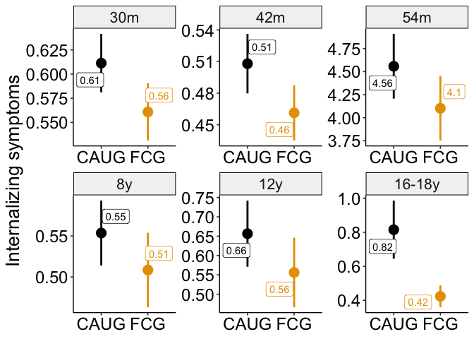<!-- -->

``` r
ggsave(
  paste0(home, "figures/extern_mean_points_raw.png"),
  dpi = 300,
  height = 6,
  width = 9
)
```

### Internalizing

``` r
d_psy_summary %>% 
  filter(domain == "intern") %>% 
  ggplot(aes(group, mean, color = group)) +
  geom_pointrange(aes(ymin = mean - se, ymax = mean + se), size = 1) +
  #scale_y_continuous(breaks = seq.int(65, 85, 5)) +
  scale_color_manual(values = cbbPalette) +
  ggrepel::geom_label_repel(aes(label = round(mean, 2)), point.padding = 10) +
  theme_beip +
  theme(
    legend.position = "none"
  ) +
  facet_wrap(.~wave_ordered, scales = "free") +
  labs(
    fill = NULL,
    x = NULL,
    y = "Internalizing symptoms"
  )
```

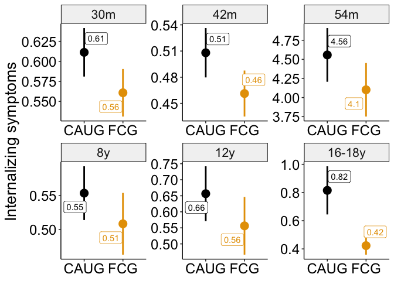<!-- -->

``` r
ggsave(
  paste0(home, "figures/intern_mean_points_raw.png"),
  dpi = 300,
  height = 6,
  width = 9
)
```

# Correlations

``` r
out_corr <- 
  d %>% 
  group_by(wave, measure) %>% 
  mutate(
    value_z = scale(value)
  ) %>% 
  group_by(ID, domain) %>% 
  summarise(value_z = mean(value_z, na.rm = TRUE)) %>% 
  dplyr::select(
    domain,
    value_z
  ) %>% 
  spread(domain, value_z) %>% 
  ungroup() %>% 
  dplyr::select(-ID) %>% 
  corrr::correlate() %>% 
  fashion() 

out_corr
```

    ##      term adhd dsed  eeg extern head height intern   iq  rad weight
    ## 1    adhd       .48 -.21    .76  .01    .03    .45 -.22  .34    .01
    ## 2    dsed  .48      -.05    .37 -.10   -.03    .14 -.45  .69   -.06
    ## 3     eeg -.21 -.05        -.20  .05   -.01   -.06  .18  .08   -.10
    ## 4  extern  .76  .37 -.20         .00   -.11    .40 -.20  .28   -.11
    ## 5    head  .01 -.10  .05    .00         .42   -.12  .27 -.07    .50
    ## 6  height  .03 -.03 -.01   -.11  .42          -.11  .36 -.17    .73
    ## 7  intern  .45  .14 -.06    .40 -.12   -.11        -.24  .22   -.16
    ## 8      iq -.22 -.45  .18   -.20  .27    .36   -.24      -.40    .28
    ## 9     rad  .34  .69  .08    .28 -.07   -.17    .22 -.40        -.16
    ## 10 weight  .01 -.06 -.10   -.11  .50    .73   -.16  .28 -.16

``` r
out_corr_plot <- 
  out_corr %>% 
  gather(variable, value, -term) %>% 
  mutate(
    term = as.character(term),
    value_chr = as.character(value),
    # value_chr = case_when(
    #   term == "child_num_wit_types" & variable == "child_num_dir_types" ~ ".38",
    #   variable == "child_num_wit_types" & term == "child_num_dir_types" ~ NA_character_,
    #   TRUE ~ value_chr
    # ),
   value_num = as.numeric(value_chr)
  ) %>% 
  na.omit() %>% 
  mutate(
    term = factor(
      term,
      levels = c(
        "iq", 
        "head", 
        "height", 
        "weight",
        "eeg",
        "dsed",
        "rad",
        "adhd",
        "extern",
        "intern"
      ),
      labels = c(
        "IQ",
        "Head circumference",
        "Height",
        "Weight",
        "EEG alphalpha-power",
        "DSED",
        "RAD",
        "ADHD",
        "Externalizing",
        "Internalizing"
      )
    ),
    variable = factor(
      variable,
      levels = c(
        "iq", 
        "head", 
        "height", 
        "weight",
        "eeg",
        "dsed",
        "rad",
        "adhd",
        "extern",
        "intern"
      ),
      labels = c(
        "IQ",
        "Head circumference",
        "Height",
        "Weight",
        "EEG alphalpha-power",
        "DSED",
        "RAD",
        "ADHD",
        "Externalizing",
        "Internalizing"
      )
    )
  )
```

``` r
out_corr_plot %>% 
  ggplot(aes(x = variable, y = fct_rev(term))) +
  geom_tile(aes(fill = abs(value_num))) +
  geom_text(
    aes(label = value_chr), 
    size = 4
  ) +
  scale_fill_gradient2(
    low = "blue",
    high = "red",
    mid = "white",
    na.value = "white",
    midpoint = 0,
    limit = c(-1, 1),
    space = "Lab",
    name = "Spearman correlation\ncoefficient"
  ) +
  theme_void() +
  theme(
    axis.text.x = element_text(
      angle = 45,
      hjust = 1,
      vjust = 1,
      size = 12
    ),
    axis.text.y = element_text(
      size = 12,
      hjust = .9
    )
  ) 
```

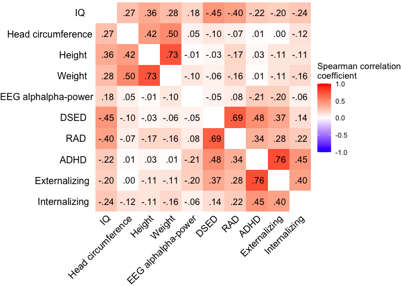<!-- -->

# Results

## Aim 1

### EEG, IQ, physical size

#### Main effect of group (with main effect covariates)

``` r
# CAUG is baseline
contrasts(d_cog_bio$group) = c(0, 1)

contrasts(d_cog_bio$male) = c(-.5, .5) 

contrasts(d_cog_bio$construct) <- cbind(
  "IQvEEG" = c(-1/3, 1 - (1/3), -1/3),
  "PHYSvEEG" = c(-1/3, -1/3, 1 - (1/3))
)
```

``` r
a1_cogbio <- lmer(
  value_z ~ 
    group +
    male +
    scale(age_years, scale = TRUE) +
    construct +
    (1|ID), 
  data = d_cog_bio
)

set.seed(123456)
a1_cogbio_parameters <-
  model_parameters(
  a1_cogbio,
  bootstrap = TRUE,
  df_method = "satterthwaite",
  iterations = 1000
)

a1_cogbio_parameters
```

    ## # Fixed Effects
    ## 
    ## Parameter         | Coefficient |        95% CI |     p
    ## -------------------------------------------------------
    ## (Intercept)       |       -0.09 | [-0.23, 0.03] | 0.162
    ## group1            |        0.21 | [ 0.02, 0.38] | 0.023
    ## male [1]          |        0.14 | [-0.05, 0.33] | 0.149
    ## age_years         |    4.16e-03 | [-0.03, 0.03] | 0.819
    ## constructIQvEEG   |       -0.02 | [-0.10, 0.07] | 0.707
    ## constructPHYSvEEG |    5.78e-03 | [-0.07, 0.08] | 0.864

### Psychopathology

#### Main effect of group (with main effect covariates)

``` r
# contrast code to center all variables except group; allows interpretation of coefficient as averages across levels of other factors
contrasts(d_psy$group) = c(0, 1) # CAUG is baseline

contrasts(d_psy$male) = c(-.5, .5) 

contrasts(d_psy$domain) = cbind(
  DESDvADHD = c(-1/5, 1 - (1/5), -1/5, -1/5, -1/5),
  EXTvADHD = c(-1/5, -1/5, 1 - (1/5), -1/5, -1/5),
  INTvADHD = c(-1/5, -1/5, -1/5, 1 - (1/5), -1/5),
  RADvADHD = c(-1/5, -1/5, -1/5, -1/5, 1 - (1/5))
)

contrasts(d_psy$informant) = c(-.5, .5)
```

``` r
a1_psy <- lmer(
  value_z ~ 
    group +
    male +
    scale(age_years, scale = TRUE) +
    domain +
    informant +
    (1|ID), 
  data = d_psy
)

set.seed(123456)
a1_psy_parameters <-
  model_parameters(
    a1_psy,
    bootstrap = TRUE,
    df_method = "satterthwaite",
    iterations = 1000
  )

a1_psy_parameters
```

    ## # Fixed Effects
    ## 
    ## Parameter       | Coefficient |         95% CI |     p
    ## ------------------------------------------------------
    ## (Intercept)     |        0.15 | [ 0.03,  0.25] | 0.009
    ## group1          |       -0.24 | [-0.40, -0.08] | 0.004
    ## male [1]        |        0.22 | [ 0.06,  0.39] | 0.011
    ## age_years       |       -0.02 | [-0.05,  0.01] | 0.153
    ## domainDESDvADHD |    2.49e-03 | [-0.09,  0.10] | 0.977
    ## domainEXTvADHD  |   -5.03e-03 | [-0.08,  0.08] | 0.938
    ## domainINTvADHD  |    5.75e-03 | [-0.08,  0.09] | 0.913
    ## domainRADvADHD  |        0.01 | [-0.08,  0.10] | 0.838
    ## informant1      |        0.03 | [-0.05,  0.11] | 0.424

## Aim 2

### EEG, IQ, physical size

#### Two-way moderations

``` r
a2_cogbio <- lmer(
  value_z ~ 
    group * construct +
    group * male +
    group * scale(age_years, scale = FALSE) +
    (1 |ID), 
  data = d_cog_bio
)

anova(a2_cogbio)
```

    ## Type III Analysis of Variance Table with Satterthwaite's method
    ##                                        Sum Sq Mean Sq NumDF  DenDF F value
    ## group                                  3.8958  3.8958     1  116.4  5.2354
    ## construct                              0.2804  0.1402     2 3121.2  0.1884
    ## male                                   1.4715  1.4715     1  112.8  1.9775
    ## scale(age_years, scale = FALSE)        0.0370  0.0370     1 3192.7  0.0497
    ## group:construct                       13.5774  6.7887     2 3121.2  9.1231
    ## group:male                             0.0023  0.0023     1  112.8  0.0030
    ## group:scale(age_years, scale = FALSE)  0.3069  0.3069     1 3192.7  0.4125
    ##                                          Pr(>F)    
    ## group                                 0.0239376 *  
    ## construct                             0.8282662    
    ## male                                  0.1624033    
    ## scale(age_years, scale = FALSE)       0.8235433    
    ## group:construct                       0.0001121 ***
    ## group:male                            0.9561824    
    ## group:scale(age_years, scale = FALSE) 0.5207565    
    ## ---
    ## Signif. codes:  0 '***' 0.001 '**' 0.01 '*' 0.05 '.' 0.1 ' ' 1

##### Simple effects of outcome domain (IQ vs. EEG vs. physical size )

###### EEG

``` r
# EEG = baseline
contrasts(d_cog_bio$construct) <- cbind(
  "IQvEEG" = c(0, 1, 0),
  "PHYSvEEG" = c(0, 0, 1)
)

# CAUG = baseline
a2_cogbio_EEG <- lmer(
  value_z ~ 
    group * construct +
    male +
    scale(age_years, scale = TRUE) +
    (1 |ID), 
  data = d_cog_bio
)

set.seed(123456)
a2_cogbio_EEG_parameters <-
  model_parameters(
    a2_cogbio_EEG,
    bootstrap = TRUE,
    df_method = "satterthwaite",
    iterations = 1000
  )
a2_cogbio_EEG_parameters
```

    ## # Fixed Effects
    ## 
    ## Parameter                  | Coefficient |         95% CI |      p
    ## ------------------------------------------------------------------
    ## (Intercept)                |    5.83e-03 | [-0.14,  0.15] | 0.952 
    ## group1                     |        0.03 | [-0.20,  0.21] | 0.849 
    ## constructIQvEEG            |       -0.20 | [-0.32, -0.08] | 0.002 
    ## constructPHYSvEEG          |       -0.11 | [-0.21, -0.02] | 0.031 
    ## male [1]                   |        0.13 | [-0.05,  0.33] | 0.156 
    ## age_years                  |    3.23e-03 | [-0.03,  0.03] | 0.855 
    ## group1 * constructIQvEEG   |        0.36 | [ 0.19,  0.53] | < .001
    ## group1 * constructPHYSvEEG |        0.23 | [ 0.09,  0.35] | 0.003

###### IQ

``` r
# IQ = baseline
contrasts(d_cog_bio$construct) <- cbind(
  "EEGvIQ" = c(1, 0, 0),
  "PHYSvIQ" = c(0, 0, 1)
)

a2_cogbio_IQ <- lmer(
  value_z ~ 
    group * construct +
    male +
    scale(age_years, scale = TRUE) +
    (1 |ID), 
  data = d_cog_bio
)

set.seed(123456)
a2_cogbio_IQ_parameters <-
  model_parameters(
    a2_cogbio_IQ,
    bootstrap = TRUE,
    df_method = "satterthwaite",
    iterations = 1000
  )

a2_cogbio_IQ_parameters
```

    ## # Fixed Effects
    ## 
    ## Parameter                 | Coefficient |         95% CI |      p
    ## -----------------------------------------------------------------
    ## (Intercept)               |       -0.19 | [-0.35, -0.05] | 0.011 
    ## group1                    |        0.38 | [ 0.15,  0.59] | 0.002 
    ## constructEEGvIQ           |        0.20 | [ 0.08,  0.32] | 0.002 
    ## constructPHYSvIQ          |        0.09 | [-0.02,  0.19] | 0.107 
    ## male [1]                  |        0.13 | [-0.05,  0.33] | 0.156 
    ## age_years                 |    3.23e-03 | [-0.03,  0.03] | 0.855 
    ## group1 * constructEEGvIQ  |       -0.36 | [-0.53, -0.19] | < .001
    ## group1 * constructPHYSvIQ |       -0.13 | [-0.28,  0.02] | 0.092

###### Physical size

``` r
# PHYS = baseline
contrasts(d_cog_bio$construct) <- cbind(
  "EEGvPHYS" = c(1, 0, 0),
  "IQvPHYS" = c(0, 1, 0)
)

a2_cogbio_PHY <- lmer(
  value_z ~ 
    group * construct +
    male +
    scale(age_years, scale = TRUE) +
    (1 |ID),  
  data = d_cog_bio
)

set.seed(123456)
a2_cogbio_PHY_parameters <- 
  model_parameters(
    a2_cogbio_PHY,
    bootstrap = TRUE,
    df_method = "satterthwaite",
    iterations = 1000
  )

a2_cogbio_PHY_parameters
```

    ## # Fixed Effects
    ## 
    ## Parameter                  | Coefficient |         95% CI |     p
    ## -----------------------------------------------------------------
    ## (Intercept)                |       -0.11 | [-0.25,  0.03] | 0.136
    ## group1                     |        0.25 | [ 0.07,  0.43] | 0.012
    ## constructEEGvPHYS          |        0.11 | [ 0.02,  0.21] | 0.031
    ## constructIQvPHYS           |       -0.09 | [-0.19,  0.02] | 0.107
    ## male [1]                   |        0.13 | [-0.05,  0.33] | 0.156
    ## age_years                  |    3.23e-03 | [-0.03,  0.03] | 0.855
    ## group1 * constructEEGvPHYS |       -0.23 | [-0.35, -0.09] | 0.003
    ## group1 * constructIQvPHYS  |        0.13 | [-0.02,  0.28] | 0.092

#### Three-way moderations

``` r
a2_cogbio_domainXage <- lmer(
  value_z ~ 
    group * construct * scale(age_years, scale = FALSE) +
    male +
    (1 |ID), 
  data = d_cog_bio
)

anova(a2_cogbio_domainXage)
```

    ## Type III Analysis of Variance Table with Satterthwaite's method
    ##                                                  Sum Sq Mean Sq NumDF  DenDF
    ## group                                            3.8200  3.8200     1  117.7
    ## construct                                        0.2981  0.1490     2 3117.7
    ## scale(age_years, scale = FALSE)                  0.0181  0.0181     1 3180.5
    ## male                                             1.4936  1.4936     1  113.9
    ## group:construct                                 13.8202  6.9101     2 3117.6
    ## group:scale(age_years, scale = FALSE)            0.1541  0.1541     1 3180.5
    ## construct:scale(age_years, scale = FALSE)        0.0423  0.0211     2 3114.9
    ## group:construct:scale(age_years, scale = FALSE)  4.1646  2.0823     2 3114.9
    ##                                                 F value     Pr(>F)    
    ## group                                            5.1355    0.02527 *  
    ## construct                                        0.2004    0.81845    
    ## scale(age_years, scale = FALSE)                  0.0243    0.87605    
    ## male                                             2.0079    0.15921    
    ## group:construct                                  9.2897 0.00009496 ***
    ## group:scale(age_years, scale = FALSE)            0.2071    0.64905    
    ## construct:scale(age_years, scale = FALSE)        0.0284    0.97199    
    ## group:construct:scale(age_years, scale = FALSE)  2.7994    0.06100 .  
    ## ---
    ## Signif. codes:  0 '***' 0.001 '**' 0.01 '*' 0.05 '.' 0.1 ' ' 1

``` r
a2_cogbio_domainXsex<- lmer(
  value_z ~ 
    group * construct * male +
    scale(age_years, scale = TRUE) +
    (1 |ID), 
  data = d_cog_bio
)

anova(a2_cogbio_domainXsex)
```

    ## Type III Analysis of Variance Table with Satterthwaite's method
    ##                                Sum Sq Mean Sq NumDF  DenDF F value
    ## group                           3.801  3.8011     1  116.5  5.1997
    ## construct                       0.243  0.1215     2 3118.7  0.1662
    ## male                            0.290  0.2905     1  116.5  0.3973
    ## scale(age_years, scale = TRUE)  0.028  0.0281     1 3188.5  0.0385
    ## group:construct                15.002  7.5012     2 3118.9 10.2612
    ## group:male                      0.098  0.0981     1  116.5  0.1343
    ## construct:male                 33.098 16.5492     2 3118.9 22.6385
    ## group:construct:male           10.256  5.1280     2 3118.9  7.0149
    ##                                         Pr(>F)    
    ## group                                0.0244095 *  
    ## construct                            0.8469262    
    ## male                                 0.5297078    
    ## scale(age_years, scale = TRUE)       0.8444901    
    ## group:construct                0.0000361576184 ***
    ## group:male                           0.7147175    
    ## construct:male                 0.0000000001733 ***
    ## group:construct:male                 0.0009127 ***
    ## ---
    ## Signif. codes:  0 '***' 0.001 '**' 0.01 '*' 0.05 '.' 0.1 ' ' 1

##### Simple effects of sex and outcome domain

###### Male, EEG

``` r
# EEG = baseline
contrasts(d_cog_bio$construct) <- cbind(
  "IQvEEG" = c(0, 1, 0),
  "PHYSvEEG" = c(0, 0, 1)
)

# Male = baseline
contrasts(d_cog_bio$male) = c(1, 0)

a2_cogbio_EEG_male <- lmer(
  value_z ~ 
    group * construct * male +
    scale(age_years, scale = TRUE) +
    (1 |ID), 
  data = d_cog_bio
)

set.seed(123456)
a2_cogbio_EEG_male_parameters <-
  model_parameters(
    a2_cogbio_EEG_male,
    bootstrap = TRUE,
    df_method = "satterthwaite",
    iterations = 1000
  )

a2_cogbio_EEG_male_parameters
```

    ## # Fixed Effects
    ## 
    ## Parameter                               | Coefficient |         95% CI |      p
    ## -------------------------------------------------------------------------------
    ## (Intercept)                             |       -0.04 | [-0.27,  0.17] | 0.715 
    ## group1                                  |        0.09 | [-0.19,  0.40] | 0.537 
    ## constructIQvEEG                         |       -0.10 | [-0.26,  0.07] | 0.255 
    ## constructPHYSvEEG                       |        0.08 | [-0.05,  0.21] | 0.243 
    ## male [1]                                |        0.12 | [-0.19,  0.45] | 0.431 
    ## age_years                               |    2.99e-03 | [-0.03,  0.03] | 0.864 
    ## group1 * constructIQvEEG                |        0.08 | [-0.16,  0.29] | 0.557 
    ## group1 * constructPHYSvEEG              |        0.20 | [ 0.01,  0.39] | 0.035 
    ## group1 * male [1]                       |       -0.16 | [-0.58,  0.26] | 0.447 
    ## constructIQvEEG * male [1]              |       -0.22 | [-0.48,  0.02] | 0.074 
    ## constructPHYSvEEG * male [1]            |       -0.41 | [-0.60, -0.22] | < .001
    ## (group1 * constructIQvEEG) * male [1]   |        0.60 | [ 0.28,  0.94] | < .001
    ## (group1 * constructPHYSvEEG) * male [1] |        0.07 | [-0.20,  0.35] | 0.613

###### Female, EEG

``` r
# EEG = baseline
contrasts(d_cog_bio$construct) <- cbind(
  "IQvEEG" = c(0, 1, 0),
  "PHYSvEEG" = c(0, 0, 1)
)

# Female = baseline
contrasts(d_cog_bio$male) = c(0, 1)

a2_cogbio_EEG_female <- lmer(
  value_z ~ 
    group * construct * male +
    scale(age_years, scale = TRUE) +
    (1 |ID), 
  data = d_cog_bio
)

set.seed(123456)
a2_cogbio_EEG_female_parameters <-
  model_parameters(
    a2_cogbio_EEG_female,
    bootstrap = TRUE,
    df_method = "satterthwaite",
    iterations = 1000
  )

a2_cogbio_EEG_female_parameters
```

    ## # Fixed Effects
    ## 
    ## Parameter                               | Coefficient |         95% CI |      p
    ## -------------------------------------------------------------------------------
    ## (Intercept)                             |        0.08 | [-0.14,  0.28] | 0.489 
    ## group1                                  |       -0.07 | [-0.38,  0.24] | 0.647 
    ## constructIQvEEG                         |       -0.32 | [-0.51, -0.15] | 0.002 
    ## constructPHYSvEEG                       |       -0.33 | [-0.46, -0.18] | < .001
    ## male [1]                                |       -0.12 | [-0.45,  0.19] | 0.431 
    ## age_years                               |    2.99e-03 | [-0.03,  0.03] | 0.864 
    ## group1 * constructIQvEEG                |        0.67 | [ 0.45,  0.92] | < .001
    ## group1 * constructPHYSvEEG              |        0.28 | [ 0.07,  0.45] | 0.009 
    ## group1 * male [1]                       |        0.16 | [-0.26,  0.58] | 0.447 
    ## constructIQvEEG * male [1]              |        0.22 | [-0.02,  0.48] | 0.074 
    ## constructPHYSvEEG * male [1]            |        0.41 | [ 0.22,  0.60] | < .001
    ## (group1 * constructIQvEEG) * male [1]   |       -0.60 | [-0.94, -0.28] | < .001
    ## (group1 * constructPHYSvEEG) * male [1] |       -0.07 | [-0.35,  0.20] | 0.613

###### Male, IQ

``` r
# IQ = baseline
contrasts(d_cog_bio$construct) <- cbind(
  "EEGvIQ" = c(1, 0, 0),
  "PHYSvIQ" = c(0, 0, 1)
)

# Male = baseline
contrasts(d_cog_bio$male) = c(1, 0)

a2_cogbio_IQ_male <- lmer(
  value_z ~ 
    group * construct * male +
    scale(age_years, scale = TRUE) +
    (1 |ID), 
  data = d_cog_bio
)

set.seed(123456)
a2_cogbio_IQ_male_parameters <-
  model_parameters(
    a2_cogbio_IQ_male,
    bootstrap = TRUE,
    df_method = "satterthwaite",
    iterations = 1000
  )

a2_cogbio_IQ_male_parameters
```

    ## # Fixed Effects
    ## 
    ## Parameter                              | Coefficient |         95% CI |      p
    ## ------------------------------------------------------------------------------
    ## (Intercept)                            |       -0.14 | [-0.36,  0.07] | 0.223 
    ## group1                                 |        0.17 | [-0.12,  0.48] | 0.310 
    ## constructEEGvIQ                        |        0.10 | [-0.07,  0.26] | 0.255 
    ## constructPHYSvIQ                       |        0.18 | [ 0.03,  0.33] | 0.020 
    ## male [1]                               |       -0.10 | [-0.43,  0.22] | 0.525 
    ## age_years                              |    2.99e-03 | [-0.03,  0.03] | 0.864 
    ## group1 * constructEEGvIQ               |       -0.08 | [-0.29,  0.16] | 0.557 
    ## group1 * constructPHYSvIQ              |        0.13 | [-0.08,  0.34] | 0.246 
    ## group1 * male [1]                      |        0.45 | [-0.02,  0.91] | 0.062 
    ## constructEEGvIQ * male [1]             |        0.22 | [-0.02,  0.48] | 0.074 
    ## constructPHYSvIQ * male [1]            |       -0.18 | [-0.40,  0.04] | 0.107 
    ## (group1 * constructEEGvIQ) * male [1]  |       -0.60 | [-0.94, -0.28] | < .001
    ## (group1 * constructPHYSvIQ) * male [1] |       -0.53 | [-0.82, -0.21] | 0.002

###### Female, IQ

``` r
# IQ = baseline
contrasts(d_cog_bio$construct) <- cbind(
  "EEGvIQ" = c(1, 0, 0),
  "PHYSvIQ" = c(0, 0, 1)
)

# Female = baseline
contrasts(d_cog_bio$male) = c(0, 1)

a2_cogbio_IQ_female <- lmer(
  value_z ~ 
    group * construct * male +
    scale(age_years, scale = TRUE) +
    (1 |ID), 
  data = d_cog_bio
)

set.seed(123456)
a2_cogbio_IQ_female_parameters <-
  model_parameters(
    a2_cogbio_IQ_female,
    bootstrap = TRUE,
    df_method = "satterthwaite",
    iterations = 1000
  )

a2_cogbio_IQ_female_parameters
```

    ## # Fixed Effects
    ## 
    ## Parameter                              | Coefficient |         95% CI |      p
    ## ------------------------------------------------------------------------------
    ## (Intercept)                            |       -0.24 | [-0.46, -0.03] | 0.023 
    ## group1                                 |        0.60 | [ 0.28,  0.91] | < .001
    ## constructEEGvIQ                        |        0.32 | [ 0.15,  0.51] | 0.002 
    ## constructPHYSvIQ                       |   -1.79e-03 | [-0.17,  0.15] | 0.942 
    ## male [1]                               |        0.10 | [-0.22,  0.43] | 0.525 
    ## age_years                              |    2.99e-03 | [-0.03,  0.03] | 0.864 
    ## group1 * constructEEGvIQ               |       -0.67 | [-0.92, -0.45] | < .001
    ## group1 * constructPHYSvIQ              |       -0.40 | [-0.63, -0.19] | < .001
    ## group1 * male [1]                      |       -0.45 | [-0.91,  0.02] | 0.062 
    ## constructEEGvIQ * male [1]             |       -0.22 | [-0.48,  0.02] | 0.074 
    ## constructPHYSvIQ * male [1]            |        0.18 | [-0.04,  0.40] | 0.107 
    ## (group1 * constructEEGvIQ) * male [1]  |        0.60 | [ 0.28,  0.94] | < .001
    ## (group1 * constructPHYSvIQ) * male [1] |        0.53 | [ 0.21,  0.82] | 0.002

###### Male, physical size

``` r
# PHYS = baseline
contrasts(d_cog_bio$construct) <- cbind(
  "EEGvPHYS" = c(1, 0, 0),
  "IQvPHYS" = c(0, 1, 0)
)

# Male = baseline
contrasts(d_cog_bio$male) = c(1, 0)

a2_cogbio_PHYS_male <- lmer(
  value_z ~ 
    group * construct * male +
    scale(age_years, scale = TRUE) +
    (1 |ID), 
  data = d_cog_bio
)

set.seed(123456)
a2_cogbio_PHYS_male_parameters <-
  model_parameters(
    a2_cogbio_PHYS_male,
    bootstrap = TRUE,
    df_method = "satterthwaite",
    iterations = 1000
  )

a2_cogbio_PHYS_male_parameters
```

    ## # Fixed Effects
    ## 
    ## Parameter                               | Coefficient |         95% CI |      p
    ## -------------------------------------------------------------------------------
    ## (Intercept)                             |        0.04 | [-0.16,  0.24] | 0.719 
    ## group1                                  |        0.29 | [ 0.02,  0.57] | 0.035 
    ## constructEEGvPHYS                       |       -0.08 | [-0.21,  0.05] | 0.243 
    ## constructIQvPHYS                        |       -0.18 | [-0.33, -0.03] | 0.020 
    ## male [1]                                |       -0.29 | [-0.59,  0.00] | 0.056 
    ## age_years                               |    2.99e-03 | [-0.03,  0.03] | 0.864 
    ## group1 * constructEEGvPHYS              |       -0.20 | [-0.39, -0.01] | 0.035 
    ## group1 * constructIQvPHYS               |       -0.13 | [-0.34,  0.08] | 0.246 
    ## group1 * male [1]                       |       -0.09 | [-0.50,  0.31] | 0.625 
    ## constructEEGvPHYS * male [1]            |        0.41 | [ 0.22,  0.60] | < .001
    ## constructIQvPHYS * male [1]             |        0.18 | [-0.04,  0.40] | 0.107 
    ## (group1 * constructEEGvPHYS) * male [1] |       -0.07 | [-0.35,  0.20] | 0.613 
    ## (group1 * constructIQvPHYS) * male [1]  |        0.53 | [ 0.21,  0.82] | 0.002

###### Female, physical size

``` r
# PHYS = baseline
contrasts(d_cog_bio$construct) <- cbind(
  "EEGvPHYS" = c(1, 0, 0),
  "IQvPHYS" = c(0, 1, 0)
)

# Female = baseline
contrasts(d_cog_bio$male) = c(0, 1)

a2_cogbio_PHYS_female <- lmer(
  value_z ~ 
    group * construct * male +
    scale(age_years, scale = TRUE) +
    (1 |ID), 
  data = d_cog_bio
)

set.seed(123456)
a2_cogbio_PHYS_female_parameters <-
  model_parameters(
    a2_cogbio_PHYS_female,
    bootstrap = TRUE,
    df_method = "satterthwaite",
    iterations = 1000
  )

a2_cogbio_PHYS_female_parameters
```

    ## # Fixed Effects
    ## 
    ## Parameter                               | Coefficient |         95% CI |      p
    ## -------------------------------------------------------------------------------
    ## (Intercept)                             |       -0.25 | [-0.45, -0.06] | 0.011 
    ## group1                                  |        0.20 | [-0.08,  0.48] | 0.171 
    ## constructEEGvPHYS                       |        0.33 | [ 0.18,  0.46] | < .001
    ## constructIQvPHYS                        |    1.79e-03 | [-0.15,  0.17] | 0.942 
    ## male [1]                                |        0.29 | [ 0.00,  0.59] | 0.056 
    ## age_years                               |    2.99e-03 | [-0.03,  0.03] | 0.864 
    ## group1 * constructEEGvPHYS              |       -0.28 | [-0.45, -0.07] | 0.009 
    ## group1 * constructIQvPHYS               |        0.40 | [ 0.19,  0.63] | < .001
    ## group1 * male [1]                       |        0.09 | [-0.31,  0.50] | 0.625 
    ## constructEEGvPHYS * male [1]            |       -0.41 | [-0.60, -0.22] | < .001
    ## constructIQvPHYS * male [1]             |       -0.18 | [-0.40,  0.04] | 0.107 
    ## (group1 * constructEEGvPHYS) * male [1] |        0.07 | [-0.20,  0.35] | 0.613 
    ## (group1 * constructIQvPHYS) * male [1]  |       -0.53 | [-0.82, -0.21] | 0.002

### Psychopathology

#### Two-way moderations

``` r
a2_psy_type <- lmer(
  value_z ~ 
    group * domain +
    group * male +
    group * scale(age_years, scale = TRUE) +
    informant +
    (1 |ID), 
  data = d_psy
)

anova(a2_psy_type)
```

    ## Type III Analysis of Variance Table with Satterthwaite's method
    ##                                      Sum Sq Mean Sq NumDF  DenDF F value
    ## group                                 8.498  8.4982     1  124.3 10.8528
    ## domain                                0.127  0.0317     4 4062.2  0.0404
    ## male                                  5.850  5.8497     1  123.4  7.4705
    ## scale(age_years, scale = TRUE)        1.362  1.3625     1 4166.6  1.7400
    ## informant                             0.357  0.3574     1 4091.7  0.4564
    ## group:domain                         37.150  9.2875     4 4062.5 11.8608
    ## group:male                            1.807  1.8072     1  123.4  2.3079
    ## group:scale(age_years, scale = TRUE)  1.647  1.6471     1 4169.2  2.1035
    ##                                              Pr(>F)    
    ## group                                      0.001285 ** 
    ## domain                                     0.996898    
    ## male                                       0.007194 ** 
    ## scale(age_years, scale = TRUE)             0.187217    
    ## informant                                  0.499363    
    ## group:domain                         0.000000001399 ***
    ## group:male                                 0.131274    
    ## group:scale(age_years, scale = TRUE)       0.147042    
    ## ---
    ## Signif. codes:  0 '***' 0.001 '**' 0.01 '*' 0.05 '.' 0.1 ' ' 1

##### Simple effects of type of psychopathology

###### ADHD

``` r
# CAUG = baseline
contrasts(d_psy$group) = c(0, 1)

# ADHD = baseline
contrasts(d_psy$domain) = cbind(
  DESDvADHD = c(0, 1, 0, 0, 0),
  EXTvADHD = c(0, 0, 1, 0, 0),
  INTvADHD = c(0, 0, 0, 1, 0),
  RADvADHD = c(0, 0, 0, 0, 1)
)

a2_psy_ADHD <- lmer(
  value_z ~ 
    group * domain + 
    male +
    scale(age_years, scale = TRUE) +
    informant +
    (1 |ID), 
  data = d_psy
)

set.seed(123456)
a2_psy_ADHD_parameters <- 
  model_parameters(
    a2_psy_ADHD,
    bootstrap = TRUE,
    df_method = "satterthwaite",
    iterations = 1000
  )

a2_psy_ADHD_parameters
```

    ## # Fixed Effects
    ## 
    ## Parameter                | Coefficient |         95% CI |      p
    ## ----------------------------------------------------------------
    ## (Intercept)              |        0.04 | [-0.09,  0.18] | 0.577 
    ## group1                   |       -0.03 | [-0.22,  0.15] | 0.744 
    ## domainDESDvADHD          |        0.17 | [ 0.03,  0.29] | 0.016 
    ## domainEXTvADHD           |        0.05 | [-0.07,  0.17] | 0.408 
    ## domainINTvADHD           |        0.09 | [-0.02,  0.21] | 0.110 
    ## domainRADvADHD           |        0.30 | [ 0.16,  0.44] | < .001
    ## male [1]                 |        0.22 | [ 0.06,  0.39] | 0.011 
    ## age_years                |       -0.02 | [-0.05,  0.01] | 0.156 
    ## informant1               |        0.03 | [-0.05,  0.11] | 0.462 
    ## group1 * domainDESDvADHD |       -0.32 | [-0.50, -0.15] | < .001
    ## group1 * domainEXTvADHD  |       -0.11 | [-0.27,  0.06] | 0.187 
    ## group1 * domainINTvADHD  |       -0.18 | [-0.35, -0.02] | 0.038 
    ## group1 * domainRADvADHD  |       -0.57 | [-0.75, -0.38] | < .001

###### DESD

``` r
# CAUG = baseline
contrasts(d_psy$group) = c(0, 1)

# DESD = baseline
contrasts(d_psy$domain) = cbind(
  ADHDvDESD = c(1, 0, 0, 0, 0),
  EXTvDESD = c(0, 0, 1, 0, 0),
  INTvDESD = c(0, 0, 0, 1, 0),
  RADvDESD = c(0, 0, 0, 0, 1)
)

a2_psy_DESD <- lmer(
  value_z ~ 
    group * domain + 
    male +
    scale(age_years, scale = TRUE) +
    informant +
    (1 |ID), 
  data = d_psy
)

set.seed(123456)
a2_psy_DESD_parameters <-
  model_parameters(
    a2_psy_DESD,
    bootstrap = TRUE,
    df_method = "satterthwaite",
    iterations = 1000
  )
a2_psy_DESD_parameters
```

    ## # Fixed Effects
    ## 
    ## Parameter                | Coefficient |         95% CI |      p
    ## ----------------------------------------------------------------
    ## (Intercept)              |        0.20 | [ 0.05,  0.35] | 0.006 
    ## group1                   |       -0.35 | [-0.56, -0.17] | 0.002 
    ## domainADHDvDESD          |       -0.17 | [-0.29, -0.03] | 0.016 
    ## domainEXTvDESD           |       -0.11 | [-0.25,  0.02] | 0.089 
    ## domainINTvDESD           |       -0.07 | [-0.20,  0.05] | 0.298 
    ## domainRADvDESD           |        0.14 | [ 0.00,  0.28] | 0.063 
    ## male [1]                 |        0.22 | [ 0.06,  0.39] | 0.011 
    ## age_years                |       -0.02 | [-0.05,  0.01] | 0.156 
    ## informant1               |        0.03 | [-0.05,  0.11] | 0.462 
    ## group1 * domainADHDvDESD |        0.32 | [ 0.15,  0.50] | < .001
    ## group1 * domainEXTvDESD  |        0.21 | [ 0.05,  0.40] | 0.015 
    ## group1 * domainINTvDESD  |        0.14 | [-0.03,  0.31] | 0.101 
    ## group1 * domainRADvDESD  |       -0.25 | [-0.44, -0.05] | 0.017

###### Externalizing

``` r
# CAUG = baseline
contrasts(d_psy$group) = c(0, 1)

# EXT = baseline
contrasts(d_psy$domain) = cbind(
  ADHDvEXT = c(1, 0, 0, 0, 0),
  DESDvEXT = c(0, 1, 0, 0, 0),
  INTvEXT = c(0, 0, 0, 1, 0),
  RADvEXT = c(0, 0, 0, 0, 1)
)

a2_psy_EXT <- lmer(
  value_z ~ 
    group * domain + 
    male +
    scale(age_years, scale = TRUE) +
    informant +
    (1 |ID), 
  data = d_psy
)

set.seed(123456)
a2_psy_EXT_parameters <-
  model_parameters(
    a2_psy_EXT,
    bootstrap = TRUE,
    df_method = "satterthwaite",
    iterations = 1000
  )

a2_psy_EXT_parameters
```

    ## # Fixed Effects
    ## 
    ## Parameter               | Coefficient |         95% CI |      p
    ## ---------------------------------------------------------------
    ## (Intercept)             |        0.09 | [-0.05,  0.21] | 0.201 
    ## group1                  |       -0.14 | [-0.33,  0.06] | 0.152 
    ## domainADHDvEXT          |       -0.05 | [-0.17,  0.07] | 0.408 
    ## domainDESDvEXT          |        0.11 | [-0.02,  0.25] | 0.089 
    ## domainINTvEXT           |        0.04 | [-0.07,  0.16] | 0.488 
    ## domainRADvEXT           |        0.25 | [ 0.12,  0.38] | < .001
    ## male [1]                |        0.22 | [ 0.06,  0.39] | 0.011 
    ## age_years               |       -0.02 | [-0.05,  0.01] | 0.156 
    ## informant1              |        0.03 | [-0.05,  0.11] | 0.462 
    ## group1 * domainADHDvEXT |        0.11 | [-0.06,  0.27] | 0.187 
    ## group1 * domainDESDvEXT |       -0.21 | [-0.40, -0.05] | 0.015 
    ## group1 * domainINTvEXT  |       -0.07 | [-0.23,  0.09] | 0.398 
    ## group1 * domainRADvEXT  |       -0.46 | [-0.63, -0.28] | < .001

###### Internalizing

``` r
# CAUG = baseline
contrasts(d_psy$group) = c(0, 1)

# INT = baseline
contrasts(d_psy$domain) = cbind(
  ADHDvINT = c(1, 0, 0, 0, 0),
  DESDvINT = c(0, 1, 0, 0, 0),
  INTvINT = c(0, 0, 1, 0, 0),
  RADvINT = c(0, 0, 0, 0, 1)
)

a2_psy_INT <- lmer(
  value_z ~ 
    group * domain + 
    male +
    scale(age_years, scale = TRUE) +
    informant +
    (1 |ID), 
  data = d_psy
)

set.seed(123456)
a2_psy_INT_parameters <-
  model_parameters(
    a2_psy_INT,
    bootstrap = TRUE,
    df_method = "satterthwaite",
    iterations = 1000
  )

a2_psy_INT_parameters
```

    ## # Fixed Effects
    ## 
    ## Parameter               | Coefficient |         95% CI |      p
    ## ---------------------------------------------------------------
    ## (Intercept)             |        0.13 | [ 0.00,  0.26] | 0.049 
    ## group1                  |       -0.21 | [-0.39, -0.03] | 0.021 
    ## domainADHDvINT          |       -0.09 | [-0.21,  0.02] | 0.110 
    ## domainDESDvINT          |        0.07 | [-0.05,  0.20] | 0.298 
    ## domainINTvINT           |       -0.04 | [-0.16,  0.07] | 0.488 
    ## domainRADvINT           |        0.20 | [ 0.08,  0.34] | 0.002 
    ## male [1]                |        0.22 | [ 0.06,  0.39] | 0.011 
    ## age_years               |       -0.02 | [-0.05,  0.01] | 0.156 
    ## informant1              |        0.03 | [-0.05,  0.11] | 0.462 
    ## group1 * domainADHDvINT |        0.18 | [ 0.02,  0.35] | 0.038 
    ## group1 * domainDESDvINT |       -0.14 | [-0.31,  0.03] | 0.101 
    ## group1 * domainINTvINT  |        0.07 | [-0.09,  0.23] | 0.398 
    ## group1 * domainRADvINT  |       -0.39 | [-0.57, -0.23] | < .001

###### RAD

``` r
# CAUG = baseline
contrasts(d_psy$group) = c(0, 1)

# RAD = baseline
contrasts(d_psy$domain) = cbind(
  ADHDvRAD = c(1, 0, 0, 0, 0),
  DESDvRAD = c(0, 1, 0, 0, 0),
  EXTvRAD = c(0, 0, 1, 0, 0),
  INTvRAD = c(0, 0, 0, 1, 0)
)

a2_psy_RAD <- lmer(
  value_z ~ 
    group * domain + 
    male +
    scale(age_years, scale = TRUE) +
    informant +
    (1 |ID), 
  data = d_psy
)

set.seed(123456)
a2_psy_RAD_parameters <- 
  model_parameters(
    a2_psy_RAD,
    bootstrap = TRUE,
    df_method = "satterthwaite",
    iterations = 1000
  )

a2_psy_RAD_parameters
```

    ## # Fixed Effects
    ## 
    ## Parameter               | Coefficient |         95% CI |      p
    ## ---------------------------------------------------------------
    ## (Intercept)             |        0.34 | [ 0.20,  0.48] | < .001
    ## group1                  |       -0.60 | [-0.80, -0.42] | < .001
    ## domainADHDvRAD          |       -0.30 | [-0.44, -0.16] | < .001
    ## domainDESDvRAD          |       -0.14 | [-0.28,  0.00] | 0.063 
    ## domainEXTvRAD           |       -0.25 | [-0.38, -0.12] | < .001
    ## domainINTvRAD           |       -0.20 | [-0.34, -0.08] | 0.002 
    ## male [1]                |        0.22 | [ 0.06,  0.39] | 0.011 
    ## age_years               |       -0.02 | [-0.05,  0.01] | 0.156 
    ## informant1              |        0.03 | [-0.05,  0.11] | 0.462 
    ## group1 * domainADHDvRAD |        0.57 | [ 0.38,  0.75] | < .001
    ## group1 * domainDESDvRAD |        0.25 | [ 0.05,  0.44] | 0.017 
    ## group1 * domainEXTvRAD  |        0.46 | [ 0.28,  0.63] | < .001
    ## group1 * domainINTvRAD  |        0.39 | [ 0.23,  0.57] | < .001

#### Three-way moderations

``` r
a2_psy_type_gender <- lmer(
  value_z ~ 
    group * domain * male +
    scale(age_years, scale = TRUE) +
    informant +
    (1 |ID), 
  data = d_psy
)

anova(a2_psy_type_gender)
```

    ## Type III Analysis of Variance Table with Satterthwaite's method
    ##                                Sum Sq Mean Sq NumDF  DenDF F value
    ## group                           8.283  8.2834     1  124.0 10.6312
    ## domain                          0.249  0.0623     4 4055.0  0.0800
    ## male                            5.477  5.4766     1  124.0  7.0288
    ## scale(age_years, scale = TRUE)  1.514  1.5143     1 4158.9  1.9435
    ## informant                       0.320  0.3195     1 4084.3  0.4101
    ## group:domain                   35.086  8.7714     4 4057.1 11.2575
    ## group:male                      1.663  1.6630     1  124.0  2.1344
    ## domain:male                    20.992  5.2479     4 4057.1  6.7353
    ## group:domain:male               1.881  0.4701     4 4057.0  0.6034
    ##                                       Pr(>F)    
    ## group                               0.001436 ** 
    ## domain                              0.988493    
    ## male                                0.009068 ** 
    ## scale(age_years, scale = TRUE)      0.163364    
    ## informant                           0.521945    
    ## group:domain                   0.00000000439 ***
    ## group:male                          0.146555    
    ## domain:male                    0.00002122835 ***
    ## group:domain:male                   0.660205    
    ## ---
    ## Signif. codes:  0 '***' 0.001 '**' 0.01 '*' 0.05 '.' 0.1 ' ' 1

``` r
a2_psy_type_age<- lmer(
  value_z ~ 
    group * domain * scale(age_years, scale = TRUE) +
    male +
    informant +
    (1 |ID), 
  data = d_psy
)

anova(a2_psy_type_age)
```

    ## Type III Analysis of Variance Table with Satterthwaite's method
    ##                                              Sum Sq Mean Sq NumDF  DenDF
    ## group                                        6.9687  6.9687     1  126.4
    ## domain                                       0.2350  0.0588     4 4053.6
    ## scale(age_years, scale = TRUE)               1.1563  1.1563     1 4155.5
    ## male                                         5.8684  5.8684     1  123.7
    ## informant                                    0.4043  0.4043     1 4082.3
    ## group:domain                                28.5310  7.1328     4 4053.9
    ## group:scale(age_years, scale = TRUE)         0.2849  0.2849     1 4158.0
    ## domain:scale(age_years, scale = TRUE)        0.1429  0.0357     4 4053.5
    ## group:domain:scale(age_years, scale = TRUE) 18.3221  4.5805     4 4053.7
    ##                                             F value       Pr(>F)    
    ## group                                        8.9336    0.0033651 ** 
    ## domain                                       0.0753    0.9897246    
    ## scale(age_years, scale = TRUE)               1.4823    0.2234893    
    ## male                                         7.5230    0.0069964 ** 
    ## informant                                    0.5184    0.4715875    
    ## group:domain                                 9.1439 0.0000002371 ***
    ## group:scale(age_years, scale = TRUE)         0.3652    0.5456551    
    ## domain:scale(age_years, scale = TRUE)        0.0458    0.9960491    
    ## group:domain:scale(age_years, scale = TRUE)  5.8720    0.0001041 ***
    ## ---
    ## Signif. codes:  0 '***' 0.001 '**' 0.01 '*' 0.05 '.' 0.1 ' ' 1

##### Simple effects of type of psychopathology and age of assessment

###### ADHD, 42 months (3.5 years)

``` r
# CAUG = baseline
contrasts(d_psy$group) = c(0, 1)

# ADHD = baseline
contrasts(d_psy$domain) = cbind(
  DESDvADHD = c(0, 1, 0, 0, 0),
  EXTvADHD = c(0, 0, 1, 0, 0),
  INTvADHD = c(0, 0, 0, 1, 0),
  RADvADHD = c(0, 0, 0, 0, 1)
)

a2_ADHD_age3 <- lmer(
  value_z ~ 
    group * domain * I(age_years - 3.5) +
    male +
    informant +
    (1 |ID), 
  data = d_psy
)

set.seed(123456)
a2_ADHD_age3_parameters <- 
  model_parameters(
    a2_ADHD_age3,
    bootstrap = TRUE,
    df_method = "satterthwaite",
    iterations = 1000
  )

a2_ADHD_age3_parameters
```

    ## # Fixed Effects
    ## 
    ## Parameter                                    | Coefficient |         95% CI |      p
    ## ------------------------------------------------------------------------------------
    ## (Intercept)                                  |        0.04 | [-0.11,  0.21] | 0.582 
    ## group1                                       |   -1.46e-03 | [-0.23,  0.22] | 0.976 
    ## domainDESDvADHD                              |        0.18 | [-0.01,  0.35] | 0.052 
    ## domainEXTvADHD                               |       -0.09 | [-0.26,  0.07] | 0.317 
    ## domainINTvADHD                               |        0.11 | [-0.08,  0.28] | 0.229 
    ## domainRADvADHD                               |        0.38 | [ 0.20,  0.57] | < .001
    ## age_years - 3.5                              |   -1.73e-03 | [-0.02,  0.01] | 0.793 
    ## male [1]                                     |        0.22 | [ 0.06,  0.39] | 0.011 
    ## informant1                                   |        0.03 | [-0.04,  0.11] | 0.444 
    ## group1 * domainDESDvADHD                     |       -0.36 | [-0.62, -0.11] | 0.007 
    ## group1 * domainEXTvADHD                      |        0.17 | [-0.07,  0.42] | 0.190 
    ## group1 * domainINTvADHD                      |       -0.19 | [-0.44,  0.05] | 0.134 
    ## group1 * domainRADvADHD                      |       -0.74 | [-1.00, -0.49] | < .001
    ## group1 * age_years - 3.5                     |   -4.30e-03 | [-0.02,  0.02] | 0.700 
    ## domainDESDvADHD * age_years - 3.5            |   -2.31e-03 | [-0.03,  0.02] | 0.844 
    ## domainEXTvADHD * age_years - 3.5             |        0.02 | [ 0.00,  0.04] | 0.049 
    ## domainINTvADHD * age_years - 3.5             |   -1.74e-03 | [-0.02,  0.02] | 0.887 
    ## domainRADvADHD * age_years - 3.5             |       -0.02 | [-0.04,  0.01] | 0.187 
    ## (group1 * domainDESDvADHD) * age_years - 3.5 |    5.25e-03 | [-0.03,  0.04] | 0.754 
    ## (group1 * domainEXTvADHD) * age_years - 3.5  |       -0.04 | [-0.07, -0.01] | 0.006 
    ## (group1 * domainINTvADHD) * age_years - 3.5  |    1.29e-03 | [-0.03,  0.03] | 0.908 
    ## (group1 * domainRADvADHD) * age_years - 3.5  |        0.04 | [ 0.01,  0.07] | 0.025

###### ADHD, 8 years

``` r
# CAUG = baseline
contrasts(d_psy$group) = c(0, 1)

# ADHD = baseline
contrasts(d_psy$domain) = cbind(
  DESDvADHD = c(0, 1, 0, 0, 0),
  EXTvADHD = c(0, 0, 1, 0, 0),
  INTvADHD = c(0, 0, 0, 1, 0),
  RADvADHD = c(0, 0, 0, 0, 1)
)

a2_ADHD_age8 <- lmer(
  value_z ~ 
    group * domain * I(age_years - 8) +
    male +
    informant +
    (1 |ID), 
  data = d_psy
)

set.seed(123456)
a2_ADHD_age8_parameters <- 
  model_parameters(
    a2_ADHD_age8,
    bootstrap = TRUE,
    df_method = "satterthwaite",
    iterations = 1000
  )

a2_ADHD_age8_parameters
```

    ## # Fixed Effects
    ## 
    ## Parameter                                  | Coefficient |         95% CI |      p
    ## ----------------------------------------------------------------------------------
    ## (Intercept)                                |        0.04 | [-0.09,  0.19] | 0.581 
    ## group1                                     |       -0.02 | [-0.22,  0.16] | 0.816 
    ## domainDESDvADHD                            |        0.17 | [ 0.03,  0.30] | 0.016 
    ## domainEXTvADHD                             |    5.14e-03 | [-0.11,  0.12] | 0.943 
    ## domainINTvADHD                             |        0.10 | [-0.04,  0.22] | 0.117 
    ## domainRADvADHD                             |        0.30 | [ 0.17,  0.44] | < .001
    ## age_years - 8                              |   -1.73e-03 | [-0.02,  0.01] | 0.793 
    ## male [1]                                   |        0.22 | [ 0.06,  0.39] | 0.011 
    ## informant1                                 |        0.03 | [-0.04,  0.11] | 0.444 
    ## group1 * domainDESDvADHD                   |       -0.33 | [-0.51, -0.15] | < .001
    ## group1 * domainEXTvADHD                    |       -0.02 | [-0.18,  0.15] | 0.841 
    ## group1 * domainINTvADHD                    |       -0.18 | [-0.36, -0.01] | 0.043 
    ## group1 * domainRADvADHD                    |       -0.57 | [-0.75, -0.38] | < .001
    ## group1 * age_years - 8                     |   -4.30e-03 | [-0.02,  0.02] | 0.700 
    ## domainDESDvADHD * age_years - 8            |   -2.31e-03 | [-0.03,  0.02] | 0.844 
    ## domainEXTvADHD * age_years - 8             |        0.02 | [ 0.00,  0.04] | 0.049 
    ## domainINTvADHD * age_years - 8             |   -1.74e-03 | [-0.02,  0.02] | 0.887 
    ## domainRADvADHD * age_years - 8             |       -0.02 | [-0.04,  0.01] | 0.187 
    ## (group1 * domainDESDvADHD) * age_years - 8 |    5.25e-03 | [-0.03,  0.04] | 0.754 
    ## (group1 * domainEXTvADHD) * age_years - 8  |       -0.04 | [-0.07, -0.01] | 0.006 
    ## (group1 * domainINTvADHD) * age_years - 8  |    1.29e-03 | [-0.03,  0.03] | 0.908 
    ## (group1 * domainRADvADHD) * age_years - 8  |        0.04 | [ 0.01,  0.07] | 0.025

###### ADHD, 16 years

``` r
# CAUG = baseline
contrasts(d_psy$group) = c(0, 1)

# ADHD = baseline
contrasts(d_psy$domain) = cbind(
  DESDvADHD = c(0, 1, 0, 0, 0),
  EXTvADHD = c(0, 0, 1, 0, 0),
  INTvADHD = c(0, 0, 0, 1, 0),
  RADvADHD = c(0, 0, 0, 0, 1)
)

a2_ADHD_age16 <- lmer(
  value_z ~ 
    group * domain * I(age_years - 16) +
    male +
    informant +
    (1 |ID), 
  data = d_psy
)

set.seed(123456)
a2_ADHD_age16_parameters <- 
  model_parameters(
    a2_ADHD_age16,
    bootstrap = TRUE,
    df_method = "satterthwaite",
    iterations = 1000
  )

a2_ADHD_age16_parameters
```

    ## # Fixed Effects
    ## 
    ## Parameter                                   | Coefficient |         95% CI |     p
    ## ----------------------------------------------------------------------------------
    ## (Intercept)                                 |        0.03 | [-0.12,  0.18] | 0.744
    ## group1                                      |       -0.06 | [-0.28,  0.17] | 0.612
    ## domainDESDvADHD                             |        0.15 | [-0.06,  0.37] | 0.188
    ## domainEXTvADHD                              |        0.17 | [ 0.00,  0.34] | 0.052
    ## domainINTvADHD                              |        0.09 | [-0.07,  0.25] | 0.300
    ## domainRADvADHD                              |        0.17 | [-0.05,  0.39] | 0.121
    ## age_years - 16                              |   -1.73e-03 | [-0.02,  0.01] | 0.793
    ## male [1]                                    |        0.22 | [ 0.06,  0.39] | 0.011
    ## informant1                                  |        0.03 | [-0.04,  0.11] | 0.444
    ## group1 * domainDESDvADHD                    |       -0.28 | [-0.61,  0.02] | 0.072
    ## group1 * domainEXTvADHD                     |       -0.35 | [-0.58, -0.12] | 0.007
    ## group1 * domainINTvADHD                     |       -0.17 | [-0.40,  0.06] | 0.133
    ## group1 * domainRADvADHD                     |       -0.25 | [-0.56,  0.05] | 0.111
    ## group1 * age_years - 16                     |   -4.30e-03 | [-0.02,  0.02] | 0.700
    ## domainDESDvADHD * age_years - 16            |   -2.31e-03 | [-0.03,  0.02] | 0.844
    ## domainEXTvADHD * age_years - 16             |        0.02 | [ 0.00,  0.04] | 0.049
    ## domainINTvADHD * age_years - 16             |   -1.74e-03 | [-0.02,  0.02] | 0.887
    ## domainRADvADHD * age_years - 16             |       -0.02 | [-0.04,  0.01] | 0.187
    ## (group1 * domainDESDvADHD) * age_years - 16 |    5.25e-03 | [-0.03,  0.04] | 0.754
    ## (group1 * domainEXTvADHD) * age_years - 16  |       -0.04 | [-0.07, -0.01] | 0.006
    ## (group1 * domainINTvADHD) * age_years - 16  |    1.29e-03 | [-0.03,  0.03] | 0.908
    ## (group1 * domainRADvADHD) * age_years - 16  |        0.04 | [ 0.01,  0.07] | 0.025

###### DESD, 42 months (3.5 years)

``` r
# CAUG = baseline
contrasts(d_psy$group) = c(0, 1)

# DESD = baseline
contrasts(d_psy$domain) = cbind(
  ADHDvDESD = c(1, 0, 0, 0, 0),
  EXTvDESD = c(0, 0, 1, 0, 0),
  INTvDESD = c(0, 0, 0, 1, 0),
  RADvDESD = c(0, 0, 0, 0, 1)
)

a2_DESD_age3 <- lmer(
  value_z ~ 
    group * domain * I(age_years - 3.5) +
    male +
    informant +
    (1 |ID), 
  data = d_psy
)

set.seed(123456)
a2_DESD_age3_parameters <-
  model_parameters(
    a2_DESD_age3,
    bootstrap = TRUE,
    df_method = "satterthwaite",
    iterations = 1000
  )
a2_DESD_age3_parameters
```

    ## # Fixed Effects
    ## 
    ## Parameter                                    | Coefficient |         95% CI |      p
    ## ------------------------------------------------------------------------------------
    ## (Intercept)                                  |        0.23 | [ 0.06,  0.40] | 0.010 
    ## group1                                       |       -0.36 | [-0.59, -0.12] | 0.003 
    ## domainADHDvDESD                              |       -0.18 | [-0.35,  0.01] | 0.052 
    ## domainEXTvDESD                               |       -0.27 | [-0.46, -0.09] | 0.005 
    ## domainINTvDESD                               |       -0.08 | [-0.26,  0.10] | 0.417 
    ## domainRADvDESD                               |        0.20 | [ 0.02,  0.38] | 0.045 
    ## age_years - 3.5                              |   -4.14e-03 | [-0.02,  0.01] | 0.663 
    ## male [1]                                     |        0.22 | [ 0.06,  0.39] | 0.011 
    ## informant1                                   |        0.03 | [-0.04,  0.11] | 0.444 
    ## group1 * domainADHDvDESD                     |        0.36 | [ 0.11,  0.62] | 0.007 
    ## group1 * domainEXTvDESD                      |        0.52 | [ 0.29,  0.79] | < .001
    ## group1 * domainINTvDESD                      |        0.17 | [-0.08,  0.40] | 0.202 
    ## group1 * domainRADvDESD                      |       -0.39 | [-0.64, -0.13] | 0.003 
    ## group1 * age_years - 3.5                     |    1.45e-03 | [-0.03,  0.03] | 0.923 
    ## domainADHDvDESD * age_years - 3.5            |    2.31e-03 | [-0.02,  0.03] | 0.844 
    ## domainEXTvDESD * age_years - 3.5             |        0.02 | [ 0.00,  0.05] | 0.063 
    ## domainINTvDESD * age_years - 3.5             |    7.70e-04 | [-0.02,  0.02] | 0.923 
    ## domainRADvDESD * age_years - 3.5             |       -0.01 | [-0.04,  0.01] | 0.318 
    ## (group1 * domainADHDvDESD) * age_years - 3.5 |   -5.25e-03 | [-0.04,  0.03] | 0.754 
    ## (group1 * domainEXTvDESD) * age_years - 3.5  |       -0.05 | [-0.08, -0.01] | 0.007 
    ## (group1 * domainINTvDESD) * age_years - 3.5  |   -2.85e-03 | [-0.04,  0.03] | 0.817 
    ## (group1 * domainRADvDESD) * age_years - 3.5  |        0.03 | [ 0.00,  0.07] | 0.086

###### DESD, 8 years

``` r
# CAUG = baseline
contrasts(d_psy$group) = c(0, 1)

# DESD = baseline
contrasts(d_psy$domain) = cbind(
  ADHDvDESD = c(1, 0, 0, 0, 0),
  EXTvDESD = c(0, 0, 1, 0, 0),
  INTvDESD = c(0, 0, 0, 1, 0),
  RADvDESD = c(0, 0, 0, 0, 1)
)

a2_DESD_age8 <- lmer(
  value_z ~ 
    group * domain * I(age_years - 8) +
    male +
    informant +
    (1 |ID), 
  data = d_psy
)

set.seed(123456)
a2_DESD_age8_parameters <-
  model_parameters(
    a2_DESD_age8,
    bootstrap = TRUE,
    df_method = "satterthwaite",
    iterations = 1000
  )
a2_DESD_age8_parameters
```

    ## # Fixed Effects
    ## 
    ## Parameter                                  | Coefficient |         95% CI |      p
    ## ----------------------------------------------------------------------------------
    ## (Intercept)                                |        0.21 | [ 0.06,  0.36] | 0.004 
    ## group1                                     |       -0.35 | [-0.56, -0.17] | 0.002 
    ## domainADHDvDESD                            |       -0.17 | [-0.30, -0.03] | 0.016 
    ## domainEXTvDESD                             |       -0.16 | [-0.30, -0.03] | 0.013 
    ## domainINTvDESD                             |       -0.07 | [-0.21,  0.05] | 0.314 
    ## domainRADvDESD                             |        0.13 | [ 0.00,  0.28] | 0.069 
    ## age_years - 8                              |   -4.14e-03 | [-0.02,  0.01] | 0.663 
    ## male [1]                                   |        0.22 | [ 0.06,  0.39] | 0.011 
    ## informant1                                 |        0.03 | [-0.04,  0.11] | 0.444 
    ## group1 * domainADHDvDESD                   |        0.33 | [ 0.15,  0.51] | < .001
    ## group1 * domainEXTvDESD                    |        0.31 | [ 0.14,  0.50] | < .001
    ## group1 * domainINTvDESD                    |        0.15 | [-0.03,  0.32] | 0.103 
    ## group1 * domainRADvDESD                    |       -0.24 | [-0.43, -0.04] | 0.018 
    ## group1 * age_years - 8                     |    1.45e-03 | [-0.03,  0.03] | 0.923 
    ## domainADHDvDESD * age_years - 8            |    2.31e-03 | [-0.02,  0.03] | 0.844 
    ## domainEXTvDESD * age_years - 8             |        0.02 | [ 0.00,  0.05] | 0.063 
    ## domainINTvDESD * age_years - 8             |    7.70e-04 | [-0.02,  0.02] | 0.923 
    ## domainRADvDESD * age_years - 8             |       -0.01 | [-0.04,  0.01] | 0.318 
    ## (group1 * domainADHDvDESD) * age_years - 8 |   -5.25e-03 | [-0.04,  0.03] | 0.754 
    ## (group1 * domainEXTvDESD) * age_years - 8  |       -0.05 | [-0.08, -0.01] | 0.007 
    ## (group1 * domainINTvDESD) * age_years - 8  |   -2.85e-03 | [-0.04,  0.03] | 0.817 
    ## (group1 * domainRADvDESD) * age_years - 8  |        0.03 | [ 0.00,  0.07] | 0.086

###### DESD, 16 years

``` r
# CAUG = baseline
contrasts(d_psy$group) = c(0, 1)

# DESD = baseline
contrasts(d_psy$domain) = cbind(
  ADHDvDESD = c(1, 0, 0, 0, 0),
  EXTvDESD = c(0, 0, 1, 0, 0),
  INTvDESD = c(0, 0, 0, 1, 0),
  RADvDESD = c(0, 0, 0, 0, 1)
)

a2_DESD_age16 <- lmer(
  value_z ~ 
    group * domain * I(age_years - 16) +
    male +
    informant +
    (1 |ID), 
  data = d_psy
)

set.seed(123456)
a2_DESD_age16_parameters <-
  model_parameters(
    a2_DESD_age16,
    bootstrap = TRUE,
    df_method = "satterthwaite",
    iterations = 1000
  )
a2_DESD_age16_parameters
```

    ## # Fixed Effects
    ## 
    ## Parameter                                   | Coefficient |         95% CI |     p
    ## ----------------------------------------------------------------------------------
    ## (Intercept)                                 |        0.18 | [-0.05,  0.38] | 0.106
    ## group1                                      |       -0.34 | [-0.64, -0.04] | 0.022
    ## domainADHDvDESD                             |       -0.15 | [-0.37,  0.06] | 0.188
    ## domainEXTvDESD                              |        0.02 | [-0.19,  0.24] | 0.858
    ## domainINTvDESD                              |       -0.06 | [-0.27,  0.14] | 0.606
    ## domainRADvDESD                              |        0.02 | [-0.24,  0.29] | 0.876
    ## age_years - 16                              |   -4.14e-03 | [-0.02,  0.01] | 0.663
    ## male [1]                                    |        0.22 | [ 0.06,  0.39] | 0.011
    ## informant1                                  |        0.03 | [-0.04,  0.11] | 0.444
    ## group1 * domainADHDvDESD                    |        0.28 | [-0.02,  0.61] | 0.072
    ## group1 * domainEXTvDESD                     |       -0.07 | [-0.36,  0.22] | 0.677
    ## group1 * domainINTvDESD                     |        0.12 | [-0.19,  0.41] | 0.462
    ## group1 * domainRADvDESD                     |        0.03 | [-0.33,  0.40] | 0.863
    ## group1 * age_years - 16                     |    1.45e-03 | [-0.03,  0.03] | 0.923
    ## domainADHDvDESD * age_years - 16            |    2.31e-03 | [-0.02,  0.03] | 0.844
    ## domainEXTvDESD * age_years - 16             |        0.02 | [ 0.00,  0.05] | 0.063
    ## domainINTvDESD * age_years - 16             |    7.70e-04 | [-0.02,  0.02] | 0.923
    ## domainRADvDESD * age_years - 16             |       -0.01 | [-0.04,  0.01] | 0.318
    ## (group1 * domainADHDvDESD) * age_years - 16 |   -5.25e-03 | [-0.04,  0.03] | 0.754
    ## (group1 * domainEXTvDESD) * age_years - 16  |       -0.05 | [-0.08, -0.01] | 0.007
    ## (group1 * domainINTvDESD) * age_years - 16  |   -2.85e-03 | [-0.04,  0.03] | 0.817
    ## (group1 * domainRADvDESD) * age_years - 16  |        0.03 | [ 0.00,  0.07] | 0.086

###### Externalizing, 42 months (3.5 years)

``` r
# CAUG = baseline
contrasts(d_psy$group) = c(0, 1)

# EXT = baseline
contrasts(d_psy$domain) = cbind(
  ADHDvEXT = c(1, 0, 0, 0, 0),
  DESDvEXT = c(0, 1, 0, 0, 0),
  INTvEXT = c(0, 0, 0, 1, 0),
  RADvEXT = c(0, 0, 0, 0, 1)
)

a2_EXT_age3 <- lmer(
  value_z ~ 
    group * domain * I(age_years - 3.5) +
    male +
    informant +
    (1 |ID), 
  data = d_psy
)

set.seed(123456)
a2_EXT_age3_parameters <-
  model_parameters(
    a2_EXT_age3,
    bootstrap = TRUE,
    df_method = "satterthwaite",
    iterations = 1000
  )

a2_EXT_age3_parameters
```

    ## # Fixed Effects
    ## 
    ## Parameter                                   | Coefficient |         95% CI |      p
    ## -----------------------------------------------------------------------------------
    ## (Intercept)                                 |       -0.04 | [-0.21,  0.11] | 0.625 
    ## group1                                      |        0.17 | [-0.07,  0.40] | 0.179 
    ## domainADHDvEXT                              |        0.09 | [-0.07,  0.26] | 0.317 
    ## domainDESDvEXT                              |        0.27 | [ 0.09,  0.46] | 0.005 
    ## domainINTvEXT                               |        0.20 | [ 0.02,  0.36] | 0.033 
    ## domainRADvEXT                               |        0.47 | [ 0.29,  0.64] | < .001
    ## age_years - 3.5                             |        0.02 | [ 0.00,  0.03] | 0.015 
    ## male [1]                                    |        0.22 | [ 0.06,  0.39] | 0.011 
    ## informant1                                  |        0.03 | [-0.04,  0.11] | 0.444 
    ## group1 * domainADHDvEXT                     |       -0.17 | [-0.42,  0.07] | 0.190 
    ## group1 * domainDESDvEXT                     |       -0.52 | [-0.79, -0.29] | < .001
    ## group1 * domainINTvEXT                      |       -0.37 | [-0.60, -0.11] | 0.006 
    ## group1 * domainRADvEXT                      |       -0.92 | [-1.15, -0.66] | < .001
    ## group1 * age_years - 3.5                    |       -0.05 | [-0.07, -0.03] | < .001
    ## domainADHDvEXT * age_years - 3.5            |       -0.02 | [-0.04,  0.00] | 0.049 
    ## domainDESDvEXT * age_years - 3.5            |       -0.02 | [-0.05,  0.00] | 0.063 
    ## domainINTvEXT * age_years - 3.5             |       -0.02 | [-0.04,  0.00] | 0.029 
    ## domainRADvEXT * age_years - 3.5             |       -0.04 | [-0.06, -0.01] | 0.004 
    ## (group1 * domainADHDvEXT) * age_years - 3.5 |        0.04 | [ 0.01,  0.07] | 0.006 
    ## (group1 * domainDESDvEXT) * age_years - 3.5 |        0.05 | [ 0.01,  0.08] | 0.007 
    ## (group1 * domainINTvEXT) * age_years - 3.5  |        0.04 | [ 0.01,  0.07] | 0.003 
    ## (group1 * domainRADvEXT) * age_years - 3.5  |        0.08 | [ 0.05,  0.12] | < .001

###### Externalizing, 8 years

``` r
# CAUG = baseline
contrasts(d_psy$group) = c(0, 1)

# EXT = baseline
contrasts(d_psy$domain) = cbind(
  ADHDvEXT = c(1, 0, 0, 0, 0),
  DESDvEXT = c(0, 1, 0, 0, 0),
  INTvEXT = c(0, 0, 0, 1, 0),
  RADvEXT = c(0, 0, 0, 0, 1)
)

a2_EXT_age8 <- lmer(
  value_z ~ 
    group * domain * I(age_years - 8) +
    male +
    informant +
    (1 |ID), 
  data = d_psy
)

set.seed(123456)
a2_EXT_age8_parameters <-
  model_parameters(
    a2_EXT_age8,
    bootstrap = TRUE,
    df_method = "satterthwaite",
    iterations = 1000
  )

a2_EXT_age8_parameters
```

    ## # Fixed Effects
    ## 
    ## Parameter                                 | Coefficient |         95% CI |      p
    ## ---------------------------------------------------------------------------------
    ## (Intercept)                               |        0.05 | [-0.09,  0.17] | 0.540 
    ## group1                                    |       -0.04 | [-0.23,  0.16] | 0.645 
    ## domainADHDvEXT                            |   -5.14e-03 | [-0.12,  0.11] | 0.943 
    ## domainDESDvEXT                            |        0.16 | [ 0.03,  0.30] | 0.013 
    ## domainINTvEXT                             |        0.10 | [-0.03,  0.22] | 0.143 
    ## domainRADvEXT                             |        0.30 | [ 0.16,  0.43] | < .001
    ## age_years - 8                             |        0.02 | [ 0.00,  0.03] | 0.015 
    ## male [1]                                  |        0.22 | [ 0.06,  0.39] | 0.011 
    ## informant1                                |        0.03 | [-0.04,  0.11] | 0.444 
    ## group1 * domainADHDvEXT                   |        0.02 | [-0.15,  0.18] | 0.841 
    ## group1 * domainDESDvEXT                   |       -0.31 | [-0.50, -0.14] | < .001
    ## group1 * domainINTvEXT                    |       -0.17 | [-0.33,  0.01] | 0.062 
    ## group1 * domainRADvEXT                    |       -0.55 | [-0.73, -0.37] | < .001
    ## group1 * age_years - 8                    |       -0.05 | [-0.07, -0.03] | < .001
    ## domainADHDvEXT * age_years - 8            |       -0.02 | [-0.04,  0.00] | 0.049 
    ## domainDESDvEXT * age_years - 8            |       -0.02 | [-0.05,  0.00] | 0.063 
    ## domainINTvEXT * age_years - 8             |       -0.02 | [-0.04,  0.00] | 0.029 
    ## domainRADvEXT * age_years - 8             |       -0.04 | [-0.06, -0.01] | 0.004 
    ## (group1 * domainADHDvEXT) * age_years - 8 |        0.04 | [ 0.01,  0.07] | 0.006 
    ## (group1 * domainDESDvEXT) * age_years - 8 |        0.05 | [ 0.01,  0.08] | 0.007 
    ## (group1 * domainINTvEXT) * age_years - 8  |        0.04 | [ 0.01,  0.07] | 0.003 
    ## (group1 * domainRADvEXT) * age_years - 8  |        0.08 | [ 0.05,  0.12] | < .001

###### Externalizing, 16 years

``` r
# CAUG = baseline
contrasts(d_psy$group) = c(0, 1)

# EXT = baseline
contrasts(d_psy$domain) = cbind(
  ADHDvEXT = c(1, 0, 0, 0, 0),
  DESDvEXT = c(0, 1, 0, 0, 0),
  INTvEXT = c(0, 0, 0, 1, 0),
  RADvEXT = c(0, 0, 0, 0, 1)
)

a2_EXT_age16 <- lmer(
  value_z ~ 
    group * domain * I(age_years - 16) +
    male +
    informant +
    (1 |ID), 
  data = d_psy
)

set.seed(123456)
a2_EXT_age16_parameters <-
  model_parameters(
    a2_EXT_age16,
    bootstrap = TRUE,
    df_method = "satterthwaite",
    iterations = 1000
  )

a2_EXT_age16_parameters
```

    ## # Fixed Effects
    ## 
    ## Parameter                                  | Coefficient |         95% CI |      p
    ## ----------------------------------------------------------------------------------
    ## (Intercept)                                |        0.20 | [ 0.04,  0.34] | 0.011 
    ## group1                                     |       -0.41 | [-0.63, -0.19] | 0.002 
    ## domainADHDvEXT                             |       -0.17 | [-0.34,  0.00] | 0.052 
    ## domainDESDvEXT                             |       -0.02 | [-0.24,  0.19] | 0.858 
    ## domainINTvEXT                              |       -0.09 | [-0.24,  0.09] | 0.322 
    ## domainRADvEXT                              |    2.50e-03 | [-0.22,  0.22] | 0.994 
    ## age_years - 16                             |        0.02 | [ 0.00,  0.03] | 0.015 
    ## male [1]                                   |        0.22 | [ 0.06,  0.39] | 0.011 
    ## informant1                                 |        0.03 | [-0.04,  0.11] | 0.444 
    ## group1 * domainADHDvEXT                    |        0.35 | [ 0.12,  0.58] | 0.007 
    ## group1 * domainDESDvEXT                    |        0.07 | [-0.22,  0.36] | 0.677 
    ## group1 * domainINTvEXT                     |        0.18 | [-0.05,  0.43] | 0.120 
    ## group1 * domainRADvEXT                     |        0.09 | [-0.22,  0.41] | 0.528 
    ## group1 * age_years - 16                    |       -0.05 | [-0.07, -0.03] | < .001
    ## domainADHDvEXT * age_years - 16            |       -0.02 | [-0.04,  0.00] | 0.049 
    ## domainDESDvEXT * age_years - 16            |       -0.02 | [-0.05,  0.00] | 0.063 
    ## domainINTvEXT * age_years - 16             |       -0.02 | [-0.04,  0.00] | 0.029 
    ## domainRADvEXT * age_years - 16             |       -0.04 | [-0.06, -0.01] | 0.004 
    ## (group1 * domainADHDvEXT) * age_years - 16 |        0.04 | [ 0.01,  0.07] | 0.006 
    ## (group1 * domainDESDvEXT) * age_years - 16 |        0.05 | [ 0.01,  0.08] | 0.007 
    ## (group1 * domainINTvEXT) * age_years - 16  |        0.04 | [ 0.01,  0.07] | 0.003 
    ## (group1 * domainRADvEXT) * age_years - 16  |        0.08 | [ 0.05,  0.12] | < .001

###### Internalizing, 42 months (3.5 years)

``` r
# CAUG = baseline
contrasts(d_psy$group) = c(0, 1)

# INT = baseline
contrasts(d_psy$domain) = cbind(
  ADHDvINT = c(1, 0, 0, 0, 0),
  DESDvINT = c(0, 1, 0, 0, 0),
  INTvINT = c(0, 0, 1, 0, 0),
  RADvINT = c(0, 0, 0, 0, 1)
)

a2_INT_age3 <- lmer(
  value_z ~ 
    group * domain * I(age_years - 3.5) +
    male +
    informant +
    (1 |ID), 
  data = d_psy
)

set.seed(123456)
a2_INT_age3_parameters <-
  model_parameters(
    a2_INT_age3,
    bootstrap = TRUE,
    df_method = "satterthwaite",
    iterations = 1000
  )

a2_INT_age3_parameters
```

    ## # Fixed Effects
    ## 
    ## Parameter                                   | Coefficient |         95% CI |      p
    ## -----------------------------------------------------------------------------------
    ## (Intercept)                                 |        0.15 | [-0.01,  0.32] | 0.068 
    ## group1                                      |       -0.20 | [-0.42,  0.04] | 0.084 
    ## domainADHDvINT                              |       -0.11 | [-0.28,  0.08] | 0.229 
    ## domainDESDvINT                              |        0.08 | [-0.10,  0.26] | 0.417 
    ## domainINTvINT                               |       -0.20 | [-0.36, -0.02] | 0.033 
    ## domainRADvINT                               |        0.27 | [ 0.08,  0.46] | 0.004 
    ## age_years - 3.5                             |   -3.11e-03 | [-0.02,  0.01] | 0.669 
    ## male [1]                                    |        0.22 | [ 0.06,  0.39] | 0.011 
    ## informant1                                  |        0.03 | [-0.04,  0.11] | 0.444 
    ## group1 * domainADHDvINT                     |        0.19 | [-0.05,  0.44] | 0.134 
    ## group1 * domainDESDvINT                     |       -0.17 | [-0.40,  0.08] | 0.202 
    ## group1 * domainINTvINT                      |        0.37 | [ 0.11,  0.60] | 0.006 
    ## group1 * domainRADvINT                      |       -0.55 | [-0.81, -0.31] | < .001
    ## group1 * age_years - 3.5                    |   -2.19e-03 | [-0.02,  0.02] | 0.805 
    ## domainADHDvINT * age_years - 3.5            |    1.74e-03 | [-0.02,  0.02] | 0.887 
    ## domainDESDvINT * age_years - 3.5            |   -7.70e-04 | [-0.02,  0.02] | 0.923 
    ## domainINTvINT * age_years - 3.5             |        0.02 | [ 0.00,  0.04] | 0.029 
    ## domainRADvINT * age_years - 3.5             |       -0.01 | [-0.04,  0.01] | 0.220 
    ## (group1 * domainADHDvINT) * age_years - 3.5 |   -1.29e-03 | [-0.03,  0.03] | 0.908 
    ## (group1 * domainDESDvINT) * age_years - 3.5 |    2.85e-03 | [-0.03,  0.04] | 0.817 
    ## (group1 * domainINTvINT) * age_years - 3.5  |       -0.04 | [-0.07, -0.01] | 0.003 
    ## (group1 * domainRADvINT) * age_years - 3.5  |        0.04 | [ 0.00,  0.07] | 0.037

###### Internalizing, 8 years

``` r
# CAUG = baseline
contrasts(d_psy$group) = c(0, 1)

# INT = baseline
contrasts(d_psy$domain) = cbind(
  ADHDvINT = c(1, 0, 0, 0, 0),
  DESDvINT = c(0, 1, 0, 0, 0),
  INTvINT = c(0, 0, 1, 0, 0),
  RADvINT = c(0, 0, 0, 0, 1)
)

a2_INT_age8 <- lmer(
  value_z ~ 
    group * domain * I(age_years - 8) +
    male +
    informant +
    (1 |ID), 
  data = d_psy
)

set.seed(123456)
a2_INT_age8_parameters <-
  model_parameters(
    a2_INT_age8,
    bootstrap = TRUE,
    df_method = "satterthwaite",
    iterations = 1000
  )

a2_INT_age8_parameters
```

    ## # Fixed Effects
    ## 
    ## Parameter                                 | Coefficient |         95% CI |      p
    ## ---------------------------------------------------------------------------------
    ## (Intercept)                               |        0.14 | [ 0.00,  0.27] | 0.040 
    ## group1                                    |       -0.21 | [-0.39, -0.02] | 0.031 
    ## domainADHDvINT                            |       -0.10 | [-0.22,  0.04] | 0.117 
    ## domainDESDvINT                            |        0.07 | [-0.05,  0.21] | 0.314 
    ## domainINTvINT                             |       -0.10 | [-0.22,  0.03] | 0.143 
    ## domainRADvINT                             |        0.20 | [ 0.07,  0.34] | 0.003 
    ## age_years - 8                             |   -3.11e-03 | [-0.02,  0.01] | 0.669 
    ## male [1]                                  |        0.22 | [ 0.06,  0.39] | 0.011 
    ## informant1                                |        0.03 | [-0.04,  0.11] | 0.444 
    ## group1 * domainADHDvINT                   |        0.18 | [ 0.01,  0.36] | 0.043 
    ## group1 * domainDESDvINT                   |       -0.15 | [-0.32,  0.03] | 0.103 
    ## group1 * domainINTvINT                    |        0.17 | [-0.01,  0.33] | 0.062 
    ## group1 * domainRADvINT                    |       -0.38 | [-0.57, -0.22] | < .001
    ## group1 * age_years - 8                    |   -2.19e-03 | [-0.02,  0.02] | 0.805 
    ## domainADHDvINT * age_years - 8            |    1.74e-03 | [-0.02,  0.02] | 0.887 
    ## domainDESDvINT * age_years - 8            |   -7.70e-04 | [-0.02,  0.02] | 0.923 
    ## domainINTvINT * age_years - 8             |        0.02 | [ 0.00,  0.04] | 0.029 
    ## domainRADvINT * age_years - 8             |       -0.01 | [-0.04,  0.01] | 0.220 
    ## (group1 * domainADHDvINT) * age_years - 8 |   -1.29e-03 | [-0.03,  0.03] | 0.908 
    ## (group1 * domainDESDvINT) * age_years - 8 |    2.85e-03 | [-0.03,  0.04] | 0.817 
    ## (group1 * domainINTvINT) * age_years - 8  |       -0.04 | [-0.07, -0.01] | 0.003 
    ## (group1 * domainRADvINT) * age_years - 8  |        0.04 | [ 0.00,  0.07] | 0.037

###### Internalizing, 16 years

``` r
# CAUG = baseline
contrasts(d_psy$group) = c(0, 1)

# INT = baseline
contrasts(d_psy$domain) = cbind(
  ADHDvINT = c(1, 0, 0, 0, 0),
  DESDvINT = c(0, 1, 0, 0, 0),
  INTvINT = c(0, 0, 1, 0, 0),
  RADvINT = c(0, 0, 0, 0, 1)
)

a2_INT_age16 <- lmer(
  value_z ~ 
    group * domain * I(age_years - 16) +
    male +
    informant +
    (1 |ID), 
  data = d_psy
)

set.seed(123456)
a2_INT_age16_parameters <-
  model_parameters(
    a2_INT_age16,
    bootstrap = TRUE,
    df_method = "satterthwaite",
    iterations = 1000
  )

a2_INT_age16_parameters
```

    ## # Fixed Effects
    ## 
    ## Parameter                                  | Coefficient |         95% CI |     p
    ## ---------------------------------------------------------------------------------
    ## (Intercept)                                |        0.12 | [-0.04,  0.26] | 0.149
    ## group1                                     |       -0.23 | [-0.43, -0.01] | 0.037
    ## domainADHDvINT                             |       -0.09 | [-0.25,  0.07] | 0.300
    ## domainDESDvINT                             |        0.06 | [-0.14,  0.27] | 0.606
    ## domainINTvINT                              |        0.09 | [-0.09,  0.24] | 0.322
    ## domainRADvINT                              |        0.08 | [-0.14,  0.30] | 0.461
    ## age_years - 16                             |   -3.11e-03 | [-0.02,  0.01] | 0.669
    ## male [1]                                   |        0.22 | [ 0.06,  0.39] | 0.011
    ## informant1                                 |        0.03 | [-0.04,  0.11] | 0.444
    ## group1 * domainADHDvINT                    |        0.17 | [-0.06,  0.40] | 0.133
    ## group1 * domainDESDvINT                    |       -0.12 | [-0.41,  0.19] | 0.462
    ## group1 * domainINTvINT                     |       -0.18 | [-0.43,  0.05] | 0.120
    ## group1 * domainRADvINT                     |       -0.08 | [-0.41,  0.22] | 0.590
    ## group1 * age_years - 16                    |   -2.19e-03 | [-0.02,  0.02] | 0.805
    ## domainADHDvINT * age_years - 16            |    1.74e-03 | [-0.02,  0.02] | 0.887
    ## domainDESDvINT * age_years - 16            |   -7.70e-04 | [-0.02,  0.02] | 0.923
    ## domainINTvINT * age_years - 16             |        0.02 | [ 0.00,  0.04] | 0.029
    ## domainRADvINT * age_years - 16             |       -0.01 | [-0.04,  0.01] | 0.220
    ## (group1 * domainADHDvINT) * age_years - 16 |   -1.29e-03 | [-0.03,  0.03] | 0.908
    ## (group1 * domainDESDvINT) * age_years - 16 |    2.85e-03 | [-0.03,  0.04] | 0.817
    ## (group1 * domainINTvINT) * age_years - 16  |       -0.04 | [-0.07, -0.01] | 0.003
    ## (group1 * domainRADvINT) * age_years - 16  |        0.04 | [ 0.00,  0.07] | 0.037

###### RAD, 42 months (3.5 years)

``` r
# CAUG = baseline
contrasts(d_psy$group) = c(0, 1)

# RAD = baseline
contrasts(d_psy$domain) = cbind(
  ADHDvRAD = c(1, 0, 0, 0, 0),
  DESDvRAD = c(0, 1, 0, 0, 0),
  EXTvRAD = c(0, 0, 1, 0, 0),
  INTvRAD = c(0, 0, 0, 1, 0)
)

a2_RAD_age3 <- lmer(
  value_z ~ 
    group * domain * I(age_years - 3.5) +
    male +
    informant +
    (1 |ID), 
  data = d_psy
)

set.seed(123456)
a2_RAD_age3_parameters <- 
  model_parameters(
    a2_RAD_age3,
    bootstrap = TRUE,
    df_method = "satterthwaite",
    iterations = 1000
  )

a2_RAD_age3_parameters
```

    ## # Fixed Effects
    ## 
    ## Parameter                                   | Coefficient |         95% CI |      p
    ## -----------------------------------------------------------------------------------
    ## (Intercept)                                 |        0.43 | [ 0.26,  0.59] | < .001
    ## group1                                      |       -0.75 | [-0.98, -0.53] | < .001
    ## domainADHDvRAD                              |       -0.38 | [-0.57, -0.20] | < .001
    ## domainDESDvRAD                              |       -0.20 | [-0.38, -0.02] | 0.045 
    ## domainEXTvRAD                               |       -0.47 | [-0.64, -0.29] | < .001
    ## domainINTvRAD                               |       -0.27 | [-0.46, -0.08] | 0.004 
    ## age_years - 3.5                             |       -0.02 | [-0.04,  0.00] | 0.062 
    ## male [1]                                    |        0.22 | [ 0.06,  0.39] | 0.011 
    ## informant1                                  |        0.03 | [-0.04,  0.11] | 0.444 
    ## group1 * domainADHDvRAD                     |        0.74 | [ 0.49,  1.00] | < .001
    ## group1 * domainDESDvRAD                     |        0.39 | [ 0.13,  0.64] | 0.003 
    ## group1 * domainEXTvRAD                      |        0.92 | [ 0.66,  1.15] | < .001
    ## group1 * domainINTvRAD                      |        0.55 | [ 0.31,  0.81] | < .001
    ## group1 * age_years - 3.5                    |        0.03 | [ 0.01,  0.06] | 0.013 
    ## domainADHDvRAD * age_years - 3.5            |        0.02 | [-0.01,  0.04] | 0.187 
    ## domainDESDvRAD * age_years - 3.5            |        0.01 | [-0.01,  0.04] | 0.318 
    ## domainEXTvRAD * age_years - 3.5             |        0.04 | [ 0.01,  0.06] | 0.004 
    ## domainINTvRAD * age_years - 3.5             |        0.01 | [-0.01,  0.04] | 0.220 
    ## (group1 * domainADHDvRAD) * age_years - 3.5 |       -0.04 | [-0.07, -0.01] | 0.025 
    ## (group1 * domainDESDvRAD) * age_years - 3.5 |       -0.03 | [-0.07,  0.00] | 0.086 
    ## (group1 * domainEXTvRAD) * age_years - 3.5  |       -0.08 | [-0.12, -0.05] | < .001
    ## (group1 * domainINTvRAD) * age_years - 3.5  |       -0.04 | [-0.07,  0.00] | 0.037

###### RAD, 8 years

``` r
# CAUG = baseline
contrasts(d_psy$group) = c(0, 1)

# RAD = baseline
contrasts(d_psy$domain) = cbind(
  ADHDvRAD = c(1, 0, 0, 0, 0),
  DESDvRAD = c(0, 1, 0, 0, 0),
  EXTvRAD = c(0, 0, 1, 0, 0),
  INTvRAD = c(0, 0, 0, 1, 0)
)

a2_RAD_age8 <- lmer(
  value_z ~ 
    group * domain * I(age_years - 8) +
    male +
    informant +
    (1 |ID), 
  data = d_psy
)

set.seed(123456)
a2_RAD_age8_parameters <- 
  model_parameters(
    a2_RAD_age8,
    bootstrap = TRUE,
    df_method = "satterthwaite",
    iterations = 1000
  )

a2_RAD_age8_parameters
```

    ## # Fixed Effects
    ## 
    ## Parameter                                 | Coefficient |         95% CI |      p
    ## ---------------------------------------------------------------------------------
    ## (Intercept)                               |        0.34 | [ 0.20,  0.48] | < .001
    ## group1                                    |       -0.59 | [-0.80, -0.41] | < .001
    ## domainADHDvRAD                            |       -0.30 | [-0.44, -0.17] | < .001
    ## domainDESDvRAD                            |       -0.13 | [-0.28,  0.00] | 0.069 
    ## domainEXTvRAD                             |       -0.30 | [-0.43, -0.16] | < .001
    ## domainINTvRAD                             |       -0.20 | [-0.34, -0.07] | 0.003 
    ## age_years - 8                             |       -0.02 | [-0.04,  0.00] | 0.062 
    ## male [1]                                  |        0.22 | [ 0.06,  0.39] | 0.011 
    ## informant1                                |        0.03 | [-0.04,  0.11] | 0.444 
    ## group1 * domainADHDvRAD                   |        0.57 | [ 0.38,  0.75] | < .001
    ## group1 * domainDESDvRAD                   |        0.24 | [ 0.04,  0.43] | 0.018 
    ## group1 * domainEXTvRAD                    |        0.55 | [ 0.37,  0.73] | < .001
    ## group1 * domainINTvRAD                    |        0.38 | [ 0.22,  0.57] | < .001
    ## group1 * age_years - 8                    |        0.03 | [ 0.01,  0.06] | 0.013 
    ## domainADHDvRAD * age_years - 8            |        0.02 | [-0.01,  0.04] | 0.187 
    ## domainDESDvRAD * age_years - 8            |        0.01 | [-0.01,  0.04] | 0.318 
    ## domainEXTvRAD * age_years - 8             |        0.04 | [ 0.01,  0.06] | 0.004 
    ## domainINTvRAD * age_years - 8             |        0.01 | [-0.01,  0.04] | 0.220 
    ## (group1 * domainADHDvRAD) * age_years - 8 |       -0.04 | [-0.07, -0.01] | 0.025 
    ## (group1 * domainDESDvRAD) * age_years - 8 |       -0.03 | [-0.07,  0.00] | 0.086 
    ## (group1 * domainEXTvRAD) * age_years - 8  |       -0.08 | [-0.12, -0.05] | < .001
    ## (group1 * domainINTvRAD) * age_years - 8  |       -0.04 | [-0.07,  0.00] | 0.037

###### RAD, 16 years

``` r
# CAUG = baseline
contrasts(d_psy$group) = c(0, 1)

# RAD = baseline
contrasts(d_psy$domain) = cbind(
  ADHDvRAD = c(1, 0, 0, 0, 0),
  DESDvRAD = c(0, 1, 0, 0, 0),
  EXTvRAD = c(0, 0, 1, 0, 0),
  INTvRAD = c(0, 0, 0, 1, 0)
)

a2_RAD_age16 <- lmer(
  value_z ~ 
    group * domain * I(age_years - 16) +
    male +
    informant +
    (1 |ID), 
  data = d_psy
)

set.seed(123456)
a2_RAD_age16_parameters <- 
  model_parameters(
    a2_RAD_age16,
    bootstrap = TRUE,
    df_method = "satterthwaite",
    iterations = 1000
  )

a2_RAD_age16_parameters
```

    ## # Fixed Effects
    ## 
    ## Parameter                                  | Coefficient |         95% CI |      p
    ## ----------------------------------------------------------------------------------
    ## (Intercept)                                |        0.20 | [-0.01,  0.41] | 0.064 
    ## group1                                     |       -0.31 | [-0.62, -0.03] | 0.040 
    ## domainADHDvRAD                             |       -0.17 | [-0.39,  0.05] | 0.121 
    ## domainDESDvRAD                             |       -0.02 | [-0.29,  0.24] | 0.876 
    ## domainEXTvRAD                              |   -2.50e-03 | [-0.22,  0.22] | 0.994 
    ## domainINTvRAD                              |       -0.08 | [-0.30,  0.14] | 0.461 
    ## age_years - 16                             |       -0.02 | [-0.04,  0.00] | 0.062 
    ## male [1]                                   |        0.22 | [ 0.06,  0.39] | 0.011 
    ## informant1                                 |        0.03 | [-0.04,  0.11] | 0.444 
    ## group1 * domainADHDvRAD                    |        0.25 | [-0.05,  0.56] | 0.111 
    ## group1 * domainDESDvRAD                    |       -0.03 | [-0.40,  0.33] | 0.863 
    ## group1 * domainEXTvRAD                     |       -0.09 | [-0.41,  0.22] | 0.528 
    ## group1 * domainINTvRAD                     |        0.08 | [-0.22,  0.41] | 0.590 
    ## group1 * age_years - 16                    |        0.03 | [ 0.01,  0.06] | 0.013 
    ## domainADHDvRAD * age_years - 16            |        0.02 | [-0.01,  0.04] | 0.187 
    ## domainDESDvRAD * age_years - 16            |        0.01 | [-0.01,  0.04] | 0.318 
    ## domainEXTvRAD * age_years - 16             |        0.04 | [ 0.01,  0.06] | 0.004 
    ## domainINTvRAD * age_years - 16             |        0.01 | [-0.01,  0.04] | 0.220 
    ## (group1 * domainADHDvRAD) * age_years - 16 |       -0.04 | [-0.07, -0.01] | 0.025 
    ## (group1 * domainDESDvRAD) * age_years - 16 |       -0.03 | [-0.07,  0.00] | 0.086 
    ## (group1 * domainEXTvRAD) * age_years - 16  |       -0.08 | [-0.12, -0.05] | < .001
    ## (group1 * domainINTvRAD) * age_years - 16  |       -0.04 | [-0.07,  0.00] | 0.037

## Aim 3

### Age of placement

#### IQ, EEG, physical size

##### Main effect of age of placement

``` r
contrasts(d_fcg_cog_bio$male) = c(-.5, .5) 

contrasts(d_fcg_cog_bio$construct) <- cbind(
  "IQvEEG" = c(-1/3, 1 - (1/3), -1/3),
  "PHYSvEEG" = c(-1/3, -1/3, 1 - (1/3))
)
```

``` r
a3_age_placement_std <- lmer(
  value_z ~ 
    scale(FC_placement_age, scale = TRUE) +
    male +
    scale(age_years, scale = TRUE) +
    construct +
    (1|ID), 
  data = d_fcg_cog_bio
)

a3_age_placement_raw <- lmer(
  value_z ~ 
    scale(FC_placement_age, scale = FALSE) +
    male +
    scale(age_years, scale = TRUE) +
    construct +
    (1|ID), 
  data = d_fcg_cog_bio
)

set.seed(123456)
a3_age_placement_parameters_std <-
  model_parameters(
    a3_age_placement_std,
    bootstrap = TRUE,
    df_method = "satterthwaite",
    iterations = 1000
  )

a3_age_placement_parameters_std
```

    ## # Fixed Effects
    ## 
    ## Parameter         | Coefficient |         95% CI |     p
    ## --------------------------------------------------------
    ## (Intercept)       |        0.12 | [ 0.00,  0.24] | 0.066
    ## FC_placement_age  |       -0.17 | [-0.30, -0.04] | 0.013
    ## male [1]          |        0.19 | [-0.08,  0.45] | 0.171
    ## age_years         |   -8.09e-03 | [-0.05,  0.04] | 0.708
    ## constructIQvEEG   |        0.14 | [ 0.03,  0.26] | 0.019
    ## constructPHYSvEEG |        0.11 | [ 0.00,  0.20] | 0.039

``` r
set.seed(123456)
a3_age_placement_parameters_raw <-
  model_parameters(
    a3_age_placement_raw,
    bootstrap = TRUE,
    df_method = "satterthwaite",
    iterations = 1000
  )

a3_age_placement_parameters_raw
```

    ## # Fixed Effects
    ## 
    ## Parameter         | Coefficient |         95% CI |     p
    ## --------------------------------------------------------
    ## (Intercept)       |        0.12 | [ 0.00,  0.24] | 0.066
    ## FC_placement_age  |       -0.02 | [-0.04, -0.01] | 0.013
    ## male [1]          |        0.19 | [-0.08,  0.45] | 0.171
    ## age_years         |   -8.09e-03 | [-0.05,  0.04] | 0.708
    ## constructIQvEEG   |        0.14 | [ 0.03,  0.26] | 0.019
    ## constructPHYSvEEG |        0.11 | [ 0.00,  0.20] | 0.039

###### Two-way interactions

``` r
a3_age_placement_std_X <- lmer(
  value_z ~ 
    scale(FC_placement_age, scale = TRUE) * male +
    scale(FC_placement_age, scale = TRUE) * scale(age_years, scale = TRUE) +
    scale(FC_placement_age, scale = TRUE) * construct +
    (1|ID), 
  data = d_fcg_cog_bio
)

anova(a3_age_placement_std_X)
```

    ## Type III Analysis of Variance Table with Satterthwaite's method
    ##                                                                       Sum Sq
    ## scale(FC_placement_age, scale = TRUE)                                 5.1386
    ## male                                                                  1.3577
    ## scale(age_years, scale = TRUE)                                        0.2857
    ## construct                                                             4.8666
    ## scale(FC_placement_age, scale = TRUE):male                            1.7595
    ## scale(FC_placement_age, scale = TRUE):scale(age_years, scale = TRUE) 12.2895
    ## scale(FC_placement_age, scale = TRUE):construct                       9.0701
    ##                                                                      Mean Sq
    ## scale(FC_placement_age, scale = TRUE)                                 5.1386
    ## male                                                                  1.3577
    ## scale(age_years, scale = TRUE)                                        0.2857
    ## construct                                                             2.4333
    ## scale(FC_placement_age, scale = TRUE):male                            1.7595
    ## scale(FC_placement_age, scale = TRUE):scale(age_years, scale = TRUE) 12.2895
    ## scale(FC_placement_age, scale = TRUE):construct                       4.5351
    ##                                                                      NumDF
    ## scale(FC_placement_age, scale = TRUE)                                    1
    ## male                                                                     1
    ## scale(age_years, scale = TRUE)                                           1
    ## construct                                                                2
    ## scale(FC_placement_age, scale = TRUE):male                               1
    ## scale(FC_placement_age, scale = TRUE):scale(age_years, scale = TRUE)     1
    ## scale(FC_placement_age, scale = TRUE):construct                          2
    ##                                                                        DenDF
    ## scale(FC_placement_age, scale = TRUE)                                  62.39
    ## male                                                                   58.22
    ## scale(age_years, scale = TRUE)                                       1599.58
    ## construct                                                            1569.59
    ## scale(FC_placement_age, scale = TRUE):male                             60.63
    ## scale(FC_placement_age, scale = TRUE):scale(age_years, scale = TRUE) 1606.37
    ## scale(FC_placement_age, scale = TRUE):construct                      1573.28
    ##                                                                      F value
    ## scale(FC_placement_age, scale = TRUE)                                 6.8315
    ## male                                                                  1.8050
    ## scale(age_years, scale = TRUE)                                        0.3799
    ## construct                                                             3.2350
    ## scale(FC_placement_age, scale = TRUE):male                            2.3392
    ## scale(FC_placement_age, scale = TRUE):scale(age_years, scale = TRUE) 16.3383
    ## scale(FC_placement_age, scale = TRUE):construct                       6.0291
    ##                                                                          Pr(>F)
    ## scale(FC_placement_age, scale = TRUE)                                  0.011212
    ## male                                                                   0.184319
    ## scale(age_years, scale = TRUE)                                         0.537769
    ## construct                                                              0.039624
    ## scale(FC_placement_age, scale = TRUE):male                             0.131356
    ## scale(FC_placement_age, scale = TRUE):scale(age_years, scale = TRUE) 0.00005549
    ## scale(FC_placement_age, scale = TRUE):construct                        0.002464
    ##                                                                         
    ## scale(FC_placement_age, scale = TRUE)                                *  
    ## male                                                                    
    ## scale(age_years, scale = TRUE)                                          
    ## construct                                                            *  
    ## scale(FC_placement_age, scale = TRUE):male                              
    ## scale(FC_placement_age, scale = TRUE):scale(age_years, scale = TRUE) ***
    ## scale(FC_placement_age, scale = TRUE):construct                      ** 
    ## ---
    ## Signif. codes:  0 '***' 0.001 '**' 0.01 '*' 0.05 '.' 0.1 ' ' 1

###### Simple effects of outcome domain (IQ vs. EEG vs. physical size )

###### EEG

``` r
# EEG = baseline
contrasts(d_fcg_cog_bio$construct) <- cbind(
  "IQvEEG" = c(0, 1, 0),
  "PHYSvEEG" = c(0, 0, 1)
)

a3_age_placement_EEG_std <- lmer(
  value_z ~ 
    scale(FC_placement_age, scale = TRUE) * construct +
    scale(age_years, scale = TRUE) +
    male +
    (1|ID), 
  data = d_fcg_cog_bio
)

a3_age_placement_EEG_raw <- lmer(
  value_z ~ 
    scale(FC_placement_age, scale = FALSE) * construct +
    scale(age_years, scale = TRUE) +
    male +
    (1|ID), 
  data = d_fcg_cog_bio
)

set.seed(123456)
a3_construct_EEG_parameters_std <- 
  model_parameters(
    a3_age_placement_EEG_std,
    bootstrap = TRUE,
    df_method = "satterthwaite",
    iterations = 1000
  )
a3_construct_EEG_parameters_std
```

    ## # Fixed Effects
    ## 
    ## Parameter                            | Coefficient |         95% CI |     p
    ## ---------------------------------------------------------------------------
    ## (Intercept)                          |        0.03 | [-0.11,  0.17] | 0.646
    ## FC_placement_age                     |       -0.13 | [-0.28,  0.01] | 0.080
    ## constructIQvEEG                      |        0.14 | [ 0.03,  0.26] | 0.020
    ## constructPHYSvEEG                    |        0.11 | [ 0.01,  0.20] | 0.038
    ## age_years                            |   -7.24e-03 | [-0.05,  0.04] | 0.737
    ## male [1]                             |        0.18 | [-0.08,  0.45] | 0.177
    ## FC_placement_age * constructIQvEEG   |       -0.19 | [-0.31, -0.07] | 0.003
    ## FC_placement_age * constructPHYSvEEG |        0.01 | [-0.09,  0.11] | 0.786

``` r
set.seed(123456)
a3_construct_EEG_parameters_raw <- 
  model_parameters(
    a3_age_placement_EEG_raw,
    bootstrap = TRUE,
    df_method = "satterthwaite",
    iterations = 1000
  )
a3_construct_EEG_parameters_raw
```

    ## # Fixed Effects
    ## 
    ## Parameter                            | Coefficient |         95% CI |     p
    ## ---------------------------------------------------------------------------
    ## (Intercept)                          |        0.03 | [-0.11,  0.17] | 0.646
    ## FC_placement_age                     |       -0.02 | [-0.04,  0.00] | 0.080
    ## constructIQvEEG                      |        0.14 | [ 0.03,  0.26] | 0.020
    ## constructPHYSvEEG                    |        0.11 | [ 0.01,  0.20] | 0.038
    ## age_years                            |   -7.24e-03 | [-0.05,  0.04] | 0.737
    ## male [1]                             |        0.18 | [-0.08,  0.45] | 0.177
    ## FC_placement_age * constructIQvEEG   |       -0.03 | [-0.05, -0.01] | 0.003
    ## FC_placement_age * constructPHYSvEEG |    1.73e-03 | [-0.01,  0.02] | 0.786

###### IQ

``` r
# IQ = baseline
contrasts(d_fcg_cog_bio$construct) <- cbind(
  "EEGvIQ" = c(1, 0, 0),
  "PHYSvIQ" = c(0, 0, 1)
)

a3_age_placement_IQ_std <- lmer(
  value_z ~ 
    scale(FC_placement_age, scale = TRUE) * construct +
    scale(age_years, scale = TRUE) +
    male +
    (1|ID), 
  data = d_fcg_cog_bio
)

a3_age_placement_IQ_raw <- lmer(
  value_z ~ 
    scale(FC_placement_age, scale = FALSE) * construct +
    scale(age_years, scale = TRUE) +
    male +
    (1|ID), 
  data = d_fcg_cog_bio
)

set.seed(123456)
a3_construct_IQ_parameters_std <- 
  model_parameters(
    a3_age_placement_IQ_std,
    bootstrap = TRUE,
    df_method = "satterthwaite",
    iterations = 1000
  )
a3_construct_IQ_parameters_std
```

    ## # Fixed Effects
    ## 
    ## Parameter                           | Coefficient |         95% CI |      p
    ## ---------------------------------------------------------------------------
    ## (Intercept)                         |        0.18 | [ 0.03,  0.32] | 0.014 
    ## FC_placement_age                    |       -0.33 | [-0.48, -0.17] | < .001
    ## constructEEGvIQ                     |       -0.14 | [-0.26, -0.03] | 0.020 
    ## constructPHYSvIQ                    |       -0.03 | [-0.15,  0.08] | 0.514 
    ## age_years                           |   -7.24e-03 | [-0.05,  0.04] | 0.737 
    ## male [1]                            |        0.18 | [-0.08,  0.45] | 0.177 
    ## FC_placement_age * constructEEGvIQ  |        0.19 | [ 0.07,  0.31] | 0.003 
    ## FC_placement_age * constructPHYSvIQ |        0.20 | [ 0.10,  0.32] | < .001

``` r
set.seed(123456)
a3_construct_IQ_parameters_raw <- 
  model_parameters(
    a3_age_placement_IQ_raw,
    bootstrap = TRUE,
    df_method = "satterthwaite",
    iterations = 1000
  )
a3_construct_IQ_parameters_raw
```

    ## # Fixed Effects
    ## 
    ## Parameter                           | Coefficient |         95% CI |      p
    ## ---------------------------------------------------------------------------
    ## (Intercept)                         |        0.18 | [ 0.03,  0.32] | 0.014 
    ## FC_placement_age                    |       -0.05 | [-0.07, -0.02] | < .001
    ## constructEEGvIQ                     |       -0.14 | [-0.26, -0.03] | 0.020 
    ## constructPHYSvIQ                    |       -0.03 | [-0.15,  0.08] | 0.514 
    ## age_years                           |   -7.24e-03 | [-0.05,  0.04] | 0.737 
    ## male [1]                            |        0.18 | [-0.08,  0.45] | 0.177 
    ## FC_placement_age * constructEEGvIQ  |        0.03 | [ 0.01,  0.05] | 0.003 
    ## FC_placement_age * constructPHYSvIQ |        0.03 | [ 0.01,  0.05] | < .001

###### Physical size

``` r
# PHYS = baseline
contrasts(d_fcg_cog_bio$construct) <- cbind(
  "EEGvPHYS" = c(1, 0, 0),
  "IQvPHYS" = c(0, 1, 0)
)

a3_age_placement_PHY_std <- lmer(
  value_z ~ 
    scale(FC_placement_age, scale = TRUE) * construct +
    scale(age_years, scale = TRUE) +
    male +
    (1|ID), 
  data = d_fcg_cog_bio
)

a3_age_placement_PHY_raw <- lmer(
  value_z ~ 
    scale(FC_placement_age, scale = FALSE) * construct +
    scale(age_years, scale = TRUE) +
    male +
    (1|ID), 
  data = d_fcg_cog_bio
)

set.seed(123456)
a3_construct_PHY_parameters_std <- 
  model_parameters(
    a3_age_placement_PHY_std,
    bootstrap = TRUE,
    df_method = "satterthwaite",
    iterations = 1000
  )
a3_construct_PHY_parameters_std
```

    ## # Fixed Effects
    ## 
    ## Parameter                            | Coefficient |         95% CI |      p
    ## ----------------------------------------------------------------------------
    ## (Intercept)                          |        0.14 | [ 0.01,  0.27] | 0.037 
    ## FC_placement_age                     |       -0.12 | [-0.26,  0.01] | 0.074 
    ## constructEEGvPHYS                    |       -0.11 | [-0.20, -0.01] | 0.038 
    ## constructIQvPHYS                     |        0.03 | [-0.08,  0.15] | 0.514 
    ## age_years                            |   -7.24e-03 | [-0.05,  0.04] | 0.737 
    ## male [1]                             |        0.18 | [-0.08,  0.45] | 0.177 
    ## FC_placement_age * constructEEGvPHYS |       -0.01 | [-0.11,  0.09] | 0.786 
    ## FC_placement_age * constructIQvPHYS  |       -0.20 | [-0.32, -0.10] | < .001

``` r
set.seed(123456)
a3_construct_PHY_parameters_raw <- 
  model_parameters(
    a3_age_placement_PHY_raw,
    bootstrap = TRUE,
    df_method = "satterthwaite",
    iterations = 1000
  )
a3_construct_PHY_parameters_raw
```

    ## # Fixed Effects
    ## 
    ## Parameter                            | Coefficient |         95% CI |      p
    ## ----------------------------------------------------------------------------
    ## (Intercept)                          |        0.14 | [ 0.01,  0.27] | 0.037 
    ## FC_placement_age                     |       -0.02 | [-0.04,  0.00] | 0.074 
    ## constructEEGvPHYS                    |       -0.11 | [-0.20, -0.01] | 0.038 
    ## constructIQvPHYS                     |        0.03 | [-0.08,  0.15] | 0.514 
    ## age_years                            |   -7.24e-03 | [-0.05,  0.04] | 0.737 
    ## male [1]                             |        0.18 | [-0.08,  0.45] | 0.177 
    ## FC_placement_age * constructEEGvPHYS |   -1.73e-03 | [-0.02,  0.01] | 0.786 
    ## FC_placement_age * constructIQvPHYS  |       -0.03 | [-0.05, -0.01] | < .001

###### Simple effects of age of asssesment

###### 42 months (3.5 years)

``` r
contrasts(d_fcg_cog_bio$construct) <- cbind(
  "IQvEEG" = c(-1/3, 1 - (1/3), -1/3),
  "PHYSvEEG" = c(-1/3, -1/3, 1 - (1/3))
)

a3_age_placement_age3_std <- lmer(
  value_z ~ 
    scale(FC_placement_age, scale = TRUE) * I(age_years - 3.5) +
    construct +
    male +
    (1|ID), 
  data = d_fcg_cog_bio
)

a3_age_placement_age3_raw <- lmer(
  value_z ~ 
    scale(FC_placement_age, scale = FALSE) * I(age_years - 3.5) +
    construct +
    male +
    (1|ID), 
  data = d_fcg_cog_bio
)

set.seed(123456)
a3_age_placement_age3_std_parameters <- 
  model_parameters(
    a3_age_placement_age3_std,
    bootstrap = TRUE,
    df_method = "satterthwaite",
    iterations = 1000
  )
a3_age_placement_age3_std_parameters
```

    ## # Fixed Effects
    ## 
    ## Parameter                    | Coefficient |         95% CI |      p
    ## --------------------------------------------------------------------
    ## (Intercept)                  |        0.13 | [ 0.01,  0.26] | 0.048 
    ## FC_placement_age             |       -0.25 | [-0.38, -0.12] | < .001
    ## age_years - 3.5              |   -2.73e-03 | [-0.01,  0.01] | 0.487 
    ## constructIQvEEG              |        0.14 | [ 0.02,  0.26] | 0.022 
    ## constructPHYSvEEG            |        0.11 | [ 0.01,  0.20] | 0.039 
    ## male [1]                     |        0.17 | [-0.09,  0.44] | 0.198 
    ## FC_placement_age * age_years |        0.02 | [ 0.01,  0.03] | < .001

``` r
set.seed(123456)
a3_age_placement_age3_parameters_raw <- 
  model_parameters(
    a3_age_placement_age3_raw,
    bootstrap = TRUE,
    df_method = "satterthwaite",
    iterations = 1000
  )
a3_age_placement_age3_parameters_raw
```

    ## # Fixed Effects
    ## 
    ## Parameter                    | Coefficient |         95% CI |      p
    ## --------------------------------------------------------------------
    ## (Intercept)                  |        0.13 | [ 0.01,  0.26] | 0.048 
    ## FC_placement_age             |       -0.04 | [-0.06, -0.02] | < .001
    ## age_years - 3.5              |   -2.73e-03 | [-0.01,  0.01] | 0.487 
    ## constructIQvEEG              |        0.14 | [ 0.02,  0.26] | 0.022 
    ## constructPHYSvEEG            |        0.11 | [ 0.01,  0.20] | 0.039 
    ## male [1]                     |        0.17 | [-0.09,  0.44] | 0.198 
    ## FC_placement_age * age_years |    2.67e-03 | [ 0.00,  0.00] | < .001

###### 8 years

``` r
a3_age_placement_age8_std <- lmer(
  value_z ~ 
    scale(FC_placement_age, scale = TRUE) * I(age_years - 8) +
    construct +
    male +
    (1|ID), 
  data = d_fcg_cog_bio
)

a3_age_placement_age8_raw <- lmer(
  value_z ~ 
    scale(FC_placement_age, scale = FALSE) * I(age_years - 8) +
    construct +
    male +
    (1|ID), 
  data = d_fcg_cog_bio
)

set.seed(123456)
a3_age_placement_age8_std_parameters <- 
  model_parameters(
    a3_age_placement_age8_std,
    bootstrap = TRUE,
    df_method = "satterthwaite",
    iterations = 1000
  )
a3_age_placement_age8_std_parameters
```

    ## # Fixed Effects
    ## 
    ## Parameter                    | Coefficient |         95% CI |      p
    ## --------------------------------------------------------------------
    ## (Intercept)                  |        0.12 | [-0.01,  0.24] | 0.068 
    ## FC_placement_age             |       -0.17 | [-0.30, -0.04] | 0.016 
    ## age_years - 8                |   -2.73e-03 | [-0.01,  0.01] | 0.487 
    ## constructIQvEEG              |        0.14 | [ 0.02,  0.26] | 0.022 
    ## constructPHYSvEEG            |        0.11 | [ 0.01,  0.20] | 0.039 
    ## male [1]                     |        0.17 | [-0.09,  0.44] | 0.198 
    ## FC_placement_age * age_years |        0.02 | [ 0.01,  0.03] | < .001

``` r
set.seed(123456)
a3_age_placement_age8_parameters_raw <- 
  model_parameters(
    a3_age_placement_age8_raw,
    bootstrap = TRUE,
    df_method = "satterthwaite",
    iterations = 1000
  )
a3_age_placement_age8_parameters_raw
```

    ## # Fixed Effects
    ## 
    ## Parameter                    | Coefficient |         95% CI |      p
    ## --------------------------------------------------------------------
    ## (Intercept)                  |        0.12 | [-0.01,  0.24] | 0.068 
    ## FC_placement_age             |       -0.02 | [-0.04, -0.01] | 0.016 
    ## age_years - 8                |   -2.73e-03 | [-0.01,  0.01] | 0.487 
    ## constructIQvEEG              |        0.14 | [ 0.02,  0.26] | 0.022 
    ## constructPHYSvEEG            |        0.11 | [ 0.01,  0.20] | 0.039 
    ## male [1]                     |        0.17 | [-0.09,  0.44] | 0.198 
    ## FC_placement_age * age_years |    2.67e-03 | [ 0.00,  0.00] | < .001

###### 16 years

``` r
a3_age_placement_age16_std <- lmer(
  value_z ~ 
    scale(FC_placement_age, scale = TRUE) * I(age_years - 16) +
    construct +
    male +
    (1|ID), 
  data = d_fcg_cog_bio
)

a3_age_placement_age16_raw <- lmer(
  value_z ~ 
    scale(FC_placement_age, scale = FALSE) * I(age_years - 16) +
    construct +
    male +
    (1|ID), 
  data = d_fcg_cog_bio
)

set.seed(123456)
a3_age_placement_age16_std_parameters <- 
  model_parameters(
    a3_age_placement_age16_std,
    bootstrap = TRUE,
    df_method = "satterthwaite",
    iterations = 1000
  )
a3_age_placement_age16_std_parameters
```

    ## # Fixed Effects
    ## 
    ## Parameter                    | Coefficient |        95% CI |      p
    ## -------------------------------------------------------------------
    ## (Intercept)                  |        0.10 | [-0.05, 0.24] | 0.214 
    ## FC_placement_age             |       -0.02 | [-0.17, 0.14] | 0.804 
    ## age_years - 16               |   -2.73e-03 | [-0.01, 0.01] | 0.487 
    ## constructIQvEEG              |        0.14 | [ 0.02, 0.26] | 0.022 
    ## constructPHYSvEEG            |        0.11 | [ 0.01, 0.20] | 0.039 
    ## male [1]                     |        0.17 | [-0.09, 0.44] | 0.198 
    ## FC_placement_age * age_years |        0.02 | [ 0.01, 0.03] | < .001

``` r
set.seed(123456)
a3_age_placement_age16_parameters_raw <- 
  model_parameters(
    a3_age_placement_age16_raw,
    bootstrap = TRUE,
    df_method = "satterthwaite",
    iterations = 1000
  )
a3_age_placement_age16_parameters_raw
```

    ## # Fixed Effects
    ## 
    ## Parameter                    | Coefficient |        95% CI |      p
    ## -------------------------------------------------------------------
    ## (Intercept)                  |        0.10 | [-0.05, 0.24] | 0.214 
    ## FC_placement_age             |   -2.95e-03 | [-0.02, 0.02] | 0.804 
    ## age_years - 16               |   -2.73e-03 | [-0.01, 0.01] | 0.487 
    ## constructIQvEEG              |        0.14 | [ 0.02, 0.26] | 0.022 
    ## constructPHYSvEEG            |        0.11 | [ 0.01, 0.20] | 0.039 
    ## male [1]                     |        0.17 | [-0.09, 0.44] | 0.198 
    ## FC_placement_age * age_years |    2.67e-03 | [ 0.00, 0.00] | < .001

#### Psychopathology

##### Main effect of age of placement

``` r
contrasts(d_fcg_psy$male) = c(-.5, .5) 

contrasts(d_fcg_psy$domain) = cbind(
  DESDvADHD = c(-1/5, 1 - (1/5), -1/5, -1/5, -1/5),
  EXTvADHD = c(-1/5, -1/5, 1 - (1/5), -1/5, -1/5),
  INTvADHD = c(-1/5, -1/5, -1/5, 1 - (1/5), -1/5),
  RADvADHD = c(-1/5, -1/5, -1/5, -1/5, 1 - (1/5))
)

contrasts(d_fcg_psy$informant) = c(-.5, .5)
```

``` r
a3_psy_age_placement_std <- lmer(
  value_z ~ 
    scale(FC_placement_age, scale = TRUE) +
    male +
    scale(age_years, scale = TRUE) +
    domain +
    informant +
    (1|ID), 
  data = d_fcg_psy
)

a3_psy_age_placement_raw <- lmer(
  value_z ~ 
    scale(FC_placement_age, scale = FALSE) +
    male +
    scale(age_years, scale = TRUE) +
    domain +
    informant +
    (1|ID), 
  data = d_fcg_psy
)

set.seed(123456)
a3_psy_age_placement_parameters_std <-
  model_parameters(
    a3_psy_age_placement_std,
    bootstrap = TRUE,
    df_method = "satterthwaite",
    iterations = 1000
  )

a3_psy_age_placement_parameters_std
```

    ## # Fixed Effects
    ## 
    ## Parameter        | Coefficient |         95% CI |      p
    ## --------------------------------------------------------
    ## (Intercept)      |       -0.10 | [-0.22,  0.02] | 0.093 
    ## FC_placement_age |        0.03 | [-0.08,  0.15] | 0.560 
    ## male [1]         |        0.32 | [ 0.08,  0.55] | 0.014 
    ## age_years        |       -0.04 | [-0.08,  0.00] | 0.034 
    ## domainDESDvADHD  |       -0.18 | [-0.30, -0.06] | 0.004 
    ## domainEXTvADHD   |       -0.07 | [-0.17,  0.04] | 0.184 
    ## domainINTvADHD   |       -0.09 | [-0.20,  0.02] | 0.102 
    ## domainRADvADHD   |       -0.29 | [-0.41, -0.17] | < .001
    ## informant1       |        0.02 | [-0.07,  0.14] | 0.636

``` r
set.seed(123456)
a3_psy_age_placement_parameters_raw <-
  model_parameters(
    a3_psy_age_placement_raw,
    bootstrap = TRUE,
    df_method = "satterthwaite",
    iterations = 1000
  )

a3_psy_age_placement_parameters_raw
```

    ## # Fixed Effects
    ## 
    ## Parameter        | Coefficient |         95% CI |      p
    ## --------------------------------------------------------
    ## (Intercept)      |       -0.10 | [-0.22,  0.02] | 0.093 
    ## FC_placement_age |    4.81e-03 | [-0.01,  0.02] | 0.560 
    ## male [1]         |        0.32 | [ 0.08,  0.55] | 0.014 
    ## age_years        |       -0.04 | [-0.08,  0.00] | 0.034 
    ## domainDESDvADHD  |       -0.18 | [-0.30, -0.06] | 0.004 
    ## domainEXTvADHD   |       -0.07 | [-0.17,  0.04] | 0.184 
    ## domainINTvADHD   |       -0.09 | [-0.20,  0.02] | 0.102 
    ## domainRADvADHD   |       -0.29 | [-0.41, -0.17] | < .001
    ## informant1       |        0.02 | [-0.07,  0.14] | 0.636

##### Two-way interactions

``` r
a3_psy_age_placement_int <- lmer(
  value_z ~ 
    scale(FC_placement_age, scale = TRUE) * male +
    scale(FC_placement_age, scale = TRUE) * scale(age_years, scale = TRUE) +
    scale(FC_placement_age, scale = TRUE) * domain +
    informant +
    (1|ID), 
  data = d_fcg_psy
)

anova(a3_psy_age_placement_int)
```

    ## Type III Analysis of Variance Table with Satterthwaite's method
    ##                                                                       Sum Sq
    ## scale(FC_placement_age, scale = TRUE)                                 0.1163
    ## male                                                                  4.7162
    ## scale(age_years, scale = TRUE)                                        2.1470
    ## domain                                                               16.9103
    ## informant                                                             0.1970
    ## scale(FC_placement_age, scale = TRUE):male                            0.0711
    ## scale(FC_placement_age, scale = TRUE):scale(age_years, scale = TRUE)  9.7250
    ## scale(FC_placement_age, scale = TRUE):domain                          3.8129
    ##                                                                      Mean Sq
    ## scale(FC_placement_age, scale = TRUE)                                 0.1163
    ## male                                                                  4.7162
    ## scale(age_years, scale = TRUE)                                        2.1470
    ## domain                                                                4.2276
    ## informant                                                             0.1970
    ## scale(FC_placement_age, scale = TRUE):male                            0.0711
    ## scale(FC_placement_age, scale = TRUE):scale(age_years, scale = TRUE)  9.7250
    ## scale(FC_placement_age, scale = TRUE):domain                          0.9532
    ##                                                                      NumDF
    ## scale(FC_placement_age, scale = TRUE)                                    1
    ## male                                                                     1
    ## scale(age_years, scale = TRUE)                                           1
    ## domain                                                                   4
    ## informant                                                                1
    ## scale(FC_placement_age, scale = TRUE):male                               1
    ## scale(FC_placement_age, scale = TRUE):scale(age_years, scale = TRUE)     1
    ## scale(FC_placement_age, scale = TRUE):domain                             4
    ##                                                                        DenDF
    ## scale(FC_placement_age, scale = TRUE)                                  60.58
    ## male                                                                   58.79
    ## scale(age_years, scale = TRUE)                                       2064.28
    ## domain                                                               2022.01
    ## informant                                                            2034.16
    ## scale(FC_placement_age, scale = TRUE):male                             60.02
    ## scale(FC_placement_age, scale = TRUE):scale(age_years, scale = TRUE) 2068.82
    ## scale(FC_placement_age, scale = TRUE):domain                         2022.21
    ##                                                                      F value
    ## scale(FC_placement_age, scale = TRUE)                                 0.1800
    ## male                                                                  7.2971
    ## scale(age_years, scale = TRUE)                                        3.3219
    ## domain                                                                6.5411
    ## informant                                                             0.3049
    ## scale(FC_placement_age, scale = TRUE):male                            0.1100
    ## scale(FC_placement_age, scale = TRUE):scale(age_years, scale = TRUE) 15.0469
    ## scale(FC_placement_age, scale = TRUE):domain                          1.4749
    ##                                                                          Pr(>F)
    ## scale(FC_placement_age, scale = TRUE)                                 0.6729128
    ## male                                                                  0.0090099
    ## scale(age_years, scale = TRUE)                                        0.0685067
    ## domain                                                               0.00003151
    ## informant                                                             0.5809174
    ## scale(FC_placement_age, scale = TRUE):male                            0.7412511
    ## scale(FC_placement_age, scale = TRUE):scale(age_years, scale = TRUE)  0.0001081
    ## scale(FC_placement_age, scale = TRUE):domain                          0.2072177
    ##                                                                         
    ## scale(FC_placement_age, scale = TRUE)                                   
    ## male                                                                 ** 
    ## scale(age_years, scale = TRUE)                                       .  
    ## domain                                                               ***
    ## informant                                                               
    ## scale(FC_placement_age, scale = TRUE):male                              
    ## scale(FC_placement_age, scale = TRUE):scale(age_years, scale = TRUE) ***
    ## scale(FC_placement_age, scale = TRUE):domain                            
    ## ---
    ## Signif. codes:  0 '***' 0.001 '**' 0.01 '*' 0.05 '.' 0.1 ' ' 1

###### Simple effects of type of psychopathology

###### ADHD

``` r
# ADHD = baseline
contrasts(d_fcg_psy$domain) = cbind(
  DESDvADHD = c(0, 1, 0, 0, 0),
  EXTvADHD = c(0, 0, 1, 0, 0),
  INTvADHD = c(0, 0, 0, 1, 0),
  RADvADHD = c(0, 0, 0, 0, 1)
)

a3_ADHD_age_placement_std <- lmer(
  value_z ~ 
    scale(FC_placement_age, scale = TRUE) * domain +
    male +
    scale(age_years, scale = TRUE) +
    informant +
    (1|ID), 
  data = d_fcg_psy
)

a3_ADHD_age_placement_raw <- lmer(
  value_z ~ 
    scale(FC_placement_age, scale = FALSE) * domain +
    male +
    scale(age_years, scale = TRUE) +
    informant +
    (1|ID), 
  data = d_fcg_psy
)

set.seed(123456)
a3_ADHD_age_placement_parameters_std <-
  model_parameters(
    a3_ADHD_age_placement_std,
    bootstrap = TRUE,
    df_method = "satterthwaite",
    iterations = 1000
  )

a3_ADHD_age_placement_parameters_std
```

    ## # Fixed Effects
    ## 
    ## Parameter                          | Coefficient |         95% CI |      p
    ## --------------------------------------------------------------------------
    ## (Intercept)                        |        0.02 | [-0.11,  0.16] | 0.687 
    ## FC_placement_age                   |        0.08 | [-0.05,  0.21] | 0.256 
    ## domainDESDvADHD                    |       -0.17 | [-0.30, -0.06] | 0.004 
    ## domainEXTvADHD                     |       -0.07 | [-0.17,  0.04] | 0.187 
    ## domainINTvADHD                     |       -0.09 | [-0.20,  0.02] | 0.105 
    ## domainRADvADHD                     |       -0.29 | [-0.41, -0.17] | < .001
    ## male [1]                           |        0.32 | [ 0.08,  0.55] | 0.014 
    ## age_years                          |       -0.04 | [-0.07,  0.00] | 0.034 
    ## informant1                         |        0.02 | [-0.07,  0.14] | 0.641 
    ## FC_placement_age * domainDESDvADHD |        0.04 | [-0.08,  0.15] | 0.584 
    ## FC_placement_age * domainEXTvADHD  |       -0.06 | [-0.16,  0.04] | 0.224 
    ## FC_placement_age * domainINTvADHD  |       -0.10 | [-0.21,  0.00] | 0.050 
    ## FC_placement_age * domainRADvADHD  |       -0.05 | [-0.16,  0.07] | 0.409

``` r
set.seed(123456)
a3_ADHD_age_placement_parameters_raw <-
  model_parameters(
    a3_ADHD_age_placement_raw,
    bootstrap = TRUE,
    df_method = "satterthwaite",
    iterations = 1000
  )

a3_ADHD_age_placement_parameters_raw
```

    ## # Fixed Effects
    ## 
    ## Parameter                          | Coefficient |         95% CI |      p
    ## --------------------------------------------------------------------------
    ## (Intercept)                        |        0.02 | [-0.11,  0.16] | 0.687 
    ## FC_placement_age                   |        0.01 | [-0.01,  0.03] | 0.256 
    ## domainDESDvADHD                    |       -0.17 | [-0.30, -0.06] | 0.004 
    ## domainEXTvADHD                     |       -0.07 | [-0.17,  0.04] | 0.187 
    ## domainINTvADHD                     |       -0.09 | [-0.20,  0.02] | 0.105 
    ## domainRADvADHD                     |       -0.29 | [-0.41, -0.17] | < .001
    ## male [1]                           |        0.32 | [ 0.08,  0.55] | 0.014 
    ## age_years                          |       -0.04 | [-0.07,  0.00] | 0.034 
    ## informant1                         |        0.02 | [-0.07,  0.14] | 0.641 
    ## FC_placement_age * domainDESDvADHD |    5.16e-03 | [-0.01,  0.02] | 0.584 
    ## FC_placement_age * domainEXTvADHD  |   -8.92e-03 | [-0.02,  0.01] | 0.224 
    ## FC_placement_age * domainINTvADHD  |       -0.01 | [-0.03,  0.00] | 0.050 
    ## FC_placement_age * domainRADvADHD  |   -7.47e-03 | [-0.02,  0.01] | 0.409

###### DESD

``` r
# DESD = baseline
contrasts(d_fcg_psy$domain) = cbind(
  ADHDvDESD = c(1, 0, 0, 0, 0),
  EXTvDESD = c(0, 0, 1, 0, 0),
  INTvDESD = c(0, 0, 0, 1, 0),
  RADvDESD = c(0, 0, 0, 0, 1)
)

a3_DESD_age_placement_std <- lmer(
  value_z ~ 
    scale(FC_placement_age, scale = TRUE) * domain +
    male +
    scale(age_years, scale = TRUE) +
    informant +
    (1|ID), 
  data = d_fcg_psy
)

a3_DESD_age_placement_raw <- lmer(
  value_z ~ 
    scale(FC_placement_age, scale = FALSE) * domain +
    male +
    scale(age_years, scale = TRUE) +
    informant +
    (1|ID), 
  data = d_fcg_psy
)

set.seed(123456)
a3_DESD_age_placement_parameters_std <-
  model_parameters(
    a3_DESD_age_placement_std,
    bootstrap = TRUE,
    df_method = "satterthwaite",
    iterations = 1000
  )

a3_DESD_age_placement_parameters_std
```

    ## # Fixed Effects
    ## 
    ## Parameter                          | Coefficient |         95% CI |     p
    ## -------------------------------------------------------------------------
    ## (Intercept)                        |       -0.15 | [-0.31,  0.00] | 0.056
    ## FC_placement_age                   |        0.11 | [-0.02,  0.26] | 0.131
    ## domainADHDvDESD                    |        0.17 | [ 0.06,  0.30] | 0.004
    ## domainEXTvDESD                     |        0.11 | [-0.01,  0.23] | 0.078
    ## domainINTvDESD                     |        0.08 | [-0.03,  0.20] | 0.156
    ## domainRADvDESD                     |       -0.11 | [-0.23,  0.00] | 0.063
    ## male [1]                           |        0.32 | [ 0.08,  0.55] | 0.014
    ## age_years                          |       -0.04 | [-0.07,  0.00] | 0.034
    ## informant1                         |        0.02 | [-0.07,  0.14] | 0.641
    ## FC_placement_age * domainADHDvDESD |       -0.04 | [-0.15,  0.08] | 0.584
    ## FC_placement_age * domainEXTvDESD  |       -0.10 | [-0.21,  0.02] | 0.096
    ## FC_placement_age * domainINTvDESD  |       -0.14 | [-0.25, -0.02] | 0.022
    ## FC_placement_age * domainRADvDESD  |       -0.09 | [-0.21,  0.04] | 0.197

``` r
set.seed(123456)
a3_DESD_age_placement_parameters_raw <-
  model_parameters(
    a3_DESD_age_placement_raw,
    bootstrap = TRUE,
    df_method = "satterthwaite",
    iterations = 1000
  )

a3_DESD_age_placement_parameters_raw
```

    ## # Fixed Effects
    ## 
    ## Parameter                          | Coefficient |         95% CI |     p
    ## -------------------------------------------------------------------------
    ## (Intercept)                        |       -0.15 | [-0.31,  0.00] | 0.056
    ## FC_placement_age                   |        0.02 | [ 0.00,  0.04] | 0.131
    ## domainADHDvDESD                    |        0.17 | [ 0.06,  0.30] | 0.004
    ## domainEXTvDESD                     |        0.11 | [-0.01,  0.23] | 0.078
    ## domainINTvDESD                     |        0.08 | [-0.03,  0.20] | 0.156
    ## domainRADvDESD                     |       -0.11 | [-0.23,  0.00] | 0.063
    ## male [1]                           |        0.32 | [ 0.08,  0.55] | 0.014
    ## age_years                          |       -0.04 | [-0.07,  0.00] | 0.034
    ## informant1                         |        0.02 | [-0.07,  0.14] | 0.641
    ## FC_placement_age * domainADHDvDESD |   -5.16e-03 | [-0.02,  0.01] | 0.584
    ## FC_placement_age * domainEXTvDESD  |       -0.01 | [-0.03,  0.00] | 0.096
    ## FC_placement_age * domainINTvDESD  |       -0.02 | [-0.04,  0.00] | 0.022
    ## FC_placement_age * domainRADvDESD  |       -0.01 | [-0.03,  0.01] | 0.197

###### Externalizing

``` r
# EXT = baseline
contrasts(d_fcg_psy$domain) = cbind(
  ADHDvEXT = c(1, 0, 0, 0, 0),
  DESDvEXT = c(0, 1, 0, 0, 0),
  INTvEXT = c(0, 0, 0, 1, 0),
  RADvEXT = c(0, 0, 0, 0, 1)
)


a3_EXT_age_placement_std <- lmer(
  value_z ~ 
    scale(FC_placement_age, scale = TRUE) * domain +
    male +
    scale(age_years, scale = TRUE) +
    informant +
    (1|ID), 
  data = d_fcg_psy
)

a3_EXT_age_placement_raw <- lmer(
  value_z ~ 
    scale(FC_placement_age, scale = FALSE) * domain +
    male +
    scale(age_years, scale = TRUE) +
    informant +
    (1|ID), 
  data = d_fcg_psy
)

set.seed(123456)
a3_EXT_age_placement_parameters_std <-
  model_parameters(
    a3_EXT_age_placement_std,
    bootstrap = TRUE,
    df_method = "satterthwaite",
    iterations = 1000
  )

a3_EXT_age_placement_parameters_std
```

    ## # Fixed Effects
    ## 
    ## Parameter                         | Coefficient |         95% CI |      p
    ## -------------------------------------------------------------------------
    ## (Intercept)                       |       -0.04 | [-0.17,  0.09] | 0.520 
    ## FC_placement_age                  |        0.01 | [-0.12,  0.15] | 0.861 
    ## domainADHDvEXT                    |        0.07 | [-0.04,  0.17] | 0.187 
    ## domainDESDvEXT                    |       -0.11 | [-0.23,  0.01] | 0.078 
    ## domainINTvEXT                     |       -0.02 | [-0.13,  0.08] | 0.707 
    ## domainRADvEXT                     |       -0.22 | [-0.33, -0.11] | < .001
    ## male [1]                          |        0.32 | [ 0.08,  0.55] | 0.014 
    ## age_years                         |       -0.04 | [-0.07,  0.00] | 0.034 
    ## informant1                        |        0.02 | [-0.07,  0.14] | 0.641 
    ## FC_placement_age * domainADHDvEXT |        0.06 | [-0.04,  0.16] | 0.224 
    ## FC_placement_age * domainDESDvEXT |        0.10 | [-0.02,  0.21] | 0.096 
    ## FC_placement_age * domainINTvEXT  |       -0.04 | [-0.14,  0.06] | 0.449 
    ## FC_placement_age * domainRADvEXT  |        0.01 | [-0.10,  0.12] | 0.839

``` r
set.seed(123456)
a3_EXT_age_placement_parameters_raw <-
  model_parameters(
    a3_EXT_age_placement_raw,
    bootstrap = TRUE,
    df_method = "satterthwaite",
    iterations = 1000
  )

a3_EXT_age_placement_parameters_raw
```

    ## # Fixed Effects
    ## 
    ## Parameter                         | Coefficient |         95% CI |      p
    ## -------------------------------------------------------------------------
    ## (Intercept)                       |       -0.04 | [-0.17,  0.09] | 0.520 
    ## FC_placement_age                  |    2.09e-03 | [-0.02,  0.02] | 0.861 
    ## domainADHDvEXT                    |        0.07 | [-0.04,  0.17] | 0.187 
    ## domainDESDvEXT                    |       -0.11 | [-0.23,  0.01] | 0.078 
    ## domainINTvEXT                     |       -0.02 | [-0.13,  0.08] | 0.707 
    ## domainRADvEXT                     |       -0.22 | [-0.33, -0.11] | < .001
    ## male [1]                          |        0.32 | [ 0.08,  0.55] | 0.014 
    ## age_years                         |       -0.04 | [-0.07,  0.00] | 0.034 
    ## informant1                        |        0.02 | [-0.07,  0.14] | 0.641 
    ## FC_placement_age * domainADHDvEXT |    8.92e-03 | [-0.01,  0.02] | 0.224 
    ## FC_placement_age * domainDESDvEXT |        0.01 | [ 0.00,  0.03] | 0.096 
    ## FC_placement_age * domainINTvEXT  |   -5.82e-03 | [-0.02,  0.01] | 0.449 
    ## FC_placement_age * domainRADvEXT  |    1.79e-03 | [-0.01,  0.02] | 0.839

###### Internalizing

``` r
# INT = baseline
contrasts(d_fcg_psy$domain) = cbind(
  ADHDvINT = c(1, 0, 0, 0, 0),
  DESDvINT = c(0, 1, 0, 0, 0),
  INTvINT = c(0, 0, 1, 0, 0),
  RADvINT = c(0, 0, 0, 0, 1)
)

a3_INT_age_placement_std <- lmer(
  value_z ~ 
    scale(FC_placement_age, scale = TRUE) * domain +
    male +
    scale(age_years, scale = TRUE) +
    informant +
    (1|ID), 
  data = d_fcg_psy
)

a3_INT_age_placement_raw <- lmer(
  value_z ~ 
    scale(FC_placement_age, scale = FALSE) * domain +
    male +
    scale(age_years, scale = TRUE) +
    informant +
    (1|ID), 
  data = d_fcg_psy
)

set.seed(123456)
a3_INT_age_placement_parameters_std <-
  model_parameters(
    a3_INT_age_placement_std,
    bootstrap = TRUE,
    df_method = "satterthwaite",
    iterations = 1000
  )

a3_INT_age_placement_parameters_std
```

    ## # Fixed Effects
    ## 
    ## Parameter                         | Coefficient |         95% CI |      p
    ## -------------------------------------------------------------------------
    ## (Intercept)                       |       -0.06 | [-0.20,  0.07] | 0.332 
    ## FC_placement_age                  |       -0.03 | [-0.15,  0.10] | 0.692 
    ## domainADHDvINT                    |        0.09 | [-0.02,  0.20] | 0.105 
    ## domainDESDvINT                    |       -0.08 | [-0.20,  0.03] | 0.156 
    ## domainINTvINT                     |        0.02 | [-0.08,  0.13] | 0.707 
    ## domainRADvINT                     |       -0.20 | [-0.32, -0.09] | < .001
    ## male [1]                          |        0.32 | [ 0.08,  0.55] | 0.014 
    ## age_years                         |       -0.04 | [-0.07,  0.00] | 0.034 
    ## informant1                        |        0.02 | [-0.07,  0.14] | 0.641 
    ## FC_placement_age * domainADHDvINT |        0.10 | [ 0.00,  0.21] | 0.050 
    ## FC_placement_age * domainDESDvINT |        0.14 | [ 0.02,  0.25] | 0.022 
    ## FC_placement_age * domainINTvINT  |        0.04 | [-0.06,  0.14] | 0.449 
    ## FC_placement_age * domainRADvINT  |        0.05 | [-0.07,  0.16] | 0.377

``` r
set.seed(123456)
a3_INT_age_placement_parameters_raw <-
  model_parameters(
    a3_INT_age_placement_raw,
    bootstrap = TRUE,
    df_method = "satterthwaite",
    iterations = 1000
  )

a3_INT_age_placement_parameters_raw
```

    ## # Fixed Effects
    ## 
    ## Parameter                         | Coefficient |         95% CI |      p
    ## -------------------------------------------------------------------------
    ## (Intercept)                       |       -0.06 | [-0.20,  0.07] | 0.332 
    ## FC_placement_age                  |   -4.24e-03 | [-0.02,  0.01] | 0.692 
    ## domainADHDvINT                    |        0.09 | [-0.02,  0.20] | 0.105 
    ## domainDESDvINT                    |       -0.08 | [-0.20,  0.03] | 0.156 
    ## domainINTvINT                     |        0.02 | [-0.08,  0.13] | 0.707 
    ## domainRADvINT                     |       -0.20 | [-0.32, -0.09] | < .001
    ## male [1]                          |        0.32 | [ 0.08,  0.55] | 0.014 
    ## age_years                         |       -0.04 | [-0.07,  0.00] | 0.034 
    ## informant1                        |        0.02 | [-0.07,  0.14] | 0.641 
    ## FC_placement_age * domainADHDvINT |        0.01 | [ 0.00,  0.03] | 0.050 
    ## FC_placement_age * domainDESDvINT |        0.02 | [ 0.00,  0.04] | 0.022 
    ## FC_placement_age * domainINTvINT  |    5.82e-03 | [-0.01,  0.02] | 0.449 
    ## FC_placement_age * domainRADvINT  |    7.60e-03 | [-0.01,  0.02] | 0.377

###### RAD

``` r
# RAD = baseline
contrasts(d_fcg_psy$domain) = cbind(
  ADHDvRAD = c(1, 0, 0, 0, 0),
  DESDvRAD = c(0, 1, 0, 0, 0),
  EXTvRAD = c(0, 0, 1, 0, 0),
  INTvRAD = c(0, 0, 0, 1, 0)
)

a3_RAD_age_placement_std <- lmer(
  value_z ~ 
    scale(FC_placement_age, scale = TRUE) * domain +
    male +
    scale(age_years, scale = TRUE) +
    informant +
    (1|ID), 
  data = d_fcg_psy
)

a3_RAD_age_placement_raw <- lmer(
  value_z ~ 
    scale(FC_placement_age, scale = FALSE) * domain +
    male +
    scale(age_years, scale = TRUE) +
    informant +
    (1|ID), 
  data = d_fcg_psy
)

set.seed(123456)
a3_RAD_age_placement_parameters_std <-
  model_parameters(
    a3_RAD_age_placement_std,
    bootstrap = TRUE,
    df_method = "satterthwaite",
    iterations = 1000
  )

a3_RAD_age_placement_parameters_std
```

    ## # Fixed Effects
    ## 
    ## Parameter                         | Coefficient |         95% CI |      p
    ## -------------------------------------------------------------------------
    ## (Intercept)                       |       -0.26 | [-0.41, -0.12] | < .001
    ## FC_placement_age                  |        0.03 | [-0.12,  0.17] | 0.732 
    ## domainADHDvRAD                    |        0.29 | [ 0.17,  0.41] | < .001
    ## domainDESDvRAD                    |        0.11 | [ 0.00,  0.23] | 0.063 
    ## domainEXTvRAD                     |        0.22 | [ 0.11,  0.33] | < .001
    ## domainINTvRAD                     |        0.20 | [ 0.09,  0.32] | < .001
    ## male [1]                          |        0.32 | [ 0.08,  0.55] | 0.014 
    ## age_years                         |       -0.04 | [-0.07,  0.00] | 0.034 
    ## informant1                        |        0.02 | [-0.07,  0.14] | 0.641 
    ## FC_placement_age * domainADHDvRAD |        0.05 | [-0.07,  0.16] | 0.409 
    ## FC_placement_age * domainDESDvRAD |        0.09 | [-0.04,  0.21] | 0.197 
    ## FC_placement_age * domainEXTvRAD  |       -0.01 | [-0.12,  0.10] | 0.839 
    ## FC_placement_age * domainINTvRAD  |       -0.05 | [-0.16,  0.07] | 0.377

``` r
set.seed(123456)
a3_RAD_age_placement_parameters_raw <-
  model_parameters(
    a3_RAD_age_placement_raw,
    bootstrap = TRUE,
    df_method = "satterthwaite",
    iterations = 1000
  )

a3_RAD_age_placement_parameters_raw
```

    ## # Fixed Effects
    ## 
    ## Parameter                         | Coefficient |         95% CI |      p
    ## -------------------------------------------------------------------------
    ## (Intercept)                       |       -0.26 | [-0.41, -0.12] | < .001
    ## FC_placement_age                  |    3.64e-03 | [-0.02,  0.02] | 0.732 
    ## domainADHDvRAD                    |        0.29 | [ 0.17,  0.41] | < .001
    ## domainDESDvRAD                    |        0.11 | [ 0.00,  0.23] | 0.063 
    ## domainEXTvRAD                     |        0.22 | [ 0.11,  0.33] | < .001
    ## domainINTvRAD                     |        0.20 | [ 0.09,  0.32] | < .001
    ## male [1]                          |        0.32 | [ 0.08,  0.55] | 0.014 
    ## age_years                         |       -0.04 | [-0.07,  0.00] | 0.034 
    ## informant1                        |        0.02 | [-0.07,  0.14] | 0.641 
    ## FC_placement_age * domainADHDvRAD |    7.47e-03 | [-0.01,  0.02] | 0.409 
    ## FC_placement_age * domainDESDvRAD |        0.01 | [-0.01,  0.03] | 0.197 
    ## FC_placement_age * domainEXTvRAD  |   -1.79e-03 | [-0.02,  0.01] | 0.839 
    ## FC_placement_age * domainINTvRAD  |   -7.60e-03 | [-0.02,  0.01] | 0.377

##### Simple effects of age of asssesment

###### 42 months (3.5 years)

``` r
contrasts(d_fcg_psy$domain) = cbind(
  DESDvADHD = c(-1/5, 1 - (1/5), -1/5, -1/5, -1/5),
  EXTvADHD = c(-1/5, -1/5, 1 - (1/5), -1/5, -1/5),
  INTvADHD = c(-1/5, -1/5, -1/5, 1 - (1/5), -1/5),
  RADvADHD = c(-1/5, -1/5, -1/5, -1/5, 1 - (1/5))
)

a3_psy_age_placement_age3_std <- lmer(
  value_z ~ 
    scale(FC_placement_age, scale = TRUE) * I(age_years - 3.5) +
    domain +
    male +
    informant +
    (1|ID), 
  data = d_fcg_psy
)

a3_psy_age_placement_age3_raw <- lmer(
  value_z ~ 
    scale(FC_placement_age, scale = FALSE) * I(age_years - 3.5) +
    domain +
    male +
    informant +
    (1|ID), 
  data = d_fcg_psy
)

set.seed(123456)
a3_psy_age_placement_age3_std_parameters <- 
  model_parameters(
    a3_psy_age_placement_age3_std,
    bootstrap = TRUE,
    df_method = "satterthwaite",
    iterations = 1000
  )
a3_psy_age_placement_age3_std_parameters
```

    ## # Fixed Effects
    ## 
    ## Parameter                    | Coefficient |         95% CI |      p
    ## --------------------------------------------------------------------
    ## (Intercept)                  |       -0.06 | [-0.18,  0.06] | 0.376 
    ## FC_placement_age             |        0.11 | [-0.01,  0.23] | 0.088 
    ## age_years - 3.5              |   -6.57e-03 | [-0.01,  0.00] | 0.067 
    ## domainDESDvADHD              |       -0.17 | [-0.30, -0.06] | 0.004 
    ## domainEXTvADHD               |       -0.07 | [-0.17,  0.04] | 0.179 
    ## domainINTvADHD               |       -0.09 | [-0.20,  0.02] | 0.100 
    ## domainRADvADHD               |       -0.29 | [-0.41, -0.17] | < .001
    ## male [1]                     |        0.33 | [ 0.09,  0.56] | 0.012 
    ## informant1                   |        0.03 | [-0.07,  0.15] | 0.557 
    ## FC_placement_age * age_years |       -0.01 | [-0.02, -0.01] | 0.002

``` r
set.seed(123456)
a3_psy_age_placement_age3_parameters_raw <- 
  model_parameters(
    a3_psy_age_placement_age3_raw,
    bootstrap = TRUE,
    df_method = "satterthwaite",
    iterations = 1000
  )
a3_psy_age_placement_age3_parameters_raw
```

    ## # Fixed Effects
    ## 
    ## Parameter                    | Coefficient |         95% CI |      p
    ## --------------------------------------------------------------------
    ## (Intercept)                  |       -0.06 | [-0.18,  0.06] | 0.376 
    ## FC_placement_age             |        0.02 | [ 0.00,  0.03] | 0.088 
    ## age_years - 3.5              |   -6.57e-03 | [-0.01,  0.00] | 0.067 
    ## domainDESDvADHD              |       -0.17 | [-0.30, -0.06] | 0.004 
    ## domainEXTvADHD               |       -0.07 | [-0.17,  0.04] | 0.179 
    ## domainINTvADHD               |       -0.09 | [-0.20,  0.02] | 0.100 
    ## domainRADvADHD               |       -0.29 | [-0.41, -0.17] | < .001
    ## male [1]                     |        0.33 | [ 0.09,  0.56] | 0.012 
    ## informant1                   |        0.03 | [-0.07,  0.15] | 0.557 
    ## FC_placement_age * age_years |   -1.99e-03 | [ 0.00,  0.00] | 0.002

###### 8 years

``` r
a3_psy_age_placement_age8_std <- lmer(
  value_z ~ 
    scale(FC_placement_age, scale = TRUE) * I(age_years - 8) +
    domain +
    male +
    informant +
    (1|ID), 
  data = d_fcg_psy
)

a3_psy_age_placement_age8_raw <- lmer(
  value_z ~ 
    scale(FC_placement_age, scale = FALSE) * I(age_years - 8) +
    domain +
    male +
    informant +
    (1|ID), 
  data = d_fcg_psy
)

set.seed(123456)
a3_psy_age_placement_age8_std_parameters <- 
  model_parameters(
    a3_psy_age_placement_age8_std,
    bootstrap = TRUE,
    df_method = "satterthwaite",
    iterations = 1000
  )
a3_psy_age_placement_age8_std_parameters
```

    ## # Fixed Effects
    ## 
    ## Parameter                    | Coefficient |         95% CI |      p
    ## --------------------------------------------------------------------
    ## (Intercept)                  |       -0.09 | [-0.20,  0.03] | 0.158 
    ## FC_placement_age             |        0.04 | [-0.07,  0.16] | 0.466 
    ## age_years - 8                |   -6.57e-03 | [-0.01,  0.00] | 0.067 
    ## domainDESDvADHD              |       -0.17 | [-0.30, -0.06] | 0.004 
    ## domainEXTvADHD               |       -0.07 | [-0.17,  0.04] | 0.179 
    ## domainINTvADHD               |       -0.09 | [-0.20,  0.02] | 0.100 
    ## domainRADvADHD               |       -0.29 | [-0.41, -0.17] | < .001
    ## male [1]                     |        0.33 | [ 0.09,  0.56] | 0.012 
    ## informant1                   |        0.03 | [-0.07,  0.15] | 0.557 
    ## FC_placement_age * age_years |       -0.01 | [-0.02, -0.01] | 0.002

``` r
set.seed(123456)
a3_psy_age_placement_age8_parameters_raw <- 
  model_parameters(
    a3_psy_age_placement_age8_raw,
    bootstrap = TRUE,
    df_method = "satterthwaite",
    iterations = 1000
  )
a3_psy_age_placement_age8_parameters_raw
```

    ## # Fixed Effects
    ## 
    ## Parameter                    | Coefficient |         95% CI |      p
    ## --------------------------------------------------------------------
    ## (Intercept)                  |       -0.09 | [-0.20,  0.03] | 0.158 
    ## FC_placement_age             |    6.14e-03 | [-0.01,  0.02] | 0.466 
    ## age_years - 8                |   -6.57e-03 | [-0.01,  0.00] | 0.067 
    ## domainDESDvADHD              |       -0.17 | [-0.30, -0.06] | 0.004 
    ## domainEXTvADHD               |       -0.07 | [-0.17,  0.04] | 0.179 
    ## domainINTvADHD               |       -0.09 | [-0.20,  0.02] | 0.100 
    ## domainRADvADHD               |       -0.29 | [-0.41, -0.17] | < .001
    ## male [1]                     |        0.33 | [ 0.09,  0.56] | 0.012 
    ## informant1                   |        0.03 | [-0.07,  0.15] | 0.557 
    ## FC_placement_age * age_years |   -1.99e-03 | [ 0.00,  0.00] | 0.002

###### 16 years

``` r
a3_psy_age_placement_age16_std <- lmer(
  value_z ~ 
    scale(FC_placement_age, scale = TRUE) * I(age_years - 16) +
    domain +
    male +
    informant +
    (1|ID), 
  data = d_fcg_psy
)

a3_psy_age_placement_age16_raw <- lmer(
  value_z ~ 
    scale(FC_placement_age, scale = FALSE) * I(age_years - 16) +
    domain +
    male +
    informant +
    (1|ID), 
  data = d_fcg_psy
)

set.seed(123456)
a3_psy_age_placement_age16_std_parameters <- 
  model_parameters(
    a3_psy_age_placement_age16_std,
    bootstrap = TRUE,
    df_method = "satterthwaite",
    iterations = 1000
  )
a3_psy_age_placement_age16_std_parameters
```

    ## # Fixed Effects
    ## 
    ## Parameter                    | Coefficient |         95% CI |      p
    ## --------------------------------------------------------------------
    ## (Intercept)                  |       -0.14 | [-0.26, -0.02] | 0.029 
    ## FC_placement_age             |       -0.07 | [-0.19,  0.06] | 0.300 
    ## age_years - 16               |   -6.57e-03 | [-0.01,  0.00] | 0.067 
    ## domainDESDvADHD              |       -0.17 | [-0.30, -0.06] | 0.004 
    ## domainEXTvADHD               |       -0.07 | [-0.17,  0.04] | 0.179 
    ## domainINTvADHD               |       -0.09 | [-0.20,  0.02] | 0.100 
    ## domainRADvADHD               |       -0.29 | [-0.41, -0.17] | < .001
    ## male [1]                     |        0.33 | [ 0.09,  0.56] | 0.012 
    ## informant1                   |        0.03 | [-0.07,  0.15] | 0.557 
    ## FC_placement_age * age_years |       -0.01 | [-0.02, -0.01] | 0.002

``` r
set.seed(123456)
a3_psy_age_placement_age16_parameters_raw <- 
  model_parameters(
    a3_psy_age_placement_age16_raw,
    bootstrap = TRUE,
    df_method = "satterthwaite",
    iterations = 1000
  )
a3_psy_age_placement_age16_parameters_raw
```

    ## # Fixed Effects
    ## 
    ## Parameter                    | Coefficient |         95% CI |      p
    ## --------------------------------------------------------------------
    ## (Intercept)                  |       -0.14 | [-0.26, -0.02] | 0.029 
    ## FC_placement_age             |   -9.61e-03 | [-0.03,  0.01] | 0.300 
    ## age_years - 16               |   -6.57e-03 | [-0.01,  0.00] | 0.067 
    ## domainDESDvADHD              |       -0.17 | [-0.30, -0.06] | 0.004 
    ## domainEXTvADHD               |       -0.07 | [-0.17,  0.04] | 0.179 
    ## domainINTvADHD               |       -0.09 | [-0.20,  0.02] | 0.100 
    ## domainRADvADHD               |       -0.29 | [-0.41, -0.17] | < .001
    ## male [1]                     |        0.33 | [ 0.09,  0.56] | 0.012 
    ## informant1                   |        0.03 | [-0.07,  0.15] | 0.557 
    ## FC_placement_age * age_years |   -1.99e-03 | [ 0.00,  0.00] | 0.002

### Stability

#### IQ, EEG, physical size

##### Stability

``` r
contrasts(d_fcg_cog_bio$male) = c(-.5, .5) 

contrasts(d_fcg_cog_bio$construct) <- cbind(
  "IQvEEG" = c(-1/3, 1 - (1/3), -1/3),
  "PHYSvEEG" = c(-1/3, -1/3, 1 - (1/3))
)

contrasts(d_fcg_cog_bio$stable) = c(0, 1) # disrupted is baseline
```

Stability changes in correspondence with wave/age; therefore, a main
effect collapsing across ages of assessment would confound state and
trait variance because the parameter estimate represents both a contrast
of kids who were ever disrupted vs. not and a contrast of after
vs. prior to disruption (i.e., regression estimate would be fit to all
disrupted observations vs. all stable observations and some kids are in
both groups). To distinguish these sources of variance, only interpret
moderated by age so that we can say, at a given age, kids who were
disrupted were doing worse/better than kids who were not.

``` r
a3_cogbio_stability <- lmer(
  value_z ~ 
    stable * scale(age_years, scale = TRUE) + 
    male +
    construct +
    (1|ID), 
  data = d_fcg_cog_bio
)

set.seed(123456)
a3_cogbio_stability_parameters <-
  model_parameters(
    a3_cogbio_stability,
    bootstrap = TRUE,
    df_method = "satterthwaite",
    iterations = 1000
  )

a3_cogbio_stability_parameters
```

    ## # Fixed Effects
    ## 
    ## Parameter           | Coefficient |         95% CI |      p
    ## -----------------------------------------------------------
    ## (Intercept)         |        0.11 | [-0.05,  0.29] | 0.183 
    ## stable1             |        0.08 | [-0.08,  0.24] | 0.309 
    ## age_years           |       -0.18 | [-0.27, -0.08] | < .001
    ## male [1]            |        0.11 | [-0.15,  0.37] | 0.410 
    ## constructIQvEEG     |        0.15 | [ 0.03,  0.27] | 0.012 
    ## constructPHYSvEEG   |        0.11 | [ 0.01,  0.21] | 0.029 
    ## stable1 * age_years |        0.28 | [ 0.17,  0.40] | < .001

###### Simple effects of age of asssesment

###### 42 months (3.5 years)

``` r
contrasts(d_fcg_cog_bio$construct) <- cbind(
  "IQvEEG" = c(-1/3, 1 - (1/3), -1/3),
  "PHYSvEEG" = c(-1/3, -1/3, 1 - (1/3))
)

a3_stab_age3 <- lmer(
  value_z ~ 
    stable * I(age_years - 3.5) +
    construct +
    male +
    (1|ID), 
  data = d_fcg_cog_bio
)

set.seed(123456)
a3_stab_age3_parameters <- 
  model_parameters(
    a3_stab_age3,
    bootstrap = TRUE,
    df_method = "satterthwaite",
    iterations = 1000
  )
a3_stab_age3_parameters
```

    ## # Fixed Effects
    ## 
    ## Parameter                 | Coefficient |         95% CI |      p
    ## -----------------------------------------------------------------
    ## (Intercept)               |        0.27 | [ 0.07,  0.49] | 0.015 
    ## stable1                   |       -0.18 | [-0.38,  0.04] | 0.095 
    ## age_years - 3.5           |       -0.03 | [-0.05, -0.01] | < .001
    ## constructIQvEEG           |        0.15 | [ 0.03,  0.27] | 0.012 
    ## constructPHYSvEEG         |        0.11 | [ 0.01,  0.21] | 0.029 
    ## male [1]                  |        0.11 | [-0.15,  0.37] | 0.410 
    ## stable1 * age_years - 3.5 |        0.05 | [ 0.03,  0.07] | < .001

###### 8 years

``` r
a3_stab_age8 <- lmer(
  value_z ~ 
    stable * I(age_years - 8) +
    construct +
    male +
    (1|ID), 
  data = d_fcg_cog_bio
)

set.seed(123456)
a3_stab_age8_parameters <- 
  model_parameters(
    a3_stab_age8,
    bootstrap = TRUE,
    df_method = "satterthwaite",
    iterations = 1000
  )
a3_stab_age8_parameters
```

    ## # Fixed Effects
    ## 
    ## Parameter               | Coefficient |         95% CI |      p
    ## ---------------------------------------------------------------
    ## (Intercept)             |        0.13 | [-0.04,  0.30] | 0.140 
    ## stable1                 |        0.06 | [-0.10,  0.22] | 0.444 
    ## age_years - 8           |       -0.03 | [-0.05, -0.01] | < .001
    ## constructIQvEEG         |        0.15 | [ 0.03,  0.27] | 0.012 
    ## constructPHYSvEEG       |        0.11 | [ 0.01,  0.21] | 0.029 
    ## male [1]                |        0.11 | [-0.15,  0.37] | 0.410 
    ## stable1 * age_years - 8 |        0.05 | [ 0.03,  0.07] | < .001

###### 16 years

``` r
a3_stab_age16 <- lmer(
  value_z ~ 
    stable * I(age_years - 16) +
    construct +
    male +
    (1|ID), 
  data = d_fcg_cog_bio
)

set.seed(123456)
a3_stab_age16_parameters <- 
  model_parameters(
    a3_stab_age16,
    bootstrap = TRUE,
    df_method = "satterthwaite",
    iterations = 1000
  )
a3_stab_age16_parameters
```

    ## # Fixed Effects
    ## 
    ## Parameter                | Coefficient |         95% CI |      p
    ## ----------------------------------------------------------------
    ## (Intercept)              |       -0.13 | [-0.32,  0.02] | 0.118 
    ## stable1                  |        0.49 | [ 0.28,  0.67] | < .001
    ## age_years - 16           |       -0.03 | [-0.05, -0.01] | < .001
    ## constructIQvEEG          |        0.15 | [ 0.03,  0.27] | 0.012 
    ## constructPHYSvEEG        |        0.11 | [ 0.01,  0.21] | 0.029 
    ## male [1]                 |        0.11 | [-0.15,  0.37] | 0.410 
    ## stable1 * age_years - 16 |        0.05 | [ 0.03,  0.07] | < .001

##### Three-way moderation

``` r
a3_stability_X <- lmer(
  value_z ~ 
    stable * scale(age_years, scale = TRUE) * construct +
    male + 
    (1|ID), 
  data = d_fcg_cog_bio
)

anova(a3_stability_X)
```

    ## Type III Analysis of Variance Table with Satterthwaite's method
    ##                                                  Sum Sq Mean Sq NumDF   DenDF
    ## stable                                           0.3991  0.3991     1 1322.17
    ## scale(age_years, scale = TRUE)                   1.2316  1.2316     1 1606.57
    ## construct                                        0.9636  0.4818     2 1563.59
    ## male                                             0.4152  0.4152     1   58.97
    ## stable:scale(age_years, scale = TRUE)           17.3761 17.3761     1 1619.76
    ## stable:construct                                12.4391  6.2195     2 1563.86
    ## scale(age_years, scale = TRUE):construct         0.1330  0.0665     2 1563.54
    ## stable:scale(age_years, scale = TRUE):construct  0.0589  0.0295     2 1564.58
    ##                                                 F value      Pr(>F)    
    ## stable                                           0.5340    0.465061    
    ## scale(age_years, scale = TRUE)                   1.6480    0.199410    
    ## construct                                        0.6447    0.524965    
    ## male                                             0.5556    0.458991    
    ## stable:scale(age_years, scale = TRUE)           23.2508 0.000001555 ***
    ## stable:construct                                 8.3223    0.000254 ***
    ## scale(age_years, scale = TRUE):construct         0.0890    0.914890    
    ## stable:scale(age_years, scale = TRUE):construct  0.0394    0.961351    
    ## ---
    ## Signif. codes:  0 '***' 0.001 '**' 0.01 '*' 0.05 '.' 0.1 ' ' 1

###### Simple effects of outcome domain and age of asssesment

###### EEG, 42 months (3.5 years)

``` r
# EEG = baseline
contrasts(d_fcg_cog_bio$construct) <- cbind(
  "IQvEEG" = c(0, 1, 0),
  "PHYSvEEG" = c(0, 0, 1)
)

a3_stab_age3_EEG <- lmer(
  value_z ~ 
    stable * I(age_years - 3.5) * construct +
    male +
    (1|ID), 
  data = d_fcg_cog_bio
)

set.seed(123456)
a3_stab_age3_EEG_parameters <- 
  model_parameters(
    a3_stab_age3_EEG,
    bootstrap = TRUE,
    df_method = "satterthwaite",
    iterations = 1000
  )
a3_stab_age3_EEG_parameters
```

    ## # Fixed Effects
    ## 
    ## Parameter                                     | Coefficient |         95% CI |     p
    ## ------------------------------------------------------------------------------------
    ## (Intercept)                                   |        0.42 | [ 0.11,  0.72] | 0.007
    ## stable1                                       |       -0.50 | [-0.80, -0.18] | 0.003
    ## age_years - 3.5                               |       -0.04 | [-0.06, -0.01] | 0.020
    ## constructIQvEEG                               |       -0.11 | [-0.47,  0.27] | 0.533
    ## constructPHYSvEEG                             |       -0.26 | [-0.59,  0.09] | 0.142
    ## male [1]                                      |        0.10 | [-0.16,  0.36] | 0.441
    ## stable1 * age_years - 3.5                     |        0.05 | [ 0.02,  0.09] | 0.002
    ## stable1 * constructIQvEEG                     |        0.38 | [-0.03,  0.77] | 0.066
    ## stable1 * constructPHYSvEEG                   |        0.52 | [ 0.13,  0.85] | 0.007
    ## age_years - 3.5 * constructIQvEEG             |   -1.01e-03 | [-0.04,  0.04] | 0.943
    ## age_years - 3.5 * constructPHYSvEEG           |    6.83e-03 | [-0.03,  0.04] | 0.781
    ## stable1 * age_years - 3.5 * constructIQvEEG   |    3.24e-03 | [-0.05,  0.05] | 0.897
    ## stable1 * age_years - 3.5 * constructPHYSvEEG |   -3.93e-03 | [-0.05,  0.04] | 0.870

###### EEG, 8 years

``` r
a3_stab_age8_EEG <- lmer(
  value_z ~ 
    stable * I(age_years - 8) * construct +
    male +
    (1|ID), 
  data = d_fcg_cog_bio
)

set.seed(123456)
a3_stab_age8_EEG_parameters <- 
  model_parameters(
    a3_stab_age8_EEG,
    bootstrap = TRUE,
    df_method = "satterthwaite",
    iterations = 1000
  )
a3_stab_age8_EEG_parameters
```

    ## # Fixed Effects
    ## 
    ## Parameter                                   | Coefficient |         95% CI |      p
    ## -----------------------------------------------------------------------------------
    ## (Intercept)                                 |        0.27 | [ 0.05,  0.48] | 0.018 
    ## stable1                                     |       -0.26 | [-0.48, -0.04] | 0.029 
    ## age_years - 8                               |       -0.04 | [-0.06, -0.01] | 0.020 
    ## constructIQvEEG                             |       -0.12 | [-0.36,  0.12] | 0.325 
    ## constructPHYSvEEG                           |       -0.23 | [-0.44, -0.02] | 0.035 
    ## male [1]                                    |        0.10 | [-0.16,  0.36] | 0.441 
    ## stable1 * age_years - 8                     |        0.05 | [ 0.02,  0.09] | 0.002 
    ## stable1 * constructIQvEEG                   |        0.40 | [ 0.13,  0.69] | 0.008 
    ## stable1 * constructPHYSvEEG                 |        0.49 | [ 0.24,  0.71] | < .001
    ## age_years - 8 * constructIQvEEG             |   -1.01e-03 | [-0.04,  0.04] | 0.943 
    ## age_years - 8 * constructPHYSvEEG           |    6.83e-03 | [-0.03,  0.04] | 0.781 
    ## stable1 * age_years - 8 * constructIQvEEG   |    3.24e-03 | [-0.05,  0.05] | 0.897 
    ## stable1 * age_years - 8 * constructPHYSvEEG |   -3.93e-03 | [-0.05,  0.04] | 0.870

###### EEG, 16 years

``` r
a3_stab_age16_EEG <- lmer(
  value_z ~ 
    stable * I(age_years - 16) * construct +
    male +
    (1|ID), 
  data = d_fcg_cog_bio
)

set.seed(123456)
a3_stab_age16_EEG_parameters <- 
  model_parameters(
    a3_stab_age16_EEG,
    bootstrap = TRUE,
    df_method = "satterthwaite",
    iterations = 1000
  )
a3_stab_age16_EEG_parameters
```

    ## # Fixed Effects
    ## 
    ## Parameter                                    | Coefficient |         95% CI |     p
    ## -----------------------------------------------------------------------------------
    ## (Intercept)                                  |       -0.02 | [-0.26,  0.21] | 0.871
    ## stable1                                      |        0.17 | [-0.13,  0.46] | 0.252
    ## age_years - 16                               |       -0.04 | [-0.06, -0.01] | 0.020
    ## constructIQvEEG                              |       -0.13 | [-0.45,  0.17] | 0.383
    ## constructPHYSvEEG                            |       -0.18 | [-0.42,  0.05] | 0.144
    ## male [1]                                     |        0.10 | [-0.16,  0.36] | 0.441
    ## stable1 * age_years - 16                     |        0.05 | [ 0.02,  0.09] | 0.002
    ## stable1 * constructIQvEEG                    |        0.42 | [ 0.01,  0.86] | 0.053
    ## stable1 * constructPHYSvEEG                  |        0.46 | [ 0.13,  0.80] | 0.007
    ## age_years - 16 * constructIQvEEG             |   -1.01e-03 | [-0.04,  0.04] | 0.943
    ## age_years - 16 * constructPHYSvEEG           |    6.83e-03 | [-0.03,  0.04] | 0.781
    ## stable1 * age_years - 16 * constructIQvEEG   |    3.24e-03 | [-0.05,  0.05] | 0.897
    ## stable1 * age_years - 16 * constructPHYSvEEG |   -3.93e-03 | [-0.05,  0.04] | 0.870

###### IQ, 42 months (3.5 years)

``` r
# IQ = baseline
contrasts(d_fcg_cog_bio$construct) <- cbind(
  "EEGvIQ" = c(1, 0, 0),
  "PHYSvIQ" = c(0, 0, 1)
)

a3_stab_age3_IQ <- lmer(
  value_z ~ 
    stable * I(age_years - 3.5) * construct +
    male +
    (1|ID), 
  data = d_fcg_cog_bio
)

set.seed(123456)
a3_stab_age3_IQ_parameters <- 
  model_parameters(
    a3_stab_age3_IQ,
    bootstrap = TRUE,
    df_method = "satterthwaite",
    iterations = 1000
  )
a3_stab_age3_IQ_parameters
```

    ## # Fixed Effects
    ## 
    ## Parameter                                    | Coefficient |         95% CI |     p
    ## -----------------------------------------------------------------------------------
    ## (Intercept)                                  |        0.31 | [ 0.00,  0.62] | 0.057
    ## stable1                                      |       -0.11 | [-0.43,  0.22] | 0.488
    ## age_years - 3.5                              |       -0.04 | [-0.07,  0.00] | 0.023
    ## constructEEGvIQ                              |        0.11 | [-0.27,  0.47] | 0.533
    ## constructPHYSvIQ                             |       -0.15 | [-0.48,  0.22] | 0.422
    ## male [1]                                     |        0.10 | [-0.16,  0.36] | 0.441
    ## stable1 * age_years - 3.5                    |        0.06 | [ 0.02,  0.10] | 0.008
    ## stable1 * constructEEGvIQ                    |       -0.38 | [-0.77,  0.03] | 0.066
    ## stable1 * constructPHYSvIQ                   |        0.13 | [-0.29,  0.51] | 0.529
    ## age_years - 3.5 * constructEEGvIQ            |    1.01e-03 | [-0.04,  0.04] | 0.943
    ## age_years - 3.5 * constructPHYSvIQ           |    7.49e-03 | [-0.03,  0.05] | 0.696
    ## stable1 * age_years - 3.5 * constructEEGvIQ  |   -3.24e-03 | [-0.05,  0.05] | 0.897
    ## stable1 * age_years - 3.5 * constructPHYSvIQ |   -7.06e-03 | [-0.05,  0.04] | 0.791

###### IQ, 8 years

``` r
a3_stab_age8_IQ <- lmer(
  value_z ~ 
    stable * I(age_years - 8) * construct +
    male +
    (1|ID), 
  data = d_fcg_cog_bio
)

set.seed(123456)
a3_stab_age8_IQ_parameters <- 
  model_parameters(
    a3_stab_age8_IQ,
    bootstrap = TRUE,
    df_method = "satterthwaite",
    iterations = 1000
  )
a3_stab_age8_IQ_parameters
```

    ## # Fixed Effects
    ## 
    ## Parameter                                  | Coefficient |         95% CI |     p
    ## ---------------------------------------------------------------------------------
    ## (Intercept)                                |        0.15 | [-0.10,  0.37] | 0.241
    ## stable1                                    |        0.14 | [-0.09,  0.39] | 0.250
    ## age_years - 8                              |       -0.04 | [-0.07,  0.00] | 0.023
    ## constructEEGvIQ                            |        0.12 | [-0.12,  0.36] | 0.325
    ## constructPHYSvIQ                           |       -0.11 | [-0.32,  0.11] | 0.343
    ## male [1]                                   |        0.10 | [-0.16,  0.36] | 0.441
    ## stable1 * age_years - 8                    |        0.06 | [ 0.02,  0.10] | 0.008
    ## stable1 * constructEEGvIQ                  |       -0.40 | [-0.69, -0.13] | 0.008
    ## stable1 * constructPHYSvIQ                 |        0.09 | [-0.17,  0.36] | 0.478
    ## age_years - 8 * constructEEGvIQ            |    1.01e-03 | [-0.04,  0.04] | 0.943
    ## age_years - 8 * constructPHYSvIQ           |    7.49e-03 | [-0.03,  0.05] | 0.696
    ## stable1 * age_years - 8 * constructEEGvIQ  |   -3.24e-03 | [-0.05,  0.05] | 0.897
    ## stable1 * age_years - 8 * constructPHYSvIQ |   -7.06e-03 | [-0.05,  0.04] | 0.791

###### IQ, 16 years

``` r
a3_stab_age16_IQ <- lmer(
  value_z ~ 
    stable * I(age_years - 16) * construct +
    male +
    (1|ID), 
  data = d_fcg_cog_bio
)

set.seed(123456)
a3_stab_age16_IQ_parameters <- 
  model_parameters(
    a3_stab_age16_IQ,
    bootstrap = TRUE,
    df_method = "satterthwaite",
    iterations = 1000
  )
a3_stab_age16_IQ_parameters
```

    ## # Fixed Effects
    ## 
    ## Parameter                                   | Coefficient |         95% CI |      p
    ## -----------------------------------------------------------------------------------
    ## (Intercept)                                 |       -0.15 | [-0.40,  0.11] | 0.253 
    ## stable1                                     |        0.58 | [ 0.26,  0.94] | < .001
    ## age_years - 16                              |       -0.04 | [-0.07,  0.00] | 0.023 
    ## constructEEGvIQ                             |        0.13 | [-0.17,  0.45] | 0.383 
    ## constructPHYSvIQ                            |       -0.05 | [-0.31,  0.22] | 0.732 
    ## male [1]                                    |        0.10 | [-0.16,  0.36] | 0.441 
    ## stable1 * age_years - 16                    |        0.06 | [ 0.02,  0.10] | 0.008 
    ## stable1 * constructEEGvIQ                   |       -0.42 | [-0.86, -0.01] | 0.053 
    ## stable1 * constructPHYSvIQ                  |        0.04 | [-0.36,  0.42] | 0.845 
    ## age_years - 16 * constructEEGvIQ            |    1.01e-03 | [-0.04,  0.04] | 0.943 
    ## age_years - 16 * constructPHYSvIQ           |    7.49e-03 | [-0.03,  0.05] | 0.696 
    ## stable1 * age_years - 16 * constructEEGvIQ  |   -3.24e-03 | [-0.05,  0.05] | 0.897 
    ## stable1 * age_years - 16 * constructPHYSvIQ |   -7.06e-03 | [-0.05,  0.04] | 0.791

###### Physical size, 42 months (3.5 years)

``` r
# PHYS = baseline
contrasts(d_fcg_cog_bio$construct) <- cbind(
  "EEGvPHYS" = c(1, 0, 0),
  "IQvPHYS" = c(0, 1, 0)
)

a3_stab_age3_PHYS <- lmer(
  value_z ~ 
    stable * I(age_years - 3.5) * construct +
    male +
    (1|ID), 
  data = d_fcg_cog_bio
)

set.seed(123456)
a3_stab_age3_PHYS_parameters <- 
  model_parameters(
    a3_stab_age3_PHYS,
    bootstrap = TRUE,
    df_method = "satterthwaite",
    iterations = 1000
  )
a3_stab_age3_PHYS_parameters
```

    ## # Fixed Effects
    ## 
    ## Parameter                                     | Coefficient |         95% CI |      p
    ## -------------------------------------------------------------------------------------
    ## (Intercept)                                   |        0.17 | [-0.10,  0.42] | 0.209 
    ## stable1                                       |    5.40e-03 | [-0.25,  0.27] | 0.961 
    ## age_years - 3.5                               |       -0.03 | [-0.05, -0.01] | 0.020 
    ## constructEEGvPHYS                             |        0.26 | [-0.09,  0.59] | 0.142 
    ## constructIQvPHYS                              |        0.15 | [-0.22,  0.48] | 0.422 
    ## male [1]                                      |        0.10 | [-0.16,  0.36] | 0.441 
    ## stable1 * age_years - 3.5                     |        0.05 | [ 0.02,  0.08] | < .001
    ## stable1 * constructEEGvPHYS                   |       -0.52 | [-0.85, -0.13] | 0.007 
    ## stable1 * constructIQvPHYS                    |       -0.13 | [-0.51,  0.29] | 0.529 
    ## age_years - 3.5 * constructEEGvPHYS           |   -6.83e-03 | [-0.04,  0.03] | 0.781 
    ## age_years - 3.5 * constructIQvPHYS            |   -7.49e-03 | [-0.05,  0.03] | 0.696 
    ## stable1 * age_years - 3.5 * constructEEGvPHYS |    3.93e-03 | [-0.04,  0.05] | 0.870 
    ## stable1 * age_years - 3.5 * constructIQvPHYS  |    7.06e-03 | [-0.04,  0.05] | 0.791

###### Physical size, 8 years

``` r
a3_stab_age8_PHYS <- lmer(
  value_z ~ 
    stable * I(age_years - 8) * construct +
    male +
    (1|ID), 
  data = d_fcg_cog_bio
)

set.seed(123456)
a3_stab_age8_PHYS_parameters <- 
  model_parameters(
    a3_stab_age8_PHYS,
    bootstrap = TRUE,
    df_method = "satterthwaite",
    iterations = 1000
  )
a3_stab_age8_PHYS_parameters
```

    ## # Fixed Effects
    ## 
    ## Parameter                                   | Coefficient |         95% CI |      p
    ## -----------------------------------------------------------------------------------
    ## (Intercept)                                 |        0.03 | [-0.15,  0.23] | 0.726 
    ## stable1                                     |        0.23 | [ 0.04,  0.42] | 0.012 
    ## age_years - 8                               |       -0.03 | [-0.05, -0.01] | 0.020 
    ## constructEEGvPHYS                           |        0.23 | [ 0.02,  0.44] | 0.035 
    ## constructIQvPHYS                            |        0.11 | [-0.11,  0.32] | 0.343 
    ## male [1]                                    |        0.10 | [-0.16,  0.36] | 0.441 
    ## stable1 * age_years - 8                     |        0.05 | [ 0.02,  0.08] | < .001
    ## stable1 * constructEEGvPHYS                 |       -0.49 | [-0.71, -0.24] | < .001
    ## stable1 * constructIQvPHYS                  |       -0.09 | [-0.36,  0.17] | 0.478 
    ## age_years - 8 * constructEEGvPHYS           |   -6.83e-03 | [-0.04,  0.03] | 0.781 
    ## age_years - 8 * constructIQvPHYS            |   -7.49e-03 | [-0.05,  0.03] | 0.696 
    ## stable1 * age_years - 8 * constructEEGvPHYS |    3.93e-03 | [-0.04,  0.05] | 0.870 
    ## stable1 * age_years - 8 * constructIQvPHYS  |    7.06e-03 | [-0.04,  0.05] | 0.791

###### Physical size, 16 years

``` r
a3_stab_age16_PHYS <- lmer(
  value_z ~ 
    stable * I(age_years - 16) * construct +
    male +
    (1|ID), 
  data = d_fcg_cog_bio
)

set.seed(123456)
a3_stab_age16_PHYS_parameters <- 
  model_parameters(
    a3_stab_age16_PHYS,
    bootstrap = TRUE,
    df_method = "satterthwaite",
    iterations = 1000
  )
a3_stab_age16_PHYS_parameters
```

    ## # Fixed Effects
    ## 
    ## Parameter                                    | Coefficient |         95% CI |      p
    ## ------------------------------------------------------------------------------------
    ## (Intercept)                                  |       -0.20 | [-0.40, -0.01] | 0.043 
    ## stable1                                      |        0.64 | [ 0.38,  0.87] | < .001
    ## age_years - 16                               |       -0.03 | [-0.05, -0.01] | 0.020 
    ## constructEEGvPHYS                            |        0.18 | [-0.05,  0.42] | 0.144 
    ## constructIQvPHYS                             |        0.05 | [-0.22,  0.31] | 0.732 
    ## male [1]                                     |        0.10 | [-0.16,  0.36] | 0.441 
    ## stable1 * age_years - 16                     |        0.05 | [ 0.02,  0.08] | < .001
    ## stable1 * constructEEGvPHYS                  |       -0.46 | [-0.80, -0.13] | 0.007 
    ## stable1 * constructIQvPHYS                   |       -0.04 | [-0.42,  0.36] | 0.845 
    ## age_years - 16 * constructEEGvPHYS           |   -6.83e-03 | [-0.04,  0.03] | 0.781 
    ## age_years - 16 * constructIQvPHYS            |   -7.49e-03 | [-0.05,  0.03] | 0.696 
    ## stable1 * age_years - 16 * constructEEGvPHYS |    3.93e-03 | [-0.04,  0.05] | 0.870 
    ## stable1 * age_years - 16 * constructIQvPHYS  |    7.06e-03 | [-0.04,  0.05] | 0.791

#### Psychopathology

##### Main effect of stability

``` r
contrasts(d_fcg_psy$male) = c(-.5, .5) 

contrasts(d_fcg_psy$domain) = cbind(
  DESDvADHD = c(-1/5, 1 - (1/5), -1/5, -1/5, -1/5),
  EXTvADHD = c(-1/5, -1/5, 1 - (1/5), -1/5, -1/5),
  INTvADHD = c(-1/5, -1/5, -1/5, 1 - (1/5), -1/5),
  RADvADHD = c(-1/5, -1/5, -1/5, -1/5, 1 - (1/5))
)

contrasts(d_fcg_psy$informant) = c(-.5, .5)

contrasts(d_fcg_psy$stable) = c(0, 1) # disrupted is baseline
```

``` r
a3_psy_stability <- lmer(
  value_z ~ 
    stable * scale(age_years, scale = TRUE) +
    male +
    domain +
    informant +
    (1|ID), 
  data = d_fcg_psy
)

set.seed(123456)
a3_psy_stability_parameters <-
  model_parameters(
    a3_psy_stability,
    bootstrap = TRUE,
    df_method = "satterthwaite",
    iterations = 1000
  )

a3_psy_stability_parameters
```

    ## # Fixed Effects
    ## 
    ## Parameter           | Coefficient |         95% CI |      p
    ## -----------------------------------------------------------
    ## (Intercept)         |       -0.05 | [-0.19,  0.09] | 0.461 
    ## stable1             |       -0.10 | [-0.22,  0.02] | 0.089 
    ## age_years           |        0.02 | [-0.05,  0.10] | 0.603 
    ## male [1]            |        0.34 | [ 0.12,  0.56] | 0.006 
    ## domainDESDvADHD     |       -0.17 | [-0.30, -0.06] | 0.003 
    ## domainEXTvADHD      |       -0.07 | [-0.17,  0.04] | 0.180 
    ## domainINTvADHD      |       -0.09 | [-0.19,  0.02] | 0.103 
    ## domainRADvADHD      |       -0.29 | [-0.40, -0.17] | < .001
    ## informant1          |        0.03 | [-0.06,  0.15] | 0.509 
    ## stable1 * age_years |       -0.12 | [-0.21, -0.03] | 0.010

###### Simple effects of age of asssesment

###### 42 months (3.5 years)

``` r
contrasts(d_fcg_psy$domain) = cbind(
  DESDvADHD = c(-1/5, 1 - (1/5), -1/5, -1/5, -1/5),
  EXTvADHD = c(-1/5, -1/5, 1 - (1/5), -1/5, -1/5),
  INTvADHD = c(-1/5, -1/5, -1/5, 1 - (1/5), -1/5),
  RADvADHD = c(-1/5, -1/5, -1/5, -1/5, 1 - (1/5))
)

a3_psy_stab_age3 <- lmer(
  value_z ~ 
    stable * I(age_years - 3.5) +
    domain +
    male +
    informant +
    (1|ID), 
  data = d_fcg_psy
)

set.seed(123456)
a3_psy_stab_age3_parameters <- 
  model_parameters(
    a3_psy_stab_age3,
    bootstrap = TRUE,
    df_method = "satterthwaite",
    iterations = 1000
  )
a3_psy_stab_age3_parameters
```

    ## # Fixed Effects
    ## 
    ## Parameter                 | Coefficient |         95% CI |      p
    ## -----------------------------------------------------------------
    ## (Intercept)               |       -0.07 | [-0.25,  0.11] | 0.409 
    ## stable1                   |        0.02 | [-0.14,  0.20] | 0.764 
    ## age_years - 3.5           |    3.63e-03 | [-0.01,  0.02] | 0.603 
    ## domainDESDvADHD           |       -0.17 | [-0.30, -0.06] | 0.003 
    ## domainEXTvADHD            |       -0.07 | [-0.17,  0.04] | 0.180 
    ## domainINTvADHD            |       -0.09 | [-0.19,  0.02] | 0.103 
    ## domainRADvADHD            |       -0.29 | [-0.40, -0.17] | < .001
    ## male [1]                  |        0.34 | [ 0.12,  0.56] | 0.006 
    ## informant1                |        0.03 | [-0.06,  0.15] | 0.509 
    ## stable1 * age_years - 3.5 |       -0.02 | [-0.04, -0.01] | 0.010

###### 8 years

``` r
a3_psy_stab_age8 <- lmer(
  value_z ~ 
    stable * I(age_years - 8) +
    domain +
    male +
    informant +
    (1|ID), 
  data = d_fcg_psy
)

set.seed(123456)
a3_psy_stab_age8_parameters <- 
  model_parameters(
    a3_psy_stab_age8,
    bootstrap = TRUE,
    df_method = "satterthwaite",
    iterations = 1000
  )
a3_psy_stab_age8_parameters
```

    ## # Fixed Effects
    ## 
    ## Parameter               | Coefficient |         95% CI |      p
    ## ---------------------------------------------------------------
    ## (Intercept)             |       -0.05 | [-0.20,  0.09] | 0.437 
    ## stable1                 |       -0.08 | [-0.19,  0.05] | 0.271 
    ## age_years - 8           |    3.63e-03 | [-0.01,  0.02] | 0.603 
    ## domainDESDvADHD         |       -0.17 | [-0.30, -0.06] | 0.003 
    ## domainEXTvADHD          |       -0.07 | [-0.17,  0.04] | 0.180 
    ## domainINTvADHD          |       -0.09 | [-0.19,  0.02] | 0.103 
    ## domainRADvADHD          |       -0.29 | [-0.40, -0.17] | < .001
    ## male [1]                |        0.34 | [ 0.12,  0.56] | 0.006 
    ## informant1              |        0.03 | [-0.06,  0.15] | 0.509 
    ## stable1 * age_years - 8 |       -0.02 | [-0.04, -0.01] | 0.010

###### 16 years

``` r
a3_psy_stab_age16 <- lmer(
  value_z ~ 
    stable * I(age_years - 16) +
    domain +
    male +
    informant +
    (1|ID), 
  data = d_fcg_psy
)

set.seed(123456)
a3_psy_stab_age16_parameters <- 
  model_parameters(
    a3_psy_stab_age16,
    bootstrap = TRUE,
    df_method = "satterthwaite",
    iterations = 1000
  )
a3_psy_stab_age16_parameters
```

    ## # Fixed Effects
    ## 
    ## Parameter                | Coefficient |         95% CI |      p
    ## ----------------------------------------------------------------
    ## (Intercept)              |       -0.03 | [-0.18,  0.12] | 0.720 
    ## stable1                  |       -0.25 | [-0.39, -0.11] | 0.003 
    ## age_years - 16           |    3.63e-03 | [-0.01,  0.02] | 0.603 
    ## domainDESDvADHD          |       -0.17 | [-0.30, -0.06] | 0.003 
    ## domainEXTvADHD           |       -0.07 | [-0.17,  0.04] | 0.180 
    ## domainINTvADHD           |       -0.09 | [-0.19,  0.02] | 0.103 
    ## domainRADvADHD           |       -0.29 | [-0.40, -0.17] | < .001
    ## male [1]                 |        0.34 | [ 0.12,  0.56] | 0.006 
    ## informant1               |        0.03 | [-0.06,  0.15] | 0.509 
    ## stable1 * age_years - 16 |       -0.02 | [-0.04, -0.01] | 0.010

##### Two-way moderation

``` r
a3_psy_stability_X <- lmer(
  value_z ~ 
    stable * scale(age_years, scale = TRUE) +
    domain +
    male +
    informant +
    (1|ID), 
  data = d_fcg_psy
)

anova(a3_psy_stability_X)
```

    ## Type III Analysis of Variance Table with Satterthwaite's method
    ##                                        Sum Sq Mean Sq NumDF   DenDF F value
    ## stable                                 1.7820  1.7820     1 1293.45  2.7404
    ## scale(age_years, scale = TRUE)         1.6437  1.6437     1 2020.26  2.5278
    ## domain                                16.9126  4.2282     4 2024.24  6.5022
    ## male                                   5.6220  5.6220     1   59.04  8.6457
    ## informant                              0.2700  0.2700     1 2040.10  0.4152
    ## stable:scale(age_years, scale = TRUE)  4.4322  4.4322     1 2080.16  6.8161
    ##                                           Pr(>F)    
    ## stable                                  0.098085 .  
    ## scale(age_years, scale = TRUE)          0.112016    
    ## domain                                0.00003383 ***
    ## male                                    0.004675 ** 
    ## informant                               0.519403    
    ## stable:scale(age_years, scale = TRUE)   0.009099 ** 
    ## ---
    ## Signif. codes:  0 '***' 0.001 '**' 0.01 '*' 0.05 '.' 0.1 ' ' 1

##### Three-way moderations

``` r
a3_psy_stability_X <- lmer(
  value_z ~ 
    stable * scale(age_years, scale = TRUE) * domain +
    stable * scale(age_years, scale = TRUE) * male +
    informant +
    (1|ID), 
  data = d_fcg_psy
)

anova(a3_psy_stability_X)
```

    ## Type III Analysis of Variance Table with Satterthwaite's method
    ##                                               Sum Sq Mean Sq NumDF   DenDF
    ## stable                                        1.0479  1.0479     1 1352.92
    ## scale(age_years, scale = TRUE)                0.4662  0.4662     1 2015.34
    ## domain                                       10.1394  2.5349     4 2009.12
    ## male                                          3.6725  3.6725     1   63.48
    ## informant                                     0.4617  0.4617     1 2024.92
    ## stable:scale(age_years, scale = TRUE)         2.7741  2.7741     1 2068.64
    ## stable:domain                                 5.2141  1.3035     4 2009.38
    ## scale(age_years, scale = TRUE):domain         8.4964  2.1241     4 2009.00
    ## stable:male                                   1.1494  1.1494     1 1330.91
    ## scale(age_years, scale = TRUE):male           0.0332  0.0332     1 1996.43
    ## stable:scale(age_years, scale = TRUE):domain  9.7379  2.4345     4 2009.13
    ## stable:scale(age_years, scale = TRUE):male    1.8860  1.8860     1 2066.60
    ##                                              F value   Pr(>F)   
    ## stable                                        1.6382 0.200792   
    ## scale(age_years, scale = TRUE)                0.7288 0.393381   
    ## domain                                        3.9628 0.003304 **
    ## male                                          5.7413 0.019528 * 
    ## informant                                     0.7218 0.395655   
    ## stable:scale(age_years, scale = TRUE)         4.3369 0.037418 * 
    ## stable:domain                                 2.0378 0.086623 . 
    ## scale(age_years, scale = TRUE):domain         3.3207 0.010136 * 
    ## stable:male                                   1.7969 0.180316   
    ## scale(age_years, scale = TRUE):male           0.0520 0.819716   
    ## stable:scale(age_years, scale = TRUE):domain  3.8059 0.004354 **
    ## stable:scale(age_years, scale = TRUE):male    2.9484 0.086115 . 
    ## ---
    ## Signif. codes:  0 '***' 0.001 '**' 0.01 '*' 0.05 '.' 0.1 ' ' 1

##### Simple effects of type of psychopathology and age of assessment

###### ADHD, 42 months (3.5 years)

``` r
# ADHD = baseline
contrasts(d_fcg_psy$domain) = cbind(
  DESDvADHD = c(0, 1, 0, 0, 0),
  EXTvADHD = c(0, 0, 1, 0, 0),
  INTvADHD = c(0, 0, 0, 1, 0),
  RADvADHD = c(0, 0, 0, 0, 1)
)

a3_ADHD_age3 <- lmer(
  value_z ~ 
    stable * domain * I(age_years - 3.5) +
    male +
    informant +
    (1 |ID), 
  data = d_fcg_psy
)

set.seed(123456)
a3_ADHD_age3_parameters <- 
  model_parameters(
    a3_ADHD_age3,
    bootstrap = TRUE,
    df_method = "satterthwaite",
    iterations = 1000
  )

a3_ADHD_age3_parameters
```

    ## # Fixed Effects
    ## 
    ## Parameter                                     | Coefficient |         95% CI |     p
    ## ------------------------------------------------------------------------------------
    ## (Intercept)                                   |       -0.08 | [-0.41,  0.25] | 0.678
    ## stable1                                       |        0.18 | [-0.17,  0.54] | 0.315
    ## domainDESDvADHD                               |       -0.34 | [-0.73,  0.11] | 0.108
    ## domainEXTvADHD                                |        0.12 | [-0.30,  0.55] | 0.557
    ## domainINTvADHD                                |        0.38 | [-0.02,  0.82] | 0.074
    ## domainRADvADHD                                |       -0.18 | [-0.61,  0.23] | 0.405
    ## age_years - 3.5                               |        0.02 | [ 0.00,  0.06] | 0.117
    ## male [1]                                      |        0.34 | [ 0.12,  0.56] | 0.006
    ## informant1                                    |        0.04 | [-0.06,  0.16] | 0.422
    ## stable1 * domainDESDvADHD                     |        0.19 | [-0.30,  0.62] | 0.416
    ## stable1 * domainEXTvADHD                      |       -0.08 | [-0.54,  0.37] | 0.769
    ## stable1 * domainINTvADHD                      |       -0.58 | [-1.05, -0.15] | 0.012
    ## stable1 * domainRADvADHD                      |       -0.25 | [-0.70,  0.19] | 0.266
    ## stable1 * age_years - 3.5                     |       -0.05 | [-0.09, -0.02] | 0.002
    ## domainDESDvADHD * age_years - 3.5             |    5.26e-03 | [-0.04,  0.05] | 0.834
    ## domainEXTvADHD * age_years - 3.5              |       -0.03 | [-0.07,  0.01] | 0.109
    ## domainINTvADHD * age_years - 3.5              |       -0.05 | [-0.10, -0.02] | 0.004
    ## domainRADvADHD * age_years - 3.5              |       -0.01 | [-0.05,  0.03] | 0.660
    ## (stable1 * domainDESDvADHD) * age_years - 3.5 |        0.01 | [-0.04,  0.07] | 0.580
    ## (stable1 * domainEXTvADHD) * age_years - 3.5  |        0.02 | [-0.02,  0.07] | 0.384
    ## (stable1 * domainINTvADHD) * age_years - 3.5  |        0.08 | [ 0.04,  0.13] | 0.002
    ## (stable1 * domainRADvADHD) * age_years - 3.5  |        0.05 | [ 0.00,  0.11] | 0.055

###### ADHD, 8 years

``` r
a3_ADHD_age8 <- lmer(
  value_z ~ 
    stable * domain * I(age_years - 8) +
    male +
    informant +
    (1 |ID), 
  data = d_fcg_psy
)

set.seed(123456)
a3_ADHD_age8_parameters <- 
  model_parameters(
    a3_ADHD_age8,
    bootstrap = TRUE,
    df_method = "satterthwaite",
    iterations = 1000
  )

a3_ADHD_age8_parameters
```

    ## # Fixed Effects
    ## 
    ## Parameter                                   | Coefficient |         95% CI |     p
    ## ----------------------------------------------------------------------------------
    ## (Intercept)                                 |        0.03 | [-0.20,  0.26] | 0.822
    ## stable1                                     |       -0.06 | [-0.30,  0.18] | 0.635
    ## domainDESDvADHD                             |       -0.32 | [-0.59, -0.06] | 0.015
    ## domainEXTvADHD                              |       -0.02 | [-0.28,  0.25] | 0.894
    ## domainINTvADHD                              |        0.14 | [-0.12,  0.41] | 0.340
    ## domainRADvADHD                              |       -0.21 | [-0.49,  0.04] | 0.107
    ## age_years - 8                               |        0.02 | [ 0.00,  0.06] | 0.117
    ## male [1]                                    |        0.34 | [ 0.12,  0.56] | 0.006
    ## informant1                                  |        0.04 | [-0.06,  0.16] | 0.422
    ## stable1 * domainDESDvADHD                   |        0.25 | [-0.05,  0.54] | 0.104
    ## stable1 * domainEXTvADHD                    |        0.01 | [-0.28,  0.31] | 0.913
    ## stable1 * domainINTvADHD                    |       -0.22 | [-0.53,  0.07] | 0.152
    ## stable1 * domainRADvADHD                    |       -0.02 | [-0.32,  0.28] | 0.908
    ## stable1 * age_years - 8                     |       -0.05 | [-0.09, -0.02] | 0.002
    ## domainDESDvADHD * age_years - 8             |    5.26e-03 | [-0.04,  0.05] | 0.834
    ## domainEXTvADHD * age_years - 8              |       -0.03 | [-0.07,  0.01] | 0.109
    ## domainINTvADHD * age_years - 8              |       -0.05 | [-0.10, -0.02] | 0.004
    ## domainRADvADHD * age_years - 8              |       -0.01 | [-0.05,  0.03] | 0.660
    ## (stable1 * domainDESDvADHD) * age_years - 8 |        0.01 | [-0.04,  0.07] | 0.580
    ## (stable1 * domainEXTvADHD) * age_years - 8  |        0.02 | [-0.02,  0.07] | 0.384
    ## (stable1 * domainINTvADHD) * age_years - 8  |        0.08 | [ 0.04,  0.13] | 0.002
    ## (stable1 * domainRADvADHD) * age_years - 8  |        0.05 | [ 0.00,  0.11] | 0.055

###### ADHD, 16 years

``` r
a3_ADHD_age16 <- lmer(
  value_z ~ 
    stable * domain * I(age_years - 16) +
    male +
    informant +
    (1 |ID), 
  data = d_fcg_psy
)

set.seed(123456)
a3_ADHD_age16_parameters <- 
  model_parameters(
    a3_ADHD_age16,
    bootstrap = TRUE,
    df_method = "satterthwaite",
    iterations = 1000
  )

a3_ADHD_age16_parameters
```

    ## # Fixed Effects
    ## 
    ## Parameter                                    | Coefficient |         95% CI |      p
    ## ------------------------------------------------------------------------------------
    ## (Intercept)                                  |        0.22 | [ 0.03,  0.42] | 0.027 
    ## stable1                                      |       -0.49 | [-0.73, -0.25] | < .001
    ## domainDESDvADHD                              |       -0.28 | [-0.59,  0.00] | 0.055 
    ## domainEXTvADHD                               |       -0.28 | [-0.47, -0.05] | 0.014 
    ## domainINTvADHD                               |       -0.30 | [-0.52, -0.10] | 0.006 
    ## domainRADvADHD                               |       -0.30 | [-0.59,  0.00] | 0.049 
    ## age_years - 16                               |        0.02 | [ 0.00,  0.06] | 0.117 
    ## male [1]                                     |        0.34 | [ 0.12,  0.56] | 0.006 
    ## informant1                                   |        0.04 | [-0.06,  0.16] | 0.422 
    ## stable1 * domainDESDvADHD                    |        0.36 | [-0.05,  0.78] | 0.077 
    ## stable1 * domainEXTvADHD                     |        0.18 | [-0.11,  0.46] | 0.237 
    ## stable1 * domainINTvADHD                     |        0.42 | [ 0.12,  0.72] | 0.006 
    ## stable1 * domainRADvADHD                     |        0.40 | [ 0.02,  0.82] | 0.052 
    ## stable1 * age_years - 16                     |       -0.05 | [-0.09, -0.02] | 0.002 
    ## domainDESDvADHD * age_years - 16             |    5.26e-03 | [-0.04,  0.05] | 0.834 
    ## domainEXTvADHD * age_years - 16              |       -0.03 | [-0.07,  0.01] | 0.109 
    ## domainINTvADHD * age_years - 16              |       -0.05 | [-0.10, -0.02] | 0.004 
    ## domainRADvADHD * age_years - 16              |       -0.01 | [-0.05,  0.03] | 0.660 
    ## (stable1 * domainDESDvADHD) * age_years - 16 |        0.01 | [-0.04,  0.07] | 0.580 
    ## (stable1 * domainEXTvADHD) * age_years - 16  |        0.02 | [-0.02,  0.07] | 0.384 
    ## (stable1 * domainINTvADHD) * age_years - 16  |        0.08 | [ 0.04,  0.13] | 0.002 
    ## (stable1 * domainRADvADHD) * age_years - 16  |        0.05 | [ 0.00,  0.11] | 0.055

###### DESD, 42 months (3.5 years)

``` r
# DESD = baseline
contrasts(d_fcg_psy$domain) = cbind(
  ADHDvDESD = c(1, 0, 0, 0, 0),
  EXTvDESD = c(0, 0, 1, 0, 0),
  INTvDESD = c(0, 0, 0, 1, 0),
  RADvDESD = c(0, 0, 0, 0, 1)
)

a3_DESD_age3 <- lmer(
  value_z ~ 
    stable * domain * I(age_years - 3.5) +
    male +
    informant +
    (1 |ID), 
  data = d_fcg_psy
)

set.seed(123456)
a3_DESD_age3_parameters <-
  model_parameters(
    a3_DESD_age3,
    bootstrap = TRUE,
    df_method = "satterthwaite",
    iterations = 1000
  )
a3_DESD_age3_parameters
```

    ## # Fixed Effects
    ## 
    ## Parameter                                     | Coefficient |         95% CI |     p
    ## ------------------------------------------------------------------------------------
    ## (Intercept)                                   |       -0.42 | [-0.70, -0.11] | 0.009
    ## stable1                                       |        0.37 | [ 0.05,  0.68] | 0.031
    ## domainADHDvDESD                               |        0.34 | [-0.11,  0.73] | 0.108
    ## domainEXTvDESD                                |        0.46 | [ 0.06,  0.85] | 0.025
    ## domainINTvDESD                                |        0.73 | [ 0.34,  1.10] | 0.002
    ## domainRADvDESD                                |        0.17 | [-0.21,  0.55] | 0.427
    ## age_years - 3.5                               |        0.03 | [ 0.00,  0.06] | 0.097
    ## male [1]                                      |        0.34 | [ 0.12,  0.56] | 0.006
    ## informant1                                    |        0.04 | [-0.06,  0.16] | 0.422
    ## stable1 * domainADHDvDESD                     |       -0.19 | [-0.62,  0.30] | 0.416
    ## stable1 * domainEXTvDESD                      |       -0.26 | [-0.69,  0.15] | 0.223
    ## stable1 * domainINTvDESD                      |       -0.77 | [-1.19, -0.36] | 0.002
    ## stable1 * domainRADvDESD                      |       -0.44 | [-0.87,  0.00] | 0.050
    ## stable1 * age_years - 3.5                     |       -0.04 | [-0.08,  0.00] | 0.059
    ## domainADHDvDESD * age_years - 3.5             |   -5.26e-03 | [-0.05,  0.04] | 0.834
    ## domainEXTvDESD * age_years - 3.5              |       -0.04 | [-0.08,  0.01] | 0.092
    ## domainINTvDESD * age_years - 3.5              |       -0.06 | [-0.10, -0.02] | 0.009
    ## domainRADvDESD * age_years - 3.5              |       -0.01 | [-0.06,  0.03] | 0.568
    ## (stable1 * domainADHDvDESD) * age_years - 3.5 |       -0.01 | [-0.07,  0.04] | 0.580
    ## (stable1 * domainEXTvDESD) * age_years - 3.5  |    6.37e-03 | [-0.04,  0.06] | 0.797
    ## (stable1 * domainINTvDESD) * age_years - 3.5  |        0.07 | [ 0.02,  0.12] | 0.012
    ## (stable1 * domainRADvDESD) * age_years - 3.5  |        0.04 | [-0.02,  0.10] | 0.184

###### DESD, 8 years

``` r
a3_DESD_age8 <- lmer(
  value_z ~ 
    stable * domain * I(age_years - 8) +
    male +
    informant +
    (1 |ID), 
  data = d_fcg_psy
)

set.seed(123456)
a3_DESD_age8_parameters <-
  model_parameters(
    a3_DESD_age8,
    bootstrap = TRUE,
    df_method = "satterthwaite",
    iterations = 1000
  )
a3_DESD_age8_parameters
```

    ## # Fixed Effects
    ## 
    ## Parameter                                   | Coefficient |         95% CI |      p
    ## -----------------------------------------------------------------------------------
    ## (Intercept)                                 |       -0.29 | [-0.50, -0.06] | 0.008 
    ## stable1                                     |        0.19 | [-0.04,  0.41] | 0.114 
    ## domainADHDvDESD                             |        0.32 | [ 0.06,  0.59] | 0.015 
    ## domainEXTvDESD                              |        0.30 | [ 0.05,  0.55] | 0.017 
    ## domainINTvDESD                              |        0.46 | [ 0.22,  0.71] | < .001
    ## domainRADvDESD                              |        0.10 | [-0.15,  0.34] | 0.419 
    ## age_years - 8                               |        0.03 | [ 0.00,  0.06] | 0.097 
    ## male [1]                                    |        0.34 | [ 0.12,  0.56] | 0.006 
    ## informant1                                  |        0.04 | [-0.06,  0.16] | 0.422 
    ## stable1 * domainADHDvDESD                   |       -0.25 | [-0.54,  0.05] | 0.104 
    ## stable1 * domainEXTvDESD                    |       -0.23 | [-0.50,  0.04] | 0.104 
    ## stable1 * domainINTvDESD                    |       -0.47 | [-0.75, -0.20] | 0.002 
    ## stable1 * domainRADvDESD                    |       -0.26 | [-0.55,  0.03] | 0.085 
    ## stable1 * age_years - 8                     |       -0.04 | [-0.08,  0.00] | 0.059 
    ## domainADHDvDESD * age_years - 8             |   -5.26e-03 | [-0.05,  0.04] | 0.834 
    ## domainEXTvDESD * age_years - 8              |       -0.04 | [-0.08,  0.01] | 0.092 
    ## domainINTvDESD * age_years - 8              |       -0.06 | [-0.10, -0.02] | 0.009 
    ## domainRADvDESD * age_years - 8              |       -0.01 | [-0.06,  0.03] | 0.568 
    ## (stable1 * domainADHDvDESD) * age_years - 8 |       -0.01 | [-0.07,  0.04] | 0.580 
    ## (stable1 * domainEXTvDESD) * age_years - 8  |    6.37e-03 | [-0.04,  0.06] | 0.797 
    ## (stable1 * domainINTvDESD) * age_years - 8  |        0.07 | [ 0.02,  0.12] | 0.012 
    ## (stable1 * domainRADvDESD) * age_years - 8  |        0.04 | [-0.02,  0.10] | 0.184

###### DESD, 16 years

``` r
a3_DESD_age16 <- lmer(
  value_z ~ 
    stable * domain * I(age_years - 16) +
    male +
    informant +
    (1 |ID), 
  data = d_fcg_psy
)

set.seed(123456)
a3_DESD_age16_parameters <-
  model_parameters(
    a3_DESD_age16,
    bootstrap = TRUE,
    df_method = "satterthwaite",
    iterations = 1000
  )
a3_DESD_age16_parameters
```

    ## # Fixed Effects
    ## 
    ## Parameter                                    | Coefficient |         95% CI |     p
    ## -----------------------------------------------------------------------------------
    ## (Intercept)                                  |       -0.06 | [-0.33,  0.20] | 0.635
    ## stable1                                      |       -0.13 | [-0.48,  0.23] | 0.447
    ## domainADHDvDESD                              |        0.28 | [ 0.00,  0.59] | 0.055
    ## domainEXTvDESD                               |        0.01 | [-0.27,  0.29] | 0.933
    ## domainINTvDESD                               |       -0.02 | [-0.31,  0.27] | 0.888
    ## domainRADvDESD                               |    4.74e-03 | [-0.36,  0.30] | 0.963
    ## age_years - 16                               |        0.03 | [ 0.00,  0.06] | 0.097
    ## male [1]                                     |        0.34 | [ 0.12,  0.56] | 0.006
    ## informant1                                   |        0.04 | [-0.06,  0.16] | 0.422
    ## stable1 * domainADHDvDESD                    |       -0.36 | [-0.78,  0.05] | 0.077
    ## stable1 * domainEXTvDESD                     |       -0.18 | [-0.58,  0.23] | 0.358
    ## stable1 * domainINTvDESD                     |        0.07 | [-0.33,  0.47] | 0.725
    ## stable1 * domainRADvDESD                     |        0.05 | [-0.42,  0.54] | 0.849
    ## stable1 * age_years - 16                     |       -0.04 | [-0.08,  0.00] | 0.059
    ## domainADHDvDESD * age_years - 16             |   -5.26e-03 | [-0.05,  0.04] | 0.834
    ## domainEXTvDESD * age_years - 16              |       -0.04 | [-0.08,  0.01] | 0.092
    ## domainINTvDESD * age_years - 16              |       -0.06 | [-0.10, -0.02] | 0.009
    ## domainRADvDESD * age_years - 16              |       -0.01 | [-0.06,  0.03] | 0.568
    ## (stable1 * domainADHDvDESD) * age_years - 16 |       -0.01 | [-0.07,  0.04] | 0.580
    ## (stable1 * domainEXTvDESD) * age_years - 16  |    6.37e-03 | [-0.04,  0.06] | 0.797
    ## (stable1 * domainINTvDESD) * age_years - 16  |        0.07 | [ 0.02,  0.12] | 0.012
    ## (stable1 * domainRADvDESD) * age_years - 16  |        0.04 | [-0.02,  0.10] | 0.184

###### Externalizing, 42 months (3.5 years)

``` r
# EXT = baseline
contrasts(d_fcg_psy$domain) = cbind(
  ADHDvEXT = c(1, 0, 0, 0, 0),
  DESDvEXT = c(0, 1, 0, 0, 0),
  INTvEXT = c(0, 0, 0, 1, 0),
  RADvEXT = c(0, 0, 0, 0, 1)
)

a3_EXT_age3 <- lmer(
  value_z ~ 
    stable * domain * I(age_years - 3.5) +
    male +
    informant +
    (1 |ID), 
  data = d_fcg_psy
)

set.seed(123456)
a3_EXT_age3_parameters <-
  model_parameters(
    a3_EXT_age3,
    bootstrap = TRUE,
    df_method = "satterthwaite",
    iterations = 1000
  )

a3_EXT_age3_parameters
```

    ## # Fixed Effects
    ## 
    ## Parameter                                    | Coefficient |         95% CI |     p
    ## -----------------------------------------------------------------------------------
    ## (Intercept)                                  |        0.04 | [-0.23,  0.32] | 0.769
    ## stable1                                      |        0.11 | [-0.20,  0.39] | 0.507
    ## domainADHDvEXT                               |       -0.12 | [-0.55,  0.30] | 0.557
    ## domainDESDvEXT                               |       -0.46 | [-0.85, -0.06] | 0.025
    ## domainINTvEXT                                |        0.27 | [-0.13,  0.64] | 0.176
    ## domainRADvEXT                                |       -0.29 | [-0.70,  0.07] | 0.127
    ## age_years - 3.5                              |   -7.88e-03 | [-0.03,  0.02] | 0.575
    ## male [1]                                     |        0.34 | [ 0.12,  0.56] | 0.006
    ## informant1                                   |        0.04 | [-0.06,  0.16] | 0.422
    ## stable1 * domainADHDvEXT                     |        0.08 | [-0.37,  0.54] | 0.769
    ## stable1 * domainDESDvEXT                     |        0.26 | [-0.15,  0.69] | 0.223
    ## stable1 * domainINTvEXT                      |       -0.52 | [-0.92, -0.11] | 0.014
    ## stable1 * domainRADvEXT                      |       -0.18 | [-0.60,  0.25] | 0.405
    ## stable1 * age_years - 3.5                    |       -0.03 | [-0.06,  0.00] | 0.038
    ## domainADHDvEXT * age_years - 3.5             |        0.03 | [-0.01,  0.07] | 0.109
    ## domainDESDvEXT * age_years - 3.5             |        0.04 | [-0.01,  0.08] | 0.092
    ## domainINTvEXT * age_years - 3.5              |       -0.02 | [-0.06,  0.01] | 0.222
    ## domainRADvEXT * age_years - 3.5              |        0.02 | [-0.02,  0.06] | 0.309
    ## (stable1 * domainADHDvEXT) * age_years - 3.5 |       -0.02 | [-0.07,  0.02] | 0.384
    ## (stable1 * domainDESDvEXT) * age_years - 3.5 |   -6.37e-03 | [-0.06,  0.04] | 0.797
    ## (stable1 * domainINTvEXT) * age_years - 3.5  |        0.06 | [ 0.02,  0.10] | 0.007
    ## (stable1 * domainRADvEXT) * age_years - 3.5  |        0.03 | [-0.02,  0.08] | 0.227

###### Externalizing, 8 years

``` r
a3_EXT_age8 <- lmer(
  value_z ~ 
    stable * domain * I(age_years - 8) +
    male +
    informant +
    (1 |ID), 
  data = d_fcg_psy
)

set.seed(123456)
a3_EXT_age8_parameters <-
  model_parameters(
    a3_EXT_age8,
    bootstrap = TRUE,
    df_method = "satterthwaite",
    iterations = 1000
  )

a3_EXT_age8_parameters
```

    ## # Fixed Effects
    ## 
    ## Parameter                                  | Coefficient |         95% CI |     p
    ## ---------------------------------------------------------------------------------
    ## (Intercept)                                |    7.52e-03 | [-0.19,  0.20] | 0.936
    ## stable1                                    |       -0.04 | [-0.25,  0.15] | 0.711
    ## domainADHDvEXT                             |        0.02 | [-0.25,  0.28] | 0.894
    ## domainDESDvEXT                             |       -0.30 | [-0.55, -0.05] | 0.017
    ## domainINTvEXT                              |        0.16 | [-0.11,  0.39] | 0.202
    ## domainRADvEXT                              |       -0.20 | [-0.46,  0.04] | 0.111
    ## age_years - 8                              |   -7.88e-03 | [-0.03,  0.02] | 0.575
    ## male [1]                                   |        0.34 | [ 0.12,  0.56] | 0.006
    ## informant1                                 |        0.04 | [-0.06,  0.16] | 0.422
    ## stable1 * domainADHDvEXT                   |       -0.01 | [-0.31,  0.28] | 0.913
    ## stable1 * domainDESDvEXT                   |        0.23 | [-0.04,  0.50] | 0.104
    ## stable1 * domainINTvEXT                    |       -0.25 | [-0.50,  0.05] | 0.085
    ## stable1 * domainRADvEXT                    |       -0.03 | [-0.31,  0.24] | 0.818
    ## stable1 * age_years - 8                    |       -0.03 | [-0.06,  0.00] | 0.038
    ## domainADHDvEXT * age_years - 8             |        0.03 | [-0.01,  0.07] | 0.109
    ## domainDESDvEXT * age_years - 8             |        0.04 | [-0.01,  0.08] | 0.092
    ## domainINTvEXT * age_years - 8              |       -0.02 | [-0.06,  0.01] | 0.222
    ## domainRADvEXT * age_years - 8              |        0.02 | [-0.02,  0.06] | 0.309
    ## (stable1 * domainADHDvEXT) * age_years - 8 |       -0.02 | [-0.07,  0.02] | 0.384
    ## (stable1 * domainDESDvEXT) * age_years - 8 |   -6.37e-03 | [-0.06,  0.04] | 0.797
    ## (stable1 * domainINTvEXT) * age_years - 8  |        0.06 | [ 0.02,  0.10] | 0.007
    ## (stable1 * domainRADvEXT) * age_years - 8  |        0.03 | [-0.02,  0.08] | 0.227

###### Externalizing, 16 years

``` r
a3_EXT_age16 <- lmer(
  value_z ~ 
    stable * domain * I(age_years - 16) +
    male +
    informant +
    (1 |ID), 
  data = d_fcg_psy
)

set.seed(123456)
a3_EXT_age16_parameters <-
  model_parameters(
    a3_EXT_age16,
    bootstrap = TRUE,
    df_method = "satterthwaite",
    iterations = 1000
  )

a3_EXT_age16_parameters
```

    ## # Fixed Effects
    ## 
    ## Parameter                                   | Coefficient |         95% CI |     p
    ## ----------------------------------------------------------------------------------
    ## (Intercept)                                 |       -0.06 | [-0.24,  0.14] | 0.569
    ## stable1                                     |       -0.31 | [-0.53, -0.08] | 0.008
    ## domainADHDvEXT                              |        0.28 | [ 0.05,  0.47] | 0.014
    ## domainDESDvEXT                              |       -0.01 | [-0.29,  0.27] | 0.933
    ## domainINTvEXT                               |       -0.04 | [-0.25,  0.17] | 0.779
    ## domainRADvEXT                               |       -0.02 | [-0.30,  0.25] | 0.888
    ## age_years - 16                              |   -7.88e-03 | [-0.03,  0.02] | 0.575
    ## male [1]                                    |        0.34 | [ 0.12,  0.56] | 0.006
    ## informant1                                  |        0.04 | [-0.06,  0.16] | 0.422
    ## stable1 * domainADHDvEXT                    |       -0.18 | [-0.46,  0.11] | 0.237
    ## stable1 * domainDESDvEXT                    |        0.18 | [-0.23,  0.58] | 0.358
    ## stable1 * domainINTvEXT                     |        0.24 | [-0.04,  0.55] | 0.114
    ## stable1 * domainRADvEXT                     |        0.22 | [-0.18,  0.62] | 0.279
    ## stable1 * age_years - 16                    |       -0.03 | [-0.06,  0.00] | 0.038
    ## domainADHDvEXT * age_years - 16             |        0.03 | [-0.01,  0.07] | 0.109
    ## domainDESDvEXT * age_years - 16             |        0.04 | [-0.01,  0.08] | 0.092
    ## domainINTvEXT * age_years - 16              |       -0.02 | [-0.06,  0.01] | 0.222
    ## domainRADvEXT * age_years - 16              |        0.02 | [-0.02,  0.06] | 0.309
    ## (stable1 * domainADHDvEXT) * age_years - 16 |       -0.02 | [-0.07,  0.02] | 0.384
    ## (stable1 * domainDESDvEXT) * age_years - 16 |   -6.37e-03 | [-0.06,  0.04] | 0.797
    ## (stable1 * domainINTvEXT) * age_years - 16  |        0.06 | [ 0.02,  0.10] | 0.007
    ## (stable1 * domainRADvEXT) * age_years - 16  |        0.03 | [-0.02,  0.08] | 0.227

###### Internalizing, 42 months (3.5 years)

``` r
# INT = baseline
contrasts(d_fcg_psy$domain) = cbind(
  ADHDvINT = c(1, 0, 0, 0, 0),
  DESDvINT = c(0, 1, 0, 0, 0),
  INTvINT = c(0, 0, 1, 0, 0),
  RADvINT = c(0, 0, 0, 0, 1)
)

a3_INT_age3 <- lmer(
  value_z ~ 
    stable * domain * I(age_years - 3.5) +
    male +
    informant +
    (1 |ID), 
  data = d_fcg_psy
)

set.seed(123456)
a2_INT_age3_parameters <-
  model_parameters(
    a3_INT_age3,
    bootstrap = TRUE,
    df_method = "satterthwaite",
    iterations = 1000
  )

a2_INT_age3_parameters
```

    ## # Fixed Effects
    ## 
    ## Parameter                                    | Coefficient |         95% CI |     p
    ## -----------------------------------------------------------------------------------
    ## (Intercept)                                  |        0.30 | [ 0.00,  0.62] | 0.050
    ## stable1                                      |       -0.40 | [-0.71, -0.09] | 0.015
    ## domainADHDvINT                               |       -0.38 | [-0.82,  0.02] | 0.074
    ## domainDESDvINT                               |       -0.73 | [-1.10, -0.34] | 0.002
    ## domainINTvINT                                |       -0.27 | [-0.64,  0.13] | 0.176
    ## domainRADvINT                                |       -0.56 | [-0.95, -0.19] | 0.007
    ## age_years - 3.5                              |       -0.03 | [-0.06,  0.00] | 0.025
    ## male [1]                                     |        0.34 | [ 0.12,  0.56] | 0.006
    ## informant1                                   |        0.04 | [-0.06,  0.16] | 0.422
    ## stable1 * domainADHDvINT                     |        0.58 | [ 0.15,  1.05] | 0.012
    ## stable1 * domainDESDvINT                     |        0.77 | [ 0.36,  1.19] | 0.002
    ## stable1 * domainINTvINT                      |        0.52 | [ 0.11,  0.92] | 0.014
    ## stable1 * domainRADvINT                      |        0.33 | [-0.09,  0.76] | 0.136
    ## stable1 * age_years - 3.5                    |        0.03 | [-0.01,  0.06] | 0.097
    ## domainADHDvINT * age_years - 3.5             |        0.05 | [ 0.02,  0.10] | 0.004
    ## domainDESDvINT * age_years - 3.5             |        0.06 | [ 0.02,  0.10] | 0.009
    ## domainINTvINT * age_years - 3.5              |        0.02 | [-0.01,  0.06] | 0.222
    ## domainRADvINT * age_years - 3.5              |        0.05 | [ 0.00,  0.09] | 0.033
    ## (stable1 * domainADHDvINT) * age_years - 3.5 |       -0.08 | [-0.13, -0.04] | 0.002
    ## (stable1 * domainDESDvINT) * age_years - 3.5 |       -0.07 | [-0.12, -0.02] | 0.012
    ## (stable1 * domainINTvINT) * age_years - 3.5  |       -0.06 | [-0.10, -0.02] | 0.007
    ## (stable1 * domainRADvINT) * age_years - 3.5  |       -0.03 | [-0.08,  0.03] | 0.301

###### Internalizing, 8 years

``` r
a3_INT_age8 <- lmer(
  value_z ~ 
    stable * domain * I(age_years - 8) +
    male +
    informant +
    (1 |ID), 
  data = d_fcg_psy
)

set.seed(123456)
a3_INT_age8_parameters <-
  model_parameters(
    a3_INT_age8,
    bootstrap = TRUE,
    df_method = "satterthwaite",
    iterations = 1000
  )

a3_INT_age8_parameters
```

    ## # Fixed Effects
    ## 
    ## Parameter                                  | Coefficient |         95% CI |      p
    ## ----------------------------------------------------------------------------------
    ## (Intercept)                                |        0.17 | [-0.05,  0.37] | 0.127 
    ## stable1                                    |       -0.28 | [-0.50, -0.07] | 0.011 
    ## domainADHDvINT                             |       -0.14 | [-0.41,  0.12] | 0.340 
    ## domainDESDvINT                             |       -0.46 | [-0.71, -0.22] | < .001
    ## domainINTvINT                              |       -0.16 | [-0.39,  0.11] | 0.202 
    ## domainRADvINT                              |       -0.36 | [-0.60, -0.10] | 0.008 
    ## age_years - 8                              |       -0.03 | [-0.06,  0.00] | 0.025 
    ## male [1]                                   |        0.34 | [ 0.12,  0.56] | 0.006 
    ## informant1                                 |        0.04 | [-0.06,  0.16] | 0.422 
    ## stable1 * domainADHDvINT                   |        0.22 | [-0.07,  0.53] | 0.152 
    ## stable1 * domainDESDvINT                   |        0.47 | [ 0.20,  0.75] | 0.002 
    ## stable1 * domainINTvINT                    |        0.25 | [-0.05,  0.50] | 0.085 
    ## stable1 * domainRADvINT                    |        0.21 | [-0.09,  0.48] | 0.153 
    ## stable1 * age_years - 8                    |        0.03 | [-0.01,  0.06] | 0.097 
    ## domainADHDvINT * age_years - 8             |        0.05 | [ 0.02,  0.10] | 0.004 
    ## domainDESDvINT * age_years - 8             |        0.06 | [ 0.02,  0.10] | 0.009 
    ## domainINTvINT * age_years - 8              |        0.02 | [-0.01,  0.06] | 0.222 
    ## domainRADvINT * age_years - 8              |        0.05 | [ 0.00,  0.09] | 0.033 
    ## (stable1 * domainADHDvINT) * age_years - 8 |       -0.08 | [-0.13, -0.04] | 0.002 
    ## (stable1 * domainDESDvINT) * age_years - 8 |       -0.07 | [-0.12, -0.02] | 0.012 
    ## (stable1 * domainINTvINT) * age_years - 8  |       -0.06 | [-0.10, -0.02] | 0.007 
    ## (stable1 * domainRADvINT) * age_years - 8  |       -0.03 | [-0.08,  0.03] | 0.301

###### Internalizing, 16 years

``` r
a3_INT_age16 <- lmer(
  value_z ~ 
    stable * domain * I(age_years - 16) +
    male +
    informant +
    (1 |ID), 
  data = d_fcg_psy
)

set.seed(123456)
a3_INT_age16_parameters <-
  model_parameters(
    a3_INT_age16,
    bootstrap = TRUE,
    df_method = "satterthwaite",
    iterations = 1000
  )

a3_INT_age16_parameters
```

    ## # Fixed Effects
    ## 
    ## Parameter                                   | Coefficient |         95% CI |     p
    ## ----------------------------------------------------------------------------------
    ## (Intercept)                                 |       -0.09 | [-0.28,  0.10] | 0.397
    ## stable1                                     |       -0.07 | [-0.30,  0.15] | 0.576
    ## domainADHDvINT                              |        0.30 | [ 0.10,  0.52] | 0.006
    ## domainDESDvINT                              |        0.02 | [-0.27,  0.31] | 0.888
    ## domainINTvINT                               |        0.04 | [-0.17,  0.25] | 0.779
    ## domainRADvINT                               |        0.01 | [-0.27,  0.29] | 0.939
    ## age_years - 16                              |       -0.03 | [-0.06,  0.00] | 0.025
    ## male [1]                                    |        0.34 | [ 0.12,  0.56] | 0.006
    ## informant1                                  |        0.04 | [-0.06,  0.16] | 0.422
    ## stable1 * domainADHDvINT                    |       -0.42 | [-0.72, -0.12] | 0.006
    ## stable1 * domainDESDvINT                    |       -0.07 | [-0.47,  0.33] | 0.725
    ## stable1 * domainINTvINT                     |       -0.24 | [-0.55,  0.04] | 0.114
    ## stable1 * domainRADvINT                     |       -0.01 | [-0.39,  0.41] | 0.930
    ## stable1 * age_years - 16                    |        0.03 | [-0.01,  0.06] | 0.097
    ## domainADHDvINT * age_years - 16             |        0.05 | [ 0.02,  0.10] | 0.004
    ## domainDESDvINT * age_years - 16             |        0.06 | [ 0.02,  0.10] | 0.009
    ## domainINTvINT * age_years - 16              |        0.02 | [-0.01,  0.06] | 0.222
    ## domainRADvINT * age_years - 16              |        0.05 | [ 0.00,  0.09] | 0.033
    ## (stable1 * domainADHDvINT) * age_years - 16 |       -0.08 | [-0.13, -0.04] | 0.002
    ## (stable1 * domainDESDvINT) * age_years - 16 |       -0.07 | [-0.12, -0.02] | 0.012
    ## (stable1 * domainINTvINT) * age_years - 16  |       -0.06 | [-0.10, -0.02] | 0.007
    ## (stable1 * domainRADvINT) * age_years - 16  |       -0.03 | [-0.08,  0.03] | 0.301

###### RAD, 42 months (3.5 years)

``` r
# RAD = baseline
contrasts(d_fcg_psy$domain) = cbind(
  ADHDvRAD = c(1, 0, 0, 0, 0),
  DESDvRAD = c(0, 1, 0, 0, 0),
  EXTvRAD = c(0, 0, 1, 0, 0),
  INTvRAD = c(0, 0, 0, 1, 0)
)

a3_RAD_age3 <- lmer(
  value_z ~ 
    stable * domain * I(age_years - 3.5) +
    male +
    informant +
    (1 |ID), 
  data = d_fcg_psy
)

set.seed(123456)
a3_RAD_age3_parameters <- 
  model_parameters(
    a3_RAD_age3,
    bootstrap = TRUE,
    df_method = "satterthwaite",
    iterations = 1000
  )

a3_RAD_age3_parameters
```

    ## # Fixed Effects
    ## 
    ## Parameter                                    | Coefficient |         95% CI |     p
    ## -----------------------------------------------------------------------------------
    ## (Intercept)                                  |       -0.25 | [-0.58,  0.05] | 0.110
    ## stable1                                      |       -0.07 | [-0.37,  0.26] | 0.622
    ## domainADHDvRAD                               |        0.18 | [-0.23,  0.61] | 0.405
    ## domainDESDvRAD                               |       -0.17 | [-0.55,  0.21] | 0.427
    ## domainEXTvRAD                                |        0.29 | [-0.07,  0.70] | 0.127
    ## domainINTvRAD                                |        0.56 | [ 0.19,  0.95] | 0.007
    ## age_years - 3.5                              |        0.01 | [-0.02,  0.05] | 0.391
    ## male [1]                                     |        0.34 | [ 0.12,  0.56] | 0.006
    ## informant1                                   |        0.04 | [-0.06,  0.16] | 0.422
    ## stable1 * domainADHDvRAD                     |        0.25 | [-0.19,  0.70] | 0.266
    ## stable1 * domainDESDvRAD                     |        0.44 | [ 0.00,  0.87] | 0.050
    ## stable1 * domainEXTvRAD                      |        0.18 | [-0.25,  0.60] | 0.405
    ## stable1 * domainINTvRAD                      |       -0.33 | [-0.76,  0.09] | 0.136
    ## stable1 * age_years - 3.5                    |   -2.10e-04 | [-0.04,  0.04] | 0.974
    ## domainADHDvRAD * age_years - 3.5             |        0.01 | [-0.03,  0.05] | 0.660
    ## domainDESDvRAD * age_years - 3.5             |        0.01 | [-0.03,  0.06] | 0.568
    ## domainEXTvRAD * age_years - 3.5              |       -0.02 | [-0.06,  0.02] | 0.309
    ## domainINTvRAD * age_years - 3.5              |       -0.05 | [-0.09,  0.00] | 0.033
    ## (stable1 * domainADHDvRAD) * age_years - 3.5 |       -0.05 | [-0.11,  0.00] | 0.055
    ## (stable1 * domainDESDvRAD) * age_years - 3.5 |       -0.04 | [-0.10,  0.02] | 0.184
    ## (stable1 * domainEXTvRAD) * age_years - 3.5  |       -0.03 | [-0.08,  0.02] | 0.227
    ## (stable1 * domainINTvRAD) * age_years - 3.5  |        0.03 | [-0.03,  0.08] | 0.301

###### RAD, 8 years

``` r
a3_RAD_age8 <- lmer(
  value_z ~ 
    stable * domain * I(age_years - 8) +
    male +
    informant +
    (1 |ID), 
  data = d_fcg_psy
)

set.seed(123456)
a3_RAD_age8_parameters <- 
  model_parameters(
    a3_RAD_age8,
    bootstrap = TRUE,
    df_method = "satterthwaite",
    iterations = 1000
  )

a3_RAD_age8_parameters
```

    ## # Fixed Effects
    ## 
    ## Parameter                                  | Coefficient |         95% CI |     p
    ## ---------------------------------------------------------------------------------
    ## (Intercept)                                |       -0.19 | [-0.41,  0.02] | 0.082
    ## stable1                                    |       -0.08 | [-0.29,  0.15] | 0.500
    ## domainADHDvRAD                             |        0.21 | [-0.04,  0.49] | 0.107
    ## domainDESDvRAD                             |       -0.10 | [-0.34,  0.15] | 0.419
    ## domainEXTvRAD                              |        0.20 | [-0.04,  0.46] | 0.111
    ## domainINTvRAD                              |        0.36 | [ 0.10,  0.60] | 0.008
    ## age_years - 8                              |        0.01 | [-0.02,  0.05] | 0.391
    ## male [1]                                   |        0.34 | [ 0.12,  0.56] | 0.006
    ## informant1                                 |        0.04 | [-0.06,  0.16] | 0.422
    ## stable1 * domainADHDvRAD                   |        0.02 | [-0.28,  0.32] | 0.908
    ## stable1 * domainDESDvRAD                   |        0.26 | [-0.03,  0.55] | 0.085
    ## stable1 * domainEXTvRAD                    |        0.03 | [-0.24,  0.31] | 0.818
    ## stable1 * domainINTvRAD                    |       -0.21 | [-0.48,  0.09] | 0.153
    ## stable1 * age_years - 8                    |   -2.10e-04 | [-0.04,  0.04] | 0.974
    ## domainADHDvRAD * age_years - 8             |        0.01 | [-0.03,  0.05] | 0.660
    ## domainDESDvRAD * age_years - 8             |        0.01 | [-0.03,  0.06] | 0.568
    ## domainEXTvRAD * age_years - 8              |       -0.02 | [-0.06,  0.02] | 0.309
    ## domainINTvRAD * age_years - 8              |       -0.05 | [-0.09,  0.00] | 0.033
    ## (stable1 * domainADHDvRAD) * age_years - 8 |       -0.05 | [-0.11,  0.00] | 0.055
    ## (stable1 * domainDESDvRAD) * age_years - 8 |       -0.04 | [-0.10,  0.02] | 0.184
    ## (stable1 * domainEXTvRAD) * age_years - 8  |       -0.03 | [-0.08,  0.02] | 0.227
    ## (stable1 * domainINTvRAD) * age_years - 8  |        0.03 | [-0.03,  0.08] | 0.301

###### RAD, 16 years

``` r
a3_RAD_age16 <- lmer(
  value_z ~ 
    stable * domain * I(age_years - 16) +
    male +
    informant +
    (1 |ID), 
  data = d_fcg_psy
)

set.seed(123456)
a3_RAD_age16_parameters <- 
  model_parameters(
    a3_RAD_age16,
    bootstrap = TRUE,
    df_method = "satterthwaite",
    iterations = 1000
  )

a3_RAD_age16_parameters
```

    ## # Fixed Effects
    ## 
    ## Parameter                                   | Coefficient |         95% CI |     p
    ## ----------------------------------------------------------------------------------
    ## (Intercept)                                 |       -0.07 | [-0.34,  0.20] | 0.573
    ## stable1                                     |       -0.09 | [-0.42,  0.29] | 0.668
    ## domainADHDvRAD                              |        0.30 | [ 0.00,  0.59] | 0.049
    ## domainDESDvRAD                              |   -4.74e-03 | [-0.30,  0.36] | 0.963
    ## domainEXTvRAD                               |        0.02 | [-0.25,  0.30] | 0.888
    ## domainINTvRAD                               |       -0.01 | [-0.29,  0.27] | 0.939
    ## age_years - 16                              |        0.01 | [-0.02,  0.05] | 0.391
    ## male [1]                                    |        0.34 | [ 0.12,  0.56] | 0.006
    ## informant1                                  |        0.04 | [-0.06,  0.16] | 0.422
    ## stable1 * domainADHDvRAD                    |       -0.40 | [-0.82, -0.02] | 0.052
    ## stable1 * domainDESDvRAD                    |       -0.05 | [-0.54,  0.42] | 0.849
    ## stable1 * domainEXTvRAD                     |       -0.22 | [-0.62,  0.18] | 0.279
    ## stable1 * domainINTvRAD                     |        0.01 | [-0.41,  0.39] | 0.930
    ## stable1 * age_years - 16                    |   -2.10e-04 | [-0.04,  0.04] | 0.974
    ## domainADHDvRAD * age_years - 16             |        0.01 | [-0.03,  0.05] | 0.660
    ## domainDESDvRAD * age_years - 16             |        0.01 | [-0.03,  0.06] | 0.568
    ## domainEXTvRAD * age_years - 16              |       -0.02 | [-0.06,  0.02] | 0.309
    ## domainINTvRAD * age_years - 16              |       -0.05 | [-0.09,  0.00] | 0.033
    ## (stable1 * domainADHDvRAD) * age_years - 16 |       -0.05 | [-0.11,  0.00] | 0.055
    ## (stable1 * domainDESDvRAD) * age_years - 16 |       -0.04 | [-0.10,  0.02] | 0.184
    ## (stable1 * domainEXTvRAD) * age_years - 16  |       -0.03 | [-0.08,  0.02] | 0.227
    ## (stable1 * domainINTvRAD) * age_years - 16  |        0.03 | [-0.03,  0.08] | 0.301

###### Simple effects of age of asssesment

###### Male, 42 months (3.5 years)

``` r
contrasts(d_fcg_psy$domain) = cbind(
  DESDvADHD = c(-1/5, 1 - (1/5), -1/5, -1/5, -1/5),
  EXTvADHD = c(-1/5, -1/5, 1 - (1/5), -1/5, -1/5),
  INTvADHD = c(-1/5, -1/5, -1/5, 1 - (1/5), -1/5),
  RADvADHD = c(-1/5, -1/5, -1/5, -1/5, 1 - (1/5))
)

contrasts(d_fcg_psy$male) = c (1, 0) # male is baseline

a3_psy_stab_age3_male <- lmer(
  value_z ~ 
    stable * I(age_years - 3.5) * male +
    domain +
    informant +
    (1|ID), 
  data = d_fcg_psy
)

set.seed(123456)
a3_psy_stab_age3_male_parameters <- 
  model_parameters(
    a3_psy_stab_age3_male,
    bootstrap = TRUE,
    df_method = "satterthwaite",
    iterations = 1000
  )
a3_psy_stab_age3_male_parameters
```

    ## # Fixed Effects
    ## 
    ## Parameter                              | Coefficient |         95% CI |      p
    ## ------------------------------------------------------------------------------
    ## (Intercept)                            |   -2.14e-03 | [-0.25,  0.24] | > .999
    ## stable1                                |        0.18 | [-0.04,  0.43] | 0.120 
    ## age_years - 3.5                        |    9.79e-03 | [-0.01,  0.03] | 0.328 
    ## male [1]                               |       -0.14 | [-0.49,  0.24] | 0.462 
    ## domainDESDvADHD                        |       -0.17 | [-0.30, -0.06] | 0.003 
    ## domainEXTvADHD                         |       -0.07 | [-0.17,  0.04] | 0.186 
    ## domainINTvADHD                         |       -0.09 | [-0.20,  0.01] | 0.102 
    ## domainRADvADHD                         |       -0.29 | [-0.40, -0.17] | < .001
    ## informant1                             |        0.04 | [-0.06,  0.16] | 0.470 
    ## stable1 * age_years - 3.5              |       -0.04 | [-0.06, -0.01] | 0.004 
    ## stable1 * male [1]                     |       -0.33 | [-0.68, -0.03] | 0.053 
    ## age_years - 3.5 * male [1]             |       -0.01 | [-0.04,  0.01] | 0.369 
    ## (stable1 * age_years - 3.5) * male [1] |        0.03 | [ 0.00,  0.07] | 0.076

###### Male, 8 years

``` r
a3_psy_stab_age8_male <- lmer(
  value_z ~ 
    stable * I(age_years - 8) * male +
    domain +
    informant +
    (1|ID), 
  data = d_fcg_psy
)

set.seed(123456)
a3_psy_stab_age8_male_parameters <- 
  model_parameters(
    a3_psy_stab_age8_male,
    bootstrap = TRUE,
    df_method = "satterthwaite",
    iterations = 1000
  )
a3_psy_stab_age8_male_parameters
```

    ## # Fixed Effects
    ## 
    ## Parameter                            | Coefficient |         95% CI |      p
    ## ----------------------------------------------------------------------------
    ## (Intercept)                          |        0.04 | [-0.17,  0.24] | 0.672 
    ## stable1                              |        0.02 | [-0.15,  0.20] | 0.815 
    ## age_years - 8                        |    9.79e-03 | [-0.01,  0.03] | 0.328 
    ## male [1]                             |       -0.19 | [-0.48,  0.11] | 0.191 
    ## domainDESDvADHD                      |       -0.17 | [-0.30, -0.06] | 0.003 
    ## domainEXTvADHD                       |       -0.07 | [-0.17,  0.04] | 0.186 
    ## domainINTvADHD                       |       -0.09 | [-0.20,  0.01] | 0.102 
    ## domainRADvADHD                       |       -0.29 | [-0.40, -0.17] | < .001
    ## informant1                           |        0.04 | [-0.06,  0.16] | 0.470 
    ## stable1 * age_years - 8              |       -0.04 | [-0.06, -0.01] | 0.004 
    ## stable1 * male [1]                   |       -0.18 | [-0.46,  0.04] | 0.142 
    ## age_years - 8 * male [1]             |       -0.01 | [-0.04,  0.01] | 0.369 
    ## (stable1 * age_years - 8) * male [1] |        0.03 | [ 0.00,  0.07] | 0.076

###### Male, 16 years

``` r
a3_psy_stab_age16_male <- lmer(
  value_z ~ 
    stable * I(age_years - 16) * male +
    domain +
    informant +
    (1|ID), 
  data = d_fcg_psy
)

set.seed(123456)
a3_psy_stab_age16_male_parameters <- 
  model_parameters(
    a3_psy_stab_age16_male,
    bootstrap = TRUE,
    df_method = "satterthwaite",
    iterations = 1000
  )
a3_psy_stab_age16_male_parameters
```

    ## # Fixed Effects
    ## 
    ## Parameter                             | Coefficient |         95% CI |      p
    ## -----------------------------------------------------------------------------
    ## (Intercept)                           |        0.12 | [-0.08,  0.31] | 0.219 
    ## stable1                               |       -0.27 | [-0.46, -0.06] | 0.010 
    ## age_years - 16                        |    9.79e-03 | [-0.01,  0.03] | 0.328 
    ## male [1]                              |       -0.29 | [-0.57, -0.01] | 0.040 
    ## domainDESDvADHD                       |       -0.17 | [-0.30, -0.06] | 0.003 
    ## domainEXTvADHD                        |       -0.07 | [-0.17,  0.04] | 0.186 
    ## domainINTvADHD                        |       -0.09 | [-0.20,  0.01] | 0.102 
    ## domainRADvADHD                        |       -0.29 | [-0.40, -0.17] | < .001
    ## informant1                            |        0.04 | [-0.06,  0.16] | 0.470 
    ## stable1 * age_years - 16              |       -0.04 | [-0.06, -0.01] | 0.004 
    ## stable1 * male [1]                    |        0.05 | [-0.25,  0.35] | 0.707 
    ## age_years - 16 * male [1]             |       -0.01 | [-0.04,  0.01] | 0.369 
    ## (stable1 * age_years - 16) * male [1] |        0.03 | [ 0.00,  0.07] | 0.076

###### Female, 42 months (3.5 years)

``` r
contrasts(d_fcg_psy$male) = c (0, 1) # female is baseline

a3_psy_stab_age3_female <- lmer(
  value_z ~ 
    stable * I(age_years - 3.5) * male +
    domain +
    informant +
    (1|ID), 
  data = d_fcg_psy
)

set.seed(123456)
a3_psy_stab_age3_female_parameters <- 
  model_parameters(
    a3_psy_stab_age3_female,
    bootstrap = TRUE,
    df_method = "satterthwaite",
    iterations = 1000
  )
a3_psy_stab_age3_female_parameters
```

    ## # Fixed Effects
    ## 
    ## Parameter                              | Coefficient |         95% CI |      p
    ## ------------------------------------------------------------------------------
    ## (Intercept)                            |       -0.13 | [-0.40,  0.12] | 0.313 
    ## stable1                                |       -0.15 | [-0.39,  0.08] | 0.234 
    ## age_years - 3.5                        |   -3.08e-03 | [-0.02,  0.02] | 0.751 
    ## male [1]                               |        0.14 | [-0.24,  0.49] | 0.462 
    ## domainDESDvADHD                        |       -0.17 | [-0.30, -0.06] | 0.003 
    ## domainEXTvADHD                         |       -0.07 | [-0.17,  0.04] | 0.186 
    ## domainINTvADHD                         |       -0.09 | [-0.20,  0.01] | 0.102 
    ## domainRADvADHD                         |       -0.29 | [-0.40, -0.17] | < .001
    ## informant1                             |        0.04 | [-0.06,  0.16] | 0.470 
    ## stable1 * age_years - 3.5              |   -5.55e-03 | [-0.03,  0.02] | 0.681 
    ## stable1 * male [1]                     |        0.33 | [ 0.03,  0.68] | 0.053 
    ## age_years - 3.5 * male [1]             |        0.01 | [-0.01,  0.04] | 0.369 
    ## (stable1 * age_years - 3.5) * male [1] |       -0.03 | [-0.07,  0.00] | 0.076

###### Female, 8 years

``` r
a3_psy_stab_age8_female <- lmer(
  value_z ~ 
    stable * I(age_years - 8) * male +
    domain +
    informant +
    (1|ID), 
  data = d_fcg_psy
)

set.seed(123456)
a3_psy_stab_age8_female_parameters <- 
  model_parameters(
    a3_psy_stab_age8_female,
    bootstrap = TRUE,
    df_method = "satterthwaite",
    iterations = 1000
  )
a3_psy_stab_age8_female_parameters
```

    ## # Fixed Effects
    ## 
    ## Parameter                            | Coefficient |         95% CI |      p
    ## ----------------------------------------------------------------------------
    ## (Intercept)                          |       -0.15 | [-0.36,  0.06] | 0.178 
    ## stable1                              |       -0.18 | [-0.35,  0.01] | 0.067 
    ## age_years - 8                        |   -3.08e-03 | [-0.02,  0.02] | 0.751 
    ## male [1]                             |        0.19 | [-0.11,  0.48] | 0.191 
    ## domainDESDvADHD                      |       -0.17 | [-0.30, -0.06] | 0.003 
    ## domainEXTvADHD                       |       -0.07 | [-0.17,  0.04] | 0.186 
    ## domainINTvADHD                       |       -0.09 | [-0.20,  0.01] | 0.102 
    ## domainRADvADHD                       |       -0.29 | [-0.40, -0.17] | < .001
    ## informant1                           |        0.04 | [-0.06,  0.16] | 0.470 
    ## stable1 * age_years - 8              |   -5.55e-03 | [-0.03,  0.02] | 0.681 
    ## stable1 * male [1]                   |        0.18 | [-0.04,  0.46] | 0.142 
    ## age_years - 8 * male [1]             |        0.01 | [-0.01,  0.04] | 0.369 
    ## (stable1 * age_years - 8) * male [1] |       -0.03 | [-0.07,  0.00] | 0.076

###### Female, 16 years

``` r
a3_psy_stab_age16_female <- lmer(
  value_z ~ 
    stable * I(age_years - 16) * male +
    domain +
    informant +
    (1|ID), 
  data = d_fcg_psy
)

set.seed(123456)
a3_psy_stab_age16_female_parameters <- 
  model_parameters(
    a3_psy_stab_age16_female,
    bootstrap = TRUE,
    df_method = "satterthwaite",
    iterations = 1000
  )
a3_psy_stab_age16_female_parameters
```

    ## # Fixed Effects
    ## 
    ## Parameter                             | Coefficient |         95% CI |      p
    ## -----------------------------------------------------------------------------
    ## (Intercept)                           |       -0.18 | [-0.35,  0.04] | 0.093 
    ## stable1                               |       -0.22 | [-0.43,  0.01] | 0.056 
    ## age_years - 16                        |   -3.08e-03 | [-0.02,  0.02] | 0.751 
    ## male [1]                              |        0.29 | [ 0.01,  0.57] | 0.040 
    ## domainDESDvADHD                       |       -0.17 | [-0.30, -0.06] | 0.003 
    ## domainEXTvADHD                        |       -0.07 | [-0.17,  0.04] | 0.186 
    ## domainINTvADHD                        |       -0.09 | [-0.20,  0.01] | 0.102 
    ## domainRADvADHD                        |       -0.29 | [-0.40, -0.17] | < .001
    ## informant1                            |        0.04 | [-0.06,  0.16] | 0.470 
    ## stable1 * age_years - 16              |   -5.55e-03 | [-0.03,  0.02] | 0.681 
    ## stable1 * male [1]                    |       -0.05 | [-0.35,  0.25] | 0.707 
    ## age_years - 16 * male [1]             |        0.01 | [-0.01,  0.04] | 0.369 
    ## (stable1 * age_years - 16) * male [1] |       -0.03 | [-0.07,  0.00] | 0.076

# Visualizations of effects

## Aim 1 main effects

### Cognitive and biological

``` r
d_cog_bio %>% 
  ggplot(aes(group, value_z)) +
  geom_flat_violin(
    aes(color = group, fill = group),
    position = position_nudge(x = .25, y = 0),
    adjust = 2,
    trim = TRUE
  ) +
  geom_point(
    aes(color = group, fill = group),
    position = position_jitter(width = .15),
    size = .25,
    alpha = 1/2
  ) +
  geom_boxplot(
    aes(x = as.numeric(group) + .25, y = value_z, group = group),
    color = "black",
    alpha = 1/3,
    width = .1,
    outlier.shape = NA
  ) +
  scale_y_continuous(breaks = seq.int(-4, 4, 1)) +
  scale_fill_manual(values = cbbPalette) +
  scale_color_manual(values = cbbPalette) +
  theme_beip +
  theme(
    legend.position = "none",
    plot.caption = element_text(hjust = .5, size = 15)
  ) +
  coord_flip() +
  labs(
    x = NULL,
    y = "Standardize score for\ncognitive and biological outcomes"
  )
```

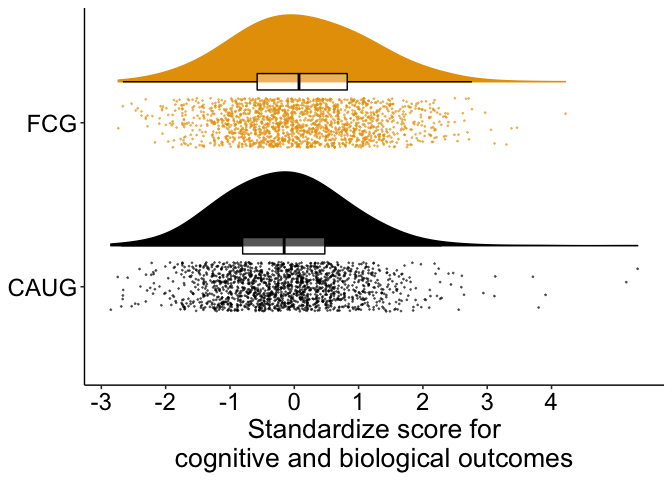<!-- -->

``` r
ggsave(
  paste0(home, "figures/aim1_cog_bio.png"),
  dpi = 600,
  width = 9, 
  height = 7
)
```

### Psychopathology

``` r
d_psy %>% 
  ggplot(aes(group, value_z)) +
  geom_flat_violin(
    aes(color = group, fill = group),
    position = position_nudge(x = .25, y = 0),
    adjust = 2,
    trim = TRUE
  ) +
  geom_point(
    aes(color = group, fill = group),
    position = position_jitter(width = .15),
    size = .25,
    alpha = 1/2
  ) +
  geom_boxplot(
    aes(x = as.numeric(group) + .25, y = value_z, group = group),
    color = "black",
    alpha = 1/3,
    width = .1,
    outlier.shape = NA
  ) +
  scale_y_continuous(breaks = seq.int(-4, 6, 1)) +
  scale_fill_manual(values = cbbPalette) +
  scale_color_manual(values = cbbPalette) +
  theme_beip +
  theme(
    legend.position = "none",
    plot.caption = element_text(hjust = .5, size = 15)
  ) +
  coord_flip() +
  labs(
    x = NULL,
    y = "Standardize score for\n symptoms of psychopathology"
  )
```

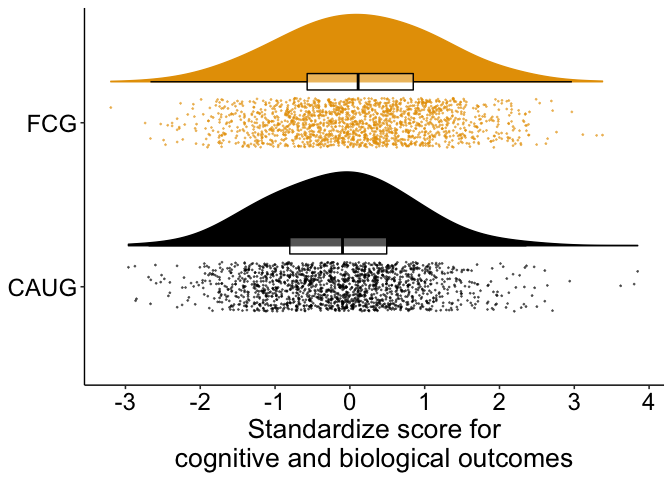<!-- -->

``` r
ggsave(
  paste0(home, "figures/aim1_psy.png"),
  dpi = 600,
  width = 9, 
  height = 7
)
```

## Aim 2 moderating effects

``` r
d_plot <-
  d_cog_bio %>% 
  dplyr::select(
    ID, 
    group, 
    male,
    wave_ordered, 
    age_years, 
    construct, 
    value_z
  ) %>% 
  bind_rows(
    d_psy %>% 
      dplyr::select(
        ID, 
        group, 
        male,
        wave_ordered, 
        age_years, 
        domain, 
        value_z
      )
  ) %>% 
  mutate(
    domain_construct_pretty = case_when(
      construct == "IQ" ~ "IQ",
      construct == "physical" ~ "Physical growth",
      construct == "EEG" ~ paste0("EEG alpha-power"),
      domain == "rad"~ "RAD",
      domain == "dsed" ~ "DSED",
      domain == "adhd" ~ "ADHD",
      domain == "extern" ~ "Externalizing",
      domain == "intern" ~ "Internalizing"
    ),
    domain_construct_pretty = fct_relevel(
      domain_construct_pretty,
      "IQ",
      "Physical growth", 
      "EEG alpha-power", 
      "DSED", 
      "RAD", 
      "ADHD", 
      "Externalizing", 
      "Internalizing"
    ),
    male = if_else(
      male == 1, "Male", "Female"
    )
  )
```

### Cognitive and biological by gender

``` r
d_plot %>% 
  filter(
    domain_construct_pretty == "IQ" | 
      domain_construct_pretty == "Physical growth" | 
      domain_construct_pretty == "EEG alpha-power"
  ) %>%
  ggplot(aes(group, value_z, fill = male, color = male)) +
  geom_boxplot(
    alpha = 1/2,
    outlier.shape = NA
  ) +
  scale_y_continuous(breaks = seq.int(-3, 3, 1)) +
  scale_color_viridis_d() +
  scale_fill_viridis_d() +
  theme_beip +
  theme(
    legend.position = "right",
    plot.caption = element_text(hjust = .5, size = 14)
  ) +
  labs(
    color = NULL,
    fill = NULL,
    x = NULL,
    y = "Cognitive and biological functioning\n(standardized score)"
  ) +
  facet_grid(~domain_construct_pretty)
```

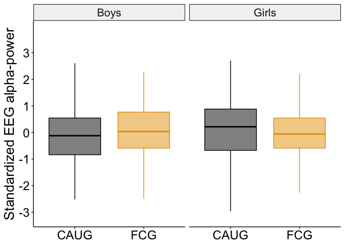<!-- -->

``` r
ggsave(
  paste0(home, "figures/aim2_cogbio_sex.png"),
  dpi = 600,
  width = 9, 
  height = 5
)
```

#### EEG by gender

``` r
d_cog_bio %>% 
  filter(construct == "EEG") %>% 
  ggplot(aes(group, value_z, fill = group, color = group)) +
  geom_boxplot(
    alpha = 1/2,
    outlier.shape = NA
  ) +
  scale_y_continuous(breaks = seq.int(-3, 3, 1)) +
  scale_fill_manual(values = cbbPalette) +
  scale_color_manual(values = cbbPalette) +
  theme_beip +
  theme(
    legend.position = "none",
    plot.caption = element_text(hjust = .5, size = 14)
  ) +
  labs(
    x = NULL,
    y = "Standardized EEG alphalpha-power"
  ) +
  facet_grid(.~male)
```

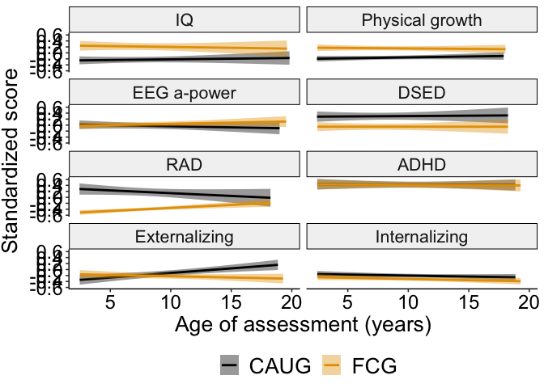<!-- -->

``` r
ggsave(
  paste0(home, "figures/aim2_EEG_sex.png"),
  dpi = 600,
  width = 9, 
  height = 7
)
```

### By domain by age of assessment

``` r
d_plot %>% 
  ggplot(aes(age_years, value_z, fill = group, color = group)) +
  geom_smooth(method = "lm") +
  scale_y_continuous(breaks = seq.int(-1, 1, .2)) +
  scale_x_continuous(breaks = seq.int(5, 20, 5)) +
  scale_fill_manual(values = cbbPalette) +
  scale_color_manual(values = cbbPalette) +
  theme_beip +
  theme(
    legend.position = "bottom",
    plot.caption = element_text(hjust = .5, size = 16),
    axis.title.y = element_text(vjust = 2)
  ) +
  #coord_flip() +
  labs(
    fill = NULL,
    color = NULL,
    x = "Age of assessment (years)",
    y = "Standardized score"
  ) +
  facet_wrap(.~domain_construct_pretty, ncol = 2)
```

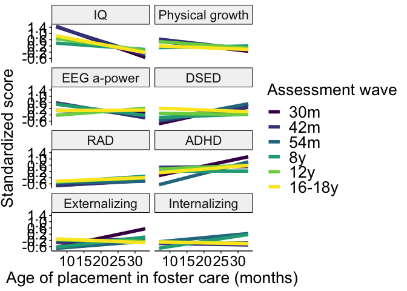<!-- -->

``` r
ggsave(
  paste0(home, "figures/aim2_all_domain_wave.png"),
  dpi = 600,
  width = 6, 
  height = 10
)
```

## Aim 3

#### Age of placement by wave

``` r
d_plot_fcg <-
  d_fcg_cog_bio %>% 
  dplyr::select(
    ID, 
    group, 
    male,
    wave_ordered, 
    FC_placement_age,
    stable,
    age_years, 
    construct, 
    value_z
  ) %>% 
  bind_rows(
    d_fcg_psy %>% 
      dplyr::select(
        ID, 
        group, 
        male,
        wave_ordered, 
        FC_placement_age,
        stable,
        age_years, 
        domain, 
        value_z
      )
  ) %>% 
  mutate(
    domain_construct_pretty = case_when(
      construct == "IQ" ~ "IQ",
      construct == "physical" ~ "Physical growth",
      construct == "EEG" ~ "EEG alpha-power",
      domain == "rad"~ "RAD",
      domain == "dsed" ~ "DSED",
      domain == "adhd" ~ "ADHD",
      domain == "extern" ~ "Externalizing",
      domain == "intern" ~ "Internalizing"
    ),
    domain_construct_pretty = fct_relevel(
      domain_construct_pretty,
      "IQ",
      "Physical growth", 
      "EEG alpha-power", 
      "DSED", 
      "RAD", 
      "ADHD", 
      "Externalizing", 
      "Internalizing"
    ),
    age_years_group = case_when(
      age_years <= 3.5 ~ "< 3.5 years",
      age_years > 3.5 & age_years <= 8 ~ "3.5–8 years",
      age_years > 8 ~ "8–18 years"
    ),
    stable = recode_factor(
      stable,
      "disrupted" = "Disrupted",
      "stable" = "Stable"
    )
  )

d_plot_fcg %>% 
  ggplot(
    aes(
      FC_placement_age, 
      value_z, 
      color = wave_ordered
    )
  ) +
  geom_smooth(method = "lm", size = 2, se = FALSE) +
  scale_y_continuous(breaks = seq.int(-1, 1.4, .4)) +
  scale_x_continuous(breaks = seq.int(0, 30, 5)) +
  scale_color_viridis_d() +
  theme_beip +
  theme(
    legend.position = "right",
    plot.caption = element_text(hjust = .5, size = 16),
    axis.title.y = element_text(vjust = 2)
  ) +
  labs(
    color = "Assessment wave",
    x = "Age of placement in foster care (months)",
    y = "Standardized score"
  ) +
  facet_wrap(.~domain_construct_pretty, ncol = 2)
```

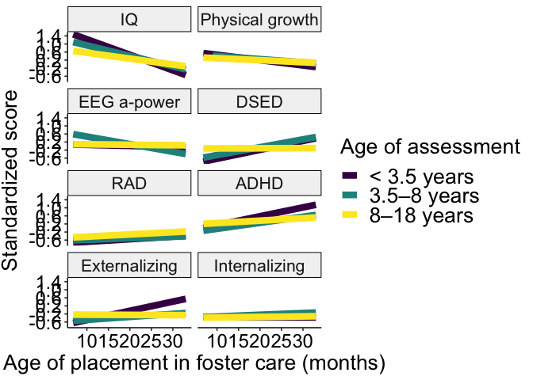<!-- -->

``` r
ggsave(
  paste0(home, "figures/aim3_all_ageplacement_domain_wave.png"),
  dpi = 600,
  width = 9, 
  height = 11
)
```

#### Age of placement by age of assessment

``` r
d_plot_fcg %>% 
  ggplot(
    aes(
      FC_placement_age, 
      value_z, 
      color = age_years_group
    )
  ) +
  geom_smooth(method = "lm", size = 3, se = FALSE) +
  scale_y_continuous(breaks = seq.int(-1, 1.4, .4)) +
  scale_x_continuous(breaks = seq.int(0, 30, 5)) +
  scale_color_viridis_d() +
  theme_beip +
  theme(
    legend.position = "right",
    plot.caption = element_text(hjust = .5, size = 16),
    axis.title.y = element_text(vjust = 2)
  ) +
  labs(
    color = "Age of assessment",
    x = "Age of placement in foster care (months)",
    y = "Standardized score"
  ) +
  facet_wrap(.~domain_construct_pretty, ncol = 2)
```

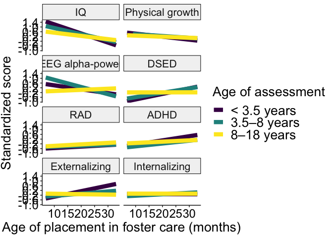<!-- -->

``` r
ggsave(
  paste0(home, "figures/aim3_all_ageplacement_domain_age.png"),
  dpi = 600,
  width = 9, 
  height = 11
)
```

#### Stability by age of assessment (geom\_smooth)

``` r
d_plot_fcg %>% 
  filter(!is.na(stable)) %>% 
  ggplot(
    aes(
      age_years, 
      value_z, 
      color = stable,
      fill = stable
    )
  ) +
  geom_smooth(method = "lm", size = 2) +
  scale_y_continuous(breaks = seq.int(-1, 1.4, .4)) +
  scale_x_continuous(breaks = seq.int(0, 30, 5)) +
  scale_color_viridis_d(begin = .5) +
  scale_fill_viridis_d(guide = FALSE, begin = .5) +
  theme_beip +
  theme(
    legend.position = "right",
    plot.caption = element_text(hjust = .5, size = 16),
    axis.title.y = element_text(vjust = 2)
  ) +
  labs(
    color = "Foster care placement",
    x = "Age of assessment (years)",
    y = "Standardized score"
  ) +
  facet_wrap(.~domain_construct_pretty, ncol = 2)
```

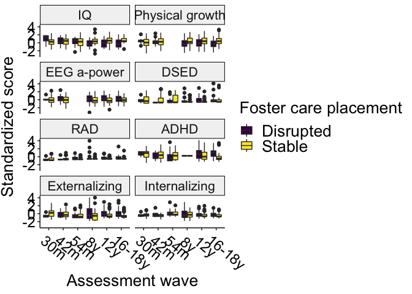<!-- -->

``` r
ggsave(
  paste0(home, "figures/aim3_all_stability_domain_age.png"),
  dpi = 600,
  width = 9, 
  height = 11
)
```

#### Stability by wave

``` r
d_plot_fcg %>% 
  filter(!is.na(stable)) %>% 
  ggplot(
    aes(
      wave_ordered, 
      value_z, 
      fill = stable
    )
  ) +
  geom_boxplot() +
  #scale_y_continuous(breaks = seq.int(-1, 1.4, .4)) +
  scale_fill_viridis_d() +
  theme_beip +
  theme(
    legend.position = "right",
    plot.caption = element_text(hjust = .5, size = 16),
    axis.title.y = element_text(vjust = 2),
    axis.text.x = element_text(angle = 320, hjust = .1)
  ) +
  labs(
    fill = "Foster care placement",
    x = "Assessment wave", 
    y = "Standardized score"
  ) +
  facet_wrap(.~domain_construct_pretty, ncol = 2)
```

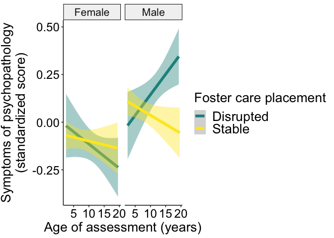<!-- -->

``` r
ggsave(
  paste0(home, "figures/aim3_all_stability_domain_wave_boxplots.png"),
  dpi = 600,
  width = 9, 
  height = 11
)
```

#### Stability by sex (geom\_smooth)

``` r
d_plot_fcg %>% 
  filter(!is.na(stable)) %>% 
  mutate(
    male = recode_factor(
      male,
      "0" = "Female",
      "1" = "Male"
    )
  ) %>% 
  ggplot(
    aes(
      age_years, 
      value_z, 
      color = stable,
      fill = stable
    )
  ) +
  geom_smooth(method = "lm", size = 2) +
  #scale_y_continuous(breaks = seq.int(-1, 1.4, .4)) +
  scale_x_continuous(breaks = seq.int(0, 30, 5)) +
  scale_color_viridis_d(begin = .5) +
  scale_fill_viridis_d(guide = FALSE, begin = .5) +
  theme_beip +
  theme(
    legend.position = "right",
    plot.caption = element_text(hjust = .5, size = 16),
    axis.title.y = element_text(vjust = 2)
  ) +
  labs(
    color = "Foster care placement",
    x = "Age of assessment (years)",
    y = "Symptoms of psychopathology\n(standardized score)"
  ) +
  facet_wrap(.~male, ncol = 2)
```

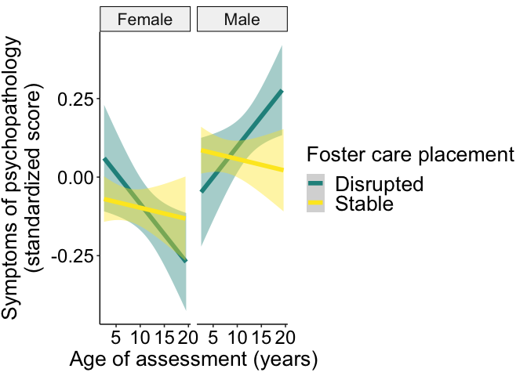<!-- -->

``` r
ggsave(
  paste0(home, "figures/aim3_all_stability_sex_age.png"),
  dpi = 600,
  width = 11, 
  height = 6
)
```
